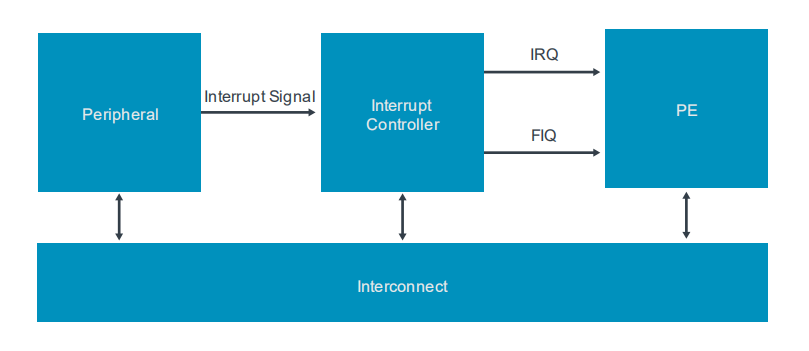
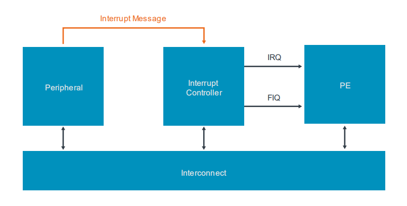
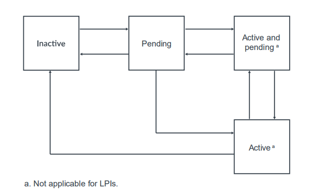
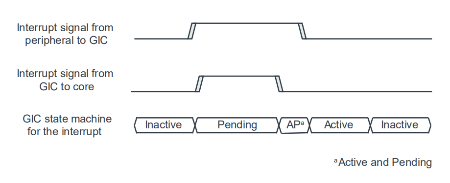
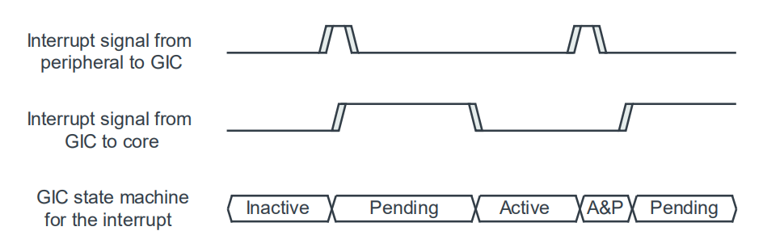
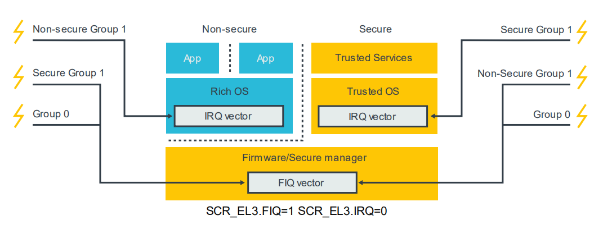
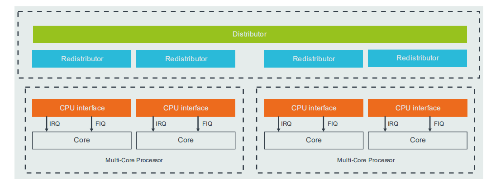

# 1. Arm CoreLink GIC fundamentals

在本节中，我们会看看`Arm CoreLink GIC`V3和v4的中断控制器的基本操作。

## 1.1 Interrupt types

GIC可以处理四种不同类型的中断源(`interrupt sources`)：
- `Shared Peripheral Interrupt (SPI)`：外设中断，可以传递到任何的核心。
- `Private Peripheral Interrupt (PPI)`：可对一个核心进行私有处理的外设中断。PPI的一个例子是来`Generic Timer`产生的中断。
- `Software Generated Interrupt (SGI)`：SGI通常用于处理器间的通信，并通过对GIC中的`SGI register`的写入来生成。
- `Locality-specific Peripheral Interrupt (LPI)`：LPI最初在GICV3中引入，并且具有与其他三种类型的中断有非常不同的编程模型。

每个中断源(`interrupt source`)都是由一个`ID`号来识别的，它被称为一个`INTID`。
中断类型是根据INTID的范围定义的：

INTID| Interrupt Type | Notes
---|---|---
0 ~ 15 | SGI | Banked pre PE
16 ~ 31 | PPI | Banked pre PE
32 ~ 1019 | SPI | -
1020 ~ 1023 | Special interrupt number | Used to signal special cases
1024 ~ 8191 | Reserved | -
8192 and greater | LPI | The upper boundary is `IMPLEMENTATION DEFINED`

### 1.1.1 How interrupts are signaled to the interrupt controller

一般来说，中断是使用专用硬件信号从外围设备发送到中断控制器的信号，如下图所示：



Arm CoreLink GICv3支持此模型，但也提供了一个额外的信令机制：`message-signaled interrupt(MSI)`。
`MSI`是通过写入到中断控制器中的寄存器来进行传输信号的，你可以在这里看到的：



使用消息将中断从外围设备转发到中断控制器的方法，可以消除了每个中断源的专用信号的要求。
对于大型系统的设计者来说，这可能是一个优势，可能有数百甚至数千个信号被路由到SoC并汇聚到中断控制器上。

中断是作为消息发送还是使用专用信号对中断处理代码处理中断的方式影响不大。 可能需要对外围设备进行一些配置。
例如，可能需要指定中断控制器的地址。此外围设备配置超出了本指南的适用范围。

在ARM CooreLink GICv3中，SPI可以是消息信号中断，也可以不是。但是LPI始终都是消息信号中断。
不同的中断类型使用不同的寄存器，如下表所示：

Interrupt Type | Registers
---|---
SPI | `GICD_SETSPI_NSR` asserts an interrupt</br>`GICD_CLRSPI_NSR` de-asserts an interrupt
LPI | `GITS_TRANSLATER`

## 1.2 Interrupt state machine

中断控制器为每个`SPI`、`PPI`和`SGI`类型的中断源维护一个状态机。此状态机包括以下四种状态：
- `Inactive`：中断源信号不活跃
- `Pending`：中断源信号活跃，但是`PE`没有应答。
- `Active`：中断源信号活跃，`PE`已经应答。
- `Active` and `Pending`：中断的一个实例已被确认，另一个实例正在等待处理。

状态机如下图所示：



中断的生命周期，取决于它是否被配置为电平敏感(`level-sensitive`)或边缘触发(`edge-triggered`)：
- 对于电平敏感的中断，中断输入上的上升沿将导致该中断变为`pending`状态，并且该中断保持置信号活跃，直到外设中断信号不活跃为止。
- 对于边沿敏感的中断，中断输入上的上升沿将导致该中断变为`pending`状态，但该中断信号不活跃。

> 集成电路的数据手册中经常出现assert和deassert二个单词，有很多人把assert译成“断言”，但是我觉得是信号级别的`active`与`deactive`。

### 1.2.1 Level sensitive interrupts

下图显示了中断状态转换如何对应中断信号：



依次考虑各状态转换：
- `Inactive` to `pending`：当中断源信号活跃时，中断状态从`inactive`变为`pending`。此时，如果中断是`enable`，并且具有足够的优先级，GIC将中断信号交给`PE`。
- `Pending` to `active and pending`：当`PE`通过去读`CPU interface`的`Interrupt Acknowledge Registers(IAR)`寄存器来响应中断时，中断从`pending`变为`active and pending`。通常是在发生中断异常后执行的中断处理例程中。此时，GIC使中断信号不活跃。
- `Active and pending` to `active`：当外设的中断源信号不活跃时，中断从`active and pending`变为`active`。这通常发生在响应软件写入外设的状态寄存器时。
- `Active` to `inactive`：当`PE`写入`CPU interface`中的`End of Interrupt (EOI)`寄存器时，中断将从`Active`变为`inactive`状态。这表明`PE`已经完成了中断处理。

### 1.2.2 Edge-triggered interrupts

下图显示了中断状态转换如何对应中断信号：



依次考虑各状态转换：
- `Inactive` to `pending`：当中断源信号活跃时，中断从`inactive`变为`pending`。此时，如果中断是`enable`，并且具有足够的优先级，GIC将中断信号交给`PE`。
- `Pending` to `active`：当`PE`通过读取`CPU interface`中的`IAR`寄存器来确认中断时，中断从`pending`变为`active`状态。通常是中断处理例程中。 然而，软件也可以轮询`IAR`。 此时，GIC将中断信号不活跃，并交给`PE`。
- `Active` to `active and pending`：如果外围设备重新发送中断信号，中断将从`active`到`active and pending`状态。
- `Active and pending` to `pending`：当`PE`写入`CPU interface`中的`EOI`寄存器时，中断从`Active and pending`变为`pending`。这表示`PE`已完成处理中断的第一个实例。此时，GIC会向`PE`重新让中断信号活跃。

## 1.3 Target interrupts

Arm体系结构为每个`PE`分配一个层次结构化的标识符，也被称为`affinity`。
GIC使用`affinity`特定目标`core`来响应中断。

`affinity`是一个`32-bit`的值，它被分成`4`个字段：
```
    <affinity level 3>.<affinity level 2>.<affinity level 1>.<affinity level 0>
```
`MPIDR_EL1`系统寄存器，提供PE的`affinity`。

不同层次的`affinity`的确切含义是由特定的`processor`和`SoC`定义的。例如，`Arm Cortex-A53`与`Arm Cortex-A57`处理器使用：
```
    <group of groups> . <group of processors> . <processor> . <core>
```
在`Arm Cortex-A55`和`Arm Cortex-A76`处理器使用：
```
    <group of processors> . <processor> . <core> . <thread>
```

例如，移动设备的SoC可以有这样的布局：
```
    0.0.0.[0:3] Cores 0 to 3 of a Cortex-A53 processor
    0.0.1.[0:1] Cores 0 to 1 of a Cortex-A57 processor
```

## 1.4 Security model

`Arm CoreLink GICv3`架构支持`Arm TrustZone technology`。
每个`INTID`必须由软件分配一个`Group`和`security setting`。
`GICv3`支持三种设置组合，如下表所示：

Interrupt Type | Example use
---|---
Secure Group 0 | Interrupts for EL3 (Secure Firmware)
Secure Group 1 | Interrupts for Secure EL1 (Trusted OS)
Non-secure Group 1 | Interrupts for the Non-secure state (OS or Hypervisor)

`Group 0`中断始终被标记为`FIQ`。
`Group 1`中断可以选择为`IRQ`或`FIQ`，
可以在此处看到：

EL and Security state of PE | Group 0 | Group 1 Secure | Group 1 Non-secure
---|---|---|---
Secure El0/1 | FIQ | IRQ | FIQ
Non-secure EL0/1/2 | FIQ | FIQ | IRQ
EL3 | FIQ | FIQ | FIQ

这些规则旨在补充`AArch64 security state`和`Exception Level`的路由控制。
下图显示了一个简化的软件堆栈，以及在`EL0`执行时，当发出不同类型的中断信号时会发生什么：



在本例中，`IRQ`被路由到EL1(`SCR_EL3.IRQ==0`)，`FIQ`被路由到EL3(`SCR_EL3.FIQ==1`)。
考虑到上述规则，当在`EL1`或`EL0`处执行时，针对当前`Security state`的`Group 1`中断被视为`IRQ`。

其他安全状态的中断触发`FIQ`，异常被带到`EL3`。 这表示在`EL3`执行的软件需要的上下文切换。

### 1.4.1 Impact on software

软件通过配置中断控制器，将`INITD`进行分组。
只有在`Secure`状态下执行的软件，才能将`INTID`分配给中断组。

通常，只有在安全状态下执行的软件才能访问`Secure interrupts`的`settings`和`state`：`Group 0`与`Secure Group 1`。

可以启用从`Non-secure state`到` Secure interrupt`的设置和状态访问。
这是单独控制每个`INTID`，使用`GICD_NSACRn`和`GICR_NSACR`寄存器。

> 注意：LPI总是被视为`Non-secure Group 1`组的中断。

### 1.4.2 Support for single Security state

GICv3支持`Arm Trust Zone`技术，但使用`Trust Zone`是可选的。
这意味着你可以将实现为仅具有一个安全状态或两个安全状态：
- `GICD_CTLR.DS == 0`：支持两个安装状态，即`Secure`与`Non-secure`。
- `GICD_CTLR.DS == 1`：仅支持一个`Security state`。


通常，这意味着可以将GIC连接到支持两个安全状态的`Arm Cortex-A profile`的处理器，或连接到支持一个安装状态的`Arm Cortex-R profile`的处理器。

## 1.5 Programmer’s model

GICv3中断控制器的寄存器接口分为三组：
- Distributor interface
- Redistributor interface
- CPU interface

这些接口的情况如下图所示：



通常，`Distributor`和`Redistributor`用于配置中断，`CPU interface`用于处理中断。

### 1.5.1 Distributor (GICD_*)

为了方便理解，我们把`Distributor`看成经销商。

`Distributor`寄存器是`memory-mapped`，用与配置`SPI`。`Distributor`提供编程接口：
- 中断优先级与分销SPI
- `Enable`或`Disable`SPI
- 设置每个SPI的优先级
- 每个SPI的路由信息
- 每个SPI设置为水平触发或边缘触发
- 产生SPI的消息信号
- 控制SPI的`active`与`pending`状态
- 明确在每个`Security state`下使用的编程模型：`affinity routing`或`legacy`。

> Shared Peripheral Interrupt (SPI)

### 1.5.2 Redistributors (GICR_*)

为了方便理解，我们把`Redistributor`看成二级经销商。

`Redistributor`与`core`一一对应，一个core连接一个`Redistributor`。`Redistributor`提供编程接口：
- `Enabel`或`Disable`SGI/PPI
- 设置SGI/PPI的优先级
- 每个PPI设置为水平触发或边缘触发
- 分配每个SGI/PPI到一个中断组
- 控制SGI/PPI的状态
- 控制内存中数据结构的基地址，支持LPI的关联的中断属性和挂起状态
- 为连接的`PE`提供电源管理支持

> Software Generated Interrupt (SGI) & Private Peripheral Interrupt (PPI)

### 1.5.3 CPU interfaces (ICC_*_ELn)

每个核心都包含一个`CPU interface`，它是在中断处理期间使用的系统寄存器。`CPU interfaces`提供编程接口：
- 提供通用控制与配置去使能中断处理
- 应答中断
- `priority drop`与`deactivation of interrupts`
- 为`PE`设置一个中断优先级掩码(`interrupt priority mask`)
- 定义`PE`的抢占策略(`preemption policy`)
- 明确`PE`处于`pending`状态的最高优先级

在ARM CoreLink GICv3中，`CPU interface`寄存器是系统寄存器：`ICC_*_ELn`。
软件在使用这些寄存器之前必须启用系统寄存器接口。
这是由`ICC_SRE_ELn`寄存器中的`SRE bit`控制的，其中`n`指定异常级别：`EL1 ~ EL3`。