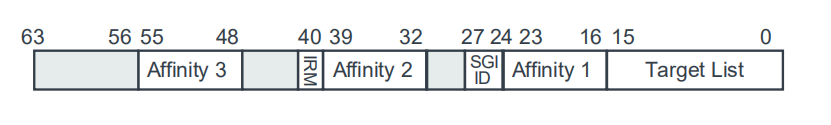
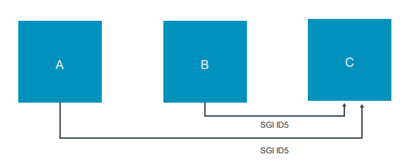

# 1. Sending and receiving Software Generated Interrupts

`Soft ware Generated Intervention(SGI)`是软件可以通过写入中断控制器中的寄存器来触发的中断。

## 1.1 Generating SGIs

通过写入`CPU Interface`中的以下`SGI`寄存器之一来生成SGI中断：

System register interface | Description
---|---
ICC_SGI0R_EL1 | 生成`Secure Group 0`中断(Secure Firmware)
ICC_SGI1R_EL1 | 生成`Secure Group 1`中断(Trusted OS)
ICC_ASGI1R_EL1 | 生成`Non-secure Grup 1`中断(OS or Hypervisor)

您可以在下图中看到SGI寄存器的基本格式：

### 1.1.1 Controlling the SGI ID

`SGI ID`字段控制所生成的INTID。如中断类型中所述，INTID `0 ~ 15`用于SGI。

### 1.1.2 Controlling the target

SGI寄存器中的`IRM (Interrupt Routing Mode)`字段控制发送给`PE`或`PEs`的SGI。有两种选择：
- `IRM == 0`：中断被发送到`<aff3>.<aff2>.<aff1>.<Target List>`，其中`<target list>`被编码为`1 bit`，`<aff1>`下的每个`affinity node 0`。这意味着中断最多可以发送到16个PE，其中可能包括它自己。
- `IRM == 1`：中断被发送到所有连接的PE，除了它自己。

### 1.1.3 Controlling the Security state and grouping

`Security state`与SGI分组控制是由：
- `ICC_SGI0R_EL1`，`ICC_SGI1R_EL1`或`ICC_ASGIR_EL1`是软件写入寄存器。
- `GICR_IGROUPR0`与`GICR_IGRPMODR0`是目标寄存器。

在`Secure`状态下执行的软件可以同时发送`Secure`与`Non-Secure`的SGI中断。
在`Non-Secure`状态下执行的软件是否可以生成`Secure`的SGI，这将由`GICR_NSACR`寄存器来控制。
该寄存器只能由在`Secure`状态下执行的软件访问。

下表显示了GIC通过检查来确定中断是否被转发：
- 原`PE`的`Security`状态。
- 中断目标的中断处理配置。
- `SGI`寄存器。

Security state of sending PE | SGI register writen | Configuration on receiving PE | Forward?
---|---|---|---
Secure EL3/EL1| ICC_SGI0R_EL1 | Secure Group 0 | Yes
 | |Secure Group 1 | no
 | |Non-secure Group 1 | No
 |ICC_SGI1R_EL1 | Secure Group 0 | No(*)
 | |Secure Group 1 | Yes
 | |Non-Secure Group 1 | No
 |ICC_ASGI1R_EL1 | Secure Group 0 | No
 | |Secure Group 1 | No
 | |Non-secure Group 1 | Yes
Non-secure EL2/El1 | ICC_SGI0R_EL1 | Secure Group 0 | Configurable by GICR_NSACR(*)
 | |Secure Group 1 | No
 | |Non-secure Group1 | No
 |ICC_SGI1R_EL1| Secure Group 0 | Configurable by GICR_NSACR(*)
 | |Secure Group 1 | Configurable by GICR_NSACR
 | |Non-secure Group 1 | Yes
 |ICC_ASGI1R_EL1 | Secure Group 0 | Configurable by GICR_NSACR(*)
 | |Secure Group 1 | Configurable by GICR_NSACR
 | |Non-secure Group 1 | No

> 在此表中，假设`GICD_CTLR.DS==0`。当`GICD_CTLR.DS==1`，标记为`(*)`的SGI也会被转发。

## 1.2 Comparison of GICv3 and GICv2

在ARM CoreLink GICv2中，SGI INTID由原始PE和目标PE存储。
这意味着，给定的PE可以有相同的SGI INTID`pending`最多8次，从系统中的每个PE一次。

在ARM CoreLink GICv3中，SGI只由目标PE进行存储。
这意味着，给定的PE只能有一个SGI INTID的实例`pending`。

让我们用一个例子来说明这个差异。`PE A`和`PE B`同时将SGI INTID为5发送到`PE C`，如下所示：

`PE C`将接收到多少个中断？
- GICv2：两个中断。GIC将同时接收来自`PE A`和`PE B`的中断。
这两个中断的顺序取决于个别的设计和精确的时间。
这两个中断的区别是原始PE的ID带有前缀，在GICC_IAR返回INTID。

- GICv3：一个中断。由于原始PE不存储SGI，因此同一中断不能在两个PE上`pending`。
因此，`PE C`只接收一个中断，ID为5，没有前缀。

该示例假设两个中断同时或几乎同时发送。
如果`PE C`能够在第二个SGI到达之前应答第一个SGI，
那么`PE C`将在GICv3中看到两个中断。

> 注意：在`legacy`操作期间，即`GICD_CTLR.ARE==0`时，SGI的行为与ARM CoreLink GICv2中的行为相同。