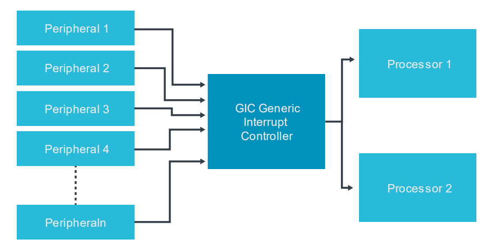

# 1. Overview

本指南概述了`ARM CoreLink Generic Interrupt Controller(GIC)`v3和v4的特性。
该指南描述了兼容GICv3的中断控制器的操作。
它还描述了如何配置GICv3中断控制器，以便在裸金属环境中使用。

本指南是关于`ARM CoreLink Generic Interrupt Controller(GIC)`的相关指南集合中的第一个：
- Arm CoreLink Generic Interrupt Controller v3 and v4: Overview
- Arm CoreLink Generic Interrupt Controller v3 and v4: Locality-specific Peripheral Interrupts
- Arm CoreLink Generic Interrupt Controller v3 and v4: Virtualization

## 1.1 Background

中断是向处理器发出的一种`signal`，表明已经发生了一个需要处理的`event`。
中断通常是由`peripherals`产生。

例如，一个系统可能会使用`Universal Asynchronous Receiver/Transmitter(UART)`接口来与外部世界进行通信。
当`UART`接收数据时，它需要一个机制来告诉处理器新的数据已经到达并准备好被处理。
`UART`可以使用的一种机制是生成一个中断来向处理器发出信号。

小型系统可能只有几个中断源和一个处理器。
然而，较大的系统可能有更多潜在的中断源和处理器。
`GIC`提供`interrupt management`、`prioritization`和`routing`等关键任务。
`GIC`将来自整个系统的所有中断进行编组，并对它们进行排序，并将它们发送到需要处理的`core`。
`GIC`主要用于提高处理器效率和`enable`中断虚拟化。

`GIC`是基于`Arm GIC architecture`来实现的。
该架构已经从`GIC V1`发展到最新版本的`GIC V3`和`GIC V4`。
ARM有几种`generic interrupt controllers`，为所有类型的Arm Cortex多核处理器系统提供一系列中断管理解决方案。
这些控制器的包括：最简单的`GIC-400`与高性能的`multi-chip`系统使用的`GIC-600`。

# 2. Before you begin

本指南介绍了GICV3和v4的基本操作，以及`Shared Peripheral Interrupt (SPIs)`、`Private Peripheral 
Interrupt (PPIs)`和`Software Generated Interrupts (SGIs)`的使用。

GICv3和GICv4允许使用几种不同的配置和使用场景。
为了简单起见，本指南集中于这些配置和使用场景的子集，其中：
- Two Security states are present.
- Affinity routing is enabled for both Security states.
- System register access is enabled at all Exception levels.
- The connected processor, or processors, are Armv8-A compliant, implement all Exception levels and use AArch64 at all Exception levels.

本指南不包括：
- Legacy operation.
- Use from an Exception level that is using AArch32.

# 3. What is a Generic Interrupt Controller?

`Generic Interrupt Controller(GIC)`从外设接收中断，对它们进行优先级排序，并将它们送到适当的处理器核心。下图显示了一个GIC，它接收到来自n个不同外围设备的中断，并将它们分配到两个不同的处理器上。

GIC是`Arm Cortex-A`和`Arm Cortex-R`的`profile`处理器的标准中断控制器。
GIC提供了一种灵活和可扩展的方法来进行中断管理，支持具有单核的系统和具有数百个核的大型系统。

## 3.1 A brief history of the Arm CoreLink GIC

与`Arm architecture`类似，`GIC architecture`也随着时间的推移而演变。 下表总结了GIC规范的主要版本和它们通常使用的处理器。

GIC version | Key features | Typically used with
---|---|---
GICv1 | Support for up to `eight PEs` Support for up to `1020 interrupt IDs` Support for `two Security states`| Arm Cortex-A5,A9 Arm Cortex-R5,R7,R8
GICv2 | All key features of GICv1 Support for `virtualization`|Arm Cortex-A7,A15,A17
GICv3 | All key features of GICv2 Support for `more than eight PEs` Support for `message-signaled interrupts` Support for `more than 1020 interrupt IDs` `System register access to the CPU Interface registers` `An enhanced security model that separates Secure and Non-secure Group 1 interrupts`|Arm Cortex-A3x,A5x,A7x
GICV4 | All key features of GICv3 `Direct injection of virtual interrupts`|Arm Cortex-A3x,A5x,A7x

本指南涵盖了Arm CoreLink GICV3和GICV4，它们被大多Arm8-A和Arm8-R所使用。

Arm CoreLink GICV3和GICV4自发布以来也收到了微小的更新：
- GICv3.1：added support additional wired interrupts, Secure virtualization and Memory System Resource Partitioning and Monitoring (MPAM)
- GICv4.1：extended virtualization support to cover `direct-injection of virtual Software Generated Interrupts (SGIs)`.
