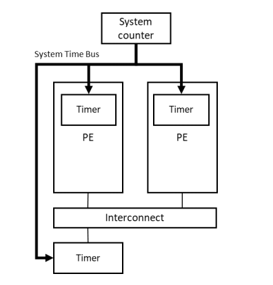

# 1. External timers

在`What is the Generic Timer`中，我们介绍了处理器中的`Timers`。系统还可能包含外部的`timers`。
下图显示了一个例子：

这些定时器的编程接口是定时器内部的编程接口，但这些定时器是通过内存映射寄存器访问的。
这些寄存器的位置由SoC实现器决定，并且应该在你使用的`SoC`的`datasheet`中报告。

来自`memory-map`映射的外部计时器的中断，通常将由`GIC`以`Shared Peripheral Interrupts(SPS)`类型传递中断。