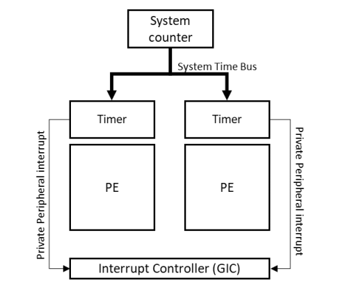

# 1. Overview

本指南介绍了通用计时器(`Generic Timer`)，`A-profile`的PE的计时器框架。
本指南介绍了现代`SoC`中计时器框架的不同组件，并涵盖了软件可用的编程接口。

该指南针对的是编写`low-level`软件以初始化或使用基于ARM的系统中的`timers`的开发人员。 

# 2. What is the Generic Timer?

通用计时器(`Generic Timer`)为ARM核心提供了一个标准化的计时器框架。
通用定时器包括一个系统计数器和一组定时器（每个核都有自己的定时器`timer`），如下图所示：

系统计数器(`System Counter`)是一种永远打开的设备，以固定频率递增方式的系统计数。
系统计数的值被广播到系统中的所有核心，使所有核心对时间有一个共同的视图。
系统计数的值是`56bit ~ 64bit`之间的位宽，频率通常在`1MHz ~ 50MHz`之间。

> 注：通用计时器只测量时间的流逝。它不报告时间或日期。通常，SoC还包含一个实时时钟(RTC)，用于时间和日期。

每个核心都有一组计时器。这些计时器是比较器(`comparators`)，与系统计数器提供的广播系统计数进行比较。软件可以配置计时器在未来产生中断或事件。软件还可以使用系统计数来添加时间戳，因为系统计数为所有核提供了统一的时间视图。

在本指南中，我们将解释`timer`和`System Counter`的操作和配置。