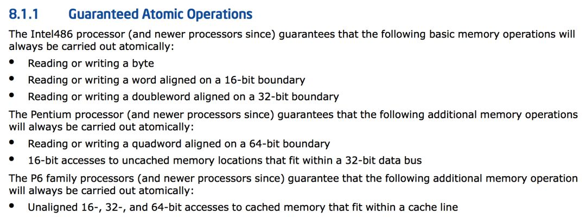
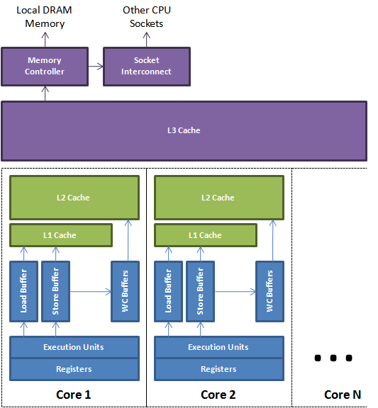
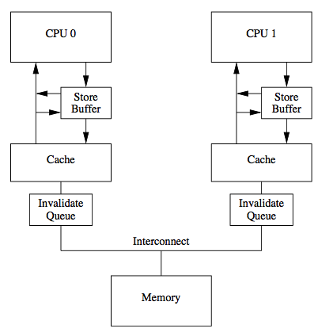
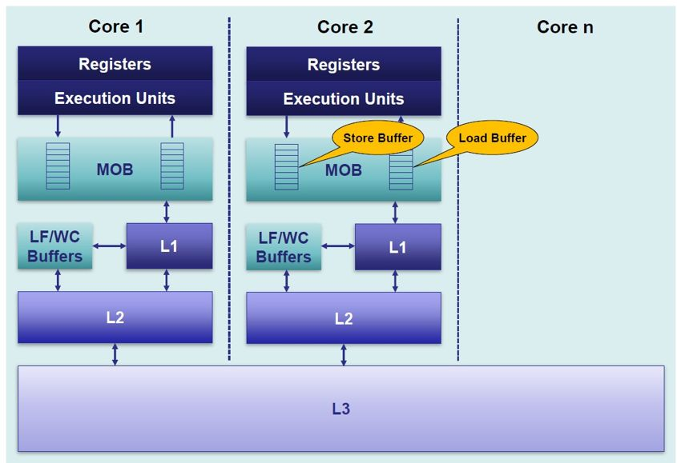
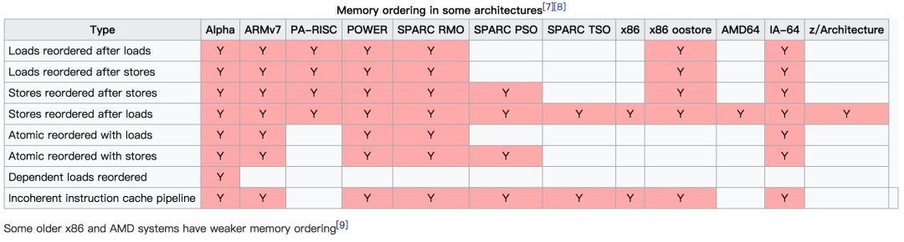
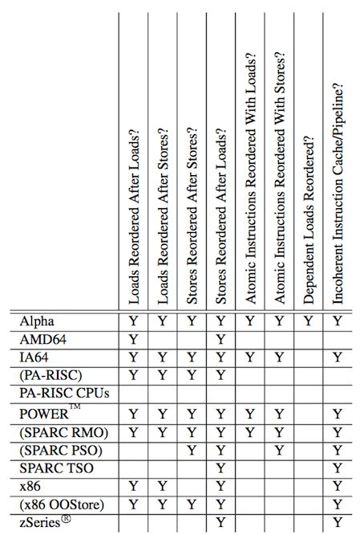
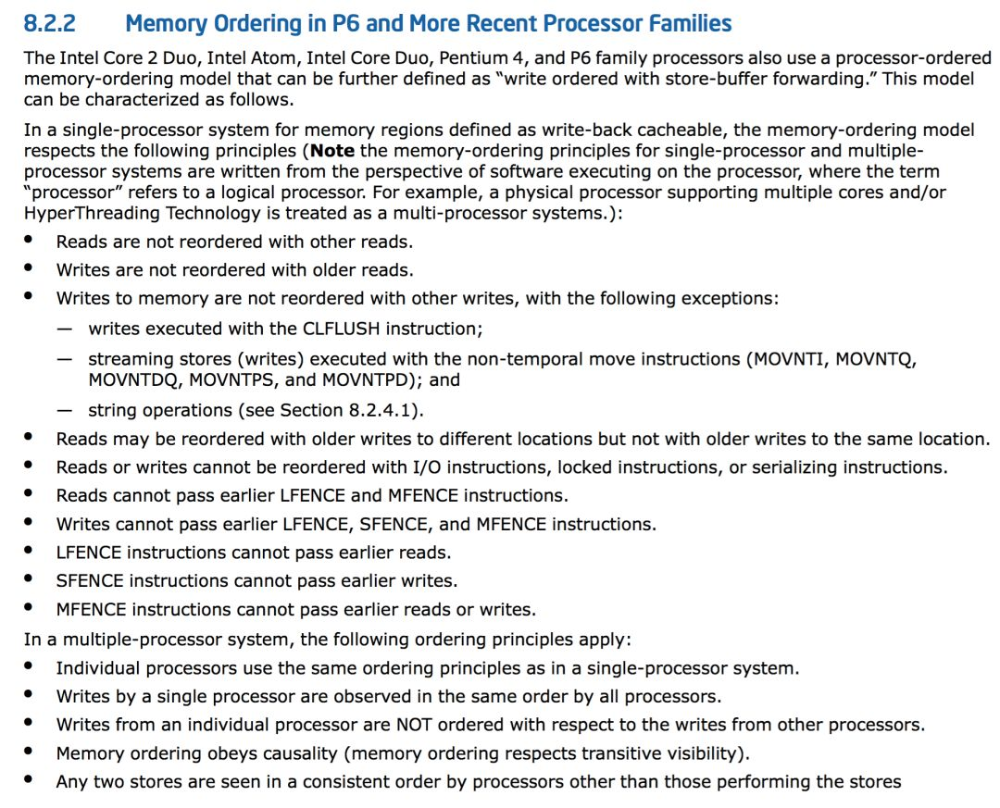
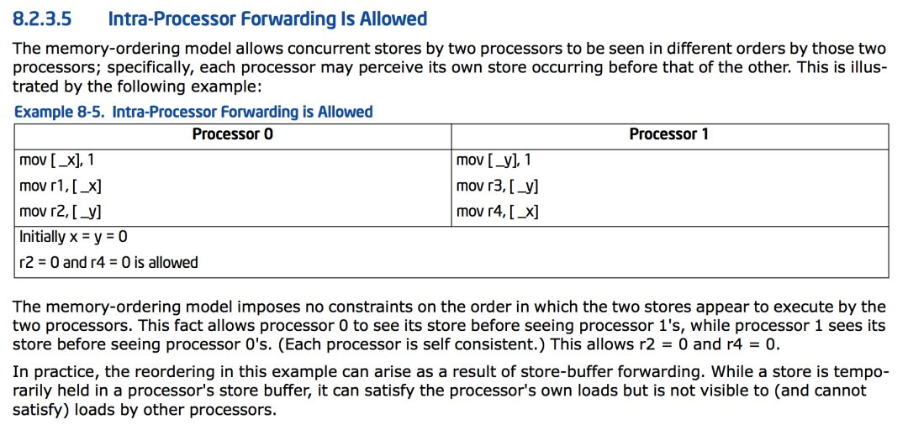
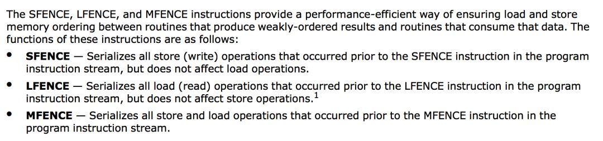

- 1 概述
- 2 屏障
    - 2.1 优化屏障
    - 2.2 内存屏障
- 3 例子

# 1. 概述

首先约定，由于CPU的架构和设计浩如烟海，本文以软件工程师的角度，只谈IA32架构，不讨论其他架构的细节和差异。并且文章中主要引用Intel的文档予以佐证，不关注AMD在实现细节上的差异。

众所周知，当一个执行中的程序的数据被多个执行流并发访问的时候，就会涉及到**同步（Synchronization）**的问题。

同步的目的是**保证不同执行流对共享数据并发操作的一致性**。


早在单核时代，使用**锁**或者**原子变量**就很容易达成这一目的。

甚至因为CPU的一些访存特性，对某些**内存对齐数据的读或写也具有原子的特性**。

比如，在《Intel® 64 and IA-32 Architectures Software Developer’s Manual》的第三卷System Programming Guide的Chapter 8 Multiple-Processor Management里，就给出了这样的说明：



也就是说，有些内存对齐的数据的访问在CPU层面就是原子进行的（注意这里说的只是单次的读或者写，类似普通变量i的i++操作不止一次内存访问）。

此时，环形队列（Ring buffer）这种数据结构在某些架构的单核CPU上，只有一个Reader和一个Writer的情况下是不需要额外同步措施的。

原因就是read\_index和writer\_index的写操作在满足**对齐内存访问的情况下**是原子的，不需要额外的同步措施。

- 注意这里我加粗了**单核CPU**这个关键字，那么到了多核心处理器的今天，该操作就不是原子了吗？

不，依旧是原子的，但是出现了其他的干扰因素迫使可能需要额外的同步措施才能保证原本无锁代码的正确运行。

首先是现代编译器的代码优化和编译器指令重排可能会影响到代码的执行顺序。
编译期指令重排是通过调整代码中的指令顺序，在不改变代码语义的前提下，对变量访问进行优化。从而尽可能的减少对寄存器的读取和存储，并充分复用寄存器。

但是编译器对数据的依赖关系判断只能在单执行流内，无法判断其他执行流对竞争数据的依赖关系。就拿无锁环形队列来说，如果Writer做的是先放置数据，再更新索引的行为。如果索引先于数据更新，Reader就有可能会因为判断索引已更新而读到脏数据。

- 那禁止编译器对该类变量的优化，解决了编译期的重排序就没事了吗？

不，CPU还有 **乱序执行（Out-of-Order Execution）** 的特性。
** 流水线（Pipeline）** 和乱序执行是现代CPU基本都具有的特性。机器指令在流水线中经历取指、译码、执行、访存、写回等操作。为了CPU的执行效率，流水线都是并行处理的，在不影响语义的情况下。**处理器次序（Process Ordering，机器指令在CPU实际执行时的顺序）** 和 **程序次序（Program Ordering，程序代码的逻辑执行顺序）** 是 **允许不一致的**，即满足 **As-if-Serial** 特性。

显然，这里的不影响语义依旧只能是保证指令间的**显式因果关系**，无法保证**隐式因果关系**。即无法保证语义上不相关但是在程序逻辑上相关的操作序列按序执行。

从此单核时代CPU的**Self-Consistent**特性在多核时代已不存在，多核CPU作为一个整体看，不再满足**Self-Consistent**特性。

开始提到Cache一致性协议之前，先介绍两个名词：
- Load/Read CPU读操作，是指将内存数据加载到寄存器的过程
- Store/Write CPU写操作，是指将寄存器数据写回主存的过程

现代处理器的缓存一般分为三级，由每一个核心独享的L1、L2 Cache，以及所有的核心共享L3 Cache组成：



由于Cache的容量很小，一般都是充分的利用局部性原理，按**行/块**来和主存进行批量数据交换，以提升数据的访问效率。

既然各个核心之间有独立的Cache存储器，那么这些存储器之间的数据同步就是个比较复杂的事情。

缓存数据的一致性由缓存一致性协议保证。这里比较经典的当属MESI协议。Intel的处理器使用从MESI中演化出的MESIF协议，而AMD使用MOESI协议。
缓存一致性协议的细节超出了本文的讨论范围，有兴趣的读者可以自行研究。


传统的MESI协议中有两个行为的执行成本比较大。一个是将某个Cache Line标记为Invalid状态，另一个是当某Cache Line当前状态为Invalid时写入新的数据。
所以CPU通过Store Buffer和Invalidate Queue组件来降低这类操作的延时。如图：



当一个核心在Invalid状态进行写入时，首先会给其它CPU核发送Invalid消息，然后把当前写入的数据写入到Store Buffer中。然后异步在某个时刻真正的写入到Cache Line中。

当前CPU核如果要读Cache Line中的数据，需要先扫描Store Buffer之后再读取Cache Line（Store-Buffer Forwarding）。但是此时其它CPU核是看不到当前核的Store Buffer中的数据的，要等到Store Buffer中的数据被刷到了Cache Line之后才会触发失效操作。

而当一个CPU核收到Invalid消息时，会把消息写入自身的Invalidate Queue中，随后异步将其设为Invalid状态。和Store Buffer不同的是，当前CPU核心使用Cache时并不扫描Invalidate Queue部分，所以可能会有极短时间的脏读问题。

当然这里的Store Buffer和Invalidate Queue的说法是针对一般的SMP架构来说的，不涉及具体架构。事实上除了Store Buffer和Load Buffer，流水线为了实现并行处理，还有Line Fill Buffer/Write Combining Buffer 等组件。




# 2. 屏障

- 编译器优化乱序：使用 **优化屏障 (Optimization Barrier)** 解决。
- CPU乱序执行：使用 **内存屏障 (Memory Barrier)** 解决。

## 2.1 优化屏障

优化屏障 (Optimization Barrier)：避免编译器的重排序优化操作，保证编译程序时在优化屏障之前的指令不会在优化屏障之后执行。这就保证了编译时期的优化不会影响到实际代码逻辑顺序。

IA-32/AMD64架构上，在Linux下常用的GCC编译器上，优化屏障定义为（include/linux/compiler-gcc.h）：
```c
/* Optimization barrier */

/* The "volatile" is due to gcc bugs */
#define barrier() __asm__ __volatile__("": : :"memory")
```

优化屏障告知编译器：
1. 内存信息已经修改，屏障后的寄存器的值必须从内存中重新获取。
2. 必须按照代码顺序产生汇编代码，不得越过屏障。

> C的volatile关键字也能起到优化限制的作用，C中的volatile不提供任何防止乱序的功能，也并不保证访存的原子性。

## 2.2 内存屏障

内存屏障 (Memory Barrier)分为**写屏障（Store Barrier**）、**读屏障（Load Barrier）**和**全屏障（Full Barrier）**，其作用有两个：
1. 防止指令之间的重排序
2. 保证数据的可见性

关于第1，关于指令重排，这里不考虑架构的话，Load和Store两种操作会有Load-Store、Store-Load、Load-Load、Store-Store这四种可能的乱序结果。 上文提到的三种屏障则是限制这些不同乱序的机制。

关于第2，写屏障会阻塞直到把Store Buffer中的数据刷到Cache中；读屏障会阻塞直到Invalid Queue中的消息执行完毕。以此来保证核间各级数据的一致性。

这里要强调，内存屏障解决的只是顺序一致性的问题，不解决Cache一致性的问题（这是Cache一致性协议的责任，也不需要程序员关注）。
Store Buffer和Load Buffer等组件是属于流水线的一部分，和Cache无关。这里一定要区分清楚这两点，Cache一致性协议只是保证了Cache一致性（Cache Coherence），但是不关注顺序一致性（Sequential Consistency）的问题。

比如，一个处理器对某变量A的写入操作仅比另一个处理器对A的读取操作提前很短的一点时间，那就不一定能确保该读取操作会返回新写入的值。这个新写入的值多久之后能确保被读取操作读取到，这是内存一致性模型（Memory Consistency Models）要讨论的问题。

完全的确保顺序一致性需要很大的代价，不仅限制编译器的优化，也限制了CPU的执行效率。为了更好地挖掘硬件的并行能力，现代的CPU多半都是介于两者之间，即所谓的宽松的内存一致性模型（Relaxed Memory Consistency Models）。不同的架构在重排上有各自的尺度，在严格排序和自由排序之间会有各自的偏向。偏向严格排序的一边，称之为强模型（Strong Model），而偏向于自由排序的一边，称之为弱模型（Weak Model）。AMD64架构是強模型：



特别地，早先时候，AMD64架构也会有Load-Load乱序发生（Memory Ordering in Modern Microprocessors, PaulE.McKenney, 2006）。



注意这里的IA-64（Intanium Processor Family）是弱模型，它和Intel® 64不是一回事。后者是从AMD交叉授权来的，源头就是AMD64架构。这里不讨论历史，只需要知道平时说的x86-64/x64就是指的AMD64架构即可。

《Intel® 64 and IA-32 Architectures Software Developer’s Manual》有如下的阐述：



简单翻译一下：

- 读操作之间不能重新排序
- 写操作不能跟旧的读操作排序
- 主存写操作不能跟其他的写操作排序，但是以下情况除外：
    - 带有CLFLUSH（失效缓存）指令的写操作
    - 带有non-temporal move指令的流存储（写入）（MOVNTI, MOVNTQ, MOVNTDQ, MOVNTPS, 和 MOVNTPD，都是SSE/SSE2扩展的指令）
    - 字符串操作（REP STOSD等）

- 不同内存地址的读可以与较早的写排序，同一地址的情况除外
- 对I/O指令、锁指令、序列化指令的读写不能重排序
- 读不能越过较早的读屏障指令（LFENCE）或者全屏障指令（MFENCE）
- 写不能越过较早的读屏障指令（LFENCE）、写屏障指令（SFENCE）和全屏障指令（MFENCE）
- 读屏障指令（LFENCE）不能越过较早的读
- 写屏障指令（SFENCE）不能越过较早的写
- 全屏障指令（MFENCE）不能越过较早的读和写

在多处理器的情况下，单处理器内部的内存访问排序仍然依照以上的原则，并且规定处理器与处理器之间遵循如下的原则：
- 某个处理器的全部写操作以同样的顺序被其它处理器观察到
- 不同处理器之间的写操作不重排序
- 排序遵循逻辑上的因果关系
- 第三方总是观察到一致的写操作顺序


但是内存一致性模型不仅仅是没有指令重排就会保证一致的。但是如果仅仅只考虑指令重排，完全按照该规则来思考，就会遇到违反直觉的事情。
特别的，在对写缓存的同步处理上，AMD64内存访问模型的 Intra-Processor Forwarding Is Allowed这个特性比较要命：



只考虑指令重排的话，出现这个现象的原因就是Intel对Store Buffer的处理上，Store Buffer的修改对其他CPU核心是不可见的。

Processor 0对\_x的修改缓存在了Processor 0的Store Buffer中，还未提交到L1 Cache，自然也不会失效掉Processor 1的L1 Cache中的相关行。Processor 1对\_y的修改同理。


对于以上问题，AMD64提供了三个内存屏障指令来解决：



- sfence指令为写屏障（Store Barrier），作用是：
    - 保证了sfence前后Store指令的顺序，防止Store重排序
    - 通过刷新Store Buffer保证sfence之前的Store要指令对全局可见

- lfence指令读屏障（Load Barrier），作用是：
    - 保证了lfence前后的Load指令的顺序
    - 防止Load重排序刷新Load Buffer

- mfence指令全屏障（Full Barrier），作用是：
    - 保证了mfence前后的Store和Load指令的顺序，防止Store和Load重排序
    - 保证了mfence之后的Store指令全局可见之前，mfence之前的Store指令要先全局可见

# 3. 例子

include/linux/kfifo.h
```c
unsignedint __kfifo_put (struct kfifo *fifo, const unsigned char*buffer, unsigned int len)
{

    unsigned int l;

    len = min(len, fifo->size - fifo->in + fifo->out);

    /*
    
    * Ensure that we sample the fifo->out index -before- we
    
    * start putting bytes into the kfifo.
    
    */

    smp_mb();
    
    /* first put the data starting from fifo->in to buffer end */
    
        l = min(len, fifo->size - (fifo->in & (fifo->size - 1)));
    
        memcpy(fifo->buffer + (fifo->in & (fifo->size - 1)), buffer, l);
    
    /* then put the rest (if any) at the beginning of the buffer */

    memcpy(fifo->buffer, buffer + l, len - l);

    /*
    
    * Ensure that we add the bytes to the kfifo -before-
    
    * we update the fifo->in index.
    
    */

    smp_wmb();

    fifo->in += len;

    return len;

}

unsigned int __kfifo_get(struct kfifo *fifo, unsigned char *buffer, unsigned int len)

{

    unsigned int l;
    
    len = min(len, fifo->in - fifo->out);
    
    /*
    
    * Ensure that we sample the fifo->in index -before- we
    
    * start removing bytes from the kfifo.
    
    */
    
    smp_rmb();
    
    /* first get the data from fifo->out until the end of the buffer */
    
    l = min(len, fifo->size - (fifo->out & (fifo->size - 1)));
    
    memcpy(buffer, fifo->buffer + (fifo->out & (fifo->size - 1)), l);
    
    /* then get the rest (if any) from the beginning of the buffer */
    
    memcpy(buffer + l, fifo->buffer, len - l);
    
    /*
    
    * Ensure that we remove the bytes from the kfifo -before-
    
    * we update the fifo->out index.
    
    */
    
    smp_mb();
    
    fifo->out += len;
    
    return len;
    
}
```

代码中的smp\_wmb()、smp\_rmb()和smp\_mb()在AMD64架构上分别对应sfence、lfence、mfence指令。

但是Linux Kernel的代码要兼容所有的SMP架构，还要考虑很多弱内存模型的架构。

所以这里的内存同步操作很多，但是不一定在AMD64上是必要的。当然，如果要考虑跨平台跨架构的代码，这样做是最保险的。

