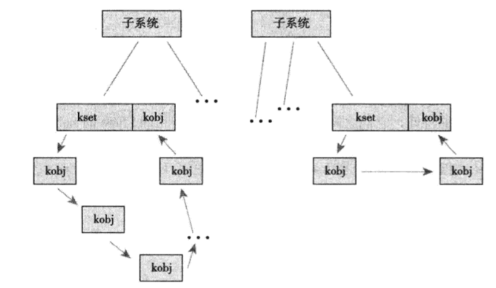

**Linux设备模型**
- 1 基本概念
    - 1.1 设备模型
    - 1.2 设备类型
    - 1.3 Kobject
    - 1.4 Ktype
    - 1.5 Kset
    - 1.6 Kobject、Ktype与Kset的相互关系
- 2 管理和操作kobject
    - 2.1 声明初始化
    - 2.2 引用计数
    - 2.3 sysfs
        - 2.3.1 sysfs中添加和删除kobject
        - 2.3.2 向sysfs中添加文件
        - 2.3.3 内核事件层

# 1 基本概念

## 1.1 设备模型

&nbsp;&nbsp;&nbsp;&nbsp;统一设备模型（device model）。设备模型提供了一个独立的机制专门来表示设备，并描述其在系统中的拓扑结构，从而使得系统具有以下优点：

- 代码重复最小化
- 提供诸如引用计数这样的统一机制。
- 可以列举系统中所有的设备，观察它们的状态，并且查看它们连接的总线。
- 可以将系统中的全部设备结构以树的形式完整、有效地展现出来————包括所有的总线和内部链接。
- 可以将设备与其对应的驱动联系起来，反之亦然。
- 可以将设备安装类型加以归类，比如分类为输入设备，而无需理解物理设备的拓扑结构。
- 可以沿设备的叶子向其根的方向依次遍历，以保证能以正确顺序关闭各设备的电源。

&nbsp;&nbsp;&nbsp;&nbsp;最后一点是实现设备模型的最初动机。若想在内核中实现智能的电源管理，就需要建立表示系统中设备拓扑关系的树结构。当在树上端的设备关闭电源时，内核必须首先关闭该设备节点以下（处于叶子上的）设备电源。

&nbsp;&nbsp;&nbsp;&nbsp;比如内核需要关闭一个USB鼠标，然后才可以关闭USB控制器；同样内核也必须在关闭PCI总线前先关闭USB控制器。简而言之，若要准确而又高效地完成上述电源管理目标，内核无疑需要一个设备树。

## 1.2 设备类型

&nbsp;&nbsp;&nbsp;&nbsp; 在Linux以及所有Unix系统中，设备被分为以下三种类型：

- 块设备
- 字符设备
- 网络设备

&nbsp;&nbsp;&nbsp;&nbsp; 块设备通常缩写为blkdev，它是可寻址的，寻址以块为单位，块大小随设备不同而不同；块设备通常支持重定位（seeking）操作，也就是对数据的随机访问。块设备的例子有硬盘、光盘，还有如U盘这样的存储设备。块设备是通过称为“块设备节点”的特殊文件来访问的，并且通常被挂载为文件系统。

&nbsp;&nbsp;&nbsp;&nbsp; 字符设备通常缩写为cdev，它是不可寻址的，仅提供数据的流式访问，就是一个个字符或者一个个字节。字符设备的例子有键盘、鼠标、串口，还有大部分伪设备。字符设备是通过称为“字符设备节点”的特殊文件来访问的。与块设备不同，应用程序通过直接访问设备节点与字符设备交互。

&nbsp;&nbsp;&nbsp;&nbsp; 网络设备是最常见的类型有时也已以太网设备（etherent devices）来称呼，它提供了对网络（例如 Internet）的访问，这是通过一个物理适配器和一种特定的协议进行的。网络设备打破了Unix的"一切皆文件"的设计原则，它不是通过设备节点来访问，而是通过套接字API这样的特殊接口来访问。

&nbsp;&nbsp;&nbsp;&nbsp; Linux还提供了不少其他设备类型，但都是针对单个任务，而非通用的。一个特例是“杂项设备”（miscellaneous devices），通常简写为miscdev，它实际上是个简化的字符设备。杂项设备使驱动程序开发者能够很容易地表示一个简单设备————实际上是对通用基本结构的一种折中。

&nbsp;&nbsp;&nbsp;&nbsp; 并不是所有设备驱动都表示物理设备。有些设备驱动使虚拟的，仅提供访问内核功能而已。我们称为“伪设备”（pseudo device），最常见的如内核随机数发生器（通过/dev/random和/dev/urandom访问）、空设备（通过/dev/null访问）、零设备（通过/dev/zero访问）、满设备（通过/dev/full访问），还有内存设备（通过/dev/mem访问）。然而。大部分设备驱动表示物理设备的。

## 1.3 Kobject
&nbsp;&nbsp;&nbsp;&nbsp; 设备模型的核心部分就是kobject（kernel object），它由strcut kobject结构体表示，定义于头文件<linux/kobject.h>中。kobject类似于Java面向对象语言中的对象（object）类，提供了诸如引用计数、名称和父指针等字段，可以创建对象的层次结构。

```cpp
struct kobject {
    const char      *name;
    struct list_head    entry;
    struct kobject      *parent;
    struct kset     *kset;
    struct kobj_type    *ktype;
    struct sysfs_dirent *sd;
    struct kref     kref;
    unsigned int state_initialized:1;
    unsigned int state_in_sysfs:1;
    unsigned int state_add_uevent_sent:1;
    unsigned int state_remove_uevent_sent:1;
    unsigned int uevent_suppress:1;
};
```
&nbsp;&nbsp;&nbsp;&nbsp; name指针指向此kobject的名称。

&nbsp;&nbsp;&nbsp;&nbsp; partent指针指向kobject的父对象。这样一来，kobject就会在内核中构建一个对象层次结构，并且可以将多个对象间的关系表现出来。就如你看到的，这便是sysfs的真正面目：一个用户空间的文件系统，用来表示内核中kobject对象的层次结构。

&nbsp;&nbsp;&nbsp;&nbsp; sd指针指向sysfs_dirent结构，该结构体在sysfs中表示的就是这个kobject。从sysfs文件系统内部看，这个结构体就表示kobject的一个inode结构体。

&nbsp;&nbsp;&nbsp;&nbsp; kref提供引用计数。

&nbsp;&nbsp;&nbsp;&nbsp; ktype和kset结构体对kobject对象进行描述和分类。

&nbsp;&nbsp;&nbsp;&nbsp; kobject通常是嵌入其他结构中的，其单独独立意义并不大。相反，哪些更为重要的结构体，比如定义与<linux/cdev.h>中的struct cdev中才真正需要用到kobj结构。

```cpp
/* cdev structure - 该对象代表一个字符设备 */
struct cdev {
    struct kobject kobj;
    struct module *owner;
    const struct file_operations *ops;
    struct list_head list;
    dev_t dev;
    unsigned int count;
};
```
&nbsp;&nbsp;&nbsp;&nbsp; 当kobject被嵌入到其他结构中时，该结构便拥有了kobject提供的标准功能。更重要的一点是，嵌入kobject的结构体可以成为对象层次结构中的一部分。比如cdev结构体就可以通过其父指针cdev->kobj.parent和链表cdev->kobj.entry插入到对象层次结构中。

## 1.4 Ktype

&nbsp;&nbsp;&nbsp;&nbsp; kobject对象被关联到一种特殊的文件类型，即ktype（kernel object type的缩写）。ktype由kobj_type结构表示，定义于头文件<linux/kobject.h>中：

```cpp
struct kobj_type {
    void (*release)(struct kobject *kobj);
    const struct sysfs_ops *sysfs_ops;
    struct attribute **default_attrs;
    const struct kobj_ns_type_operations *(*child_ns_type)(struct kobject *kobj);
    const void *(*namespace)(struct kobject *kobj);
};
```
&nbsp;&nbsp;&nbsp;&nbsp; ktype的存在是为了描述一族kobject所具有的普遍特性。如此一来，不在需要每个kobject都分别定义自己的特性，而是将这些普遍的特性在ktype结构中一次定义，然后所有“同类”的kobject都能共享一样的特性。

&nbsp;&nbsp;&nbsp;&nbsp; release指针指向在kobject引用计数减至零时被调用的析构函数。该函数负责释放所有kobject使用的内存和其他相关清理工作。

&nbsp;&nbsp;&nbsp;&nbsp; sysfs_opts指针指向sysfs_ops结构体。该结构体描述了sysfs文件读写时的特性。

&nbsp;&nbsp;&nbsp;&nbsp; default_attrs指针指向一个attribute结构体数组。这些结构体定义了该kobject相关的默认属性。属性描述了给定对象的特征，如果该kobject导出到sysfs中，那么这些属性都将相应地作为文件而导出。数组中最后一项必须为NULL。

## 1.5 Kset

&nbsp;&nbsp;&nbsp;&nbsp; kset是kobject对象的集合体。把它看成一个容器，可将所有相关的kobject对象，比如“全部的块设备”置于同一位置。听起来kset与ktype非常类似，好像没有多少实质内容。那么“为什么要需要这两个类似的东西呢？” kset可以把kobject集中到一个集合中，而ktype描述相关类型kobject所共有的特性，它们之间的重要区别在于：具有相同ktype的kobject可以被分组到不同的kset。就是说，在Linux内核中，少只有少数一些的ktype，却又多个kset。

&nbsp;&nbsp;&nbsp;&nbsp; kobject的kset指针指向相应的kset集合。kset集合由kset结构体表示，定义与头文件<linux/kobject.h>中：

```cpp
struct kset {
    struct list_head list;
    spinlock_t list_lock;
    struct kobject kobj;
    const struct kset_uevent_ops *uevent_ops;
};
```
&nbsp;&nbsp;&nbsp;&nbsp; list是链接该集合（kset）中所有的kobject对象。

&nbsp;&nbsp;&nbsp;&nbsp; list_lock是保护这个链表中元素的自旋锁。

&nbsp;&nbsp;&nbsp;&nbsp; kobj指向的kobject对象代表了该集合的基类。

&nbsp;&nbsp;&nbsp;&nbsp; uevent_ops指向一个结构体————用于处理集合中kobject对象的热插拔操作。uevent就是用户事件（user event）的缩写，提供了与用户空间热插拨信息进行通信的机制。

## 1.6 Kobject、Ktype与Kset的相互关系

&nbsp;&nbsp;&nbsp;&nbsp;这里最重要的家伙是kobject，它由struct kobject表示。kobject为我们引入了诸如引用计数（reference counting）、父子关系和对象名称等基本对象属性，并且是以一个统一的方式提供这些功能。不过kobjct本身意义并不大，通常情况下它需要被嵌入到其他结构中，让那些包含它的结构具有了kobject的特性。

&nbsp;&nbsp;&nbsp;&nbsp; kobject与一个特别的ktype对象关联，ktype由struct kobj_type结构表示，在kobject中ktype字段指向该对象。ktype定义了一些kobject相关的默认特性：析构方法、sysfs方法以及别的一些默认属性。

&nbsp;&nbsp;&nbsp;&nbsp; kobject又归入了称作kset的集合，kset集合由struct kset结构体表示。kset提供了两个功能：
&nbsp;&nbsp;&nbsp;&nbsp;&nbsp;&nbsp;&nbsp;&nbsp; 第一，其中嵌入的kobject作为kobject组的基类。
&nbsp;&nbsp;&nbsp;&nbsp;&nbsp;&nbsp;&nbsp;&nbsp; 第二，kset将相关的kobject集合在一起。

&nbsp;&nbsp;&nbsp;&nbsp;在sysfs中，这些相关的kobject将以独立的目录出现在文件系统中。这些相关目录，也许是给定目录的所有子目录，它们可能处于同一个kset。

&nbsp;&nbsp;&nbsp;&nbsp;下图描述了这些数据结构的内在关系。



# 2 管理和操作kobject

## 2.1 声明初始化

&nbsp;&nbsp;&nbsp;&nbsp; 当了解了kobject的内部基本细节后，我们来看管理和操作它的外部接口了。多数时候，驱动程序开发者不必直接处理kobject，因为kobject是被嵌入到一些特殊类型结构体重的（就如在字符设备结构体中看到的情形），而且会由相关的设备驱动程序在“幕后”管理。即便如此，kobject并不是有意在隐藏自己，它可以出现在设备驱动代码中，或者可以在设备驱动子系统本身中使用它。

&nbsp;&nbsp;&nbsp;&nbsp; 使用kobject的需要先声明和吃石化。kobject通过函数kobject_init()进行初始化：

```cpp
void kobject_init(struct kobject *kobj, struct kobj_type *ktype);
```
&nbsp;&nbsp;&nbsp;&nbsp; 预先初始化的全局的kobject对象

kobject | sysfs
---:|:---
kernel_kobj | /sys/kernel/
mm_kobj | /sys/kernel/mm/
hypervisor_kobj | /sys/hypervisor/
power_kobj | /sys/power/
firmware_kobj | /sys/firmware/

## 2.2 引用计数

&nbsp;&nbsp;&nbsp;&nbsp; kobject的主要功能之一就是为我们提供了一个统一的引用计数及系统。初始化后，kobject的引用计数设置为1。只要引用计数不为零，那么该对象就会继续保留在内存中，也可以说是被"钉住"了。任何包含对象引用的代码首先要增加该对象的引用计数，当代码结束后则减少它的引用计数。增加引用计数称为获得（getting）对象的引用，减少引用计数称为释放（putting）对象的引用。当引用计数跌到零时，对象便可以被撤销，同时相关内存也都被释放。

```cpp
struct kobject *kobject_get(struct kobject *kobj);
void kobject_put(struct kobject *kobj);
```

## 2.3 sysfs

&nbsp;&nbsp;&nbsp;&nbsp; sysfs文件系统是一个处于内存中的虚拟文件系统，它为我们提供了kobject对象层次结构的视图。帮助用户能以一个简单文件系统的方式来观察系统中各种设备的拓扑结构。借助属性对象，kobject可以用导出文件的方式，将内核变量提供给用户读取或写入（可选）。

&nbsp;&nbsp;&nbsp;&nbsp; 虽然设备模型的初衷是为了方便电源管理而提出的一种设备拓扑结构，但是sysfs是颇为意外的收获。为了方便调试，设备模型的开发者决定将设备结构树导出为一个文件系统。这个举措很快被证明是非常明智的，首先sysfs代替了先前处于/proc下的设备相关文件；另外它为系统对象提供了一个很有效的视图。实际上，sysfs期初被称为driverfs，它早于kobject出现。最终sysfs使得我们认识到一个全新的对象模型，于是kobject应运而生。今天所有内核都拥有sysfs文件系统，而且几乎毫无例外的将其挂载在sys目录下。

&nbsp;&nbsp;&nbsp;&nbsp; sysfs的诀窍是把kobject对象与目录项（directory entries）紧密联系起来，这点是通过kobject对象中的dentry字段实现的。dentry结构体表示目录项，通过链接kobject到指定的目录项上，无疑方便地将kobject映射到该目录上。从此，把kobject导出形成文件系统就变得如同在内核中建立目录项一样简单。好了，kobject其实已形成了一棵树————就是我们心爱的对象模型体系。由于kobject被映射到目录项，同时对象层次结构也已经在内存中形成了一个树，因此sysfs的生成便水到渠成般地简单了。

&nbsp;&nbsp;&nbsp;&nbsp;sysfs的跟目录下包含了至少十几个目录:block、bus、class、dev、devices、firmware、fs、hypervisor、kernel、module和power。

- block目录下每个子目录都对应着系统中的一个已注册的块设备。反过来，每个目录下又包含了该块设备的所有分区。
- bus目录提供了一个系统总线视图。
- class目录包含了以高层功能逻辑组织起来的系统设备视图。
- dev目录是已注册设备节点的视图。
- devices目录是系统设备拓扑结构视图，它映射出了内核中设备结构体的组织层次。
- firmware目录包含了一些诸如ACPI、EDD、EFI等低层子系统的设备树。
- fs目录是已注册文件系统的视图。
- kernel目录包含内核配置选项和状态信息。
- module目录则包含系统已加载模块的信息。
- power目录包含系统范围的电源管理数据。

&nbsp;&nbsp;&nbsp;&nbsp; 其中最重要的目录是devices，该目录将设备模型导出到用户空间。目录结构就是系统中实际的设备拓扑。其他目录中的很多数据都是讲devices目录下的数据加以转换加工而成。比如，/sys/class/net/ 目录是以注册网络接口这一高层概念来组织设备关系的，在这个目录中可能会有目录eth0，它里面包含的devices文件其实就是一个指向devices下实际设备目录的符号链接。

### 2.3.1 sysfs中添加和删除kobject
&nbsp;&nbsp;&nbsp;&nbsp; 仅仅初始化kobject是不能自动将其导出到sysfs中的，想要把kobject导入sysfs，你需要用到函数kobject_add():

```cpp
int kobject_add(struct kobject *kobj, struct kobject *parent, const char *fmt, ...);
```
&nbsp;&nbsp;&nbsp;&nbsp; kobject在sysfs中的位置取决于kobject在对象层次结构中的位置。如果kobject的父指针被设置，那么在sysfs中kobject将被映射为其父目录下的子目录；如果parent没有设置，那么kobject将被映射为kset->kobj中的子目录。如果给定了kobject中parent或kset字段都没被设置，那么就认为kobject没有父对象，所以就会被映射成sysfs下的根级目录。这往往不是你所需要的，所以在调用kobject_add()前parent或kset字段应该进行释放的设置。不管怎么样，sysfs中代表kobject的目录名字是由fmt指定的，它也接收printf()样式的格式化字符串。

&nbsp;&nbsp;&nbsp;&nbsp; 辅助函数kobject_create_and_add()把Kobject_create()和kobject_add()所做的工作放在一个函数中：

```cpp
struct kobject * kobject_create(void);
int kobject_add(struct kobject *kobj, struct kobject *parent, const char *fmt, ...);
struct kobject *kobject_create_and_add(const char *name, struct kobject *parent);
```
&nbsp;&nbsp;&nbsp;&nbsp; 从sysfs中删除一个kobject对应文件目录，需要使用函数kobject_del():

```cpp
void kobject_del(struct kobject *kobj);
```

&nbsp;&nbsp;&nbsp;&nbsp; 上述这些函数都定义与文件lib/kobject.c中，声明与头文件<linux/kobject.h>中。

### 2.3.2 向sysfs中添加文件

&nbsp;&nbsp;&nbsp;&nbsp; 我们已经看到kobject被映射为文件目录，而且所有的对象层次结构都优雅地、一个不少地映射成sys下的目录结构。但是里面的文件是什么？ sysfs仅仅是一个漂亮的树，但是没有提供实际数据的文件。

**1. 默认属性**

&nbsp;&nbsp;&nbsp;&nbsp; 默认的文件集合是通过kobject和kset中的ktype字段提供的。因此所有具有相同类型的kobject在它们对应的sysfs目录下都拥有相同的默认文件集合。kobj_type字段含有一个字段————default_attrs，它是一个attribute结构体数组。这些属性负责将内核数据映射成sysfs中的文件。

&nbsp;&nbsp;&nbsp;&nbsp; attribute结构体定义在文件<linux/sysfs.h>中： 

```cpp
/* attribute 结构体 -  内核数据映射成sysfs中的文件 */
struct attribute {
    const char      *name;
    umode_t         mode;
};
```
&nbsp;&nbsp;&nbsp;&nbsp; name字段提供了该属性名称，最终出现在sysfs中的文件名就是它。
&nbsp;&nbsp;&nbsp;&nbsp; mode字段类型为mode_t，它表示了sysfs中该文件的权限。对于只读属性而言，如果是所有人都可以读它，那么该字段被设为S_IRUGO；如果只限于所有者可读，则该字段被设置为S_IRUSR。同样对于可写属性，可能会设备该字段为S_IRUGO|S_IWUSR。sysfs中所有文件和目录的uid与gid标志均为零。

&nbsp;&nbsp;&nbsp;&nbsp; 虽然defalut_attrs列出了默认的属性，sysfs_ops字段则描述如何使用它们。sysfs_ops字段指向了一个定义与文件<linux/sysfs.h>的同名的结构体：

```cpp
struct sysfs_ops {
    /* 在读sysfs文件时该方法被调用 */
    ssize_t (*show)(struct kobject *, struct attribute *,char *);
    
    /* 在写sysfs文件时该方法被调用*/
    ssize_t (*store)(struct kobject *,struct attribute *,const char *, size_t);
    
    const void *(*namespace)(struct kobject *, const struct attribute *);
};
```
&nbsp;&nbsp;&nbsp;&nbsp; 当从用户空间读取sysfs的项时调用show()方法。它会拷贝attr提供的属性值到buffer指定的缓冲区中，缓冲区大小为PAGE_SIZE字节数；在x86体系中，PAGE_SIZE为4096字节。该函数如果执行成功，则将返回实际写入buffer的字节数；如果失败，则返回负的错误码。

&nbsp;&nbsp;&nbsp;&nbsp; store()方法在写操作时调用，它会从buffer中读取size大小的字节，将其放入attr表示的属性结构体变量中。缓冲区的大小总是为PAGE_SIZE或更小些。该函数如果执行成功，则将返回实际从buffer中读取的字节数；如果失败，则返回负的错误码。

**2. 创建新属性**

&nbsp;&nbsp;&nbsp;&nbsp; 通常来讲，由kobject相关ktype所提供的默认属性是充足的，事实上，因为所有具有相同ktype的kobject，在本市上区别不大的情况下，都应是互相接近的。也就是说，比如对于所有的分区而言，它们完全具有同样的属性集合。这不但可以让事情简单，页有助于代码合并，还使类似对象在sysfs目录中外观一致。
&nbsp;&nbsp;&nbsp;&nbsp; 但是，有时在一些特别情况下会碰到特殊的kobject实例。它行为（甚至是必须）有自己的属性————也许是通用属性没包含哪些需要的数据或者函数。为此，内核为能在默认集合之上，再增加新属性而提供了sysfs_create_file()接口：

```cpp
int sysfs_create_file(struct kobject * kobj, const struct attribute * attr)
```
&nbsp;&nbsp;&nbsp;&nbsp; 这个接口通过attr参数指向相应的attribute结构体，而参数kobj则指定了属性所在的kobject对象。在该函数被调用前，给定的属性将被赋值，如果成功，该函数返回零，否则返回负的错误码。

&nbsp;&nbsp;&nbsp;&nbsp; 注意，kobject中ktype所对应的sysfs_ops操作将负责处理新属性。现有的show()和store()方法必须能够处理新属性。

&nbsp;&nbsp;&nbsp;&nbsp; 除了添加文件外，还有可能需要创建符号链接。在sysfs中创建一个符号链接相当简单：

```cpp
int sysfs_create_link(struct kobject *kobj, struct kobject *target, const char *name)

```
&nbsp;&nbsp;&nbsp;&nbsp; 该函数创建的符号链接名由name指定，链接则由kobj对应的目录映射到target指定的目录。如果成功该函数返回零，如果失败返回负的错误码。

**3. 删除新属性**

&nbsp;&nbsp;&nbsp;&nbsp; 删除一个属性需要通过函数sysfs_remove_file()完成：

```cpp
void sysfs_remove_file(struct kobject * kobj, const struct attribute * attr)
```
&nbsp;&nbsp;&nbsp;&nbsp; 调用一旦返回，给定的属性将不存在与给定的kobject目录中。另外由sysfs_create_link()创建的符号链接可通过函数sysfs_remove_link()删除：

```cpp
void sysfs_remove_link(struct kobject * kobj, const char * name)
```
&nbsp;&nbsp;&nbsp;&nbsp; 调用一旦返回，在kobj对应目录中的名为name的符号链接将不复存在。

&nbsp;&nbsp;&nbsp;&nbsp; 上述的四个函数在文件<linux/kobject.h>中声明；

&nbsp;&nbsp;&nbsp;&nbsp; sysfs_create_file()和sysfs_remove_file()函数定义于文件fs/sysfs/file.c中。

&nbsp;&nbsp;&nbsp;&nbsp; sysfs_create_link()和sysfs_remove_link()函数定义于文件fs/sysfs/symlink.c中。

**4. sysfs约定**

&nbsp;&nbsp;&nbsp;&nbsp; 当前sysfs文件系统代替了以前需要由ioctl()（作用于设备节点）和procfs文件系统完成的功能。目前，在合适目录下实现sysfs属性这样的功能的确别具一格。比如利用在设备映射的sysfs目录中增加一个sysfs属性，代替在设备节点上实现一新的ioctl()。采用这种方法避免了在调用ioctl()时使用数据类型不正确的参数和弄乱/proc目录结构。

&nbsp;&nbsp;&nbsp;&nbsp; 但是为了保持sysfs干净和直观，开发者必须遵循以下规定。

&nbsp;&nbsp;&nbsp;&nbsp; 首先，sysfs属性应该保证每个文件只导出一个值，该值应该是文件形式而且映射为简单C语言数据类型。其目的是为了避免数据的过度结构化或太凌乱，现在/proc中就混乱而不具有可读性。每个文件提供一个值，这使得从命令行读写变得简介，同时也使用C语言程序轻易地将内核数据从sysfs导入到本身的变量中去。但有些时候，一值一文件的规则不能很有效地表示数据，那么可以将同一类型的多个值放入一个文件中。不过这时需要合理地描述它们，比如利用一个空格也许就可以使其意义清晰明了。总的来讲，硬考虑sysfs属性要映射到独立的内核变量，而且要记住应保证从用户空间操作简单，尤其是从shell操作简单。

&nbsp;&nbsp;&nbsp;&nbsp; 其次，在sysfs中要以一个清晰的层次组织数据。父子关系要正确才能将kobject层次结构直观地映射到sysfs树中。另外，kobject相关属性同样要正确，并且要记住kobject层次结构不仅仅存在于内核，而且也要作为一个树导出到用户空间，所以要保证sysfs树健全无误。

&nbsp;&nbsp;&nbsp;&nbsp; 最后，记住sysfs提供内核到用户空间的服务，这多少有些用户空间的ABI（应用程序二进制接口）的作用。用户程序可以检测或获得其存在性、位置、取值以及sysfs目录和文件的行为。任何情况下都不应改变现有的文件，另外更改给定属性，但保留其名称和位置不变无疑是在自找麻烦。

&nbsp;&nbsp;&nbsp;&nbsp; 这些简单的约定保证sysfs可为用户空间提供丰富和直观的接口。正确使用sysfs，其他应用程序的开发者绝不会对你的代码抱有微辞，相反会赞美它。

### 2.3.3 内核事件层

&nbsp;&nbsp;&nbsp;&nbsp; 内核事件层实现了内核到用户的消息通知系统————就是建立在上文一致讨论的kobject基础之上。系统确实需要一种机制来帮助将事件传出内核输送到用户空间，特别是对桌面系统而言，因为它需要更完整和异步的系统。为此就要让内核将其时间压到堆栈：硬盘满了！处理器过热了！分区挂载了！

&nbsp;&nbsp;&nbsp;&nbsp; 早期的事件层没有采用kobject和sysfs，它们如过眼原因，没有存在多久。现在的事件层借助kobject和sysfs实现已证明相当理想。内核事件层把事件模拟为信号————从明确的kobject对象发出，所以每个事件源都是一个sysfs路径。如果请求的时间与你的第一个硬盘相关，那么/sys/block/sda便是源树。本质上，在内核中我们认为事件都是从目录的kobject对象产生的。

&nbsp;&nbsp;&nbsp;&nbsp; 每个事件都被赋予了一个动词或动作字符串表示。该字符串会以“被修改过”或“未挂载”等词语来描述事件。

&nbsp;&nbsp;&nbsp;&nbsp; 最后，每个事件都有一个可选的负载（payload）。相比传递任意一个表示负载的字符串到用户空间而言，内核事件层使用sysfs属性代表负载。

&nbsp;&nbsp;&nbsp;&nbsp; 从内部实现来讲，内核事件由内核空间传递到用户空间需要经过netlink。netlink是一个用于传送网络信息的多点传送套接字。使用netlink意味着从用户空间获取内核事件就如同在套接字上阻塞一样易如反掌。方法就是用户空间实现一个系统后台服务用于监听套接字，处理任何读到的信息，并将事件传送到系统栈里。对于这种用户后台服务来说，一个潜在的目的就是将事件融入D-BUS系统。D-BUS系统已经实现了一套系统范围的消息总线，这种总线可以帮助内核如果系统中其他组件一样地发出信号。

&nbsp;&nbsp;&nbsp;&nbsp; 在内核代码中向用户空间发送信号使用函数kobject_uevent():

```cpp
int kobject_uevent(struct kobject *kobj, enum kobject_action action)
```
&nbsp;&nbsp;&nbsp;&nbsp; 第一个参数指定发送该信号的kobject对象。实际的内核事件将包含该kobject映射到sysfs的路径。
&nbsp;&nbsp;&nbsp;&nbsp; 第二个参数指定描述该信号的“动作”。实际上的内核事件将包含一个映射成枚举类型kobject_action的字符串。该函数不是一直提供一个字符串，而是利用一个枚举变量来提高可重用性和保证类型安全，而且也消除了打字错误或其他错误。该枚举变量定义于<linux/kobject.h>中，其。当前包含：

```cpp
enum kobject_action {
    KOBJ_ADD,
    KOBJ_REMOVE,
    KOBJ_CHANGE,
    KOBJ_MOVE,
    KOBJ_ONLINE,
    KOBJ_OFFLINE,
    KOBJ_MAX
};
```
&nbsp;&nbsp;&nbsp;&nbsp; 这些值分别映射为字符串“add”、“remove”、“change”、“move”、“online”和“offline”等。当这些现有值不够用时，允许添加新动作。


&nbsp;&nbsp;&nbsp;&nbsp; 

