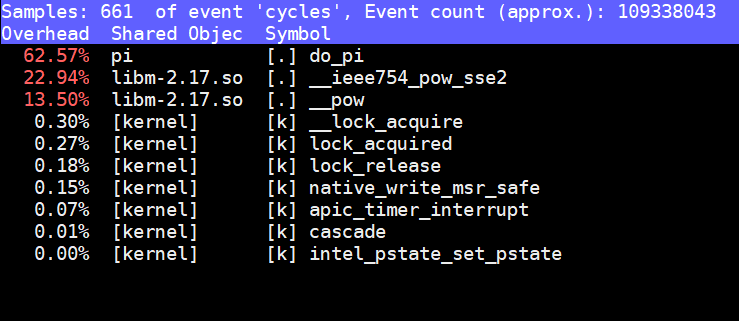
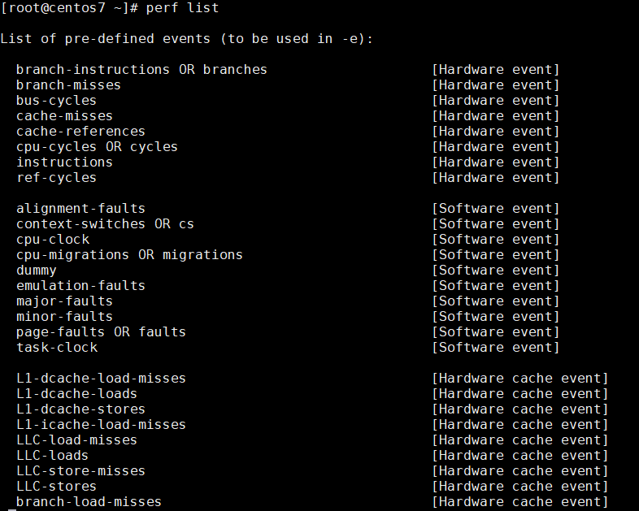
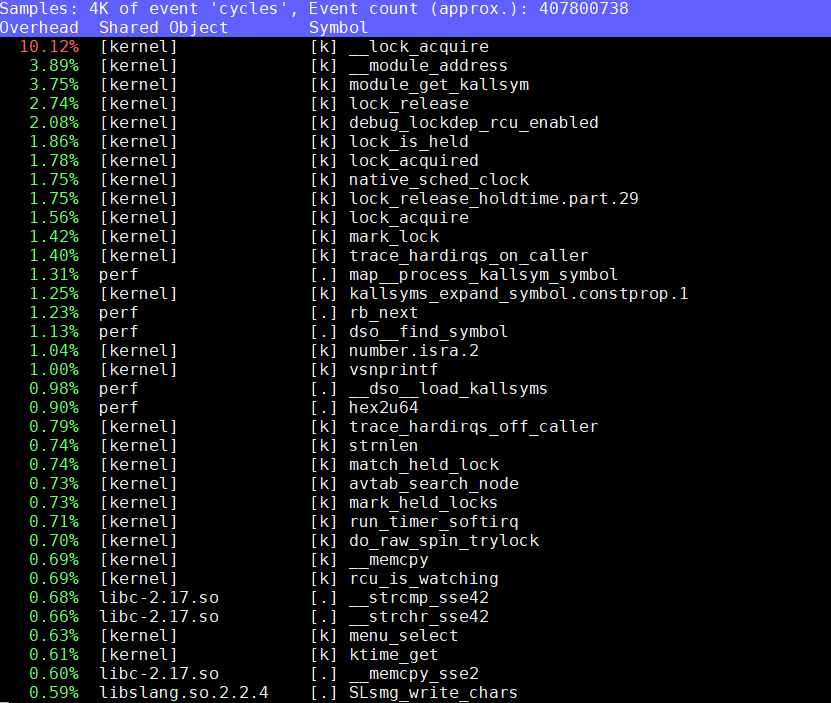
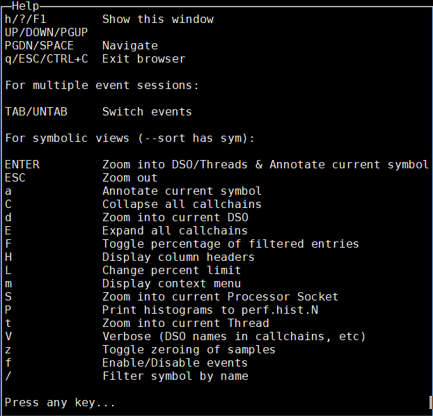
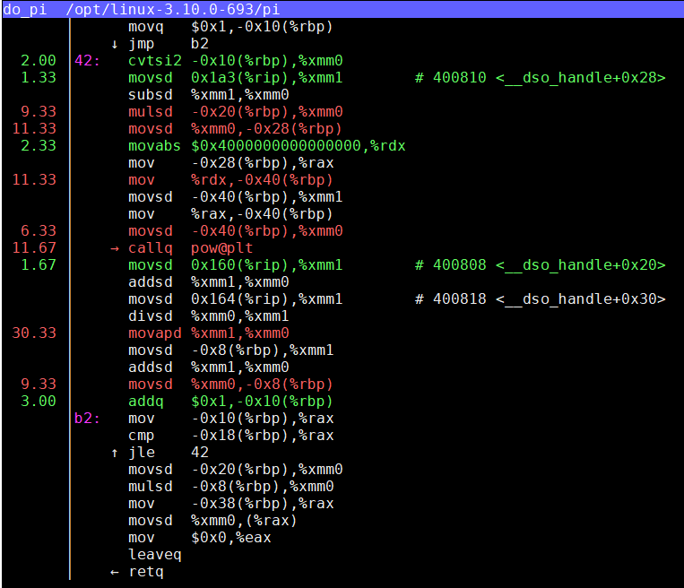
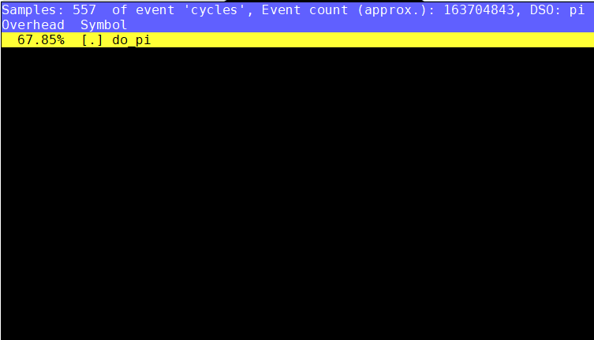

**Linux性能剖析工具Perf**
[TOC]

# 1 概述
&nbsp;&nbsp;&nbsp;&nbsp;系统级性能优化是指为了提高应用程序对操作系统资源与硬件资源的使用效率，
或者为了提高操作系统对硬件资源的使用效率而进行的代码优化。

&nbsp;&nbsp;&nbsp;&nbsp;系统级性能优化包含2个阶段：
1. 性能剖析：寻找性能瓶颈，查找引发性能问题的原因及热点代码。
2. 代码优化：针对具体的性能问题而优化代码与编译选项，以改善软件性能。

&nbsp;&nbsp;&nbsp;&nbsp;在优化阶段往往需要凭借开发者的经验，编写简洁高效的代码，甚至在汇编级别合理使用各种指令，合理安排各种指令的执行顺序。而在性能剖析阶段，则需要借助于现有的profiling工具。

# 2 Perf简介

## 2.1 Perf的基本原理

&nbsp;&nbsp;&nbsp;&nbsp;Perf是内置于Linux源代码树中的性能剖析(profiling)工具。它基于事件采样原理，以性能事件为基础，支持针对处理器相关性能指标与操作系统相关性能指标的性能剖析。可用于性能瓶颈的查找与热点代码的定位。

&nbsp;&nbsp;&nbsp;&nbsp;我们先通过一个例子来看看perf究竟能干什么。程序[pi.c]是一个简单的计算Pi的CPU密集型程序。很显然，[pi.c]的热点在函数do_pi()中。

```cpp
#include <stdio.h>
#include <math.h>
#include <sys/types.h>
#include <linux/unistd.h>

int do_pi(double *pi)
{
    double h, sum, x;
    long long n, i;

    n = 5000000;
    h = 1.0/n;
    sum = 0.0;

    for (i = 1; i <= n; i++) {
        x = h * (i - 0.5);
        sum += 4.0 / (1.0 + pow(x,2));
    }

    *pi = h *sum;
    return 0;
}

int main(void)
{
    double pi;

    printf("pid: %d\n", getpid());
    sleep(5);

    if (!do_pi(&pi)) {
        printf("PI is %f\n", pi);
    }
    return 0;
}
```
编译pi程序
> $> gcc pi.c -lm -o pi

运行pi程序
> $> ./pi

根据程序显示的pid在命令行中执行
> $> perf top -p $pid

该命令利用默认的性能事件"cycles"对[pi]进行热点分析。"cycles"是处理器周期事件。这条命令能够分析出消耗处理器周期最多的代码，在处理器频率稳定的前提下，我们可以认为perf给出的热点代码就是消耗时间最多的代码。

执行上述命令后，Perf会给出如下结果：



&nbsp;&nbsp;&nbsp;&nbsp;从上图可以看到，在[pi]程序执行期间，函数do_pi()消耗了62.57%的CPU周期，是消耗处理器周期最多的热点代码。这跟我们预想的一样。

那么Perf是怎么做到的呢？

&nbsp;&nbsp;&nbsp;&nbsp;首先，perf会通过系统调用sys_perf_event_open在内核中注册一个检测"cycles"事件的性能计数器。内核根据perf提供的信息在PMU上初始化一个硬件性能计数器（PMC：Performance Monitoring Counter）。PMC随着CPU周期的增加而自动累加。

&nbsp;&nbsp;&nbsp;&nbsp;在PMU溢出时，PMU触发一个PMI（Performance Monitoring Interrupt）中断。内核在PMI中断处理函数中保存PMC的计数值，触发中断时的指令地址（Register IP：Instruction Pointer），当前时间戳以及当前进程的PID，TID，comm等信息。我们把这些信息统称为一个采样（sample）。

&nbsp;&nbsp;&nbsp;&nbsp;内核会将收集到的sample放入用于跟用户空间通信的Ring Buffer。用于空间的perf分析程序采用mmap机制从ring buffer中读入采样，并对其解析。perf根据pid, comm等信息可以找到对应的进程。根据IP与ELF文件中的符号表可以查找到触发PMI中断的指令所在的函数。为了能够使perf读到函数名，我们的目标程序必须具备符号表。如果perf在分析结果中只看到一串地址，而没有对应的函数名时，通常是由于在编译时利用strip删除了ELF文件中的符号信息。建议在性能剖析阶段，保留程序中的sysbol table与debug info等信息。

&nbsp;&nbsp;&nbsp;&nbsp;根据上述的perf采样原理可以得知，perf假设两次采样之间，即两次相邻的PMI中断之间系统执行的是同一个进程的同一个函数。这种假设会带来一定的误差，当感觉perf给出的结果不准时，不妨提高采样频率，perf会给出更加精确的结果。

## 2.2 Perf的功能概述

&nbsp;&nbsp;&nbsp;&nbsp;Perf是一个包含27种子工具的工具集，功能很全面。

No. | sub-command | Comment
---|---|---
01 | annotate      |根据数据文件，注解被采样到的函数，显示指令级别的热点。
02 | archive       |根据数据文件中记录的build-id，将所有被采样到的ELF文件打成压缩包。利用此压缩包，可以在任何机器上分析数据文件中的采样数据。
03 | bench         |Perf中内置的benchmark，目前包括两套针对调度器和内存管理子系统的benchmark。
04 | buildid-cache |管理perf的buildid缓存。每个ELF文件都有一个独一无二的buildid。Buildid被perf用来关联性能数据与ELF文件。
05 | buildid-list  |列出数据文件中记录的所有buildid。
06 | config        |从配置文件中设置读取变量。
07 | data          |数据文件的相关处理。
08 | diff          |对比两个数据文件的差异。能够给出每个符号（函数）在热点分析上的具体差异。
09 | evlist        |列出数据文件中的所有性能事件。
10 | ftrace        |调用ftrace功能。
11 | inject        |该工具读取perf record工具记录的事件流，并将其定向到标准输出。在被分析代码中的任何一点，都可以向事件流中注入其他事件。
12 | kallsyms      |查询运行内核的符号信息。
13 | kmem          |针对内存子系统的分析工具。
14 | kvm           |此工具可以用来追踪、测试运行与KVM虚拟机上的Guest OS。
15 | list          |列出当前系统支持的所有性能事件。包括硬件性能事件、软件性能事件以及检查点。
16 | lock          |分析内核中的加锁信息。包括锁的争用情况，等待延迟等。
17 | mem           |剖析内存访问信息。
18 | record        |收集采样信息，并将其记录在数据文件中。随后可通过其他工具对数据文件进行分析。
19 | report        |读取perf record创建的数据文件，并给出热点分析结果。
20 | sched         |针对调度器子系统的分析工具。
21 | script        |执行perl或python写的功能扩展脚本、生成脚本框架、读取数据文件中的数据信息等。
22 | stat          |剖析某个特定进程的性能概况，包括CPU、Cache Miss率等。
23 | test          |Perf针对当前软硬平台的测试工具。可以用此工具测试当前软硬件平台是否能够支持perf的所有功能。
24 | timechart     |生成一幅描述处理器与各进程状态变化的矢量图。
25 | top           |类似于Linux的top命令，对系统性能进行实时分析。
26 | probe         |用于定义动态检查点。
27 | trace         |类似strace功能。

# 3 Perf工具和性能事件

## 3.1 perf list简介

&nbsp;&nbsp;&nbsp;&nbsp;利用perf剖析程序性能时，需要指定当前测试的性能事件。性能事件是指在处理器或操作系统中发生的，可能影响到程序性能的硬件事件或软件事件。比如Cache丢失，流水线停顿，页面交换等。这些事件会对程序的执行时间造成较大的负面影响。在优化代码时，应尽可能减少此类事件发生。因此，必须先利用perf等性能剖析工具查找引发这些性能事件的热点代码以及热点指令。perf定义的性能事件分为3类，分别是硬件性能事件、软件性能事件与Tracepoint Events。

&nbsp;&nbsp;&nbsp;&nbsp;不同的CPU支持的硬件性能事件不尽相同。不同版本的内核提供的软件性能事件与Tracepoint events也不尽相同。因此，perf提供了list工具以查看当前软硬件平台支持的性能事件列表。list工具使用方法如下：

> $> perf list

&nbsp;&nbsp;&nbsp;&nbsp;执行命令后，perf将给出当前软硬件平台的所有性能事件。输出结果如下图所示。每行后面括弧里的信息表示该事件是硬件事件、软件事件还是Tracepoint events。




## 3.2 性能事件与属性

&nbsp;&nbsp;&nbsp;&nbsp;硬件性能事件由处理器的PMU提供支持。如前文所述，perf会对PMI中断发生时的PC寄存器进行采样。由于现代处理器的主频非常高，在加上深度流水线机制，从性能事件被触发，到处理器响应PMI中断，流水线上可能已处理过百条指令。那么PMI中断采到的指令地址就不再是处罚性能事件的那条指令的地址了，而可能具有非常严重的偏差。为了解决这个问题，intel处理器通过PEBS（Precise Event Based Sampling）机制实现了高精度事件采样。PEBS通过硬件在计数器溢出时将处理器现场直接保存到内存（而不是在相应中断时才保存寄存器现场），从而使得perf能够真正触发性能事件的那条指令的地址，提高了采样精度。在默认条件下，perf不使用PEBS机制。用户如果想要使用高精度采样，需要在指定性能事件时，在事件后调价后缀":p"或":pp"。

例如：
> $> perf top -e cycles:pp

### 3.2.1 性能事件的精度级别

Level | Comment
---|---
0 | 无精度保证
1 | 采样指令与触发性能事件的指令之间的偏差为常数（:p）
2 | 需要尽量保证采样指令与触发性能事件的指令的偏差为0（:pp）
3 | 保证采样指令与触发性能事件的指令之间的偏差必须为0（：ppp）

&nbsp;&nbsp;&nbsp;&nbsp;目前X86处理器，包括Intel处理器与AMD处理器Jun仅能实现前3个精度级别。

&nbsp;&nbsp;&nbsp;&nbsp;除了精度级别以外，事件还具有其他几个属性，均可以通过"event:X"的方式予以指定。

### 3.2.2 性能事件的属性

attribute | Comment
---|---
u | 仅统计用户空间程序触发的性能事件。
k | 仅统计内核触发的性能事件。
h | 仅统计Hypervisor触发的性能事件。
G | 在KVM虚拟机中，仅攻击Guest系统触发的性能事件。
H | 仅统计Host系统触发的性能事件。
p | 精度级别。

&nbsp;&nbsp;&nbsp;&nbsp;另外需要补充的是，perf list工具仅列出了具有字符描述的硬件性能事件。而那些没有预定义字符描述的性能事件，也可以通过特殊方式使用。这时，就需要我们根据CPU的手册，通过性能事件的标号配置PMU的性能计数器。可以采用如下方式：

> $> perf top -e r[UMask+EventSelect]

&nbsp;&nbsp;&nbsp;&nbsp;举个例子，我们现在想统计所有从内存中读过数据的指令的个数，perf list中并为预定义此事件的字符描述。通过查找intel的处理器手册，我们找了此事件编码：

Table 19-19. Performance Events in the Processor Core for Intel Core i7 Processor and Intel Xeon Process 5500 Series

Event Num. | Umask Value | Event Mask Mnemonic | Description
---|---|---|---
0BH|01H|MEM_INST_RETIRED.LOADS|Counts the numnber for instructions with ...

&nbsp;&nbsp;&nbsp;&nbsp;便可以通过以下方式使用此事件：
> $> perf stat -e r010b ls

# 4 Perf top工具

## 4.1 Perf top的基本使用方法
&nbsp;&nbsp;&nbsp;&nbsp;top工具主要用于实时剖析各个函数在某个性能事件上的热度。利用perf top，能够直观地观察到当前的热点函数，并利用工具中内置的annotate功能，进一步查找特点指令。



perf top的基本使用方法为：
> $> perf top

&nbsp;&nbsp;&nbsp;&nbsp;该命令以默认性能事件"cycles（CPU周期数）"进行全系统的性能剖析，检测系统中的所有应用程序函数与内核函数的热度。
&nbsp;&nbsp;&nbsp;&nbsp;perf提供了3种用户页面，分别是tui、gtk以及tty。其中可操作性最强，功能最丰富的界面是tui。
&nbsp;&nbsp;&nbsp;&nbsp;top工具的界面具有4列信息。右边第一列为符号名，也就是函数名。左边第一列为该符号引发的性能事件在整个**检测域**中占的比例，我们将其称为 ++该符号的**热度**。检测域是指perf监控的所有符号。默认情况下包括系统中所有进程、内核以及内核模块的函数。++ 左边第二列为该符号所在的DSO。**DSO**即动态共享对象（Dynamic Shared Object）的缩写。第三列为DSO的类型。perf中DSO共有5中类型，分别是：ELF可执行文件，动态链接库，内核，内核模块和VDSO。当第三列为[.]时表示此符号属于用户态的ELF文件（包括可执行文件与动态链接库）。为[k]表示此符号属于内核与内核模块。

&nbsp;&nbsp;&nbsp;&nbsp;在tui界面下按'h','?'或'F1'键时，会弹出一个帮助窗口，如下图所示。



&nbsp;&nbsp;&nbsp;&nbsp;帮助窗口列出了perf top的所有功能。我们首先来看注解（Annoate）功能。注解功能可以进一步深入分析某个符号。给出对应线程的代码并且为热点代码标记处它们触发的性能事件在整个测试域中的百分比。下面让我们来看一下如何使用注解功能。在界面上按上下键，将光标在各个symbol间移动。选定某个符号后，按下a键，得到如下的界面。



&nbsp;&nbsp;&nbsp;&nbsp;上图显示的是[pi]程序中do_pi()函数的注解。从图上可以看到perf对do_pi()中的C代码给出了汇编语言的注解。并且给出了各条指令的采样率。从上图可以看到耗时较多的指令（如访存指令）比较容易被perf采到。

&nbsp;&nbsp;&nbsp;&nbsp;选定某个符号后按下热键'd'，perf会过滤掉所有不属于此DSO的文件。符号do_pi归属的DSO为thread。当在符号do_pi上按下'd'键后，perf过滤掉了所有不属于thread的符号。如下图所示。



&nbsp;&nbsp;&nbsp;&nbsp;类似于热键'd'，热键't'能够过滤所有不属于当前符号所属线程的符号。
&nbsp;&nbsp;&nbsp;&nbsp;热键'P'可以将pref top的当前显示的信息输出到文件perf.hist.X中。

## 4.2 Perf top的参数介绍

Perf top的参数较多，本文只介绍几个常用的参数的使用方法。

&nbsp;&nbsp;&nbsp;&nbsp; '-e' or '--event' <event>: 该参数用于指定分析的性能事件。具体可以参考perf list。
例如：我们希望利用top工具剖析系统中Cache丢失次数，可以采用以下命名：
> $> perf top -e cache-misses

&nbsp;&nbsp;&nbsp;&nbsp; '-c' or '--count' <n>: 该参数用于指定性能计数器的采样周期。默认情况下，每秒采样4000次。

&nbsp;&nbsp;&nbsp;&nbsp; '-p' or '--pid' <pid>: 该参数用于指定分析进程的pid。指定pid后，perf top仅分析目标进程以及目标进程创建的线程。

&nbsp;&nbsp;&nbsp;&nbsp; '-t' or '--tid' <tid>: 该参数用于指定分析线程的tid。指定tid后，perf top仅分析目标线程，不包括此线程创建的其他线程。

&nbsp;&nbsp;&nbsp;&nbsp; '-a' or '--all-cpus': 采集系统中所有CPU产生的性能事件。这就是perf top的默认情况。

&nbsp;&nbsp;&nbsp;&nbsp; '-C' or '--cpu' <cpu>: 指定待分析的CPU列表。如果系统中有4个CPU，如果仅需采集CPU0与CPU3的数据，可通过如下方法调用perf top：

> $> perf top -C 0,3

&nbsp;&nbsp;&nbsp;&nbsp; '-k' or '--vmlinux' <file>: 指定带符号表的内核映像所在的路径。与GDB类似，perf只有在DSO存在符号表的情况下才能解析出IP对应的具体符号。Perf通常采用以下顺序加载内核符号：

1. /proc/kallsyms
2. 用户通过'-k'参数指定的路径
3. 当前路径下的"vmlinux"文件
4. /boot/vmlinux
5. /boot/vmlinux-$(uts.release)
6. /lib/modules/$(uts.release)/build/vmlinux
7. /usr/lib/debug/lib/modules/$(uts.release)/build/vmlinux

&nbsp;&nbsp;&nbsp;&nbsp; '-K' or '--hide_kernel_symbols' :不显示属于内核的符号。对于只想分析应用程序的用户而言，使用此参数后，perf top的界面会清爽很多。

&nbsp;&nbsp;&nbsp;&nbsp; '-m' or '--mmap-pages' <n> :指定perf开辟的mmap页面的数量。mmap缓存主要用于用户空间与内核空间的数据通信。perf在内核中驱动将采集到的性能数据存入ring buffer，用户空间的分析程序则通过mmap机制从ring buffer中读取数据。

&nbsp;&nbsp;&nbsp;&nbsp;默认情况下，mmap的页面数量为128，此时mmap内存区域的大小为512KB。perf top默认每个2s读取一次性能数据，当内核生成性能数据的速度过快时，就可能因为缓冲区满导致数据丢失，从而影响到分析结果。在此情况下，用户可以通过'-m'参数扩大缓冲区，以避免性能数据的大量丢失。

&nbsp;&nbsp;&nbsp;&nbsp; '-r' or '--realtime' <n> <n>：指定分析程序的实时优先级。如上文所述，如果perf分析程序读取数据的速度长期小于内核生成数据的速度时，就可能导致采样数据的大量丢失，影响分析精度。在系统负载过高时，分析程序可能会因为调度延迟过高而不能及时读取数据。因此，在高负载系统中可以通过参数'-r'将分析程序设置为实时进程，并为其设定较高的优先级。
> $> perf top -r 0

&nbsp;&nbsp;&nbsp;&nbsp;上述命令中，0即为指定给分析程序的实时优先级。顺便说一句，Linux中实时优先级的范围是[0,99]，其中优先级0最高。不要与范围是[-20,19]的nice值搞混。

&nbsp;&nbsp;&nbsp;&nbsp; '-d' or '--delay' <n>：指定perf top页面的刷新周期，<n>的单位为妙。默认值为2s。

&nbsp;&nbsp;&nbsp;&nbsp; '-D' or '--dump-symtab' ：打印DSO的符号表，此功能主要用于perf自身的调试。该参数仅与'--stdio'（即TTY界面）配合使用时才起作用。启用此参数后，perf top会在退出时打印所有DSO的符号表。

//todo


# 5 Perf 编译安装

## 5.1 测试
```
[root@centos7 linux-3.10.0-693]# make -C tools/perf -f tests/make
```

## 5.2 编译
```
[root@centos7 linux-3.10.0-693]# make -C tools/perf
```

## 5.3 安装
```
[root@centos7 linux-3.10.0-693]# make -C tools/perf install
```

## 5.4 帮助文档
```
man 1 perf
man 1 perf-stat
man 1 perf-top
man 1 perf-record
man 1 perf-report
man 1 perf-list
```

