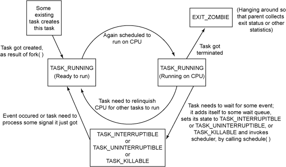
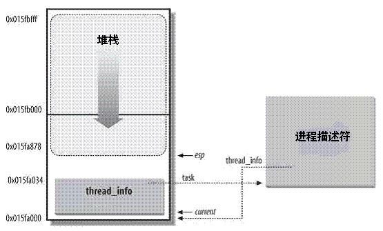

***Linux进程描述符task_struct结构体详解***

- 1 概述
- 2 进程状态
    - 2.1 5个互斥状态
    - 2.2 2个终止状态
    - 2.3 新增睡眠状态
        - 2.3.1 内核映射
        - 2.3.2 新睡眠状态：TASK_KILLABLE
        - 2.3.3 使用 TASK_KILLABLE 的新内核 API
- 3 进程标识符（PID）
- 4 进程内核栈
    - 4.1 内核栈与线程描述符
    - 4.2 内核栈栈数据结构描述thread_info和thread_union
    - 4.3 获取当前CPU上正在运行的thread_info
    - 4.4 分配和销毁thread_info
- 5 进程标记
- 6 表示进程亲属关系的成员
- 7 ptrace系统调用
- 8 Performance Event
- 9 进程调度
    - 9.1 优先级
    - 9.2 调度策略/调度类相关字段
    - 9.3 调度策略
    - 9.4 调度类
- 10 进程地址空间
- 11 判断标志
- 12 时间
- 13 信号处理
- 14 其他

# 1. 概述

类似于文件，进程是任何 UNIX® 操作系统的基本元素。进程是执行可执行文件的指令的动态实体。
除了执行其指令之外，进程有时还会管理**打开文件**、**处理器上下文**、**地址空间**以及与**程序相关的数据**等。
Linux 内核将关于进程的完整信息保存在进程描述符 中，它的结构被定义为 struct task\_struct。
您可以在 Linux 内核源文件 include/linux/sched.h 中看到 struct task\_struct 的各个字段。

# 2. 进程状态

```c
    volatile long state;    /* -1 unrunnable, 0 runnable, >0 stopped */
```
state成员的可能取值如下：
```c
/*
 * Task state bitmask. NOTE! These bits are also
 * encoded in fs/proc/array.c: get_task_state().
 *
 * We have two separate sets of flags: task->state
 * is about runnability, while task->exit_state are
 * about the task exiting. Confusing, but this way
 * modifying one set can't modify the other one by
 * mistake.
 */
#define TASK_RUNNING        0
#define TASK_INTERRUPTIBLE  1
#define TASK_UNINTERRUPTIBLE    2
#define __TASK_STOPPED      4
#define __TASK_TRACED       8

/* in tsk->exit_state */
#define EXIT_ZOMBIE     16
#define EXIT_DEAD       32

/* in tsk->state again */
#define TASK_DEAD       64
#define TASK_WAKEKILL       128
#define TASK_WAKING     256
#define TASK_PARKED     512
#define TASK_STATE_MAX      1024

/* Convenience macros for the sake of set_task_state */
#define TASK_KILLABLE       (TASK_WAKEKILL | TASK_UNINTERRUPTIBLE)
#define TASK_STOPPED        (TASK_WAKEKILL | __TASK_STOPPED)
#define TASK_TRACED     (TASK_WAKEKILL | __TASK_TRACED)
```

## 2.1 5个互斥状态

state域能够取5互为排斥的值（通俗一点就是这5个值任意两个不能一起使用，只能单独使用）。
系统中的每个进程都必然处于这5种状态中的一种。


状态 | 描述
---|:---
TASK\_RUNNING | 进程当前**正在运行**，或者**正在运行队列中等待调度**。
TASK\_INTERRUPTIBLE | 进程处于**睡眠状态**，正在等待某些事件发生。**进程可以被信号中断**。接收到信号或被显式的唤醒呼叫唤醒之后，进程将转变为 TASK_RUNNING 状态。
TASK\_UNINTERRUPTIBLE | 此进程状态类似于 TASK\_INTERRUPTIBLE，只是**它不会处理信号**。中断处于这种状态的进程是不合适的，因为它可能正在完成某些重要的任务。 当它所等待的事件发生时，进程将被显式的唤醒呼叫唤醒。
TASK\_STOPPED |进程**已中止执行**，它没有运行，并且不能运行。接收到 **SIGSTOP** 和 **SIGTSTP** 等信号时，进程将进入这种状态。接收到 SIGCONT 信号之后，进程将再次变得可运行。
TASK\_TRACED | **正被调试程序等其他进程监控**时，进程将进入这种状态。

## 2.2 2个终止状态

状态 | 描述
---|:---
EXIT\_ZOMBIE | 进程已终止，它正等待其父进程收集关于它的一些统计信息。
EXIT\_DEAD | 最终状态（正如其名）。将进程从系统中删除时，它将进入此状态，因为其父进程已经通过 wait4() 或 waitpid() 调用收集了所有统计信息。

其实还有**两个附加的进程状态**可以**被添加到state域**中，又可以被添加到**exit_state**域中。
只有**当进程终止**的时，才会到达这两种状态。
```c
    /* task state */
    int exit_state;
    int exit_code, exit_signal;
```
我们在后续介绍。

## 2.3 新增睡眠状态

### 2.3.1 内核映射

如前所述，进程状态 **TASK\_UNINTERRUPTIBLE** 和 **TASK\_INTERRUPTIBLE** 都是**睡眠状态**。

Linux内核提供了**两种方法**将进程设置为**睡眠状态**。

将进程置为睡眠状态的**普通方法**是将进程状态设置为 **TASK\_INTERRUPTIBLE** 或 **TASK\_UNINTERRUPTIBLE** 并调用**调度程序的 schedule() 函数**。这样会将**进程从 CPU 运行队列中移除**。

- 如果进程处于可**中断模式的睡眠状态**（通过将其状态设置为**TASK\_INTERRUPTIBLE**），那么可以通过**显式的唤醒呼叫（wakeup\_process()）**或**需要处理的信号来唤醒**它。

- 但是，如果进程处于**非可中断模式的睡眠状态**（通过将其状态设置为**TASK\_UNINTERRUPTIBLE**），那么**只能通过显式的唤醒呼叫将其唤醒**。除非万不得已，否则我们**建议您将进程置为可中断睡眠模式**，而不是不可中断睡眠模式（比如说在设备 I/O 期间，处理信号非常困难时）。

当处于**可中断睡眠模式的任务接收到信号**时，它**需要处理该信号（除非它已被屏弊）**，离开之前正在处理的任务（此处需要**清除代码**），并**将 -EINTR** 返回给**用户空间**。再一次，**检查这些返回代码和采取适当操作**的工作将由程序员完成。

**因此，懒惰的程序员可能比较喜欢将进程置为不可中断模式的睡眠状态，因为信号不会唤醒这类任务。**

但需要注意的一种情况是，对**不可中断睡眠模式的进程的唤醒呼叫**可能会由于某些原因**不会发生**，这会使**进程无法被终止**，从而最终引发问题，因为惟一的解决方法就是重启系统。一方面，您需要考虑一些细节，因为不这样做会在内核端和用户端引入 bug。另一方面，您可能会生成永远不会停止的进程（**被阻塞且无法终止的进程**）。

现在，我们在内核中实现了一种新的睡眠方法！

### 2.3.2 新睡眠状态：TASK_KILLABLE

Linux Kernel 2.6.25 引入了一种新的进程睡眠状态：

状态 | 描述
---|:---
TASK\_KILLABLE | 当进程处于这种可以终止的新睡眠状态中，它的运行原理类似于 TASK\_UNINTERRUPTIBLE，只不过**可以响应致命信号**。

它的定义如下：
```c
    #define TASK_WAKEKILL           128	/** wake on signals that are deadly **/

    /* Convenience macros for the sake of set_task_state */
    #define TASK_KILLABLE           (TASK_WAKEKILL | TASK_UNINTERRUPTIBLE)
    #define TASK_STOPPED            (TASK_WAKEKILL | __TASK_STOPPED)
    #define TASK_TRACED             (TASK_WAKEKILL | __TASK_TRACED)
```

换句话说，TASK\_UNINTERRUPTIBLE + TASK\_WAKEKILL = TASK\_KILLABLE。

进程状态的切换过程和原因大致如下图所示：



### 2.3.3 使用 TASK_KILLABLE 的新内核 API
```c
int wait_event_killable(wait_queue_t queue, condition);
```
- 该函数定义在 include/linux/wait.h 中；它将处于可终止睡眠状态的调用进程置于 queue 中，直到 condition 等于 true。

```c
long schedule_timeout_killable(signed long timeout);
```
- 该函数定义在 kernel/timer.c 中；该例程主要用于将当前任务的状态设置为 TASK_KILLABLE 并调用 schedule_timeout()，它用于让调用任务睡眠 timeout 个 jiffies。（在 UNIX 系统中，jiffy 主要表示两个连续时钟计时单元之间的时间。

```c
int wait_for_completion_killable(struct completion *comp);
```
- 此例程定义在 kernel/sched.c 中，它用于等待进程在事件完成后变为可终止状态。如果没有等待的致命信号，该函数将调用 schedule_timeout() 维持 MAX_SCHEDULE_TIMEOUT（指定为等于 LONG_MAX）个 jiffies 时间。

```c
int mutex_lock_killable(struct mutex *lock);
```
- 定义在 kernel/mutex.c 中，该例程用于获取互斥锁。但是，如果锁不可用并且任务正在等待获得锁，与此同时又接收到一个致命信号，则该任务将从等待互斥锁以处理信号的等待者列表中删除。

```c
int down_killable(struct semaphore *sem);
```
- 定义在 kernel/semaphore.c 中，它用于获取信号量 sem。如果信号量不可用，它将被置为睡眠状态；如果向它传递了一个致命信号，则会将它从等待者列表中删除，并且需要响应此信号。获取信号量的另外两种方法是使用例程 down() 或 down_interruptible()。down() 函数现在已不建议使用。您应该使用 down_killable() 或 down_interruptible() 函数。

# 3. 进程标识符（PID）

```c
    pid_t pid;
    pid_t tgid;
```

Unix系统通过**pid来标识进程**，linux把不同的pid与系统中每个进程或轻量级线程关联，而Unix程序员希望**同一组线程具有相同的pid**，
遵照这个标准linux引入线程组的概念。一个**线程组所有线程**与**领头线程**具有**相同的pid**，存入**tgid**字段，getpid()**返回当前进程的tgid而不是pid值**。

在**CONFIG\_BASE\_SMALL配置为0**的情况下，**PID的取值范围是0 ~ 32768-1**，即系统中的**进程数最大为32768个**。

```c
/*
 * This controls the default maximum pid allocated to a process
 */
#define PID_MAX_DEFAULT (CONFIG_BASE_SMALL ? 0x1000 : 0x8000)
```

在Linux系统中，一个线程组中的所有线程使用和该线程组领头线程（该组中第一个轻量级进程）相同的PID，并被存放在**tgid**成员中。
只有**线程组的领头线程**的**pid**成员才会被设置为**与tgid相同**的值。

> 注意：getpid()系统调用返回的是当前进程的tgid值，而不是pid值。

# 4. 进程内核栈

```c
    void *stack;
```

## 4.1 内核栈与线程描述符

对**每个进程**，Linux内核都把**两个不同的数据结构紧凑**的放在一个**单独为进程分配的内存区域**中：
- 一个是**内核态**的**进程堆栈**
- 另一个是紧挨着**进程描述符**的小结构体thread_info，叫做**线程描述符**

Linux把**thread_info**（线程描述符）和**内核态**的**线程堆栈**放在一起，这块区域通常是**8192Byte**（占**两个页框**），其地址必须是8192的整数倍。

在arch/x86/include/asm/page\_32\_types.h中
```c
#define THREAD_SIZE_ORDER   1
#define THREAD_SIZE  (PAGE_SIZE << THREAD_SIZE_ORDER)
```
出于效率考虑，内核让着8K空间占据连续的两个页框并让第一个页框的起始地址是2的13次方的倍数，即8K对齐。

**内核态的进程**访问处于**内核数据段的栈**，这个栈不同于用户态的进程所用的栈。

**用户态进程**所用的栈，是在进程**线性地址空间**中。

而**内核栈**是当进程**从用户空间进入内核空间**时，**权限级发生变化**，需要**切换堆栈**，那么内核空间中使用的就是这个内核栈。
因为内核控制路径使用**很少的栈空间**，所以**只需要几千个字节的内核态堆栈**。

> 需要注意的是：**内核态堆栈**仅用于**内核例程**，Linux内核另外为中断提供了单独的**硬中断栈**和**软中断栈**。

下图中显示了在**物理内存**中存放**两种数据结构**的方式。线程描述符驻留与这个内存区的开始，而栈顶末端向下增长。 下图摘自ULK3,进程内核栈与进程描述符的关系如下图：



但是较新的内核代码中，**进程描述符task\_struct**结构中**没有直接指向thread_info结构的指针**，而是用一个**void指针类型**的成员表示，
然后通过**类型转换来访问thread_info结构**。

相关代码在include/linux/sched.h中：
```c
#define task_thread_info(task)  ((struct thread_info *)(task)->stack)
```
在这个图中，esp寄存器是CPU栈指针，用来存放栈顶单元的地址。

在x86系统中，栈起始于顶端，并朝着这个内存区开始的方向增长，从用户态切换到内核态后，进程的内核栈总是空的。因此，esp寄存器指向这个栈的顶端。一旦数据写入退栈，esp的值就递减。

## 4.2 内核栈栈数据结构描述thread_info和thread_union

thread\_info是体系结构相关的，结构定义在arch/x86/include/asm/thread\_info.h中。

Linux内核使用一个**联合体**来表示一个**进程的线程描述符**和**内核栈**：
```c
union thread_union
{
	struct thread_info thread_info;
	unsigned long stack[THREAD_SIZE/sizeof(long)];
};
```

## 4.3 获取当前CPU上正在运行的thread_info

下面来说说如何通过**esp栈指针**来获取当前CPU上正在**运行进程的thread_info**结构。

实际上，前面提到**thread_info结构**和**内核态堆栈**是紧密结合在一起的，占据**两个页框的物理内存空间**。
而且，这**两个页框的第起始地址是2的13次方即8192对齐**的。


在早期的版本中，不需要对64位处理器的支持，所以，内核通过简单的屏蔽esp的低13有效位就可以获得thread_info结构的基地址了。

```
实现思路：
    1. 当前的栈指针（current_task_pointer == esp）。
    
    2. THREAD_SIZE为8129Byte，即2的13次方。
    
    3. ~ (THREAD_SIZE - 1)的结果为，1111 1111 1111 1111 1110 0000 0000 0000，低13位全为0，
    也就刚好屏蔽了esp的低13位，最终得到的是thread_info的地址。
```

Kernel 3.10.0 实现版本：

```c
static inline struct thread_info *current_thread_info(void)
{
    struct thread_info *ti;
    ti = (void *)(this_cpu_read_stable(kernel_stack) +
              KERNEL_STACK_OFFSET - THREAD_SIZE);
    return ti;
}
```
进程最常用的是**进程描述符结构task\_struct**而不是thread\_info结构的地址。为了获取**当前CPU上运行的task\_struct结构**，
**内核提供了current宏**，由于task\_struct *task在thread\_info的起始位置，该宏本质等价于current\_thread\_info()->task，在include/asm-geneic/current.h中定义：

```c
#define get_current() (current_thread_info()->task)
#define current get_current()
```

这个定义是体系结构无关的，当然linux也为各个体系结构定义了更加方便或者快速的current。

## 4.4 分配和销毁thread_info

进程通过**alloc\_thread\_info\_node()函数**分配它的内核栈，通过**free\_thread\_info()函数**释放所分配的内核栈。

函数定义在kernel/fork.c中：

```c
/*
 * Allocate pages if THREAD_SIZE is >= PAGE_SIZE, otherwise use a
 * kmemcache based allocator.
 */
# if THREAD_SIZE >= PAGE_SIZE
static struct thread_info *alloc_thread_info_node(struct task_struct *tsk,
                          int node)
{
    struct page *page = alloc_pages_node(node, THREADINFO_GFP_ACCOUNTED,
                         THREAD_SIZE_ORDER);

    return page ? page_address(page) : NULL;
}

static inline void free_thread_info(struct thread_info *ti)
{
    free_memcg_kmem_pages((unsigned long)ti, THREAD_SIZE_ORDER);
}
# else
static struct kmem_cache *thread_info_cache;

static struct thread_info *alloc_thread_info_node(struct task_struct *tsk,
                          int node)
{
    return kmem_cache_alloc_node(thread_info_cache, THREADINFO_GFP, node);
}

static void free_thread_info(struct thread_info *ti)
{
    kmem_cache_free(thread_info_cache, ti);
}

void thread_info_cache_init(void)
{
    thread_info_cache = kmem_cache_create("thread_info", THREAD_SIZE,
                          THREAD_SIZE, 0, NULL);
    BUG_ON(thread_info_cache == NULL);
}
# endif
```

# 5. 进程标记

```c
    unsigned int flags; /* per process flags, defined below */  
```

进程标记用来**反映进程状态的信息**，但**不是运行状态**，用于**内核识别进程当前的状态**，以备下一步操作。

例如：
    - PF\_FORCKNOEXEC：进程刚创建，但还没执行。
    - PF\_SUPERPRIV：超级用户特权。
    - PF\_DUMPCORE：dumped core。
    - PF\_SIGNALED：进程被信号（signal）杀死。
    - PF\_EXITING：进程开始关闭。

flags成员的可能取值如下，这些宏都以PF（**ProcessFlag**）开头，定义在include/linux/sched.h中：
```c
/*
 * Per process flags
 */
#define PF_EXITING  0x00000004  /* getting shut down */
#define PF_EXITPIDONE   0x00000008  /* pi exit done on shut down */
#define PF_VCPU     0x00000010  /* I'm a virtual CPU */
#define PF_WQ_WORKER    0x00000020  /* I'm a workqueue worker */
#define PF_FORKNOEXEC   0x00000040  /* forked but didn't exec */
#define PF_MCE_PROCESS  0x00000080      /* process policy on mce errors */
#define PF_SUPERPRIV    0x00000100  /* used super-user privileges */
#define PF_DUMPCORE 0x00000200  /* dumped core */
#define PF_SIGNALED 0x00000400  /* killed by a signal */
#define PF_MEMALLOC 0x00000800  /* Allocating memory */
#define PF_NPROC_EXCEEDED 0x00001000    /* set_user noticed that RLIMIT_NPROC was exceeded */
#define PF_USED_MATH    0x00002000  /* if unset the fpu must be initialized before use */
#define PF_USED_ASYNC   0x00004000  /* used async_schedule*(), used by module init */
#define PF_NOFREEZE 0x00008000  /* this thread should not be frozen */
#define PF_FROZEN   0x00010000  /* frozen for system suspend */
#define PF_FSTRANS  0x00020000  /* inside a filesystem transaction */
#define PF_KSWAPD   0x00040000  /* I am kswapd */
#define PF_MEMALLOC_NOIO 0x00080000 /* Allocating memory without IO involved */
#define PF_LESS_THROTTLE 0x00100000 /* Throttle me less: I clean memory */
#define PF_KTHREAD  0x00200000  /* I am a kernel thread */
#define PF_RANDOMIZE    0x00400000  /* randomize virtual address space */
#define PF_SWAPWRITE    0x00800000  /* Allowed to write to swap */
#define PF_NO_SETAFFINITY 0x04000000    /* Userland is not allowed to meddle with cpus_allowed */
#define PF_MCE_EARLY    0x08000000      /* Early kill for mce process policy */
#define PF_MEMPOLICY    0x10000000  /* Non-default NUMA mempolicy */
#define PF_MUTEX_TESTER 0x20000000  /* Thread belongs to the rt mutex tester */
#define PF_FREEZER_SKIP 0x40000000  /* Freezer should not count it as freezable */
#define PF_SUSPEND_TASK 0x80000000      /* this thread called freeze_processes and should not be frozen */
```

# 6. 表示进程亲属关系的成员

```c
struct task_struct __rcu *real_parent; /* real parent process */
struct task_struct __rcu *parent; /* recipient of SIGCHLD, wait4() reports */

struct list_head children;      /* list of my children */
struct list_head sibling;       /* linkage in my parent's children list */
struct task_struct *group_leader;       /* threadgroup leader */
```
在Linux系统中，所有**进程之间**都有着**直接**或**间接地**联系，**每个进程都有其父进程**，也可能有**零个**或**多个子进程**。

拥有**同一父进程**的**所有进程具有兄弟关系**。

字段 | 描述
---|:---
real_parent | 指向其父进程，如果创建它的**父进程不再存在**，则指向**PID为1的init进程**
parent | 指向其父进程，**当它终止时，必须向它的父进程发送信号**。它的值通常与real_parent相同
children | 表示链表的头部，**链表中的所有元素都是它的子进程**
sibling | 用于**把当前进程插入到兄弟链表**中
group_leader | 指向其所在**进程组的领头进程**

# 7. ptrace系统调用

ptrace提供了一种**父进程可以控制子进程运行**，并可以检查和改变它的core image。

它主要用于**实现断点调试**。一个被跟踪的进程运行中，直到发生一个**信号**则进程被**中止**，并且**通知其父进程**。
在**进程中止状态**下，进程的**内存空间可以被读写**。父进程还可以使子进程继续执行，并选择是否忽略引起中止的信号。

```c
    unsigned int ptrace;
    struct list_head ptraced;
    struct list_head ptrace_entry;

    unsigned long ptrace_message;
    siginfo_t *last_siginfo; /* For ptrace use.  */
```

成员**ptrace被设置为0**时，表示**不需要被跟踪**，定义在include/linux/ptrace.h中，它的可能取值如下：

```
/*
 * Ptrace flags
 *
 * The owner ship rules for task->ptrace which holds the ptrace
 * flags is simple.  When a task is running it owns it's task->ptrace
 * flags.  When the a task is stopped the ptracer owns task->ptrace.
 */

#define PT_SEIZED   0x00010000  /* SEIZE used, enable new behavior */
#define PT_PTRACED  0x00000001
#define PT_DTRACE   0x00000002  /* delayed trace (used on m68k, i386) */
#define PT_PTRACE_CAP   0x00000004  /* ptracer can follow suid-exec */

#define PT_OPT_FLAG_SHIFT   3
/* PT_TRACE_* event enable flags */
#define PT_EVENT_FLAG(event)    (1 << (PT_OPT_FLAG_SHIFT + (event)))
#define PT_TRACESYSGOOD     PT_EVENT_FLAG(0)
#define PT_TRACE_FORK       PT_EVENT_FLAG(PTRACE_EVENT_FORK)
#define PT_TRACE_VFORK      PT_EVENT_FLAG(PTRACE_EVENT_VFORK)
#define PT_TRACE_CLONE      PT_EVENT_FLAG(PTRACE_EVENT_CLONE)
#define PT_TRACE_EXEC       PT_EVENT_FLAG(PTRACE_EVENT_EXEC)
#define PT_TRACE_VFORK_DONE PT_EVENT_FLAG(PTRACE_EVENT_VFORK_DONE)
#define PT_TRACE_EXIT       PT_EVENT_FLAG(PTRACE_EVENT_EXIT)
#define PT_TRACE_SECCOMP    PT_EVENT_FLAG(PTRACE_EVENT_SECCOMP)

#define PT_EXITKILL     (PTRACE_O_EXITKILL << PT_OPT_FLAG_SHIFT)

/* single stepping state bits (used on ARM and PA-RISC) */
#define PT_SINGLESTEP_BIT   31
#define PT_SINGLESTEP       (1<<PT_SINGLESTEP_BIT)
#define PT_BLOCKSTEP_BIT    30
#define PT_BLOCKSTEP        (1<<PT_BLOCKSTEP_BIT)
```

# 8. Performance Event

Performance Event是一款随Linux内核代码一同发布和维护的**性能诊断工具**。这些成员用于帮助PerformanceEvent分析进程的性能问题。

```c
#ifdef CONFIG_PERF_EVENTS
    struct perf_event_context *perf_event_ctxp[perf_nr_task_contexts];
    struct mutex perf_event_mutex;
    struct list_head perf_event_list;
#endif
```

# 9. 进程调度

## 9.1 优先级

```c
    int prio, static_prio, normal_prio;
    unsigned int rt_priority;
```

字段 | 描述
---|:---
prio | 同于保存**动态优先级**
static_prio | 用于保存**静态优先级**，可以通过**nice系统调**用来进行修改
normal_prio | 值取决于**静态优先级和调度策略**
rt_priority | 用于保存**实时优先级**

**实时优先级范围**是：0 ~ MAX\_RT\_PRIO - 1即99。

普通进程的**静态优先级范围**是：MAX\_RT\_PRIO ~ MAX\_PRIO - 1即100 ~ 139。

> 数值越大静态优先级越低。

相关宏定义在include/linux/sched/rt.h中：
```c
#define MAX_USER_RT_PRIO    100
#define MAX_RT_PRIO     MAX_USER_RT_PRIO

#define MAX_PRIO        (MAX_RT_PRIO + 40)
#define DEFAULT_PRIO        (MAX_RT_PRIO + 20)
```

## 9.2 调度策略/调度类相关字段

```c
    unsigned int policy;

    const struct sched_class *sched_class;
    struct sched_entity se;
    struct sched_rt_entity rt;

    cpumask_t cpus_allowed;
```

字段 | 描述
---|:---
policy | 调度策略
sched_class | 调度类
se | **普通进程**的调度实体（standard edition）
rt | **实时进程**的调度实体（real time）
cpus_allowed | 用于控制进程可以在**哪些处理器**上运行

## 9.3 调度策略

policy表示进程的调度策略定义在include/uapi/linux/sched.h，目前主要有以下五种：

```c
/*
 * Scheduling policies
 */
#define SCHED_NORMAL        0
#define SCHED_FIFO      1
#define SCHED_RR        2
#define SCHED_BATCH     3
/* SCHED_ISO: reserved but not implemented yet */
#define SCHED_IDLE      5
#define SCHED_DEADLINE      6
```


字段 | 调度类 | 描述
---|---|:---
SCHED\_NORMAL | CFS | 用于**普通进程**，通过**CFS调度器实现**</br>SCHED\_BATCH用于**非交互的CPU密集型进程**</br>SCHED\_IDLE是在**系统负载很低**时使用
SCHED\_BATCH | CFS | SCHED\_NORMAL策略的分化版本，采用分时策略，根据**动态优先级**（可用nice()设置）分配CPU运算资源。</br>注意：这类进程比上述两类实时进程优先级低，换言之，在有**实时进程存在时，实时进程优先调度**。
SCHED\_IDLE | CFS | **优先级最低**，在**系统空闲时才跑这类进程**
SCHED\_FIFO | RT | 先入先出调度算法（**实时调度策略**），**相同优先级的任务先到先服务，高优先级的任务可以抢占低优先级的任务**
SCHED\_RR | RT | 轮流调度算法（**实时调度策略**），后者提供Round-robin语义，采用**时间片**，相同优先级的任务</br>**当用完时间片**会放到**队列尾部**，以保证公平性，同样，高优先级的任务可以抢占低优先级的任务。</br>不同要求的实时任务可以根据需要用sched_setscheduler() API设置策略
SCHED\_DEADLINE | RT | 新支持的**实时进程调度策略**，针对突发性计算，且对延迟和完成时间高度敏感的任务使用。</br>基于Earliest Deadline First（EDF）调度算法

## 9.4 调度类

sched\_class结构体表示调度类，目前内核中有实现以下四种：

```
// kernel/sched/stop_task.c
extern const struct sched_class stop_sched_class;

// kernel/sched/rt.c
extern const struct sched_class rt_sched_class;

// kernel/sched/fair.c
extern const struct sched_class fair_sched_class;

// kernel/sched/idle_task.c
extern const struct sched_class idle_sched_class;
```


调度类 | 描述
---|:---
idle\_sched\_class | **每个CPU的第一个pid=0线程**：swapper，是一个**静态线程**。</br>调度类属于：idle\_sched\_class，所以在**ps命令中看不到**的。</br>一般运行在**开机过程和CPU异常的时做dump**。
stop\_sched\_class | **优先级最高**的线程，会**中断所有其他线程**，且**不会被其他任务打断**。作用：</br>1.发生cpu\_stop\_cpu\_callback进行cpu之间任务migration。</br>2. HOTPLUG\_CPU的情况下关闭任务。
rt\_sched\_class | RT（Realtime），**实时线程**。
fair\_sched\_class | CFS（fair），一般**常规线程**。

目前系统中，Scheduling Class的**优先级**顺序为：
```
    Stop Task > RealTime > Fair > Idle Task
```
**开发者**可以根据自己的设计需求，把所述的**task配置到不同的Scheduling Class**中。

# 10. 进程地址空间

```c
    struct mm_struct *mm, *active_mm;
    
    /* per-thread vma caching */
    u32 vmacache_seqnum;
    struct vm_area_struct *vmacache[VMACACHE_SIZE];
    
#if defined(SPLIT_RSS_COUNTING)
    struct task_rss_stat    rss_stat;
#endif

#ifdef CONFIG_COMPAT_BRK
    unsigned brk_randomized:1;
#endif
```

字段 | 描述
---|:---
mm | 进程所**拥有的用户空间内存描述符**，**内核线程无**则mm为NULL
active\_mm | active\_mm指向**进程运行时所使用的内存描述符**（内核线程不拥有用户空间内存，但是必须有使用的空间），</br>对于普通进程而言，这两个指针变量的值相同。</br>但是内核线程kernel thread是没有进程地址空间的，所以内核线程的tsk->mm域是空（NULL）。</br>但是**内核必须知道用户空间包含了什么**，因此它的active\_mm成员被初始化为**前一个运行进程的mm值**。
brk\_randomized | 用来确定对**随机堆内存的探测**。</br>尝试为遗留(基于libc5)获取brk随机化的整个逻辑应用程序最终正确的。
rss\_stat | 用来**记录缓冲信息**

> 因此如果**当前内核线程**被**调度之前**运行的也是**另外一个内核线程**时，那么其mm和active_mm都是NULL

对Linux来说，用户进程和内核线程（kernel thread）都是task\_struct的实例，唯一的区别是**kernel thread**是**没有进程地址空间**的，
**内核线程**也**没有mm描述符**的，所以内核线程的task->mm域是空（NULL）。内核scheduler在进程context switching的时，
会根据**tak->mm**判断即将调度的进程是**用户进程**还是**内核线程**。
但是虽然**kernel thread**不访问**用户进程地址空间**，但是**仍然需要page table**来访问**kernel自己的空间**。
但幸运的是，对于**任何用户进程**来说，它们的**内核空间都是100%相同**的，所以内核可以以'borrow'上一个被调用的**用户进程mm中的页表**来访问内核地址，这个mm就记录在active\_mm。

简而言之就是，对于kernel thread的tak->mm == NULL表示自己内核线程身份，而tsk->active\_mm是借用上一个用户进程的mm，
用mm的page table来访问内核空间。对于**用户进程**，tsk->mm == tsk->active\_mm。

# 11. 判断标志

```c
    int exit_code, exit_signal;
    int pdeath_signal;  /*  The signal sent when the parent dies  */
    unsigned long jobctl;   /* JOBCTL_*, siglock protected */
 
    /* Used for emulating ABI behavior of previous Linux versions */
    unsigned int personality;
 
    /* scheduler bits, serialized by scheduler locks */
    unsigned sched_reset_on_fork:1;
    unsigned sched_contributes_to_load:1;
    unsigned sched_migrated:1;
    unsigned :0; /* force alignment to the next boundary */
 
    /* unserialized, strictly 'current' */
    unsigned in_execve:1; /* bit to tell LSMs we're in execve */
    unsigned in_iowait:1;
```

字段 | 描述
---|:---
exit\_code | 用于设置**进程的终止号**，这个值要么是**exit()或exit_group()系统调用参数（正常终止）**，要么是由**内核提供的一个错误码（异常终止）**。
exit\_signal | 设置**为-1时**表示是**某个线程组中的一员**。只有**当线程组**的**最后一个成员终止时**，才会**产生一个信号**，以**通知线程组的领头进程的父进程**。
pdeath\_signal | 用于**判断父进程终止时发送信号**。
personality | 用于处理不同的ABI，参见 personality - set the process execution domain。
in\_execve | 用于通知LSM是否被do\_execve()函数所调用。参见 [PATCH] Add in\_execve flag into task\_struct.
in\_iowait | 用于判断是否**进行iowait计数**
sched\_reset\_on\_fork | 用于判断是否**恢复默认的优先级或调度策略**

# 12. 时间

```c
    cputime_t utime, stime, utimescaled, stimescaled;
    cputime_t gtime;
    struct prev_cputime prev_cputime;
    
#ifdef CONFIG_VIRT_CPU_ACCOUNTING_GEN
    seqcount_t vtime_seqcount;
    unsigned long long vtime_snap;
    enum {
        /* Task is sleeping or running in a CPU with VTIME inactive */
        VTIME_INACTIVE = 0,
        /* Task runs in userspace in a CPU with VTIME active */
        VTIME_USER,
        /* Task runs in kernelspace in a CPU with VTIME active */
        VTIME_SYS,
    } vtime_snap_whence;
#endif

    unsigned long nvcsw, nivcsw; /* context switch counts */
    u64 start_time;         /* monotonic time in nsec */
    u64 real_start_time;    /* boot based time in nsec */
    /* mm fault and swap info: this can arguably be seen as either mm-specific or thread-specific */
    unsigned long min_flt, maj_flt;

    struct task_cputime cputime_expires;
    struct list_head cpu_timers[3];

    /* process credentials */
    const struct cred __rcu *real_cred; /* objective and real subjective task
                                 * credentials (COW) */
    const struct cred __rcu *cred;  /* effective (overridable) subjective task
                                 * credentials (COW) */
    char comm[TASK_COMM_LEN]; /* executable name excluding path
                             - access with [gs]et_task_comm (which lock
                               it with task_lock())
                             - initialized normally by setup_new_exec */
    /* file system info */
    struct nameidata *nameidata;
    
#ifdef CONFIG_SYSVIPC
    /* ipc stuff */
    struct sysv_sem sysvsem;
    struct sysv_shm sysvshm;
#endif

#ifdef CONFIG_DETECT_HUNG_TASK
    /* hung task detection */
    unsigned long last_switch_count;
#endif
```

字段 | 描述
---|:---
utime/stime | 用于记录进程在**用户态/内核态**下所经过的**节拍数**（定时器）
prev\_utime/pre\_stime | **先前的运行时间**，"scheduler bug: process running since 5124095h"
utimescaled/stimescaled | 用户记录进程在**用户态/内核态的运行时间**，但它们以**处理器的频率**为刻度
gtime | 以**节拍计数**的**虚拟机运行时间**（guest time）
nvcsw/nivcsw | 是**自愿（voluntary）/ 非自愿（involuntary）上下文切换计数**
last\_switch\_count | nvcsw与nivcsw的总和
start\_time/real\_start\_time | 进程**创建时间**，real\_start\_time还包含了**进程睡眠时间**，常用于/proc/pid/stat。</br>"Broken process startup times after suspend (regression)"
cputime\_expires | 用来统计**进程或进程组被跟踪的处理器时间**，其中的三个成员对应着cpu\_timers[3]的三个链表

# 13. 信号处理

```c
    /* signal handlers */
    struct signal_struct *signal;
    struct sighand_struct *sighand;
    sigset_t blocked, real_blocked;
    sigset_t saved_sigmask; /* restored if set_restore_sigmask() was used */
    struct sigpending pending;
    unsigned long sas_ss_sp;
    size_t sas_ss_size;
```

字段 | 描述
---|:---
signal | 指向进程的**信号描述符**
sighand | 指向进程的**信号处理程序描述符**
blocked | 表示**被阻塞信号的掩码**，real\_blocked表示临时掩码
pending | 存放**私有挂起信号**的数据结构
sas\_ss\_sp | 是**信号处理程序备用堆栈地址**，sas\_ss\_size表示堆栈的大小

# 14. 其他

1. 用于**保护资源分配或释放**的**自旋锁**
```c
    /* Protection of (de-)allocation: mm, files, fs, tty, keyrings, mems_allowed, 
     * mempolicy */
    spinlock_t alloc_lock;
```

2. **进程描述符使用计数**，被置为2时，表示进程描述**符正在被使用**而且其相应的**进程处于活动状态**
```c
    atomic_t usage;
```

3. 用于表示**获取大内核锁的次数**，如果进程未获得过锁，则置为-1。
```c
    int lock_depth;     /* BKL lock depth */
```

4. 在**SMP**上帮助实现**无加锁的进程切换**（unlocked context switches）
```c
#ifdef CONFIG_SMP
#ifdef __ARCH_WANT_UNLOCKED_CTXSW  
    int oncpu;
#endif
#endif
```

5. preempt\_notifier结构体链表
```c
#ifdef CONFIG_PREEMPT_NOTIFIERS  
    /* list of struct preempt_notifier: */  
    struct hlist_head preempt_notifiers;  
#endif  
```

6. FPU使用计数
```c
    unsigned char fpu_counter;
```

7. blktrace是一个针对Linux内核中块设备I/O层的跟踪工具。
```c
#ifdef CONFIG_BLK_DEV_IO_TRACE  
    unsigned int btrace_seq;  
#endif  
```

8. RCU同步原语
```c
#ifdef CONFIG_PREEMPT_RCU  
    int rcu_read_lock_nesting;  
    char rcu_read_unlock_special;  
    struct list_head rcu_node_entry;  
#endif /* #ifdef CONFIG_PREEMPT_RCU */  

#ifdef CONFIG_TREE_PREEMPT_RCU  
    struct rcu_node *rcu_blocked_node;  
#endif /* #ifdef CONFIG_TREE_PREEMPT_RCU */  

#ifdef CONFIG_RCU_BOOST  
    struct rt_mutex *rcu_boost_mutex;  
#endif /* #ifdef CONFIG_RCU_BOOST */  
```

9. 用于调度器统计进程的运行信息
```c
#if defined(CONFIG_SCHEDSTATS) || defined(CONFIG_TASK_DELAY_ACCT)  
    struct sched_info sched_info;  
#endif  
```

10. 用于构建进程链表
```c
    struct list_head tasks;  
```

11. [sched]: create "pushable_tasks" list to limit pushing to one attempt
```c
#ifdef CONFIG_SMP  
    struct plist_node pushable_tasks;  
#endif
```

12. 防止内核栈溢出
```c
#ifdef CONFIG_CC_STACKPROTECTOR  
    /* Canary value for the -fstack-protector gcc feature */  
    unsigned long stack_canary;  
#endif  
```
在GCC编译内核时，需要加上-fstack-protector选项。

13. PID散列表和链表
```c
    /* PID/PID hash table linkage. */  
    struct pid_link pids[PIDTYPE_MAX];  
    struct list_head thread_group; //线程组中所有进程的链表  
```

14. do_fork函数
```c
    struct completion *vfork_done;      /* for vfork() */  
    int __user *set_child_tid;      /* CLONE_CHILD_SETTID */  
    int __user *clear_child_tid;        /* CLONE_CHILD_CLEARTID *
```
在执行do\_fork()时，如果**给定特别标志**，则vfork\_done会指向一个特殊地址。

如果copy\_process()函数的clone\_flags参数的值被置位CLONE\_CHILD\_SETTID或CLONE\_CHILD\_CLEARTID，
则会把child\_tidptr参数的值分别复制到set\_child\_tid和clear\_child\_tid成员。
这些标志说明必须改变子进程用户态地址空间的child\_tidptr所指向的变量值。

15. 缺页统计
```c
/* mm fault and swap info: this can arguably be seen as either mm-specific or thread-specific */  
    unsigned long min_flt, maj_flt;
```

16. 进程权能
```c
    const struct cred __rcu *real_cred; /* objective and real subjective task 
                 * credentials (COW) */  
    const struct cred __rcu *cred;  /* effective (overridable) subjective task 
                 * credentials (COW) */  
    struct cred *replacement_session_keyring; /* for KEYCTL_SESSION_TO_PARENT */  
```

17. 对应的程序名
```c
    char comm[TASK_COMM_LEN];
```

18. 文件
```c
    /* file system info */  
    int link_count, total_link_count;  
    
    /* filesystem information */  
    struct fs_struct *fs;  
    
    /* open file information */  
    struct files_struct *files;  
```
- fs：表示进程与文件系统的关联，包括当前目录和根目录。
- files：表示进程当前打开的文件。

19. 进程间通信（SysV IPC）
```
#ifdef CONFIG_SYSVIPC  
/* ipc stuff */  
    struct sysv_sem sysvsem;  
#endif  
```

20. 处理器特有数据
```c
    /* CPU-specific state of this task */  
    struct thread_struct thread;  
```

21. 命名空间
```c
    /* namespaces */  
    struct nsproxy *nsproxy;  
```

22. 进程审计
```c
    struct audit_context *audit_context;  
#ifdef CONFIG_AUDITSYSCALL  
    uid_t loginuid;  
    unsigned int sessionid;  
#endif  
```

23. secure computing
```c
    seccomp_t seccomp;  
```

24. 用于copy\_process函数使用CLONE\_PARENT标记时
```c
    /* Thread group tracking */  
    u32 parent_exec_id;  
    u32 self_exec_id;  
```

25. 中断
```c
#ifdef CONFIG_GENERIC_HARDIRQS  
    /* IRQ handler threads */  
    struct irqaction *irqaction;  
#endif  
#ifdef CONFIG_TRACE_IRQFLAGS  
    unsigned int irq_events;  
    unsigned long hardirq_enable_ip;  
    unsigned long hardirq_disable_ip;  
    unsigned int hardirq_enable_event;  
    unsigned int hardirq_disable_event;  
    int hardirqs_enabled;  
    int hardirq_context;  
    unsigned long softirq_disable_ip;  
    unsigned long softirq_enable_ip;  
    unsigned int softirq_disable_event;  
    unsigned int softirq_enable_event;  
    int softirqs_enabled;  
    int softirq_context;  
#endif  
```

26. task\_rq\_lock函数所使用的锁
```c
    /* Protection of the PI data structures: */  
    raw_spinlock_t pi_lock;  
```

27. 基于PI协议的等待互斥锁，其中PI指的是priority inheritance（优先级继承）
```c
#ifdef CONFIG_RT_MUTEXES  
    /* PI waiters blocked on a rt_mutex held by this task */  
    struct plist_head pi_waiters;  
    /* Deadlock detection and priority inheritance handling */  
    struct rt_mutex_waiter *pi_blocked_on;  
#endif
```

28. 死锁检测
```
#ifdef CONFIG_DEBUG_MUTEXES  
    /* mutex deadlock detection */  
    struct mutex_waiter *blocked_on;  
#endif
```

29. lockdep，参见内核说明文档Documentation/lockdep-design.txt
```c
#ifdef CONFIG_LOCKDEP  
# define MAX_LOCK_DEPTH 48UL  
    u64 curr_chain_key;  
    int lockdep_depth;  
    unsigned int lockdep_recursion;  
    struct held_lock held_locks[MAX_LOCK_DEPTH];  
    gfp_t lockdep_reclaim_gfp;  
#endif  
```

30. JFS文件系统
```c
    /* journalling filesystem info */  
    void *journal_info;  
```

31. 块设备链表
```c
    /* stacked block device info */  
    struct bio_list *bio_list;
```

32. 内存回收
```c
    struct reclaim_state *reclaim_state;  
```

33. 存放块设备I/O数据流量信息
```c
    struct backing_dev_info *backing_dev_info;  
```

34. I/O调度器所使用的信息
```c
    struct io_context *io_context; 
```

35. 记录进程的I/O计数
```c
    struct task_io_accounting ioac;  
#if defined(CONFIG_TASK_XACCT)  
    u64 acct_rss_mem1;  /* accumulated rss usage */  
    u64 acct_vm_mem1;   /* accumulated virtual memory usage */  
    cputime_t acct_timexpd; /* stime + utime since last update */  
#endif  
```

例如：获取pid=1进程的I/O计数。
```bash
    [root@centos7 ~]# cat /proc/1/io
    rchar: 1717901460
    wchar: 791456714
    syscr: 1694772
    syscw: 424340
    read_bytes: 849042944
    write_bytes: 333266944
    cancelled_write_bytes: 29376512
```
输出的数据项刚好是task\_io\_accounting结构体的所有成员。

36. CPUSET功能
```c
#ifdef CONFIG_CPUSETS  
    nodemask_t mems_allowed;    /* Protected by alloc_lock */  
    int mems_allowed_change_disable;  
    int cpuset_mem_spread_rotor;  
    int cpuset_slab_spread_rotor;  
#endif  
```

37. Control Groups
```c
#ifdef CONFIG_CGROUPS  
    /* Control Group info protected by css_set_lock */  
    struct css_set __rcu *cgroups;  
    /* cg_list protected by css_set_lock and tsk->alloc_lock */  
    struct list_head cg_list;  
#endif

#ifdef CONFIG_CGROUP_MEM_RES_CTLR /* memcg uses this to do batch job */  
    struct memcg_batch_info {  
        int do_batch;   /* incremented when batch uncharge started */  
        struct mem_cgroup *memcg; /* target memcg of uncharge */  
        unsigned long bytes;        /* uncharged usage */  
        unsigned long memsw_bytes; /* uncharged mem+swap usage */  
    } memcg_batch;  
#endif  
```

38. futex同步机制
```c
#ifdef CONFIG_FUTEX  
    struct robust_list_head __user *robust_list;  
#ifdef CONFIG_COMPAT  
    struct compat_robust_list_head __user *compat_robust_list;  
#endif  
    struct list_head pi_state_list;  
    struct futex_pi_state *pi_state_cache;  
#endif
```

39. 非一致性内存访问（NUMA，Non-Uniform Memory Access）
```c
#ifdef CONFIG_NUMA  
    struct mempolicy *mempolicy;    /* Protected by alloc_lock */  
    short il_next;  
#endif  
```

40. 文件系统互斥资源
```c
    atomic_t fs_excl;   /* holding fs exclusive resources */  
```

41. RCU链表
```c
    struct rcu_head rcu;
```

42. 管道
```c
    struct pipe_inode_info *splice_pipe;  
```

43. 延迟计数
```c
#ifdef  CONFIG_TASK_DELAY_ACCT  
    struct task_delay_info *delays;  
#endif
```

44. fault injection，参考内核说明文件Documentation/fault-injection/fault-injection.txt
```c
#ifdef CONFIG_FAULT_INJECTION  
    int make_it_fail;  
#endif 
```

45. FLoating proportions
```c
    struct prop_local_single dirties;
```

46. Infrastructure for displaying latency
```c
#ifdef CONFIG_LATENCYTOP  
    int latency_record_count;  
    struct latency_record latency_record[LT_SAVECOUNT];  
#endif 
```

47. time slack values，常用于poll和select函数
```c
    unsigned long timer_slack_ns;  
    unsigned long default_timer_slack_ns; 
```

48. socket控制消息（control message）
```c
    struct list_head    *scm_work_list;
```

49. ftrace跟踪器
```c
#ifdef CONFIG_FUNCTION_GRAPH_TRACER  
    /* Index of current stored address in ret_stack */  
    int curr_ret_stack;  
    /* Stack of return addresses for return function tracing */  
    struct ftrace_ret_stack *ret_stack;  
    /* time stamp for last schedule */  
    unsigned long long ftrace_timestamp;  
    /* 
     * Number of functions that haven't been traced 
     * because of depth overrun. 
     */  
    atomic_t trace_overrun;  
    /* Pause for the tracing */  
    atomic_t tracing_graph_pause;  
#endif  

#ifdef CONFIG_TRACING  
    /* state flags for use by tracers */  
    unsigned long trace;  
    /* bitmask of trace recursion */  
    unsigned long trace_recursion;  
#endif /* CONFIG_TRACING */      
```