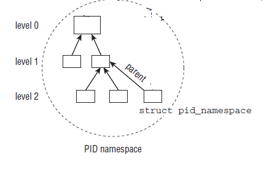
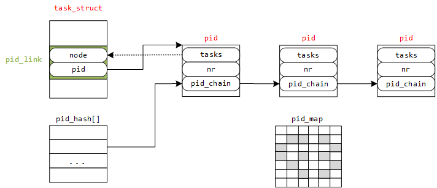
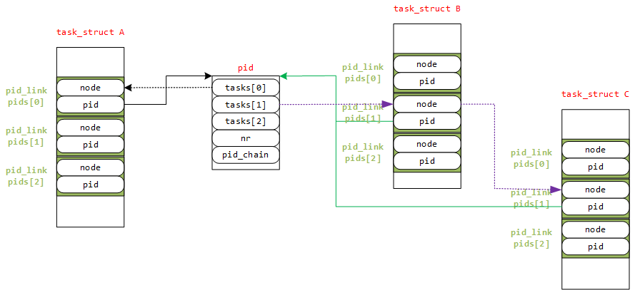
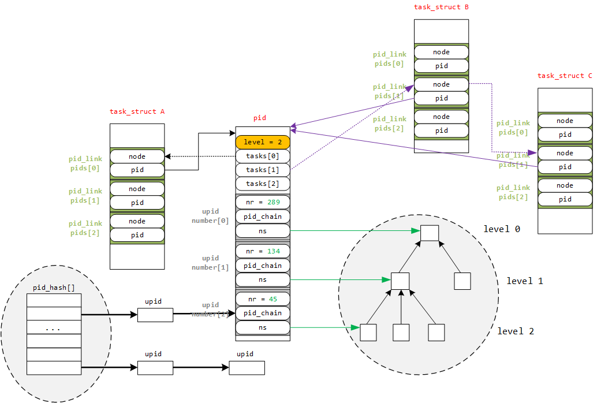

***Linux进程ID号***

- 1 概述
- 2 进程ID概述
    - 2.1 进程ID类型
        - 2.1.1 PID
        - 2.1.2 TGID
        - 2.1.3 PGID
        - 2.1.4 SID
    - 2.2 PID命名空间
        - 2.2.1 pid命名空间概述
        - 2.2.2 局部ID和全局ID
        - 2.2.3 PID命名空间数据结构
- 3 pid结构描述
    - 3.1 pid与upid
    - 3.2 pidmap用于分配pid的bitmap
    - 3.3 pid_link hash table
    - 3.4 task_struct中的进程ID相关描述符信息
- 4 内核时如何设计task_struct中进程ID相关数据结构的
    - 4.1 一个PID对应一个task时的task_struct设计
    - 4.2 如何快速地根据局部ID、命名空间、ID类型找到对应的task_struct
    - 4.3 如何快速地给新进程在可见的命名空间分配一个唯一的PID
    - 4.4 增加进程ID类型的task_struct设计
    - 4.5 增加PID命名空间的task_struct设计
- 5 Linux进程ID管理函数
    - 5.1 根据pid号查找struct pid
    - 5.2 根据task_struct查找局部ID
    - 5.3 根据pid查找task_struct
    - 5.4 生成唯一的PID

# 1. 概述

Linux内核使用task\_struct数据结构来关联所有与进程有关的数据结构，Linux内核所有涉及到进程和程序的所有算法都是围绕该数据结构建立的，
是内核中最重要的数据结构之一。

该数据结构定义在include/linux/sched.h中定义，本篇文章只关注该数据结构如何来组织和管理进程ID的。

# 2. 进程ID概述

## 2.1 进程ID类型

要想了解内核如何来组织和管理进程ID，先要知道进程ID的类型。内核中进程ID的类型用pid\_type来描述，它被定义在include/linux/pid.h中。
```c
enum pid_type
{
    PIDTYPE_PID,
    PIDTYPE_PGID,
    PIDTYPE_SID,
    PIDTYPE_MAX
};
```
之所以**不包括线程组ID**，是因为内核已经由指向到**线程组**的**task\_struct**指针**group\_leader**，线程组ID无非就是**group\_leader的PID**。

### 2.1.1 PID

PID是Linux中在其命名空间中唯一标识进程而分配给它的一个号码，称做进程ID号，简称PID。
在使用fork或clone系统调用时产生的进程均会由内核分配一个新的唯一的PID值。

这个pid用于内核唯一区分每个进程。

> 注意：它并不是我们用户空间通过getpid()所获得到的哪个进程号，至于原因么，接着往下看。

### 2.1.2 TGID

**TGID线程组（轻量级线程组）**的ID标识，在一个进程中，如果以**CLONE\_THREAD标志**来调用clone建立的进程就是
**该进程的一个线程**（即**轻量级进程**，Linux其实没有严格的线程概念），它们处于一个线程组，该**线程组的所有线程的ID叫做TGID**。

处于相同的线程组的所有进程都有相同的TGID，但是由于它们是不同的进程，因此其pid各不相同；
**线程组组长（也叫主线程）**的TGID与其PID相同；一个**进程没有使用线程**，则其**TGID与PID也相同**。

### 2.1.3 PGID

**独立的进程可以组成进程组**（使用**setgrp系统调用**），进程组可以简化向所有组内进程发送信号的操作。

例如，**用管道连接的进程处于同一进程组内**。进程组ID叫做PGID，进程组内的所有进程都有相同的PGID，等于**该组组长的PID**。

### 2.1.4 SID

**几个进程组**可以合并成一个会话组（使用**setsid系统调用**），可以用于终端程序设计。会话组中所有进程都有相同的SID，保存在task\_struct的session成员中。

## 2.2 PID命名空间

### 2.2.1 pid命名空间概述

**命名空间**是为**操作系统层面的虚拟化机制**提供支撑，目前实现有六种不同的命名空间，分别为：
- mount Namespace
- UTS Namespace
- IPC Namespace
- User Namespace
- PID Namespace
- Network Namespace

命名空间简单来说提供的是**对全局资源的一种抽象**，将资源放到不同的容器中（不同的命名空间），各容器彼此隔离。

### 2.2.2 局部ID和全局ID

命名空间增加了PID管理的复杂性。

回想一下，PID命名空间按**层次组织**。在建立一个新的命名空间时，**子命名空间的所有PID**对**父命名空间都是可见**的，
但是命名空间无法看到父命名空间的PID。
但这意味着某些进程具有多个PID，凡可以看到该进程的命名空间，都会为其分配一个PID。
这必须反映在数据结构中。我们必须区分**局部ID**和**全局ID**。

- 全局ID：在内核本身和初始命名空间中唯一的ID，在系统启动期间开始的init进程属于该初始命名空间。系统中每个进程都对应了该命名空间的一个PID，叫全局ID，保证在整个系统中唯一。
- 局部ID：对于属于某个特定的命名空间，它在其命名空间内分配的ID为局部ID，该ID也可以出现在其他的命名空间中。

全局PID和全局TGID直接保存在task\_struct中，分别是task\_struct的pid和tgid成员：
```c
    struct task_struct {
        ......
        
        pid_t pid;
        pid_t tgid;
        
        ......
    }
```
两项都是**pid\_t类型**，该**类型定义为\_\_kernel\_pid\_t**，后者由**各个体系结构分别定义**。通常定义为int，即可以同时使用2**32个不同的ID。

**会话session和进程group组ID**不是直接包含在task\_struct本身中，但保存**在用于信号处理的结构**中。
- task\_struct->signal->\_\_session 表示**全局SID**
- task\_struct->\_\_pgrp 表示**全局PGID**

辅助函数set\_task\_session和set\_task\_pgrp可以用于修改这些值。

除了这两个字段外，内核还需要找一个办法来管理所有**命名空间内部的局部量**，以及其他ID（如TID和SID）。
这需要几个相互连接的数据结构，以及许多辅助函数，并将在下文讨论。

下文将使用ID指代提到的任何进程ID。在必要的情况下，会明确说明ID类型（例如，TGID，即线程组ID）。

一个小型的**子系统**称之为**PID分配器（pid allocator）**用于加速新ID的分配。
此外，内核需要提供辅助函数，以实现**通过ID及其类型查找进程的task\_struct**的功能，
以及将**ID的内核表示形式和用户空间可见的数值进行转换**的功能。

### 2.2.3 PID命名空间数据结构

在介绍表示ID本身的数据结构之前，我们需要讨论PID命名空间的表示方式，定义在include/linux/pid_namespace.h中
```c
struct pid_namespace {
    struct kref kref;
    struct pidmap pidmap[PIDMAP_ENTRIES];
    int last_pid;
    unsigned int nr_hashed;
    struct task_struct *child_reaper;
    struct kmem_cache *pid_cachep;
    unsigned int level;
    struct pid_namespace *parent;
    
    ......
};

```
我们这里只关心其中的child\_reaper，level和parent这三个字段。

字段 | 描述
---|:---
kref | 表示指向**pid_namespace的个数**
pidmap | bitmap结构表示**分配pid的位图**。当需要分配一个新pid时只需查找位图，</br>找到**bit为0的位置并置1**，然后**更新统计数据域**（nr_free）。
last_pid | 用于pidmap的分配，指向最后一个分配的pid的位置。
child_reaper | 指向的是**当前命名空间的init进程**，每个命名空间都有一个作用相当于全局init进程的进程。
pid_chachep | 域指向**分配pid的slab的地址**
level | 代表**当前命名空间的等级，初始命名空间的level为0**，它们的子命名空间level为1，</br>依次递增，而且子命名空间对父命名空间是可见的。</br>从**给定的**level设置，内核即可推断**进程会关联到多少个ID**。
parent | 指向**父命名空间的指针**



实际上PID分配器也需要依靠该结构的某些部分来连续生成唯一ID，但我们目前对此无需关注。

**每个PID命名空间都具有一个进程**，其发挥的作用**相当于全局的init进程**。
init进程的一个目的是对**孤儿进程调用wait4()**系统调用，命名空间局部的**init变体**也必须完成该工作。

# 3. pid结构描述

## 3.1 pid与upid

**PID的管理**围绕两个数据结构展开：
- struct pid：是**内核对PID的内部表示**。
- struct upid：则表示**特定的命名空间中可见**的信息。

两个数据结构定义在include/linux/pid.h中
```c
struct upid {
    /* Try to keep pid_chain in the same cacheline as nr for find_vpid */
    int nr;
    struct pid_namespace *ns;
    struct hlist_node pid_chain;
};
```
struct upid是一个特定namespace里面的进程的信息，包含该namespace里面具体ID号，namespace指针，哈希表指针。

字段 | 描述
---|:---
nr | 表示在该命名空间所分配的进程ID具体的值
ns | 指向命名空间指针
pid_chain | 指向PID哈希列表的指针，用于关联对应的PID

所有upid实例都保存在一个散列表中，稍后我们会看到该结构。

```c
struct pid
{
    atomic_t count;
    unsigned int level;
    /* lists of tasks that use this pid */
    struct hlist_head tasks[PIDTYPE_MAX];
    struct rcu_head rcu;
    struct upid numbers[1];
};
```

字段 | 描述
---|:---
count | 是指使用该PID的task的数目
level | 表示可以看到该PID的命名空间的数目，也就是包含该进程的命名空间的深度
tasks[PIDTYPE_MAX] | 是一个数组，每个数组项都是一个散列表头
numbers[1] | 一个upid的实例数组，每个数组代表一个命名空间，用来表示一个PID可以属于不同的命名空间，</br>该元素放在末尾，可以向数组添加附加的项。

> task是一个数组，每个数组项都是一个散列表头，对应于一个ID类型分别是：PIDTYPE_PID、PIDTYPE_PGID、PIDTYPE_SIG（PIDTYPE_MAX表示ID类型的数目）这么做是必要的，应为一个ID可能用于几个进程。所有共享同一ID的task_struct实例，都通过该散列表连接起来。这个枚举常量PIDTYPE_MAX，正好是PID_TYPE类型的数目，这里Linux内核使用了一个小技巧来由编译器自动生成ID类型的数目。

此外，还有两个结构我们需要说明，就是pidmap和pidlink
- pidmap：当需要分配一个新的pid时查找可用pid的bitmap
- pid_link：是pid的hash table存储结构

## 3.2 pidmap用于分配pid的bitmap

pidmap数据结构定义在include/linux/pid_namespace.h中

```c
struct pidmap {
    atomic_t nr_free;
    void *page;
};
```

字段 | 描述
---|:---
nr_free | 表示还能分配的pid的数量
page | 指向的是存放pid的物理页

> pidmap[PIDMAP_ENTRIES]域表示该pid_namespace下pid已分配的情况。

## 3.3 pid_link hash table

task\_struct中的pids[PIDTYPE\_MAX]指向了和该task\_struct相关的pid结构体。

pid_link数据结构定义在include/linux/pid.h中

```c
struct pid_link
{
    struct hlist_node node;
    struct pid *pid;
};
```

## 3.4 task_struct中的进程ID相关描述符信息

```
struct task_struct  
{  
    ......  
    
    pid_t pid;  
    pid_t tgid;  
    struct task_struct *group_leader;  
    struct pid_link pids[PIDTYPE_MAX];  
    struct nsproxy *nsproxy;  
    
    ......  
};
```

字段 | 描述
---|:---
pid | 指该进程的进程描述符。在fork函数中对其进程赋值的
tgid | 指该进程的线程描述符。在Linux内核对线程并没有做特殊的处理，还是由task\_struct来管理。</br>所以从内核的角度看，用户态的线程本质还是一个进程。</br>对于同一进程（用户态角度）中不同的线程其tgid是相同的，但是pid各不相同。</br>主线程即group\_leader（主线程会创建其他所有的子线程）。</br>如果是单线程进程（用户角度），它的pid等于tgid。
group\_leader | 除了在多线程的模式下指向主线程，还有一个用处，当一些进程组成一个进群组时（PIDTYPE\_PGID），该域指向该组的leader。
pids | pids[0]是PIDTYPE\_PID类型的，指向自己的PID结构，其余指向了相应群组的leader的PID结构，也就是组长的PID结构。
nsproxy | 指针指向namespace相关的域，通过nsproxy域可以知道该task\_struct属于哪个pid\_namespace

对于用户态程序来说，调用getpid()函数其实返回的是tgid，因此线程组中的进程ID应该是一致的，但是他们PID不一致，这也是内核区分它们的标识。
1. 多个task_struct可以共用一个PID
2. 一个PID可以属于不同的命名空间
3. 当需要分配一个新的pid时，只需要查找pidmap位图即可

那么最终，Linux下进程命名空间和进程的关系结构如下：


可以看到，多个task_struct指向一个PID，同时PID的hash数组里按照不同类型对task进行散列，并且一个PID会属于多个命名空间。

# 4. 内核时如何设计task_struct中进程ID相关数据结构的

Linux内核在设计管理ID的数据结构时，要充分考虑以下因素：
1. 如何快速地根据**进程的task\_struct、ID类型、命名空间**找到**局部ID**
2. 如何快速地根据**局部ID、命名空间、ID类型**找到**进程的task\_struct**
3. 如何快速地给**新进程**在可见的**命名空间**内分配一个**唯一的PID**

如果将所有因素（主要是**进程的task\_struct，ID类型，命名空间，局部ID**，唯一ID这5个因素）考虑到一起，将会很复杂，
下面将会**由简到繁设计该结构**。

## 4.1 一个PID对应一个task时的task_struct设计

一个PID对应一个task\_struct如果先不考虑进程之间的关系，不考虑命名空间，仅仅是一个PID号对应一个task\_struct（一对一情况），那么我们可以设计这样的数据结构。

```c
struct task_struct
{
    //...
    struct pid_link pids;   
    //...
};

struct pid_link
{
    struct hlist_node node;
    struct pid *pid;
};

struct pid
{
    struct hlist_head tasks;     //指回 pid_link 的 node
    int nr;                      //PID
    struct hlist_node pid_chain; //pid hash 散列表结点
};
```
每个进程的task\_struct结构体中有一个指向pid结构体的指针，pid结构包含了PID号。



## 4.2 如何快速地根据局部ID、命名空间、ID类型找到对应的task_struct

- pid_hash[]

这是一个hash表的结构，根据pid的nr值哈希到某个表项，若由多个pid结构对应到同一表项，这样解决冲突使用的是拉链法。

这样，就能解决开始提出的**第2个问题**（根据PID值怎样快速地找到task_struct结构体）：
1. 首先通过PID计算pid挂接到哈希表pid_hash[]的表项
2. 遍历该表项，找到pid结构体（实际是upid结构体）中nr值域PID值相同的那个pid
3. 在通过该pid结构体的tasks指针找到node（一对一情况下，直接将task指向pid_link的node就行）
4. 最后根据内核的container\_of机制就能找到task_struct结构体

## 4.3 如何快速地给新进程在可见的命名空间分配一个唯一的PID

- pid_map

这是一个位图，用来唯一分配PID的结构，图中灰色表示已经分配过的值，在新建一个进程时，只需在其中找到一个分配
过的值赋给pid结构体的nr，再将pid_map中该值设为已分配标志。这也就解决了上面的**第3个问题**——快速地分配一个全局的PID。

至于上面的**第1个问题**就更加简单，已知task\_struct结构体，根据其pid\_link的pid指针找到pid结构体，取出其nr即为PID号。

## 4.4 增加进程ID类型的task_struct设计

如果考虑进程之间有复杂的关系，如**线程组TGID、进程组PGID、会话组SID**，这些组均有组ID。
所以原来的task\_struct中**pid\_link指向一个pid结构体需要增加几项**，用来指向到**其组长的pid结构体**，
相应的struct pid原本只需要指回其PID所属进程的task\_struct，现在要增加几项，用来链接那些以**该pid为组长的所有进程组内进程**。

数据结构如下：
```c
enum pid_type
{
    PIDTYPE_PID,
    PIDTYPE_PGID,
    PIDTYPE_SID,
    PIDTYPE_MAX
};

struct task_struct
{
    pid_t pid; //PID
    pid_t tgid; //thread group id
    struct task_struct *group_leader; // threadgroup leader
    struct pid_link pids[PIDTYPE_MAX];  
    struct nsproxy *nsproxy;
};

struct pid_link
{
    struct hlist_node node;
    struct pid *pid;
};

struct pid
{
    struct hlist_head tasks[PIDTYPE_MAX];
    int nr; //PID
    struct hlist_node pid_chain; // pid hash 散列表结点
};

struct pid_link
{
    struct hlist_node node;
    struct pid *pid;
};
```

上面ID的类型PIDTYPE\_MAX表示**ID类型数目**。
之所以**不包括线程组ID**，是因为内核已经由指向**到线程组**的task\_struct指针group\_leader，**线程组ID就是group\_leader的PID**。

加入现在有进程A、B、C为同一个**进程组**，进程**组长为A**，这样的结构示意图如下：



关于上图有几点需要说明：
- 图中省去了pid\_hash、pid\_map结构，因为第1种情况类似。
- 进程A、B、C所以有三个task\_struct结构体，task\_struct A的pids[0]指向pid，因为pids[0]就是PID的类型0对应的是PIDTYPE\_PID，表明pids[0]指向的pid就是task\_struct A的PID，而不是进程组或会话组的组长的pid结构！所以图中的结构体pid是进程A的pid。
- 进程B和C的进程组组长为A，那么进程B和进程C的task\_struct结构中的pids[PIDTYPE\_PGID]的pid指针指向进程A的pid结构体。上图，进程B和进程C的pids[PIDTYPE\_PID]会指向自己的pid结构体，只是图中没有体现而已。
- 进程A是进程B和C的组长，进程A的pid结构体的tasks[PIDTYPE\_PGID]（task[1]）是一个散列表的头，它将所有以该pid为组长的进程链接起来，图中的结构体pid是进程A的PID，而A是组长，B和C是进程组的组员，所以将A的pid中task[PIDTYPE\_PGID]指向进程B的task\_struct中的pid\_link[PIDTYPE\_PGID]中的node。

在回顾上面提到的三个基本问题，在此结构上很好去实现。

## 4.5 增加PID命名空间的task_struct设计

一个进程就可能由多个PID（意味着一个task\_struct会对应多个upid），因为在一个可见的命名空间内会分配一个PID，这样就需要改变pid的结构了，如下：
```c
enum pid_type
{
    PIDTYPE_PID,
    PIDTYPE_PGID,
    PIDTYPE_SID,
    PIDTYPE_MAX
};

struct task_struct
{
    pid_t pid; //PID
    pid_t tgid; //thread group id
    struct task_struct *group_leader; // threadgroup leader
    struct pid_link pids[PIDTYPE_MAX];  
    struct list_head thread_group;
    struct list_head thread_node;
    struct nsproxy *nsproxy;
};

struct pid_link
{
    struct hlist_node node;
    struct pid *pid;
};

struct pid
{
    unsigned int level;
    /* 使用该pid的进程的列表， lists of tasks that use this pid  */
    struct hlist_head tasks[PIDTYPE_MAX];
    struct upid numbers[1];
};

struct upid
{
    int nr;
    struct pid_namespace *ns;
    struct hlist_node pid_chain;
};
```

在pid结构体中增加了一个表示该进程所处的命名空间的层次level，以及一个可扩展的upid结构体。

对于struct upid，nr表示在该命名空间所分配的进程的ID，ns指向是该ID所属的命名空间，pid\_chain表示在该命名空间的散列表。
- 进程的结构体是task\_struct，一个进程对应一个task\_struct结构体（一对一）。一个进程会有PIDTYPE\_MAX（3个）个pid\_link结构体（一对多），这3个结构体中的pid分别指向：
    - 1 该进程对应进程本身（PIDTYPE\_PID）的真实的pid结构体
    - 2 该进程的进程组（PIDTYPE\_PGID）的组长本身的pid结构体
    - 3 该进程的会话组（PIDTYPE\_SID）的组长本身的pid结构体

所以，一个真实的进程只会有一个真实的pid结构体；thread\_group指向的是该线程所在线程组的链表头；thread\_node是线程组中的节点。

- 结构体upid的数组number[1]，数组项个数取决于该进程pid的level值，每个数组项代表一个命名空间，这个就是用来一个PID可以属于不同的命名空间，nr值表示该进程在该命名空间的pid值，ns指向该信息所在的命名空间，pid\_chain属于哈希表的节点。系统有一个pid\_hash[]，通过pid在某个命名空间的nr值哈希到某个表项，如果多个nr值哈希到同一个表项，将其加入链表，这个节点就是upid的pid_chain。

遍历线程所在线程组的所有线程函数while\_each\_thread(p, t)使用了：
```c
static inline struct task_struct *next_thread(const struct task_struct *p)
{
	return list_entry_rcu(p->thread_group.next,
			      struct task_struct, thread_group);
}

#define while_each_thread(g, t) \
	while ((t = next_thread(t)) != g)
```

扫描同一个进程组的可以，扫描与current->pids[PIDTYPE\_PGID]（这是进程组组长pid结构体）对应的PIDTYPE\_PGID类型的散列表（因为是进程组组长，所以其真实的pid结构体中tasks[PIDTYPE\_PGID]是这个散列表的表头）中的每个PID链表。

举例来说，在level 2的某个命名空间上新建了一个进程，分配给它的pid为45，映射到level 1的命名空间，分配给它的pid为134；再映射到level 0的命名空间，分配给它的pid为289，对于这样的例子，如图所示为其表示：



如中关于如何分配唯一的PID没有画出，但是比较简单，与前面两种情况不同的是，这里分配唯一的PID时有命名空间的容器的，
在PID命名空间内必须唯一，但各个命名空间之间不需要唯一。

至此，已经与Linux内核中数据结构相差不多了。

# 5. Linux进程ID管理函数

有了上面复杂的数据结构，在加上散列表等数据结构的操作，就可以写出我们前面所提到的三个问题的函数了。

## 5.1 根据pid号查找struct pid

很多时候在写内核模块的时候，需要提供进程的pid找到对应进程的task\_struct，其中首先就需要通过进程的pid找到进程的struct pid，然后在通过struct pid找到进程的task\_struct。

实现函数由三个：
```c
struct pid *find_pid_ns(int nr, struct pid_namespace *ns)
struct pid *find_vpid(int nr)
struct pid *find_get_pid(pid_t nr)
```

find\_pid\_ns获得pid实体的实现原理，主要使用哈希查找。内核使用哈希表组织strcut pid，每创建一个新进程，给进程的struct pid都会插入到哈希表中，这时候就需要使用进程的进程pid和pid命名空间ns在哈希表中相应的struct pid索引出来，现在可以看下
find\_pid\_ns的传入参数，也是通过nr和ns找到struct pid。

根据局部PID以及命名空间计算在pid\_hash数组中的索引，然后遍历散列表找到所要的upid，在根据内核的container\_of机制找到pid实例。

代码如下：
```c
struct pid *find_pid_ns(int nr, struct pid_namespace *ns)
{
        struct hlist_node *elem;
        struct upid *pnr; 
        //遍历散列表
        hlist_for_each_entry_rcu(pnr, elem,
                        &pid_hash[pid_hashfn(nr, ns)], pid_chain)  //pid_hashfn() 获得hash的索引
                if (pnr->nr == nr && pnr->ns == ns) ////比较 nr 与 ns 是否都相同
                        return container_of(pnr, struct pid,  //根据container_of机制取得pid 实体
                                        numbers[ns->level]);

        return NULL;
}
```

而另外两个函数则是对其进行进一步的封装，如下：
```c
struct pid *find_vpid(int nr)
{
        return find_pid_ns(nr, current->nsproxy->pid_ns);
}

struct pid *find_get_pid(pid_t nr)
{ 
        struct pid *pid; 

        rcu_read_lock();
        pid = get_pid(find_vpid(nr)); 
        rcu_read_unlock();

        return pid; 
}
```

find\_pid\_ns是最终的实现，find\_vpid是调用find\_pid\_ns实现的，find\_get\_pid又是调用find\_vpid实现的。

由源代码可以看出find\_vpid和find\_pid\_ns是一样的，而find\_get\_pid和find\_vpid有一点差异：
- find\_get\_pid将返回的struct pid中的字段count加1（调用了get\_pid使得count+1）
- find\_vpid将返回的struct pid中的字段count不变

## 5.2 根据task_struct查找局部ID

根据进程的task\_struct、ID类型、命名空间，可以很容易获得其在命名空间内的局部ID。

获得与task\_struct关联的pid结构体。辅助函数有task\_pid、task\_tgid、task\_pgrp和task\_session，分别用来获取不同类型的ID的pid实例。

- 获取PID的实例：
```c
static inline struct pid *task_pid(struct task_struct *task)
{
	return task->pids[PIDTYPE_PID].pid;
}
```
- 获取线程组的ID，前面也说过，TGID不过是线程组组长的PID而已：
```c
static inline struct pid *task_tgid(struct task_struct *task)
{
	return task->group_leader->pids[PIDTYPE_PID].pid;
}
```
- 获得PGID和SID，首先需要找到该线程组组长的task\_struct，在获得其相应的pid：
```c
static inline struct pid *task_pgrp(struct task_struct *task)
{
	return task->group_leader->pids[PIDTYPE_PGID].pid;
}

static inline struct pid *task_session(struct task_struct *task)
{
	return task->group_leader->pids[PIDTYPE_SID].pid;
}
```
- 获得pid实例之后。在根据pid中的numbers数组中的upid信息，获得局部PID：
```c
pid_t pid_nr_ns(struct pid *pid, struct pid_namespace *ns)
{
	struct upid *upid;
	pid_t nr = 0;
	if (pid && ns->level <= pid->level)
    {
		upid = &pid->numbers[ns->level];
		if (upid->ns == ns)
			nr = upid->nr;
	}
	return nr;
}
```

这里指的注意的是，由于PID命名空间的层次性，父命名空间能看到子命名空间的内容，反之则不能。
因此，函数中需要确保当前命名空间的level小于等于局部PID的命名空间的level。

除了这个函数之外，内核还封装了其他函数用来从pid实例获得pid值，如pid\_nr、pid\_vnr等。在此不介绍了。

结合这两部，内核提供了进一步的封装，提供一下函数：
```c
pid_t task_pid_nr_ns(struct task_struct *tsk, struct pid_namespace *ns);
pid_t task_tgid_nr_ns(struct task_struct *tsk, struct pid_namespace *ns);
pid_t task_pigd_nr_ns(struct task_struct *tsk, struct pid_namespace *ns);
pid_t task_session_nr_ns(struct task_struct *tsk, struct pid_namespace *ns);
```
从函数名上就能推断函数的功能，起始不外于封装了上面的两步。

## 5.3 根据pid查找task_struct

- 根据PID号（nr值）取得task\_struct结构体
- 根据PID以及其类型（即为局部ID和命名空间）获取task\_struct结构体

如果根据的是进程的ID号，我们可以先通过ID号（nr值）获得进程struct pid实体（局部ID），然后通过局部ID以及命名空间，获得进程的task\_struct结构体。

可以使用pid\_task()根据pid和pid\_type获得到进程的task\_struct：
```c
struct task_struct *pid_task(struct pid *pid, enum pid_type type)
{
	struct task_struct *result = NULL;
	if (pid) {
		struct hlist_node *first;
		first = rcu_dereference_check(hlist_first_rcu(&pid->tasks[type]),
		lockdep_tasklist_lock_is_held());
		if (first)
			result = hlist_entry(first, struct task_struct, pids[(type)].node);
	}
    
	return result;
}
```
那么我们根据pid号查找进程task的过程就成为：
```c
pTask = pid_task(find_vpid(pid), PIDTYPE_PID);  
```
内核还提供其他函数用来实现上面两步：
```c
struct task_struct *find_task_by_pid_ns(pid_t nr, struct pid_namespace *ns);
struct task_struct *find_task_by_vpid(pid_t vnr);
```
> 由于linux进程是组织在双向链表和红黑树中的，因此我们通过遍历链表或者树也可以找到当前进程，但是这个并不是我们今天的重点。

## 5.4 生成唯一的PID

内核中使用下面两个函数来实现分配和回收PID的：
```c
static int alloc_pidmap(struct pid_namespace *pid_ns);
static void free_pidmap(struct upid *upid);
```
在这里我们不关注这两个函数的显示，反而应该关注分配的PID如果在多个命名空间中可见，
这样需要在每个命名空间生成一个局部ID，函数alloc\_pid为新建的进程分配PID，简化版如下：
```c
struct pid *alloc_pid(struct pid_namespace *ns)
{
	struct pid *pid;
	enum pid_type type;
	int i, nr;
	struct pid_namespace *tmp;
	struct upid *upid;
	tmp = ns;
	pid->level = ns->level;
	
	// 初始化 pid->numbers[] 结构体
	for (i = ns->level; i >= 0; i--) {
		nr = alloc_pidmap(tmp); //分配一个局部ID
		pid->numbers[i].nr = nr;
		pid->numbers[i].ns = tmp;
		tmp = tmp->parent;
	}
	
	// 初始化 pid->task[] 结构体
	for (type = 0; type < PIDTYPE_MAX; ++type)
		INIT_HLIST_HEAD(&pid->tasks[type]);
	
    // 将每个命名空间经过哈希之后加入到散列表中
	upid = pid->numbers + ns->level;
	for ( ; upid >= pid->numbers; --upid) {
		hlist_add_head_rcu(&upid->pid_chain, &pid_hash[pid_hashfn(upid->nr, upid->ns)]);
    	upid->ns->nr_hashed++;
	}
    return pid;
}
```