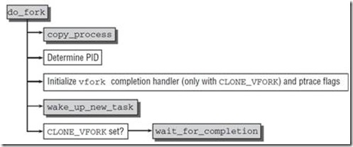
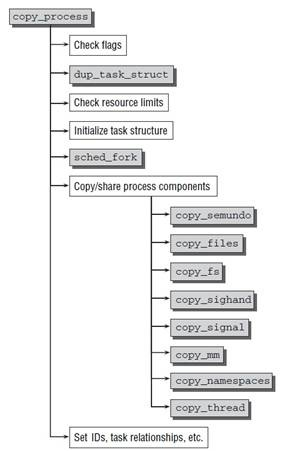

***Linux下进程的创建过程分析(\_do\_fork和do\_fork详解)***

- 1 用户空间创建进程/线程的三种方法
- 2 fork，vfork，clone系统调用的实现
- 3 sys_fork的实现
- 4 sys_vfork的实现
- 5 sys_clone的实现
- 6 创建子进程的流程
    - 6.1 do_fork的流程
    - 6.2 copy_process流程
    - 6.3 dup_task_struct流程
    - 6.4 sched_fork流程
    - 6.5 copy_thread流程
- 7 总结
    - 7.1 简化的copy_process流程
    - 7.2 进程退出
        - 7.2.1 sys_exit_group
        - 7.2.2 do_exit

# 1. 用户空间创建进程/线程的三种方法

Unix标准的复制进程的系统调用是fork，但是Linux，BSD等操作系统并不止实现这一个，确切地说Linux实现了三个即：
fork，vfork，clone（确切地说vfork创造出来的是轻量级进程，也叫线程，是共享资源的进程）。


系统调用 | 描述
---|:---
fork | fork创造的子进程是父进程的完整副本，复制了父进程的资源，包括内存的task\_struct内容
vfork| vfork创建的子进程与父进程共享数据段，而且由vfork()创建的子进程将优先于父进程运行
clone | Linux上创建线程一般使用的是pthread库，实际上Linux也给我们提供了创建线程的系统调用，就是clone

fork，vfork和clone的系统调用入口地址分别是：sys\_fork，sys\_vfork和sys\_clone，而它们是定义是依赖于体系结构的，因为在用户空间和内核空间之间传递参数的方法因体系结构而异。

> 系统调用的参数传递
>
> 系统调用的实现与C库不同，普通C函数通过将参数的值压入进程的栈中进行参数的传递。由于系统调用时通过特定指令中断进程从用户态到内核态的一种特殊的函数调用，没有用户态或者内核态的堆栈可以被用来调用函数与被调用函数之间进行参数传递。系统调用通过CPU的寄存器来进行参数传递。在进行系统调用之前，系统调用的参数被写入CPU的寄存器，而在实际调用系统服务例程之前，内核将CPU寄存器的内容拷贝到内核堆栈中，实现参数的传递。

因此不同的体系结构可能采用不同的方式或者不同的寄存器来传递参数，而上面函数的任务就是从处理器的寄存器中提取用户空间提供的信息，并调用体系结构无关的\_do\_fork()函数负责进程的复制。

即不同的体系结构可能需要采用不同的方式或寄存器来存储调用的参数，因此Linux在设计系统调用的时候，将其划分成体系结构相关的层次与体系结构无关的层次，前者复杂提取依赖于体系结构的特定参数，后者则依据参数的设置执行特定的真正操作。

# 2. fork，vfork，clone系统调用的实现

Linux 2.5.32以后，添加了TLS（Thread Local Storage）机制，clone的表示CLONE\_SETTLS接受一个参数来设置线程的本地存储区。
sys\_clone也因此增加了一个int参数来传入相应的tls\_val。
sys\_clone通过do\_fork来调用copy\_process完成进程的复制，它调用特定的copy\_thread和copy\_thread把相应的系统调用参数从pt\_reg寄存器列表中提取出来，但是会导致意外的情况。

> only one code path into copy_thread can pass the CLONE_SETTLS flag, and that code path comes from sys_clone with its architecture-specific argument-passing order.

前面我们说了，在实现函数调用的时候，sys\_clone等，将体系结构的参数从寄存器中提取出来，然后到达do\_fork这步的时候已经是体系结构无关了。但是我们sys\_clone需要设置CLONE\_SETTLS的tls仍然是个依赖于体系结构的参数，这里就会出现问题。

因此Linux 4.2之后选择进入一个新的CONFIG\_HAVE\_COPY\_THREAD\_TLS和一个新的COPY\_THREAD\_TLS接收TLS参数为额外的长整型（系统调用参数大小）的争论。改变sys\_clone的TLS参数unsigned long，并传递到copy\_thread\_tls。

```c
extern long do_fork(unsigned long, unsigned long, unsigned long, int __user *, int __user *);

#ifndef CONFIG_HAVE_COPY_THREAD_TLS
/* For compatibility with architectures that call do_fork directly rather than
 * using the syscall entry points below. */
long do_fork(unsigned long clone_flags,
              unsigned long stack_start,
              unsigned long stack_size,
              int __user *parent_tidptr,
              int __user *child_tidptr)
{
        return _do_fork(clone_flags, stack_start, stack_size,
                        parent_tidptr, child_tidptr, 0);
}
#endif
```
我们会发现，新版本的系统中clone的TLS设置标识会通过TLS参数传递，因此\_do\_fork()代替了老版本的do\_fork。

老版本的do\_fork只有在如下情况才会定义：
- 只有当系统不支持通过TLS参数传递而是使用pt\_regs寄存器列表传递时
- 未定义CONFIG\_HAVE\_COPY\_THREAD\_TLS宏


参数 | 描述
---|:---
clone\_flags | 与clone()参数flags相同，用来控制父进程复制过的一些属性信息，描述你需要从父进程继承哪些资源。</br>该标志位的4个字节分为两部分：</br>最低的一个字节为子进程结束时发送给父进程的信号代码，通常为SIGCHLD；</br>剩下的三个字节则是各种clone标志的组合，也就是若干个标志之间或运算。</br>通过clone标志可以有选择地对父进程的资源进行复制。
stack\_start | 与clone()参数stack\_start相同，子进程用户态堆栈的地址
regs | 是一个指向了寄存器集合的指针，其中以原始形式，保存了调用的参数，</br>该参数使用的数据类型是特定体系结构的struct pt\_regs，</br>其中按照系统调用执行时寄存器在内核栈上的存储顺序，</br>保存了所有的寄存器即指向内核态堆栈通用寄存器值的指针，</br>通用寄存器的值是从用户态切换到内核态时保存到内核态堆栈中。
stack\_size | 用户态栈的大小，该参数通常是不必要的，总是被设置为0。
parent\_tidptr | 与clone的ptid参数相同，父进程在用户态下pid的地址，该参数在CLONE\_PARENT\_SETTID标志被设置时有意义。
chile\_tidptr | 与clone的ctid参数相同，子进程在用户态下pid的地址，该参数在CLONE\_CHILD\_SETTID标志被设置时有意义。

其中clone\_flags如下表所示：

标志 | 说明
---|:---
CLONE\_VM | 共享内存描述符和所有的页表
CLONE\_FS | 共享根目录和当前工作目录所在的表，以及用于屏蔽</br>文件初始化许可权的掩码值，即文件的umaks
CLONE\_PTRACE | 付过父进程被跟踪，那么子进程也被跟踪
CLONE\_VFORK | 在发出vfork系统调用时设置
CLONE\_STOPPED | 强迫子进程处于TASK\_STOPPED状态
CLONE\_SIGHAND | 共享父进程信号处理表，阻塞信号表和挂起信号表。</br>如果设置了此白纸，就必须同时设置CLONE\_VM标志
CLONE\_THREAD | 把子进程插入到父进程所在的线程组中，并迫使子进程共享父进程的信号描述符。</br>因此该标志被设置时，就必须设置CLONE\_SIGHAND标志

# 3. sys_fork的实现

不同体系结构下fork实现sys\_fork主要是通过标志集合区分，在大多数体系结构上，典型的fork实现方式如下：

```c
#ifdef __ARCH_WANT_SYS_FORK
SYSCALL_DEFINE0(fork)
{
#ifdef CONFIG_MMU
    return do_fork(SIGCHLD, 0, 0, NULL, NULL);
#else
    /* can not support in nommu mode */
    return(-EINVAL);
#endif
}
#endif
```
- 我们可以看到唯一使用的标志是SIGCHLD。这意味着在子进程终止后将发送SIGCHLD信号通知父进程。
- 由于写时复制（COW）技术，最初父子进程的栈地址相同，但是如果操作站地址并写入数据，则COW机制会为每个进程分别创建一个新的栈副本。
- 如果do\_fork成功，则新建进程的pid作为系统调用的结果返回，否则返回错误码。

# 4. sys_vfork的实现

```
#ifdef __ARCH_WANT_SYS_VFORK
SYSCALL_DEFINE0(vfork)
{
    return do_fork(CLONE_VFORK | CLONE_VM | SIGCHLD, 0,
            0, NULL, NULL);
}
#endif
```

可以看到sys\_vfork的实现与sys\_fork只是略微不同, 前者使用了额外的标志CLONE\_VFORK | CLONE\_VM。

# 5. sys_clone的实现

```c
#ifdef __ARCH_WANT_SYS_CLONE
#ifdef CONFIG_CLONE_BACKWARDS
SYSCALL_DEFINE5(clone, unsigned long, clone_flags, unsigned long, newsp,
         int __user *, parent_tidptr,
         int, tls_val,
         int __user *, child_tidptr)
#elif defined(CONFIG_CLONE_BACKWARDS2)
SYSCALL_DEFINE5(clone, unsigned long, newsp, unsigned long, clone_flags,
         int __user *, parent_tidptr,
         int __user *, child_tidptr,
         int, tls_val)
#elif defined(CONFIG_CLONE_BACKWARDS3)
SYSCALL_DEFINE6(clone, unsigned long, clone_flags, unsigned long, newsp,
        int, stack_size,
        int __user *, parent_tidptr,
        int __user *, child_tidptr,
        int, tls_val)
#else
SYSCALL_DEFINE5(clone, unsigned long, clone_flags, unsigned long, newsp,
         int __user *, parent_tidptr,
         int __user *, child_tidptr,
         int, tls_val)
#endif
{
    return do_fork(clone_flags, newsp, 0, parent_tidptr, child_tidptr);
}
#endif
```
我们可以看到sys\_clone的标识不再是硬编码的，而是通过各个寄存器参数参数到系统调用，因而我们需要提取这些参数。

另外，clone也不再复制进程的栈，而是可以指定新的栈地址，在生成线程时，可能需要这样做，线程可能于父进程共享地址空间，但是线程自身的栈可能再另外一个地址空间。

另外还指定了用户空间的两个指针（parent\_tidptr和child\_tidptr），用于与线程库通信。

# 6. 创建子进程的流程

## 6.1 do_fork的流程

所有进程复制(创建)的fork机制最终都调用了kernel/fork.c中的do\_fork（一个体系结构无关的函数）。

do\_fork以调用copy\_process开始，后者执行生成新的进程的实际工作，并根据指定的标志复制父进程的数据。
在子进程生成后，内核必须执行下列首尾工作：
1. 调用copy\_process为子进程复制出一份进程信息
2. 如果是vfork（设置了CLONE\_VFORK和ptrace标志）初始化完成处理信息
3. 调用wake\_up\_new\_task将子进程加入调度器，为之分配CPU
4. 如果是vfork，父进程等待子进程完成exec替换自己的地址空间
    
> 我们从《深入Linux内核架构》中找出了早期的流程图，基本一致可以作为参考



```c
/*
 *  Ok, this is the main fork-routine.
 *
 * It copies the process, and if successful kick-starts
 * it and waits for it to finish using the VM if required.
 */
long do_fork(unsigned long clone_flags,
          unsigned long stack_start,
          unsigned long stack_size,
          int __user *parent_tidptr,
          int __user *child_tidptr)
{
    struct task_struct *p;
    int trace = 0;
    long nr;

    /*
     * Determine whether and which event to report to ptracer.  When
     * called from kernel_thread or CLONE_UNTRACED is explicitly
     * requested, no event is reported; otherwise, report if the event
     * for the type of forking is enabled.
     */
    if (!(clone_flags & CLONE_UNTRACED)) {
        if (clone_flags & CLONE_VFORK)
            trace = PTRACE_EVENT_VFORK;
        else if ((clone_flags & CSIGNAL) != SIGCHLD)
            trace = PTRACE_EVENT_CLONE;
        else
            trace = PTRACE_EVENT_FORK;

        if (likely(!ptrace_event_enabled(current, trace)))
            trace = 0;
    }
    
    /*  复制进程描述符，copy_process()的返回值是一个 task_struct 指针  */
    p = copy_process(clone_flags, stack_start, stack_size,
             child_tidptr, NULL, trace, NUMA_NO_NODE);
    /*
     * Do this prior waking up the new thread - the thread pointer
     * might get invalid after that point, if the thread exits quickly.
     */
    if (!IS_ERR(p)) {
        struct completion vfork;
        struct pid *pid;

        trace_sched_process_fork(current, p);
        
        /*  得到新创建的进程的pid信息  */
        pid = get_task_pid(p, PIDTYPE_PID);
        nr = pid_vnr(pid);

        if (clone_flags & CLONE_PARENT_SETTID)
            put_user(nr, parent_tidptr);
        
        /*  如果调用的 vfork()方法，初始化 vfork 完成处理信息 */
        if (clone_flags & CLONE_VFORK) {
            p->vfork_done = &vfork;
            init_completion(&vfork);
            get_task_struct(p);
        }
        
        /*  将子进程加入到调度器中，为其分配 CPU，准备执行 */
        wake_up_new_task(p);

        /* forking complete and child started to run, tell ptracer */
        if (unlikely(trace))
            ptrace_event_pid(trace, pid);
        
  	    /*  如果是 vfork，将父进程加入至等待队列，等待子进程完成  */
        if (clone_flags & CLONE_VFORK) {
            if (!wait_for_vfork_done(p, &vfork))
                ptrace_event_pid(PTRACE_EVENT_VFORK_DONE, pid);
        }

        put_pid(pid);
    } else {
        nr = PTR_ERR(p);
    }
    return nr;
}
```
如果是vfork调用，需要阻塞父进程，直到子进程执行exec。

## 6.2 copy_process流程

1. 调用dup\_task\_struct复制当前的task\_struct
2. 检查进程数是否超过限制，两个因素：操作系统和内存大小。
3. 初始化自旋锁、挂起信号、CPU定时器等
4. 调用sched\_fork初始化进程数据结构，并把进程状态设置为TASK\_RUNNING。
5. 复制所有进程信息，包括文件系统、信号处理函数、信号、内存管理等。
6. 调用copy\_thread\_tls初始化子进程内核栈
7. 为新进程分配并设置新的pid

> 我们从《深入Linux内核架构》中找到早期的流程图，基本一致可以作为参考



```c
/*
 * This creates a new process as a copy of the old one,
 * but does not actually start it yet.
 *
 * It copies the registers, and all the appropriate
 * parts of the process environment (as per the clone
 * flags). The actual kick-off is left to the caller.
 */
static struct task_struct *copy_process(unsigned long clone_flags,
					unsigned long stack_start,
					unsigned long stack_size,
					int __user *child_tidptr,
					struct pid *pid,
					int trace,
					int node)
{
	int retval;
	struct task_struct *p;
	void *cgrp_ss_priv[CGROUP_CANFORK_COUNT] = {};

	if ((clone_flags & (CLONE_NEWNS|CLONE_FS)) == (CLONE_NEWNS|CLONE_FS))
		return ERR_PTR(-EINVAL);

	if ((clone_flags & (CLONE_NEWUSER|CLONE_FS)) == (CLONE_NEWUSER|CLONE_FS))
		return ERR_PTR(-EINVAL);

	/*
	 * Thread groups must share signals as well, and detached threads
	 * can only be started up within the thread group.
	 */
	if ((clone_flags & CLONE_THREAD) && !(clone_flags & CLONE_SIGHAND))
		return ERR_PTR(-EINVAL);

	/*
	 * Shared signal handlers imply shared VM. By way of the above,
	 * thread groups also imply shared VM. Blocking this case allows
	 * for various simplifications in other code.
	 */
	if ((clone_flags & CLONE_SIGHAND) && !(clone_flags & CLONE_VM))
		return ERR_PTR(-EINVAL);

	/*
	 * Siblings of global init remain as zombies on exit since they are
	 * not reaped by their parent (swapper). To solve this and to avoid
	 * multi-rooted process trees, prevent global and container-inits
	 * from creating siblings.
	 */
	if ((clone_flags & CLONE_PARENT) &&
				current->signal->flags & SIGNAL_UNKILLABLE)
		return ERR_PTR(-EINVAL);

	/*
	 * If the new process will be in a different pid or user namespace
	 * do not allow it to share a thread group or signal handlers or
	 * parent with the forking task.
	 */
	if (clone_flags & CLONE_SIGHAND) {
		if ((clone_flags & (CLONE_NEWUSER | CLONE_NEWPID)) ||
		    (task_active_pid_ns(current) !=
				current->nsproxy->pid_ns))
			return ERR_PTR(-EINVAL);
	}

	retval = security_task_create(clone_flags);
	if (retval)
		goto fork_out;

    // 复制当前的 task\_struct
	retval = -ENOMEM;
	p = dup_task_struct(current, node);
	if (!p)
		goto fork_out;

	ftrace_graph_init_task(p);
	get_seccomp_filter(p);
    
    // 初始化互斥锁
	rt_mutex_init_task(p);

#ifdef CONFIG_PROVE_LOCKING
	DEBUG_LOCKS_WARN_ON(!p->hardirqs_enabled);
	DEBUG_LOCKS_WARN_ON(!p->softirqs_enabled);
#endif

    // 检查进程数是否超过限制，由操作系统定义
	retval = -EAGAIN;
	if (atomic_read(&p->real_cred->user->processes) >=
			task_rlimit(p, RLIMIT_NPROC)) {
		if (!capable(CAP_SYS_ADMIN) && !capable(CAP_SYS_RESOURCE) &&
		    p->real_cred->user != INIT_USER)
			goto bad_fork_free;
	}
	current->flags &= ~PF_NPROC_EXCEEDED;

	retval = copy_creds(p, clone_flags);
	if (retval < 0)
		goto bad_fork_free;

	/*
	 * If multiple threads are within copy_process(), then this check
	 * triggers too late. This doesn't hurt, the check is only there
	 * to stop root fork bombs.
	 */
	// 检查进程数是否超过 max_threads由内存大小决定
	retval = -EAGAIN;
	if (nr_threads >= max_threads)
		goto bad_fork_cleanup_count;

	if (!try_module_get(task_thread_info(p)->exec_domain->module))
		goto bad_fork_cleanup_count;

	p->did_exec = 0;
	delayacct_tsk_init(p);	/* Must remain after dup_task_struct() */
	copy_flags(clone_flags, p);
	INIT_LIST_HEAD(&p->children);
	INIT_LIST_HEAD(&p->sibling);
	rcu_copy_process(p);
	p->vfork_done = NULL;
	
	// 初始化自旋锁
	spin_lock_init(&p->alloc_lock);
	
    // 初始化挂起信号
	init_sigpending(&p->pending);

    // 初始化CPU定时器
	p->utime = p->stime = p->gtime = 0;
	p->utimescaled = p->stimescaled = 0;
	prev_cputime_init(&p->prev_cputime);

#ifdef CONFIG_VIRT_CPU_ACCOUNTING_GEN
	seqlock_init(&p->vtime_seqlock);
	p->vtime_snap = 0;
	p->vtime_snap_whence = VTIME_SLEEPING;
#endif

#if defined(SPLIT_RSS_COUNTING)
	memset(&p->rss_stat, 0, sizeof(p->rss_stat));
	p->mm_shmempages = 0;
#endif

	p->default_timer_slack_ns = current->timer_slack_ns;

	task_io_accounting_init(&p->ioac);
	acct_clear_integrals(p);

	posix_cpu_timers_init(p);

	do_posix_clock_monotonic_gettime(&p->start_time);
	p->real_start_time = p->start_time;
	monotonic_to_bootbased(&p->real_start_time);
	p->io_context = NULL;
	p->audit_context = NULL;
	if (clone_flags & CLONE_THREAD)
		threadgroup_change_begin(current);
	cgroup_fork(p);
#ifdef CONFIG_NUMA
	p->mempolicy = mpol_dup(p->mempolicy);
	if (IS_ERR(p->mempolicy)) {
		retval = PTR_ERR(p->mempolicy);
		p->mempolicy = NULL;
		goto bad_fork_cleanup_cgroup;
	}
	mpol_fix_fork_child_flag(p);
#endif
#ifdef CONFIG_CPUSETS
	p->cpuset_mem_spread_rotor = NUMA_NO_NODE;
	p->cpuset_slab_spread_rotor = NUMA_NO_NODE;
	seqcount_init(&p->mems_allowed_seq);
#endif
#ifdef CONFIG_TRACE_IRQFLAGS
	p->irq_events = 0;
	p->hardirqs_enabled = 0;
	p->hardirq_enable_ip = 0;
	p->hardirq_enable_event = 0;
	p->hardirq_disable_ip = _THIS_IP_;
	p->hardirq_disable_event = 0;
	p->softirqs_enabled = 1;
	p->softirq_enable_ip = _THIS_IP_;
	p->softirq_enable_event = 0;
	p->softirq_disable_ip = 0;
	p->softirq_disable_event = 0;
	p->hardirq_context = 0;
	p->softirq_context = 0;
#endif
#ifdef CONFIG_LOCKDEP
	p->lockdep_depth = 0; /* no locks held yet */
	p->curr_chain_key = 0;
	p->lockdep_recursion = 0;
#endif

#ifdef CONFIG_DEBUG_MUTEXES
	p->blocked_on = NULL; /* not blocked yet */
#endif
#ifdef CONFIG_MEMCG
	p->memcg_batch.do_batch = 0;
	p->memcg_batch.memcg = NULL;
#endif
#ifdef CONFIG_BCACHE
	p->sequential_io	= 0;
	p->sequential_io_avg	= 0;
#endif

	/* Perform scheduler related setup. Assign this task to a CPU. */
	// 初始化进程数据结构，并把进程状态设置为 TASK_RUNNING
	retval = sched_fork(clone_flags, p);
	if (retval)
		goto bad_fork_cleanup_policy;

	retval = perf_event_init_task(p);
	if (retval)
		goto bad_fork_cleanup_policy;

	retval = audit_alloc(p);
	if (retval)
		goto bad_fork_cleanup_perf;
	/* copy all the process information */
	// 复制所有进程信息，包括文件系统、信号处理函数、信号、内存管理等
	retval = copy_semundo(clone_flags, p);
	if (retval)
		goto bad_fork_cleanup_audit;
	retval = copy_files(clone_flags, p);
	if (retval)
		goto bad_fork_cleanup_semundo;
	retval = copy_fs(clone_flags, p);
	if (retval)
		goto bad_fork_cleanup_files;
	retval = copy_sighand(clone_flags, p);
	if (retval)
		goto bad_fork_cleanup_fs;
	retval = copy_signal(clone_flags, p);
	if (retval)
		goto bad_fork_cleanup_sighand;
	retval = copy_mm(clone_flags, p);
	if (retval)
		goto bad_fork_cleanup_signal;
	retval = copy_namespaces(clone_flags, p);
	if (retval)
		goto bad_fork_cleanup_mm;
	retval = copy_io(clone_flags, p);
	if (retval)
		goto bad_fork_cleanup_namespaces;
	retval = copy_thread(clone_flags, stack_start, stack_size, p);
	if (retval)
		goto bad_fork_cleanup_io;

    // 设置子进程的pid
	if (pid != &init_struct_pid) {
		retval = -ENOMEM;
		pid = alloc_pid(p->nsproxy->pid_ns);
		if (!pid)
			goto bad_fork_cleanup_io;
	}

	p->set_child_tid = (clone_flags & CLONE_CHILD_SETTID) ? child_tidptr : NULL;
	/*
	 * Clear TID on mm_release()?
	 */
	p->clear_child_tid = (clone_flags & CLONE_CHILD_CLEARTID) ? child_tidptr : NULL;
#ifdef CONFIG_BLOCK
	p->plug = NULL;
#endif
#ifdef CONFIG_FUTEX
	p->robust_list = NULL;
#ifdef CONFIG_COMPAT
	p->compat_robust_list = NULL;
#endif
	INIT_LIST_HEAD(&p->pi_state_list);
	p->pi_state_cache = NULL;
#endif
	/*
	 * sigaltstack should be cleared when sharing the same VM
	 */
	if ((clone_flags & (CLONE_VM|CLONE_VFORK)) == CLONE_VM)
		p->sas_ss_sp = p->sas_ss_size = 0;

	/*
	 * Syscall tracing and stepping should be turned off in the
	 * child regardless of CLONE_PTRACE.
	 */
	user_disable_single_step(p);
	clear_tsk_thread_flag(p, TIF_SYSCALL_TRACE);
#ifdef TIF_SYSCALL_EMU
	clear_tsk_thread_flag(p, TIF_SYSCALL_EMU);
#endif
	clear_all_latency_tracing(p);

	/* ok, now we should be set up.. */
	p->pid = pid_nr(pid);
	if (clone_flags & CLONE_THREAD) {
		p->exit_signal = -1;
		p->group_leader = current->group_leader;
		p->tgid = current->tgid;
	} else {
		if (clone_flags & CLONE_PARENT)
			p->exit_signal = current->group_leader->exit_signal;
		else
			p->exit_signal = (clone_flags & CSIGNAL);
		p->group_leader = p;
		p->tgid = p->pid;
	}

	p->pdeath_signal = 0;
	p->exit_state = 0;

	p->nr_dirtied = 0;
	p->nr_dirtied_pause = 128 >> (PAGE_SHIFT - 10);
	p->dirty_paused_when = 0;

	INIT_LIST_HEAD(&p->thread_group);
	p->task_works = NULL;

	/*
	 * Ensure that the cgroup subsystem policies allow the new process to be
	 * forked. It should be noted the the new process's css_set can be changed
	 * between here and cgroup_post_fork() if an organisation operation is in
	 * progress.
	 */
	retval = cgroup_can_fork(p, cgrp_ss_priv);
	if (retval)
		goto bad_fork_free_pid;

	/*
	 * Make it visible to the rest of the system, but dont wake it up yet.
	 * Need tasklist lock for parent etc handling!
	 */
	tasklist_write_lock_irq();

	/* CLONE_PARENT re-uses the old parent */
	// 调用fork的进程为其父进程
	if (clone_flags & (CLONE_PARENT|CLONE_THREAD)) {
		p->real_parent = current->real_parent;
		p->parent_exec_id = current->parent_exec_id;
	} else {
		p->real_parent = current;
		p->parent_exec_id = current->self_exec_id;
	}

	spin_lock(&current->sighand->siglock);

	/*
	 * Process group and session signals need to be delivered to just the
	 * parent before the fork or both the parent and the child after the
	 * fork. Restart if a signal comes in before we add the new process to
	 * it's process group.
	 * A fatal signal pending means that current will exit, so the new
	 * thread can't slip out of an OOM kill (or normal SIGKILL).
	*/
	recalc_sigpending();
	if (signal_pending(current)) {
		spin_unlock(&current->sighand->siglock);
		qwrite_unlock_irq(&tasklist_lock);
		retval = -ERESTARTNOINTR;
		goto bad_fork_cancel_cgroup;
	}

	if (likely(p->pid)) {
		ptrace_init_task(p, (clone_flags & CLONE_PTRACE) || trace);

		init_task_pid(p, PIDTYPE_PID, pid);
		if (thread_group_leader(p)) {
			init_task_pid(p, PIDTYPE_PGID, task_pgrp(current));
			init_task_pid(p, PIDTYPE_SID, task_session(current));

			if (is_child_reaper(pid)) {
				ns_of_pid(pid)->child_reaper = p;
				p->signal->flags |= SIGNAL_UNKILLABLE;
			}

			p->signal->leader_pid = pid;
			p->signal->tty = tty_kref_get(current->signal->tty);
			list_add_tail(&p->sibling, &p->real_parent->children);
			list_add_tail_rcu(&p->tasks, &init_task.tasks);
			attach_pid(p, PIDTYPE_PGID);
			attach_pid(p, PIDTYPE_SID);
			__this_cpu_inc(process_counts);
		} else {
			current->signal->nr_threads++;
			atomic_inc(&current->signal->live);
			atomic_inc(&current->signal->sigcnt);
			list_add_tail_rcu(&p->thread_group,
					  &p->group_leader->thread_group);
			list_add_tail_rcu(&p->thread_node,
					  &p->signal->thread_head);
		}
		attach_pid(p, PIDTYPE_PID);
		nr_threads++;
	}

	total_forks++;
	spin_unlock(&current->sighand->siglock);
	qwrite_unlock_irq(&tasklist_lock);
	proc_fork_connector(p);
	cgroup_post_fork(p, cgrp_ss_priv);
	if (clone_flags & CLONE_THREAD)
		threadgroup_change_end(current);
	perf_event_fork(p);

	trace_task_newtask(p, clone_flags);
	uprobe_copy_process(p, clone_flags);

	return p;

bad_fork_cancel_cgroup:
	cgroup_cancel_fork(p, cgrp_ss_priv);
bad_fork_free_pid:
	if (pid != &init_struct_pid)
		free_pid(pid);
bad_fork_cleanup_io:
	if (p->io_context)
		exit_io_context(p);
bad_fork_cleanup_namespaces:
	exit_task_namespaces(p);
bad_fork_cleanup_mm:
	if (p->mm)
		mmput(p->mm);
bad_fork_cleanup_signal:
	if (!(clone_flags & CLONE_THREAD))
		free_signal_struct(p->signal);
bad_fork_cleanup_sighand:
	__cleanup_sighand(p->sighand);
bad_fork_cleanup_fs:
	exit_fs(p); /* blocking */
bad_fork_cleanup_files:
	exit_files(p); /* blocking */
bad_fork_cleanup_semundo:
	exit_sem(p);
bad_fork_cleanup_audit:
	audit_free(p);
bad_fork_cleanup_perf:
	perf_event_free_task(p);
bad_fork_cleanup_policy:
#ifdef CONFIG_NUMA
	mpol_put(p->mempolicy);
bad_fork_cleanup_cgroup:
#endif
	if (clone_flags & CLONE_THREAD)
		threadgroup_change_end(current);
	cgroup_exit(p, 0);
	delayacct_tsk_free(p);
	module_put(task_thread_info(p)->exec_domain->module);
bad_fork_cleanup_count:
	atomic_dec(&p->cred->user->processes);
	exit_creds(p);
bad_fork_free:
	free_task(p);
fork_out:
	return ERR_PTR(retval);
}
```

## 6.3 dup_task_struct流程

```c
static struct task_struct *dup_task_struct(struct task_struct *orig, int node)
{
    struct task_struct *tsk;
    struct thread_info *ti;
    unsigned long *stackend;
    int err;

    if (node == NUMA_NO_NODE)
        node = tsk_fork_get_node(orig);
    
    // 分配一个task_struct节点
    tsk = alloc_task_struct_node(node);
    if (!tsk)
        return NULL;

    // 分配一个thread_info节点，包含进程的内核栈，ti为栈底
    ti = alloc_thread_info_node(tsk, node);
    if (!ti)
        goto free_tsk;

    err = arch_dup_task_struct(tsk, orig);
    if (err)
        goto free_ti;

    // 将栈底的值赋值给新节点的栈
    tsk->stack = ti;

    setup_thread_stack(tsk, orig);
    clear_user_return_notifier(tsk);
    clear_tsk_need_resched(tsk);
    stackend = end_of_stack(tsk);
    *stackend = STACK_END_MAGIC;    /* for overflow detection */
    
#ifdef CONFIG_CC_STACKPROTECTOR
    tsk->stack_canary = get_random_int();
#endif

    /*
     * One for us, one for whoever does the "release_task()" (usually
     * parent)
     */
    atomic_set(&tsk->usage, 2);
#ifdef CONFIG_BLK_DEV_IO_TRACE
    tsk->btrace_seq = 0;
#endif
    tsk->splice_pipe = NULL;
    tsk->task_frag.page = NULL;
    tsk->wake_q.next = NULL;

    account_kernel_stack(ti, 1);

    return tsk;

free_ti:
    free_thread_info(ti);
free_tsk:
    free_task_struct(tsk);
    return NULL;
}
```
1. 调用alloc\_task\_struct\_node分配一个task\_struct节点
2. 调用alloc\_thread\_info\_node分配一个thread\_info节点，其实分配了一个thread\_union联合体，将栈底返回给ti
```c
union thread_union {
   struct thread_info thread_info;
  unsigned long stack[THREAD_SIZE/sizeof(long)];
};
```
- 最后将栈底的值ti赋值给新节点的栈
- 最终执行完dup\_task\_struct之后，子进程除了tsk->stack指针不同之外，全部都是一样！

## 6.4 sched_fork流程

```
/*
 * fork()/clone()-time setup:
 */
int sched_fork(unsigned long clone_flags, struct task_struct *p)
{
    unsigned long flags;
    int cpu = get_cpu();

    __sched_fork(clone_flags, p);
    /*
     * We mark the process as running here. This guarantees that
     * nobody will actually run it, and a signal or other external
     * event cannot wake it up and insert it on the runqueue either.
     */
    // 将子进程状态设置为 TASK_RUNNING
    p->state = TASK_RUNNING;

    /*
     * Make sure we do not leak PI boosting priority to the child.
     */
    p->prio = current->normal_prio;

    /*
     * Revert to default priority/policy on fork if requested.
     */
    if (unlikely(p->sched_reset_on_fork)) {
        if (task_has_dl_policy(p) || task_has_rt_policy(p)) {
            p->policy = SCHED_NORMAL;
            p->static_prio = NICE_TO_PRIO(0);
            p->rt_priority = 0;
        } else if (PRIO_TO_NICE(p->static_prio) < 0)
            p->static_prio = NICE_TO_PRIO(0);

        p->prio = p->normal_prio = __normal_prio(p);
        set_load_weight(p);

        /*
         * We don't need the reset flag anymore after the fork. It has
         * fulfilled its duty:
         */
        p->sched_reset_on_fork = 0;
    }

    if (dl_prio(p->prio)) {
        put_cpu();
        return -EAGAIN;
    } else if (rt_prio(p->prio)) {
        p->sched_class = &rt_sched_class;
    } else {
        p->sched_class = &fair_sched_class;
    }

    if (p->sched_class->task_fork)
        p->sched_class->task_fork(p);

    /*
     * The child is not yet in the pid-hash so no cgroup attach races,
     * and the cgroup is pinned to this child due to cgroup_fork()
     * is ran before sched_fork().
     *
     * Silence PROVE_RCU.
     */
    raw_spin_lock_irqsave(&p->pi_lock, flags);
    // 为子进程分配CPU
    set_task_cpu(p, cpu);
    raw_spin_unlock_irqrestore(&p->pi_lock, flags);

#ifdef CONFIG_SCHED_INFO
    if (likely(sched_info_on()))
        memset(&p->sched_info, 0, sizeof(p->sched_info));
#endif
#if defined(CONFIG_SMP)
    p->on_cpu = 0;
#endif
#ifdef CONFIG_PREEMPT_COUNT
    /* Want to start with kernel preemption disabled. */
    task_thread_info(p)->preempt_count = 1;
#endif
#ifdef CONFIG_SMP
    plist_node_init(&p->pushable_tasks, MAX_PRIO);
    RB_CLEAR_NODE(&p->pushable_dl_tasks);
#endif

    put_cpu();
    return 0;
}
```
我们可以看到sched\_fork大致完成了两项重要任务：
1. 将子进程状态设置为TASK\_RUNNING，并设置调度相关字段
2. 为其分配CPU

## 6.5 copy_thread流程

独立这个函数是因为这个复制操作与其他操作都不相同，这是一个特定于体系结构的函数，用于复制进程中特定于线程(thread-special)的数据，重要的就是填充task\_struct->thread的各个成员，这是一个thread_struct类型的结构，其定义是依赖于体系结构的。它包含了所有寄存器，内核在进程之间切换时需要保存和恢复的进程的信息。

该函数用于设置子进程的执行环境，如子进程运行时各CPU寄存器的值、子进程的内核栈的起始地址（指向内核栈的指针通常也是保存在一个特别保留的寄存器中）。

arch/x86/kernel/process_32.c
```c
int copy_thread(unsigned long clone_flags, unsigned long sp,
    unsigned long arg, struct task_struct *p)
{
    struct pt_regs *childregs = task_pt_regs(p);
    struct task_struct *tsk;
    int err;
    
    // 获取寄存器的信息
    p->thread.sp = (unsigned long) childregs;
    p->thread.sp0 = (unsigned long) (childregs+1);

    if (unlikely(p->flags & PF_KTHREAD)) {
        /* kernel thread 内核线程设置 */
        memset(childregs, 0, sizeof(struct pt_regs));
        p->thread.ip = (unsigned long) ret_from_kernel_thread;
        task_user_gs(p) = __KERNEL_STACK_CANARY;
        childregs->ds = __USER_DS;
        childregs->es = __USER_DS;
        childregs->fs = __KERNEL_PERCPU;
        childregs->bx = sp; /* function */
        childregs->bp = arg;
        childregs->orig_ax = -1;
        childregs->cs = __KERNEL_CS | get_kernel_rpl();
        childregs->flags = X86_EFLAGS_IF | X86_EFLAGS_FIXED;
        p->fpu_counter = 0;
        p->thread.io_bitmap_ptr = NULL;
        memset(p->thread.ptrace_bps, 0, sizeof(p->thread.ptrace_bps));
        return 0;
    }
    // 将当前寄存器信息复制给子进程
    *childregs = *current_pt_regs();
    // 子进程eax置0，因此fork在子进程的返回值是0
    childregs->ax = 0;
    if (sp)
        childregs->sp = sp;
    
    // 子进程eip设置为ret_form_fork，因此子进程从ret_from_fork开始执行
    p->thread.ip = (unsigned long) ret_from_fork;
    task_user_gs(p) = get_user_gs(current_pt_regs());

    p->fpu_counter = 0;
    p->thread.io_bitmap_ptr = NULL;
    tsk = current;
    err = -ENOMEM;

    memset(p->thread.ptrace_bps, 0, sizeof(p->thread.ptrace_bps));

    if (unlikely(test_tsk_thread_flag(tsk, TIF_IO_BITMAP))) {
        p->thread.io_bitmap_ptr = kmemdup(tsk->thread.io_bitmap_ptr,
                        IO_BITMAP_BYTES, GFP_KERNEL);
        if (!p->thread.io_bitmap_ptr) {
            p->thread.io_bitmap_max = 0;
            return -ENOMEM;
        }
        set_tsk_thread_flag(p, TIF_IO_BITMAP);
    }

    err = 0;

    /*
     * Set a new TLS for the child thread?
     * 为进程设置一个新的TLS
     */
    if (clone_flags & CLONE_SETTLS)
        err = do_set_thread_area(p, -1,
            (struct user_desc __user *)childregs->si, 0);

    if (err && p->thread.io_bitmap_ptr) {
        kfree(p->thread.io_bitmap_ptr);
        p->thread.io_bitmap_max = 0;
    }
    return err;
}
```
copy\_thread这段代码我们解释了两个相当重要的问题：
1. 为什么fork在子进程中返回0，原因是childregs->ax = 0;这段代码将子进程的eax赋值为0。
2. p->thread.ip = (unsigned long) ret\_from\_fork;将子进程的eip设置为ret\_form\_fork的首地址，因此子进程是从ret\_form\_fork开始执行的。

# 7. 总结

fork，vfork和clone的系统调用入口地址分别是sys\_fork、sys\_vfork和sys\_clone，而它们的定义依赖于体系结构的，而它们最终都调用了do\_fork，在do\_fork中通过copy\_process复制进程的信息，调用wake\_up\_new\_task将子进程加入调度器中。

fork系统调用对应的kernel函数是sys\_fork，此函数简单的调用kernel函数do\_fork。
一个简化版的do\_fork执行如下：
1. copy\_process()此函数会做fork的大部分事情，它主要完成将父进程的运行环境复制到新的子进程，比如信号处理、文件描述符、进程的代码数据等。
2. wake\_up\_new\_task()函数，计算此进程的优先级和其他调度参数，将新的进程加入到进程调度队列并设此进程为可被调度的，以后这个进程可以被进程调度模块调度执行。

## 7.1 简化的copy_process流程

1. dup\_task\_struct中为其分配了新的堆栈，分配一个新的进程控制块，包括新进程在kernel中的堆栈。新的进程控制块会复制父进程的进程控制块，但是因为每个进程都有一个kernel堆栈，新进程的堆栈将被设置成新分配的堆栈。
2. 初始化一些新进程的统计信息，例如进程运行时间等
3. copy\_semundo()复制父进程的semaphore undo list到子进程
4. copy\_files()、copy\_fs()复制父进程文件系统相关的环境到子进程
5. copy\_sighand()、copy\_signal()复制父进程信号处理相关的环境到子进程
6. copy\_mm()复制父进程内存管理相关的环境到子进程，包括页表、地址空间和代码数据
7. copy\_thread()中将父进程的寄存器上下文复制给子进程，保证了父子进程的堆栈信息一致的。设置子进程的执行环境，例如，进程运行时各CPU寄存器的值，子进程的kernel栈的起始地址。
8. 调用了sched\_fork()，将其置为TASK\_RUNNING，设置子进程调度相关的参数，即子进程的运行CPU、初始时间片长度和静态优先级等
9. 将ret\_from\_fork的地址设置为eip寄存器的值
10. 为新进程分配并设置新的pid
11. 将子进程加入到全局的运行队列中
12. 设置子进程的进程组ID和会话期ID等
13. 最终子进程从ret\_form\_fork开始执行

简单来说，copy\_process()就是将父进程的运行环境复制到子进程并对某些子进程特定的环境做相应的调整。

## 7.2 进程退出

### 7.2.1 sys_exit_group

此外应用程序使用系统调用exit()来结束一个进程，此系统调用接收一个退出原因代码，父进程可以使用wait()系统调用来获取此退出代码，从而知道子进程的退出原因。

对应到kernel，此系统调用sys\_exit\_group()，它的基本流程如下：
1. 将信号SIGKILL加入到其他线程的信号队列中，并唤醒这些线程。
2. 此线程执行do\_exit()来退出。

### 7.2.2 do_exit

do\_exit()完成线程退出的任务，其主要功能是将线程占用的系统资源释放，do\_exit()的基本流程如下：
1. 将进程内存管理相关的资源释放
2. 将进程IPC semaphore相关资源释放
3. \_\_exit\_file()、\_\_exit\_fs()将进程文件管理相关的资源释放
4. exit\_thread()主要目的是释放平台相关的一些资源
5. exit\_notify()在Linux中进程退出时要将其退出的原因告诉父进程，父进程调用wait()系统调用后会在一个等待队列上睡眠。
6. schedule()调用进程调度器，因此此进程已经退出，切换到其他进程。

进程的创建到执行的过程，如下图所示：


