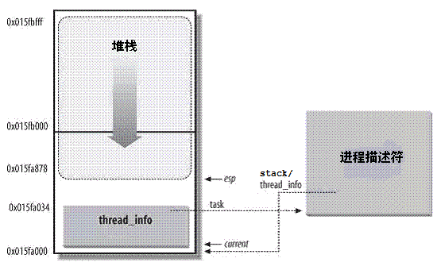

***Linux进程内核栈与thread_info结构详解***

- 1 前言
    - 1.1 为什么需要内核栈
    - 1.2 为什么需要thread_info
    - 1.3 将两种结构融合在一起
- 2 内核数据结构描述
    - 2.1 thread_union
    - 2.2 task_struct中的内核stack
    - 2.3 内核栈数据结构描述thread_info
- 3 函数接口
    - 3.1 内核栈与thread_info的通用操作
    - 3.2 获取当前在CPU上运行进程的thread_info
    - 3.3 分配和销毁thread_info

# 1. 前言

## 1.1 为什么需要内核栈

进程在内核态运行时需要自己的堆栈信息，因此Linux内核为每个进程都提供一个内核栈kernel stack（这里的stack就是这个进程在内核态的堆栈信息）。

```c
struct task_struct {
    ......
    
    void *stack;  // 指向内核栈的指针
    
    ......
}
```
内核态的进程访问处于内核数据段的栈，这个栈不同于用户态的进程所用的栈。

用户态进程所用的栈，是在进程虚拟地址空间中；而内核栈是当前进程从用户空间进入内核空间时，特权级发生变化，需要切换堆栈，那么内核空间中使用的就是这个内核栈。因为内核控制路径使用很少的栈空间，所以只需要几千个自己的内核态堆栈即可。

> 需要注意的是：内核态堆栈仅用于内核例程，Linux内核另外为中断提供了单独的硬中断栈和软中断栈。

## 1.2 为什么需要thread_info

内核还需要存储每个进程的PCB信息，Linux内核是支持不同体系结构的，但是不同的体系结构可能进程需要存储的信息不尽相同，这就需要我们实现一种通用方式，我们将体系结构相关的部分和体系结构无关的部分进行分离。

同一种通用的方式来描述进程，这就是strcut task\_struct；而thread\_info就保存了特定体系结构的汇编代码段需要访问的那部分进程的数据，我们在thread\_info中嵌入指向task\_struct的指针，则我们可以很方便的通过thread\_info来查找task\_struct。

## 1.3 将两种结构融合在一起

Linux将内核栈和进程控制块thread\_info融合在一起，组成一个联合体thread\_union。

通常内核栈和thread\_info一同保存在这个联合体中，thread\_info保存了线程所需的所有特定处理器的信息，以及通用的task\_struct的指针。

# 2. 内核数据结构描述

## 2.1 thread_union

对每个进程，Linux内核都把两个不同的数据结构紧凑的存放在一个单独为进程分配的内存区域中：
- 一个是内核态的进程堆栈stack
- 一个是紧挨着进程描述符的小数据结构thread\_info，叫做线程描述符

这两个结构被紧凑的放在一个联合体重thread\_union中：
```c
union thread_union {
    struct thread_info thread_info;
    unsigned long stack[THREAD_SIZE/sizeof(long)];
};
```
这块区域32位上通常是8K=8192字节（占两个页框），64位上通常是16K，其实地址必须是8192的整数倍。

include/asm-generic/page.h:
```c
#define PAGE_SHIFT  12
#define PAGE_SIZE   (1 << PAGE_SHIFT)
```
arch/x86/include/asm/page\_32_types.h:
```
#define THREAD_SIZE_ORDER   1
#define THREAD_SIZE     (PAGE_SIZE << THREAD_SIZE_ORDER)
```
arch/x86/include/asm/page\_64_types.h:
```c
#define THREAD_SIZE_ORDER   2
#define THREAD_SIZE  (PAGE_SIZE << THREAD_SIZE_ORDER)
```

出于效率考虑，内核让这8K(或者16K)空间占据连续的两个页框并让第一个页框的起始地址是2的13次方的倍数。

下图中显示了在物理内存中存放两种数据结构的方式。线程描述符（thread\_info）驻留与这个内存区的开始，而栈顶末端向下增长。下图摘自ULK3，进程内核栈与进程描述符的关系如下图：



在这个图中，
- esp寄存器是CPU栈指针，用来存放栈顶单元的地址。在x86系统中，栈起始于顶端，并朝着这个内存区开始的方向增长。从用户态切换到内核态后，进程的内核栈总是空的。因此，esp寄存器指向这个栈的顶端。一旦数据写入堆栈，esp的值就递减。

同时我们可以看到，
- thread\_info和内核栈虽然共用了thread\_union结构，但是thread\_info大小固定，存储在联合体的开始部分，而内核栈由高地址向低地址扩展，当内核栈的栈顶达到thread\_info的存储空间时，则会发生栈溢出。
- 系统的current指针指向了当前运行进程的thread\_union（或者thread\_info）的地址
- 进程task\_struct中的stack指针指向了进程的thread\_union（或者thread\_info）的地址，在早期的内核中这个指针用struct thread\_info *thread\_info来表示，但是新的内核中用来一个更浅显的名字void *stack，即内核栈。

即，进程的thread\_info存储在进程内核栈的最低端。

## 2.2 task_struct中的内核stack

被定义在include/linux/sched.h

```c
struct task_struct {
    ......
    
    void *stack;  // 指向内核栈的指针
    
    ......
}
```
在早期Linux内核中进程描述符中是不包含内核栈的，相反包含指向thread\_info的指针。

但是在2007年的一次更新（since 2.6.22）中加入了stack内核指针，替代了原来的thread\_info指针。

进程描述符task\_struct结构中没有直接指向thread\_info结构的指针，而是用一个void指针类型的成员表示，然后通过类型转换来访问thread\_info结构。

stack指向了内核栈的地址（其实也就是thread\_info和thread\_union的地址），因为联合体中stack和thread\_info都在起始地址，因此可以很方便的类型转换。

task\_thread\_info用于通过task\_struct来查找其thread\_info的信息，只需要一次指针类型转换即可：
```c
#define task_thread_info(task)  ((struct thread_info *)(task)->stack)
```

## 2.3 内核栈数据结构描述thread_info

thread\_info是体系结构相关的，结构定义在arch/x86/include/asm/thread\_info.h中：
```c
struct thread_info {
    struct task_struct  *task;      /* main task structure */
    struct exec_domain  *exec_domain;   /* execution domain */
    __u32           flags;      /* low level flags */
    __u32           status;     /* thread synchronous flags */
    __u32           cpu;        /* current CPU */
    int         preempt_count;  /* 0 => preemptable,
                           <0 => BUG */
    mm_segment_t        addr_limit;
    struct restart_block    restart_block;
    void __user     *sysenter_return;
#ifdef CONFIG_X86_32
    unsigned long           previous_esp;   /* ESP of the previous stack in
                           case of nested (IRQ) stacks
                        */
    __u8            supervisor_stack[0];
#endif
    unsigned int        sig_on_uaccess_error:1;
    unsigned int        uaccess_err:1;  /* uaccess failed */
};
```

# 3. 函数接口

## 3.1 内核栈与thread_info的通用操作

原则上，只要设置了预处理宏\_\_HAVE\_THREAD\_FUNCTIONS通知内核，那么各个体系结构就可以随意在stack数组中存储数据。

在这种情况下，它们必须自行实现task\_thread\_info和task\_stack\_page，这两个函数用于获取给定task\_strcut实例的线程信息和内核栈。

另外，它们必须实现dup\_task\_struct中调用的函数setup\_thread\_stack，以便确定stack成员的具体内存布局，当前只要像IA64安腾架构等少数架构不依赖于内核的默认方法。

```c
// 未定义__HAVE_THREAD_FUNCTIONS宏的时候，使用内核默认动作
#ifndef __HAVE_THREAD_FUNCTIONS

// 通过进程的task_struct来获取进程的thread_info
#define task_thread_info(task)  ((struct thread_info *)(task)->stack)

// 通过进程的task_struct来获取进程的内核栈
#define task_stack_page(task)   ((task)->stack)

// 初始化thread_info，指定其存储结构的内存布局
static inline void setup_thread_stack(struct task_struct *p, struct task_struct *org)
{
    *task_thread_info(p) = *task_thread_info(org);
    task_thread_info(p)->task = p;
}

static inline unsigned long *end_of_stack(struct task_struct *p)
{
    return (unsigned long *)(task_thread_info(p) + 1);
}

#endif
```
在内核的某些特定组件使用了较多的栈空间时，内核栈会溢出到thread\_info部分，因此内核提供了kstack\_end函数来判断给出的地址是否位于栈的有效部分：
```c
#ifndef __HAVE_ARCH_KSTACK_END
static inline int kstack_end(void *addr)
{
    /* Reliable end of stack detection:
     * Some APM bios versions misalign the stack
     */
    return !(((unsigned long)addr+sizeof(void*)-1) & (THREAD_SIZE-sizeof(void*)));
}
#endif
```
> 前面我们在将do_fork创建进程的时候，提到dup_task_strcut会复制父进程的task_struct和thread_info实例的内容，但是stack则与新的thread_info实例位于同一个内存，这意味着父子进程的task_struct此时除了栈指针之外完全相同。

## 3.2 获取当前在CPU上运行进程的thread_info

所有的体系结构都必须实现两个current和current\_thread\_info的宏或者函数。
- current\_thread\_info：可以获得当前执行进程的thread\_info实例指针，其地址可以根据内核栈指针来确定，因为thread\_info总是位于其实位置。

因为每个进程都有自己的内核栈，因此进程到内核栈的映射是唯一的，那么指向内核栈的指针通常保存在一个特别保留的寄存器中（多数情况下是esp寄存器）。

- current：个提出了当前进程描述符task\_struct的地址，该地址通常通过current\_thread\_info来确定。
```c
#define get_current() (current_thread_info()->task)
#define current get_current()
```
因此我们的关键就是current\_thread\_info的实现了，是如何通过esp栈指针来获取当前CPU正在运行进程的thread\_info结构。

内核通过简单的屏蔽掉esp的低13位有效位就可以获得thread\_info结构的基地址了。

```c
/* how to get the current stack pointer from C */
register unsigned long current_stack_pointer asm("esp") __used;

/* how to get the thread information struct from C */
static inline struct thread_info *current_thread_info(void)
{
    return (struct thread_info *)
        (current_stack_pointer & ~(THREAD_SIZE - 1));
}
```
屏蔽了esp的低13位，最终得到是thread\_info的地址。
- 当前的栈指针（current\_stack\_pointer == sp）就是esp
- THREAD\_SIZE = 8K，二进制表示：0000 0000 0000 0000 0010 0000 0000 0000
- ~(THREAD\_SIZE-1) 其结果是：1111 1111 1111 1111 1110 0000 0000 0000，低13位全为0，也就是刚好屏蔽了esp的低13位，最终得到的是thread\_info的地址。

进程最常用的是进程描述符结构task\_struct而不是thread\_info结构的地址。
为了获取当前CPU上运行进程的task\_struct结构，内核提供了current宏，
由于task\_struct *task在thread\_info的起始位置，
该宏本质等价于current\_thread\_info()->task，
在include/asm-geneic/current.h中定义：
```c
#define get_current() (current_thread_info()->task)
#define current get_current()
```

> 这个定义是体系结构无关的，当然Linux也为各个体系结构定义了更加方便或快速的current。

## 3.3 分配和销毁thread_info

- 进程通过alloc\_thread\_info\_node函数分配它的内核栈
- 进程通过free\_thread\_info函数释放所分配的内核栈

```c
/*
 * Allocate pages if THREAD_SIZE is >= PAGE_SIZE, otherwise use a
 * kmemcache based allocator.
 */
# if THREAD_SIZE >= PAGE_SIZE
static struct thread_info *alloc_thread_info_node(struct task_struct *tsk,
                          int node)
{
    struct page *page = alloc_pages_node(node, THREADINFO_GFP_ACCOUNTED,
                         THREAD_SIZE_ORDER);

    return page ? page_address(page) : NULL;
}

static inline void free_thread_info(struct thread_info *ti)
{
    free_memcg_kmem_pages((unsigned long)ti, THREAD_SIZE_ORDER);
}
# else

    ......
    
# endif
```
其中，THREAD\_SIZE\_ORDER宏的定义：

arch/x86/include/asm/page\_32\_types.h
```c

#define PAGE_SHIFT  12
#define PAGE_SIZE   (1 << PAGE_SHIFT)

#define THREAD_SIZE_ORDER   1

#define THREAD_SIZE     (PAGE_SIZE << THREAD_SIZE_ORDER)
```

arch/x86/include/asm/page\_64\_types.h
```c
#define PAGE_SHIFT  12
#define PAGE_SIZE   (1 << PAGE_SHIFT)

#define THREAD_SIZE_ORDER   2

#define THREAD_SIZE  (PAGE_SIZE << THREAD_SIZE_ORDER)
```