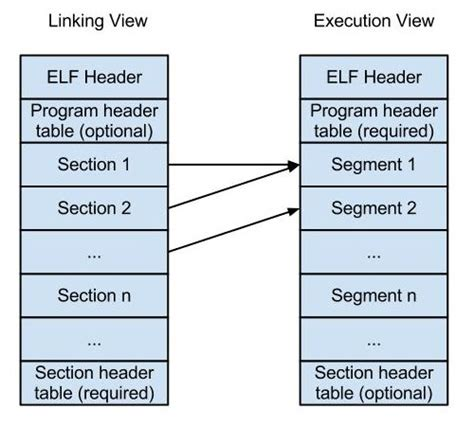
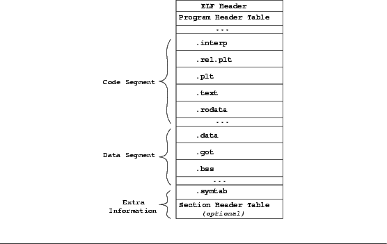
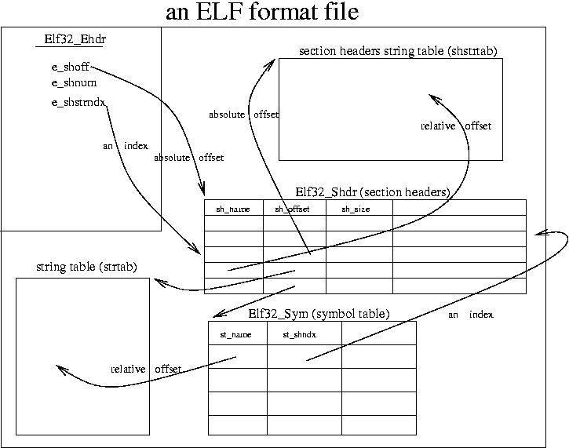

***LinuxELF文件格式详解***

- 1 对象文件格式
    - 1.1 对象文件
    - 1.2 文件格式
    - 1.3 ELF对象文件格式
    - 1.4 ELF文件标准历史
- 2 测试程序
- 3 ELF可执行与连接文件格式详解
    - 3.1 布局和结构
    - 3.2 ELF基本数据类型定义
- 4 ELF头部Elf64_Ehdr
    - 4.1 数据成员
    - 4.2 ELF魔数e_ident
        - 4.2.1 Magic
        - 4.2.1 a.out Magic Number
        - 4.2.2 ELF Magic Number
    - 4.3 目标文件类型e_type
    - 4.4 目标体系结构类型e_machine
    - 4.5 ELF版本e_version
    - 4.6 readelf工具——查看elf头部
        - 4.6.1 可重定位的对象文件（Relocatable file）
        - 4.6.2 可执行的对象文件（Executable file）
        - 4.6.3 可被共享的对象文件（Shared object file）
- 5 程序头部Elf64_phdr
    - 5.1 数据结构
    - 5.2 段类型p_type
    - 5.3 readelf工具——查看程序头表
        - 5.3.1 可重定位的对象文件（Relocatable file）
        - 5.3.2 可执行的对象文件（Executable file）
        - 5.3.3 可被共享的对象文件（Shared object file）
- 6 节区（Sections）
    - 6.1 节区头部表格
        - 6.1.1 数据结构
        - 6.1.2 节区类型sh_type
        - 6.1.3 节区标志sh_flags
        - 6.1.4 sh_link和sh_info字段
    - 6.2 特殊节区
    - 6.3 readelf工具——查看节区表
        - 6.3.1 可重定位的对象文件（Relocatable file）
        - 6.3.2 可执行的对象文件（Executable file）
        - 6.3.3 可被共享的对象文件（Shared object file）
- 7 字符串表
- 8 符号表（Symbol Table）
    - 8.1 数据结构
    - 8.2 st_info给出符号的类型和绑定属性
    - 8.3 st_shndx
    - 8.4 st_value
    - 8.5 nm工具——查看符号表
        - 8.5.1 可执行的对象文件（Executable file）
        - 8.5.2 可被共享的对象文件（Shared object file）
    - 8.6 重定位信息
        - 8.6.1 重定位表项
        - 8.6.2 ELF32_R_TYPE(i)

# 1. 对象文件格式

## 1.1 对象文件

首先，你需要知道的是所谓对象文件（Object files）有三个种类：
1. 可重定位的对象文件（Relocatable file）
2. 可执行的对象文件（Executable file）
3. 可被共享的对象文件（Shared object file）

- **可重定位的对象文件**

适合链接的可重定位文件，包含二进制代码和数据，能与其他可重定位对象文件在编译时合并创建出一个可执行文件。

这是由汇编器汇编生成的.o文件。连接器（link editor）拿一个或一些可重定位的对象文件作为输入，经链接处理后，生成一个可执行的对象文件，或者是一个可被共享的对象文件。我们也可以使用ar工具将众多的.o文件归档（archive）成.a静态库文件。

> 内核可加载模块.ko也是可重定位对象文件。

- **可执行的对象文件**

适于执行的可执行文件，包含可以在直接拷贝进内存执行的二进制代码和数据。用于提供程序的进程映像，加载到内存执行。

在我们的Linux系统里，存在两种可执行的东西。除了这里说的可执行对象文件，另外一种就是可执行的脚本。这些脚本不是可执行对象文件，它们只是文本文件，但是执行这些脚本所用的解释器就是可执行对象文件，例如bash、python、perl等。

- **可被共享的对象文件**

共享目标文件（Shared object file）是一种特殊的可重定位对象文件，能在加载时或运行时，装载进内存进行动态链接。
连接器可将它与其他可重定位文件和共享目标文件连接成其他的目标文件，动态连接器又可以将它与可执行和其他共享目标文件结合起来创建一个进程映像。

这些就是所谓的动态库文件，即.so文件。如果拿前面的静态库来生成可执行程序，那每个生成的可执行程序都会由一份库代码的拷贝。如果在磁盘中存储这些可执行程序，那就会占用额外的磁盘空间；另外如果它们放到Linux系统上一起运行，也会浪费掉宝贵的物理内存。如果将静态库换成动态库，那么这些文件都不会出现。动态库在发挥作用的过程中，必须经过2个步骤：
1. 链接器（link editor）拿它和其他Relocatable object file以及其他shared object file作为输入，经链接处理后，生成另外的shared object或者executable file。
2. 在运行时，动态连接器（dynamic linker）拿它和一个Executable file以及另外一些shared object file来一起处理，在Linux系统里面创建一个进程映像。

## 1.2 文件格式

本质上，对象文件只是保存在磁盘中的一串字节，每个系统的文件格式都不尽相同：
- Bell实验室的第一个Unix系统使用a.out格式。
- System V Unix的早期版本使用Common Object File Format（COFF）。
- Windows NT使用COFF的变种，叫做Protable Executable（PE）。
- 现代Unix系统，包括Linux、新版System V、BSD变种、Solaris都使用Executable and Linkabe Format（ELF）。

## 1.3 ELF对象文件格式

ELF是一种对象文件的格式，用于定义不同类型的对象文件中都放了什么东西，以及都以什么样的格式去放这些东西。
它最早在System V系统上出现后，被Unix世界所广泛接受，作为缺省的二进制文件格式来使用。可以说，ELF是构成众多Unix系统的基础之一。

ELF（Executable and Linkable Format）是一种对可执行文件、目标文件和库使用的文件格式。

它在Linux下成为标准格式已经很长时间，代替了早年的a.out格式。
ELF一个特别的优点在于，同一文件格式可以用于内核支持的几乎所有体系结构上，这不仅简化了用户空间工具程序的创建，也简化了内核自身的程序设计。例如，在必须为可执行文件生成装载程序例程时。

但是文件格式相同也并不意味着不同系统上的程序之间存在二进制兼容性，例如，FreeBSD和Linux都使用ELF作为二进制格式。尽管二者在文件中组织数据的方式不同。但是系统调用机制以及系统调用的语义方面，仍然有差别。这也是在没有中间仿真层的情况下，FreeBSD程序不能在Linux下运行的原因（反过来同样是如此）。

有一点是可以理解的，二进制程序不能在不同体系结构交换（例如，为alpha CPU编译的Linux二进制不能放在Sparc CPU的Linux上执行），因为低层的体系结构是完全不同的。但是由于ELF的存在，对所有体系结构而言，程序本身的相关信息以及程序的各个部分在二进制文件中编码的方式都是相同的。

Linux不仅将ELF用于用户空间程序和库，还用于构建Kernel模块。甚至Kernel本身也是ELF格式。

## 1.4 ELF文件标准历史

ELF是一种开放格式，其规范可以自由获取。

> 在ELF格式出来之后，TISC（Tool Interface Standard Committee）委员会定义了一套ELF标准。

20世纪90年代，一些厂商联合成立了一个委员会（TISC委员会），起草并发布了一个ELF文件格式标准公开使用，并且希望所有人能遁循这项标准并且从中受益。1993年，委员会发布了ELF文件标准。当时参与微会员的有来自编译器的厂商，如Watcom和Borland；来自CPU的厂商如IBM和Intel；来自操作系统的厂商如IBM和Microsoft。1995年，委员会发布了1.2标准，自此委员会完成了自己的使命，不就就解散了。所以ELF文件格式标准的最新版为1.2。

文件类型e\_type成员表示ELF文件类型，即前面提到过的3种ELF文件类型，每个文件类型对应一个常量。
操作系统通过这个常量来判断ELF的真正文件类型，而不是通过文件的扩展名。相关常量以ET\_开头。

TISC委员会退出的ELF v1.2文档中，分成三个部分（books）：
- Book1：介绍了通用的适用于所有32位架构处理器的ELF相关内容
- Book2：介绍了处理器特定的ELF相关内容，这里时以Intel x86架构处理器作为例子介绍
- Book3：介绍了操作系统特定的ELF相关内容，这里以运行在x86处理器的Unix System V作为例子介绍

# 2. 测试程序

add.c
```c
int add(int x, int y)
{
    return x + y;
}
```

sub.c
```c
int sub(int x, int y)
{
    return x - y;
}
```

main.c
```c
#include <stdio.h>
#include <stdlib.h>

int main(void)
{
    int x = 5;
    int y = 3;

    printf("%d + %d = %d\n", x, y, add(x, y));
    printf("%d - %d = %d\n", x, y, sub(x, y));

    return EXIT_SUCCESS;
}
```

Makefile
```Makefile
target=testelf_normal testelf_dynamic testelf_static

MAIN_OBJS=main.o
SUBS_OBJS=add.o sub.o

DYNA_FILE=libtestelf.so
STAT_FILE=libtestelf.a

all:$(target)

%.o : %.c
        $(CC) -c $^ -o $@

clean :
        rm -rf $(MAIN_OBJS) $(SUBS_OBJS)
        rm -rf $(DYNA_FILE) $(STAT_FILE)
        rm -rf $(target)


# Complie the execute
testelf_normal:$(MAIN_OBJS) $(SUBS_OBJS)
        gcc $^ -o $@

testelf_dynamic:$(MAIN_OBJS) $(DYNA_FILE)
        gcc  $^ -o $@ -L./ -ltestelf

testelf_static:$(MAIN_OBJS) $(STAT_FILE)
        gcc main.o -o $@ -static -L./ -ltestelf

# Complie the Dynamic Link Library libtestelf.so
libtestelf.so:$(SUBS_OBJS)
        gcc -fPIC -shared $^ -o $@

# Complie the Static Link Library libtestelf.so
libtestelf.a:$(SUBS_OBJS)
        ar -r $@ $^
```

我们编写了两个库函数分别实现add和sub的功能，然后编写一个测试代码main.c调用add和sub函数。

然后我们的Makefile为测试程序编写了3个target：
1. 普通程序testelf\_normal，由add.o、sub.o和main.o直接连接生成
2. 动态链接程序testelf\_dynamic，将add.o和sub.o 先链接成动态链接库 libtestelf .so，然后在动态链接生成可执行程序test\_dynamic
3. 静态链接程序testelf\_static，将add.o和sub.o先静态链接成静态库libtest.a，然后在静态链接生成可执行程序test\_static

我们在源代码目录执行make后会完成编译，完成编译后：
- add.o sub.o main.o 是可重定位文件
- libtestelf .so 是可被共享文件
- test\_normal testelf\_dynamic test\_static 是可执行文件

```
[root@centos7 elf]# file *.o
add.o:  ELF 64-bit LSB relocatable, x86-64, version 1 (SYSV), not stripped
main.o: ELF 64-bit LSB relocatable, x86-64, version 1 (SYSV), not stripped
sub.o:  ELF 64-bit LSB relocatable, x86-64, version 1 (SYSV), not stripped

[root@centos7 elf]# file *.so
libtestelf.so: ELF 64-bit LSB shared object, x86-64, version 1 (SYSV), dynamically linked, not stripped

[root@centos7 elf]# file *.a
libtestelf.a: current ar archive

[root@centos7 elf]# file testelf_*
testelf_dynamic: ELF 64-bit LSB executable, x86-64, version 1 (SYSV), dynamically linked (uses shared libs), for GNU/Linux 2.6.32,  not stripped
testelf_normal:  ELF 64-bit LSB executable, x86-64, version 1 (SYSV), dynamically linked (uses shared libs), for GNU/Linux 2.6.32,  stripped
testelf_static:  ELF 64-bit LSB executable, x86-64, version 1 (GNU/Linux), statically linked, for GNU/Linux 2.6.32, not stripped
```

# 3. ELF可执行与连接文件格式详解

## 3.1 布局和结构

ELF文件由各个部分组成。

为了方便和高效，ELF文件内容由两个平行的视角：
1. 程序链接角度
2. 程序运行角度



- **链接视图**

首先上图的左边部分，它是以链接视图看待ELF文件的，从左边可以看出：
它包含了一个ELF头部，它描绘了整个文件的组织结构。
它还包括很多节区（Section），这些节有的是系统定义好的，有些是用户在文件中通过.section命令自定义的，
连接器会将多个输入目标文件中的相同Section合并。
节区部分包含连接视图的大量信息：指令、数据、符号表、重定位信息等。
除此之外，还包含程序头部表（可选）和节区头部表。

程序头部表：是告诉系统如何创建进程映像。用来构建进程映像的目标文件必须具有程序头部表，可重定位文件不需要这个表。

节区头部表：包含了描述文件节区的信息，每个节区在表中都有一项，每一项给出诸如：字节名称、节区大小这类信息。用于连接目标文件必须包含节区头部表，其他目标文件可以有，也可以没有这个表。

> 需要注意的是：尽管图中显示的各个组成部分是有顺序的，实际上除了ELF头部表以外，其他节区和段都没有固定的顺序。

- **执行视图**

由半部分图是以程序执行的视图来看待的，与左边对应，多了一个段（Segment）的概念，编译器在生成目标文件时，通常使用从0开始的相对地址，而在链接过程中，连接器从一个指定的地址开始，根据输入目标文件的顺序，以Segment为单位将它们拼装起来。其中每个Segment可以包含多个Section。 

- ELF Header：除了用于标识ELF文件的几个字节外，ELF头还包含了有关文件类型和大小的有关信息，以及文件加载后程序执行的入口点信息。
- Program Header table：程序头表向系统提供了可执行文件的数据在进程虚拟地址空间中组织文件的相关信息。它还表示了文件可能包含的数据段、段的位置和用途。
- Segment：各个段保存了与文件相关的各种形式的数据，例如，符号表、实际的二进制码、字符串、数值常量等
- Section：包含了与各段相关的附加信息。

## 3.2 ELF基本数据类型定义

在具体介绍ELF的格式之前，我们先来了解ELF文件中都有哪些数据类型的定义。
ELF数据编码顺序与机器的字节序有关，为了使数据结构更加通用，Linux内核自定义了一套通用的数据类型，使得数据的表示与具体体系结构分离。

但是由于32位程序和64位程序所使用的数据宽度不同，同时64位机必须兼容的执行32位程序，因此我们所有的数据都被定义为32bit和64bit两个不同类型的数据。

定义在include/uapi/linux/elf.h中：
```c
/* 32-bit ELF base types. */
typedef __u32	Elf32_Addr;
typedef __u16	Elf32_Half;
typedef __u32	Elf32_Off;
typedef __s32	Elf32_Sword;
typedef __u32	Elf32_Word;

/* 64-bit ELF base types. */
typedef __u64   Elf64_Addr;
typedef __u16   Elf64_Half;
typedef __s16   Elf64_SHalf;
typedef __u64   Elf64_Off;
typedef __s32   Elf64_Sword;
typedef __u32   Elf64_Word;
typedef __u64   Elf64_Xword;
typedef __s64   Elf64_Sxword;
```

# 4. ELF头部Elf64_Ehdr

```c
#define EI_NIDENT	16

typedef struct elf64_hdr {
  unsigned char e_ident[EI_NIDENT]; /* ELF "magic number" */
  Elf64_Half e_type;
  Elf64_Half e_machine;
  Elf64_Word e_version;
  Elf64_Addr e_entry;       /* Entry point virtual address */
  Elf64_Off e_phoff;        /* Program header table file offset */
  Elf64_Off e_shoff;        /* Section header table file offset */
  Elf64_Word e_flags;
  Elf64_Half e_ehsize;
  Elf64_Half e_phentsize;
  Elf64_Half e_phnum;
  Elf64_Half e_shentsize;
  Elf64_Half e_shnum;
  Elf64_Half e_shstrndx;
} Elf64_Ehdr;
```

## 4.1 数据成员

成员 | 类型 | 描述
---|---|:---
e\_ident | unsigned char | 目标文件表示信息，EI\_NIDENT=16，占用128位
e\_type | Elf64\_Half | 目标文件类型
e\_machine | Elf64\_Half | 目标体系结构类型
e\_version | Elf64_Word | 目标文件版本
e\_entry | Elf64\_Addr | 程序入口的虚拟地址
e\_phoff | Elf64\_Off | 程序头部表（Program Header Table）的偏移量
e\_shoff | Elf64\_Off | 节区头部表（Section Header Table）的偏移量
e\_flags | Elf64\_Word | 保存与文件相关的，特定于处理器的标志。</br>标志名称采用EF\_machine\_flag的格式。
e\_ehsize | Elf64\_Half | ELF头部的大小
e\_phentsize | Elf64\_Half | 程序头部表的表项大小
e\_phnum | Elf64\_Half | 程序头部表的表项个数
e\_shentisze | ELF64\_Half | 节区头部表的表项大小
e\_shnum | Elf64\_Half | 节区头部表的表项个数
e\_shstrndx | Elf64\_Half | 节区头部表在字符串表“String Table”中的索引

## 4.2 ELF魔数e_ident

### 4.2.1 Magic

很多类型的文件，其起始的几个字节的内容是固定的。根据这几个字节的内容就可以确定文件类型，因此这几个字节的内容被称为魔数（Magic Number）。此外在一些程序代码中，程序员常常将在代码中出现但没有解释的数字常量或字符串称为魔数或魔数串。

### 4.2.1 a.out Magic Number

Unix早年是在PDP小型机上诞生的，当时的系统在加载一个可执行文件后直接从文件的第一个字节开始执行，人们一般在文件最开始放置一条Jmp指令，这条指令负责跳过接下来的7个机器字的文件头到可执行文件的真正入口。
而0x10 0x07这两个字节刚好是当时PDP-11机器的跳转7个机器字的指令。为了跟以前的保持兼容性，这条跳转指令被当做魔数一致被保留到了几十年后的今天。

### 4.2.2 ELF Magic Number

```
Magic:   7f 45 4c 46 02 01 01 00 00 00 00 00 00 00 00 00
```
从readelf的输出看到，最前面的Magic的16个字节刚好对应Elf64\_Ehdr的e\_ident这个成员。
这个16字节被ELF标准规定用来标识ELF文件的平台属性，比如，ELF字长、字节序、ELF文件版本。

最开始的4个字节是所有ELF文件都必须相同的标识码，即0x7f 0x45 0x4c 0x46。
- 第1个字节对应ASCII字符里的DEL控制符
- 后面3个字节对应ASCII的ELF。

因此，这4个字节又被称为ELF文件的魔数。

> 这种魔数用来确认文件的类型，操作系统在加载可执行文件的时候会确认魔数是否正确，如果不正确会拒绝加载。

- 第5个字节：标识ELF的文件类，0x01标识32位的，0x02标识64位的。
- 第6个字节：字节序，0x01表示little endian。
- 第7个字节：主版本号
- 最后9个字节：ELF标准没有定义，填充0。

> 要注意的是e\_ident是一个16字节的数组，这个数组按位置从左到右都有特定含义，每个数组元素的下标在标准中还存在别名，如byte[0]的别名为e\_ident[EI\_MAG0]，具体如下：

数组下标 | 别名 | 含义
---|---|---
EI\_MAG0 | 0 | 文件标识
EI\_MAG1 | 1 | 文件标识
EI\_MAG2 | 2 | 文件标识
EI\_MAG3 | 3 | 文件标识
EI\_CLASS | 4 | 文件类
EI\_DATA | 5 | 数据编码
EI\_VERSION | 6 | 文件版本
EI\_PAD | 7 | 补齐字节其实位置
EI\_NIDENT | 16 | e\_ident大小

e\_ident[EI\_MAG0 ~ EI\_MAG3]：被称为魔数，其值为 0x7F,'E','L','F'。

e\_ident[EI\_CLASS]：识别目标文件运行在目标机器的类型，取值可为三种值：

宏定义 | 常数 | 含义
---|---|---
ELFCLASSNONE | 0 | 非法类型
ELFCLASS32 | 1 | 32位目标
ELFCLASS64 | 2 | 64位目标

e\_ident[EI\_DATA]：给出处理器特定数据的数据编码方式。即大端还是小端方式。取值可为3种：

宏定义 | 常数 | 含义
---|---|---
ELFDATANONE | 0 | 非法数据编码
ELFDATA2LSB | 1 | 高位在前，小端字节序
ELFDATA2MSB | 2 | 低位在前，大端字节序

## 4.3 目标文件类型e_type

e\_type表示elf文件类型：前面提到过3中ELF文件类型，每个文件类型对应一个常量。系统通过这个常量来判断ELF的真正文件类型，而不是通过文件的扩展名。

宏 | 常数 | 含义
---|---|---
ET\_NONE | 0 | 未知目标文件格式
ET\_REL | 1 | 可重定位文件
ET\_EXEC | 2 | 可执行文件
ET\_DYN | 3 | 共享目标文件
ET\_CORE | 4 | Core文件
ET\_LOPROC | 0xff00 | 特定处理器文件
ET\_HIPROC | 0xffff | 特定处理器文件
ET\_LOPROC ~ ET\_HIPROC | 0xff00 ~ 0xffff | 特定处理器文件

## 4.4 目标体系结构类型e_machine

宏 | 常数 | 含义
---|---|---
EM\_NONE | 0 | 未指定
EM\_M32 | 1 | AT&T 
EM\_SPARC | 2 | SPARC
EM\_386 | 3 | Intel 80386
EM\_68K | 4 | Motorola 68000
EM\_88K | 5 | Motorola 88000
EM\_860 | 6 | Intel 80860
EM\_MIPS | 8 | MIPS RS3000
others | 9~ | saved

## 4.5 ELF版本e_version

这个用来区分ELF标准的各个修订版本，目前ELF标准最新版本为1.2。

另外ELF头还包括了ELF文件的各个其他部分的长度和索引位置信息。因为这些部分的长度可能依程序而不同。
所以在文件头部必须提供相应数据。

## 4.6 readelf工具——查看elf头部

### 4.6.1 可重定位的对象文件（Relocatable file）

```
[root@centos7 elf]# readelf -h add.o
ELF Header:
  Magic:   7f 45 4c 46 02 01 01 00 00 00 00 00 00 00 00 00
  Class:                             ELF64
  Data:                              2's complement, little endian
  Version:                           1 (current)
  OS/ABI:                            UNIX - System V
  ABI Version:                       0
  Type:                              REL (Relocatable file)
  Machine:                           Advanced Micro Devices X86-64
  Version:                           0x1
  Entry point address:               0x0
  Start of program headers:          0 (bytes into file)
  Start of section headers:          536 (bytes into file)
  Flags:                             0x0
  Size of this header:               64 (bytes)
  Size of program headers:           0 (bytes)
  Number of program headers:         0
  Size of section headers:           64 (bytes)
  Number of section headers:         11
  Section header string table index: 10
```
- 文件类型是REL，说明是可重定位文件，其代码可以移动到任何位置。
- 文件没有程序头表，对需要进行连接的对象而言，程序头表示不必要的，为此所有大小都设置为0。

### 4.6.2 可执行的对象文件（Executable file）

```
[root@centos7 elf]# readelf -h testelf_normal
ELF Header:
  Magic:   7f 45 4c 46 02 01 01 00 00 00 00 00 00 00 00 00
  Class:                             ELF64
  Data:                              2's complement, little endian
  Version:                           1 (current)
  OS/ABI:                            UNIX - System V
  ABI Version:                       0
  Type:                              EXEC (Executable file)
  Machine:                           Advanced Micro Devices X86-64
  Version:                           0x1
  Entry point address:               0x400430
  Start of program headers:          64 (bytes into file)
  Start of section headers:          6616 (bytes into file)
  Flags:                             0x0
  Size of this header:               64 (bytes)
  Size of program headers:           56 (bytes)
  Number of program headers:         9
  Size of section headers:           64 (bytes)
  Number of section headers:         31
  Section header string table index: 30
```

### 4.6.3 可被共享的对象文件（Shared object file）

```
[root@centos7 elf]# readelf -h libtestelf.so
ELF Header:
  Magic:   7f 45 4c 46 02 01 01 00 00 00 00 00 00 00 00 00
  Class:                             ELF64
  Data:                              2's complement, little endian
  Version:                           1 (current)
  OS/ABI:                            UNIX - System V
  ABI Version:                       0
  Type:                              DYN (Shared object file)
  Machine:                           Advanced Micro Devices X86-64
  Version:                           0x1
  Entry point address:               0x550
  Start of program headers:          64 (bytes into file)
  Start of section headers:          6192 (bytes into file)
  Flags:                             0x0
  Size of this header:               64 (bytes)
  Size of program headers:           56 (bytes)
  Number of program headers:         7
  Size of section headers:           64 (bytes)
  Number of section headers:         27
  Section header string table index: 26
```

# 5. 程序头部Elf64_phdr

- 以运行程序的角度看ELF文件，就需要程序头表，即要运行这个ELF文件，需要将那些东西载入到内存。
- 节区头部表是以ELF资源的角度来看待ELF文件的，即这个ELF文件到底存在那些资源，以及这些资源之间的关联关系。

程序头部是一个表，它的起始地址在elf头部结构中的e\_phoff成员指定，数量由e\_phnum表示，每个程序头部表项的大小由e\_phentsize指出。

可执行文件或共享目标文件的程序头部时一个结构数组，每个结构描述了一个段或者系统准备程序执行所必须的其它信息。目标文件的段包含了多个节区，也就是“段内容（Segment Contents）”。

> 程序头部仅对于可执行文件和共享目标文件有意义。

ELF头部用Elf64\_phdr结构表示：
```c
typedef struct elf64_phdr {
  Elf64_Word p_type;
  Elf64_Word p_flags;
  Elf64_Off p_offset;       /* Segment file offset */
  Elf64_Addr p_vaddr;       /* Segment virtual address */
  Elf64_Addr p_paddr;       /* Segment physical address */
  Elf64_Xword p_filesz;     /* Segment size in file */
  Elf64_Xword p_memsz;      /* Segment size in memory */
  Elf64_Xword p_align;      /* Segment alignment, file & memory */
} Elf64_Phdr;
```

## 5.1 数据结构

成员 | 类型 | 描述
---|---|:---
p\_type | Elf64\_Word | 段类型
p\_offset | Elf64\_Off | 段位置
p\_vaddr | Elf64\_Addr | 给出段的第一个字节将被放到内存中的虚拟地址
p\_paddr | Elf64\_Addr | 仅用于与物理地址相关的系统中
p\_filesz | Elf64\_Word | 给出段在文件映像中所占的字节数
p\_memsz | Elf64\_Word | 给出段在内存映像中所占的字节数
p\_flags | Elf64\_Word | 与段相关的标志
p\_align | Elf64\_Word | 对齐

## 5.2 段类型p_type

宏 | 常数 | 说明
---|---|:---
PT\_NULL | 0 | 指示是一个未使用的程序头
PT\_LOAD | 1 | 指示此程序头描述要从文件加载的段
PT\_DYNAMIC | 2 | 指示可以找到动态链接信息的段。
PT\_INTERP | 3 | 指示可以找到程序解释器名称的段。
PT\_NOTE | 4 | 表示持有注释信息的段。
PT\_SHLIB | 5 | 保留的程序头类型，由ELF ABI定义但未指定。
PT\_PHDR | 6 | 指示可以找到程序头的段。
PT\_LOPROC ~ PT\_HIPROC | 0x70000000 ~ 0x7FFFFFFF | 此方位的类型保留给处理器专用语义

## 5.3 readelf工具——查看程序头表

在程序投标之后，列出了6个段，这些组成了最终在内容中执行的程序，其实还提供了各段在虚拟地址空间和物理空间的大小、位置、标志、访问权限和对齐方面的信息，还指定了多个类型来更精准的描述段。

段 | 描述
---|:---
PHDR | 保存了程序头表
INTERP | 指定在程序已经从可执行文件映射到内存之后，必须调用的解释器。</br>它指的是这样一个程序：通过链接其他库，来满足未解决的引用。</br>通常是 **/lib64/ld-linux-x86-64.so.2** ，用于在虚拟地址空间插入程序运行所需的动态链接库。
LOAD | 表示一个需要从二进制文件映射到虚拟地址的段，其中保存了常量数据、程序的目标代码等
DYNAMIC | 该段保存了由动态连接器（即INTERP中指定的解释器），使用的信息。
NOTE | 保存了专用信息

### 5.3.1 可重定位的对象文件（Relocatable file）

```
[root@centos7 elf]# readelf -l add.o

There are no program headers in this file.
```
可重定位文件是一个需要链接的对象，程序头表对其而言不是必要的，因此这类文件一般没有程序头表。

### 5.3.2 可执行的对象文件（Executable file）

```
[root@centos7 elf]# readelf -l testelf_dynamic

Elf file type is EXEC (Executable file)
Entry point 0x400580
There are 9 program headers, starting at offset 64

Program Headers:
  Type           Offset             VirtAddr           PhysAddr
                 FileSiz            MemSiz              Flags  Align
  PHDR           0x0000000000000040 0x0000000000400040 0x0000000000400040
                 0x00000000000001f8 0x00000000000001f8  R E    8
  INTERP         0x0000000000000238 0x0000000000400238 0x0000000000400238
                 0x000000000000001c 0x000000000000001c  R      1
      [Requesting program interpreter: /lib64/ld-linux-x86-64.so.2]
  LOAD           0x0000000000000000 0x0000000000400000 0x0000000000400000
                 0x00000000000008c4 0x00000000000008c4  R E    200000
  LOAD           0x0000000000000e00 0x0000000000600e00 0x0000000000600e00
                 0x000000000000023c 0x0000000000000240  RW     200000
  DYNAMIC        0x0000000000000e18 0x0000000000600e18 0x0000000000600e18
                 0x00000000000001e0 0x00000000000001e0  RW     8
  NOTE           0x0000000000000254 0x0000000000400254 0x0000000000400254
                 0x0000000000000044 0x0000000000000044  R      4
  GNU_EH_FRAME   0x000000000000079c 0x000000000040079c 0x000000000040079c
                 0x0000000000000034 0x0000000000000034  R      4
  GNU_STACK      0x0000000000000000 0x0000000000000000 0x0000000000000000
                 0x0000000000000000 0x0000000000000000  RW     10
  GNU_RELRO      0x0000000000000e00 0x0000000000600e00 0x0000000000600e00
                 0x0000000000000200 0x0000000000000200  R      1

 Section to Segment mapping:
  Segment Sections...
   00
   01     .interp
   02     .interp .note.ABI-tag .note.gnu.build-id .gnu.hash .dynsym .dynstr .gnu.version .gnu.version_r .rela.dyn .rela.plt .init .plt .plt.got .text .fini .rodata .eh_frame_hdr .eh_frame
   03     .init_array .fini_array .jcr .dynamic .got .got.plt .data .bss
   04     .dynamic
   05     .note.ABI-tag .note.gnu.build-id
   06     .eh_frame_hdr
   07
   08     .init_array .fini_array .jcr .dynamic .got
```

### 5.3.3 可被共享的对象文件（Shared object file）

```
[root@centos7 elf]# readelf -l libtestelf.so

Elf file type is DYN (Shared object file)
Entry point 0x550
There are 7 program headers, starting at offset 64

Program Headers:
  Type           Offset             VirtAddr           PhysAddr
                 FileSiz            MemSiz              Flags  Align
  LOAD           0x0000000000000000 0x0000000000000000 0x0000000000000000
                 0x0000000000000714 0x0000000000000714  R E    200000
  LOAD           0x0000000000000e28 0x0000000000200e28 0x0000000000200e28
                 0x00000000000001f0 0x00000000000001f8  RW     200000
  DYNAMIC        0x0000000000000e48 0x0000000000200e48 0x0000000000200e48
                 0x0000000000000190 0x0000000000000190  RW     8
  NOTE           0x00000000000001c8 0x00000000000001c8 0x00000000000001c8
                 0x0000000000000024 0x0000000000000024  R      4
  GNU_EH_FRAME   0x000000000000066c 0x000000000000066c 0x000000000000066c
                 0x0000000000000024 0x0000000000000024  R      4
  GNU_STACK      0x0000000000000000 0x0000000000000000 0x0000000000000000
                 0x0000000000000000 0x0000000000000000  RW     10
  GNU_RELRO      0x0000000000000e28 0x0000000000200e28 0x0000000000200e28
                 0x00000000000001d8 0x00000000000001d8  R      1

 Section to Segment mapping:
  Segment Sections...
   00     .note.gnu.build-id .gnu.hash .dynsym .dynstr .gnu.version .gnu.version_r .rela.dyn .init .plt .plt.got .text .fini .eh_frame_hdr .eh_frame
   01     .init_array .fini_array .jcr .data.rel.ro .dynamic .got .got.plt .bss
   02     .dynamic
   03     .note.gnu.build-id
   04     .eh_frame_hdr
   05
   06     .init_array .fini_array .jcr .data.rel.ro .dynamic .got
```
- 虚拟地址空间中的各个段，填充来自ELF文件中特定段的数据，因而readelf输出的第2部分（Section to Segment mapping:）指定了哪些Section装入到哪些Segment（节段映射）。

- 物理地址信息将被忽略，因为该信息是由内核根据物理页帧到虚拟地址空间相应位置映射情况动态分配。只有在没有MMU的系统上该信息才有意义。

# 6. 节区（Sections）

节区中包含目标文件中的所有信息，除了：ELF头部、程序头部表、节区头部表，节区满足以下条件：
1. 目标文件中的每个节区都有对应的节区头部描述它，返回来，由节区头部不意味着有节区。
2. 每个节区占用文件中一个连续字节区域（这个区域可能长度为0）。
3. 文件中的节区不能重叠，不允许一个字节存在于两个节区中的情况发生。
4. 目标文件中可能包含非活动空间（INACTIVE SPACE），这些区域不属于任何头部和节区，其内容未指定。

## 6.1 节区头部表格

ELF文件中在描述各段的内容（程序头部表）时，指定了哪些节的数据映射到哪个段。
因此需要一个结构来管理各个节的内容，即节区头表。

节区头部表是以ELF资源的角度来看待ELF文件的，即这个ELF文件到底存在哪些资源，以及这些资源之间的关联关系，而前面提到的程序头部表，则以程序运行角度来看ELF文件的，即要运行这个ELF文件，需要将哪些东西载入到内存映像。

在ELF头部中给出：
- e\_shoff：从文件头到节区头部表格的偏移字节数
- e\_shnum：表格中条目数量
- e\_shentsize：每个条目的字节数

从这些信息中可以确切地定位节区的具体位置、长度。

从之前的描述中可知，每一项节区在节区头部表中都存在一项元素与它对应，因此可知，这个节区头部表格为一段连续的空间，每一项元素为一个结构体即（elf64\_shdr）。

```c
typedef struct elf64_shdr {
  Elf64_Word sh_name;       /* Section name, index in string tbl */
  Elf64_Word sh_type;       /* Type of section */
  Elf64_Xword sh_flags;     /* Miscellaneous section attributes */
  Elf64_Addr sh_addr;       /* Section virtual addr at execution */
  Elf64_Off sh_offset;      /* Section file offset */
  Elf64_Xword sh_size;      /* Size of section in bytes */
  Elf64_Word sh_link;       /* Index of another section */
  Elf64_Word sh_info;       /* Additional section information */
  Elf64_Xword sh_addralign; /* Section alignment */
  Elf64_Xword sh_entsize;   /* Entry size if section holds table */
} Elf64_Shdr;
```

### 6.1.1 数据结构

成员 | 类型 | 描述
---|---|:---
sh\_name | Elf64\_Word | 节区名，是节区头部字符串表中节区的索引。
sh\_type | Elf64\_Word | 节区类型
sh\_flags | Elf64\_Xword | 节区标志及属性
sh\_addr | Elf64\_Addr | 如果节区将出现在进程的内存映像中，</br>此成员给出节区的第一个字节应处的位置。
sh\_offset | Elf64\_Off | 节区的第一个字节与文件头之间的偏移量
sh\_size | Elf64\_Xword | 节区的长度
sh\_link | Elf64\_Word | 节区头部表索引链接其他节区
sh\_info | Elf64\_Word | 附加信息
sh\_addralign | Elf64\_Xword | 地址对齐约束
sh\_entsize | Elf64\_Xword | 某些节区中包含固定大小的条目，如符号表。

### 6.1.2 节区类型sh_type

宏 | 常数 | 说明
---|---|:---
SHT\_NULL | 0 |此值标志节区头部是非活动的，没有对应的节区。
SHT\_PROGBITS| 1 | 此节区包含程序定义的信息，其格式和含义都由程序来解释。
SHT\_SYMTAB | 2 | 此节区包含一个符号表。提供用于链接编辑（指ld而言）的符号，尽管也可用来实现动态链接。
SHT\_STRTAB | 3 | 此节区包含字符串表。目标文件可能包含多个字符串表节区
SHT\_RELA | 4 | 此节区包含重定位表项，其中可能会有补齐内容（addends）。
SHT\_HASH | 5 | 此节区包含符号哈希表，所有参与动态链接的目标都必须包含一个符号哈希表。
SHT\_DYNAMIC | 6 | 此节区包含动态链接的信息
SHT\_NOTE | 7 | 此节区包含以某种方式来标记文件的信息
SHT\_NOBITS | 8 | 这种类型的节区不占用文件中的空间 ，其他方面和SHT_PROGBITS相似。
SHT\_REL | 9 | 此节区包含重定位表项，其中没有补齐（addends）。
SHT\_SHLIB | 10 | 此节区被保留，不过其语义是未规定的。包含此类型节区的程序与ABI不兼容。
SHT\_DYNSYM | 11 | 作为一个完整的符号表，它可能包含很多对动态链接而言不必要的符号。</br>因此，目标文件也可以包含一个SHT\_DYNSYM节区，</br>其中保存动态链接符号的一个最小集合，以节省空间。
SHT\_LOPROC	| 0x70000000 | 这一段（包括两个边界），是保留给处理器专用语义的。
SHT\_HIPROC	| 0x7FFFFFFF | 这一段（包括两个边界），是保留给处理器专用语义的。
SHT\_LOUSER	| 0x80000000 | 此值给出保留给应用程序的索引下界
SHT\_HIUSER	| 0x8FFFFFFF | 此值给出保留给应用程序的索引上界

### 6.1.3 节区标志sh_flags

宏 | 常数 | 说明
---|---|:---
SHF\_WRITE | 0x1 | 节区包含进程执行过程中将可写的数据
SHF\_ALLOC | 0x2 | 此节区在进程执行过程中占用内存
SHF\_EXECINSTR | 0x4 | 节区包含可执行的机器指令
SHF\_MASKPROC | 0xF0000000 | 所有包含于此掩码中的四位都用于处理器专用的语义

### 6.1.4 sh_link和sh_info字段

sh\_link和sh\_info字段的具体含义依赖于sh\_type的值：

sh\_type | sh\_link | sh\_info
---|---|---
SHT\_DYNAMIC | 此节区中条目所用到的字符串表格的节区头部索引 | 0
SHT\_HASH | 此哈希表所适用的符号表的节区头部索引 | 0
SHT\_REL</br>SHT\_RELA | 相关符号表的节区头部索引 | 重定位所适用的节区的节区头部索引
SHT\_SYMTAB</br>SHT\_DYNSYM | 相关联的字符串表的节区头部索引 | 最后一个局部符号（绑定STB\_LOCAL）</br>的符号表索引值加1
others | SHN\_UNDEF | 0

## 6.2 特殊节区

有些节区是操作系统预定的，一般以.开头，因此，我们有必要了解一些常用的系统节区。

名称 | 类型 | 属性 | 含义
---|---|---|:---
.bss| SHT\_NOBITS |SHF\_ALLOC\|SHF\_WRITE| 包含将出现在程序的内存映像中的为初始化数据。</br>根据定义，当程序开始执行，系统将把这些数据初始化为0。
.comment| SHT\_PROGBITS | none | 包含版本控制信息
.data | SHT\_PROGBITS | SHF\_ALLOC\|SHF\_WRITE|这些节区包含初始化了的数据，将出现在程序的内存映像中。
.debug | SHT\_PROGBITS | none | 此节区包含用于符号调试的信息
.dynamic | SHT\_DYNAMIC| &nbsp; | 此节区包含动态链接信息。节区的属性将包含SHF\_ALLOC位，</br>是否SHF\_WRITE位被设置取决于处理器。
.dynstr	| SHT\_STRTAB | SHF\_ALLOC | 此节区包含用于动态链接的字符串，</br>大多数情况下这些字符串代表了与符号表项相关的名称。
.dynsym | SHT\_DYNSYM | SHF\_ALLOC | 此节区包含了动态链接符号表
.fini | SHT\_PROGBITS | SHF\_ALLOC\|SHF_EXECINSTR |此节区包含了可执行的指令，是进程终止代码的一部分。</br>程序正常退出时，系统将安排执行这里的代码。
.got | SHT\_PROGBITS | &nbsp; | 此节区包含全局偏移表
.hash | SHT\_HASH | SHF_ALLOC | 此节区包含了一个符号哈希表
.init | SHT\_PROGBITS | SHF\_ALLOC\|SHF_EXECINSTR |此节区包含了可执行指令，是进程初始化代码的一部分。</br>当程序开始执行时，系统要在开始调用主程序入口之前执行这些代码。
.interp	| SHT\_PROGBITS	| &nbsp; | 此节区包含程序解释器的路径名。如果程序包含一个可加载的段，</br>段中包含此节区，那么节区的属性将包含 SHF_ALLOC位，否则该位为0。
.line | SHT\_PROGBITS | none | 此节区包含符号调试的行号信息，其中描述了源程序与机器指令之间的对应关系。
.note | SHT\_NOTE | none | 此节区中包含注释信息，有独立的格式。
.plt | SHT\_PROGBITS | none | 此节区包含过程链接表（procedure linkage table）
.relname </br> .relaname | SHT\_REL\|SHT\_RELA | &nbsp; | 这些节区中包含了重定位信息。如果文件中包含可加载的段，段中有重定位内容，</br>节区的属性将包含SHF\_ALLOC位，否则该位置0。</br>传统上name根据重定位所适用的节区给定。</br>例如 .text节区的重定位节区名字将是：.rel.text或者.rela.text。
.rodata | SHT\_PROGBITS | SHF\_ALLOC | 这些节区包含只读数据，这些数据通常参与进程映像的不可写段。
.shstrtab | SHT\_STRTAB | &nbsp; |	此节区包含节区名称
.strtab	| SHT\_STRTAB |  &nbsp; | 此节区包含字符串，通常是代表与符号表项相关的名称。</br>如果文件拥有一个可加载的段，段中包含符号串表，节区的属性将包含SHF\_ALLOC位，否则该位为0。
.symtab | SHT\_SYMTAB | &nbsp; |此节区包含一个符号表。</br>如果文件中包含一个可加载的段，并且该段中包含符号表，那么节区的属性中包含SHF\_ALLOC位，否则该位置为0。
.text | SHT\_PROGBITS | SHF\_ALLOC\|SHF_EXECINSTR | 此节区包含程序的可执行指令



## 6.3 readelf工具——查看节区表

### 6.3.1 可重定位的对象文件（Relocatable file）

```
[root@centos7 elf]# readelf -S add.o
There are 11 section headers, starting at offset 0x218:

Section Headers:
  [Nr] Name              Type             Address           Offset
       Size              EntSize          Flags  Link  Info  Align
  [ 0]                   NULL             0000000000000000  00000000
       0000000000000000  0000000000000000           0     0     0
  [ 1] .text             PROGBITS         0000000000000000  00000040
       0000000000000014  0000000000000000  AX       0     0     1
  [ 2] .data             PROGBITS         0000000000000000  00000054
       0000000000000000  0000000000000000  WA       0     0     1
  [ 3] .bss              NOBITS           0000000000000000  00000054
       0000000000000000  0000000000000000  WA       0     0     1
  [ 4] .comment          PROGBITS         0000000000000000  00000054
       000000000000002e  0000000000000001  MS       0     0     1
  [ 5] .note.GNU-stack   PROGBITS         0000000000000000  00000082
       0000000000000000  0000000000000000           0     0     1
  [ 6] .eh_frame         PROGBITS         0000000000000000  00000088
       0000000000000038  0000000000000000   A       0     0     8
  [ 7] .rela.eh_frame    RELA             0000000000000000  000001a8
       0000000000000018  0000000000000018   I       8     6     8
  [ 8] .symtab           SYMTAB           0000000000000000  000000c0
       00000000000000d8  0000000000000018           9     8     8
  [ 9] .strtab           STRTAB           0000000000000000  00000198
       000000000000000b  0000000000000000           0     0     1
  [10] .shstrtab         STRTAB           0000000000000000  000001c0
       0000000000000054  0000000000000000           0     0     1
Key to Flags:
  W (write), A (alloc), X (execute), M (merge), S (strings), I (info),
  L (link order), O (extra OS processing required), G (group), T (TLS),
  C (compressed), x (unknown), o (OS specific), E (exclude),
  l (large), p (processor specific)
```

- 可重定向文件, 是一个需要链接的对象，程序头表对其而言不是必要的。因此，这类文件一般没有程序头表。

### 6.3.2 可执行的对象文件（Executable file）

```
[root@centos elf]# readelf -S testelf_dynamic
There are 31 section headers, starting at offset 0x19a8:

Section Headers:
  [Nr] Name              Type             Address           Offset
       Size              EntSize          Flags  Link  Info  Align
  [ 0]                   NULL             0000000000000000  00000000
       0000000000000000  0000000000000000           0     0     0
  [ 1] .interp           PROGBITS         0000000000400238  00000238
       000000000000001c  0000000000000000   A       0     0     1
  [ 2] .note.ABI-tag     NOTE             0000000000400254  00000254
       0000000000000020  0000000000000000   A       0     0     4
  [ 3] .note.gnu.build-i NOTE             0000000000400274  00000274
       0000000000000024  0000000000000000   A       0     0     4
  [ 4] .gnu.hash         GNU_HASH         0000000000400298  00000298
       0000000000000038  0000000000000000   A       5     0     8
  [ 5] .dynsym           DYNSYM           00000000004002d0  000002d0
       0000000000000108  0000000000000018   A       6     1     8
  [ 6] .dynstr           STRTAB           00000000004003d8  000003d8
       0000000000000079  0000000000000000   A       0     0     1
  [ 7] .gnu.version      VERSYM           0000000000400452  00000452
       0000000000000016  0000000000000002   A       5     0     2
  [ 8] .gnu.version_r    VERNEED          0000000000400468  00000468
       0000000000000020  0000000000000000   A       6     1     8
  [ 9] .rela.dyn         RELA             0000000000400488  00000488
       0000000000000018  0000000000000018   A       5     0     8
  [10] .rela.plt         RELA             00000000004004a0  000004a0
       0000000000000060  0000000000000018  AI       5    24     8
  [11] .init             PROGBITS         0000000000400500  00000500
       000000000000001a  0000000000000000  AX       0     0     4
  [12] .plt              PROGBITS         0000000000400520  00000520
       0000000000000050  0000000000000010  AX       0     0     16
  [13] .plt.got          PROGBITS         0000000000400570  00000570
       0000000000000008  0000000000000000  AX       0     0     8
  [14] .text             PROGBITS         0000000000400580  00000580
       00000000000001e2  0000000000000000  AX       0     0     16
  [15] .fini             PROGBITS         0000000000400764  00000764
       0000000000000009  0000000000000000  AX       0     0     4
  [16] .rodata           PROGBITS         0000000000400770  00000770
       000000000000002c  0000000000000000   A       0     0     8
  [17] .eh_frame_hdr     PROGBITS         000000000040079c  0000079c
       0000000000000034  0000000000000000   A       0     0     4
  [18] .eh_frame         PROGBITS         00000000004007d0  000007d0
       00000000000000f4  0000000000000000   A       0     0     8
  [19] .init_array       INIT_ARRAY       0000000000600e00  00000e00
       0000000000000008  0000000000000008  WA       0     0     8
  [20] .fini_array       FINI_ARRAY       0000000000600e08  00000e08
       0000000000000008  0000000000000008  WA       0     0     8
  [21] .jcr              PROGBITS         0000000000600e10  00000e10
       0000000000000008  0000000000000000  WA       0     0     8
  [22] .dynamic          DYNAMIC          0000000000600e18  00000e18
       00000000000001e0  0000000000000010  WA       6     0     8
  [23] .got              PROGBITS         0000000000600ff8  00000ff8
       0000000000000008  0000000000000008  WA       0     0     8
  [24] .got.plt          PROGBITS         0000000000601000  00001000
       0000000000000038  0000000000000008  WA       0     0     8
  [25] .data             PROGBITS         0000000000601038  00001038
       0000000000000004  0000000000000000  WA       0     0     1
  [26] .bss              NOBITS           000000000060103c  0000103c
       0000000000000004  0000000000000000  WA       0     0     1
  [27] .comment          PROGBITS         0000000000000000  0000103c
       000000000000005a  0000000000000001  MS       0     0     1
  [28] .symtab           SYMTAB           0000000000000000  00001098
       0000000000000630  0000000000000018          29    47     8
  [29] .strtab           STRTAB           0000000000000000  000016c8
       00000000000001d3  0000000000000000           0     0     1
  [30] .shstrtab         STRTAB           0000000000000000  0000189b
       000000000000010c  0000000000000000           0     0     1
Key to Flags:
  W (write), A (alloc), X (execute), M (merge), S (strings), I (info),
  L (link order), O (extra OS processing required), G (group), T (TLS),
  C (compressed), x (unknown), o (OS specific), E (exclude),
  l (large), p (processor specific)
```

### 6.3.3 可被共享的对象文件（Shared object file）

```
[root@centos elf]# readelf -S libtestelf.so
There are 27 section headers, starting at offset 0x1830:

Section Headers:
  [Nr] Name              Type             Address           Offset
       Size              EntSize          Flags  Link  Info  Align
  [ 0]                   NULL             0000000000000000  00000000
       0000000000000000  0000000000000000           0     0     0
  [ 1] .note.gnu.build-i NOTE             00000000000001c8  000001c8
       0000000000000024  0000000000000000   A       0     0     4
  [ 2] .gnu.hash         GNU_HASH         00000000000001f0  000001f0
       0000000000000040  0000000000000000   A       3     0     8
  [ 3] .dynsym           DYNSYM           0000000000000230  00000230
       0000000000000138  0000000000000018   A       4     1     8
  [ 4] .dynstr           STRTAB           0000000000000368  00000368
       00000000000000ab  0000000000000000   A       0     0     1
  [ 5] .gnu.version      VERSYM           0000000000000414  00000414
       000000000000001a  0000000000000002   A       3     0     2
  [ 6] .gnu.version_r    VERNEED          0000000000000430  00000430
       0000000000000020  0000000000000000   A       4     1     8
  [ 7] .rela.dyn         RELA             0000000000000450  00000450
       00000000000000c0  0000000000000018   A       3     0     8
  [ 8] .init             PROGBITS         0000000000000510  00000510
       000000000000001a  0000000000000000  AX       0     0     4
  [ 9] .plt              PROGBITS         0000000000000530  00000530
       0000000000000010  0000000000000010  AX       0     0     16
  [10] .plt.got          PROGBITS         0000000000000540  00000540
       0000000000000010  0000000000000000  AX       0     0     8
  [11] .text             PROGBITS         0000000000000550  00000550
       000000000000010f  0000000000000000  AX       0     0     16
  [12] .fini             PROGBITS         0000000000000660  00000660
       0000000000000009  0000000000000000  AX       0     0     4
  [13] .eh_frame_hdr     PROGBITS         000000000000066c  0000066c
       0000000000000024  0000000000000000   A       0     0     4
  [14] .eh_frame         PROGBITS         0000000000000690  00000690
       0000000000000084  0000000000000000   A       0     0     8
  [15] .init_array       INIT_ARRAY       0000000000200e28  00000e28
       0000000000000008  0000000000000008  WA       0     0     8
  [16] .fini_array       FINI_ARRAY       0000000000200e30  00000e30
       0000000000000008  0000000000000008  WA       0     0     8
  [17] .jcr              PROGBITS         0000000000200e38  00000e38
       0000000000000008  0000000000000000  WA       0     0     8
  [18] .data.rel.ro      PROGBITS         0000000000200e40  00000e40
       0000000000000008  0000000000000000  WA       0     0     8
  [19] .dynamic          DYNAMIC          0000000000200e48  00000e48
       0000000000000190  0000000000000010  WA       4     0     8
  [20] .got              PROGBITS         0000000000200fd8  00000fd8
       0000000000000028  0000000000000008  WA       0     0     8
  [21] .got.plt          PROGBITS         0000000000201000  00001000
       0000000000000018  0000000000000008  WA       0     0     8
  [22] .bss              NOBITS           0000000000201018  00001018
       0000000000000008  0000000000000000  WA       0     0     1
  [23] .comment          PROGBITS         0000000000000000  00001018
       000000000000002d  0000000000000001  MS       0     0     1
  [24] .symtab           SYMTAB           0000000000000000  00001048
       0000000000000540  0000000000000018          25    44     8
  [25] .strtab           STRTAB           0000000000000000  00001588
       00000000000001b7  0000000000000000           0     0     1
  [26] .shstrtab         STRTAB           0000000000000000  0000173f
       00000000000000eb  0000000000000000           0     0     1
Key to Flags:
  W (write), A (alloc), X (execute), M (merge), S (strings), I (info),
  L (link order), O (extra OS processing required), G (group), T (TLS),
  C (compressed), x (unknown), o (OS specific), E (exclude),
  l (large), p (processor specific)
```

# 7. 字符串表

首先要知道，字符串表它本身就是一个节区，每一个节区都存在一个节区头部表项与之对应，所以字符串表这个节区页存在一个节区头部表项对应，而在ELF文件头部结构中存在一个成员e\_shstrndx给出这个节区头部表项的索引位置。因此可以通过：
```c
    shstrab  = (rt_uint8_t *)module_ptr +shdr[elf_module->e_shstrndx].sh_offset;
```
来得到字符串的起始位置。

字符串表节区包含以NULL（ASCII编码0）结尾的字符序列，通常称为字符串。ELF目标文件通常使用字符串来表示符号和节区名称。对字符串的引用通常以字符串在字符串表中的下标给出。

一般，一个字节（索引为0）定义为一个空字符串。类似，字符串的最后一个字节也定义为NULL，以确保所有的字符串都以NULL结尾。索引为0的字符串在不同的上下文中可以表示无名或者名字为NULL的字符串。

允许存在空的字符串表节区，其节区头部的sh\_size成员应该为0。对空的字符串表而言，非0的索引值是非法的。

例如：对于各个节区而言，节区头部的sh\_name成员包含其对应的节区头部字符串表节区的索引，此节区由ELF的e\_shstrndx成员给出。下图给出了包含25个字节的一个字符串表，以及与不同索引相同的字符串。


那么上面字符串表包含以下字符串：

索引 | 字符串
---|---
0 | NULL
1 | name.
7 | Variable
11 | able
16 | able
24 | none

# 8. 符号表（Symbol Table）

首先，符号表同样本身是一个节区，也存在一个对应节区头部表项。目标文件的符号表中包含用来定位、重定位程序中符号定义和引用的信息。

符号表索引是对此数组的索引。索引0表示表中的第一表项，同时也作为未定义符号的索引。

## 8.1 数据结构

符号表是一个个符号元素组成，用elf64\_sym来表示：
```c
typedef struct elf64_sym {
  Elf64_Word st_name;		/* Symbol name, index in string tbl */
  unsigned char	st_info;	/* Type and binding attributes */
  unsigned char	st_other;	/* No defined meaning, 0 */
  Elf64_Half st_shndx;		/* Associated section index */
  Elf64_Addr st_value;		/* Value of the symbol */
  Elf64_Xword st_size;		/* Associated symbol size */
} Elf64_Sym;
```

成员 | 类型 | 描述
---|---|:---
st\_name | Elf64\_Word | 名称，索引到字符串表
st\_info | unsigned char | 给出符号的类型和绑定属性
st\_other | unsigned char | 该成员当前包含0，其含义没有定义。
st\_shndx | Elf64\_Half | 给出相关的节区头部表索引。某些索引具有特殊含义
st\_value | Elf64\_Addr | 给出相关联的符号的取值。依赖于具体的上下文
st\_size | Elf64\_Xword | 相关的尺寸大小

## 8.2 st_info给出符号的类型和绑定属性

st_info中包含符号类型和绑定信息，操纵方式如：
```c
#define ELF32_ST_BIND(i) ((i)>>4)
#define ELF32_ST_TYPE(i) ((i)&0xf)
#define ELF32_ST_INFO(b, t) (((b)<<4) + ((t)&0xf))
```

- **st_info的高四位ELF32_ST_BIND(i)**

表示符号绑定，用于确定链接可见性和行为。具体的绑定类型如：

宏 | 常数 | 说明
---|---|:---
STB\_LOCAL | 0 | 局部符号在包含该符号定义的目标文件以外不可见。</br>相同名称的局部符号可以存在于多个文件中，互不影响
STB\_GLOBAL | 1 |全局符号对所有将组合的目标文件都是可见的。</br>一个文件中对某个全局符号的定义将满足另一个文件对相同全局符号的未定义引用
STB\_WEAK | 2 | 弱符号与全局符号类似，不过他们的定义优先级比较低
STB\_LOPROC| 13 | 处于这个范围的取值是保留给处理器专用语义的
STB\_HIPROC| 15 | 处于这个范围的取值是保留给处理器专用语义的

全局符号与弱符号之间的区别主要有两点：
1. 当链接编辑器组合若干可重定位的目标文件时，不允许对同名的STB\_GLOBAL 符号给出多个定义。另一方面如果一个已定义的全局符号已经存在，出现一个同名的弱符号并不会产生错误。链接编辑器尽关心全局符号，忽略弱符号。类似地，如果一个公共符号（符号的st\_shndx中包含SHN\_COMMON），那么具有相同名称的弱符号出现也不会导致错误。链接编辑器会采纳公共定义，而忽略弱定义。
2. 当链接编辑器搜索归档库（archive libraries）时，会提取那些包含未定义全局符号的档案成员。成员的定义可以是全局符号，也可以是弱符号。连接编辑器不会提取档案成员来满足未定义的弱符号。未能解析的弱符号取值为0。

> 在每个符号表中，所有具有STB_LOCAL绑定的符号都优先于弱符号和全局符号。符号表节区中的sh_info头部成员包含第一个非局部符号的符号表索引。

- **st_info的低四位ELF32_ST_TYPE(i)**

宏 | 常数 | 说明
---|---|:---
STT\_NOTYPE	| 0 | 符号的类型没有指定
STT\_OBJECT | 1 | 符号与某个数据对象相关，比如一个变量、数组等等
STT\_FUNC | 2 | 符号与某个函数或者其他可执行代码相关
STT\_SECTION | 3 | 符号与某个节区相关。这种类型的符号表项主要用于重定位，通常具有STB\_LOCAL绑定
STT\_FILE | 4 | 传统上，符号的名称给出了与目标文件相关的源文件的名称。</br>文件符号具有 STB\_LOCAL绑定，</br>其节区索引是SHN\_ABS，并且它优先于文件的其他STB_LOCAL符号（如果有的话）
STT\_LOPROC ~ STT\_HIPROC | 13 ~ 15	| 此范围的符号类型值保留给处理器专用语义用途

在共享目标文件中的函数符号（类型为 STT\_FUNC）具有特别的重要性。
当其他目标文件引用了来自某个共享目标中的函数时，链接编辑器自动为所引用的符号创建过程链接表项。
类型不是STT_FUNC的共享目标符号不会自动通过过程链接表进行引用。

如果一个符号的取值引用了某个节区中的特定位置，那么它的节区索引成员（st_shndx）包含了其在节区头部表中的索引。
当节区在重定位过程中被移动时，符号的取值也会随之变化，对符号的引用始终会“指向”程序中的相同位置。

## 8.3 st_shndx

如前面所述，st_shndx给出相关的节区头部表索引。但其值也存在一些特殊值，具有某些特殊的含义：

名称 | 说明
---|:---
SHN\_ABS | 符号具有绝对取值，不会因为重定位而发生变化
SHN\_COMMON |符号标注了一个尚未分配的公共块。符号的取值给出了对齐约束，</br>与节区的 sh\_addralign成员类似。</br>就是说，链接编辑器将为符号分配存储空间，地址位于st_value的倍数处。</br>符号的大小给出了所需要的字节数。
SHN\_UNDEF | 此节区表索引值意味着符号没有定义。</br>当链接编辑器将此目标文件与其他定义了该符号的目标文件进行组合时，</br>此文件中对该符号的引用将被链接到实际定义的位置。

## 8.4 st_value

不同的目标文件类型中符号表项对st_value成员具有不同的解释：
1. 在可重定位文件中，st\_value中遵从了节区索引为SHN\_COMMON的符号的对齐约束。
2. 在可重定位的文件中，st\_value中包含已定义符号的节区偏移。就是说，st\_value是从st\_shndx所标识的节区头部开始计算，到符号位置的偏移。
3. 在可执行和共享目标文件中，st\_value包含一个虚地址。为了使得这些文件的符号对动态链接器更有用，节区偏移（针对文件的解释）让位于虚拟地址（针对内存的解释），因为这时与节区号无关。

尽管符号表取值在不同的目标文件中具有相似的含义，适当的程序可以采取高效的数据访问方式。

## 8.5 nm工具——查看符号表

```
[root@centos7 elf]# nm *.o

add.o:
0000000000000000 T add

main.o:
                 U add
0000000000000000 T main
                 U printf
                 U sub

sub.o:
0000000000000000 T sub
```

- 可重定向文件，是一个需要链接的对象，程序头表对其而言不是必要的，因此这类文件一般没有程序头表。

### 8.5.1 可执行的对象文件（Executable file）

```
[root@centos7 elf]# nm testelf_dynamic
                 U add
000000000060103c B __bss_start
000000000060103c b completed.6355
0000000000601038 D __data_start
0000000000601038 W data_start
00000000004005b0 t deregister_tm_clones
0000000000400620 t __do_global_dtors_aux
0000000000600e08 t __do_global_dtors_aux_fini_array_entry
0000000000400778 R __dso_handle
0000000000600e18 d _DYNAMIC
000000000060103c D _edata
0000000000601040 B _end
0000000000400764 T _fini
0000000000400640 t frame_dummy
0000000000600e00 t __frame_dummy_init_array_entry
00000000004008c0 r __FRAME_END__
0000000000601000 d _GLOBAL_OFFSET_TABLE_
                 w __gmon_start__
000000000040079c r __GNU_EH_FRAME_HDR
0000000000400500 T _init
0000000000600e08 t __init_array_end
0000000000600e00 t __init_array_start
0000000000400770 R _IO_stdin_used
0000000000600e10 d __JCR_END__
0000000000600e10 d __JCR_LIST__
0000000000400760 T __libc_csu_fini
00000000004006f0 T __libc_csu_init
                 U __libc_start_main@@GLIBC_2.2.5
000000000040066d T main
                 U printf@@GLIBC_2.2.5
00000000004005e0 t register_tm_clones
0000000000400580 T _start
                 U sub
0000000000601040 D __TMC_END__
```

### 8.5.2 可被共享的对象文件（Shared object file）

```
[root@centos7 elf]# nm libtestelf.so
0000000000000635 T add
0000000000201018 B __bss_start
0000000000201018 b completed.6355
                 w __cxa_finalize@@GLIBC_2.2.5
0000000000000550 t deregister_tm_clones
00000000000005c0 t __do_global_dtors_aux
0000000000200e30 t __do_global_dtors_aux_fini_array_entry
0000000000200e40 d __dso_handle
0000000000200e48 d _DYNAMIC
0000000000201018 D _edata
0000000000201020 B _end
0000000000000660 T _fini
0000000000000600 t frame_dummy
0000000000200e28 t __frame_dummy_init_array_entry
0000000000000710 r __FRAME_END__
0000000000201000 d _GLOBAL_OFFSET_TABLE_
                 w __gmon_start__
000000000000066c r __GNU_EH_FRAME_HDR
0000000000000510 T _init
                 w _ITM_deregisterTMCloneTable
                 w _ITM_registerTMCloneTable
0000000000200e38 d __JCR_END__
0000000000200e38 d __JCR_LIST__
                 w _Jv_RegisterClasses
0000000000000580 t register_tm_clones
0000000000000649 T sub
0000000000201018 d __TMC_END__
```

## 8.6 重定位信息

重定位是将符号引用与符号定义进行连接的过程。例如，当程序调用了一个函数时，相关的调用指令必须把控制传输到适当的目标执行地址。

### 8.6.1 重定位表项

可重定位文件必须包含如何修改其节区内容的信息，从而允许可执行文件和共享目标文件保存进程的程序映像的正确信息。重定位表项就是这样一些数据。

可重定位表项的数据结构如下定义：

- **Elf32_Rel**

成员 | 类型 | 描述
---|---|:---
r\_offset | Elf64\_Addr | 给出了重定位动作所适用的位置
r\_info | Elf64\_Word | 给出要进行重定位的符号表索引，以及将实施的重定位类型

- **Elf32_Rel**

成员 | 类型 | 描述
---|---|:---
r\_offset | Elf64\_Addr | 给出了重定位动作所适用的位置
r\_info	| Elf64\_Word | 给出要进行重定位的符号表索引，以及将实施的重定位类型
r\_addend | Elf32\_Word | 给出一个常量补齐，用来计算将被填充到可重定位字段的数值

重定位节区会引用两个其它节区：符号表、要修改的节区。

节区头部的sh\_info和sh\_link成员给出这些关系。不同目标文件的重定位表项对r\_offset成员具有略微不同的解释。
r\_info通常分为高8位和低8位，分别表示不同的含义：
```c
#define ELF32_R_SYM(i) ((i)>>8)
#define ELF32_R_TYPE(i) ((unsigned char)(i))
#define ELF32_R_INFO(s, t) (((s)<<8) + (unsigned char)(t))
```
- 高8位用作要进行重定位的符号表索引，通过它可以得出一个符号表项。
- 低8位表示将实施的重定位类型，它是和处理器相关的。

### 8.6.2 ELF32_R_TYPE(i)

重定位表项描述如何修改后面的指令和数据字段。

一般，共享目标文件在创建时，其基本虚拟地址是0，不过执行地址将随着动态加载而发生变化。


