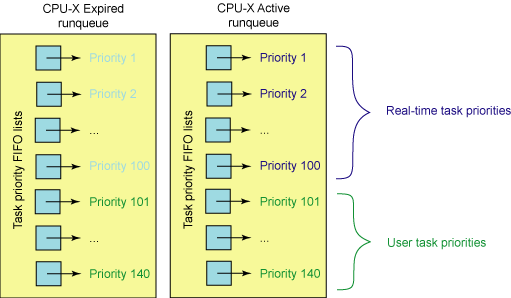
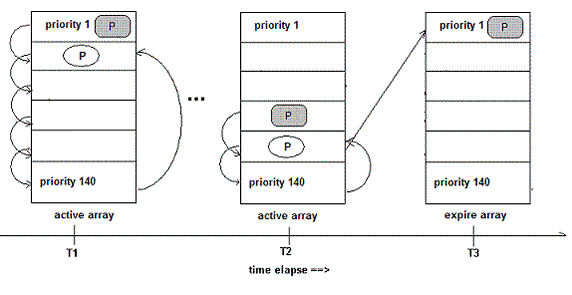
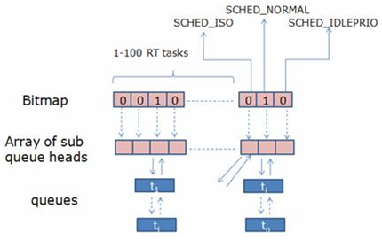
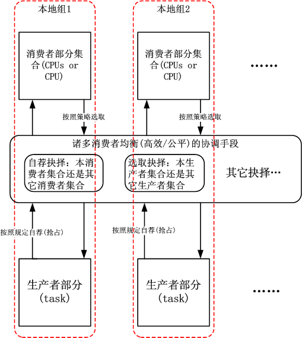

***Linux进程调度策略的发展和演变***

- 1 前言
    - 1.1 进程调度
    - 1.2 进程分类
    - 1.3 不同进程采用不同的调度策略
    - 1.4 Linux调度器的演变
- 2 O(n)的初始调度算法
    - 2.1 Linux 2.4之前的内核调度器
    - 2.2 Linux 2.4的调度器
        - 2.2.1 概述
        - 2.2.2 详情
- 3 O(1)的调度算法
    - 3.1 概述
    - 3.2 详情
        - 3.2.1 普通进程的优先级计算
        - 3.2.2 实时进程的优先级计算
        - 3.2.3 pick next算法
- 4 Linux 2.6的新一代调度器CFS
    - 4.1 楼梯调度算法staircase scheduler（SD）
    - 4.2 RSDL（Rotating Staircase Deadline Scheduler）
    - 4.3 完全公平的调度器CFS
        - 4.3.1 CFS如何实现pick next
        - 4.3.2 tick中断
        - 4.3.3 红黑树键值计算
        - 4.3.4 调度器管理器
        - 4.3.5 CFS组调度
- 5 返璞归真的Linux BFS调度器
    - 5.1 可配置型调度器的需求
    - 5.2 问题在哪？
    - 5.3 回到O(n)调度器
    - 5.4 BFS调度器的原理
    - 5.5 BFS调度器初始版本的链表的非O(n)遍历
    - 5.6 pick-next算法
    - 5.7 去除了小手段的BFS调度器
    - 5.8 队列外部执行
    - 5.9 结论

# 1. 前言

## 1.1 进程调度

内存中保存了对每个进程的唯一描述，通过若干结构与其他进程连接起来。

调度器面对的情形就是这样，其任务是在程序之间共享CPU时间，创造并行执行的错觉，该任务分为两个不同的部分，其中一个设计调度策略，另外一个设计上下文切换。

## 1.2 进程分类

Linux把进程区分为实时进程和非实时进程，其中非实时进程进一步换分为交互式进程和批处理进程。

Linux进程分类：
- 实时进程
- 非实时进程
    - 交互式进程
    - 批处理进程

类型 | 描述 | 示例
---|---|---
交互式（interactive）| 此类进程经常与用户进行交互，因此需要花费很多时间等待键盘和鼠标操作。</br>当接受了用户的输入后，进程必须很快被唤醒，否则用户会感觉系统反应迟钝。 | shell，文本编辑器和图形应用程序
批处理（batch）| 此类进程不必与用户交互，因此进场在后台运行。</br>因为这样的进程不必很快相应，因此常受到调度程序的怠慢。| 编译器、数据库搜索引擎、科学计算
实时（read-time）| 这些进程由很强的调度需求，这样的进程绝不会被低优先级的进程阻塞，</br>而且它们的响应时间要尽可能的短 | 视频音频应用程序，机器人控制

在Linux中，调度算法可以明确的确认所有实时进程的身份，但是没办法区分交互式进程和批处理进程，Linux2.6的调度器实现了基于进程过去行为的启发式算法，以确定进程应该被当做交互式进程还是批处理进程。
当然与批处理进程相比，调度器有偏爱交互式进程的倾向。

## 1.3 不同进程采用不同的调度策略

根据进程的不同分类Linux采用不同的调度策略：
- 对于实时进程，采用FIFO或者Round Robin的调度策略。
- 对于普通进程，则需要区分交互式和批处理式的不同。传统Linux调度器提高交互式应用的优先级，使得它们能更快地被调度。而CFS和RSDL等新的调度器的核心思想是完全公平。这个设计理念不仅大大简化了调度器的代码复杂度，还对各种调度需求提供了更完美的支持。

> 注意：Linux通过将进程和线程视为一个，同时包含二者。进程可以看做是单个线程，但是进程可以包含共享一定资源（代码/数据）的多个线程。因此进程调度也包含了线程调度的功能。

- 目前实时进程的调度策略比较简单，因为实时进程只要求尽可能快的被响应，基于优先级，每个进程根据它重要程度的不同被赋予不同的优先级，调度器在每次调度时，总选择优先级最高的进程开始执行。低优先级不可能抢占高优先级，因此FIFO或者Round Robin的调度策略可以满足实时进程调度的需求。

- 但是普通进程的调度策略就比较麻烦了，因为普通进程不能简单的只看优先级，必须公平的占有CPU，否则很容易出现进程饥饿，这种情况下用户会感觉操作系统很卡顿，响应速度慢，因此在Linux调度器的发展历程中经历了多次重大变动，Linux总是希望寻找一个接近于完美的调度策略来公平快速的调度进程。

## 1.4 Linux调度器的演变

一开始的调度器是复杂度为O(n)的原始调度算法，这个算法的缺点是当内核中有很多任务时，调度器本身就会消耗不少时间，所以，从Linux 2.5开始进入赫赫有名的O(1)调度器。

然而，Linux是集全球很多程序员的聪明才智而发展起来的超级内核，没有最好，只有更好，在O(1)调度器风光了没几天就被另一个更优秀的调度器取代了，它就是CFS调度器。这个也是在Linux 2.6中进入的，基于版本为2.6.23 ，即从此版本开始，内核使用CFS作为它的默认调度器，O(1)调度器被抛弃了。

所以完全有理由相信，后续如果再会出现一个更优秀的调度器，CFS也不会幸免，因为Linux只要最好的那个。

# 2. O(n)的初始调度算法

## 2.1 Linux 2.4之前的内核调度器

早期的Linux进程调度器使用了最低的设计，它显然不关注具体很多处理器的大型架构，更不用说是超线程了。

Linux调度器使用了环形队列用于可运行的任务管理，使用循环调度策略。此调度器添加和删除进程效率很高，简而言之，该调度器并不复杂但是简单快捷。

Linux 2.2进入了调度类的概念，允许针对实时任务、非抢占任务、非实时任务的调度策略。调度器还包括对称多处理器（SMP）的支持。

## 2.2 Linux 2.4的调度器

### 2.2.1 概述

在Linux 2.4.18 ~ 2.5.0之前的内核，当很多任务都处于活动状态时，调度器有很明显的限制。这是由于调度器使用一个复杂度为O(n)的算法实现的。

调度器采用基于优先级的设计，这个调度器和Linus在1992年发布的调度器没有很大区别。该调度器的pick next算法非常简单：对runqueue中所有进程的优先级进行依次比较，选择最高优先级的进程作为下一个被调度的进程。
（runqueue是Linux中保存所有就绪进程的队列），pick next用来指从所有候选进程中挑选下一个要被调度的进程的过程。

这种调度算法非常简单易懂：在每次进程切换时，内核扫描可运行进程的链表，计算优先级，然后选择最佳进程来运行。

这个调度器中，调度任务所花费的时间是一个系统中任务个数的函数，换而言之，活动的任务越多，调度任务所花费的时间越长。在系统负载非常严重时，处理器会因调度消耗大量的时间，用于任务本身的时间就非常少了。因此，这个算法却反可伸缩性。

### 2.2.2 详情

每个进程被创建时都会被赋予一个时间片。时钟中断递减当前运行进程的时间片，当进程的时间片被用完时，它必须等待重新赋予时间片才能有机会运行。Linux 2.4调度器保证只有当所有Running状态进程的时间片都被用完之后，才对所有进程重新分配时间片。这段时间被称为一个epoch。

这种设计保证了每个进程都有机会得到执行。每个epoch中，每个进程允许执行到其时间片用完。如果某个进程没有使用完其所有的时间片，那么剩余时间片的一半将被添加到新时间片，使其在下一个epoch中可以执行更长时间。

调度器只是迭代进程，引用goodness函数（指标）决定下面执行哪个进程。当然，各种进程对调度的需求并不相同，Linux 2.4调度器主要依靠改变进程的优先级，来满足不同进程的调度需求。事实上，所有后来的调度器都主要依赖修改进程优先级来满足不同的调度需求。

**实时进程：**

实时进程的优先级是静态设定的，而且始终大于普通进程的优先级。因此只有当runqueue中没有实时进程的情况下，普通进程才能够获得调度。

实时进程采用两种调度策略：
- SCHED\_FIFO：采用先进先出的策略，对于所有相同优先级的进程，最新进入runqueue的进程总能优先获得调度
- SCHED\_RR：采用更加公平的轮转策略，使得相同优先级的实时进程能够轮流获得调度。

**普通进程：**

对于普通进程，调度器倾向于提供交互式进程的优先级，因为它们需要快速的用户相应。普通进程的优先级主要由进程描述符中的Counter字段决定（还要加上nice设置的静态优先级）。
进程被创建时子进程的counter值为父进程counter值的一半，这样保证了任何进程不能依靠不断地fork()子进程从而获得更多的执行机会。

*Linux 2.4调度器是如何提高交互式进程的优先级的呢？*

如前所述，当所有Running状态进程的时间片被用完之后，调度器将重新计算所有进程的counter值，所有进程不仅包括Running状态进程，也包括处于睡眠状态的进程。
处于睡眠状态的进程的counter本来就没有用完，在重新计算时，它们的counter值会加上这些原来未用完的部分，从而提高了它们的优先级。交互式进程经常因等待用户输入而处于睡眠状态，当它们重新被唤醒并加入runqueue时，就会优先于其他进程而获得CPU。从用户角度来看，交互式进程的响应速度就提高了。

**该调度器的主要缺点：**

- **可扩展性不好**

调度器选择进程时需要遍历整个runqueue从中选出最佳人选，因此该算法的执行时间与进程数成正比。另外每次重新计算counter所花费的时间会随着系统中进程数的增加而线性增长，当进程数很大时，更新counter操作的代价会非常高，导致系统整体的性能下降。

- **高负载系统上的调度性能比较低**

2.4调度器预分配给每个进程的时间片比较大，因此在高负载的服务器上，该调度器的效率比较低，因为平均每个进程的等待时间与该时间片的大小成正比。

- **交互式进程的优化并不完善**

Linux 2.4识别交互式进程的原理基于以下假设，即交互式进程比批处理进程更频繁地处于Suspended状态。然而现实情况往往并非如此，有些批处理进程虽然没有用户交互，但是也不会频繁地进程I/O操作。

例如，一个数据库引擎在处理查询时会经常地进行磁盘I/O，虽然它们并不需要快速地响应用户，还是被提高了优先级。当系统中这类进程的负载较重时，会影响真正的交互式进程的响应时间。

- **对实时进程的支持不够**

Linux 2.4内核时非抢占的，当进程处于内核态时不会发生抢占，这对于真正的实时应用是不能接受的。

为了解决这些问题，Ingo Molnar开发了新的O(1)调度器，在CFS和RSDL之前，这个调度器不仅被Linux 2.6采用，还BACKPORT到Linux 2.4中，很多商业的发行版都采用了这个调度器。

# 3. O(1)的调度算法

## 3.1 概述

由于进程优先级的最大值为139，因此MAX\_PRIO的最大值取140。
- 实时进程使用0 ~ 99的优先级
- 普通进程使用100 ~ 139的优先级

因此，该调度算法为每个优先级都设置了一个可运行队列，即包含140个可运行状态的进程链表，每一条优先级链表上的进程都具有相同的优先级，而不同进程链表上的进程都拥有不同的优先级。

除此之外，还包括了一个优先级位图bitmap。该位图使用一个bit来代表一个优先级，而140个优先级最少需要5个32位整数来表示，因此只需要一个int[5]就可以表示位图，该位图中所有位都被置0，当某个优先级的进程处于可运行状态时，该优先级所对应的位就被置1。如果确定了优先级，那么选取下一个进程就简单了，只需要在queue数组中对应的链表上选取一个进程即可。

最后，在早期的内核中，抢占时不可能的；这意味着如果有一个低优先级的任务在执行，高优先级的任务只能等待它完成。

## 3.2 详情

从名字就可以看出Linux 2.6 O(1)调度器主要解决了Linux 2.4 O(n)的扩展问题：
- O(1)调度算法所花费的时间为常数，与当前系统中的进程个数无关。
- Linux 2.6内核支持内核态抢占，因此更好地支持了实时进程。
- O(1)调度器还更好地区分了交互式进程和批处理式进程。
- Linux 2.6内核也支持三种调度策略：SCHED\_FIFO和SCHED\_RR用于实时进程，而SCHED\_NORMAL用于普通进程。
- Linux 2.6 O(1)调度修改优化Linux 2.4调度器：
    - 进程优先级的计算方法
    - pick next算法
- O(1)调度器跟踪运行队列中可运行的任务（实际上，每个优先级具有两个运行队列，一个用于活动任务，一个用于过期任务），这意味着要确定接下来的任务，调度器只需按优先级将下一个任务从特定活动的运行队列中取出即可。

### 3.2.1 普通进程的优先级计算

不同类型的进程应该有不同的优先级。每个进程与生俱来（即从父进程那里继承而来）都有一个优先级，我们将其称为静态优先级。普通进程的静态优先级范围从100 ~ 139，100为最高优先级，139为最低优先级，0 ~ 99保留给实时进程。
当进程用完了时间片后，系统就会为该进程分配新的时间片（即基本的时间片），静态优先级本质上决定了时间片分配的大小。

**静态优先级：**

静态优先级和基本时间片的管理如下：
- 静态优先级 < 120，基本时间片 = max((140 - 静态优先级) * 20, MIN\_TIMESLICE)
- 静态优先级 >= 120，基本时间片 = max((140 - 静态优先级) * 5, MIN\_TIMESLICE)

其中MIN\_TIMESLICE为系统规定的最小时间片。从该计算公式可以看出，静态优先级越高（值越低），进程得到的时间片越长。其结果是，优先级高的进程会获得更长的时间片，而优先级低的进程得到的时间片则较短。

**动态优先级：**

进程除了拥有静态优先级外，还有动态优先级，其取值范围是100 ~ 139。当调度程序选择新进程运行时就会使用进程的动态优先级，动态优先级和静态优先级的关系可参考下面的公式：
- 动态优先级 = max(100, min(静态优先级 - bouns + 5), 139)

从上面看出，动态优先级的生成是以静态优先级为基础，再加上相应的惩罚或奖励（bouns）。这个bouns并不是随机产生的，而是根据进程过去的平均睡眠时间做相应的惩罚或奖励。

所谓平均睡眠时间（sleep\_avg，位于task\_struct结构中）就是进程在睡眠状态所消耗的总时间数，这里的平均并不是直接对时间求平均数。平均睡眠的时间随着进程的睡眠而增长，随着进程的运行而减少。因此，平均睡眠时间记录了进程睡眠和执行的时间，它是用来判断进程交互性强弱的关键证据。如果一个进程的平均睡眠时间很大，那么它很可能是一个交互式很强的进程。反之，如果一个进程的平均睡眠时间很小，那么它很可能一直在执行。

另外，平均睡眠时间也记录着进程当前的交互装填，有很快的反映速度。比如，一个进程在某一小段时间交互性很强，那么sleep\_avg就会可能暴涨（当然它不能超过MAX\_SLEEP\_AVG），但如果之后都一直处于执行状态，那么sleep\_avg就又可能一直递减。理解了平均睡眠时间，那么bouns的含义也就显而易见了。

- 交互式的进程会得到调度程序的奖励（bouns为正）
- 那些一直霸占CPU的进程（批处理式的进程）会得到相应的惩罚（bouns为负）

其实bouns相当于平均睡眠时间的缩影，此时只是将sleep\_avg转换成证书bouns数值范围内的大小。可见平均睡眠时间可以用来衡量进程是否是一个交互式进程。如果满足下面的公式，进程就被认为是一个交互式进程：
- 动态优先级 <= 3 * 静态优先级/4 + 28

平均睡眠时间是进程处于等待睡眠状态下的时间，该值在进程进入睡眠状态时增加，而进入RUNNING状态后则减少。
改制的更新时机分布在很多内核函数内，如：
- 时钟中断
- 进程创建
- 进程从TASK\_INTERRUPTIBLE状态唤醒
- 负载平衡

### 3.2.2 实时进程的优先级计算

实时进程的优先级由sys\_sched\_setschedule()设置。该值不会动态修改，而且总是比普通进程的优先级高。
在进程描述符中用rt\_priority域表示。

### 3.2.3 pick next算法

普通进程的调度选择算法基于进程的优先级，拥有最高优先级的进程被调度器选中。

在Linux 2.4中，时间片counter同时也表示了一个进程的优先级。在Linux 2.6中时间片用任务描述符的time\_slice域表示，而优先级用prio（普通进程）或者rt\_priority（实时进程）表示。

调度器为每一个CPU维护了两个进程队列数组：指向活动运行队列的active数组和指向过期运行队列的exprie数组。
数组中的元素保存某一优先级的进程队列指针。
系统一共有140个不同的优先级，因此这两个数组大小都是140。
它们是按照先进先出的顺序进行服务的。
被调度执行的任务都会被添加到各自运行队列优先级列表的末尾。
每个任务都拥有一个时间片，这取决于系统允许执行这个任务多长事件。
运行队列的前100个优先级列表保留给实时任务使用，后40个用于用户任务使用，参见下图：



当需要选择当前最高优先级的进程时，Linux 2.6调度器不用遍历整个runqueue，而是直接从active数组中选择当前最高优先级队列中的第一个进程。

假设，当前所有进程中最高优先级为50（换句话说，系统中没有任何进程的优先级小于50）。
则调度器直接读取active[49]，得到优先级为50的进程队列指针。从该队列头上的第一个进程就是被选中的进程。
这种算法的复杂度为O(1)，从而解决了Linux 2.4调度器的扩展问题。

为了实现O(1)算法active数组维护了一个由5个32位的整数（140个优先级）组成的bitmap，当某个优先级上有进程被插入列表时，相应的bit就被置位。sched\_find\_first\_bit()函数查询该bitmap，返回当前被置位的最高优先级的数组下标。在上例中sched\_find\_first\_bit()函数将返回49。在intel64处理器上使用bsf汇编指令实现。可见查找一个任务来执行所需要的时间并不依赖于活动任务的个数，而是依赖于优先级的数量。这使得Linux 2.6版本的调度器成为一个复杂度为O(1)的过程，因为调度时间既是固定的，而且也不会受到活动任务个数的影响。

为了提高交互式进程的响应时间，O(1)调度器不仅动态地提高该类进程的优先级，还采用以下方法：
- 每次时钟tick中断时，进程的时间片（time\_slice）被减1。当time\_slice为0时，表示当前进程的时间片用完，调度器判断当前进程的类型。
    - 如果是交互式进程或者实时进程，则重置其时间片并重新插入active数组。
    - 如果不是交互式进程则从active数组中移到expired数组，并根据上述公式重新计算时间片。
- 这样实时进程和交互式进程就总能优先获得CPU。

然而这些进程不能始终留在active数组中，否则进入expire数组的进程就会产生饥饿现象。
当进程已经占用CPU时间超过一个固定值后，即使它是实时进程或者交互式进程也会被移到expire数组中。
当active数组中的所有进程都被移到expire数组中之后，调度器交换active数组和expire数组。
因此，新的active数组又恢复了初始情况，而expire数组为空，从而开始新的一轮调度。

Linux 2.6调度器改进了前任调度器的可扩展性问题，schedule()函数的时间复杂度为O(1)。这取决于两个改进：
1. pick next算法借助于active数组，无需遍历runqueue。
2. 取消了定期更新所有进程的counter操作，动态优先级的修改分布在进程切换，时钟tick中断以及其他一些内核函数中进程。

O(1)调度器区分交互式进程和批处理进程的算法与以前虽大由改进，但仍然在很多情况下会失效。
有一些著名的程序总能让调度器性能下降，导致交互式进程反映缓慢。例如，fifyp.c、thud.c、chew.c、ring-test.c、massive\_intr.c等。
而且O(1)调度器对NUMA支持也不完善。为了解决这些问题，大量难以维护和阅读的复杂代码被加入Linux 2.6.0的调度器模块，虽然很多性能问题因此得到了解决，可是另外一个严重问题始终困扰着许多内核开发者，那就是代码的复杂度问题。很多复杂的代码难以管理并且对于纯粹主义者而言未能体现算法的本质。

为了解决O(1)调度器面临的问题以及应对其他外部压力，需要改变某些东西。这种改变来自Con Kolivas的内核补丁staircase scheduler（楼梯调度算法），以及改进的RSDL（Rotating Staircase Deadline Scheduler）。它为调度器设计了一个新的思路。Ingo Molnar在RSDL之后开发了CFS，且最终被Linux 2.6.23内核采用。接下来我们开始介绍这些新一代调度器。

# 4. Linux 2.6的新一代调度器CFS

## 4.1 楼梯调度算法staircase scheduler（SD）

楼梯算法（SD）在思路上和O(1)算法有很大不同，它抛弃了动态优先级的概念。而采用了一种完全公平的思路。
前任算法的主要复杂性来自动态优先级计算，调度器根据平均睡眠时间和一些很难理解的经验公式来修正进程的优先级以及区分交互式进程。这样的代码很难阅读和维护。楼梯算法思路简单，但是实验证明它对交互式进程的相应比其前任更好，而且极大地简化了代码。

和O(1)算法一样，楼梯算法也同样为每一个优先级维护了一个进程列表，并将这些列表组织在active数组中。
当选取下一个被调度进程时，SD算法也同样从active数组中直接读取。与O(1)算法不同在于，当进程用完了自己的时间片后，并不是被移到expire数组中，而是被加入active数组的低一优先级列表中，即将其降低一个级别。
不过，请注意这里只是将该任务插入低一级优先级任务列表中，任务本身的优先级并没有改变。
当时间片再次用完，任务被再次放入更低一级优先级任务队列中。就像一部楼梯，任务每次用完了自己的时间片之后就下一级楼梯。任务下到最低一级楼梯时，如果时间片再次用完，它会回到初始化优先级的下一级任务队列中。

比如某进程的优先级为1，当它到达最后一级台阶140后，再次用完时间片时将回到优先级为2的任务队列中，即第二级台阶。不过此时分配给该任务的time\_slice将变成原来的2倍。比如，原来该任务的时间片time\_slice为10ms，则现在变成20ms。基本的原则是，当任务下到楼梯底部时，再次用完时间片回到上次下楼梯的起点的下一级台阶；并赋予该任务相同于其最初分配的时间片。

总结如下：
- 设任务本身优先级为P。
- 当它从N级台阶开始下楼梯并达到底部后，将回到第P+1级台阶。并且赋予该任务N+1倍的时间片。

以上描述的是普通进程的调度算法，实时进程还是采用原来的调度策略，即FIFO或者RR。

楼梯算法能避免进程饥饿现象，高优先级的进程会最终和低优先级的进程竞争，使得低优先级进程最终获得执行机会。
对于交互式应用，当进入睡眠状态时，与它同等优先级的其他进程将一步一步地走下楼梯，进入低优先级进程队列。
当该交互式进程再次唤醒后，它还留在高出的楼梯台阶上，从而能更快地被调度器选中，加速了响应时间。

楼梯算法的优点：从实现角度看，SD基本上还是沿用了O(1)的整体框架，指示删除了O(1)调度器中动态优先级的复杂代码；还淘汰了expire数组，从而简化了代码。它最重要的意义在于证明了完全公平这个思想的可行性。

## 4.2 RSDL（Rotating Staircase Deadline Scheduler）

RSDL也是由Con Kolivas开发的，它是对SD算法的改进。核心的思想还是“完全公平”。没有复杂的动态优先级调整策略。RSDL重新引入了expire数组。
- 它为每一个优先级都分配了一个“组时间配额”，记为Tg；
- 同一优先级的每个进程都拥有同样的“优先级时间配额”，用Tp表示。

当进程用完了自身的Tp时，就下降到下一优先级进程组中。这个过程和SD相同，在RSDL中这个过程叫做Minor rotation（次轮询）。

请注意：Tp不等于进程的时间片，而是小于进程的时间片。下图表示了minor rotation。
进程从priority1的队列中一步一步下到priority140之后回到priority2的队列中，这个过程如左边所示，
然后从priority2开始再次一步一步下楼，到底后再次反弹到priority3队列中，如下图所示。


在SD算法中，处于楼梯底部和低优先级进程必须等待所有的高优先级进程执行完才能获得CPU。
因此，优先级进程的等待时间无法确定。

在RSDL中，当优先级进程组用完了它们的Tg（组时间配额）时，无论该组中是否还有进程Tp尚未用完，所有属于该组的进程都被强制降低到下一优先级进程组中。这样低优先级任务就可以在一个可以预计的未来得到调度。从而改善了调度的公平性。这就是RSDL中Deadline代表的含义。

进程用完了自己的时间片time\_slice时（下图中T2），将放入expire数组指向的对应初始化优先级队列中（priority 1）。



当active数组为空，或者所有的进程都降低到最低优先级时就会触发主轮询major rotation。
Major rotation交换active数组和expire数组，所有进程都恢复到初始状态，再一次新开始minor rotation的过程。

RSDL对交互式进程的支持：和SD算法同样的道理，交互式进程在睡眠时间时，它所有的竞争者都因为minor rotation而降低了优先级进程队列中。当它重新进入RUNNING状态时，就获得了相对较高的优先级，从而能被迅速响应。

## 4.3 完全公平的调度器CFS

CFS是最终被内核采纳的调度器。它从RSDL/SD中吸取了完全公平的思想，不再跟踪进程的睡眠时间，页不再企图区分交互式进程。它将所有的进程都同一对待，这就是公平的含义。CFS算法和实现都相当简单，众多的测试表明其性能也非常优越。

- 按照作者Ingo Molnar的说法： 

CFS 80%的工作可以用一句话概括：CFS在真实的硬件上模拟了完全理想的多任务处理器。在真实的硬件上，同一时刻我们只能运行单个进程，因此当一个进程占用CPU时，其他进程就必须等待，这就产生了不公平。但是在“完全理想的多任务处理器”下，每个进程都能同时获得CPU的执行时间，即并行地每个进程栈1/nr\_running的时间。

例如，当系统中有两个进程时，CPU的计算时间应该被分成两份，每个进程获得50%。

假设，runqueue中有N个进程，当前进程运行了10ms。在“完全理想的多任务处理器”中，10ms应该评分给N个进程（不考虑进程的nice值），因此当前进程应得的时间是（10/n）ms，但是它却云心管理10ms。所以CFS将惩罚当前进程，使其他进程能够在下次调度时尽可能取代当前进程。最终实现所有进程的公平调度。

与之前的Linux调度器不同，CFS没有将任务维护在链表式的运行队列中，它抛弃了active/exprire数组，而是对每个CPU维护一个以时间为顺序的红黑树。采用红黑树的原因在于：
- 红黑树可以始终保持平衡，这意味着树上没有路径比任何其他路径长两倍以上。
- 由于红黑树是二叉树，查找操作的时间复杂度为O(log n)。但除了最左侧查找以外，很难执行其他查找，并且最左侧的节点指针始终被缓存。
- 对于大多数操作（插入、删除、查找等），红黑树的执行时间为O(log n)，而以前的调度程序通过固定优先级的优先级数组使用O(1)。O(log n)行为具有可测量的延迟，但是对于较大的任务数无关紧要。Molnar在尝试这种树的方法时，首先对这一点进行了测试。
- 红黑树可通过内部存储实现，即不需要使用外部分配即可对数据结构进行维护。

要实现平衡，CFS使用"vruntime"虚拟运行时间表示某个任务的时间量。任务的虚拟运行时间越小，意味着任务被允许访问服务的时间越短，其对处理器的要求越高。CFS还包含睡眠公平概念以便确保哪些目前没有运行的任务（例如，等待I/O）在其最终需要时获得相等份额的处理器。

### 4.3.1 CFS如何实现pick next

下图是一个红黑树的例子：


所有可运行的任务通过不断地插入操作，最终都存储在以时间（vruntime）为顺序的红黑树中（由sched\_entity对象表示）：
- 对处理器要求最多的任务（最低vruntime）存储在树的左侧
- 对处理器要求最小的任务（最高vruntime）存储在树的右侧

为了公平，CFS调度器会选择红黑树最左边的叶子节点作为下一个将获得CPU的任务。
这样，数左侧的进程就被赋予时间运行了。

### 4.3.2 tick中断

在CFS中，tick中断首先更新调度信息。
然后调整当前进程在红黑树中的位置。
调整完成后如果发现当前进程不再是最左边的叶子，就标记need\_resched标志，中断返回时就会调用scheduler()完成进程切换。否则当前进程继续占用CPU。

从这里可以看到CFS抛弃了传统的时间片概念。Tick中断只需更新红黑树，以前的所有调度器都在tick中断中递减时间片，当时间片或者配额被用完时才出发优先级调整并重新调度。

### 4.3.3 红黑树键值计算

理解CFS的关键就是了解红黑树键值的计算方法。该键值由三个因子计算而得：
1. 进程已经占用的CPU时间
2. 当前进程的nice值
3. 当前的cpu负载

进程已经占用的CPU时间对键值的影响最大，其实很大程序上我们在理解CFS时可以简单地认为键值就是等于进程已占用CPU时间。因此该值越大，键值越大，从而使得当前进程向红黑树的右侧移动。
另外CFS规定，nice值为1的进程比nice值为0的进程多获得10%的CPU时间。在计算键值时也考虑到这个因素，因此nice值越大，键值也越大。

CFS为每个进程都维护两个重要变量：fair\_clock和wait\_runtime。
这里我们将每个进程维护的变量称为进程级变量，
为每个CPU维护的变量称为CPU级变量，
为每个runqueue维护的变量称为runqueue级变量。

进程插入红黑树的键值即为fair\_clock - wait\_runtime。
- fair\_clock从其字面含义上讲就是一个进程应获得的CPU时间，即等于进程已占用的CPU时间除以当前runqueue中进程总数；
- wait\_runtime是进程的等待时间。

它们的差值代表了一个进程的公平程度。该值越大，代表当前进程相对于其他进程越不公平。
对于交互式任务，wait\_runtime长时间得不到更新，因此它能拥有更小的红黑树键值，更靠近红黑树的左边。
从而得到快速响应。

> 红黑树是一颗自平衡二叉查找树，调度器每次总是从最左侧读出一个叶子节点，该读取操作的时间复杂度是O(log n)。

### 4.3.4 调度器管理器

为了支持实时进程，CFS提供了调度器模块管理器。各种不同的调度器算法都可以作为一个模块注册到该管理器中。
不同的进程可以选择使用不同的调度模块。Linux 2.6.23中，CFS实现了两个调度算法，CFS算法模块和实时调度模块。
- 对应实时进程，将使用实时调度模块。
- 对于普通进程，将使用CFS调度模块。

CFS调度模块（在kernel/sched\_fair.c中实现）用于以下调度策略：
- SCHED\_NORMAL
- SCHED\_BATCH
- SCHED\_IDLE

实时调度模块（在kernel/sched\_rt.c中实现）用于以下调度策略：
- SCHED\_RR
- SCHED\_FIFO

### 4.3.5 CFS组调度

CFS组调度（在Linux 2.6.24内核中引入）是另一种为调度带来公平性的方式，尤其是在处理产生很多其他任务的任务时。

假设，一个产生了很多任务的服务器要并行化的链接（HTTP服务器的典型架构prefork模型）。不是所有任务都会被统一同屏对待，CFS进入了组调度来处理这种行为。产生任务的服务器进程在整个组中（在一个层次结构中）共享它们的vruntime，而单个任务维持其自己独立的vruntime。这样单个任务会收到与组大致相同的调度时间。你会发现/proc文件系统接口用于管理进程层次结构，让您对组的形成方式有完全的控制。使用此配置，你可以跨用户、跨进程或其变体分配公平性。

考虑一个两个用户的示例，用户A和用户B在一台机器上运行作业。
- 用户A只有两个作业在运行
- 用户B正在运行48个作业

组调度时CFS能够对用户A和用户B进行公平调度，而不是对系统中运行的50个作业做公平地调度。
每个用户各拥有50%的CPU使用。
用户B使用自己50%的CPU分配运行他的48个作业，而不会占用属于用户A的另外50%的CPU分配。

# 5. 返璞归真的Linux BFS调度器

BFS是一个进程调度器，可以解释为“脑残调度器”。这古怪的名字有多重含义，比较容易被接受的一个说法为：它如此简单，却如此出色，这会让人对自己的思维产生怀疑。

BFS不会被合并进入Linus维护的Linux mainline，BFS本身也不打算这么做。但BFS拥有众多的拥护者，这只有一个原因：BFS非常出色，它让用户的桌面环境达到了前所未有的流畅。在硬件越来越先进，系统却依然显得迟钝的时代，这实在让人兴奋。

进入2010年，Android开发一个分支使用BFS作为其操作系统的标准调度器，这也证明了BFS的价值。

## 5.1 可配置型调度器的需求

为了避免小手段，那就要彻底放弃“鱼和熊掌可兼得”的思想，采用“一种调度器只适用于一种场景”的新思路。
如此我们可以设计多种调度器，在安装操作系统的时候由管理员进行配置，比如我们将其用于桌面，那么就使用“交互调度器”，如果用于路由器，那就使用“大吞吐调度器”。消除了兼顾的要求，调度器设计起来就更加简单和纯粹了。

面对需要大吞吐量的网络操作系统，我们有传统的UNIX调度器，然而面对日益桌面化的操作系统比如Android收集，我们是否能摒弃那种大而全的调度策略呢？

Con Kolivas设计出的BFS调度器就是为桌面交互式应用量身打造的。

## 5.2 问题在哪？

Linux 2.6实现了那么多的调度器，然而其效果总是有美中不足的地方，到底问题出在哪里？

事实上，Linux 2.6的各种调度器的实现都不是完全按照理论完成的，其中都添加了一些小手段。
比如，虽然CFS号称支持大于2048的CPU个数，然而实际应用中，效果未必好，因为CFS调度器继承了O(1)调度器的load\_balance特性，因此在那么多处理器之间进行基于调度域的load\_balance，锁以及独占的代价将非常大，从而抵消了每CPU队列带来的消除锁的优势。

总之，这些调度器太复杂了，而且越来越复杂，将80%的精力消耗在了20%的场景中。
实际上，做设计不要联想，完全按照我们目前所知道和所遇到的来，在可用性和效率上被证明是明智的，当然不考虑太多的可扩展性。

## 5.3 回到O(n)调度器

BFS调度器用一句话来总结就是“回到了O(n)调度器”，它在O(n)调度器的基础上进行了优化，而没有引入看起来很好的O(1)调度器，这就是其实事。

O(n)调度器有什么不好么？

有的，大不了就是遍历的时间太长，BFS根据实际的测试数据忽略之；每个处理器都要锁定整个队列，BFS改之，做到这些即可。这才叫基于O(n)调度器的优化而不是彻底颠覆O(n)调度器而进入O(1)调度器——当然前提是桌面环境。

如果说能回到原始O(n)调度器进行修改使之重新发挥其作用而不是彻底抛弃它，这才是最佳的做法，反之，如果我们把问题的解决方案搞的越来越复杂，最终就是陷入一个泥潭而不可自拔。要知道方案复杂性的累积是一个笛卡尔乘积式的累积，你必须考虑到每一种排列组合才行，当你做不到这一点的时候，你就需要返璞归真。

## 5.4 BFS调度器的原理

BFS的原理十分简单，其实质就是使用了O(1)调度器中的bitmap的概念，所有进程被安排到103个qeueue中，各个进程不是按优先级而是按照优先级区间被排列到各自所在的区间，每一个区间拥有一个queue，如下图所示：



内核在pick-next的时候，按照O(1)调度器的方式首先查找bitmap中不为0的哪个queue，然后在该queue中执行O(n)查找，查找到virtual deadline最小的哪个进程投入执行。

过程很简单，就像流水一样，之所以规划103个队列而不是一个完全为了进程按照其性质而分类，这个和每CPU没有任何关系，将进程按照其性质分类而不是按照CPU分类是明智之举。
内核中由一个“103队列”，m个CPU和“103队列”完全是一个“消费者——生产者”的关系。
O(1)调度器，内核中有用m（CPU个数）个“消费者——生产者”的关系，每一个CPU附带一个“生产者（140队列）”。

只有统一的，单一的“消费者——生产者”的关系才能做到调度的公平，避免了多个关系之间踢皮球的现象，这是事实。
在结构单一，功能确定且硬件简单的系统中，正确的调度器架构如下图所示：


在结构单一，功能确定且硬件简单的系统中，不正确的调度器框架，如下图所示：



**虚拟Deadline（Virtual Deadline）**

当一个进程被创建时，它被赋予一个固定的时间片，和一个虚拟Deadline。该虚拟deadline的计算公式非常简单：
```
    Virtual Deadline = jiffies + (user_priority * rr_interval)
```
- jiffies是当前时间
- user\_priority是进程的优先级
- rr\_interval代表round-robin interval

近似于一个进程必须被调度的最后期限，即所谓的Deadline。
不过这个Deadline之前还有一个形容词为Virtual，因为这个Deadline只是表达一种愿景而已。
虚拟Deadline将用于调度器的picknext决策。

**进程队列的表示方法和调度策略**

在操作系统内部，所有的Ready进程都被存放在进程队列中，调度器从进程队列中选取下一个被调度的进程。
因此如何设计进程队列是我们研究调度器的一个重要话题。BFS采用了非常传统的进程队列表示方法，即Bitmap加Queue。

BFS将所有进程分成4类，分别表示不同的调度策略：
1. Realtime：实时进程SCHED\_ISO，isochronous进程，用于交互式任务SCHED\_NORMAL，普通进程SCHED\_IDLEORI，低优先级任务，实时进程总能获得CPU，采用Round Robin或者FIFO的方法来选择同样优先级的实时进程。它们需要superuser的权限，通常限于哪些占用CPU时间不多却非常在乎Latency的进程。
2. SCHED\_ISO：在主流内核中至今未实现，Con早在2003年就提出了这个patch，但一直无法进入主流内核，这种调度策略是为了那些near-realtime的进程设计的。如前所述，实时进程需要用户拥有superuser的权限，这类进程能够独占CPU，因此只有很少的进程可以被配置为实时进程。对于那些对交互性要求比较高的，又无法成为实时进程的进程，BFS将采用SCHED\_ISO，这些进程能够抢占SCHED\_NORMAL进程。它们的优先级比SCHED\_NORMAL高，但又低于实时进程。此外当SCHED\_ISO进程占用CPU时间达到一定限度后，会被降级为SCHED\_NORMAL，防止其独占整个系统资源。
3. SCHED\_NORMAL：类似于驻留调度器CFS中的SCHED\_OTHER，是基本的分时调度策略。
4. SCHED\_IDLEPRO：类似于CFS中的SCHED\_IDLE，即只有当CPU即将处于IDLE状态时才被调度的进程。

在这些不同的调度策略中，实时进程分成100个不同的优先级，加上其他三个调度 策略，一共103个不同的进程类型。
对于每个进程类型，系统中都有可能有多个进程同时Ready，比如，可能有两个优先级为10的RT进程同时Ready，所以对每个类型，还需要一个队列来存储属于该类型的ready进程。

BFS用103个bitmap来表示是否有相应类型的进程准备进行调度。
当任何一种类型的进程队列非空时，即存在Ready进程时，相应的bitmap位被置为1。
调度器如何在这样一个bitmap加queue的复杂结构中选择下一个被调度进程的问题被称为Task Selection或者Pick next。

**Task Selection/Pick Next**

当调度器决定进行进程调度的时候，BFS将按照下面的原则来进行任务的选择：
首先查看bitmap是否由置位的bit，如果对应于SCHED\_NORMAL的bit被置位，表明有类型为SCHED\_NORMAL的进程ready。
如果有SCHED\_ISO或者RT task的bit被置位，则优先处理它们。
选定了相应的bit之后，便需要遍历其相应的子队列。
假如，是一个RT进程的子队列，则选取其中的第一个进程。如果是其他的队列，那么就采用EEVDF算法来选取合适的进程。

EEVDF，即Earliest Eligible Virtual Deadline Frist。BFS将遍历该子队列，一个双向链表，比较队列中的每个进程的Virtual Deadline值，找到最小的哪个。最坏的情况下，这是一个O(n)的算法，即需要遍历整个双向链表。

但实际上，往往不需要遍历整个N个进程，这是因为BFS还有这样一个搜索条件：
- 当某个进程的Virtual Deadline小于当前的Jiffies值时，直接返回该进程。并将其从就绪队列中删除，下次再insert时会放到队列尾部，从而保证每个进程都有被选中的可能，而不会出现饥饿现象。

这条规则对应这样一种情况，即进程已经睡眠了较长的时间，以至于已经睡过了它的Virtual Deadline。

## 5.5 BFS调度器初始版本的链表的非O(n)遍历

BFS调度器的发展历程中页经历了一个为了优化性能而进入“小手段”的时期，该“小手段”是如此合理，以至于每一个细节都值得品味，表述如下：

大家都知道，遍历一个链表的时间复杂度是O(n)，然而这只是遍历的开销，在BFS调度器中，遍历的目的其实就是pick-next，如果该链表某种意义上是预排序的，那么pick-next的开销可以减少到接近O(1)。BFS如何做到的呢？

我们首先看一下virtual deadline的概念：
```
    virtual deadline(VD) = Jiffies + (prio_ration * rr_interval)
```
其中prio\_ratio为进程优先级，rr\_interval为一个Deadline，表示该进程在最多多久内被调度，链表中的每一个entry代表一个进程，都有一个VD与之相关。VD的存在使得entry在链表上的位置得以预排序，这里的预排序指的是Virtual Deadline Expire的影响下预排序，BFS和O(n)的差别就在于这个expire，由于这个expire在，一般都会在遍历途中遇到VD expire，进而不需要O(n)。

基于VD的O(n)和基于优先级的O(n)是不同的，其区别在于上述的公式计算，VD是单向调节且向前，而优先级几乎是不怎么变化的，因此基于VD的O(n)调度器某种程度上和基于红黑树的CFS是一样的，VD也类似于CFS的vruntime，指示数据结构不同而已，BFS用链表实现，CFS用红黑树实现。

其实，O(n)并没有那么可怕，特别是在桌面环境下，你倒是有多少进程需要调度呢？理论上O(n)会随着进程数量的增加而效率降低，然而桌面环境下实际上没有太多的进程需要被调度，所以采用了BFS而抛弃了诸多小手段的调度器效果会更好些。理论上，CFS或者O(1)可以支持SMP下的诸多进程调度的高效性，然而在桌面环境下，第一，SMP也只是2到4个处理器，进程数也大多不超过1000个，进程在CPU之间蹦来蹦去，很累，何必杀鸡用牛刀呢？瓶颈不是鸡，而是杀鸡的到，是吧！

## 5.6 pick-next算法

BFS的pick-next算法对于SCHED\_ISO进程依照以下的规则进程：
-  依照FIFO原则进行，不再遍历链表

BFS的pick-next算法对于SCHED\_NORMAL或者SCHED\_IDLEPRIO进程依照以下的原则进行：
- 遍历运行链表，比较每一个entry的VD，找出最小的entry，从链表中删除，投入运行
- 如果发现entry的VD小于当前jiffies，停止遍历，取出entry，投入运行

以上的原则可以总结为“最小最负最优先”。下面是作者的一席话：
> BFS has 103 priority queues. 100 of these are dedicated to the static priority of realtime tasks, and the remaining 3 are, in order of best to worst priority, SCHED_ISO (isochronous), SCHED_NORMAL, and SCHED_IDLEPRIO (idle priority scheduling). When a task of these priorities is queued, a bitmap of running priorities is set showing which of these priorities has tasks waiting for CPU time. When a CPU is made to reschedule, the lookup for the next task to get CPU time is performed in the following way:
>
> First the bitmap is checked to see what static priority tasks are queued. If any realtime priorities are found, the corresponding queue is checked and the first task listed there is taken (provided CPU affinity is suitable) and lookup is complete. If the priority corresponds to a SCHED_ISO task, they are also taken in FIFO order (as they behave like SCHED_RR). If the priority corresponds to either SCHED_NORMAL or SCHED_IDLEPRIO, then the lookup becomes O(n). At this stage, every task in the runlist that corresponds to that priority is checked to see which has the earliest set deadline, and (provided it has suitable CPU affinity) it is taken off the runqueue and given the CPU. If a task has an expired deadline, it is taken and the rest of the lookup aborted (as they are chosen in FIFO order).
>
> Thus, the lookup is O(n) in the worst case only, where n is as described earlier, as tasks may be chosen before the whole task list is looked over.

使用Virtual deadline，类似于CFS的Virtual runtime的概念，然而不要红黑树，而采用了双向链表来实现。
因为红黑树的插入效率不如链表高，在pick-next算法上虽然红黑树占优势，然而由于VD expire的存在也使得pick-next不再是O(n)了。

BFS初始版本的小手段的意义在于减少O(n)遍历比较时间复杂度带来的恐惧。

## 5.7 去除了小手段的BFS调度器

最终将小手段去除是重要的，否则BFS最终是会陷入类似O(1)、CFS等复杂度的泥潭里而不可自拔。
因此，在后续的patch中，BFS去除了上述的小手段，用同一的O(n)复杂度来pick-next，毕竟前面已经说了O(n)在特定的环境下不是问题的关键，该patch在2.6.31.14-bfs318-330test.patch中体现。

## 5.8 队列外部执行

BFS调度器和CFS是一样的，都是队列外执行进程，这样可以减少锁争用带来的性能问题。在列出作者的一席话：

> BFS has one single lock protecting the process local data of every task in the global queue. Thus every insertion, removal and modification of task data in the global runqueue needs to grab the global lock. However, once a task is taken by a CPU, the CPU has its own local data copy of the running process' accounting information which only that CPU accesses and modifies (such as during a timer tick) thus allowing the accounting data to be updated lockless. Once a CPU has taken a task to run, it removes it from the global queue. Thus the global queue only ever has, at most,
>
> (number of tasks requesting cpu time) - (number of logical CPUs) + 1
>
> tasks in the global queue. This value is relevant for the time taken to look up tasks during scheduling. This will increase if many tasks with CPU affinity set in their policy to limit which CPUs they're allowed to run on if they outnumber the number of CPUs. The +1 is because when rescheduling a task, the CPU's currently running task is put back on the queue. Lookup will be described after the virtual deadline mechanism is explained.

在schedule核心函数中，使用return\_task来把prev进程重新入队，在earliest\_deadline\_task这个pick-next中，使用take\_task将选中的next从队列取出，从而实现队列外执行。

## 5.9 结论

从上面的论述，我们丝毫没有看到有任何诸如“SMP负载均衡”、“CPU亲和力”、“补偿/惩戒”这类的字眼，是的，这些字眼在BFS中完全不需要，BFS也是摒弃了这些字眼才获得成功的，毕竟在一个一般人使用的桌面操作系统中，没有这么多套套，大多数人使用的就是一个只有一到两个处理器的系统，难道有必要高什么调度域么？难道有必要搞什么NUMA呢？
需求决定一切，面对大型服务器，有Unix的机制站在那里，而如果我们想把Linux推广到每一个掌上设备，那就没必要复制Unix的那套了，BFS完全可以完美的搞定一切。小手段的取出，说明BFS调度器的发展方向起码是正确的。

BFS对SMP支持的如何呢？答案是它仅仅支持少量CPU的SMP体系，别忘了BFS的应用场合。
因为在调度过程中需要一个遍历所有CPU的O(m)复杂度的计算，这就明确告诉人们，别指望BFS使用在拥有4096个CPU的系统上，正如没人用这种系统看视频一样，那样的话，还是乖乖使用CFS吧。

BFS调度器的思想很简单：集中精力做好一件事，适应一种场景，代码同样十分简单，因此即使贴上代码整个文件也不会显得过于冗长，你再也看不到诸如Load\_balance或者for\_each\_domain之类的东西了，至于CPU cache的亲和力只能判断，如果你非要做，那么就自动调用sched\_setaffinity系统调用设置吧，把一个线程或者一组相关的进程设置到一个或者一组共享Cache的CPU上。