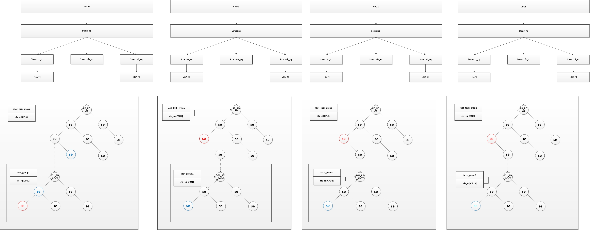

***Linux进程调度器的设计***

- 1 进程调度的数据结构
    - 1.1 task_struct中调度相关的成员
    - 1.2 优先级
    - 1.3 调度策略
    - 1.4 调度策略相关字段
- 2 调度类
- 3 就绪队列
    - 3.1 CPU就绪队列struct rq
    - 3.2 CFS公平调度器的就绪队列cfs_rq
    - 3.3 实时进程就绪队列rt_rq
    - 3.4 deadline就绪队列dl_rq
- 4 调度实体
    - 4.1 普通进程调度实体sched_entity
    - 4.2 实时进程调度实体sched_rt_entiry
    - 4.3 EDF调度实体sched_dl_entry
    - 4.4 组调度（struct task_group）
- 5 总结
    - 5.1 调度策略对象——调度类
    - 5.2 被调度的实体——进程或者进程组
    - 5.3 组织调度进程——就绪队列

# 1. 进程调度的数据结构

调度器使用一系列数据结构来排序和管理系统中的进程，调度器的工作方式和这些结构的设计密切相关。

## 1.1 task_struct中调度相关的成员

```c
struct task_struct
{
    ........
    
    /* 表示是否在运行队列 */
    int on_rq;

    /* 进程优先级 
     * prio: 动态优先级，范围为100~139，与静态优先级和补偿(bonus)有关
     * static_prio: 静态优先级，static_prio = 100 + nice + 20 (nice值为-20~19,所以static_prio值为100~139)
     * normal_prio: 没有受优先级继承影响的常规优先级，具体见normal_prio函数，跟属于什么类型的进程有关
     */
    int prio, static_prio, normal_prio;
    
    /* 实时进程优先级 */
    unsigned int rt_priority;

    /* 调度类，调度处理函数类 */
    const struct sched_class *sched_class;

	/* 调度实体(红黑树的一个结点) */
    struct sched_entity se;
    
    /* 调度实体(实时调度使用) */
    struct sched_rt_entity rt;
	struct sched_dl_entity dl;
    
#ifdef CONFIG_CGROUP_SCHED
    /* 指向其所在进程组 */
    struct task_group *sched_task_group;
#endif

    ........
}
```

## 1.2 优先级

```c
    int prio, static_prio, normal_prio;
    unsigned int rt_priority;
```

内核使用一些简单的数值范围 0 ~ 139表示内部优先级，数值越低，优先级越高。
- 从0 ~ 99的范围专供实时进程使用
- nice的值[-20, 19]则映射到范围100 ~ 139。

优先级有三种：
- 动态优先级
- 静态优先级 
- 实时优先级 

task\_struct采用了三个成员表示进程的优先级：prio和normal\_prio表示动态优先级、static\_prio表示静态优先级、rt\_priority表示实时优先级。

字段 | 描述
---|:---
static\_prio | 用于保存静态优先级，是进程启动时分配的优先级，</br>可以通过nice和sched\_setscheduler系统调用来进行修改，否则在进程运行期间会一直保持恒定。
prio | 保存进程的动态优先级
normal\_prio | 表示基于进程的静态优先级static\_prio和调度策略计算出的优先级。</br>因此即使普通进程和实时进程具有相同的静态优先级，其优先级也是不同的，</br>进程fork时，子进程会继承父进程的普通优先级
rt\_priority | 用于保存实时优先级，实时进程的优先级用于实时优先级rt\_priority来表示

静态优先级static\_prio（普通进程）和实时优先级rt\_priority（实时进程）是计算的起点，因此它们也是进程创建的时候设定好的，我们通过nice修改的就是普通进程的静态优先级static\_prio。

首先通过静态优先级static\_prio计算出普通优先级normal\_prio，该工作可以由normal\_prio函数来完成，该函数定义在kernel/sched/core.c：
```c
static inline int normal_prio(struct task_struct *p)
{
    int prio;

    if (task_has_dl_policy(p))
        prio = MAX_DL_PRIO-1;
    else if (task_has_rt_policy(p))
        prio = MAX_RT_PRIO-1 - p->rt_priority;
    else
        prio = __normal_prio(p);
    return prio;
}
```

内核通过effective\_prio设置动态优先级prio，计算动态优先级的流程如下：
```c
static int effective_prio(struct task_struct *p)
{
    p->normal_prio = normal_prio(p);
    /*
     * If we are RT tasks or we were boosted to RT priority,
     * keep the priority unchanged. Otherwise, update priority
     * to the normal priority:
     */
    if (!rt_prio(p->prio))
        return p->normal_prio;
    return p->prio;
}
```
- 设置进程的普通优先级normal\_prio（实时进程99 - rt\_priority，普通进程为static\_priority）
- 计算进程的动态优先级（实时进程则维持动态优先级的prio不变，普通进程的动态优先级即为其普通优先级）

最后，我们综述一下在针对不同类型进程的计算结果：

进程类型 | 实时优先级</br>rt\_priority | 静态优先级</br>static\_prio | 普通优先级</br>normal\_prio | 动态优先级</br>prio
---|---|---|---|---
EDF调度的实时进程|rt\_priority|不使用|MAX\_DL\_PRIO-1|维持原prio不变
RT调度的实时进程|rt\_priority|不使用|MAX\_RT\_PRIO-1-rt\_priority| 维持原prio不变
普通进程|不使用|static\_prio|static\_prio|static\_prio
优先级提高的普通进程|不使用|static\_prio（改变）| static\_prio|维持原prio不变

## 1.3 调度策略

```c
    unsigned int policy;
```
policy保存了进程的调度策略，目前主要有以下六种，定义在usr/include/linux/sched.h。
```c
/*
 * Scheduling policies
 */
#define SCHED_NORMAL    0
#define SCHED_FIFO      1
#define SCHED_RR        2
#define SCHED_BATCH     3
/* SCHED_ISO: reserved but not implemented yet */
#define SCHED_IDLE      5
#define SCHED_DEADLINE  6
```

Linux内核目前实现了6中调度策略（即调度算法），用于不同类型的进程进行调度，或者支持某些特殊的功能。

- SCHED\_NORMAL和SCHED\_BATCH调度普通的非实时进程。
- SCHED\_FIFO、SCHED\_RR和SCHED\_DEADLINE调度实时进程。
- SCHED\_IDEL则在系统空闲时调度idle进程。

> idle的运行时机：
>
> idle进程优先级为MAX\_PRIO，即最低优先级。</br>早期版本中，idle是参与调度的，所以将其优先级设为最低，当没有其他进程可以运行时，才会调度执行idle；</br>目前版本中，idle并不在运行队列中参与调度，而是在cpu全局运行队列rq中含idle指针，指向idle进程，在调度器发现运行队列为空的时候，调入执行。

字段 | 描述 | 调度类
---|---|---
SCHED\_NORMAL | 也叫SHCED\_OTHER用于普通进程，通过CFS调度器实现。</br>SCHED\_BATCH用于交互式的IO密集型进程。</br> SCHED\_IDLE是在系统负载很低时使用。 | CFS
SCHED\_BATCH | SCHED\_NORMAL普通进程策略的分化版本。</br>采用分时策略，根据动态优先级（可用nice APIC），分配CPU运算资源。</br>注意：这类进程比实时进程优先级低，在有实时进程存在时，实时进程优先调度。</br>但针对吞吐量优化，允许任务运行时间长，更好地使用cache，适合于批处理的工作。 | CFS
SCHED\_IDLE | 优先级最低，在系统空闲时才跑这类进程。 | CFS-IDLE
SCHED\_FIFO | 先入先出调度算法，相同优先级的任务先到先服务，</br>高优先级的任务可以抢占低优先级的任务。| RT
SCHED\_RR | 轮流调度算法（实时调度策略），采用时间片，</br>相同优先级的任务当用完时间片会被放到队列尾部，以保证公平性，</br>同样，高优先级任务可以抢占低优先级的任务。</br>不同要求的实时任务可以根据需要使用sched\_setscheduler() API来设置策略。 | RT
SCHED\_DEADLINE | 新支持的实时进程调度策略，针对突发计算，且对延迟和完成时间高度敏感的任务适用。</br>基于Earliest Deadline First（EDF）调度算法。|DL

Linux内核实现的6中调度策略：
- SCHED\_NORMAL、SCHED\_BATCH和SCHED\_IDLE使用的是CFS调度类(fair\_sched\_class)
- SCHED\_FIFO和SCHED\_RR使用RT调度类(rt\_sched\_class)
- SCHED\_DEADLINE使用DL调度类(dl\_sched\_class)

## 1.4 调度策略相关字段

```c
    const struct sched_class *sched_class;
    
    struct sched_entity se;
    struct sched_rt_entity rt;
    struct sched_dl_entity dl;

    cpumask_t cpus_allowed;
```

字段 | 描述
---|:---
sched_class | 调度类
se | 普通进程的调用实体
rt | 实时进程的调用实体
dl | deadline的调度实体
cpus_allowe | 用于控制进程可以在哪里处理器上运行

调度器不限于调度进程，还可以调度更大的实体，比如，实现组调度。

cpus\_allows是一个位域，在多处理器系统上使用，用来限制进程可以在哪些CPU上运行。

# 2. 调度类

sched\_class结构体表示调度类，类提供了通用调度器和各种调度器之间的关联，调度类和特定数据结构中汇集几个函数指针表示，全局调度器请求的各个操作都可以用一个指针表示，这使得无需了解调度器类的内部工作原理即可创建通用调度器，定义在kernel/sched/sched.h中。

```c
struct sched_class {

	/* 系统中多个调度类, 按照其调度的优先级排成一个链表
     * 调度类优先级顺序: stop_sched_class -> dl_sched_class -> rt_sched_class -> fair_sched_class -> idle_sched_class
     */
    const struct sched_class *next;
	
    /*  将进程加入到运行队列中，即将调度实体（进程）放入红黑树中，并对 nr_running 变量加1   */
    void (*enqueue_task) (struct rq *rq, struct task_struct *p, int flags);
    
    /*  从运行队列中删除进程，并对 nr_running 变量中减1  */
    void (*dequeue_task) (struct rq *rq, struct task_struct *p, int flags);
    
    /*  放弃CPU，在 compat_yield sysctl 关闭的情况下，该函数实际上执行先出队后入队；在这种情况下，它将调度实体放在红黑树的最右端  */
    void (*yield_task) (struct rq *rq);
    bool (*yield_to_task) (struct rq *rq, struct task_struct *p, bool preempt);
    
	/*   检查当前进程是否可被新进程抢占 */
    void (*check_preempt_curr) (struct rq *rq, struct task_struct *p, int flags);

    /* 选择下一个应该要运行的进程运行  */
    struct task_struct * (*pick_next_task) (struct rq *rq,
                        struct task_struct *prev);
                        
	/* 将进程放回运行队列 */
    void (*put_prev_task) (struct rq *rq, struct task_struct *p);

#ifdef CONFIG_SMP

	/* 为进程选择一个合适的CPU */
    int  (*select_task_rq)(struct task_struct *p, int task_cpu, int sd_flag, int flags);
    
	/* 迁移任务到另一个CPU */
	void (*migrate_task_rq)(struct task_struct *p);
	
	/* 用于进程唤醒 */
    void (*task_waking) (struct task_struct *task);
    void (*task_woken) (struct rq *this_rq, struct task_struct *task);
    
	/* 修改进程的CPU亲和力(affinity) */
    void (*set_cpus_allowed)(struct task_struct *p,
                 const struct cpumask *newmask);
                 
	/* 启动运行队列 */
    void (*rq_online)(struct rq *rq);
    
     /* 禁止运行队列 */
    void (*rq_offline)(struct rq *rq);
#endif

	/* 当进程改变它的调度类或进程组时被调用 */
    void (*set_curr_task) (struct rq *rq);
    
	/* 该函数通常调用自 time tick 函数；它可能引起进程切换。这将驱动运行时（running）抢占 */
    void (*task_tick) (struct rq *rq, struct task_struct *p, int queued);
    
	/* 在进程创建时调用，不同调度策略的进程初始化不一样 */
    void (*task_fork) (struct task_struct *p);
    
	/* 在进程退出时会使用 */
    void (*task_dead) (struct task_struct *p);

	/* 用于进程切换 */
    void (*switched_from) (struct rq *this_rq, struct task_struct *task);
    void (*switched_to) (struct rq *this_rq, struct task_struct *task);
    
	/* 改变优先级 */
    void (*prio_changed) (struct rq *this_rq, struct task_struct *task,
                 int oldprio);

    unsigned int (*get_rr_interval) (struct rq *rq,
                     struct task_struct *task);

    void (*update_curr) (struct rq *rq);

#ifdef CONFIG_FAIR_GROUP_SCHED
    void (*task_move_group) (struct task_struct *p);
#endif
};
```

成员 | 描述
---|:---
enqueue\_task | 向就绪队列中添加一个进程，某个任务进入可运行状态时，该函数将得到调用。</br>它将调度实体（进程）放入红黑树中，并对nr\_running变量加1。
dequeue\_task | 将一个进程从就就绪队列中删除，当某个任务退出可运行状态时调用该函数。</br>它将从红黑树中去掉对应的调度实体，并从 nr_running 变量中减1。
yield\_task | 在进程想要资源放弃对处理器的控制权的时，可使用在sched\_yield系统调用，</br>会调用内核API yield\_task完成此工作。compat\_yield sysctl关闭的情况下，</br>该函数实际上执行先出队后入队；在这种情况下，它将调度实体放在红黑树的最右端。
check\_preempt\_curr | 该函数将检查当前运行的任务是否被抢占。在实际抢占正在运行的任务之前，</br>CFS调度程序模块将执行公平性测试。这将驱动唤醒式（wakeup）抢占。
pick\_next\_task | 该函数选择接下来要运行的最合适的进程。
put\_prev\_task | 用另一个进程代替当前运行的进程。
set\_curr\_task | 当任务修改其调度类或修改其任务组时，将调用这个函数。
task\_tick | 在每次激活周期调度器时，由周期性调度器调用，该函数通常调用自time tick函数；</br>它可能引起进程切换。这将驱动运行时（running）抢占。
task\_new | 内核调度程序为调度模块提供了管理新任务启动的机会，用于建立fork系统调用和调度器之间的关联，</br>每次新进程建立后，则用new_task通知调度器，CFS调度模块使用它进行组调度，</br>而用于实时任务的调度模块则不会使用这个函数。

对于各个调度器类，都必须提供struct sched_class的一个实例，目前内核中有实现以下五种：

调度类 | 描述 | 对应调度策略
---|---|---
stop\_sched\_class | 优先级最高的线程，会中断所有线程，且不会被其他任务打断。</br>其作用：</br>1. 发生在cpu\_stop\_cpu\_callback进行cpu之间任务migration</br>2. HOTPULG\_CPU的情况下关闭任务 | NONE
dl\_sched\_class | 采用EDF（最早截止时间优先）调度实时进程 | SCHED\_DEADLINE
rt\_sched\_class | 采用Roound-Robin算法或者FIFO算法调度实时进程</br>具体调度策略由进程的task\_struct->policy指定 | SCHED\_FIFO</br>SCHED\_RR
fair\_sched\_class | 采用CFS算法调度普通进程 | SCHED\_NORMAL</br>SCHED\_BATCH
idle\_sched\_class | 采用CFS算法调度idle进程，每个逻辑处理器的第一个pid=0的线程（swapper）</br>是一个静态线程。调度类属于idle\_sched\_class，所以在ps里面是看不到的。</br>一般运行在开机过程和CPU异常的时候做DUMP使用。 | SCHED\_IDLE

其所属进程的优先级顺序为：
```
stop_sched_class -> dl_sched_class -> rt_sched_class -> fair_sched_class -> idle_sched_class    
```

开发者可以根据己的设计需求，把所属的Task配置到不同的Scheduling Class中。

用户层应用程序无法直接与调度类交互，他们只知道上下文定义的常量SCHED\_XXX（用task_struct->policy表示），这些常量提供了调度类之间的映射。

# 3. 就绪队列

就绪队列是主调度器用于管理活动进程的主要数据结构。

各个CPU都有自己的就绪队列，各个活动进程只出现在一个就绪队列中，在多个CPU上不同运行一个进程是不可能的。

> 早期的内核中就绪队列是全局的，即有全局唯一的rq，但是在Linux 2.6内核时代，为了更好的支持SMP，Linux调度器普遍采用了per-cpu的run queue，从而克服了多CPU系统中，全局唯一的run queue由资源的竞争成为了系统瓶颈的问题，因此在同一时刻，一个CPU访问run queue时，其他的CPU即使空闲也必须等待，大大降低了整体的CPU利用率和系统性能。当使用pre-CPU的run queue之后，每个CPU不再使用大内核锁，从而大大提高了并行处理的调度能力。

就绪队列是全局调度器许多操作的起点，但是进程并不是由就绪队列直接管理的，调度管理是各个调度器的职责，因此在各个就绪队列中嵌入了特定调度类的子就绪队列，例如：
- CFS调度类的就绪队列struct cfs\_rq
- 实时调度类的就绪队列struct rt\_rq
- Deadline调度类的就绪队列struct dl\_rq

每个CPU都有自己的struct rq结构，其用于描述此CPU上所运行的所有进程，其包括了一个实时进程队列和一个CFS运行队列，在调度时，调度器首先会先去实时进程队列找是否有实时进程需要运行，如果没有才回去CFS运行队列找是否有进程需要运行，这就是为什么常说的实时进程优先级比普通进程高，不仅仅体现在prio优先级上，还体现在调度器的设计上，至于dl运行队列，我暂时还不知道有什么用处，其优先级比实时进程还高，但是创建进程时，如果创建的是dl进程创建会错误。

## 3.1 CPU就绪队列struct rq

就绪队列使用struct rq来表示，其定义在kernel/sched/sched.h。
```c
 /*每个处理器都会配置一个rq*/
struct rq {
	/* runqueue lock: */
	spinlock_t lock;

	/*
	 * nr_running and cpu_load should be in the same cacheline because
	 * remote CPUs use both these fields when doing load calculation.
	 */
	 /*用以记录目前处理器rq中执行task的数量*/
	unsigned long nr_running;
#ifdef CONFIG_NUMA_BALANCING
    unsigned int nr_numa_running;
    unsigned int nr_preferred_running;
#endif

    #define CPU_LOAD_IDX_MAX 5
    /*用以表示处理器的负载，在每个处理器的rq中都会有对应到该处理器的cpu_load参数配置，
    在每次处理器触发scheduler tick时，都会调用函数update_cpu_load_active,进行cpu_load的更新
    在系统初始化的时候会调用函数sched_init把rq的cpu_load array初始化为0.
	了解他的更新方式最好的方式是通过函数update_cpu_load,公式如下
	cpu_load[0]会直接等待rq中load.weight的值。
	cpu_load[1]=(cpu_load[1]*(2-1)+cpu_load[0])/2
	cpu_load[2]=(cpu_load[2]*(4-1)+cpu_load[0])/4
	cpu_load[3]=(cpu_load[3]*(8-1)+cpu_load[0])/8
	cpu_load[4]=(cpu_load[4]*(16-1)+cpu_load[0]/16
	调用函数this_cpu_load时，所返回的cpu load值是cpu_load[0]
	而在进行cpu blance或migration时，就会呼叫函数
	source_load target_load取得对该处理器cpu_load index值，
	来进行计算*/
	unsigned long cpu_load[CPU_LOAD_IDX_MAX];
	unsigned long last_load_update_tick;

#ifdef CONFIG_NO_HZ_COMMON
    u64 nohz_stamp;
    unsigned long nohz_flags;
#endif
#ifdef CONFIG_NO_HZ_FULL
    unsigned long last_sched_tick;
#endif

    /* capture load from *all* tasks on this cpu: */
	/*load->weight值，会是目前所执行的schedule entity的load->weight的总和
    也就是说rq的load->weight越高，也表示所负责的排程单元load->weight总和越高
	表示处理器所负荷的执行单元也越重*/
	struct load_weight load;
	/*在每次scheduler tick中呼叫update_cpu_load时，这个值就增加一，
    可以用来反馈目前cpu load更新的次数*/
	unsigned long nr_load_updates;
	/*用来累加处理器进行context switch的次数，会在调用schedule时进行累加，
    并可以通过函数nr_context_switches统计目前所有处理器总共的context switch次数
    或是可以透过查看档案/proc/stat中的ctxt位得知目前整个系统触发context switch的次数*/
	u64 nr_switches;

	/*为cfs fair scheduling class 的rq就绪队列  */
	struct cfs_rq cfs;
	/*为real-time scheduling class 的rq就绪队列  */
	struct rt_rq rt;
    /*  为deadline scheduling class 的rq就绪队列  */

	/*   用以支援可以group cfs tasks的机制*/
#ifdef CONFIG_FAIR_GROUP_SCHED
	/* list of leaf cfs_rq on this cpu: */
	/*
    在有设置fair group scheduling 的环境下，
    会基于原本cfs rq中包含有若干task的group所成的排程集合，
    也就是说当有一个group a就会有自己的cfs rq用来排程自己所属的tasks,
	而属于这group a的tasks所使用到的处理器时间就会以这group a总共所分的的时间为上限。
	基于cgroup的fair group scheduling 架构，可以创造出有阶层性的task组织，
    根据不同task的功能群组化在配置给该群主对应的处理器资源，
    让属于该群主下的task可以透过rq机制使用该群主下的资源。
	这个变数主要是管理CFS RQ list，
    操作上可以透过函数list_add_leaf_cfs_rq把一个group cfs rq加入到list中，
    或透过函数list_del_leaf_cfs_rq把一个group cfs rq移除，
    并可以透过for_each_leaf_cfs_rq把一个rq上得所有leaf cfs_rq走一遍
	*/
	struct list_head leaf_cfs_rq_list;
#endif
	/*
	 * This is part of a global counter where only the total sum
	 * over all CPUs matters. A task can increase this counter on
	 * one CPU and if it got migrated afterwards it may decrease
	 * it on another CPU. Always updated under the runqueue lock:
	 */
	 /*一般来说，linux kernel 的task状态可以为
     TASK_RUNNING, TASK_INTERRUPTIBLE(sleep), TASK_UNINTERRUPTIBLE(Deactivate Task),
     此时Task会从rq中移除)或TASK_STOPPED.
	 透过这个变量会统计目前rq中有多少task属于TASK_UNINTERRUPTIBLE的状态。
     当调用函数active_task时，会把nr_uninterruptible值减一，
     并透过该函数enqueue_task把对应的task依据所在的scheduling class放在对应的rq中
     并把目前rq中nr_running值加一  */
	unsigned long nr_uninterruptible;

	/*
    curr:指向目前处理器正在执行的task;
	idle:指向属于idle-task scheduling class 的idle task;
	stop:指向目前最高等级属于stop-task scheduling class
	的task;  */
	struct task_struct *curr, *idle;
	/*
    基于处理器的jiffies值，用以记录下次进行处理器balancing 的时间点*/
	unsigned long next_balance;
	/*
    用以存储context-switch发生时，
    前一个task的memory management结构并可用在函数finish_task_switch
    透过函数mmdrop释放前一个task的结构体资源  */
    struct mm_struct *prev_mm;

    unsigned int clock_skip_update;

	/*  用以记录目前rq的clock值，
    基本上该值会等于通过sched_clock_cpu(cpu_of(rq))的返回值，
    并会在每次调用scheduler_tick时通过函数update_rq_clock更新目前rq clock值。
	函数sched_clock_cpu会通过sched_clock_local或ched_clock_remote取得
    对应的sched_clock_data,而处理的sched_clock_data值，
    会通过函数sched_clock_tick在每次调用scheduler_tick时进行更新；
	*/
	u64 clock;
    u64 clock_task;

	/*用以记录目前rq中有多少task处于等待i/o的sleep状态
	在实际的使用上，例如当driver接受来自task的调用，
    但处于等待i/o回复的阶段时，为了充分利用处理器的执行资源，
    这时就可以在driver中调用函数io_schedule，
    此时就会把目前rq中的nr_iowait加一，并设定目前task的io_wait为1
	然后触发scheduling 让其他task有机会可以得到处理器执行时间*/
	atomic_t nr_iowait;

#ifdef CONFIG_SMP
	/*root domain是基于多核心架构下的机制，
	会由rq结构记住目前采用的root domain，
    其中包括了目前的cpu mask(包括span,online rt overload), reference count 跟cpupri
	当root domain有被rq参考到时，refcount 就加一，反之就减一。
    而cpumask span表示rq可挂上的cpu mask,noline为rq目前已经排程的
	cpu mask cpu上执行real-time task.可以参考函数pull_rt_task，当一个rq中属于
	real-time的task已经执行完毕，就会透过函数pull_rt_task从该
	rq中属于rto_mask cpu mask 可以执行的处理器上，找出是否有一个处理器
	有大于一个以上的real-time task，若有就会转到目前这个执行完成
	real-time task 的处理器上
	而cpupri不同于Task本身有区分140个(0-139)
	Task Priority (0-99为RT Priority 而 100-139為Nice值 -20-19). 
	CPU Priority本身有102个Priority (包括,-1为Invalid,
	0为Idle,1为Normal,2-101对应到到Real-Time Priority 0-99).
	参考函数convert_prio, Task Priority如果是 140就会对应到
	CPU Idle,如果是>=100就會对应到CPU Normal,
	若是Task Priority介于0-99之间,就會对应到CPU Real-Time Priority 101-2之间.) 
	在实际的操作上,例如可以通过函数cpupri_find	传入入一个要插入的Real-Time Task,
    此时就会依据cpupri中pri_to_cpu选择一个目前执行Real-Time Task
    且该Task的优先级比目前要插入的Task更低的处理器,
	并通过CPU Mask(lowest_mask)返回目前可以选择的处理器Mask.
	可以參考kernel/sched_cpupri.c.
	在初始化的过程中,通过函数sched_init调用函数init_defrootdomain,
	对Root Domain和CPU Priority机制进行初始化.
	*/
	struct root_domain *rd;
 
	/*Schedule Domain是基于多核心架构下的机制.
	每个处理器都会有一个基础的Scheduling Domain,
	Scheduling Domain可以通过parent找到上一层的Domain,
    或是通过child找到下一层的 Domain (NULL表示結尾.).
    也可以通过span字段,表示这个Domain所能覆盖的处理器的范围.
	通常Base Domain会涵盖系統中所有处理器的个数,
	而Child Domain所能涵盖的处理器个火速不超过它的Parent Domain. 
    而当进行Scheduling Domain 中的Task Balance,就会以该Domain所涵盖的处理器为最大范围.
	同時,每个Schedule Domain都会包括一个或一个以上的
	CPU Groups (结构为struct sched_group),并通过next字段把
	CPU Groups链接在一起(成为一个单向的Circular linked list),
	每个CPU Group都会有变量cpumask来定义CPU Group
	可以参考Linux Kernel文件 Documentation/scheduler/sched-domains.txt.
	*/
	struct sched_domain *sd;

    struct callback_head *balance_callback;

    unsigned char idle_balance;
    /* For active balancing */
    int active_balance;
    int push_cpu;
    struct cpu_stop_work active_balance_work;
    /* cpu of this runqueue: */
    int cpu;
    int online;

	/*当RunQueue中此值为1,表示这个RunQueue正在进行
	Fair Scheduling的Load Balance,此時会调用stop_one_cpu_nowait
	暂停该RunQueue所出处理器调度,
    并通过函数active_load_balance_cpu_stop,
    把Tasks从最忙碌的处理器移到Idle的处理器器上执行.  */
	int active_balance;

	/*用以存储目前进入Idle且负责进行Load Balance的处理器ID. 
    调用的流程为,在调用函数schedule时,
	若该处理器RunQueue的nr_running為0 (也就是目前沒有
	正在执行的Task),就会调用idle_balance,并触发Load Balance  */
	int push_cpu;
	/* cpu of this runqueue: */
	/*用以存储前运作这个RunQueue的处理器ID*/
	int cpu;

	/*为1表示目前此RunQueue有在对应的处理器上并执行  */
	int online;

	/*如果RunQueue中目前有Task正在执行,
    这个值会等等于该RunQueue的Load Weight除以目前RunQueue中Task數目的均值. 
	(rq->avg_load_per_task = rq->load.weight / nr_running;).*/
	unsigned long avg_load_per_task;

	/*这个值会由Real-Time Scheduling Class调用函数update_curr_rt,
    用以统计目前Real-Time Task执行时间的均值,
    在这个函数中会以目前RunQueue的clock_task减去目前Task执行的起始时间,
    取得执行时间的Delta值. (delta_exec = rq->clock_task – curr->se.exec_start; ).
	在通过函数sched_rt_avg_update把这个Delta值跟原本RunQueue中的rt_avg值取平均值.
    以运行的周期来看,这个值可反应目前系統中Real-Time Task平均被分配到的执行时间值  .*/
	u64 rt_avg;

	/* 这个值主要在函数sched_avg_update更新  */
	u64 age_stamp;
	
    /*這值会在处理Scheduling時,若判断目前处理器runQueue沒有正在运行的Task,
    就会通过函数idle_balance更新这个值为目前RunQueue的clock值.
	可用以表示這個处理器何時进入到Idle的状态  */
	u64 idle_stamp;

	/*会在有Task运行且idle_stamp不为0 (表示前一个转台是在Idle)时
    以目前RunQueue的clock减去idle_stmp所计算出的Delta值为依据,
    更新这个值， 可反应目前处理器进入Idle状态的时间长短  */
	u64 avg_idle;

	/* This is used to determine avg_idle's max value */
	u64 max_idle_balance_cost;
#endif


#ifdef CONFIG_IRQ_TIME_ACCOUNTING
    u64 prev_irq_time;
endif
#ifdef CONFIG_PARAVIRT
    u64 prev_steal_time;
#endif
#ifdef CONFIG_PARAVIRT_TIME_ACCOUNTING
    u64 prev_steal_time_rq;
#endif

	/* calc_load related fields */
	/*用以记录下一次计算CPU Load的时间,
    初始值为目前的jiffies加上五秒与1次的Scheduling Tick的间隔 
    (=jiffies + LOAD_FREQ,且LOAD_FREQ=(5*HZ+1))*
    /
	unsigned long calc_load_update;

    /*等于RunQueue中nr_running与nr_uninterruptible的总和.
    (可參考函式calc_load_fold_active).*/
	long calc_load_active;

#ifdef CONFIG_SCHED_HRTICK
#ifdef CONFIG_SMP
    int hrtick_csd_pending;
	/*在函数it_rq_hrtick初始化RunQueue High-Resolution
	Tick时， 此值设为0.
	在函数hrtick_start中,会判断目前触发的RunQueue跟目前处理器所使用的RunQueue是否一致,
	若是,就直接呼叫函数hrtimer_restart,反之就会依据RunQueue中hrtick_csd_pending的值,
    如果hrtick_csd_pending為0,就会通过函数__smp_call_function_single让RunQueue所在的另一個
	处理器执行rq->hrtick_csd.func和函数	__hrtick_start. 
    并等待该处理器執行完毕后,才重新把hrtick_csd_pending设定为1.
	也就是说, RunQueue的hrtick_csd_pending是用来作为SMP架构下,
    由处理器A触发处理器B执行*/
	struct call_single_data hrtick_csd;
#endif
	/*为gh-Resolution Tick的结构,会通过htimer_init初始化.*/
	struct hrtimer hrtick_timer;
#endif

#ifdef CONFIG_SCHEDSTATS
	/* latency stats */
	/*為Scheduling Info.的統計結構,可以參考
	include/linux/sched.h中的宣告. 例如在每次觸發
	Schedule時,呼叫函式schedule_debug對上一個Task
	的lock_depth進行確認(Fork一個新的Process 時,
	會把此值預設為-1就是No-Lock,當呼叫
	Kernel Lock時, 就會把Current Task的lock_depth加一.),
	若lock_depth>=0,就會累加Scheduling Info.的bkl_count值,
	用以代表Task Blocking的次數.*/
	struct sched_info rq_sched_info;
	/*可用以表示RunQueue中的Task所得到CPU執行
	時間的累加值.
	在發生Task Switch時,會透過sched_info_switch呼叫
	sched_info_arrive並以目前RunQueue Clock值更新
	Task 的sched_info.last_arrival時間,而在Task所分配時間
	結束後,會在函式sched_info_depart中以現在的
	RunQueue Clock值減去Task的sched_info.last_arrival
	時間值,得到的 Delta作為變數rq_cpu_time的累
	加值.*/
	unsigned long long rq_cpu_time;
	/* could above be rq->cfs_rq.exec_clock + rq->rt_rq.rt_runtime ? */

	/* sys_sched_yield() stats */
	/*用以統計呼叫System Call sys_sched_yield的次數.*/
	unsigned int yld_count;

	/* schedule() stats */
	/*可用以統計觸發Scheduling的次數. 在每次觸發
	Scheduling時,會透過函式schedule呼叫schedule_debug,
	呼叫schedstat_inc對這變數進行累加.*/
	unsigned int sched_count;
	/*可用以統計進入到Idle Task的次數. 會在函式
	pick_next_task_idle中,呼叫schedstat_inc對這變數進行
	累加.*/
	unsigned int sched_goidle;

	/* try_to_wake_up() stats */
	/*用以統計Wake Up Task的次數.*/
	unsigned int ttwu_count;
	/*用以統計Wake Up 同一個處理器Task的次數.*/
	unsigned int ttwu_local;

	/* BKL stats */
	unsigned int bkl_count;
#endif

#ifdef CONFIG_SMP
    struct llist_head wake_list;
#endif

#ifdef CONFIG_CPU_IDLE
    /* Must be inspected within a rcu lock section */
    struct cpuidle_state *idle_state;
#endif
};
```

字段 | 描述
---|:---
nr\_running | 队列上可运行进程的数目，不考虑优先级和调度类。
load | 提供了就绪队列当前负荷的度量，队列的负荷本质上与队列上当前活动进程的数目成正比，</br>其中的各个进程又有优先级作为权重。每个就绪队列的虚拟时钟的速度等于该信息。
cpu\_load | 用于跟踪此前的负荷状态。
cfs/rt/dl | 嵌入的子就绪队列，分别用于完全公平调度器、实时调度器和deadline调度器。
curr | 当前运行的进程的task_struct实例。
idle | 指向空闲进程的task_struct实例。
clock | 就绪队列自身的时钟。

系统中所有的就绪队列都在runqueue数组中，该数组的每个元素分别对应系统中的一个CPU，如果是单处理系统只有一个就绪队列，则数组就只有一个元素。

内核中提供了一些宏，用来获取CPU上的就绪队列的信息。
```c
DECLARE_PER_CPU(struct rq, runqueues);

#define cpu_rq(cpu)     (&per_cpu(runqueues, (cpu)))
#define this_rq()       (&__get_cpu_var(runqueues))
#define task_rq(p)      cpu_rq(task_cpu(p))
#define cpu_curr(cpu)       (cpu_rq(cpu)->curr)
#define raw_rq()        (&__raw_get_cpu_var(runqueues))
```

## 3.2 CFS公平调度器的就绪队列cfs_rq

在系统中至少有一个CFS运行队列，其就是root CFS运行队列，而其他的进程组和进程都包含在此运行队列中，
不同的是进程组又有它自己的CFS运行队列，其运行队列中包含的是此进程组中的所有进程。
当调度器从root CFS运行队列中选择了一个进程组进行调度时，进程组会从自己的CFS运行队列中选择一个调度实体进行调度（这个调度实体可能是进程，也可能又是一个子进程组），就这样一直深入，直到最后选出一个进程运行为止。

对于struct cfs\_rq结构没有什么好说明的，只要确定其代表着一个CFS运行队列，并且包含有一个红黑树进行选择调度进程即可。

```c
/* CFS-related fields in a runqueue */
/* CFS调度的运行队列，每个CPU的rq会包含一个cfs_rq，而每个组调度的sched_entity也会有自己的一个cfs_rq队列 */
struct cfs_rq {
	/* CFS运行队列中所有进程的总负载 */
    struct load_weight load;
	/*
     *  nr_running: cfs_rq中调度实体数量
     *  h_nr_running: 只对进程组有效，其下所有进程组中cfs_rq的nr_running之和
	*/
    unsigned int nr_running, h_nr_running;

    u64 exec_clock;
    
	/*
     * 当前CFS队列上最小运行时间，单调递增
     * 两种情况下更新该值: 
     * 1、更新当前运行任务的累计运行时间时
     * 2、当任务从队列删除去，如任务睡眠或退出，这时候会查看剩下的任务的vruntime是否大于min_vruntime，如果是则更新该值。
     */

    u64 min_vruntime;
#ifndef CONFIG_64BIT
    u64 min_vruntime_copy;
#endif
	/* 该红黑树的root */
    struct rb_root tasks_timeline;
     /* 下一个调度结点(红黑树最左边结点，最左边结点就是下个调度实体) */
    struct rb_node *rb_leftmost;

    /*
	 * curr: 当前正在运行的sched_entity（对于组虽然它不会在cpu上运行，但是当它的下层有一个task在cpu上运行，那么它所在的cfs_rq就把它当做是该cfs_rq上当前正在运行的sched_entity）
     * next: 表示有些进程急需运行，即使不遵从CFS调度也必须运行它，调度时会检查是否next需要调度，有就调度next
     *
     * skip: 略过进程(不会选择skip指定的进程调度)
     */
    struct sched_entity *curr, *next, *last, *skip;

#ifdef  CONFIG_SCHED_DEBUG
    unsigned int nr_spread_over;
#endif

#ifdef CONFIG_SMP
    /*
     * CFS load tracking
     */
    struct sched_avg avg;
    u64 runnable_load_sum;
    unsigned long runnable_load_avg;
#ifdef CONFIG_FAIR_GROUP_SCHED
    unsigned long tg_load_avg_contrib;
#endif
    atomic_long_t removed_load_avg, removed_util_avg;
#ifndef CONFIG_64BIT
    u64 load_last_update_time_copy;
#endif

#ifdef CONFIG_FAIR_GROUP_SCHED
    /*
     *   h_load = weight * f(tg)
     *
     * Where f(tg) is the recursive weight fraction assigned to
     * this group.
     */
    unsigned long h_load;
    u64 last_h_load_update;
    struct sched_entity *h_load_next;
#endif /* CONFIG_FAIR_GROUP_SCHED */
#endif /* CONFIG_SMP */

#ifdef CONFIG_FAIR_GROUP_SCHED
    /* 所属于的CPU rq */
    struct rq *rq;  /* cpu runqueue to which this cfs_rq is attached */

    int on_list;
    struct list_head leaf_cfs_rq_list;
    /* 拥有该CFS运行队列的进程组 */
    struct task_group *tg;  /* group that "owns" this runqueue */

#ifdef CONFIG_CFS_BANDWIDTH
    int runtime_enabled;
    u64 runtime_expires;
    s64 runtime_remaining;

    u64 throttled_clock, throttled_clock_task;
    u64 throttled_clock_task_time;
    int throttled, throttle_count;
    struct list_head throttled_list;
#endif /* CONFIG_CFS_BANDWIDTH */
#endif /* CONFIG_FAIR_GROUP_SCHED */
};
```

## 3.3 实时进程就绪队列rt_rq

```c
/* Real-Time classes' related field in a runqueue: */
struct rt_rq {
    struct rt_prio_array active;
    unsigned int rt_nr_running;
    unsigned int rr_nr_running;
#if defined CONFIG_SMP || defined CONFIG_RT_GROUP_SCHED
    struct {
            int curr; /* highest queued rt task prio */
#ifdef CONFIG_SMP
            int next; /* next highest */
#endif
    } highest_prio;
#endif
#ifdef CONFIG_SMP
    unsigned long rt_nr_migratory;
    unsigned long rt_nr_total;
    int overloaded;
    struct plist_head pushable_tasks;
#ifdef HAVE_RT_PUSH_IPI
    int push_flags;
    int push_cpu;
    struct irq_work push_work;
    raw_spinlock_t push_lock;
#endif
#endif /* CONFIG_SMP */
    int rt_queued;

    int rt_throttled;
    u64 rt_time;
    u64 rt_runtime;
    /* Nests inside the rq lock: */
    raw_spinlock_t rt_runtime_lock;

#ifdef CONFIG_RT_GROUP_SCHED
    unsigned long rt_nr_boosted;

    struct rq *rq;
    struct task_group *tg;
#endif
};
```

## 3.4 deadline就绪队列dl_rq

```c
/* Deadline class' related fields in a runqueue */
struct dl_rq {
    /* runqueue is an rbtree, ordered by deadline */
    struct rb_root rb_root;
    struct rb_node *rb_leftmost;

    unsigned long dl_nr_running;

#ifdef CONFIG_SMP
    /*
     * Deadline values of the currently executing and the
     * earliest ready task on this rq. Caching these facilitates
     * the decision wether or not a ready but not running task
     * should migrate somewhere else.
     */
    struct {
            u64 curr;
            u64 next;
    } earliest_dl;

    unsigned long dl_nr_migratory;
    int overloaded;

    /*
     * Tasks on this rq that can be pushed away. They are kept in
     * an rb-tree, ordered by tasks' deadlines, with caching
     * of the leftmost (earliest deadline) element.
     */
    struct rb_root pushable_dl_tasks_root;
    struct rb_node *pushable_dl_tasks_leftmost;
#else
    struct dl_bw dl_bw;
#endif
};
```

# 4. 调度实体

调度器不限于调度进程，还可以调度更大的实体，比如实现组调度：可用的CPU时间首先在一般的进程组之间分配，接下来分配的时间在组内进行二次分配。

Linux中针对当前可调度的实时和非实时进程，定义了类型为sched\_entity的3个调度实体：

调度实体 | 名称 | 描述 | 对应调度类
---|---|---|---
sched\_dl\_entity | DEADLINE调度实体 | 采用EDF算法调度的实时调度实体 | dl\_sched\_class
sched\_rt\_entity | RT调度实体 | 采用Roound-Robin或者FIFO算法调度的实时调度实体 | rt\_sched\_class
sched\_entity | CFS调度实体 | 采用CFS算法调度的普通进程的调度实体 | fair\_sched\_class

这种一般性要求调度器不直接操作进程，而是处理可调度实体，因此需要一个通用的数据结构描述这个调度实体，即sched\_entity结构，其实实际上就代表了一个调度对象，可以是一个进程，也可以是一个进程组。

对于root的红黑树而言，一个进程组就相当于一个调度实体，一个进程也相当于一个调度实体。

## 4.1 普通进程调度实体sched_entity

```c
/* 一个调度实体(红黑树的一个结点)，其包含一组或一个指定的进程，包含一个自己的运行队列，一个父亲指针，一个指向需要调度的运行队列指针 */
struct sched_entity {
    /* 权重，在数组prio_to_weight[]包含优先级转权重的数值 */
    struct load_weight    load;        /* for load-balancing */
    /* 实体在红黑树对应的结点信息 */
    struct rb_node        run_node;
    /* 实体所在的进程组 */
    struct list_head    group_node;
    /* 实体是否处于红黑树运行队列中 */
    unsigned int        on_rq;

    /* 开始运行时间 */
    u64            exec_start;
    /* 总运行时间 */
    u64            sum_exec_runtime;
    /* 虚拟运行时间，在时间中断或者任务状态发生改变时会更新
     * 其会不停增长，增长速度与load权重成反比，load越高，增长速度越慢，就越可能处于红黑树最左边被调度
     * 每次时钟中断都会修改其值
     * 具体见calc_delta_fair()函数
     */
    u64            vruntime;
    /* 进程在切换进CPU时的sum_exec_runtime值 */
    u64            prev_sum_exec_runtime;

    /* 此调度实体中进程移到其他CPU组的数量 */
    u64            nr_migrations;

#ifdef CONFIG_SCHEDSTATS
    /* 用于统计一些数据 */
    struct sched_statistics statistics;
#endif

#ifdef CONFIG_FAIR_GROUP_SCHED
    /* 代表此进程组的深度，每个进程组都比其parent调度组深度大1 */
    int            depth;
    /* 父亲调度实体指针，如果是进程则指向其运行队列的调度实体，如果是进程组则指向其上一个进程组的调度实体
     * 在 set_task_rq 函数中设置
     */
    struct sched_entity    *parent;
    /* 实体所处红黑树运行队列 */
    struct cfs_rq        *cfs_rq;
    /* 实体的红黑树运行队列，如果为NULL表明其是一个进程，若非NULL表明其是调度组 */
    struct cfs_rq        *my_q;
#endif

#ifdef CONFIG_SMP
	struct sched_avg        avg ____cacheline_aligned_in_smp;
#endif
};
```
在struct sched\_entity结构中，知道我们注意的成员是：

字段 | 描述
---|:---
load | 指定了权重，决定了各个实体占队列总负荷的比重，计算负荷权重是调度器的一项重任，</br>因为CFS所需的虚拟时钟的速度最终依赖于负荷，权重通过优先级转换而成，是vruntime计算的关键。
run\_node | 调度实体在红黑树对应的结点信息，使得调度实体可以在红黑树上排序。
sum\_exec\_runtime | 记录程序运行所消耗的CPU时间，以用于完全公平调度器CFS。
on\_rq | 调度实体是否在就绪队列上接受检查，表明是否处于CFS红黑树运行队列中，</br>需要明确一个观点就是，CFS运行队列里面包含有一个红黑树，</br>但这个红黑树并不是CFS运行队列的全部，因为红黑树仅仅是用于选择出下一个调度程序的算法。</br>很简单的一个例子，普通程序运行时，其并不在红黑树中，但是还是处于CFS运行队列中，</br>其on\_rq为真。只有准备退出、即将睡眠等待和转为实时进程的进程其CFS运行队列的on_rq为假。
vruntime | 虚拟运行时间，调度的关键，其计算公式：</br>一次调度间隔的虚拟运行时间 = 实际运行时间 * (NICE_0_LOAD / 权重)。</br>可以看出跟实际运行时间和权重有关，红黑树就是以此作为排序的标准，</br>优先级越高的进程在运行时其vruntime增长的越慢，</br>其可运行时间相对就长，而且也越有可能处于红黑树的最左结点，</br>调度器每次都选择最左边的结点为下一个调度进程。</br>注意其值为单调递增，在每个调度器的时钟中断时当前进程的虚拟运行时间都会累加。</br>单纯的说就是进程们都在比谁的vruntime最小，最小的将被调度。
cfs\_rq | 此调度实体所处于的CFS运行队列。
my\_q | 如果此调度实体代表的是一个进程组，那么此调度实体就包含有一个自己的CFS运行队列，</br>其CFS运行队列中存放的是此进程组中的进程，这些进程就不会在其他CFS运行队列的红黑树中被包含。

- 在进程运行时，我们需要记录消耗的CPU时间，以用于完全公平调度器sum\_exec\_runtime就用于该目的的。
- 跟踪运行时间是由update\_curr不断累积完成的。内核中许多地方都会调用该函数，例如，新进程加入就绪队列时，或者周期性调度中，每次调用时，会计算当前时间和exec\_start之间的差值，exec\_start则更新到当前时间。差值则被加到sum\_exec\_runtime。
- 在进程执行期间虚拟时钟上流逝的时间数量由vruntime统计
- 在进程被撤销时，其当前sum\_exec\_runtime值保存到prev\_sum\_exec\_runtime，此后，进程抢占的时候需要用到该数据，但是注意，在prev\_sum\_exec\_runtime中保存了sum\_exec\_runtime的值，而sum\_exec\_runtime并不会被重置，而是持续单向增长。

每个进程的task\_struct中都嵌入了sched\_entity对象，所以进程是可调度的实体，但是请注意，可调度的实体不一定是进程。

对于怎么理解一个进程组有它自己的CFS运行队列，其实很好理解，比如在root CFS运行队列的红黑树上有一个进程A、一个进程组B，各占50%CPU，对于root的红黑树而言，它们就是两个调度实体。
调度器调度的不是进程A就是进程组B，而如果调度到进程组B，进程组B自己选择一个程序交给CPU运行就可以了，而进程组B怎么选择一个程序给CPU，就是通过自己的CFS运行队列的红黑树选择，如果进程组B还有个子进程组C，原理都是一样，就是一个层次结构。

## 4.2 实时进程调度实体sched_rt_entiry

```c
struct sched_rt_entity {
    struct list_head run_list;
    unsigned long timeout;
    unsigned long watchdog_stamp;
    unsigned int time_slice;
    unsigned short on_rq;
    unsigned short on_list;

    struct sched_rt_entity *back;
#ifdef CONFIG_RT_GROUP_SCHED
    struct sched_rt_entity  *parent;
    /* rq on which this entity is (to be) queued: */
    struct rt_rq            *rt_rq;
    /* rq "owned" by this entity/group: */
    struct rt_rq            *my_q;
#endif
};
```

## 4.3 EDF调度实体sched_dl_entry

```c
struct sched_dl_entity {
    struct rb_node  rb_node;

    /*
     * Original scheduling parameters. Copied here from sched_attr
     * during sched_setattr(), they will remain the same until
     * the next sched_setattr().
     */
    u64 dl_runtime;         /* maximum runtime for each instance    */
    u64 dl_deadline;        /* relative deadline of each instance   */
    u64 dl_period;          /* separation of two instances (period) */
    u64 dl_bw;              /* dl_runtime / dl_deadline             */

    /*
     * Actual scheduling parameters. Initialized with the values above,
     * they are continously updated during task execution. Note that
     * the remaining runtime could be < 0 in case we are in overrun.
     */
    s64 runtime;            /* remaining runtime for this instance  */
    u64 deadline;           /* absolute deadline for this instance  */
    unsigned int flags;     /* specifying the scheduler behaviour   */

    /*
     * Some bool flags:
     *
     * @dl_throttled tells if we exhausted the runtime. If so, the
     * task has to wait for a replenishment to be performed at the
     * next firing of dl_timer.
     *
     * @dl_boosted tells if we are boosted due to DI. If so we are
     * outside bandwidth enforcement mechanism (but only until we
     * exit the critical section);
     *
     * @dl_yielded tells if task gave up the cpu before consuming
     * all its available runtime during the last job.
     */
    int dl_throttled, dl_boosted, dl_yielded;

    /*
     * Bandwidth enforcement timer. Each -deadline task has its
     * own bandwidth to be enforced, thus we need one timer per task.
     */
    struct hrtimer dl_timer;
};
```

## 4.4 组调度（struct task_group）

我们知道，Linux是一个多用户系统，如果有两个进程分别属于两个用户，而进程的优先级不同，会导致两个用户所占用的CPU时间不同，这显然是不公平的（如果优先级差距很大，低优先级进程所属用户使用CPU的时间就很小），所以内核进入组调度。如果基于用户分组，即使进程优先级不同，这两个用户使用的CPU时间都为50%。

如果task\_group中的运行时间还没有使用完，而当前进程运行时间使用完后，会调度task\_group中的下一个被调度进程；相反，如果task\_group的运行时间使用结束，则调用上一层的下一个被调度。需要注意的是，一个组调度中可能会有一部分是实时进程，一部分是普通进程，这也导致这种组要能够满足既能在实时调度中进行调度，又可以在CFS调度中进行调度。

Linux 可以以以下方式进行进程的分组：
- 用户ID：按照进程的USER ID进行分组，在对应的/sys/kernel/uid/目录下会生成一个cpu.share的文件，可以通过配置文件来配置用户所占CPU时间比例。
- cgroup（control group）：生成组用于限制其所有进程，比如，我们生成一个组（生成后此组为空，里面没有进程），设置其CPU使用率为10%，并把一个进程丢进这个组中，那么这个进程最多只能使用CPU的10%，如果我们将多个进程丢进这个组，这个组内的所有进程评分这个10%。

注意的是，这里的进程组概念和fork()调用所产生的父子进程组概念不一样，文章所使用的进程组概念全为调度中进程组的概念。为了管理组调度，内核引入了struct task\_group结构。

```c
/* task group related information */
struct task_group {
    struct cgroup_subsys_state css;

#ifdef CONFIG_FAIR_GROUP_SCHED
    /* schedulable entities of this group on each cpu */
    struct sched_entity **se;
    /* runqueue "owned" by this group on each cpu */
    struct cfs_rq **cfs_rq;
    unsigned long shares;

#ifdef  CONFIG_SMP
    /*
     * load_avg can be heavily contended at clock tick time, so put
     * it in its own cacheline separated from the fields above which
     * will also be accessed at each tick.
     */
    atomic_long_t load_avg ____cacheline_aligned;
#endif
#endif

#ifdef CONFIG_RT_GROUP_SCHED
    struct sched_rt_entity **rt_se;
    struct rt_rq **rt_rq;

    struct rt_bandwidth rt_bandwidth;
#endif

    struct rcu_head rcu;
    struct list_head list;

    struct task_group *parent;
    struct list_head siblings;
    struct list_head children;

#ifdef CONFIG_SCHED_AUTOGROUP
    struct autogroup *autogroup;
#endif

    struct cfs_bandwidth cfs_bandwidth;
};
```

在struct task\_group结构中，最重要的成员为struct sched\_entry \*\*se和struct cfs\_rq \*\*cfs\_rq。

在多socket多core的情况下，同一进程组的进程可能是不同CPU上同时运行，所以每个进程组都必须对每个CPU分配它的调度实体（struct sched\_entity和struct sched\_rt\_entity）和运行队列（struct cfs\_rq和struct rq\_rq）。

# 5 总结

进程调度器的框架如下图所示：



从图中可以看出，每个CPU对应一个运行队列结构（struct rq），而每个运行队列又包含其自己的实时进程运行队列（struct rt\_rq）、普通进程运行队列（struct cfs\_rq）和Deadline实时调度的运行队列（struct dl\_rq），也就是说每个CPU都有它们自己的实时进程运行队列以及普通进程运行队列。

> 为了方便，我们在图中只描述普通进程的组织结构，而红色se则为当前CPU正在执行的程序，蓝色se为下一个将要执行的程序，其实图中并不规范，实际上当前进程运行时，会从红黑树中剥离出来，然后设定下一个调度进程，当进程运行时间结束时，在重新放入红黑树中。而为什么CPU0上有两个蓝色se将被调度进程，将在组调度中解释。而为什么红黑树中又有一个子红黑树，我们将在调度实体中解释。


## 5.1 调度策略对象——调度类

Linux下每个进程都是资深所属的调度类进行管理，sched\_class结构体表示调度类，调度类提供了通用调度器和各个调度器之间的关联，调度器类的特定数据结构中使用几个函数指针表示，全局调度器请求的各个操作都可以用一个指针表示，这使得无需了解调度器类内部的原理即可创建通用调度器，定义在kernel/sched/sched.h。

开发者可以根据己的设计需求，來把所属的Task配置到不同的Scheduling Class中。

用户层应用程序无法直接与调度类交互,他们只知道上下文定义的常量SCHED\_XXX（用task_struct->policy表示），这些常量提供了调度类之间的映射。

目前系統中，Scheduling Class的优先级顺序为：
```
stop_sched_class -> dl_sched_class -> rt_sched_class -> fair_sched_class -> idle_sched_class
```

## 5.2 被调度的实体——进程或者进程组

Linux下被调度的不只是进程，还可以是进程组。
因此需要一种更加通用的形式组织被调度数据结构，即调度实体，同样不同的进程用不同的调度实体表示：

普通进程 | 实时进程
---|---
sched\_entity | rt\_entity \| sched\_dl\_entiry

## 5.3 组织调度进程——就绪队列

所有的就绪进程（TASK\_RUNNING）都被组织在就绪队列，也叫运行队列。

每个CPU对应包含一个运行队列结构（struct rq）而每个运行队列又嵌入了有其自己的实时进程运行队列（struct rt\_rq）、普通进程运行队列（struct cfs\_rq）、和EDF实时调度的运行队列（struct dl\_rq），也就是说每个CPU都有他们自己的实时进程运行队列及普通进程运行队列。


全局 | 普通 | 实时
---|---|---
rq | cfs\_rq | rt\_rq \| dl\_rq
 
