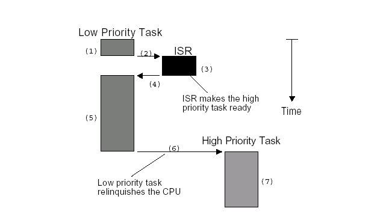

***Linux用户抢占和内核抢占详解(概念, 实现和触发时机)***

- 1 非抢占式内核与可抢占式内核
    - 1.1 非抢占式内核
    - 1.2 抢占式内核
- 2 Linux用户抢占
    - 2.1 Linux用户抢占
    - 2.2 need_resched标识
    - 2.3 用户抢占的发生时机（什么时候需要重新调度need_resched）
- 3 Linux内核抢占
    - 3.1 内核抢占的概念
    - 3.2 为什么Linux需要内核抢占
    - 3.3 内核抢占的发生时机
- 4 内核抢占的实现
    - 4.1 内核如何跟踪它能否被抢占？
    - 4.2 内核如何知道是否需要抢占？
        - 4.2.1 重新启用内核抢占时使用preempt_schedule检查抢占
        - 4.2.2 中断之后返回内核态时通过preempt_schedule_irq触发
        - 4.2.3 PREEMPT_ACTIVE标识位和PREEMPT_DISABLE_OFFSET
- 5 总结
    - 5.1 用户抢占
    - 5.2 内核抢占

# 1. 非抢占式内核与可抢占式内核

为了简化问题，我们使用嵌入式实时操作系统uC/OS作为例子，首先要指出的是uC/OS只有内核态，没有用户态，这和Linux不一样。

多任务系统中，内核负责管理各个人物，或者说为每个任务分配CPU时间，并且负责任务之间的通信。

内核提供的基本服务时任务切换即调度（Scheduler），还有一个单词叫Dispatcher也是调度的意思。

这是内核的主要职责之一，就是要决定该轮到那个任务运行了。多数实时内核时基于优先级调度算法的，每个任务根据其重要程度的不同被赋予一定的优先级，基于优先级的调度算法指，CPU总是让处于就绪态的优先级最高的任务先运行。然而，究竟何时让高优先级任务掌握CPU的使用权，有两种不同的情况，这要看用的是什么类型的内核，是可剥夺型还是不可剥夺型内核。

## 1.1 非抢占式内核

非抢占内核时由任务主动放弃CPU的使用权。

非抢占式调度也称做合作性多任务，各个任务彼此合作共享一个CPU。异步时间还是由中断服务来处理，中断服务可以使一个高优先级的任务由挂起状态变为就绪状态。

但中断服务以后控制权还是回到原来被中断的那个任务，知道该任务主动放弃CPU的使用权时，哪个高优先级的任务才能获得CPU的使用权。非抢占式内核如下图所示：



非抢占式内核的优点有：
- 中断响应快（与抢占式内核相比）
- 允许使用不可重入函数
- 几乎不需要使用信号量保护共享数据，运行的任务占有CPU，不必担心被别的任务抢占。这也不是绝对的，在打印机使用上，扔需要满足互斥条件。

非抢占式内核的缺点有：
- 任务响应时间慢：高优先级的任务已经进入就绪态，但还不能运行，要等到当前运行着的任务释放CPU。
- 任务响应时间不确定：不知道什么时候最高优先级的任务才能拿到CPU的控制权，完全取决于应用程序什么时候释放CPU。

## 1.2 抢占式内核

使用抢占式内核可以保证系统响应时间。最高优先级的任务一旦就绪，总能得到CPU的使用权。
当一个运行着任务使一个比它优先级高的任务进入了就绪态，当前任务的CPU使用权就会被剥夺，或者说被挂起了，
哪个高优先级的任务立刻得到了CPU的控制权。

如果是中断服务程序使一个高优先级的任务进入就绪态，中断完成时，中断了的任务被挂起，优先级高的哪个任务开始运行。

抢占式内核如下图所示：


抢占式内核的优点有：
- 任务响应快：最高优先级的任务什么时候可以执行，可以得到CPU的使用权是可知的。

抢占式内核的缺点有：
- 不能直接使用不可重入型函数。调用不可重入函数时，要满足互斥条件，这点可以使用互斥型信号量来实现。如果调用不可重入型函数时，低优先级的任务CPU的使用权被高优先级任务剥夺，不可重入型函数中的数据有可能被破坏。

# 2. Linux用户抢占

## 2.1 Linux用户抢占

当内核即将返回用户空间时，内核会检查need\_resched是否设置，如果设置，则调用schedule()，此时，发生用户抢占。

## 2.2 need_resched标识

内核如何检查一个进程是否需要被调度呢？

内核在即将返回用户空间时金叉进程是否需要重新调度，如果设置了，就会发生调度，这被称为用户抢占，因此内核在thread\_info的flag中设置了一个标识来标志进程是否需要重新调度，即重新调度need\_resched标识TIF\_NEED\_RESCHED。

并提供了一些设置可检测的函数：

函数 | 描述
---|---
set\_tsk\_need\_resched | 	设置指定进程中的need_resched标志 
clear\_tsk\_need\_resched | 清除指定进程中的need_resched标志 
test\_tsk\_need\_resched | 检查指定进程need_resched标志

而内核中调度时常用的need\_resched()函数检查进程是否需要被重新调度，其实就是通过test\_tsk\_need\_resched实现的，其定义如下所示：
```c
static inline int test_tsk_need_resched(struct task_struct *tsk)
{
    return unlikely(test_tsk_thread_flag(tsk,TIF_NEED_RESCHED));
}
```

## 2.3 用户抢占的发生时机（什么时候需要重新调度need_resched）

一般来说，用户抢占发生下列情况：
- 从系统调用返回用户空间
- 从中断（异常）处理程序返回用户空间

从这里我们可以看到，用户抢占时发生在用户空间的抢占现象。

更详细的触发条件如下所示，其实不外乎就是前面说的两种情况：
1. 时钟中断处理例程：检查当前任务的时间片，当前任务的时间片耗完时，scheduler\_tick()函数就会设置need\_resched标志。
2. 信号量、等待队列、完成量等机制唤醒都是基于waitqueue的，而waitqueue的唤醒函数为default\_wake\_function，其调用try\_to\_wake\_up将被唤醒的任务更改为就绪状态并设置need\_resched标志。
3. 设置用户进程的nice值时，可能会使高优先级的任务进入就绪状态
4. 改变任务的优先级时，可能会使高优先级的任务进入就绪状态
5. 新建一个任务时，可能会使高优先级的任务进入就绪状态
6. 对CPU（SMP）进行负载均衡时，当前任务可能需要放到另外一个CPU上运行

# 3. Linux内核抢占

## 3.1 内核抢占的概念

比对用户抢占，顾名思义，内核抢占就是指一个在内核态运行的进程，可能再执行内核函数期间被另一个进程取代。

## 3.2 为什么Linux需要内核抢占

Linux系统中，进程在系统调用后返回用户态之前，或者内核在某些特定的点上，都会调用调度器。这确保了除了一些明确指定的情况之外，内核时无法被中断的，这不同于用户进程。

如果内核处于相对耗时的操作中，比如文件系统、内存管理相关的任务，这种行为可能会带来问题。这种情况下，内核代替指定的进程执行相当长的时间，而其他进程无法执行，无法调度，这就造成了系统的延迟增加，用户体验到缓慢的相应。比如，多媒体应用长时间无法得到CPU，则发生视频和音频漏失的现象。

在编译内核时，如果开启了内核抢占的支持，则可以解决这些问题。如果高优先级进程有事情需要完成，那么在启用了内核抢占的情况，不仅用户空间的应用程序被中断，内核也可以被中断。

内核抢占和用户进程被其他进程抢占时两个不同的概念，内核抢占主要是从实时系统中引入的，在非实时系统中的确也提高了系统的响应速度，但也不是在所有情况下都是最优的。
因为，抢占也需要调度和同步开销，在某些情况下甚至关闭内核抢占，比如，主调度器完成调度的过程中是关闭了内核抢占的。

内核不能在任意点被中断，幸运的是，大多数不能中断的点已经被SMP实现标识出来了。并且在实现内核抢占时可以重用这些信息。如果内核可以被抢占，那么单处理器系统也会像一个SMP系统。

## 3.3 内核抢占的发生时机

要满足什么条件，kernel才可以抢占内核态呢？
- 没持有锁：锁是用户保护临界区的，不能被抢占。
- kernel code可重入（reentrant）：因为Kernel是SMP-safe的，所以满足可重入性。

内核抢占发生的时机，一般发生于：
1. 当从中断处理程序正在执行，且返回内核空间之前。当一个中断处理例程退出，在返回内核态时。这是隐式地调用schedule()函数，当前任务没有主动放弃CPU使用权，而是被剥夺了CPU使用权。
2. 当内核代码再一次具有可抢占性的时候，如解锁（spin\_unlock\_bh）及使能软中断（local\_bh\_enable）等，此时kernel code从不可抢占状态变为可抢占状态时。也就是preempt\_count从正数变为0时。这也是隐式地调用schedule()函数。
3. 如果内核中的任务显示调用schedule()，任务主动放弃CPU使用权
4. 如果内核中的任务阻塞（这同样也会导致调用schedule()），导致需要调用schedule()函数。任务主动放弃CPU使用权。

内核抢占，并不是在任何一个地方都可以发生，以下情况不能发生：
1. 内核正在进行中断处理。在Linux内核中进程不能抢占中断（中断只能被其他高优先级的中断中断、抢占，进程不能中断、抢占中断），在中断例程中不允许进行进程调度。进程调度函数schedule()会对此作出判断，如果在中断上下文中调用，会打印错误信息。
2. 内核正在进行中断上下文的Bottom Half（中断下半部，即SoftIRQ）处理。硬件中断返回前会执行SoftIRQ，此时仍然处于中断上下文。如果此时正在执行其他SoftIRQ，则不在执行该SoftIRQ。
3. 内核的代码段正持有spinlock自旋锁、wirtelock/readlock读写锁等所，处于这些锁的保护状态中。内核中的这些锁是为了在SMP系统中短时间保证不同CPU上运行的进程并发执行的正确性。当持有这些锁时，内核不应该被抢占。
4. 内核正在执行调度程序scheduler。抢占的原因就是为了进行新的调度，没有理由将调度程序抢占掉再运行调度程序。
5. 内核正在对每个CPU“私有”的数据结构操作（Per-CPU Data Structures）。在SMP中，对于per-CPU数据结构未使用spinlock保护，因为这些数据结构隐含地被保护了（不同的CPU有不一样的Per-CPU数据，其他CPU上运行的进程不会用到另一个CPU的Per-CPU数据）。但是如果允许抢占，一旦进程被抢占后重新调度，有可能调度到其他的CPU上去，这是定义的Per-CPU变量就会有问题，这是应禁止抢占。

# 4. 内核抢占的实现

## 4.1 内核如何跟踪它能否被抢占？

前面我们提到了，系统中每个进程都有一个特定于体系结构的struct thread\_info结构，用户层程序被调度的时候会检查struct thread\_info中的need\_resched标识TIL\_NEED\_RESCHED标志来检查自己是否需要被重新调度。

自然内核抢占也可以应用同样的方法实现。Linux内核在thread\_info结构中添加了一个自旋锁标识preempt\_count，称为抢占计数器（preemption counter）。
```c
struct thread_info
{
	......
	
	int preempt_count;	 /* 0 => preemptable, <0 => BUG */
	
    ......
}
```

preempt\_count值 | 描述
---|---
大于0| 禁止内核抢占，其值标记了使用preempt\_count临界区的数目
等于0| 开启内核抢占
小于0| 所为负值，内核出现错误

内核自然也提供了一些函数或者宏，用来开启、关闭以及检测抢占计数器preempt\_count的值，
这些通用的函数定义在include/asm-generic/preempt.h，而某些体系结构定义了自己的接口，
比如x86架构定义在arch/x86/include/asm/preempt.h。

函数 | 描述
---|:---
preempt\_count | 获取当前current进程抢占计数器的值
preempt\_count\_ptr | 返回指向当前current进程的抢占计数器的指针
preempt\_count\_set | 重设当前current进程的抢占计数器
init\_task\_preempt\_count | 初始化task的抢占计数器为FORK\_PREEMPT\_COUNT
init\_idle\_preempt\_count | 初始化task的抢占计数器为PREEMPT\_ENABLED
preempt\_count\_add | 将增加current的抢占计数器增加val
preempt\_count\_sub | 将增加current的抢占计数器减少val
preempt\_count\_dec\_and\_test | 将current的抢占计数器减少1，然后看是否可以进程内核抢占，</br>即检查抢占计数器是否为0（允许抢占），同时检查tif\_need\_resched标识是否为真
preempt\_count\_inc | current的抢占计数器增加1
preempt\_count\_dec | current的抢占计数器减少1

还有其他函数可用于开启和关闭内核抢占：

函数 | 描述
---|---
preempt\_disable | 通过preempt\_count\_inc来停用内核抢占，</br>并且通过屏障barrier同步来避免编译器的优化。
preempt\_enable	| preempt\_count\_dec\_and\_test启用内核抢占，</br>然后通过\_\_preempt\_schedule检测是够有必要进行调度。
preempt\_enable\_no\_resched | 开启抢占，但是不进行重调度。
preempt\_check\_resched	| 调用\_\_preempt\_schedule检测是够有必要进行调度
should\_resched	| 检查current的抢占计数器是否为参数preempt\_offset的值，</br>同时检查tif\_need\_resched是否为真。
preemptible | 检查是否可以内核抢占，检查抢占计数器是否为0，以及是否停用了中断。

## 4.2 内核如何知道是否需要抢占？

首先必须设置了TIL\_NEED\_RESCHED标识来通知内核由进程在等待得到CPU时间，然后会判断抢占计数器preempt\_count是否为0，这个工作往往通过preempt\_check\_resched或者其相关来实现。

### 4.2.1 重新启用内核抢占时使用preempt_schedule检查抢占

在内核停用抢占后重新启用时，检测是否有进程打算抢占当前执行的内核代码，是一个比较好的时机，如果是这样，应该尽快完成，则无需等待下一次对调度器的例行调用。

抢占机制中主要的函数是preempt\_schedule，设置了TIF\_NEED\_RESCHED标志并不能保证可以抢占内核，内核可能处于临界区，不被干扰。

```c
/*
 * this is the entry point to schedule() from in-kernel preemption
 * off of preempt_enable. Kernel preemptions off return from interrupt
 * occur there and call schedule directly.
 */
asmlinkage __visible void __sched notrace preempt_schedule(void)
{
    /*
     * If there is a non-zero preempt_count or interrupts are disabled,
     * we do not want to preempt the current task. Just return..
     */
     /* !preemptible() => preempt_count() != 0 || irqs_disabled()
      *	如果抢占计数器大于0, 那么抢占被停用, 该函数立即返回
      * 如果
     */
    if (likely(!preemptible())) 
        return;

    preempt_schedule_common();
}

#define preemptible()   (preempt_count() == 0 && !irqs_disabled())
```

> !preemptible => preempt_count() != 0 || irqs_disabled()表明：
> 1. 如果抢占计数器大于0，那么抢占仍然是被停用的，因此内核不能被打断，该函数立即结束。
> 2. 如果在某些重要的点上内核停用了硬件中断，以保证一次性完成相关的处理，那么抢占也是不可能的。irqs_disable会检查是否停用了中断。如果已经停用，则内核不能被抢占。

接着如果可以被抢占，则执行如下步骤：
```c
static void __sched notrace preempt_schedule_common(void)
{
    do {
    	/*
        preempt_disable_notrace等待于__preempt_count_inc(); 增加抢占计数器
        */
        preempt_disable_notrace();
        
        /*  完成一次调度  */
        __schedule(true);

        /*
        preempt_enable_no_resched_notrace等价于__preempt_count_dec; 减少抢占计数器
        */
        preempt_enable_no_resched_notrace();

        /*
         * Check again in case we missed a preemption opportunity
         * between schedule and now.
         * 再次检查, 以免在__scheudle和当前点之间错过了抢占的时机
         */
    } while (need_resched());
}
```
我们可以看到，内核在增加了抢占计数器的计数后，用\_\_schedule进行了一次调度，参数传入preempt=true，表明调度不是以普通方式引发的，而是由于内核抢占。

在内核重新调度后，代码流程回到当前进程，那么就将抢占计数减少1。

### 4.2.2 中断之后返回内核态时通过preempt_schedule_irq触发

上面preempt\_schedule只是触发内核抢占的一种方法，另外一种激活抢占的方式是在处理了一个硬件中断请求之后。

如果处理器处理中断请求后返回内核态（返回用户态则没有影响），特定体系结构的汇编例程会检查抢占计数器是否为0值，即是否允许抢占，以及是否设置了重调度标识，类似于preempt\_schedule的处理。
如果两个条件都满足，则通过preempt\_schedule\_irq调用调度器，此时表明抢占请求发自中断上下文。

该函数与preempt\_schedule的本质区别在于：preempt\_schedule\_irq调用时停用了中断，防止中断造成的递归调用，其定义在kernel/sched/core.c中：
```c
/*
 * this is the entry point to schedule() from kernel preemption
 * off of irq context.
 * Note, that this is called and return with irqs disabled. This will
 * protect us against recursive calling from irq.
 */
asmlinkage __visible void __sched preempt_schedule_irq(void)
{
    enum ctx_state prev_state;

    /* Catch callers which need to be fixed */
    BUG_ON(preempt_count() || !irqs_disabled());

    prev_state = exception_enter();

    do {
        preempt_disable();
        local_irq_enable();
        __schedule(true);
        local_irq_disable();
        sched_preempt_enable_no_resched();
    } while (need_resched());

    exception_exit(prev_state);
}
```

### 4.2.3 PREEMPT_ACTIVE标识位和PREEMPT_DISABLE_OFFSET

之前的内核版本中，抢占计数器中定义了一个标志位PREEMPT\_ACTVIE，这个位被设置后即标识了可以进行内核抢占，使得preempt\_count有一个很大的值，这样就不受普通的抢占计数器加1操作的影响了。

> PREEMPT\_ACTIVE的进入，参见《[PATCH] PREEMPT_ACTIVE: add default defines》

```c
#define PREEMPT_ACTIVE_BITS     1
#define PREEMPT_ACTIVE_SHIFT    (NMI_SHIFT + NMI_BITS)
#define PREEMPT_ACTIVE  (__IRQ_MASK(PREEMPT_ACTIVE_BITS) << PREEMPT_ACTIVE_SHIFT)
```
然后也为其提供了一些置位的函数，其实就是将preempt\_count加上或者减去一个很大的数，参见 《preempt: Disable preemption from preempt_schedule*() callers》

# 5. 总结

一般来说，CPU在任何时刻都属于以下三种情况之一：
1. 运行与用户空间，执行用户进程
2. 运行与内核空间，处于进程上下文
3. 运行与内核空间，处于中断上下文

## 5.1 用户抢占

一般来说，当进程从系统调用或者从中断（异常）处理程序返回用户空间时会触发主调度器进行用户抢占。
- 从系统调用返回用户空间
- 从中断（异常）处理程序返回用户空间

为了对一个进程需要被调度进行标记，内核在thrad\_info的flag中设置了一个标识来标志进程是否需要重新调度，
即重新调度need\_resched标识TIF\_NEED\_RESCHED，内核在即将返回用户空间时，会检查TIF\_NEED\_RESCHED标志进程是否需要重新调度，如果设置了，就会发生调度，这被称为用户抢占。

## 5.2 内核抢占

如果内核处于相对耗时的操作中，比如文件系统、内存管理的相关任务，这种行为可能会带来问题。
这种情况下，内核代替特定的进程执行相当长时间，而其他进程无法执行，无法调度，这就造成了系统的延迟增加，用户体验到缓慢的相应。因此，Linux内核引入了内核抢占。

Linux内核通过在thread\_info中添加了一个自旋锁标识preempt\_count，称为抢占计数器（preemption counter）来作为内核抢占标记。

内核抢占的触发大致也是两类，即内核抢占关闭重新开始时、中断返回内核态时。
- 内核重新开启内核抢占时：使用preempt\_schedule检查内核抢占
- 中断之后返回内核态时：使用preempt\_schedule\_irq触发内核抢占

而内核抢占时，通过调用\_\_schedule(true)传入的preempt=true来通知内核，这是一个内核抢占。