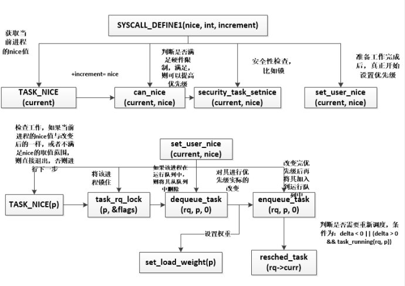

***Linux进程优先级的处理***

- 1 Linux优先级的表示
    - 1.1 优先级的内核表示
        - 1.1.1 Linux优先级概述
        - 1.1.2 内核的优先级表示
        - 1.1.3 EDF实时调度算法的优先级描述
    - 1.2 进程的优先级表示
        - 1.2.1 动态优先级/静态优先级/实时优先级
- 2 进程优先级的计算
    - 2.1 noarmal_prio()设置普通优先级normal_prio
        - 2.1.1 辅助函数task_has_dl_policy和task_has_rt_policy
        - 2.1.2 关于rt_priority数值越大，实时进程优先级越高的问题
        - 2.1.3 为什么需要__normal_prio函数
    - 2.2 effective_prio设置动态优先级prio
        - 2.2.1 为什么effective_prio使用优先级数值检测实时进程
    - 2.3 设置prio的时机
    - 2.4 nice系统调用的实现
    - 2.5 fork时优先级的继承
- 3 总结

# 1. Linux优先级的表示

## 1.1 优先级的内核表示

### 1.1.1 Linux优先级概述

在用户空间通过nice命令设置进程的静态优先级，这在内部会调用nice系统调用，进程的nice值在`-20 ~ +19`之间（user space），值越低优先级越高。

setpriority系统调用也可以用来设置进程的优先级。它不仅能够修改单个线程的优先级，还能修改进程组中所有进程的优先级，以及通过指定UID来修改特定用户的所有进程的优先级。

内核使用简单的数值范围`0 ~ 139`表示内部优先级（kernel space），数值越低，优先级越高。
- `0 ~ 99`的范围专门提供给实时进程使用
- nice的值`-20 ~ +19`则映射到范围`100 ~ 139`用于普通进程

内核里面priority的范围：

优先级范围 | 内核宏 | 描述
---|---|---
0 ~ 99 | 0 ~ (MAX\_RT\_PRIO - 1) | 实时进程
100 ~ 139 | MAX\_RT\_PRIO ~ (MAX\_PRIO - 1) | 普通进程

### 1.1.2 内核的优先级表示

内核表示优先级的所有信息都基本放在include/linux/sched/prio.h中，其中定义了一些表示优先级的宏和函数。

优先级数值通过宏来定义，如下所示：
```c
#define MAX_NICE        19
#define MIN_NICE        -20
#define NICE_WIDTH      (MAX_NICE - MIN_NICE + 1)

#define MAX_PRIO        (MAX_RT_PRIO + 40)
#define DEFAULT_PRIO        (MAX_RT_PRIO + 20)
```

- MIN\_NICE定义了nice的最小值；MIN\_MAX定义了nice的最大值。
- MAX\_PRIO定义了普通进程最大优先级数值
- MAX\_RT\_PRIO定义了实时进程最大优先级数值

宏 | 值 | 描述
---|---|---
MIN\_NICE | -20 | 对应于优先级100，可以使用NICE\_TO\_PRIO和PRIO\_TO\_NICE转换
MAX\_NICE | 19 | 对应于优先级139，可以使用NICE\_TO\_PRIO和PRIO\_TO\_NICE转换
NICE\_WIDTH | 40 | nice值的范围宽度，即-20 ~ 19共有40个数字的宽度
MAX\_RT\_PRIO</br>MAX\_USER\_RT\_PRIO | 100 | 实时进程的最大优先级
MAX\_PRIO | 140 | 普通进程的最大优先级
DEFAULT\_PRIO | 120 | 进程的默认优先级，对应于nice=0。
MAX\_DL\_PRIO | 0 | 使用EDF最早截止时间优先调度算法的实时进程最大的优先级

而内核提供了一组宏将优先级在各种不同的表示形态之间转移：
```c
/*
 * Convert user-nice values [ -20 ... 0 ... 19 ]
 * to static priority [ MAX_RT_PRIO..MAX_PRIO-1 ],
 * and back.
 */
#define NICE_TO_PRIO(nice)      ((nice) + DEFAULT_PRIO)
#define PRIO_TO_NICE(prio)      ((prio) - DEFAULT_PRIO)

/*
 * 'User priority' is the nice value converted to something we
 * can work with better when scaling various scheduler parameters,
 * it's a [ 0 ... 39 ] range.
 */
#define USER_PRIO(p)            ((p)-MAX_RT_PRIO)
#define TASK_USER_PRIO(p)       USER_PRIO((p)->static_prio)
#define MAX_USER_PRIO           (USER_PRIO(MAX_PRIO))
```
还有一些nice值和rlimit值之间转换的函数nice\_to\_rlimit和rlimit\_tonice，这在nice系统调用进行检查的时候很有用，它们定义在include/linux/sched/prio.h中，如下所示：
```c
/*
 * Convert nice value [19,-20] to rlimit style value [1,40].
 */
static inline long nice_to_rlimit(long nice)
{
    return (MAX_NICE - nice + 1);
}

/*
 * Convert rlimit style value [1,40] to nice value [-20, 19].
 */
static inline long rlimit_to_nice(long prio)
{
    return (MAX_NICE - prio + 1);
}
```

### 1.1.3 EDF实时调度算法的优先级描述

新版本的内核进入了EDF实时调度算法，它的优先级比实时进程和普通进程的优先级都要高，关于EDF的优先级的设置信息都在内核头文件include/linux/sched/deadline.h中。

因此，内核将MAX\_DL\_PRIO设置为0：
```c
#define  MAX_DL_PRIO  0
```
此外也提供了一些EDF优先级处理所需要的函数，如下所示：
```c
static inline int dl_prio(int prio)
{
    if (unlikely(prio < MAX_DL_PRIO))
            return 1;
    return 0;
}

static inline int dl_task(struct task_struct *p)
{
    return dl_prio(p->prio);
}

static inline bool dl_time_before(u64 a, u64 b)
{
    return (s64)(a - b) < 0;
}
```

## 1.2 进程的优先级表示

```c
struct task_struct
{
    /* 进程优先级
     * prio: 动态优先级，范围为100~139，与静态优先级和补偿(bonus)有关
     * static_prio: 静态优先级，static_prio = 100 + nice + 20 (nice值为-20~19,所以static_prio值为100~139)
     * normal_prio: 没有受优先级继承影响的常规优先级，具体见normal_prio函数，跟属于什么类型的进程有关
     */
    int prio, static_prio, normal_prio;
    /* 实时进程优先级 */
    unsigned int rt_priority;
}
```

### 1.2.1 动态优先级/静态优先级/实时优先级

其中task\_struct采用了三个成员表示进程的优先级：
- prio和normal\_prio表示动态优先级
- static\_prio表示静态优先级

> 为什么表示动态优先级需要两个值，即prio和normal_prio
>
> 调度器会考虑的优先级则保存在prio。由于在某些情况下内核需要暂时提高进程的优先级，因此，需要用prio表示，由于这些改变不是持久的，因此静态优先级static_prio和普通优先级normal_prio不受影响。

此外，还用了一个字段rt\_prioity保存了实时进程的优先级：

字段 | 描述
---|:---
static\_prio | 用于保存静态优先级，是进程启动时分配的优先级。</br>可以通过nice、sched\_setscheduler系统调用来进行修改，否则在进行运行期间会一直保持恒定。
prio | 保存进程的动态优先级
normal\_prio | 表示基于进程的静态优先级static\_prio和调度策略计算出的优先级。</br>因此即使普通进程和实时进程具有相同的静态优先级，其mormal\_prio优先级也是不同的。</br>进程在fork时，子进程会集成父进程的普通优先级。
rt\_priority | 保存进程的实时优先级

# 2. 进程优先级的计算

前面说了task\_struct中的几个优先级字段：

静态优先级 | 普通优先级 | 动态优先级 | 实时优先级
---|---|---|---
static\_prio | normal\_prio | prio | rt\_priority

但是这些优先级是如何关联的呢？

动态优先级prio又是如何计算的呢？

## 2.1 noarmal_prio()设置普通优先级normal_prio

- 普通进程：静态优先级static\_prio是计算的起点。
- 实时进程：实时优先级rt\_priority是计算的起点。

因此它们也是进程创建的时候设定好的，我们通过nice修改的就是普通进程的静态优先级static\_prio。

首先，通过静态优先级static\_prio计算出普通优先级normal\_prio，该工作可以由normal\_prio来完成，该函数定义在kernel/sched/core.c中：
```c
/*
 * __normal_prio - return the priority that is based on the static prio
 * 普通进程(非实时进程)的普通优先级normal_prio就是静态优先级static_prio
 */
static inline int __normal_prio(struct task_struct *p)
{
    return p->static_prio;
}

/*
 * Calculate the expected normal priority: i.e. priority
 * without taking RT-inheritance into account. Might be
 * boosted by interactivity modifiers. Changes upon fork,
 * setprio syscalls, and whenever the interactivity
 * estimator recalculates.
 */
static inline int normal_prio(struct task_struct *p)
{
    int prio;

    if (task_has_dl_policy(p))		/*  EDF调度的实时进程  */
            prio = MAX_DL_PRIO-1;
    else if (task_has_rt_policy(p))	/*  普通实时进程的优先级  */
            prio = MAX_RT_PRIO-1 - p->rt_priority;
    else							/*  普通进程的优先级  */
            prio = __normal_prio(p);
    return prio;
}
```

进程类型 | 调度器 | normal\_prio
---|---|---
EDF实时进程 | EDF | MAX\_DL\_PRIO - 1 = -1
实时进程 | RT | MAX\_RT\_PRIO - 1 - p->rt\_priority = 99 - rt\_priority
普通进程 | CFS | \_\_normal\_prio(p) = static\_prio

普通优先级normal\_prio需要根据普通进程和实时进程进行不同的计算：
- 普通进程：直接将普通优先级normal\_prio设置为静态优先级static\_prio。
- 实时进程：依据实是优先级rt\_priority。

### 2.1.1 辅助函数task_has_dl_policy和task_has_rt_policy

这些函数定义在kernel/sched/sched.h中，其本质就是传入task->policy调度策略字段，查看其值等于SCHED\_NORMAL、SCHED\_BATCH、SCHED\_IDLE、SCHED\_FIFO、SCHED\_RR、SCHED\_DEADLINE中的哪个，从而确定其所属的调度类，进一步就确定了其进程类型。

```c
static inline int idle_policy(int policy)
{
    return policy == SCHED_IDLE;
}
static inline int fair_policy(int policy)
{
    return policy == SCHED_NORMAL || policy == SCHED_BATCH;
}

static inline int rt_policy(int policy)
{
    return policy == SCHED_FIFO || policy == SCHED_RR;
}

static inline int dl_policy(int policy)
{
        return policy == SCHED_DEADLINE;
}
static inline bool valid_policy(int policy)
{
        return idle_policy(policy) || fair_policy(policy) ||
                rt_policy(policy) || dl_policy(policy);
}

static inline int task_has_rt_policy(struct task_struct *p)
{
        return rt_policy(p->policy);
}

static inline int task_has_dl_policy(struct task_struct *p)
{
        return dl_policy(p->policy);
}
```

### 2.1.2 关于rt_priority数值越大，实时进程优先级越高的问题

前面提到了数值越小，优先级越高。但是会发现rt\_priority的值越大，其普通优先级越小，从而优先级越高。

对于一个实时进程，它由两个参数表明优先级：一个是prio、另一个是rt\_priority。
- prio才是调度所用的最终优先级数值，这个值越小，优先级越高；
- rt\_priority被称作实时进程优先级，prio要经过转换——`prio = MAX_RT_PRIO -1 - p->rt_priority`，MAX\_RT\_PRIO = 100，这样意味着rt\_priority的值越大，优先级越高。

而内核提供了修改优先级的函数，是修改rt\_priority的值，所以越大，优先级越高。所以，用户在使用实时进程或线程，在修改优先级时，就会优先级越大，优先级越高。

### 2.1.3 为什么需要__normal_prio函数

我们肯定会器官，为什么增加了一个\_\_normal\_prio函数做了这么简单的工作，这个其实是有历史原因的，在早期的O(1)调度器中，普通优先级的计算涉及相当多技巧性地工作，必须检测交互式进程并提高其优先级，而必须“惩戒”非交互式进程，以便系统获得更好的交互体验，这需要很多启发式的计算，它们可能完成的很好，也可能不工作。

### 2.2 effective_prio设置动态优先级prio

可以通过函数effective\_prio()用静态优先级static\_prio计算动态优先级prio，即：
```c
    p->prio = effective_prio(p);
```
该函数定义在kernel/sched/core.c中：
```c
/*
 * Calculate the current priority, i.e. the priority
 * taken into account by the scheduler. This value might
 * be boosted by RT tasks, or might be boosted by
 * interactivity modifiers. Will be RT if the task got
 * RT-boosted. If not then it returns p->normal_prio.
 */
static int effective_prio(struct task_struct *p)
{
    p->normal_prio = normal_prio(p);
    /*
     * If we are RT tasks or we were boosted to RT priority,
     * keep the priority unchanged. Otherwise, update priority
     * to the normal priority:
     */
    if (!rt_prio(p->prio))
            return p->normal_prio;
    return p->prio;
}
```
我们会发现，函数首先effective\_prio设置了普通优先级，显然我们用effective\_prio同时设置了两个优先级（普通优先级normal\_prio和动态优先级prio）。

因此，计算动态优先级的流程如下：
- 设置进程的普通优先级（实时进程99 - rt\_priority，普通进程为static\_prio）
- 计算进程的动态优先级（实时进程则维持动态优先级的prio不变，普通进程的动态优先级即其normal\_prio）

最后，我们综述一下在针对不同类型进程的计算结果：

进程类型 | 实时优先级</br>rt\_priority | 静态优先级</br>static\_prio | 普通优先级</br>normal\_prio | 动态优先级</br>prio
---|---|---|---|---
EDF调度的实时进程 | rt\_priority | 不使用 | MAX\_DL\_PRIO -1 | 维持原prio不变
RT调度的实时进程 | rt\_priority | 不使用 | MAX\_RT\_PRIO -1 - rt\_priority | 维持原prio不变
普通进程 | 不使用 | static\_prio | static\_prio | static\_prio
优先级提高的普通进程 | 不使用 | static\_prio（改变） | static\_prio | 维持原prio不变

### 2.2.1 为什么effective_prio使用优先级数值检测实时进程

rt\_prio()会检测普通优先级是否在实时范围内，即是否小于MAX\_RT\_PRIO，参见include/linux/sched/rt.h。
```c
static inline int rt_prio(int prio)
{
	if (unlikely(prio < MAX_RT_PRIO))
    	return 1;
	return 0;
}
```
而前面我们在normal\_prio的时候，则通过task\_has\_rt\_policy来判断其policy属性来确定：
```c
    policy == SCHED_FIFO || policy == SCHED_RR;
```
那么为什么effective\_prio重检测实时进程是rt\_prio基于优先级，而非task\_hash\_rt\_policy或者rt\_poilicy？

对于临时提高至实时优先级的非实时进程（临时提高到实时优先级）来说，这个是必要的，这种情况可能发生在那个实时互斥量（RT-Mutex）时。

## 2.3 设置prio的时机

- 在新进程用wake\_up\_new\_task唤醒时，或者使用nice系统调用改变其静态优先级时，则会通过effective\_prio的方法设置p->prio。
- 进程创建时copy\_process通过调用sched\_fork来初始化和设置调度器的过程中会设置子进程的优先级。

> wake\_up\_new\_task()，计算此进程的优先级和其他调度参数，将新的进程加入到进程调度队列并设此进程为可被调度的，以后这个进程可以被进程调度模块调度执行。

## 2.4 nice系统调用的实现

nice系统调用时内核实现的sys\_nice，其定义在kernel/sched/core.c，它通过一些列检查后，通过set\_user\_nice函数。

sys\_nice()执行过程，如下图所示（从上到下是调用过程，从左到到右是顺序过程）：



## 2.5 fork时优先级的继承

在进程fork时，子进程的静态优先级继承自父进程。子进程的动态优先级p->prio则被设置为父进程的普通优先级，这确保互斥量（RT-Mutex）引起的优先级提高不会传递到子进程。

可以参考sched\_fork函数，在进程复制的过程中copy\_process通过调用sched\_fork来设置子进程优先级，参见sched\_fork函数：
```c
/*
 * fork()/clone()-time setup:
 */
int sched_fork(unsigned long clone_flags, struct task_struct *p)
{
	/*	......	*/
    /*
     * Make sure we do not leak PI boosting priority to the child.
     * 子进程的动态优先级被设置为父进程普通优先级 
     */
    p->prio = current->normal_prio;

    /*
     * Revert to default priority/policy on fork if requested.
     * sched_reset_on_fork标识用于判断是否恢复默认的优先级或调度策略

     */
    if (unlikely(p->sched_reset_on_fork))  /*  如果要恢复默认的调度策略, 即SCHED_NORMAL  */
    {
    	/*   首先是设置静态优先级static_prio
         *	 由于要恢复默认的调度策略
         *	 对于父进程是实时进程的情况, 静态优先级就设置为DEFAULT_PRIO
         *
         *	 对于父进程是非实时进程的情况, 要保证子进程优先级不小于DEFAULT_PRIO
         *	 父进程nice < 0即static_prio < 的重新设置为DEFAULT_PRIO的重新设置为DEFAULT_PRIO
         *	 父进程nice > 0的时候, 则什么也没做
         *	 */
        if (task_has_dl_policy(p) || task_has_rt_policy(p))
        {
            p->policy = SCHED_NORMAL;			/*  普通进程调度策略  */
            p->static_prio = NICE_TO_PRIO(0);	/*  静态优先级为nice = 0 即DEFAULT_PRIO*/
            p->rt_priority = 0;								/*  实时优先级为0  */
        }
        else if (PRIO_TO_NICE(p->static_prio) < 0)  /*  */
            p->static_prio = NICE_TO_PRIO(0);	/*  */

        /*  接着就通过__normal_prio设置其普通优先级和动态优先级
          *  这里做了一个优化, 因为用sched_reset_on_fork标识设置恢复默认调度策略后
          *  创建的子进程是是SCHED_NORMAL的非实时进程
          *  因此就不需要绕一大圈用effective_prio设置normal_prio和prio了 
          *  直接用__normal_prio设置就可  */
        p->prio = p->normal_prio = __normal_prio(p); /*  设置*/

        /*  设置负荷权重  */
        set_load_weight(p);

        /*
         * We don't need the reset flag anymore after the fork. It has
         * fulfilled its duty:
         */
        p->sched_reset_on_fork = 0;
    }
	/*	......	*/
}
```

# 3. 总结

task\_struct采用了四个成员表示进程的优先级：
- prio和mormal\_prio表示进程的动态优先级
- static\_prio表示进程的静态优先级
- rt\_priority表示进程的实时优先级

字段 | 描述
---|:---
static\_prio | 用于保存静态优先级，是进程启动时分配的优先级，</br>可以通过nice和sched\_setscheduler系统调用来进行修改，</br>否则在进程运行期间会一直保持恒定。
prio | 进程的动态优先级，这个才是调度器重点考虑的进程优先级
normal\_prio | 普通进程的优先级static\_prio和调度策略计算出的优先级，</br>因此即使普通进程和实时进程具有相同的优先级，其普通优先级也是不同的。</br>进程在fork时，子进程会集成父进程的普通优先级，</br>可以通过normal\_prio来计算（非实时进程用static\_prio计算，实时进程用rt\_priority计算）。
rt\_priority | 实时进程的静态优先级

调度器会考虑的优先级保存在prio。由于在某些情况下内核需要暂时提高进程的优先级，因此需要prio表示。
由于这些改变不是持久的，因此静态优先级static\_prio和普通优先级normal\_prio不受影响。
此外，还用了一个字段rt\_priority保存了实时进程的优先级。
静态优先级static\_prio（普通进程）和rt\_prority（实时进程）是计算的起点，通过他们计算进程的普通优先级normal\_prio和动态优先级prio。
- 内核通过normal\_prio函数：计算普通优先级normal\_prio
- 内核通过effective\_prio函数：计算动态优先级prio

