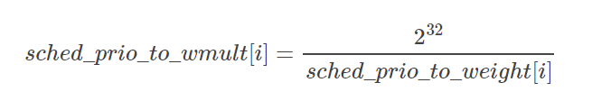
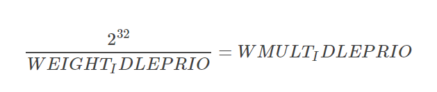

***Linux CFS调度器之负荷权重load_weight***

- 1 负荷权重
    - 1.1 负荷权重结构struct load_weight
    - 1.2 调度实体的负荷权重load
    - 1.3 进程的负荷权重
- 2 优先级和权重的转换
    - 2.1 优先级->权重转换表
    - 2.2 Linux 4.4之前的sched_prio_to_weigh和sched_prio_to_wmult
    - 2.3 1.25的乘积因子
- 3 进程负荷权重的计算
    - 3.1 set_load_weight依据静态优先级设置进程的负荷权重
    - 3.2 scale_load取得负荷权重的值
    - 3.3 set_load_weight的演变
- 4 就绪队列的负荷权重
    - 4.1 CFS就绪队列的负荷权重
    - 4.2 就绪队列的负荷权重计算
- 5 总结

# 1. 负荷权重

Linux内核使用CFS是来调度我们最常见的普通进程，其所属调度器类为fair\_sched\_class，使用的调度策略包括SCHED\_NORMAL和SCHED\_BATCH， 进程task\_struct中struct sched\_entity se；字段标识的就是CFS调度器类的调度实体。

我们了解到linux针对普通进程和实时进程分别使用静态优先级static\_prio和实时优先级rt\_priority来指定其默认的优先级别， 然后通过normal\_prio函数将它们分别转换为普通优先级normal\_prio, 最终换算出动态优先级prio, 动态优先级prio才是内核调度时候有限考虑的优先级字段。

但是CFS完全公平调度器在调度进程的时候，进程的重要性不仅是由优先级指定的，而且还需要考虑保存在task_struct->se.load的负荷权重。

## 1.1 负荷权重结构struct load\_weight

负荷权重用struct load\_weight数据结构来表示，保存着进程权重值weight。其定义在inlcude/linux/sched.h，如下所示：
```c
struct load_weight {
    /* 存储了权重的信息 */
	unsigned long weight;
	
	/* 存储了权重值用于重除的结果 weight * inv_weight = 2^32 */
	u32 inv_weight;					
};
```

## 1.2 调度实体的负荷权重load

既然struct load\_weight保存着进程的权重信息，那么作为进程调度的实体，必须将这个权重值域特定的进程task\_struct，根一般的与通用的调度实体sched\_entity先关联。

struct sched\_entity作为进程调度的实体信息，其内置了load\_weight结构用于保存当前调度实体的权重。
```c
struct sched_entity {

    /* for load-balancing */
	struct load_weight      load;
	
	/*  ......  */
};
```

## 1.3 进程的负荷权重

而进程作为一个调度的实体，其内部通过存储struct sched\_entity se而间接存储了其load\_weight信息。
```c
struct task_struct
{
	/*  ......  */
	
	struct sched_entity se;
	
    /*  ......  */
}
```
因此，我们就可以通过task\_struct->se.load获取负荷权重的信息，而set\_load\_weight负责根据进程类型及其静态优先级计算负荷权重。

# 2. 优先级和权重的转换

## 2.1 优先级->权重转换表

一般这个概念时这样的，进程每降低一个nice值，则多获得10%的CPU时间，每升高一个nice值则放弃10%的CPU时间。

为执行该策略，内核需要将优先级转换为权重值，并提供了一张优先级到权重转换表`sched_prio_to_weight`，内核不仅维护了负荷权重自身，还保存另外一个数值，用于负荷权重的结果，即sched\_prio\_to\_wmult数组，这两个数组中的数据时一一对应的。

其中相关的数据结构定义在kernel/sched/sched.h中：
```c
/*
 * To aid in avoiding the subversion of "niceness" due to uneven distribution
 * of tasks with abnormal "nice" values across CPUs the contribution that
 * each task makes to its run queue's load is weighted according to its
 * scheduling class and "nice" value. For SCHED_NORMAL tasks this is just a
 * scaled version of the new time slice allocation that they receive on time
 * slice expiry etc.
 */
 
#define WEIGHT_IDLEPRIO                3	/*  SCHED_IDLE进程的负荷权重  */
#define WMULT_IDLEPRIO         1431655765	/*  SCHED_IDLE进程负荷权重的重除值  */

extern const int sched_prio_to_weight[40];
extern const u32 sched_prio_to_wmult[40];

/*
* Nice levels are multiplicative, with a gentle 10% change for every
* nice level changed. I.e. when a CPU-bound task goes from nice 0 to
* nice 1, it will get ~10% less CPU time than another CPU-bound task
* that remained on nice 0.
*
* The "10% effect" is relative and cumulative: from _any_ nice level,
* if you go up 1 level, it's -10% CPU usage, if you go down 1 level
* it's +10% CPU usage. (to achieve that we use a multiplier of 1.25.
* If a task goes up by ~10% and another task goes down by ~10% then
* the relative distance between them is ~25%.)
*/
const int sched_prio_to_weight[40] = {
/* -20 */     88761,     71755,     56483,     46273,     36291,
/* -15 */     29154,     23254,     18705,     14949,     11916,
/* -10 */      9548,      7620,      6100,      4904,      3906,
/*  -5 */      3121,      2501,      1991,      1586,      1277,
/*   0 */      1024,       820,       655,       526,       423,
/*   5 */       335,       272,       215,       172,       137,
/*  10 */       110,        87,        70,        56,        45,
/*  15 */        36,        29,        23,        18,        15,
};

/*
* Inverse (2^32/x) values of the sched_prio_to_weight[] array, precalculated.
*
* In cases where the weight does not change often, we can use the
* precalculated inverse to speed up arithmetics by turning divisions
* into multiplications:
*/
const u32 sched_prio_to_wmult[40] = {
/* -20 */     48388,     59856,     76040,     92818,    118348,
/* -15 */    147320,    184698,    229616,    287308,    360437,
/* -10 */    449829,    563644,    704093,    875809,   1099582,
/*  -5 */   1376151,   1717300,   2157191,   2708050,   3363326,
/*   0 */   4194304,   5237765,   6557202,   8165337,  10153587,
/*   5 */  12820798,  15790321,  19976592,  24970740,  31350126,
/*  10 */  39045157,  49367440,  61356676,  76695844,  95443717,
/*  15 */ 119304647, 148102320, 186737708, 238609294, 286331153,
};
```
对内核使用的范围-20 ~ 19中的每个nice级别，sched\_prio\_to\_weight数组都有一个对应项：
```
    nice[-20, 19] ==> 下标[0, 39]
```
而由于权重`weight`用`unsigned long`表示，因此内核无法直接存储`1/weight`，而必须借助于乘法和移位来执行处罚的技术。
sched\_prio\_to\_wmult数组就是存储了这些值，即sched\_prio\_to\_wmult每个元素的值是2^32/prio\_to\_weight每个元素的值。

可以验证：



同时我们可以看到其定义了两个宏`WEIGHT_IDLEPRIO`和`WMULT_IDLEPRIO`这两个宏对应的就是SCHED\_IDLE调度进程的负荷权重信息，要保证SCHED\_IDLE进程的最低优先级和最低的负荷权重。这点信息我们可以在后面分析set\_load\_weight函数的时候可以看到。

可以验证：



## 2.2 Linux 4.4之前的sched\_prio\_to\_weigh和sched\_prio\_to\_wmult

关于优先级=>权重转变表sched\_prio\_to\_weight：在Linux 4.4之前的内核中，优先级权重转换表用prio\_to\_weight表示，定义在kernel/sched/sched.h，与它一同定义的还有prio\_to\_wmult，在kernel/sched/sched.h均被定义为static const。

但是其实这种方式不太符合规范的编码风格，因此常规来说，我们的头文件中不应该存储结构的定义，即为了使程序的模块结构更加清晰，头文件中尽量只包含宏或声明，而其具体的定义，需要分配存储空间的代码放在源文件中。

否则，如果在头文件中定义全局变量，并且将此全局变量赋值，那么在多个引用此头文件的C文件中同样存在相同变量名的拷贝，关键是此变量被赋了初值，所以编译器会将此变量放入data段，最终在链接阶段，会在data段中存在多个相同的变量，它无法将这些变量统一成一个便令，也就是仅为此变量分配一个空间，而是多分空间。
假定，这个变量在头文件没有赋初值，编译器就会将其放入bss段，连接器会对bss段的多个同名变量仅分配一个存储空间。

因此，在新的内核中，内核hacker将这两个变量存放在了kernel/sched/core.c，并加上了sched\_前缀，以表明这些变量是在进程调度过程中使用的，而在kernel/sched/sched.h中，则只包含了它们的声明。

下面列出权重转换表定义更新前后的对比：

内核版本 | 实现 | 代码位置
---|---|---
小于等于 Linux 4.4 | static const int prio\_to\_weight[40] | kernel/sched/sched.h
大于等于 Linux 4.5 | const int sched\_prio\_to\_weight[40] | 声明在kernel/sched/sched.h</br>定义在kernel/sched/core.c

其定义并没有发生变化，仍然是NICE to WEIGHT的转换表。

## 2.3 1.25的乘积因子

各数组之间的乘积因子是1.25。要知道为何使用该因子，可以考虑下面的例子：

- 两个进程A和B的nice值为0，即静态优先级120运行，因此两个进程的CPU使用份额相同，都是50%，nice值为0的进程，查其权重表可知是1024。每个进程的份额是`1024/(1024+1024) = 0.5`，即50%。
- 如果进程B的nice值+1（优先级降低），则nice=1。那么其CPU使用份额应该减少10%，换句话说，进程A得到的总的CPU使用应该是55%，而进程B应该是45%。优先级增加导致权重减少，即`1024/1.25 = 820`，而进程A仍旧是1024，则进程A现在得到的CPU使用份额是`1024/(1024+820) = 0.55`，而进程B的CPU使用份额则是`820/(1024+820) = 0.45`。这样就正好产生了10%的差值。

# 3. 进程负荷权重的计算

set\_load\_weight负责根据非实时进程类型及其静态优先级来计算负荷权重，而实时进程不需要CFS调度，因此，无须计算器负荷权重值。

## 3.1 set\_load\_weight依据静态优先级设置进程的负荷权重

```c
static void set_load_weight(struct task_struct *p)
{
	/*  由于数组中的下标是0~39, 普通进程的优先级是[100~139]
        因此通过static_prio - MAX_RT_PRIO将静态优先级转换成为数组下标
    */
    int prio = p->static_prio - MAX_RT_PRIO;
    /*  取得指向进程task负荷权重的指针load,
        下面修改load就是修改进程的负荷权重  */
    struct load_weight *load = &p->se.load;

    /*
     * SCHED_IDLE tasks get minimal weight:
     * 必须保证SCHED_IDLE进程的负荷权重最小
     * 其权重weight就是WEIGHT_IDLEPRIO
     * 而权重的重除结果就是WMULT_IDLEPRIO
     */
    if (p->policy == SCHED_IDLE) {
        load->weight = scale_load(WEIGHT_IDLEPRIO);
        load->inv_weight = WMULT_IDLEPRIO;
        return;
    }

    /*  设置进程的负荷权重weight和权重的重除值inv_weight  */
    load->weight = scale_load(prio_to_weight[prio]);
    load->inv_weight = prio_to_wmult[prio];
}
```

## 3.2 scale\_load取得负荷权重的值

其中，scale\_load是一个宏，定义在include/linux/sched.h中：
```c
#if 0 /* BITS_PER_LONG > 32 -- currently broken: it increases power usage under light load  */
# define SCHED_LOAD_RESOLUTION  10
# define scale_load(w)          ((w) << SCHED_LOAD_RESOLUTION)
# define scale_load_down(w)     ((w) >> SCHED_LOAD_RESOLUTION)
#else
# define SCHED_LOAD_RESOLUTION  0
# define scale_load(w)          (w)
# define scale_load_down(w)     (w)
#endif
```
我们可以看到目前版本的scale\_load其实什么也没做就是简单取了个值，但是我们注意到负荷权重仍然保存了SCHED\_LOAD\_RESOLUTION不为0的情形，只不过目前因为效率的原因和功耗的问题没有启用而已。

## 3.3 set\_load\_weight的演变

Linux内核的调度器经过了不同阶段的发展，但是即使是同一个调度器其算法也不是一成不变的，也在不停的改进和优化：

内核版本 | 实现
---|---
2.6.18 ~ 2.6.22 | 实时进程的权重用RTPRIO\_TO\_LOAD\_WEIGHT(p->rt\_priority)转换
2.6.23 ~ 2.6.34 | 实时进程的权重为非实时权重的两倍
2.6.35 ~ 2.6.36 | 实时进程的权重设置为0，权重值设置为WMULT\_CONST
2.6.37 ~ 4.6 | 实时进程不再设置权重

# 4. 就绪队列的负荷权重

不仅进程，就绪队列也关联到一个负荷权重，在CPU的就绪队列rq和CFS调度器的就绪队列cfs\_rq中都保存了其load\_weight。

这样不仅确保就绪队列能够跟踪记录有多少进程在运行，而且还能将进程的权重添加到就绪队列中。

## 4.1 CFS就绪队列的负荷权重

```c
struct rq
{
	/*  ......  */
	
    /* capture load from *all* tasks on this cpu: */
    struct load_weight load;
    
	/*  ......  */
};


/* CFS-related fields in a runqueue */
struct cfs_rq
{
	struct load_weight load;
	unsigned int nr_running, h_nr_running;
	
	/*  ......  */
};

struct rt_rq中不需要负荷权重

struct dl_rq中不需要负荷权重
```
由于负荷权重仅用于调度普通进程，因此，只要在CPU的就绪队列rq和CFS调度器的就绪队列cfs\_rq上需要保存其就绪队列的信息，而实时进程的就绪队列rt\_rq和dl\_rq是不需要保存负荷权重的。

## 4.2 就绪队列的负荷权重计算

就绪队列的负荷权重存储的起始就是队列上所有进程的负荷权重的总和，因此，每次进程被加到就绪队列的时候，就需要在就绪队列的负荷权重中加上进程的负荷权重，同时由于就绪队列不是一个单独的调度实体，也就不需要优先级到负荷权重的转换，因而其不需要负荷权重的重除字段，即`ive_weight = 0`。

因此，进程从就绪队列上入队或者出队的时候，就绪队列的负荷权重就加上或者减去进程的负荷权重，但是：
```c
struct load_weight {
	/*  就绪队列的负荷权重 +/-   入队/出队进程的负荷权重  */
	unsigned long weight +/- task_struct->se->load->weight;
	
    /*  就绪队列负荷权重的重除字段无用途，所以始终置0  */
	u32 inv_weight = 0;
};
```
因此内核为我们提供了增加/减少/重置就绪队列负荷权重的函数，分别是`upadte_load_add`、`update_load_sub`和`update_load_set`：
```c
/* 使得lw指向的负荷权重的值增加inc, 用于进程进入就绪队列时调用
 *  进程入队	account_entity_enqueue    kernel/sched/fair.c */
 
static inline void update_load_add(struct load_weight *lw, unsigned long inc)
{
    lw->weight += inc;
    lw->inv_weight = 0;
}

/*  使得lw指向的负荷权重的值减少inc, 用于进程调出就绪队列时调用
 *  进程出队	account_entity_dequeue    kernel/sched/fair.c */
static inline void update_load_sub(struct load_weight *lw, unsigned long dec)
{
    lw->weight -= dec;
    lw->inv_weight = 0;
}

static inline void update_load_set(struct load_weight *lw, unsigned long w)
{
    lw->weight = w;
    lw->inv_weight = 0;
}
```

函数 | 描述 | 调用时机 | 调用位置 
---|---|---|---
update\_load\_add | 使得lw指向的负荷权重的值增加inc | 用于进程进入就绪队列时调用 | account\_entity\_enqueue</br>sched\_slice
update\_load\_sub | 使得lw指向的负荷权重的值减少inc | 用于进程调出就绪队列时调用 | account\_entity\_dequeue

> 其中sched\_slice函数计算当前进程在延迟调度内期望的运行时间，它根据CFS就绪队列中进程数确定一个最长间隔时间，然后看在该事件间隔内当前进程按照权重比例执行

# 5. 总结

- **负荷权重load\_weight**

CFS完全公平调度器在调度非实时进程的时候，进程的重要性不仅是优先级的指定，还需要考虑在task\_struct->se.load的负荷权重。

- **转换表prio_to_weight和重除表ched_prio_to_wmult**

这个负荷权权重用`struct load_weight`，其包含了名为weight的负荷权重信息，为了方便快速的将静态优先级转换成权重值，内核提供了一个长为40的prio\_to\_weight的数组方便转换，静态优先级[100 ~ 139]对应nice[-20, 19]对应数组中下表[0, 39]。

由于权重weight用unsigned log表示，因此内核无法直接存储1/weight，而必须借助乘法来执行除法。

sched\_prio\_to\_wmult数组就存储了这个值，即sched\_prio\_to\_wmult每个元素的值是2^32/prio\_to\_weight每个元素的值。

对于SCHED\_IDLE进程其优先级最低，因此，其负载权重也要尽可能的小，因此内核用WEIGHT\_IDLEPRIO和WMULT\_IDLEPRIO分别表示了SCHED\_IDLE进程的负荷权重和重除值。

- **调度实体负荷权重的计算**

> 既然CFS把负荷权重作为进程调度的一个重要依据，那么我们就需要了解调度器是如何计算进程或者调度实体的负荷权重的。

有了prio\_to\_weight和sched\_prio\_to\_wmult这两个转换表，我们就可以很方便的将非实时进程的静态优先级转换成负荷权重。这个其实就是一个简单的查表的过程，内核用set\_load\_weight完成这个工作，同时也保证了SCHED\_IDLE进程的负荷权重最小。
- 将进程的静态优先级[100, 139]转换成数组下标[0, 39]
- 如果进程是SCHED\_IDLE调度，则负荷权重直接复制为WEIGHT\_IDLEPRIO和WMULT\_IDLEPRIO
- 对于普通进程，从prio\_to\_weight和sched\_prio\_to\_wmult中查找出对应优先级的负荷权重和重除值

现在的内核中实时进程是不依靠负荷权重的，因此，也就不需要计算实时进程的负荷权重，但是早期的内核中实时进程的负荷权重设置为普通进程的两倍，以保证权重比非实时进程大。

- **调度实体的负荷权重**

既然load\_weight保存着进程负荷权重信息，那么作为进程的调度实体，必须将这个权重与特定的进程task\_struct与一般的域通用的调度实体sched\_entity相关联。

sched\_entity作为进程的调度实体信息，其内置了load\_weight结构用于保存当前调度实体的权重。

同时进程作为调度实体的最普通的单位，其load\_weight就存储在其struct sched\_entity *se成员中，可以通过task\_struct->se.load访问进程的负荷权重。

- **就绪队列的负荷权重**

然后，内核也在全局cpu就绪队列rq中，cfs的就绪队列cfs\_rq保存了load\_weight。这就可以很方便的统计出整个就绪队列的负荷权重综合。为进程调度提供参考，因此，在每次进程入队或者出队的时候就需要通过修改就绪队列的负荷权重。

内核为我们提供了增加/减少/重置就绪队列权重的函数，分别是update\_load\_add、update\_load\_sub、update\_load\_set，而由于就绪队列的负荷权重只关心权重值，因此，其重除字段inv\_weight恒为0值。

同时需要注意的是，由于实时进程不依赖于负荷权重的，因此，实时进程的就绪队列rq\_rq和dl\_rq中不需要存储load\_weight。
