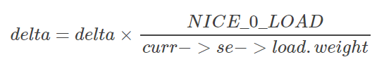
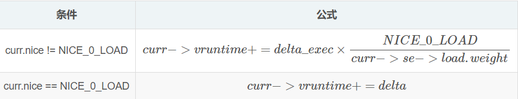

***Linux CFS调度器之虚拟时钟与调度延迟***

- 1 vruntime
    - 1.1 虚拟运行时间的引入
    - 1.2 CFS虚拟时钟
- 2 虚拟时钟相关的数据结构
    - 2.1 调度实体的虚拟时钟信息
    - 2.2 就绪队列上虚拟时钟信息
- 3 update_curr函数计算进程虚拟时间
    - 3.1 计算时间差
    - 3.2 模拟虚拟时钟
    - 3.3 重新设置cfs_rq->min_vruntime
- 4 红黑树的键值entiry_key和entity_before
- 5 延迟跟踪（调度延迟）与虚拟时间在调度实体内部的在分配
    - 5.1 调度延迟与其控制手段
    - 5.2 虚拟时间在调度实体内的分配
- 6 总结

# 1. vruntime

## 1.1 虚拟运行时间的引入

CFS为了实现公平，必须惩罚当前正在运行的进程，以使那些正在等待的进程下次被调度。具体实现时，CFS通过每个进程的虚拟运行时间（vruntime）来衡量哪个进程最值得被调度。

FS中的就绪队列是一颗以vruntime为键值的红黑树，虚拟时间越小的进程越靠近整个红黑树的最左端。因此，调度器每次选择位于红黑树最左端的那个进程，该进程的vruntime最小。vruntime是通过进程实际运行时间和进程的权重（weight）计算出来的。

在CFS调度器中，将进程优先级这个概念弱化，而是强调进程的权重。一个进程的权重越大，则说明这个进程更需要运行，因此，它的vruntime就越小，这样被调度的机会就越大。

那么，在用户态进程的优先级nice值域CFS调度器中的权重由有什么关系？在内核中通过prio\_to\_weight数组进行nice值和权重的转换。

## 1.2 CFS虚拟时钟

完全公平调度算法CFS依赖于vruntime，用以度量等待进程在完全公平系统中所能得到的CPU时间。但是数据结构中任何地方都没有找到vruntime。这个是由于所有的必要信息都可以根据存在的实际时钟和进程相关的负荷权重推算出来。

假设，现在系统有A、B、C三个进程，A.weight=1，B.weight=2，C.weight=3。那么我们可以计算出整个公平调度队列的总权重是cfs\_rq.weight = 6，很自然的想法就是，公平就是你在权重中占的比重多少来猜你的重要性，那么，A的重要性就是1/6，B的重要性是2/6，C的重要性是3/6。很显然，C最重要就应该被先调度，而且占用的资源也应该最多。
即假设A、B、C运行以便的总时间假设是6个事件单位的话，A应该占1个单位、B应该占2个单位、C应该占3个单位。这就是CFS的公平策略。

CFS调度算法的思想：理想状态下每个进程都能获得相同的时间片，并且同时运行在CPU上，但实际上一个CPU同一时刻运行的进程只能有一个。也就是说，当一个进程占用CPU时，其他进程就必须等待。CFS为了实现公平，必须惩罚当前正在运行的进程，以使那些正在等待的进程下次被调度。

具体实现时，CFS通过每个进程的**vruntime**来衡量哪个进程最值得被调度。CFS中就绪队列是一颗以vruntime为键值的红黑树，vruntime越小的进程月靠近整个红黑树的最左端。因此，调度器每次选择位于红黑树最左端的那个进程，该进程的vruntime最小。

虚拟运行时间是通过进程的实际运行时间和进程的权重（weight）计算出来的。在CFS调度器中，将进程优先级这个概念弱化，而是强调进程的权重。一个进程的权重越大，则说明这个进程更需要运行，因此，它的vruntime时间越小，这样被调度的机会就越大。而，CFS调度器中的权重在内核时用户态进程的优先级nice值，通过prio\_to\_weight数组进行nice值和权重的转换而计算出来。

# 2. 虚拟时钟相关的数据结构

## 2.1 调度实体的虚拟时钟信息

为了实现完全公平调度，内核引入了虚拟时钟（**virtual clock**）的概念，实际上我觉得这个虚拟时钟为什么叫虚拟的，是因为这个时钟与具体的时钟晶振没有关系，它只不过是为了公平分配CPU时间而提出的一种时间度量，**它与进程的权重有关**，这里就知道权重的作用了，权重越高，说明进程的优先级比较高，进而该进程**虚拟时钟增长的就慢**。

既然虚拟时钟是用来衡量调度实体（一个进程或多个进程）的一种时间度量，因此必须在调度实体中存储器虚拟时钟的信息：
```c
struct sched_entity
{
    /* for load-balancing负荷权重，这个决定了进程在CPU上的运行时间和被调度次数 */
	struct load_weight      load;           
    struct rb_node          run_node;
    
    /*  是否在就绪队列上  */
    unsigned int            on_rq;          

    /*  上次启动的时间*/
    u64                     exec_start;			

    u64                     sum_exec_runtime;
    u64                     vruntime;
    u64                     prev_sum_exec_runtime;
    
    /* rq on which this entity is (to be) queued: */
    struct cfs_rq           *cfs_rq;
    
    ......
};
```
- sum\_exec\_runtime：是用于记录该进程CPU消耗时间，这个是真实CPU消耗时间。在进程撤销时会将sum\_exec\_runtime保存到prev\_sum\_exec\_runtime中。
- vruntime：是本进程声明周期中在CPU上运行的虚拟时钟。那么何时应该更新这些时间呢？这是通过调用update\_curr实现的，该函数在多处调用。

## 2.2 就绪队列上虚拟时钟信息

完全公平调度类sched\_fair\_class主要负责管理普通进程，在全局的CPU就绪队列上存储了在CFS的就绪队列struct cfs\_rq。

进程的就绪队列就存储了CFS相关的虚拟运行时间的信息，struct cfs\_rq定义如下：
```c
struct cfs_rq
{
    struct load_weight load;   /*所有进程的累计负荷值*/
    unsigned long nr_running;  /*当前就绪队列的进程数*/

	// ========================
    u64 min_vruntime;  //  队列的虚拟时钟, 
	// =======================
	
    struct rb_root tasks_timeline;  /*红黑树的头结点*/
    struct rb_node *rb_leftmost;    /*红黑树的最左面节点*/

    struct sched_entity *curr;      /*当前执行进程的可调度实体*/
    
    ......
};
```

# 3. update_curr函数计算进程虚拟时间

所有与虚拟时钟有关的计算都在update\_curr()中执行，该函数在系统中各个不同的地方调用，包括周期性调度器在内。

update\_curr的流程如下：
- 首先计算进程当前时间与上次启动时间的差值
- 通过负荷权重和当前时间模拟出进程的虚拟运行时钟
- 中心设置cfs的min\_vruntime保持其单调性

## 3.1 计算时间差

首先，该函数确定就绪队列的当前执行进程，并获取主调度器就绪队列的实际时钟值，该值在每个调度器都会更新：
```c
    /*  确定就绪队列的当前执行进程curr  */
    struct sched_entity *curr = cfs_rq->curr;
```
其中辅助函数rq\_of()用于确定与CFS就绪队列相关的struct rq实例，其定义在kernel/sched/fair.c。
cfs\_rq就绪队列中存储了指向就绪队列的实例，而rq\_of就返回这个指向rq的指针。

rq\_lock\_task函数返回了运行队列的clock\_task成员。
```c
    /*  rq_of -=> return cfs_rq->rq 返回cfs队列所在的全局就绪队列  
     *  rq_clock_task返回了rq的clock_task  */
    u64 now = rq_clock_task(rq_of(cfs_rq));
    u64 delta_exec;
```
如果就绪队列上没有进程在执行，则显然无事可做，否则内核计算当前和上一次更新负荷权重时两次的时间的差值
```c
    /*   如果就队列上没有进程在执行, 则显然无事可做  */
    if (unlikely(!curr))
        return;
    
    /*  内核计算当前和上一次更新负荷权重时两次的时间的差值 */
    delta_exec = now - curr->exec_start;
    if (unlikely((s64)delta_exec <= 0))
        return;
```
然后，重新更新启动时间exec\_start为now，以备下次计算时使用。

最后将计算出的时间差，加到了先前的统计时间上。
```c
    /*  重新更新启动时间exec_start为now  */
    curr->exec_start = now;

    schedstat_set(curr->statistics.exec_max,
              max(delta_exec, curr->statistics.exec_max));

    /*  将时间差加到先前统计的时间即可  */
    curr->sum_exec_runtime += delta_exec;
    schedstat_add(cfs_rq, exec_clock, delta_exec);
```

## 3.2 模拟虚拟时钟

有趣的事情是如何使用给出的信息来模拟不存在的虚拟时钟。这一次内核的实现仍然非常巧妙，针对最普通的情形节省了一些时间。对于运行在nice值为0的进程来说，根据定义虚拟时钟和物理时间相等。在使用不同的优先级时，必须根据系统的负荷权重来重新衡量时间。
```c
    curr->vruntime += calc_delta_fair(delta_exec, curr);
    update_min_vruntime(cfs_rq);
```
其中calc\_delte\_fair函数是计算的关键：
```c
/*
 * delta /= w
 */
static inline u64 calc_delta_fair(u64 delta, struct sched_entity *se)
{
    if (unlikely(se->load.weight != NICE_0_LOAD))
        delta = __calc_delta(delta, NICE_0_LOAD, &se->load);

    return delta;
}
```
忽略摄入和溢出检查，cacl\_delta\_fair函数所做的就是根据下列公式计算：



每一个进程拥有一个vruntime，每次需要调度的时候就选运行队列中拥有最小vruntime的哪个进程来运行，vruntime在时钟中断里面被维护，每次时钟中断都要更新当前进程的vruntime，即vruntime以如下公式逐渐增长。

那么，`curr->vruntime += cale_delta_fair(delta_exec, curr);`相当于如下操作：



在该计算中可以派上用场了，回想一下子，可知越重要的进程会有越高的优先级（即，超低的nice值），会得到更大的权重，因此累加的vruntime会越小。

根据公式可知，nice=0的进程（优先级120），则虚拟时间和物理时间是相等的，即current->se->load.weight等于NICE\_0\_LOAD的情况。

## 3.3 重新设置cfs\_rq->min\_vruntime

接着内核需要重新设置`min_vruntime`。必须小心保证该值是单调递增的，通过update\_min\_vruntime函数来设置：
```c
static void update_min_vruntime(struct cfs_rq *cfs_rq)
{
    /*  初始化vruntime的值, 相当于如下的代码
    if (cfs_rq->curr != NULL)
        vruntime = cfs_rq->curr->vruntime;
    else
        vruntime = cfs_rq->min_vruntime;
    */
    u64 vruntime = cfs_rq->min_vruntime;

    if (cfs_rq->curr)
        vruntime = cfs_rq->curr->vruntime;


    /*  检测红黑树是都有最左的节点, 即是否有进程在树上等待调度
     *  cfs_rq->rb_leftmost(struct rb_node *)存储了进程红黑树的最左节点
     *  这个节点存储了即将要被调度的结点  
     *  */
    if (cfs_rq->rb_leftmost)
    {
        /*  获取最左结点的调度实体信息se, se中存储了其vruntime
         *  rb_leftmost的vruntime即树中所有节点的vruntiem中最小的那个  */
        struct sched_entity *se = rb_entry(cfs_rq->rb_leftmost,
                           struct sched_entity,
                           run_node);
        /*  如果就绪队列上没有curr进程
         *  则vruntime设置为树种最左结点的vruntime
         *  否则设置vruntiem值为cfs_rq->curr->vruntime和se->vruntime的最小值
         */
        if (!cfs_rq->curr)  /*  此时vruntime的原值为cfs_rq->min_vruntime*/
            vruntime = se->vruntime;
        else                /* 此时vruntime的原值为cfs_rq->curr->vruntime*/
            vruntime = min_vruntime(vruntime, se->vruntime);
    }

    /* ensure we never gain time by being placed backwards. 
     * 为了保证min_vruntime单调不减
     * 只有在vruntime超出的cfs_rq->min_vruntime的时候才更新
     */
    cfs_rq->min_vruntime = max_vruntime(cfs_rq->min_vruntime, vruntime);
#ifndef CONFIG_64BIT
    smp_wmb();
    cfs_rq->min_vruntime_copy = cfs_rq->min_vruntime;
#endif
}
```
我们通过分析update\_min\_vruntime函数设置cfs\_rq->min\_vruntime的流程如下：
- 首先检测CFS就绪队列上是否有活动进程curr，以此设置vruntime的值，如果CFS就绪队列上没有活动的进程curr，就设置vruntime为curr->vruntime；否则有活动进程就设置vruntime为cfs\_rq的原min\_vruntime。
- 接着检测CFS的红黑树上是否有最左节点，即等待被调度的节点，重新设置vruntime的值为curr进程和最左进程rb\_leftmost的vruntime较小者的值
- 为了保证min\_vruntime单调不减，只有在vruntime超出cfs\_rq-min\_vruntime的时候才更新。

update\_min\_vruntime根据当前进程和待调度进程的vruntime值，设置出一个可能的vruntime值，但是只有在这个可能的情况下，vruntime值大于就绪队列原来的min\_vruntime的时候，才更新就绪队列的min\_vruntime，利用该策略，内核保证min\_vruntime只能增加，不能减少。

update\_min\_vruntime函数的流程等价于如下的代码：
```c
    //  依据curr进程和待调度进程rb_leftmost找到一个可能的最小vruntime值
    if (cfs_rq->curr != NULL cfs_rq->rb_leftmost == NULL)
        vruntime = cfs_rq->curr->vruntime;
    else if(cfs_rq->curr == NULL && cfs_rq->rb_leftmost != NULL)
            vruntime = cfs_rq->rb_leftmost->se->vruntime;
    else if (cfs_rq->curr != NULL cfs_rq->rb_leftmost != NULL)
        vruntime = min(cfs_rq->curr->vruntime, cfs_rq->rb_leftmost->se->vruntime);
    else if(cfs_rq->curr == NULL cfs_rq->rb_leftmost == NULL)
        vruntime = cfs_rq->min_vruntime;
    
    //  每个队列的min_vruntime只有被树上某个节点的vruntime((curr和程rb_leftmost两者vruntime的较小值)超出时才更新
    cfs_rq->min_vruntime = max_vruntime(cfs_rq->min_vruntime, vruntime);
```

其中寻找可能vruntime的策略我们采用表格的形式可能更加直接：

活动进程</br>curr | 待调度进程</br>rb\_leftmost | 可能的vruntime值 | cfs\_rq
---|---|---|---
NULL | NULL | cfs\_rq->min\_vruntime | 维持原值
NULL |!NULL | rb\_leftmost->se->vruntime | max(可能值vruntime, 原值)
!NULL | NULL | curr->vruntime | max(可能值vruntime, 原值)
!NULL | !NULL | min(curr->vruntime, rb_leftmost->se->vruntime) | max(可能值vruntime, 原值)

# 4. 红黑树的键值entiry\_key和entity\_before

完全公平调度器CFS的真正关键点是，红黑树的排序过程是进程的vruntime来进行计算的，准确的来说同一个就绪队列所有进程（或者调度实体）依照其键值`se->vruntime - cfs_rq->min_vruntime`进行排序。

键值通过entity\_key计算，该函数在Linux 2.6中被定义，但是后来内核移除了这个函数，但是我们今天仍然讲解它，因为它对我们理解CFS调度器和vruntime有很多帮助。

```c
static inline s64 entity_key(struct cfs_rq *cfs_rq, struct sched_entity *se)
{
 	return se->vruntime - cfs_rq->min_vruntime;
}
```
键值较小的节点，在CFS红黑树中排序的位置就越靠左，因此也更快地被调度。用这种方法，内核实现了两种对立的机制：
- 在程序运行时，其vruntime稳定地增加，它在红黑树总是向右移动的。

因为权重越高的进程vruntime增加的越慢，因此它们向右移动的速度也越慢，这样其被调度的机会要大于次要进程，这刚好是我们需要的。

- 如果进程进入睡眠。则其vruntime保持不变，因为每个队列min\_vruntime同时会单调增加，那么当进程从睡眠中苏醒，在红黑树中的位置会更靠右，因此键值相对来说变得更小了。

即相当于如下代码：
```c
    if (entity_key(cfs_rq, se) < entity_key(cfs_rq, entry))

    等价于
    if (se->vruntime-cfs_rq->min_vruntime < entry->vruntime-cfs_rq->min_vruntime)

    进一步化简为

    if (se->vruntime < entry->vruntime)
```
即整个过程等价于比较两个调度实体vruntime值的大小。因此，内核定义了函数entity\_before来实现此功能，函数定义在kernel/sched/fair.c中。
```c
static inline int entity_before(struct sched_entity *a,
                                struct sched_entity *b)
{
    return (s64)(a->vruntime - b->vruntime) < 0;
}
```

# 5. 延迟跟踪（调度延迟）与虚拟时间在调度实体内部的在分配

## 5.1 调度延迟与其控制手段

内核由一个固定的概念，称之为良好的**调度延迟**，即保证每个可运行的进程都应该至少运行一次的某个时间间隔。
它在sysctl\_sched\_latency给出，可通过/proc/sys/kernel/sched\_latency\_ns控制，默认值为18000000纳秒，即18毫秒。

第二个控制参数sched\_nr\_latency，控制在一个延迟周期中处理的最大活动进程数目。如果挥动进程的输出超过该上线，则延迟周期也成比例的线性扩展。sched\_nr\_latency可以通过sysctl\_sched\_min\_granularity间接的控制，可通过/porc/sys/kernel/sched\_min\_granularity\_ns设置，默认值是2250000纳秒，即2.25毫秒。

> 每次sysctl_sched_latency/sysctl_sched_min_granularity之一改变时，都会重新计算sched_nr_latency。

\_\_sched\_preiod确定**延迟周期的长度**，通常就是sysctl\_sched\_latency，但如果有更多的进程运行，其值有可能按比例线性扩展。在这种情况下，周期长度是：
```
    __sched_period = sysctl_sched_latency * nr_running / sched_nr_latency
```

## 5.2 虚拟时间在调度实体内的分配

调度实体在内核进行调度的基本实体单位，其可能包含了一个或多个进程，那么调度实体分配到的vruntime，需要在内部对各个进程进行再次分配。

通过考虑各个进程的相对权重，将一个延迟周期的时间在活动进程之前进行分配。对于某个调度实体标识的给定进程，分配到的时间通过sched_slice函数来分配，其实现在kernel/sched/fair.c，计算方式如下：
```c
/*
 * We calculate the wall-time slice from the period by taking a part
 * proportional to the weight.
 *
 * s = p*P[w/rw]
 */
static u64 sched_slice(struct cfs_rq *cfs_rq, struct sched_entity *se)
{
        u64 slice = __sched_period(cfs_rq->nr_running + !se->on_rq);

        for_each_sched_entity(se) {
                struct load_weight *load;
                struct load_weight lw;

                cfs_rq = cfs_rq_of(se);
                load = &cfs_rq->load;

                if (unlikely(!se->on_rq)) {
                        lw = cfs_rq->load;

                        update_load_add(&lw, se->load.weight);
                        load = &lw;
                }
                slice = __calc_delta(slice, se->load.weight, load);
        }
        return slice;
}
```
回想一下子，就绪队列的负荷权重是队列所有活动进程负荷权重的总和，结果时间段是按实际时间给出的，但内核有时候也需要知道等价的vruntime，该功能通过sched\_vslice函数来实现，其定义在kernel/sched/fair.c中：
```c
/*
 * We calculate the vruntime slice of a to-be-inserted task.
 *
 * vs = s/w
 */
static u64 sched_vslice(struct cfs_rq *cfs_rq, struct sched_entity *se)
{
        return calc_delta_fair(sched_slice(cfs_rq, se), se);
}
```
相对于权重weight的进程来说，其实际时间段time相对应的vruntime长度为：
```
    time * NICE_0_LOAD / weight
```
该公式通过cale\_delta\_fair函数计算，在sched\_vslice函数中也被用来转换分配到的延迟时间间隔。

# 6. 总结

- **CFS调度算法的思想**

理想状态下每个进程都能获得相同的时间片，并且同时运行在CPU上，但实际上一个CPU同一时刻运行的进程只能有一个。也就是说，当一个进程占用CPU时，其他进程就必须等待。CFS为了实现公平，必须惩罚当前正在运行的进程，以使那些正在等待的进程被下次调度。

- **vruntime是红黑树排序的依据**

具体实现时，CFS通过每个进程的vruntime来衡量哪个进程最值得被调度。
CFS中就绪队列是一颗以vruntime为键值的红黑树，vruntime越小的进程靠近整个红黑树的最左端。
因此，调度器每次选择位于红黑树最左端的那个进程，该进程的vruntime最小。

- **优先级计算负荷权重，负荷权重和当前时间计算出vruntime**

vruntime是通过进程的实际运行时间和进程的权重计算出来的。
在CFS调度器中，将进程优先级的概念弱化，而是强调进程的权重。
一个进程的权重越大，则说明这个进程更需要运行，因此它的vruntime就越小，这样被调度的机会就越大。
而CFS调度器中权重在内核时对用户态进程的优先级nice值，通过prio\_to\_weight数组进行nice值和权重的转换而计算出来的。

- **vruntime相关公式**

属性 | 公式 | 描述
---|---|---
ideal\_time | sum\_runtime * se.weight/cfs_rq.weight | 每个进程应该运行的时间
sum\_exec\_runtime | none | 运行队列中所有任务运行完一遍的时间
se.weight | none | 当前进程的权重
cfs.weight | none | 整个cfs_rq的总权重

这里se.weight和cfs.weight根据上面讲解我们可以算出，sum\_runtime是怎么计算的呢？Linux内核中这是个经验值，其经验公式是：

条件 | 公式
---|---
进程数 > sched\_nr\_latency | sum\_runtime = sysctl\_sched\_min\_granularity * nr\_running
进程数 <= sched\_nr\_latency | sum\_runtime = sysctl\_sched\_latency = 18ms

> sched_nr_latency是内核在一个延迟周期中处理的最大活动进程数目。

Linux内核代码中是通过一个叫vruntime的变量来实现上面的原理的，即：

每一个进程拥有一个vruntime，每次需要调度的时候就选运行队列中拥有最小vruntime的哪个进程来运行，vruntime在时钟中断里面被维护，每次时钟中断都要更新当前进程的vruntime，即vruntime一如下公式逐渐增长：

条件 | 公式
---|---
curr.nice != NICE\_0\_LOAD | vruntime += delta * NICE\_0\_LOAD/se.weight;
curr.nice == NICE\_0\_LOAD | vruntime += delta;
