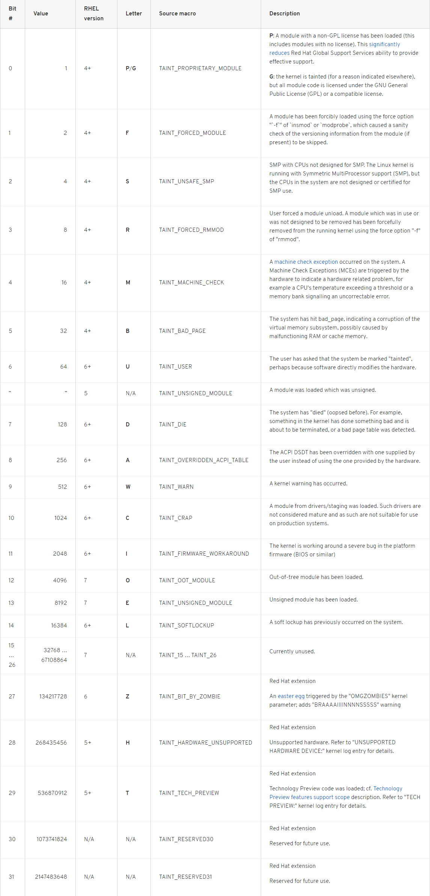

***内核模块签名***

[TOC]

# 1. 简介

内核模块签名功能在安装期间对模块进行加密签名，然后在加载模块时检查签名。

# 2. 启用模块签名校验配置

```
--- Enable loadable module support
[*]   Module signature verification
[*]     Require modules to be validly signed
[*]     Automatically sign all modules
      Which hash algorithm should modules be signed with? (Sign modules with SHA-512) --->
```

# 3. 依赖的工具

Tool | Provided by Package | Where Used | Purpose
---|---|---|---
Openssl | openssl | Build system | Generates a public/private key pair. 
Sign-file | kernel-devel | Build system | Perl script used to sign kernel modules.
Perl | perl | Build system | Perl interpreter used to run the signing script. 
Mokutil | mokutil | Target system | Tool used to manually enroll a public key.
Keyctl | keyutils | Target system | Tools used to display public keys in system key ring. 

# 4. 系统密钥环

Source of x.509 keys | User Ability to add Keys | UEFI secure Boot state |Keys loaded during Boot
---|---|---|---
Embedded in kernel | No | -NA- | .system_keyring
UEFI Secure Boot “db” | Limited | Enabled | .system_keyring 
UEFI Secure Boot “dbx” | Limited | Enabled | .system_blacklist_keyring 
Embedded in shim.efi boot loader | No | Enabled | .system_keyring 
Machine Owner Key (MOK) List | Yes | Enabled | .system_keyring 

## 4.1 查看系统密钥环

```bash
#> keyctl list %:.system_keyring
6 keys in keyring:
421094417: --alswrv     0     0 asymmetric: CentOS Linux kpatch signing key: ea0413152cde1d98ebdca3fe6f0230904c9ef717
869305980: --alswrv     0     0 asymmetric: Red Hat Inc.: 1ff96dd8d1b2327228c04b03a772dbb2dbb79b1f
 44114063: --alswrv     0     0 asymmetric: CentOS Secure Boot (key 1): f037c6eaec36d4057a526c0ec6d5a95b324ee129
210455294: --alswrv     0     0 asymmetric: Tsinghua Lab. UEFI Authorized Database: c719a41308c674dab5e101ccfb7521b64a8e86d7
698877327: --alswrv     0     0 asymmetric: CentOS Linux kernel signing key: 0b01581c518329740fda22c6a8288734f0dc21a6
799191883: --alswrv     0     0 asymmetric: CentOS Linux Driver update signing key: 7f421ee0ab69461574bb358861dbe77762a4201b
```

# 5. 内核模块签名信息

## 5.1 modinfo查看模块基本信息

```
$> modinfo xfs
filename:       /lib/modules/3.10.0-693.el7.centos.x86_64.debug/kernel/fs/xfs/xfs.ko
license:        GPL
description:    SGI XFS with ACLs, security attributes, no debug enabled
author:         Silicon Graphics, Inc.
alias:          fs-xfs
rhelversion:    7.4
srcversion:     6CAAE7A01207B73522C8412
depends:        libcrc32c
intree:         Y
vermagic:       3.10.0-693.el7.centos.x86_64.debug SMP mod_unload modversions
signer:         CentOS Linux kernel signing key
sig_key:        0B:01:58:1C:51:83:29:74:0F:DA:22:C6:A8:28:87:34:F0:DC:21:A6
sig_hashalgo:   sha256
```

## 5.2 内核模块布局
```cpp
/*
 * Module signature information block.
 */
struct module_signature {
    uint8_t algo;        /* Public-key crypto algorithm [enum pkey_algo] */
    uint8_t hash;        /* Digest algorithm [enum pkey_hash_algo] */
    uint8_t id_type;     /* Key identifier type [enum pkey_id_type] */
    uint8_t signer_len;  /* Length of signer's name */
    uint8_t key_id_len;  /* Length of key identifier */
    uint8_t __pad[3];
    uint32_t sig_len;    /* Length of signature data (big endian) */
};

#define SIG_MAGIC "~Module signature appended~\n"

/*
 * A signed module has the following layout:
 *
 * [ module                  ]
 * [ signer's name           ]
 * [ key identifier          ]
 * [ signature data          ]
 * [ struct module_signature ]
 * [ SIG_MAGIC               ]
 */
```

## 5.3 查看模块的签名信息

```
#> hexdump -C kvm.ko | tail
00b4aa30  e4 2f 82 81 05 04 52 db  01 e1 0e b4 81 91 db da  |./....R.........|
00b4aa40  67 b7 aa bb 17 bc 75 ad  6a 93 0f c9 66 18 ba a2  |g.....u.j...f...|
00b4aa50  99 c4 90 a9 b2 62 97 cf  a2 5d dc 0f f0 42 8d f0  |.....b...]...B..|
00b4aa60  a3 cb d3 aa de b7 74 ea  21 1f f9 0a 77 6f 74 64  |......t.!...wotd|
00b4aa70  c1 69 dd 79 3b 0a 41 3d  b6 52 70 1b 5a 9e 43 3d  |.i.y;.A=.Rp.Z.C=|
00b4aa80  b2 b8 0f 3b f0 ff 96 cc  51 91 1a 3b 83 79 12 5b  |...;....Q..;.y.[|
00b4aa90  09 7c 2b 28 cb 01 06 01  1f 14 00 00 00 00 00 01  |.|+(............|
00b4aaa0  82 7e 4d 6f 64 75 6c 65  20 73 69 67 6e 61 74 75  |.~Module signatu|
00b4aab0  72 65 20 61 70 70 65 6e  64 65 64 7e 0a           |re appended~.|
00b4aabd

```

# 5. 自定义证书签名模块

## 5.1 创建数字证书配置文件

```
/usr/src/linux/certs/x509.genkey
[ req ]
default_bits = 3072
distinguished_name = req_distinguished_name
prompt = no
string_mask = utf8only
x509_extensions = myexts

[ req_distinguished_name ]
O = CentOS
CN = CentOS Linux kernel signing key
emailAddress = security@centos.org

[ myexts ]
basicConstraints=critical,CA:FALSE
keyUsage=digitalSignature
subjectKeyIdentifier=hash
authorityKeyIdentifier=keyid
```


## 5.2 使用配置文件数据创建自签证书
```
#> openssl req -new -nodes -utf8 -sha512 -days 36500 -batch -x509 -config x509.genkey -outform DER -out signing_key.x509 -keyout signing_key.priv

```

## 5.3 查看证书文件信息
```
$> openssl x509 -in signing_key.x509 -inform der -text -noout
Certificate:
    Data:
        Version: 3 (0x2)
        Serial Number:
            9b:ee:21:7a:aa:17:72:9d
    Signature Algorithm: sha512WithRSAEncryption
        Issuer: O=CentOS, CN=CentOS Linux kernel signing key/emailAddress=security@centos.org
        Validity
            Not Before: Oct  9 06:13:08 2018 GMT
            Not After : Sep 15 06:13:08 2118 GMT
        Subject: O=CentOS, CN=CentOS Linux kernel signing key/emailAddress=security@centos.org
        Subject Public Key Info:
            Public Key Algorithm: rsaEncryption
                Public-Key: (3072 bit)
                Modulus:
                    00:d1:84:af:fb:0a:4e:fa:c5:b9:b2:25:47:a0:48:
                    6d:43:c5:14:8a:52:a4:bc:64:51:47:eb:bb:a3:87:
                    6b:86:91:0c:bd:8b:31:fb:90:e3:2f:e4:60:c0:29:
                    f8:61:94:0d:75:3c:dc:2e:f1:43:9d:08:73:a3:0b:
                    c0:59:7c:d0:2f:89:79:a9:04:82:80:9d:ba:79:24:
                    a8:32:f0:59:f5:ad:50:a7:d1:35:18:c0:67:99:03:
                    bb:b7:98:ac:d1:dc:f7:2f:59:d3:ee:a7:7a:a7:01:
                    1f:38:2d:66:1e:4a:40:5d:e1:0b:1b:8f:ce:d5:8e:
                    54:a0:23:c5:db:d7:33:1d:10:78:ca:5e:07:6c:b9:
                    96:00:91:df:2e:73:9d:67:15:7d:5f:59:b8:d7:ff:
                    b7:8f:4a:9f:70:39:da:c2:8e:39:05:f1:39:c0:f3:
                    3a:a2:78:5e:f0:30:45:24:85:66:03:fc:10:75:ae:
                    38:6c:3d:6e:07:12:bc:6b:cd:b0:de:66:03:92:31:
                    f1:16:8c:8e:e9:96:ca:e9:9e:0b:4d:5c:80:3d:d6:
                    f0:dc:3a:9b:a6:15:5c:8e:ba:a4:a7:68:ca:20:a9:
                    4e:b8:af:cb:7b:05:18:da:06:f1:d5:dc:73:71:3d:
                    65:d3:b8:bf:2e:eb:cb:a1:5f:5a:10:34:ca:78:94:
                    df:a4:2f:6e:3a:f5:c1:19:f1:2f:57:61:69:4f:cc:
                    01:ac:4e:39:9f:3f:8e:13:e9:c0:e5:a5:c3:fa:ce:
                    29:8b:91:86:7a:e3:5b:c2:02:84:cc:d4:66:36:48:
                    56:06:16:a0:fa:33:53:cf:f3:6d:12:34:92:31:4d:
                    e6:a5:ef:29:2c:85:74:9f:9d:63:ec:3d:47:9a:a9:
                    7e:4a:4f:df:95:64:d2:c7:de:e1:f5:52:47:47:8b:
                    79:a3:72:e5:2a:34:9e:62:8b:21:4a:fe:9d:fd:3a:
                    e2:9c:c9:1d:e4:22:bf:8a:42:66:8d:e3:4f:fb:c7:
                    b4:9f:77:76:0c:75:97:38:07:e1
                Exponent: 65537 (0x10001)
        X509v3 extensions:
            X509v3 Basic Constraints: critical
                CA:FALSE
            X509v3 Key Usage:
                Digital Signature
            X509v3 Subject Key Identifier:
                9F:02:26:43:62:EA:55:55:B5:AD:B4:85:86:F0:1A:F2:94:37:2A:11
            X509v3 Authority Key Identifier:
                keyid:9F:02:26:43:62:EA:55:55:B5:AD:B4:85:86:F0:1A:F2:94:37:2A:11

    Signature Algorithm: sha512WithRSAEncryption
         78:86:fd:58:47:63:1c:cb:ed:cf:fe:d2:26:3a:af:db:fe:32:
         40:02:55:7a:e2:99:3f:8b:b1:dd:fb:ae:f7:d1:51:e0:8d:d4:
         ec:d9:c7:c0:7d:1e:0b:b5:f8:c5:50:fe:e2:38:26:d5:5b:b5:
         39:f2:91:a1:7a:a8:56:cb:cb:7d:0c:ca:e8:e9:15:d2:69:1c:
         80:c3:61:96:2b:26:d9:ff:e2:fd:e6:68:a1:c4:2d:c6:18:75:
         b5:57:46:37:26:23:10:01:42:5f:ba:6f:16:48:9c:7e:14:2d:
         87:b8:f1:20:aa:34:c4:b6:b0:b7:21:ed:16:ad:58:e8:09:49:
         2c:a7:70:90:cb:1d:59:b6:a3:4a:42:c2:78:dc:77:d9:48:b0:
         b7:79:1b:2e:62:ca:ad:57:9d:75:5b:c4:34:8b:b4:6c:e0:e0:
         a0:25:11:ed:ec:4b:ae:10:88:c1:f0:ce:a6:95:4a:6b:90:b6:
         e2:6c:7b:0a:ba:14:1d:e9:b4:2d:dc:ff:79:81:ec:7a:04:4a:
         68:f0:b4:15:da:fe:68:15:53:e0:5c:8b:f2:6b:2d:98:8b:fe:
         71:72:85:b1:4b:ac:24:50:b7:2d:df:20:1c:81:cf:88:c5:c3:
         9e:e9:02:4d:e0:07:fd:6a:eb:6b:bd:62:c3:1d:7e:2a:92:80:
         30:f2:60:d5:17:ca:86:96:81:d4:bb:e0:e3:e2:97:01:24:5b:
         60:97:05:24:ad:80:be:ff:07:58:65:42:c3:b3:64:00:64:71:
         5d:59:46:1e:3c:07:31:2f:50:bf:62:66:cc:63:ed:c9:99:31:
         86:d5:e6:0f:5e:6e:fc:37:5a:37:39:13:fd:d1:0c:cf:63:21:
         ed:a3:04:e9:8e:c5:74:49:a3:fe:25:f4:4d:d2:3b:bb:c0:30:
         97:af:3b:7c:85:df:c6:81:6f:97:2d:9c:57:3c:5c:a9:88:c5:
         7a:21:87:94:17:dd:47:bf:60:85:6e:c5:02:52:21:a0:47:b6:
         2e:c3:f6:68:e5:4b

```

# 5. 手动签署内核模块

使用内核源码树中scritps/sign-file脚本，脚本接收四个参数：

- 哈希算法 (例如sha256)
- 私钥文件
- 公钥文件
- 要签署的内核模块

```
scripts/sign-file sha512 kernel-signkey.priv \
        kernel-signkey.x509 module.ko
```

# 6. tainted
A non-zero value indicates the kernel has been tainted.

```
#> cat /proc/sys/kernel/tainted
#> sysctl kernel.tainted
```



