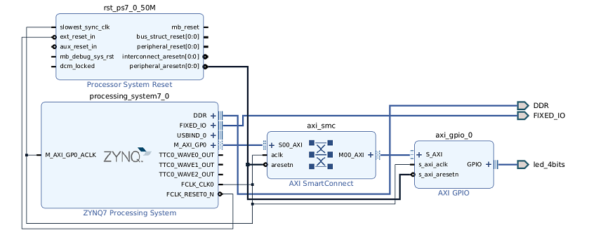
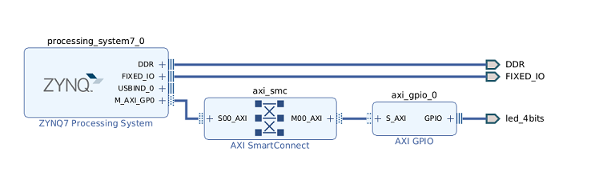

#  Xilinx Zynq-7000 AP SoC ZC706 Evaluation Kit (AXI-GPIO)





```
Target address 0x4120_0000 will be periodically written with 0xF and 0x0...
Wrote to 0x4120_0000: 0xF
Wrote to 0x4120_0000: 0x0
Wrote to 0x4120_0000: 0xF
Wrote to 0x4120_0000: 0x0
Wrote to 0x4120_0000: 0xF
Wrote to 0x4120_0000: 0x0
Wrote to 0x4120_0000: 0xF
Wrote to 0x4120_0000: 0x0
Wrote to 0x4120_0000: 0xF
Wrote to 0x4120_0000: 0x0
Wrote to 0x4120_0000: 0xF
Wrote to 0x4120_0000: 0x0
Wrote to 0x4120_0000: 0xF
Wrote to 0x4120_0000: 0x0
Wrote to 0x4120_0000: 0xF
Wrote to 0x4120_0000: 0x0
Wrote to 0x4120_0000: 0xF
Wrote to 0x4120_0000: 0x0
Wrote to 0x4120_0000: 0xF
Wrote to 0x4120_0000: 0x0
Wrote to 0x4120_0000: 0xF
Wrote to 0x4120_0000: 0x0
Wrote to 0x4120_0000: 0xF
Wrote to 0x4120_0000: 0x0
Wrote to 0x4120_0000: 0xF
Wrote to 0x4120_0000: 0x0
Wrote to 0x4120_0000: 0xF
Wrote to 0x4120_0000: 0x0
Wrote to 0x4120_0000: 0xF
Wrote to 0x4120_0000: 0x0
Wrote to 0x4120_0000: 0xF
```
