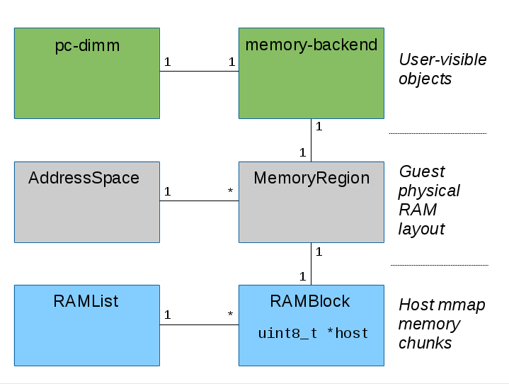

***QEMU中的内存管理介绍***

[TOC]

# 1. 概述

QEMU在虚拟机启动的初始化阶段，为客户机分配了物理内存，那么客户机的物理内存如何工作呢？本篇文档，为大家介绍客户机物理内存的工作原理、相关数据结构，但不会涉及其实现细节，客户机物理内存的实现细节，会在后面的代码分析中讲述。

# 2. 相关配置参数

QEMU的命令行中有参数：
```bash
-m [size=]megs[,slots=n,maxmem=size] 
```

用于指定客户机初始运行时的内存大小以及客户机最大内存大小，以及内存芯片槽的数量（DIMM）。

之所以QEMU可以指定最大内存、槽等参数，是因为QEMU可以模拟DIMM的热插拔，客户机操作系统可以和在真实的系统上一样，检测新内存被插入或者拔出。也就是说，内存热插拔的粒度是DIMM槽（或者说DIMM集合），而不是最小的byte。

# 3. 内存相关的数据结构



## 3.1 PCDIMMDevice和HostMemoryBackend

PCDIMMDevice和HostMemoryBackend对象都是在QEMU中用户可见的客户机内存。它们能通过QEMU命令行或者QMP监控器接口来管理。

PCDIMMDevice数据结构是使用QEMU中的面向对象编程模型QOM定义的，对应的对象和类的数据结构如下。通过在QEMU进程中创建一个新的PCDIMMDevice对象，就可以实现内存的热插拔。

值得注意的是，客户机启动时的初始化内存，可能不会被模拟成PCDIMMDevice设备，也就是说，这部分初始化内存不能进行热插拔。PCDIMMDevice的定义在include/hw/mem/pc-dimm.h中。

```c
typedef struct PCDIMMDevice {
    /* private */
    DeviceState parent_obj;

    /* public */
    uint64_t addr;
    uint32_t node; //numa node
    int32_t slot;  //slot编号
    HostMemoryBackend *hostmem;
} PCDIMMDevice;

typedef struct PCDIMMDeviceClass {
    /* private */
    DeviceClass parent_class;

    /* public */
    MemoryRegion *(*get_memory_region)(PCDIMMDevice *dimm);
} PCDIMMDeviceClass;
```

每个PCDIMMDevice对象都与 HostMemoryBackend对象相关联。HostMemoryBackend也是使用QEMU中的面向对象编程模型QOM定义的。HostMemoryBackend定义在include/sysemu/hostmem.h中。HostMemoryBackend对象包含了客户机内存对应的真正的主机内存，这些内存可以是匿名映射的内存，也可以是文件映射内存。文件映射的客户机内存允许Linux在物理主机上透明大页机制的使用（hugetlbfs），并且能够共享内存，从而使其他进程可以访问客户机内存。

```c
struct HostMemoryBackend {
    /* private */
    Object parent;

    /* protected */
    uint64_t size;
    bool merge, dump;
    bool prealloc, force_prealloc;
    DECLARE_BITMAP(host_nodes, MAX_NODES + 1);
    HostMemPolicy policy;

    MemoryRegion mr;
};

struct HostMemoryBackendClass {
    ObjectClass parent_class;

    void (*alloc)(HostMemoryBackend *backend, Error **errp);
};
```

## 3.2 RAMBlock和RAMList

HostMemoryBackend对象中的内存被实际映射到通过qemu_ram_alloc()函数（代码定义在exec.c中）RAMBlock数据结构中。每个RAMBlock都有一个指针指向被映射内存的起始位置，同时包含一个ram_addr_t的位移变量。ram_addr_t位于全局的命名空间中，因此RAMBlock能够通过offset来查找。

RAMBlock定义在include/exec/ram_addr.h中。RAMBlock受RCU机制保护，所谓RCU，即Read-COPY-Update。

```c
typedef uint64_t ram_addr_t;

struct RAMBlock {
    struct rcu_head rcu; //该数据结构受rcu机制保护
    struct MemoryRegion *mr; 
    uint8_t *host;          //RAMBlock的内存起始位置
    ram_addr_t offset;  //在所有的RAMBlock中offset
    ram_addr_t used_length;  //已使用长度
    ram_addr_t max_length;  //最大分配内存
    void (*resized)(const char*, uint64_t length, void *host);
    uint32_t flags;

    /* Protected by iothread lock.  */
    char idstr[256];      //RAMBlock的ID

    /* RCU-enabled, writes protected by the ramlist lock */
    QLIST_ENTRY(RAMBlock) next;
    int fd;  //映射文件的描述符
};
```

所有的RAMBlock保存在全局的RAMBlock的链表中，名为RAMList，它有专门的数据结构定义。RAMList数据结构定义在include/exec/ram_addr.h中，而全局的ram_list变量则定义在exec.c中。因此这个链表保存了客户机的内存对应的所有的物理机的实际内存信息。

```c
typedef struct RAMList {
    QemuMutex mutex; 
    /* Protected by the iothread lock.  */
    unsigned long *dirty_memory[DIRTY_MEMORY_NUM]; //用于保存脏页信息的bitmap，有三种bitmap，一种用于VGA，一种用于TCG编程中，一种用于热迁移中。
    RAMBlock *mru_block;    //最近最常使用的RAMBlock，将其保存，从而能够迅速访问
    /* RCU-enabled, writes protected by the ramlist lock. */
    QLIST_HEAD(, RAMBlock) blocks;  //ram_list的链表
    uint32_t version;          //全局的ram_list，每更改一次，version+1
} RAMList;

RAMList ram_list = { .blocks = QLIST_HEAD_INITIALIZER(ram_list.blocks) };
```

## 3.3 跟踪脏页

当客户机CPU或者DMA将数据保存到客户机内存时，需要通知下列一些用户：
1. 热迁移特性依赖于跟踪脏页，因此他们能够在被改变之后重新传输。
2. 图形卡模拟依赖于跟踪脏的视频内存，用于重画某些界面。

## 3.4 AddressSpace和MemoryRegion

所有的CPU架构都有内存地址空间、有些CPU架构又有一个IO地址空间。它们在QEMU中被表示为AddressSpace数据结构，它定义在include/exec/memory.h中。而每个地址空间都包含一个MemoryRegion的树状结构，所谓树状结构，指的是每个MemoryRegion的内部可以含有MemoryRegion，这样的包含所形成的树状结构。

MemoryRegion是联系客户机内存和包含这一部分内存的RAMBlock。每个MemoryRegion都包含一个在RAMBlock中ram_addr_t类型的offset，每个RAMBlock也有一个MemoryRegion的指针。

MemoryRegion不仅可以表示RAM，也可以表示I/O映射内存，在访问时可以调用read/write回调函数。这也是硬件从客户机CPU注册的访问被分派到相应的模拟设备的方法。

```c
struct AddressSpace {
    /* All fields are private. */
    struct rcu_head rcu;
    char *name;
    MemoryRegion *root;

    /* Accessed via RCU.  */
    struct FlatView *current_map; //AddressSpace的一张平面视图，它是AddressSpace所有正在使用的MemoryRegion的集合，这是从CPU的视角来看到的。

    int ioeventfd_nb;
    struct MemoryRegionIoeventfd *ioeventfds;
    struct AddressSpaceDispatch *dispatch;
    struct AddressSpaceDispatch *next_dispatch;
    MemoryListener dispatch_listener;

    QTAILQ_ENTRY(AddressSpace) address_spaces_link;
};

struct MemoryRegion {
    Object parent_obj;
    /* All fields are private - violators will be prosecuted */
    const MemoryRegionOps *ops;  //与MemoryRegion相关的操作
    const MemoryRegionIOMMUOps *iommu_ops;
    void *opaque;
    MemoryRegion *container;  
    Int128 size;
    hwaddr addr;         //在AddressSpace中的地址
    void (*destructor)(MemoryRegion *mr);
    ram_addr_t ram_addr;  //MemoryRegion的起始地址
    uint64_t align;   //big-endian or little-endian
    bool subpage;
    bool terminates;
    bool romd_mode;
    bool ram;
    bool skip_dump;
    bool readonly; /* For RAM regions */
    bool enabled;     //如果为true，表示已经通知kvm使用这段内存
    bool rom_device;  //是否是只读内存
    bool warning_printed; /* For reservations */
    bool flush_coalesced_mmio;
    bool global_locking;
    uint8_t vga_logging_count;
    MemoryRegion *alias;
    hwaddr alias_offset;
    int32_t priority;
    bool may_overlap;
    QTAILQ_HEAD(subregions, MemoryRegion) subregions;
    QTAILQ_ENTRY(MemoryRegion) subregions_link;
    QTAILQ_HEAD(coalesced_ranges, CoalescedMemoryRange) coalesced;

    const char *name;  //MemoryRegion的名字,调试时使用
    uint8_t dirty_log_mask;  //表示哪种dirty map被使用，共有三种

    //IOevent文件描述符的管理
    unsigned ioeventfd_nb;
    MemoryRegionIoeventfd *ioeventfds;

    NotifierList iommu_notify;
};
```