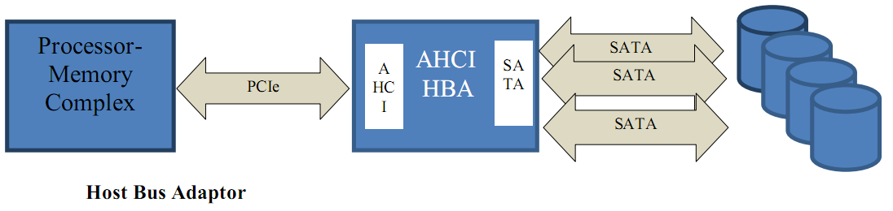
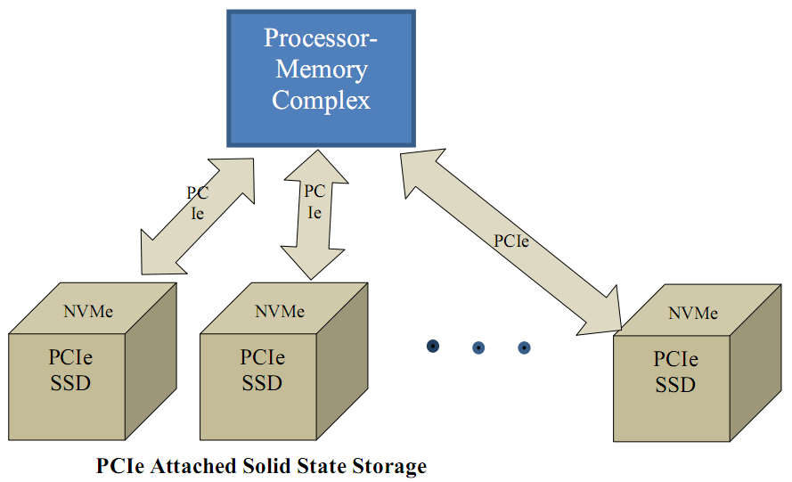
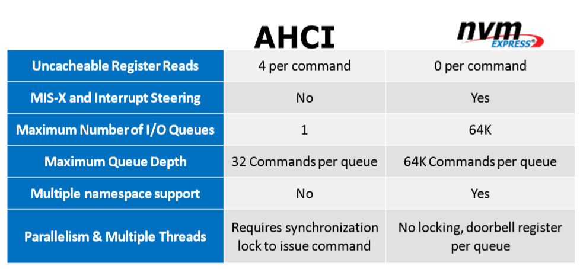
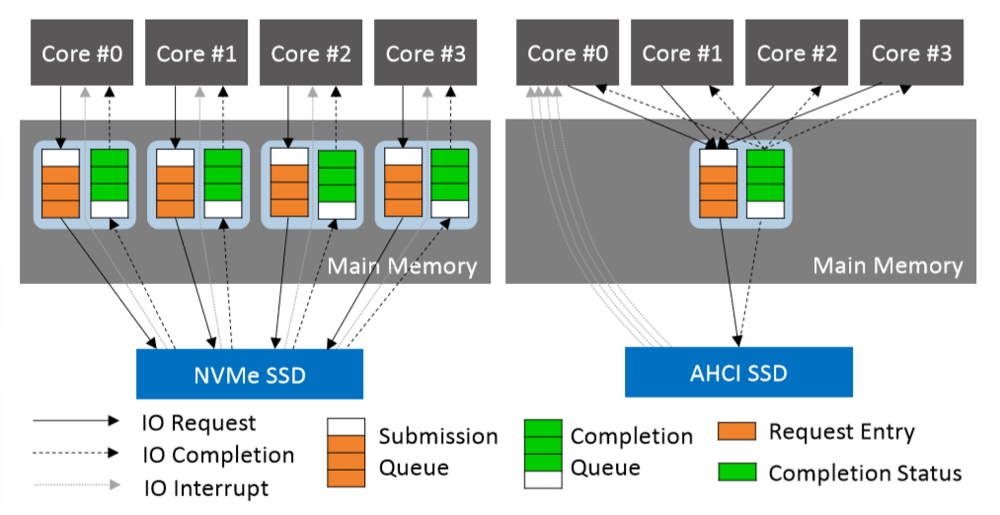
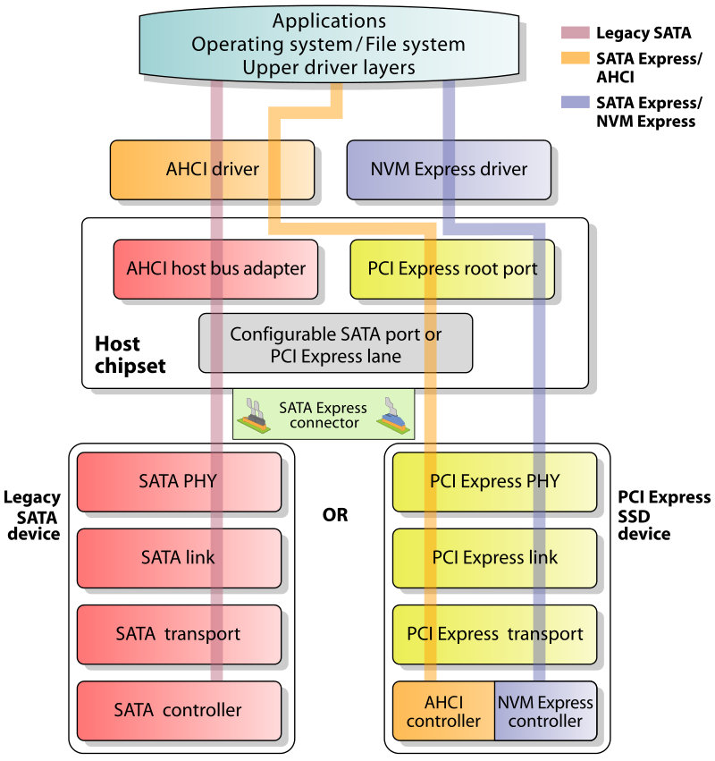

- 概述
- 1 SATA热插拔
- 2 NVME热插拔
    - 2.1 确认SSD的支持
    - 2.2 确认PCIe卡槽的支持
    - 2.3 确认操作系统的支持
    - 2.4 确认NVMe驱动的支持
- 3 AHCI与NVMe对比

# 概述

当客户采用U.2的SSD前，会对其热插拔功能做评估。在实施过程中，由于测试人员对NVMe SSD不了解导致系统崩溃的事情时有发生；或者对如何测试NVMe SSD热插拔无从下手。那么这篇文章，就跟大家分享在NVMe SSD热插拔过程中需要注意的问题（Linux环境下）。

我们先来了解下SAS/SATA 和NVMe在硬件上的差别。

# 1. SATA热插拔

对SAS和SATA比较熟悉的人知道，SAS和SATA设备通过控制器接入系统（如下图的SATA）。SAS和SATA设备的热插拔是由其控制器管理的。对于SAS来说，以常用的MegaRAID为例，其定义了一个热插拔event，当设备插入或者设备拔出时，MegaRAID会产生一个event并交由MegaRAID驱动处理。对于SATA而言，AHCI协议规定了控制器对热插拔的处理流程，并确定控制器必须在热插拔产生时触发一个中断，这样内核的AHCI驱动就可以在中断中处理热插拔事件。

# 2. NVME热插拔

NVMe SSD是不需要控制器的，NVMe直接连接到通用的PCIe Bus上（如下图），跟SAS/SATA控制器一个级别。NVMe SSD热插拔完全依赖于Host的PCIe处理机制。

因而，对于使用控制器的SAS和SATA硬盘来说，可以由控制器厂家进行测试并保证热插拔功能。但是NVMe SSD却依赖于Host端的PCIe的配合，PCIe由于其通用性，在支持NVMe SSD上没有SAS/SATA控制器那么完美。对于用户来说，需要认识到SAS/SATA和NVMe在这方面的不同之处。

省去了控制器的NVMe比SAS/SATA的热插拔要复杂的多。在进行热插拔测试之前，第一步就是要确认当前的系统是否支持热插拔。

## 2.1 确认SSD的支持

对于SSD，热插拔需要保证在插盘的过程中不会产生电流波峰而损坏器件；拔盘的时候，不会因为突然掉电而丢失数据。这个可以向SSD供应商确定或者查看产品规格书。

## 2.2 确认PCIe卡槽的支持

上面提到，NVMe是直接连接到PCIe Bus上的，U.2接口也是直接跟PCIe相连（当判断插入的设备为NVMe SSD时）。某些U.2接口内部连接的PCIe卡槽并不支持热插拔。PCIe Spec规定了热插拔寄存器。下图（通过lspci -vvv获取）显示了一个PCIe卡槽的Capabilities寄存器信息。其中LnkSta，SltCap，SltCtl和SltSta 4个部分在热插拔过程中比较有用（具体意义请参考PCIe Spec）。HotPlug和Surprise是最基础的判断热插拔的标志位。SltSta中有一个PresDet位指示当前是否有PCIe设备插入卡槽。

## 2.3 确认操作系统的支持

PCIe热插拔并不是完全由操作系统处理的，也有可能由BIOS处理，这完全取决于服务器BIOS的设计。当操作系统启动时，会根据ACPI提供的信息来了解到底由谁处理PCIe热插拔。如果由操作系统处理，则会根据PCIe卡槽发送的中断获知热插拔事件。对于Linux系统来说，一般使用pciehp驱动来干这件事情。所以，最简单的判断方法就是看系统中是否注册了热插拔中断服务程序。

## 2.4 确认NVMe驱动的支持

与其说驱动的支持，不如说驱动中是否有Bug。Linux内核提供了NVMe驱动，但是在实际的测试中，驱动的处理不当容易导致系统Crash和Hang住。产生这些问题的原因基本上可以归纳为NVMe驱动release设备和pciehp release设备产生竞争，出现空指针；NVMe驱动release设备时，上层调用sync函数导致进程block住。这个最好跟SSD 厂商沟通好自己的测试环境，以便提前了解可能出现的问题。

# 3. AHCI与NVMe对比

