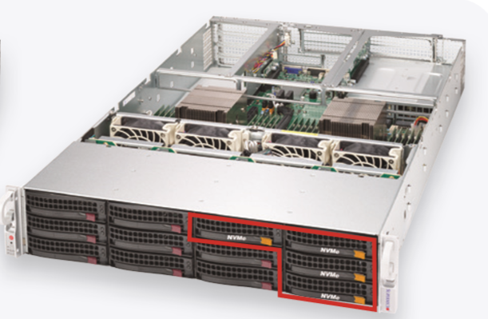
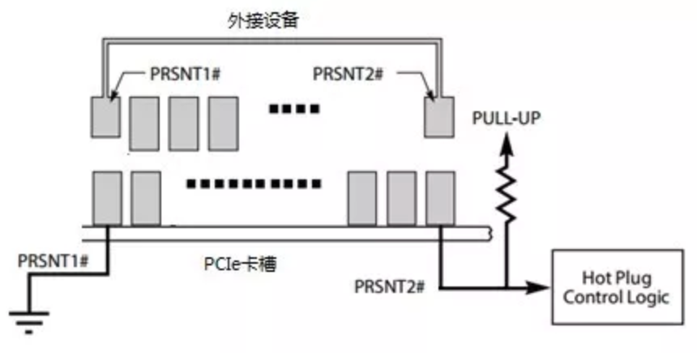
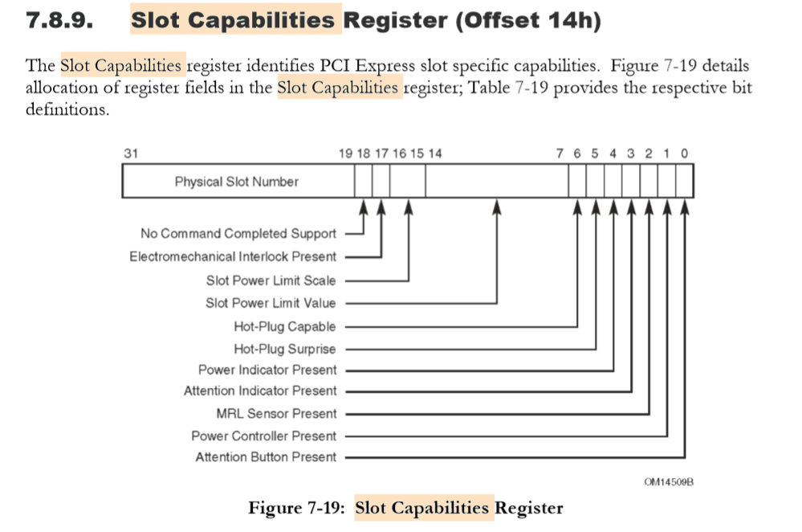
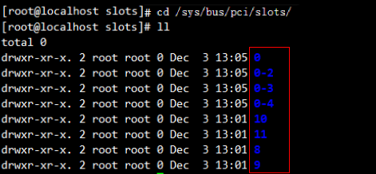
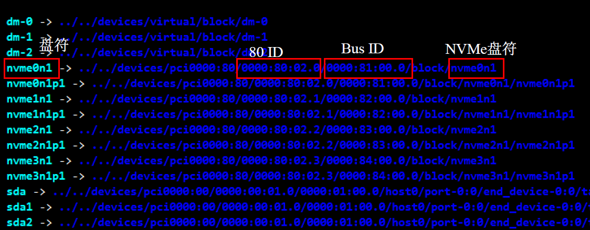

[TOC]

# 概述

在企业级用户的业务场景中，对性能的需求越来越高，更高 IOPS、更低且高一致性的延时来满足快速的
数据访问。例如在线事务处理（OLTP），需要对实时的原始数据进行处理，力求通过并行查询和最小化响应
时间来提高单位时间内交易的数量；在线分析处理（OLAP），需要通过复杂的数据查询分析，为商业决策起
辅助作用；还有高性能计算，云计算，VDI 等应用。

我们已经进入数字时代， IDC 评估 2015 年数据量为 7.2 ZB，预计到 2020 年数据会增长近七倍到 44 ZB。正因如此，面对巨量的数据增长和对庞大数据的高效处理，高速存储介质 SSD 成为当今数据中心不可或缺的基础设备。

# 1. 热插拔

热插拔功能是PCIe SSD的一项重要功能， 能大大简化设备更换和调试步骤。特别是在服务器厂商推出支持 U.2 接口的产品后，对热插拔的需求更加广泛。




## 1.1 基本概念

热插拔（Hot-plug）功能是允许用户在不关闭系统，不切断电源的情况下取出和更换设备，从而提高了系统对灾难的及时恢复能力、增强扩展性和灵活性等。支持热插拔的平台能够保证在热插入（Hot Insertion）的时候，自动检测到设备并将其注册到相应驱动，在热拔出的时候，能够自动检测到设备丢失并从驱动移除，整个过程不需要系统重启。 并且在热插拔操作之后，系统和设备能够正常工作。

## 1.2 类型

热插拔操作看似简单，但是根据设备是否带电、操作系统是否提前得到通知等因素，热插拔有多重操作场景。
根据场景的不同，热插拔可以分为以下四类具体的操作：


热插拔类型 | 场景描述
---|---
热添加/热插入(Hot Add/Hot Insertion) | 将 PCIe SSD 插入带电、OS 正在运行的系统中，或者同时有上层 软件（RAID）正在管理使用 SSD。通常该操作是为了扩容或者替换失效的设备。
正常热移除(Orderly Hot Removal)|通知操作系统，提前禁用设备的情况下进行拔出动作。已知设备失效，停止和设备的通信，或从上层软件中移除。
热交换(Hot Swap) | 热拔出动作后又进行了热添加动作。 通常是进行失效设备的替换。
意外热移除(Surprise Hot Removal ) | 当系统还在使用 PCIe SSD 时，设备被突然拔出，这时可能还有 IO的通信，这种操作不推荐使用。

## 1.3 基本原理

从硬件层面讲，卡槽的 PCIe 引脚 PRSNT2#能够随着外接设备的接入和拔出得到不同的电平，从而触发热插拔事件， 如下图。PCIe3.0 协议规定了多个热插拔事件和热插拔支持功能，如 Attention Button，电源控制（Power Control） 等，各类服务器对热插拔的支持也不相同。最基础的，热插拔卡槽需要具备产生 Presence Status Change 事件的能力。




PCIe Capabilities 寄存器提供了热插拔相关配置和状态信息。在 Intel DC P3600 接入系统后，可通过 lspci –t 查看 其对应的 PCIe 卡槽信息，下文中<bus:dev.function>均表示的是热插拔测试中与 Intel DC P3600 对应的 PCIe 卡槽。

需要指出的是，热插拔事件可以由 BIOS（ACPI）处理，也可以由操作系统处理，P3600 推荐由操作系统处理的方式，如果 BIOS 中有 ACPI hot-plug 选项，请选择否。

1. 检查 Linux Kernel 是否编译 hotplug driver，确认 linux 内核编译配置文件设置以下项：

```
CONFIG_HOTPLUG_PCI_PCIE=y
CONFIG_HOTPLUG_PCI=y
CONFIG_HOTPLUG_PCI_ACPI=y
```

2. 检查NVME驱动是否加载成功，使用如下命令查看 NVMe 驱动版本

```shell
#> cat /sys/module/nvme/version
```

> 在 Linux 系统下，需要将内核升级至 3.14 以上保证原生 NVMe 驱动对热插拔的支持。

3. 确认PCIe槽是否支持热插拔

```shell
#> lspci –s <bus:dev.function> -vvv | grep –i hotplug

               SltCap: AttnBtn+ PwrCtrl+ MRL- 

               AttnInd+ PwrInd+ HotPlug+ Surprise+
```
如上述命令返回的消息中包含 Hotplug+和 Surprise+信息，则证明该槽位支持热插拔功能。

可以看到，该卡槽还配备电源控制等功能。下面则进一步介绍了PCIe 槽热插拔功能的细节：

1. 检查对应槽位上是否注册了 Hot-plug service，如下信息（通过 dmesg 命令获取）显示了 slot #8 加载了pciehp driver
```
[9.137143] pciehp 0000:00:03.1:pcie04: Slot #8 AttnBtn+ AttnInd+ PwrInd+ PwrCtrl+ MRL- Interlock- NoCompl- LLActRep+
[10.136681] pciehp 0000:00:03.1:pcie04: service driver pciehp loaded
```

2. 检查对应槽位是否设置了相关寄存器



获取 slot 的 Capabilities 信息，如下命令返回 Hex 值，bit值为1表示具备相应能力。
- bit 1 (Power Control)
- bit 5 (Hotplug Surprise)
- bit 6 (Hotplug Capable)

```
#> setpci -s <bus:dev.function> CAP_EXP+0x14.b  
```
获取 Slot 控制寄存器信息，确定 bit3（Presence Detect Changed Enable），bit5（Hotplug Interrupt Enable） 和 bit12（Data Link Layer State Changed Enable）设置为 1.

```
#> setpci -s <bus:dev.function> CAP_EXP+0x18.w 
```
- Presence Detect Changed Enable 位控制槽位在检测到外接设备接入或拔出时是否发送中断。
- Data Link Layer State Changed Enable 位控制槽位在检测到链路状态发生变化时是否发送中断。


# 1.4 意外热插拔
意外热移除（Surprise Hot-plug）是一种比较有风险的操作。即使在测试充分和支持良好的平台上，也会有对系统产生负面影响的风险，比如对有 I/O 访问的设备进行拔盘操作，会使得存储在系统缓存中的 I/O 数据丢失，这种操作一方面触发上层应用处理这类错误，另一方面， Linux 自带的 NVMe 驱动会出现 hung 住等问题。

所以拔盘时，建议优先使用正常热移除(Orderly Hot Removal)，介绍如下：

1. 停止当前和待移除设备相关的进程（如可能访问设备的数据库等）
2. Umount 与该设备相关的文件系统
3. 向系统发出移除设备信号
```
#> echo 0 > /sys/bus/pci/slots/<SSD_SLOT_NUM>/power
```
> SSD_SLOT_NUM 是待移除设备对应的 PCIe 卡槽编号，可通过 lspci 命令获得。

> 等待系统移除设备（可通过 lsblk 等命令查看）后再执行手动拔盘操作。

# 1.6 热插拔案例

## 1.6.1 查看NVMe盘符、SlotID和BusID






通过Slot ID和Bus ID的关系，找到NVMe PCIe 固态硬盘盘符和Slot ID的对应关系。

例如：如上图所示nvme0n1对应的Bus ID是0000:81:00.0，80 ID是0000:80:02.0，nvme0n1对应的slot ID就是8。

> 理论上，2中的Slot ID和服务器表面的Slot #（#取值为8 ～ 11）是一致的，但因系统差异，可能导致起始号排列不同，此时需要用到4中的80 ID，80 ID的dev.func ID（如0000:80:02.0的dev.func ID为02.0）的排序对应着Slot #的排序。

## 1.6.2 关键步骤

CentOS7下所采用热插拔实现的方式 如果在最近一次编译中选择了PCI Express 热插拔功能，而且驱动是以模块方式存在，那么，可以在命令行下键入以下内容：
```
$> modprobe pciehp
```

如果驱动成功，则可以在/sys/bus/pci/slots/下面发现以可热插拔插槽编号命名的目录，进入相关目录，可以进行下一步操作。

```
echo 1 >power开启某个插槽上的电源 ，进行热插入
echo 0 >power关闭某个插槽上的电源，执行热拔出
```

若不能加载pciehp驱动，一般是由于硬件不支持或者固件缺少OSHP方法或ACPI _OSC (Operating System Capabilities) 方法之一。


# 1.7 BUGS

问题原因：

使用默认的 Centos7 内核设置时，热插入 NVMe 存储驱动器将导致设备的 PCIe 配置设置不正确。热插拔的 NVMe 存储驱动器的 MPS (MaxPayloadSiz) 和 MRR (MaxReadRequest) 的值将不同于 PCIe 开关或 NVMe 所插入到的根端口的值。尝试使用包含这些不匹配设置的驱动器将导致致命的 PCIe 错误、系统复位，并且可能会导致数据损坏。

解决方法：

必须在引导时传递一个内核参数，用以将热插拔的 NVMe 存储驱动器的 MPS 和 MRR 值设置为上游 PCIe 根端口和它所连接到的开关支持的（相同）值。在尝试任何热插拔操作之前，用户应当为其引导装载程序配置以下参数。

RHEL7内核增加如下参数：
```
    pci=pcie_bus_perf aspm=off
```

Workaround L1 Limiation
```
in BIOS, set PCIE ASPM to disable
```

Workaround Linux PCIe Max Plyload Sie mismatch:
```
Set kernel boot time parameter to pci=pcie_bus_perf as a workaround.
the MPS issues are intended to be addressed by Linux 4.3.
```