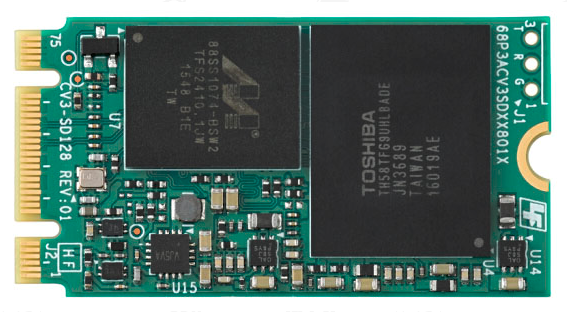
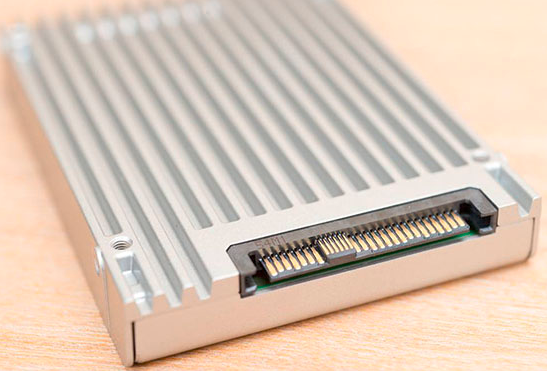

# EASY SSD GUIDE: SATA, MSATA, SATA express, M.2 AND U.2

## 1. SATA
STAT（Serial Advanced Technology Attachment，串行高级技术附件）是一种基于行业标准的串行硬件驱动器接口，是由Intel、IBM、Dell、APT、Maxtor和Seagate公司共同提出的硬盘接口规范。现在主流为SATA3.0，速率可达到6.0Gbps.SATA Spec中定义了物理层、链路层、传输层的标准，以及传输协议、关键数据结构FIS等的定义，SATA下面有2中mode可以选择：AHCI和IDE。

### 1. IDE模式
IDE的英文全称为“IntegratedDrive Electronics”，即“电子集成驱动器”，它的本意是指把“硬盘控制器”与“盘体”集成在一起的硬盘驱动器。又称PATA接口，最大速率为133MB/s，现在已经完全被SATA所取代，但是为了兼容的原因，不管是BIOS还是OS下仍然保留IDE模式，该模式可以将SATA盘映射模拟成普通IDE硬盘，无需额外加载SATA驱动。但不支持任何SATA接口的新特性。

### 1.2 AHCI模式
AHCI（Serial ATA AdvancedHost Controller Interface），又名串行ATA高级主控接口/高级主机控制器接口。
AHCI通过包含一个PCI BAR（基址寄存器），来实现原生SATA功能，允许存储驱动程序启用高级串行 ATA 功能。
AHCI模式是专门为SATA接口而设计，支持SATA接口特性，诸如本机命令队列(NCQ)和热插拔。
但是需要用户在BIOS中选择AHCI模式，方便操作系统自动加载AHCI驱动。AHCI 协议主要定义了Host端的寄存器、错误处理、电源管理等。

## 2. mSATA

msata是SATA协会开发的新的mini-SATA(mSATA)接口控制器的产品规范，新的控制器可以让SATA技术整合在小尺寸的装置上。
同时mSATA将提供跟SATA接口标准一样的速度和可靠度，提供小尺寸CE产品(如Notebooks/Netbook)的系统开发商和制造商更高效能和符合经济效益的储存方案。

## 3. M.2

取代mSATA的接口是M.2接口，最初叫做NGFF，全名是（Next Generation Form Factor），它可以做的比mSATA硬盘还要小巧，基本长宽只有22x42，单面厚度2.75mm，双面闪存布局也不过3.85mm厚，但M.2又有丰富的可扩展性，最长可以做到110mm，可以提高SSD容量。

此外，M.2接口可以同时支持SATA及PCI-E通道，后者更容易提高速度，早期的M.2接口使用的是PCI-E 2.0 x2通道，理论带宽10Gbps，不过在系芯片组更新之后，M.2接口现在全面转向PCI-E 3.0 x4通道，理论带宽达到了32Gbps，远高于之前水准，大大提升了SSD性能潜力。

- M.2 2242接口（完全兼容mSATA）：

- M.2 2280（SATA通道）接口：

- M.2 2280（NVMe-PCIe通道）接口：

### 3.1 NVMe

NVMe(Non-Volatile Memory express)，是一种建立在M.2接口上类似AHCI的一种协议，是专门为闪存类存储设计的协议。

目前支持NVMe控制器的SSD主要包括PCI-E、M.2、U.2三种接口。

## 4. PCIe

早在SATA接口的SSD发展之初，PCI-E接口的SSD就出现了，其他SSD不论采用什么接口，都是从SATA向原生PCI-E走进，而PCI-E接口的SSD直接是一步到位，省去了中间过程。

Intel 750硬盘是目前高性能PCI-E硬盘的代表跟显卡类似，PCI-E硬盘的规格也会根据长度、高度分为全高/半高、全长/半长等不同级别，最常见的PCI-E硬盘多是HHHL半高半长的，长度为167mm。

PCI-E接口的硬盘速度也逐渐从当初的PCI-E 2.0 x2走向了PCI-E 3.0 x4通道，速度也达到了32Gbps，而且早期PCI-E硬盘不能做启动盘的问题也解决了，现在旗舰级SSD大多会选择PCI-E接口。

## 5. SATA Express

M.2接口解决了mSATA接口的后继问题，SATA 6Gbps接口在6Gbps速度之后，SATA接口要想继续提高速度，SATA-IO给出的解决方案是SATA Express(SATA E)接口。

为了提高接口带宽，SATA E接口放弃了SATA通道，走向了PCI-E通道，他们选择的是PCI-E x2通道，具体有PCI-E 2.0 x2或者PCI-E 3.0 x2两种选择，因此就有了10Gbps以及16Gbps两种，最初是10Gbps居多，现在的主板逐渐开始提供16Gbps的SATA E接口，因为100系芯片组的南桥通道数量大幅提升了。 无论厂商选择PCI-E 2.0还是PCI-E 3.0方案，接口速度相对原来的6Gbps都有了明显的提升，带宽更不是瓶颈了。

## 6. U.2

U.2接口别称SFF-8639，U.2的设备端接口融合了SATA及SAS接口的特点，U.2不但能支持SATA-Express规范，还能兼容SAS、SATA等规范，主板一端是mini SAS(SFF-8643)接口，设备端的U.2线则是一端接在SATA电源上，一端接在U.2硬盘的数据口上。因此大家可以把它当做是四通道版本的SATA-Express接口，它的理论带宽已经达到了32Gbps，与M.2接口毫无差别。

## 7. SSD接口对比

\ | SATA3 | mSATA | SATA Express | M.2 | PCIe | U.2 
---|---|---|---|---|---|---
速度 | 6Gbps | 6Gbps | 10/16Gbps | 10/32Gbps | 20/32Gbps | 32Gbps
规格 | 2.5/3.5英寸 | 30mm/50mm | 2.5/3.5英寸 | 22*{42,60,80,110}mm | 半高/全高 | 2.5英寸
通道 | SATA | SATA | PCIe x2 | PCIe x2/PCIe x4/SATA | PCIe x2/PCIe x4 | PCIe x2/PCIe x4/SATA
工作电压 | 5V | 3.3V | 5V | 3.3V | 3.3V/12V | 3.3V/12V
体积  | 大 | 小 | 大 | 小 | 大 | 大

## 8. 总结

- M.2接口是一种比较小的PCIe接口，在物理上兼容SATA；
- NVMe可以看成是SCSI命令和AHCI一样的东西；
- U.2和M.2是一种硬件接口的标准，将SATA/SAS/PCIe进行了统一；
- U.2是一种和传统SATA/SAS外观上保持一致的接口，兼容SATA/SAS和PCIe；

有了这种物理接口标准后，硬件工程师也有章可循了。从整个数据链路来看，从驱动程序、硬件接口、控制器逻辑接口
到固件程序的命令处理方式都可以采用标准化的处理方式了。