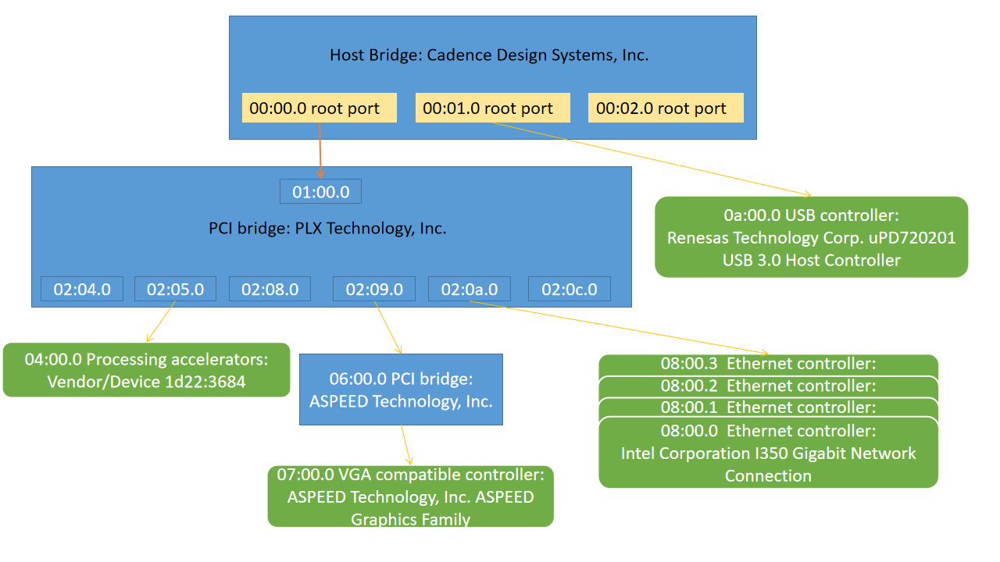

#  PCI topology 

```
[root@localhost ~]# lspci
00:00.0 PCI bridge: Cadence Design Systems, Inc. Device fc16
00:01.0 PCI bridge: Cadence Design Systems, Inc. Device fc01
00:02.0 PCI bridge: Cadence Design Systems, Inc. Device fc16
01:00.0 PCI bridge: PLX Technology, Inc. Device 8764 (rev ab)
02:04.0 PCI bridge: PLX Technology, Inc. Device 8764 (rev ab)
02:05.0 PCI bridge: PLX Technology, Inc. Device 8764 (rev ab)
02:08.0 PCI bridge: PLX Technology, Inc. Device 8764 (rev ab)
02:09.0 PCI bridge: PLX Technology, Inc. Device 8764 (rev ab)
02:0a.0 PCI bridge: PLX Technology, Inc. Device 8764 (rev ab)
02:0c.0 PCI bridge: PLX Technology, Inc. Device 8764 (rev ab)
04:00.0 Processing accelerators: Device 1d22:3684 (rev 01)
06:00.0 PCI bridge: ASPEED Technology, Inc. AST1150 PCI-to-PCI Bridge (rev 04)
07:00.0 VGA compatible controller: ASPEED Technology, Inc. ASPEED Graphics Family (rev 41)
08:00.0 Ethernet controller: Intel Corporation I350 Gigabit Network Connection (rev 01)
08:00.1 Ethernet controller: Intel Corporation I350 Gigabit Network Connection (rev 01)
08:00.2 Ethernet controller: Intel Corporation I350 Gigabit Network Connection (rev 01)
08:00.3 Ethernet controller: Intel Corporation I350 Gigabit Network Connection (rev 01)
0a:00.0 USB controller: Renesas Technology Corp. uPD720201 USB 3.0 Host Controller (rev 03)
0b:00.0 PCI bridge: PLX Technology, Inc. Device 8764 (rev ab)
0c:04.0 PCI bridge: PLX Technology, Inc. Device 8764 (rev ab)
0c:05.0 PCI bridge: PLX Technology, Inc. Device 8764 (rev ab)
0c:06.0 PCI bridge: PLX Technology, Inc. Device 8764 (rev ab)
0c:07.0 PCI bridge: PLX Technology, Inc. Device 8764 (rev ab)
0c:08.0 PCI bridge: PLX Technology, Inc. Device 8764 (rev ab)
0c:09.0 PCI bridge: PLX Technology, Inc. Device 8764 (rev ab)
0c:0c.0 PCI bridge: PLX Technology, Inc. Device 8764 (rev ab)
0c:0d.0 PCI bridge: PLX Technology, Inc. Device 8764 (rev ab)
0c:0e.0 PCI bridge: PLX Technology, Inc. Device 8764 (rev ab)
0d:00.0 USB controller: Renesas Technology Corp. uPD720201 USB 3.0 Host Controller (rev 03)
10:00.0 SATA controller: Marvell Technology Group Ltd. 88SE9230 PCIe SATA 6Gb/s Controller (rev 11)
13:00.0 RAID bus controller: LSI Logic / Symbios Logic MegaRAID SAS-3 3108 [Invader] (rev 02)
```

```
[root@localhost ~]# lspci -tv
-[0000:00]-+-00.0-[01-09]----00.0-[02-09]--+-04.0-[03]--
           |                               +-05.0-[04]----00.0  Device 1d22:3684
           |                               +-08.0-[05]--
           |                               +-09.0-[06-07]----00.0-[07]----00.0  ASPEED Technology, Inc. ASPEED Graphics Family
           |                               +-0a.0-[08]--+-00.0  Intel Corporation I350 Gigabit Network Connection
           |                               |            +-00.1  Intel Corporation I350 Gigabit Network Connection
           |                               |            +-00.2  Intel Corporation I350 Gigabit Network Connection
           |                               |            \-00.3  Intel Corporation I350 Gigabit Network Connection
           |                               \-0c.0-[09]--
           +-01.0-[0a]----00.0  Renesas Technology Corp. uPD720201 USB 3.0 Host Controller
           \-02.0-[0b-15]----00.0-[0c-15]--+-04.0-[0d]----00.0  Renesas Technology Corp. uPD720201 USB 3.0 Host Controller
                                           +-05.0-[0e]--
                                           +-06.0-[0f]--
                                           +-07.0-[10]----00.0  Marvell Technology Group Ltd. 88SE9230 PCIe SATA 6Gb/s Controller
                                           +-08.0-[11]--
                                           +-09.0-[12]--
                                           +-0c.0-[13]----00.0  LSI Logic / Symbios Logic MegaRAID SAS-3 3108 [Invader]
                                           +-0d.0-[14]--
                                           \-0e.0-[15]--
```


```
00:00.0  Bus: primary=00, secondary=01, subordinate=09 <Root Port> [Port #0, Speed 8GT/s, Width x16]
    01:00.0  Bus: primary=01, secondary=02, subordinate=09 <Upstream Port> [Port #0, Speed 8GT/s, Width x16]
        02:04.0  Bus: primary=02, secondary=03, subordinate=03 <Downstream Port> [Port #4, Speed 8GT/s, Width x8]
        02:05.0  Bus: primary=02, secondary=04, subordinate=04 <Downstream Port> [Port #5, Speed 8GT/s, Width x8]
            04:00.0 Processing accelerators: Vendor/Device 1d22:3684 <EndPoint> [Speed 2.5GT/s, Width x8]
        02:08.0  Bus: primary=02, secondary=05, subordinate=05 <Downstream Port> [Port #8, Speed 8GT/s, Width x8]
        02:09.0  Bus: primary=02, secondary=06, subordinate=07 <Downstream Port> [Port #9, Speed 8GT/s, Width x4]
            06:00.0  Bus: primary=06, secondary=07, subordinate=07 <PCI-Express to PCI/PCI-X Bridge> [Port #0, Speed 5GT/s, Width x1]
                07:00.0 VGA compatible controller: ASPEED Technology, Inc. ASPEED Graphics Family <EndPoint> [Speed 5GT/s, Width x1]
        02:0a.0  Bus: primary=02, secondary=08, subordinate=08 <Downstream Port> [Port #10, Speed 8GT/s, Width x4]
            08:00.0  Ethernet controller: Intel Corporation I350 Gigabit Network Connection <Endpoint> [Speed 5GT/s, Width x4]
            08:00.1  Ethernet controller: Intel Corporation I350 Gigabit Network Connection <Endpoint> [Speed 5GT/s, Width x4]
            08:00.2  Ethernet controller: Intel Corporation I350 Gigabit Network Connection <Endpoint> [Speed 5GT/s, Width x4]
            08:00.3  Ethernet controller: Intel Corporation I350 Gigabit Network Connection <Endpoint> [Speed 5GT/s, Width x4]
        02:0c.0  Bus: primary=02, secondary=09, subordinate=09 <Downstream Port> [Port #12, Speed 8GT/s, Width x16]

00:01.0  Bus: primary=00, secondary=0a, subordinate=0a <Root Port> [Port #0, Speed 8GT/s, Width x1]
    0a:00.0 USB controller: Renesas Technology Corp. uPD720201 USB 3.0 Host Controller <Endpoint> [Speed 5GT/s, Width x1]

00:02.0  Bus: primary=00, secondary=0b, subordinate=15 <Root Port> [Port #0, Speed 8GT/s, Width x16]
    0b:00.0  Bus: primary=0b, secondary=0c, subordinate=15 <Upstream Port> [Port #0, Speed 8GT/s, Width x16]
        0c:04.0  Bus: primary=0c, secondary=0d, subordinate=0d <Downstream Port> [Port #4, Speed 8GT/s, Width x4]
            0d:00.0  USB controller: Renesas Technology Corp. uPD720201 USB 3.0 Host Controller <EndPoint> [Speed 5GT/s, Width x1]
        0c:05.0  Bus: primary=0c, secondary=0e, subordinate=0e <Downstream Port> [Port #5, Speed 8GT/s, Width x4]
        0c:06.0  Bus: primary=0c, secondary=0f, subordinate=0f <Downstream Port> [Port #6, Speed 8GT/s, Width x4]
        0c:07.0  Bus: primary=0c, secondary=10, subordinate=10 <Downstream Port> [Port #7, Speed 8GT/s, Width x4]
            10:00.0 SATA controller: Marvell Technology Group Ltd. 88SE9230 PCIe SATA 6Gb/s Controller <EndPoint> [Speed 5GT/s, Width x2]
        0c:08.0  Bus: primary=0c, secondary=11, subordinate=11 <Downstream Port> [Port #8, Speed 8GT/s, Width x8]
        0c:09.0  Bus: primary=0c, secondary=12, subordinate=12 <Downstream Port> [Port #9, Speed 8GT/s, Width x8]
        0c:0c.0  Bus: primary=0c, secondary=13, subordinate=13 <Downstream Port> [Port #12, Speed 8GT/s, Width x8]
            13:00.0 RAID bus controller: LSI Logic / Symbios Logic MegaRAID SAS-3 3108 <EndPoint> [Speed 8GT/s, Width x8]
        0c:0d.0  Bus: primary=0c, secondary=14, subordinate=14 <Downstream Port> [Port #13, Speed 8GT/s, Width x4]
        0c:0e.0  Bus: primary=0c, secondary=15, subordinate=15 <Downstream Port> [Port #14, Speed 8GT/s, Width x4]
```




```shell
[root@jerrydai ~]# cat ./show_pci_lane.sh
#!/bin/bash

root_port_list=""

for br in `lspci -n | grep 0604 | awk '{print $1}'`
do
        lspci -vvv  -s $br | grep "Root Port" 2>&1 > /dev/null  && root_port_list+="$br "
done

tmp=""
echo "Host Bridge:"
for rp in $root_port_list
do
        lspci -vvv -s $rp | grep 'LnkCap' | awk -F ',' '{print $2 $3}'
done
[root@jerrydai ~]# ./show_pci_lane.sh
Host Bridge:
 Speed 8GT/s Width x16
 Speed 8GT/s Width x1
 Speed 8GT/s Width x16
```
