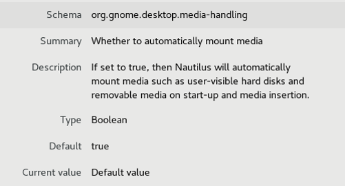

***CentOS7多用户运行级别自动挂在USB设备案例***

[TOC]

# 1. graphical运行级别USB设备自动挂载

Centos7在Graphical运行级别会启动GDM.sevice从而间接启动Gnome图形界面，由GNOME的Nautilus组件负责自动挂载USB设备。



# 2. Gsettings与Dconf

gsettings提供了对GSetings的命令行操作。GSetings实际上是一套高级API，用来操作dconf。

dconf存储着GNOME3的配置，是二进制格式。它做为GSettings的后端系统存在，暴露出低级API。在GNOME2时代，类似的角色是gconf，但它是以XML文本形式存储。

更接地气的说法是，dconf是GNOME3的注册表，gsettings是一个查询、读取、设置注册表键值的命令行工具。

 
- 列出所有schema
```
$> gsettings list-schemas | grep org.gnome.desktop
org.gnome.desktop.peripherals.trackball
org.gnome.desktop.screensaver
org.gnome.desktop.default-applications
org.gnome.desktop.background
org.gnome.desktop.default-applications.office.tasks
org.gnome.desktop.a11y.applications
org.gnome.desktop.wm.preferences
org.gnome.desktop.a11y.magnifier
org.gnome.desktop.a11y.mouse
org.gnome.desktop.session
org.gnome.desktop.media-handling
org.gnome.desktop.app-folders
org.gnome.desktop.sound
org.gnome.desktop.input-sources
org.gnome.desktop.default-applications.terminal
org.gnome.desktop.peripherals.mouse
org.gnome.desktop.default-applications.office.calendar
org.gnome.desktop.default-applications.office
org.gnome.desktop.a11y
org.gnome.desktop.peripherals
org.gnome.desktop.thumbnail-cache
org.gnome.desktop.peripherals.touchpad
org.gnome.desktop.calendar
org.gnome.desktop.notifications
org.gnome.desktop.privacy
org.gnome.desktop.interface
org.gnome.desktop.datetime
org.gnome.desktop.lockdown
org.gnome.desktop.wm.keybindings
org.gnome.desktop.peripherals.keyboard
org.gnome.desktop.search-providers
org.gnome.desktop.a11y.keyboard
org.gnome.desktop.thumbnailers
```

- 查找某个schema
```
$> gsettings list-schemas | grep org.gnome.desktop.media-handling
org.gnome.desktop.media-handling
```

- 递归显示某个schema

```
$> gsettings list-recursively  org.gnome.desktop.media-handling
org.gnome.desktop.media-handling automount-open true
org.gnome.desktop.media-handling automount true
org.gnome.desktop.media-handling autorun-x-content-start-app ['x-content/unix-software']
org.gnome.desktop.media-handling autorun-never false
org.gnome.desktop.media-handling autorun-x-content-ignore @as []
org.gnome.desktop.media-handling autorun-x-content-open-folder @as []
```

- 查看某个key的描述
```
$> gsettings describe org.gnome.desktop.media-handling automount
If set to true, then Nautilus will automatically mount media such as user-visible hard disks and removable media on start-up and media insertion.
```

- 获取key的值

```
$> gsettings get org.gnome.desktop.media-handling automount
true
```

- 设置key的值

```
$> gsettings set org.gnome.desktop.media-handling automount false
```
# 3. multi-user运行级别不自动挂载USB设备

在Multi-user运行级别不会启动Gnome图形，从而Nautilus组件不会工作，导致在Multi-user运行级别下不会自动挂载USB设备。

# 4. 在Multi-user运行级别下自动USB挂载设备

```
Name        : usbmount
Version     : 1.2.3
Release     : 1.tsinghua
Architecture: x86_64
Install Date: (not installed)
Group       : Applications/System
Size        : 2167
License     : GPLv3+
Signature   : (none)
Source RPM  : usbmount-1.2.3-1.tsinghua.src.rpm
Build Date  : Thu 16 Aug 2018 11:08:08 AM CST
Build Host  : centos7
Relocations : (not relocatable)
Packager    : Jerry Dai
URL         : https://github.com/DaiZhiyuan/usbmount
Summary     : automount USB drives with systemd
Description :
On inserting an USB drive, automounts the drive at /media/ as a
directory named by device label; just the device name if label is
empty: /media/sdb1.
```

