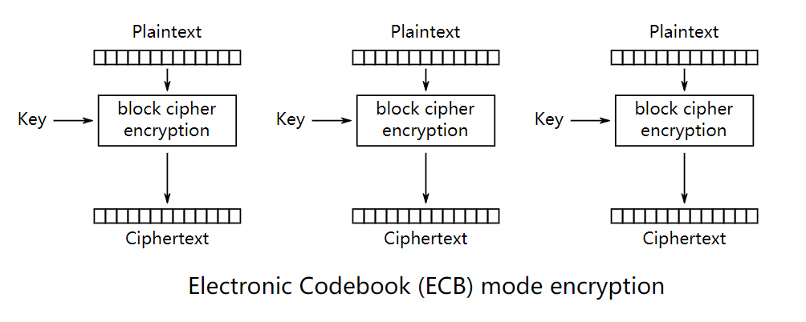
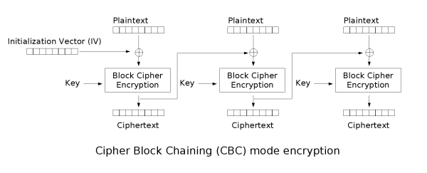

[TOC]

# 1. 密码学常用算法介绍

## 1.1 随机数

随机数在信息安全系统中扮演着重要的角色，在基于计算机或internet的通信和交易中有着广泛的应用。比如数据加密、密钥管理、公钥和私钥的产生、电子商务、数字签名、身份鉴定以及蒙特卡罗仿真等都要用到随机数。

## 1.2 算法分类

- 对称加密：数据的机密性
- 非对称加密：发送数据者的身份验证
- 单向加密：数据的机密性

# 2. 对称加密算法

Algorithm | Mode | Key Size | Block/IV Size 
---|---|---|---
DES | ECB | 64 | 8
DES | CBC | 64 | 8
TDES | ECB | 192 | 8
TDES | CBC | 192 | 8
AES | ECB | 128\|192\|256 | 16
AES | CBC | 128\|192\|256 | 16
SM4 | ECB | 128 | 16
SM4 | CBC | 128 | 16
CAMELLIA | ECB | 128 | 16
SEED | ECB | 128 | 16

## 2.1 分组模式

将明文按照（Block Size)大小分块，例如AES算法按照16字节分块，如果最后的块不够则需要填充数据。

填充数据规则：
1. 不满16的情况：差多少字节补多少个字节，补充内容为差的字节数。
2. 等于16的情况：遵循PKCS#5的要求，补充16个字节，补充内容为16。

### 2.1.1 ECB

CBC模式（密码分组链接：Cipher-block chaining）：ECB是最简单的块密码加密模式，加密前根据加密块大小（如AES为128位）分成若干块，之后将每块使用相同的密钥单独加密，解密同理。

**ECB加密流程：**

**ECB解密流程：**

**优点：**
1. 简单
2. 有利于并行计算
3. 误差不会被传递

**缺点:**
1. 不能隐藏明文的模式
2. 可能对明文进行主动攻击

### 2.1.2 CBC

CBC模式（密码分组链接：Cipher-block chaining）：CBC模式对于每个待加密的密码块在加密前会先与前一个密码块的密文异或然后再用加密器加密。第一个明文块与一个叫初始化向量的数据块异或。

**CBC加密流程：**

**CBC解密流程：**

**优点：**
1. 不容易主动攻击，安全性好于ECB，适合传输长度长的报文，是SSL、IPSec的标准。

**缺点:**
1. 不利于并行计算
2. 误差传递
3. 需要初始化向量IV

## 2.2 DES

DES算法为密码体制中的对称密码体制，又被称为美国数据加密标准，是1972年美国IBM公司研制的对称密码体制加密算法。

明文按64位进行分组，密钥长64位，密钥事实上是56位参与DES运算（第8、16、24、32、40、48、56、64位是校验位， 使得每个密钥都有奇数个1）分组后的明文组和56位的密钥按位替代或交换的方法形成密文组的加密方法。

## 2.3 TDES

3DES（或称为Triple DES）是三重数据加密算法（TDEA，Triple Data Encryption Algorithm）块密码的通称，它相当于是对每个数据块应用三次DES加密算法。

由于计算机运算能力的增强，原版DES密码的密钥长度变得容易被暴力破解；3DES即是设计用来提供一种相对简单的方法，即通过增加DES的密钥长度来避免类似的攻击，而不是设计一种全新的块密码算法。

## 2.4 AES

高级加密标准（英语：Advanced Encryption Standard，缩写：AES），在密码学中又称Rijndael加密法，是美国联邦政府采用的一种区块加密标准。

这个标准用来替代原先的DES，已经被多方分析且广为全世界所使用。经过五年的甄选流程，高级加密标准由美国国家标准与技术研究院（NIST）于2001年11月26日发布于FIPS PUB 197，并在2002年5月26日成为有效的标准。2006年，高级加密标准已然成为对称密钥加密中最流行的算法之一。

## 2.5 SM4

SM1为对称加密。其加密强度与AES相当。该算法不公开，调用该算法时，需要通过加密芯片的接口进行调用。

SM4无线局域网标准的分组数据算法。对称加密，密钥长度和分组长度均为128位。

SM4.0（原名SMS4.0）是中华人民共和国政府采用的一种分组密码标准，由国家密码管理局于2012年3月21日发布。相关标准为“GM/T 0002-2012《SM4分组密码算法》”。

## 2.6 CAMELLIA

Camellia是支持128、192和256的密钥长度，类似于AES算法。在2000年由日本电报电话公共公司与三菱机电公司共同研发。

## 2.7 SEED

SEED是对称加密算法，密钥长度和分组长度均为128位，在1998年由KISA(韩国信息安全局)研发。

# 3. 非对称加密算法

SM2算法和RSA算法比较：

算法 | SM2 | RSA
---|---|---
算法结构 | 基本椭圆曲线（ECC）| 基于特殊的可逆模幂运算 
计算复杂度 | 完全指数级 | 亚指数级
存储空间 | 192-256bit | 2048-4096bit
秘钥生成速度 | 较RSA算法快百倍以上 | 慢
解密加密速度 | 较快 | 一般

## 3.1 PKCS

PKCS 全称是 Public-Key Cryptography Standards ，是由 RSA 实验室与其它安全系统开发商为促进公钥密码的发展而制订的一系列标准。

PKCS 目前共发布过 15 个标准：

Number | Comment
:---:|---
PKCS#1 | RSA加密标准。PKCS#1定义了RSA公钥函数的基本格式标准，特别是数字签名。它定义了数字签名如何计算，包括待签名数据和签名本身的格式；它也定义了PSA公/私钥的语法。
PKCS#2 | 涉及了RSA的消息摘要加密，这已被并入PKCS#1中。
PKCS#3 | Diffie-Hellman密钥协议标准。PKCS#3描述了一种实现Diffie- Hellman密钥协议的方法。
PKCS#4 | 最初是规定RSA密钥语法的，现已经被包含进PKCS#1中。
PKCS#5 | 基于口令的加密标准。PKCS#5描述了使用由口令生成的密钥来加密8位位组串并产生一个加密的8位位组串的方法。PKCS#5可以用于加密私钥，以便于密钥的安全传输（这在PKCS#8中描述）。
PKCS#6 | 扩展证书语法标准。PKCS#6定义了提供附加实体信息的X.509证书属性扩展的语法。（当PKCS#6第一次发布时，X.509还不支持扩展。这些扩展因此被包括在X.509中）。
PKCS#7 | 密码消息语法标准。PKCS#7为使用密码算法的数据规定了通用语法，比如数字签名和数字信封。PKCS#7提供了许多格式选项，包括未加密或签名的格式化消息、已封装（加密）消息、已签名消息和既经过签名又经过加密的消息。
PKCS#8 | 私钥信息语法标准。PKCS#8定义了私钥信息语法和加密私钥语法，其中私钥加密使用了PKCS#5标准。
PKCS#9 | 可选属性类型。PKCS#9定义了PKCS#6扩展证书、PKCS#7数字签名消息、PKCS#8私钥信息和。PKCS#10证书签名请求中要用到的可选属性类型。已定义的证书属性包括E-mail地址、无格式姓名、内容类型、消息摘要、签名时间、签名副本（counter signature）、质询口令字和扩展证书属性。
PKCS#10 | 证书请求语法标准。PKCS#10定义了证书请求的语法。证书请求包含了一个唯一识别名、公钥和可选的一组属性，它们一起被请求证书的实体签名（证书管理协议中的PKIX证书请求消息就是一个PKCS#10）。
PKCS#11 | 密码令牌接口标准。PKCS#11或“Cryptoki”为拥有密码信息（如加密密钥和证书）和执行密码学函数的单用户设备定义了一个应用程序接口（API）。智能卡就是实现Cryptoki的典型设备。注意：Cryptoki定义了密码函数接口，但并未指明设备具体如何实现这些函数。而且Cryptoki只说明了密码接口，并未定义对设备来说可能有用的其他接口，如访问设备的文件系统接口。
PKCS#12 | 个人信息交换语法标准。PKCS#12定义了个人身份信息（包括私钥、证书、各种秘密和扩展字段）的格式。PKCS#12有助于传输证书及对应的私钥，于是用户可以在不同设备间移动他们的个人身份信息。
PKCS#13 | 椭圆曲线密码标准。PKCS#13标准当前正在完善之中。它包括椭圆曲线参数的生成和验证、密钥生成和验证、数字签名和公钥加密，还有密钥协定，以及参数、密钥和方案标识的ASN.1语法。
PKCS#14 | 伪随机数产生标准。PKCS#14标准当前正在完善之中。为什么随机数生成也需要建立自己的标准呢？PKI中用到的许多基本的密码学函数，如密钥生成和Diffie-Hellman共享密钥协商，都需要使用随机数。然而，如果“随机数”不是随机的，而是取自一个可预测的取值集合，那么密码学函数就不再是绝对安全了，因为它的取值被限于一个缩小了的值域中。因此，安全伪随机数的生成对于PKI的安全极为关键。
PKCS#15 | 密码令牌信息语法标准。PKCS#15通过定义令牌上存储的密码对象的通用格式来增进密码令牌的互操作性。在实现PKCS#15的设备上存储的数据对于使用该设备的所有应用程序来说都是一样的，尽管实际上在内部实现时可能所用的格式不同。PKCS#15的实现扮演了翻译家的角色，它在卡的内部格式与应用程序支持的数据格式间进行转换。

## 3.2 RSA

RSA加密算法是一种非对称加密算法。在公开密钥加密和电子商业中RSA被广泛使用。RSA是1977年由罗纳德·李维斯特（Ron Rivest）、阿迪·萨莫尔（Adi Shamir）和伦纳德·阿德曼（Leonard Adleman）一起提出的。当时他们三人都在麻省理工学院工作。RSA就是他们三人姓氏开头字母拼在一起组成的。

### 3.2.1  SET

SET(Secure Electronic Transaction)协议中要求CA采用2048bits长的密钥，其他实体使用1024比特的密钥。RSA密钥长度随着保密级别提高，增加很快。

保密级别 | 对称密钥长度（bit）| RSA密钥长度（bit）| ECC密钥长度（bit）| 保密年限
---|---|---|---|---
80 | 80 | 1024 | 160 | 2010
112 | 112 | 2048 | 224 | 2030
128 | 128 | 3072 | 256 | 2040
192 | 192 | 7680 | 384 | 2080
256 | 256 | 15360 | 512 | 2120

## 3.2 SM2

SM2算法和RSA算法都是公钥密码算法，SM2算法是一种更先进安全的算法，在我们国家商用密码体系中被用来替换RSA算法。
随着密码技术和计算机技术的发展，目前常用的1024位RSA算法面临严重的安全威胁，我们国家密码管理部门经过研究，决定采用SM2椭圆曲线算法替换RSA算法（特殊的可逆模幂运算）。

# 4. 单向加密算法

Algorithm | KeySzie(bit) | BlockSize | OuputSize(byte)
---|---|---|---
MD5 | done | 64 | 16
SHA-1 | done | 64 | 20
SHA-224 | done | 64 | 28
SHA-256 | done | 64 | 32
SM3 | done | 64 | 32
HMAC-MD5 | < 1M | 64 | 16
HMAC-SHA1 | < 2M | 64 | 20
HMAC-SHA224 | < 2M | 64 | 28
HMAC-SHA256 | < 2M | 64 | 32

## 4.1 MD5

MD5消息摘要算法（MD5 Message-Digest Algorithm），一种被广泛使用的密码散列函数，可以产生出一个128位（16字节）的散列值（hash value），用于确保信息传输完整一致。MD5由美国密码学家罗纳德·李维斯特（Ronald Linn Rivest）设计，于1992年公开，用以取代MD4算法。

## 4.2 SHA

SHA-1安全散列算法1（Secure Hash Algorithm 1）是一种密码散列函数，美国国家安全局设计，并由美国国家标准技术研究所（NIST）发布为联邦数据处理标准（FIPS）。SHA-1可以生成一个被称为消息摘要的160位（20字节）散列值，散列值通常的呈现形式为40个十六进制数。

## 4.3 SM3

SM3是中华人民共和国政府采用的一种密码散列函数标准，由国家密码管理局于2010年12月17日发布。相关标准为“GM/T 0004-2012 《SM3密码杂凑算法》”。

## 4.4 HMAC

HMAC散列消息身份验证码(Hashed Message Authentication Code)：它不是散列函数，而是采用散列函数（MD5 or 或SHA）与共享密钥一起使用的消息身份验证机制。

# 5. 随机数

随机数在计算机应用中使用的比较广泛，最为熟知的便是在密码学中的应用。随机数有3个特性，具体如下：

- 随机性：不存在统计学偏差，是完全杂乱的数列
- 不可预测性：不能从过去的数列推测出下一个出现的数
- 不可重现性：除非将数列本身保存下来，否则不能重现相同的数列

## 5.1 真随机与伪随机

**伪随机**：只要这个随机数是由确定算法生成的，那就是伪随机。

**真随机**：通过真实随机事件取得的随机数才是真随机数。

## 5.1 伪随机数发生器
    
PRNG：伪随机数发生器（Pseudo Random Numeral Generator），伪随机数发生器用于在系统需要随机数的时候，通过一系列种子值计算出来的伪随机数。因为生成一个真正意义上的“随机数”对于计算机来说是不可能的，伪随机数也只是尽可能地接近其应具有的随机性，但是因为有“种子值”，所以伪随机数在一定程度上是可控可预测的。

## 5.2 真随机数发生器

HRNG：物理真随机数发生器(Hardware Random Numeral Generator)，使用电子元件的噪音生成随机数。

应用场景：比如数据加密、密钥管理、公钥和私钥的产生、电子商务、数字签名、身份鉴定以及蒙特卡罗仿真等都要用到随机数。

