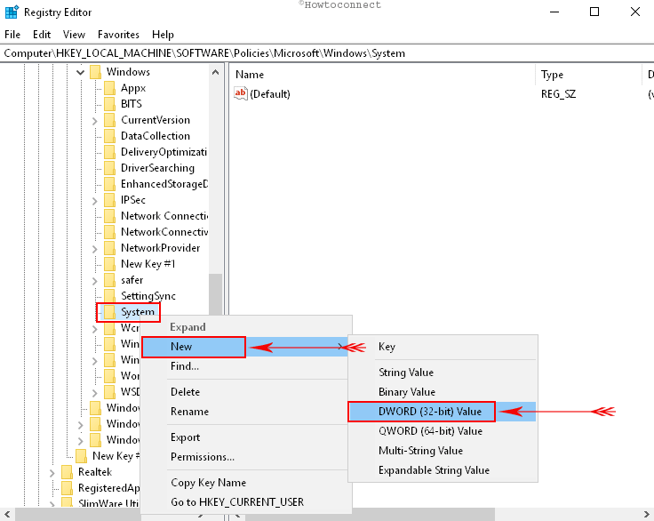
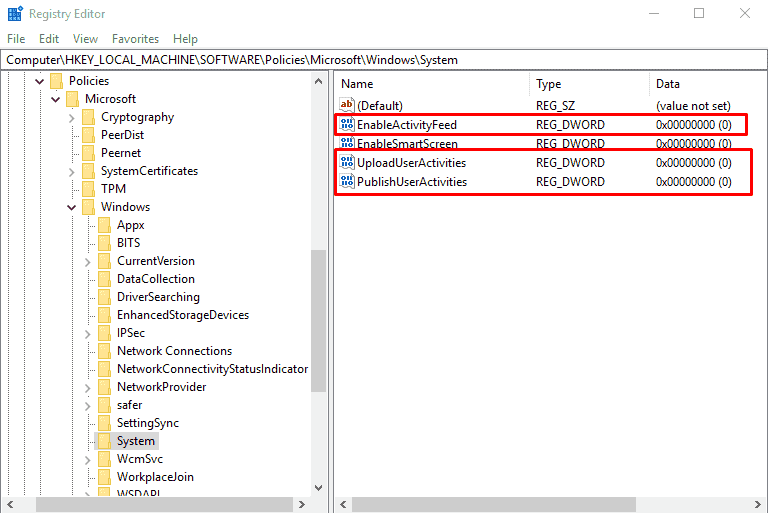

***Come over to the last way now to Disable Windows 10 Timeline via Registry Hack***

Step#1: Open the Run Command using the “Windows key + R” hotkey.

Step#2: After typing regedit.exe, click OK to open the Registry editor. Deal with the UAC by selecting Yes on the Pop up.

Step#3: Now browse the following path:
HKEY_LOCAL_MACHINE\SOFTWARE\Policies\Microsoft\Windows\System

Step 4: Make a right-click the System (folder) from the left pane, choose “New” and then press “DWORD (32-bit) Value” on the extended menu.

Step#5: Name the key EnableActivityFeed.

Step#6: Double-click the newly created key and maintain its value to 0.

Step#7: Again perform a right click the ‘System’, select New and click on theDWORD (32-bit) Value.

Step#8: This time name the key PublishUserActivities.

Step#9: As done in step 6, again double-click the newly created key and make sure its value is to 0

Step#10: once more, perform a right click the ‘System’ (folder) key, pick New and hit the “DWORD (32-bit) Value”.

Step#11: Give it the name UploadUserActivities.

Step#12: Double-click this new key and make sure to keep its value to 0.

Having done this, exit the registry editor, restart your system and now your Timeline should be disabled.

Furthermore, if you feel like enabling it anytime in the future, switch to same steps outlined above except Step 4, where you will have to right-select Delete for the EnableActivityFeed, PublishUserActivities, and UploadUserActivities keys, and then reboot your device.
