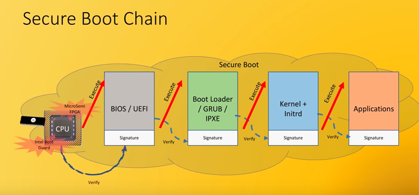

# 1. UEFI简介

UEFI全称“统一的可扩展固件接口”(Unified Extensible Firmware Interface)，是一种详细描述类型接口的标准。这种接口用于操作系统与平台固件之间。

可扩展固件接口（Extensible Firmware Interface，EFI）是 Intel 为 PC 固件的体系结构、接口和服务提出的建议标准。其主要目的是为了提供一组在 OS 加载之前（启动前）在所有平台上一致的、正确指定的启动服务，被看做是有近20多年Legacy BIOS 的继任者。

UEFI是由EFI1.10为基础发展起来的，它的所有者已不再是Intel，而是一个称作Unified EFI Form的国际组织。

主要组成部分有：
    
index | Section
---|---
1 | Boot Manager
2 | EFI System Table
3 | GUI Partion Table(GPT) Format
4 | Services —— Boot Services
5 | Services —— Runtime Services
6 | Protocols —— EFI Loaded Image
7 | Protocols —— Device Path Protocol
8 | Protocols —— UEFI Driver Model
9 | Protocols —— Console Support
10 | Protocols —— Media Access
11 | Protocols —— PCI Bus Support
12 | Protocols —— SCSI Driver Models and Bus Support
13 | Protocols —— iSCSI Boot
14 | Protocols —— USB Support
15 | Protocols —— Debugger Support
16 | Protocols —— Compression Algorithm Specification
17 | Protocols —— ACPI Protocols
18 | EFI Byte Code Virtual Machine 
19 | Network Protocols —— SNP, PXE and BIS
20 | Network Protocols —— Managed Network
21 | Network Protocols —— VLAN and EAP
22 | Network Protocols —— TCP,IP,IPsec, FTP and Configuration
23 | Network Protocols —— ARP and DHCP
24 | Network Protocols —— UDPv4 and MTFPv4
25 | Security —— Driver Signing and Hash

# 2. Legacy BIOS与 UEFI firmware区别

# 3. UEFI平台分类

# 5. 可插拔多媒体设备中UEFI启动过程

Booting to a Removable Media Device To make a removable device bootable the UEFI application simply needs to be renamed to BOOTx64.EFI (case insensitive) and placed in the \EFI\BOOT directory in a FAT32 partition.  

When a removable device such as a USB key is detected in UEFI Boot Mode, a boot option at the end of the current boot list is automatically
added to point to the following location: \EFI\BOOT\BOOTx64.EFI

# 3. 常规引导流程

# 4. 安全启动引导流程

# 5. TCG与TPM

## 5.1 TCG
TCG（Trusted Computing Group）中文名为可信计算组织，组织主要成员有AMD、Intel、Microsoft、HP、IBM、Sumsung、Huawei、Lenovo等，旨在建立个人电脑的可信计算概念。

TCG组织制定了TPM（Trusted Platform Module）的标准，很多安全芯片都是符合这个规范的。

TISO/IEC 11889:2015 TPM 2.0 标准：
- ISO/IEC 11889-1:2015 Information technology — TPM Library — Part 1: Architecture
- ISO/IEC 11889-2:2015 Information technology — TPM Library — Part 2: Structures
- ISO/IEC 11889-3:2015 Information technology — TPM Library — Part 3: Commands
- ISO/IEC 11889-4:2015 Information technology — TPM Library — Part 4: Supporting Routines

## 5.2 TPM

TPM(Trusted Platform Module)安全芯片是指符合TPM（可信赖平台模块）标准的安全芯片，它能有效地保护PC、防止非法用户访问。

## 5.3 传统PC引导流程

## 5.4 基于TPM安全芯片的PC引导流程

# 6. UEFI Secure Boot Keys

# 7. UEFI签名与校验

## 7.1 签名

## 7.2 校验

## 7.3 嵌入证书信息

