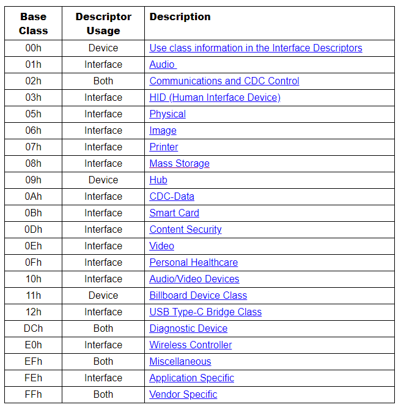

***USB设备与USB控制器***

[TOC]

# 1 概述

在使用QEMU/KVM时，有些场景需要透传PCI设备给GuestOS。

> 例如：将某块磁盘透传给GuestOS，主机上有多种USB设备、多个USB控制器，那么怎么找出你想要透传的USB设备隶属于哪个控制器并得到BDF，从而完成透传的目的？

## 1.1 获取USB控制器信息
lspci - list all PCI devices

```
[root@centos7 ~]# lspci  | grep -i usb
00:14.0 USB controller: Intel Corporation 8 Series/C220 Series Chipset Family USB xHCI (rev 04)
00:1a.0 USB controller: Intel Corporation 8 Series/C220 Series Chipset Family USB EHCI #2 (rev 04)
00:1d.0 USB controller: Intel Corporation 8 Series/C220 Series Chipset Family USB EHCI #1 (rev 04)
```


## 1.2 获取USB设备基本设备信息
lsusb - list USB devices

```
[root@centos7 ~]# lsusb -tv
/:  Bus 04.Port 1: Dev 1, Class=root_hub, Driver=xhci_hcd/2p, 5000M
/:  Bus 03.Port 1: Dev 1, Class=root_hub, Driver=xhci_hcd/10p, 480M
    |__ Port 3: Dev 80, If 0, Class=Human Interface Device, Driver=usbhid, 1.5M
    |__ Port 4: Dev 3, If 0, Class=Human Interface Device, Driver=usbhid, 1.5M
    |__ Port 4: Dev 3, If 1, Class=Human Interface Device, Driver=usbhid, 1.5M
    |__ Port 9: Dev 81, If 0, Class=Mass Storage, Driver=uas, 480M
/:  Bus 02.Port 1: Dev 1, Class=root_hub, Driver=ehci-pci/2p, 480M
    |__ Port 1: Dev 2, If 0, Class=Hub, Driver=hub/6p, 480M
/:  Bus 01.Port 1: Dev 1, Class=root_hub, Driver=ehci-pci/2p, 480M
    |__ Port 1: Dev 2, If 0, Class=Hub, Driver=hub/4p, 480M
```

## 1.2.1 USB协议与速率

协议：
- USB 1.0 / UHCI (Universal Host Controller Interface) 
- USB 2.0 / EHCI (Enhanced Host Controller Interface)
- USB 3.0 / XHCI (eXtensible Host Controller Interface) 

速率：
- Low Speed - 1.5Mb/s 
- Full Speed - 12Mb/s
- High Speed - 480Mb/s
- Super Speed - 5Gb/s

## 1.2.2 USB种类代码



## 1.2.3 获取USB设备详细信息
usb-devices - print USB device details
```
T:  Bus=01 Lev=00 Prnt=00 Port=00 Cnt=00 Dev#=  1 Spd=480 MxCh= 2
D:  Ver= 2.00 Cls=09(hub  ) Sub=00 Prot=00 MxPS=64 #Cfgs=  1
P:  Vendor=1d6b ProdID=0002 Rev=03.10
S:  Manufacturer=Linux 3.10.0-693.el7.centos.x86_64.debug ehci_hcd
S:  Product=EHCI Host Controller
S:  SerialNumber=0000:00:1a.0
C:  #Ifs= 1 Cfg#= 1 Atr=e0 MxPwr=0mA
I:  If#= 0 Alt= 0 #EPs= 1 Cls=09(hub  ) Sub=00 Prot=00 Driver=hub

    T:  Bus=01 Lev=01 Prnt=01 Port=00 Cnt=01 Dev#=  2 Spd=480 MxCh= 4
    D:  Ver= 2.00 Cls=09(hub  ) Sub=00 Prot=01 MxPS=64 #Cfgs=  1
    P:  Vendor=8087 ProdID=8008 Rev=00.04
    C:  #Ifs= 1 Cfg#= 1 Atr=e0 MxPwr=0mA
    I:  If#= 0 Alt= 0 #EPs= 1 Cls=09(hub  ) Sub=00 Prot=00 Driver=hub

T:  Bus=02 Lev=00 Prnt=00 Port=00 Cnt=00 Dev#=  1 Spd=480 MxCh= 2
D:  Ver= 2.00 Cls=09(hub  ) Sub=00 Prot=00 MxPS=64 #Cfgs=  1
P:  Vendor=1d6b ProdID=0002 Rev=03.10
S:  Manufacturer=Linux 3.10.0-693.el7.centos.x86_64.debug ehci_hcd
S:  Product=EHCI Host Controller
S:  SerialNumber=0000:00:1d.0
C:  #Ifs= 1 Cfg#= 1 Atr=e0 MxPwr=0mA
I:  If#= 0 Alt= 0 #EPs= 1 Cls=09(hub  ) Sub=00 Prot=00 Driver=hub

    T:  Bus=02 Lev=01 Prnt=01 Port=00 Cnt=01 Dev#=  2 Spd=480 MxCh= 6
    D:  Ver= 2.00 Cls=09(hub  ) Sub=00 Prot=01 MxPS=64 #Cfgs=  1
    P:  Vendor=8087 ProdID=8000 Rev=00.04
    C:  #Ifs= 1 Cfg#= 1 Atr=e0 MxPwr=0mA
    I:  If#= 0 Alt= 0 #EPs= 1 Cls=09(hub  ) Sub=00 Prot=00 Driver=hub

T:  Bus=03 Lev=00 Prnt=00 Port=00 Cnt=00 Dev#=  1 Spd=480 MxCh=10
D:  Ver= 2.00 Cls=09(hub  ) Sub=00 Prot=01 MxPS=64 #Cfgs=  1
P:  Vendor=1d6b ProdID=0002 Rev=03.10
S:  Manufacturer=Linux 3.10.0-693.el7.centos.x86_64.debug xhci-hcd
S:  Product=xHCI Host Controller
S:  SerialNumber=0000:00:14.0
C:  #Ifs= 1 Cfg#= 1 Atr=e0 MxPwr=0mA
I:  If#= 0 Alt= 0 #EPs= 1 Cls=09(hub  ) Sub=00 Prot=00 Driver=hub

    T:  Bus=03 Lev=01 Prnt=01 Port=02 Cnt=01 Dev#=112 Spd=1.5 MxCh= 0
    D:  Ver= 2.00 Cls=00(>ifc ) Sub=00 Prot=00 MxPS= 8 #Cfgs=  1
    P:  Vendor=046d ProdID=c077 Rev=72.00
    S:  Manufacturer=Logitech
    S:  Product=USB Optical Mouse
    C:  #Ifs= 1 Cfg#= 1 Atr=a0 MxPwr=100mA
    I:  If#= 0 Alt= 0 #EPs= 1 Cls=03(HID  ) Sub=01 Prot=02 Driver=usbhid

    T:  Bus=03 Lev=01 Prnt=01 Port=03 Cnt=02 Dev#=  3 Spd=1.5 MxCh= 0
    D:  Ver= 1.10 Cls=00(>ifc ) Sub=00 Prot=00 MxPS= 8 #Cfgs=  1
    P:  Vendor=046d ProdID=c31d Rev=66.01
    S:  Manufacturer=Logitech
    S:  Product=USB Keyboard
    C:  #Ifs= 2 Cfg#= 1 Atr=a0 MxPwr=90mA
    I:  If#= 0 Alt= 0 #EPs= 1 Cls=03(HID  ) Sub=01 Prot=01 Driver=usbhid
    I:  If#= 1 Alt= 0 #EPs= 1 Cls=03(HID  ) Sub=00 Prot=00 Driver=usbhid

T:  Bus=04 Lev=00 Prnt=00 Port=00 Cnt=00 Dev#=  1 Spd=5000 MxCh= 2
D:  Ver= 3.00 Cls=09(hub  ) Sub=00 Prot=03 MxPS= 9 #Cfgs=  1
P:  Vendor=1d6b ProdID=0003 Rev=03.10
S:  Manufacturer=Linux 3.10.0-693.el7.centos.x86_64.debug xhci-hcd
S:  Product=xHCI Host Controller
S:  SerialNumber=0000:00:14.0
C:  #Ifs= 1 Cfg#= 1 Atr=e0 MxPwr=0mA
I:  If#= 0 Alt= 0 #EPs= 1 Cls=09(hub  ) Sub=00 Prot=00 Driver=hub

    T:  Bus=04 Lev=01 Prnt=01 Port=00 Cnt=01 Dev#=  2 Spd=5000 MxCh= 0
    D:  Ver= 3.10 Cls=00(>ifc ) Sub=00 Prot=00 MxPS= 9 #Cfgs=  1
    P:  Vendor=152d ProdID=0576 Rev=41.01
    S:  Manufacturer=www.phicomm.com
    S:  Product=PhiHardisk H1
    S:  SerialNumber=FC7C02950F27
    C:  #Ifs= 1 Cfg#= 1 Atr=80 MxPwr=896mA
    I:  If#= 0 Alt= 1 #EPs= 4 Cls=08(stor.) Sub=06 Prot=62 Driver=uas
```

控制器：

- 00:1a.0：
    - USB2.0控制器
    - BUS=1

- 00:1d.0：
    - USB2.0控制器 
    - BUS=2

- 00:14.0：
    - USB3.0控制器
    - BUS=3（2.0速率）
    - BUS=4（3.0速率）

USB设备：
    
- USB鼠标
    - BUS=3
    - Manufacturer=Logitech
    - Product=USB Optical Mouse
    
- USB键盘
    - BUS=3
    - Manufacturer=Logitech
    - Product=USB Keyboard
    
- USB大容量存储
    - BUS=4
    - Manufacturer=phicomm
    - Product=PhiHardisk H1
    
根据上述信息得知：

USB设备与USB控制器使用BUS进行关联从而确定BDF，值得注意的是：USB hub也是USB设备。