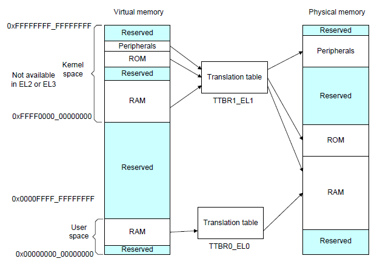
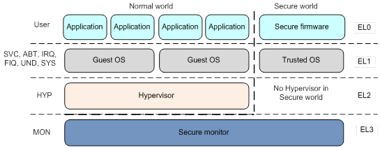
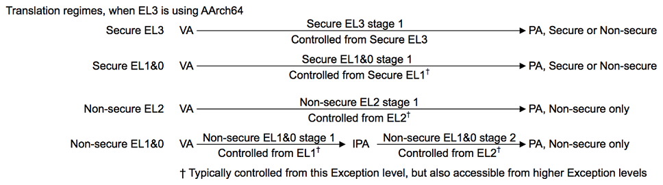
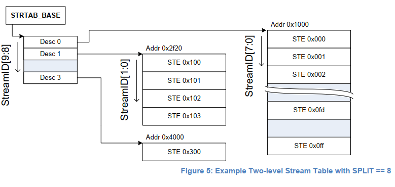
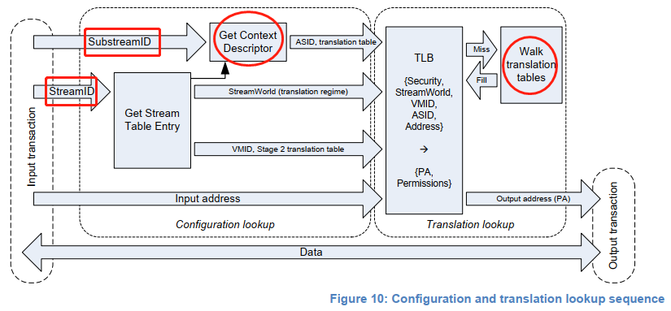
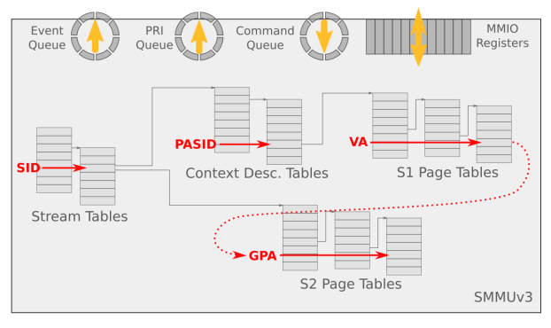
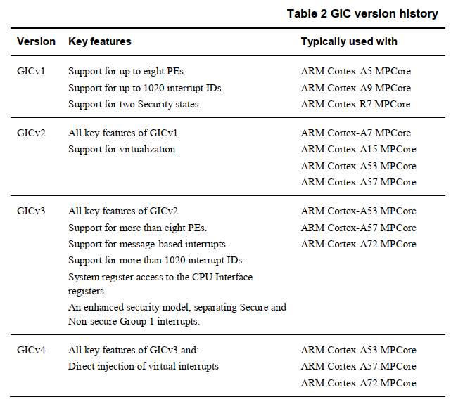
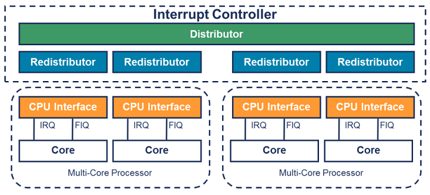
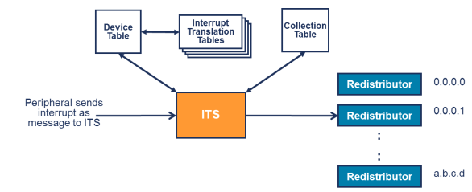

<!-- TOC -->

- [1. 概述](#1-概述)
- [2. ARMv8 System Architecture](#2-armv8-system-architecture)
- [3. ARMv8 Virtualization Extension Overview](#3-armv8-virtualization-extension-overview)
    - [3.1 CPU Virtualization](#31-cpu-virtualization)
    - [3.2 Memory Virtualization](#32-memory-virtualization)
    - [3.3 I/O Virtualization](#33-io-virtualization)
    - [3.4 Interrupt Virtualization](#34-interrupt-virtualization)
        - [3.4.1 GIC的描述](#341-gic的描述)
        - [3.4.2 Distributor](#342-distributor)
        - [3.4.3 Redistributor](#343-redistributor)
        - [3.4.3 CPU Interface](#343-cpu-interface)
        - [3.4.4 ITS（Interrupt Translation Service）](#344-itsinterrupt-translation-service)

<!-- /TOC -->

# 1. 概述

ARM处理器在移动领域已经大放异彩占据了绝对优势，但在服务器领域当前主要还是X86的天下。

为了能够和X86在服务器领域展开竞争，ARM也逐渐对虚拟化扩展有了较为完善的支持。 

本文的目的是介绍一下ARMv8 AArch64处理器的虚拟化扩展中的一些相关知识点， 
将主要从ARM体系结构、内存虚拟化、中断虚拟化、I/O虚拟化等几个方面做一些概括性总结。 

本文将尽可能的在特性层面和X86做一些对比以加深我们对于ARM Virtualizaiton Extension的印象。

# 2. ARMv8 System Architecture

AArch64执行环境：
- 提供31个64bit的通用处理器，其中X30是`Procedure Link register`
- 提供1个64bit的程序寄存器`PC`，堆栈指针`（SPs）`和`Exception Link registers（ELRs）`
- 提供32个128bit的寄存器以支持SIMD矢量和标量浮点运算
- 定义了4个Exception Level（EL0 ~ EL3）
- 支持64bit虚拟地址
- 定义了一些pstate eletems来存储PE的状态
- 通过ELn后缀来表示不同Exception Level下可以操作的系统寄存器

ARM内存模型：
- 非对齐的内存访问将产生一个异常
- 限制应用程序访问指定的内存区域
- 程序执行中的虚拟地址将被翻译成物理地址
- 内存访问顺序受控
- 控制cache和地址翻译的结构
- 多个PE之间共享内存的访问同步

ARM内存管理：
- ARMv8-A架构支持的最大物理内存地址宽度是48bit，支持4KB、16KB或者64KB页面大小
- 虚拟内存管理机制
    - VA的最高有效位（MSB）为0时：`MMU`使用`TTBR0`的转换表来翻译
    - VA的最高有效位（MSB）为1时：`MMU`使用`TTBR1`的转换表来翻译
- EL2和EL3有`TTBR0`，但是没有`TTBR1`，这意味着EL2和EL3下只能使用`0x0 ~ 0x0000FFFF_FFFFFFFF`范围的虚拟地址空间

```
----------------------------------------------------------------
AArch64 Linux memory layout with 4KB pages + 4 levels::
  Start         End         Size        Use
  0000000000000000  0000ffffffffffff     256TB      user
  ffff000000000000  ffffffffffffffff     256TB      kernel
-----------------------------------------------------------------
```



# 3. ARMv8 Virtualization Extension Overview

ARM为了支持虚拟化扩展，在CPU的运行级别上引入了`Exception Level`的概念，AArch64对应的Exception Level视图如下：



- EL0：用户态程序的运行级别，Guest内部的App运行在这个级别
- EL1：内核的运行级别，Guest的内核运行在这个级别
- EL2：Hypervisor的运行级别，Guest在运行的过程中会出发特权指令后选入EL2级别，将控制权交给Hypervisor
- EL3：Monitor Mode，CPU在`Secure World`和`Normal World`直接切换的时候会先进入EL3，然后发生World切换

> 当CPU的Virtualization Extension被disable的时候，软件就运行在EL0和EL1上，这时候EL1有权限访问所有的硬件。

## 3.1 CPU Virtualization

X86为支持CPU虚拟化引入来`Root Mode`和`Non-Root Mode`的概念和一套特殊的`VMX指令集`，其中`Non-root Mode`是Guest CPU的执行环境，`Root Mode`是Host CPU的执行环境。

`Root Mode`、`Non-Root Mode`与CPU的特权级别是完全两个独立的概念，`Non-Root Mode`和`Root Mode`都支持`Ring 0~3`特权级。

ARMv8 CPU是依靠在不同的EL之间切换来支持虚拟化模式切换。但二者都有一个相同点：ARMv8与X86在虚拟化模式下如果执行了敏感指令会分别退出到`EL2`和`Root Mode`。同时，X86为了更好地支持`Root/None-root Mode`的模式切换，在内存中实现了一个叫做VMCS的数据结构，用来保存和恢复`Root/None-root Mode`模式切换过程中的寄存器信息，VMX指令集则专门来操作`VMCS数据机构`。但是RISC-style的ARMv8处理器上，则没有类似的实现，而是让Hypervisor软件自己来决定哪些信息需要保存和恢复，这在一定程度上带来了一些灵活性。

## 3.2 Memory Virtualization

在ARMv8-A上，每个`translation regime`可能包括1个stage或2个stage。每个Exception Level都有自己的地址翻译机制，使用不同的页表基地址寄存器，地址翻译可以细分到stage，大部分的EL包括一个stage的地址翻译过程，`Non-Secure EL1&0`包括了2个stage的地址翻译过程。每个stage都有自己独立的一系列`Translation Tables`，每个stage都能独立的enable或者disable。每个stage都是将输入地址（IA）翻译成输出地址（OA）。



在虚拟化场景下，ARMv8和X86的方案是类似的，都是采用`2-stages`地址翻译实现`GPA -> HPA`的地址翻译过程。

虚拟机运行在Non-secure EL1&0，当虚拟机内的进程访问GVA的时候MMU会将` GVA `翻译成` IPA（intermediate physical address）`这就是所谓的stage 1地址翻译。然后MMU会在将`IPA`翻译成`HPA`，这就是所谓的stage2地址翻译。

**再不同的Execption Level下有不同的Address Space，那么如何去控制不同的地址空间翻译呢？**

ARMv8-A上有一个`TCR（Translation Control Register）`寄存器来控制地址翻译。
例如：对于EL1&0来说，由于在该运行模式下VA存在2个独立的映射空间（User Space和Kernel Space），所以需要两套页表来完成地址翻译，这2个页表的基地址存放在`TTBR0_EL1`和`TTBR1_EL1`中。

对于每一个地址翻译阶段：
- 有一个system control register bit来使能该阶段的地址翻译
- 有一个system control register bit来决定翻译的时候使用的大小端策略
- 有一个translation control register来控制整个阶段的地址翻译过程
- 如果某个地址翻译阶段支持将VA映射到两个`subranges`，那么该阶段的地址翻译需要为每个`VA subrange`提供不同的`TTBR`寄存器。

## 3.3 I/O Virtualization

`Device Passthrough`的目的是能够让虚拟机直接访问到物理设备，从而提升I/O性能。
在X86上使用VT-d技术就能够实现设备直通，这一切都得益于`VFIO drvier`和`intel_iommu`的加持。

那么在ARMv8-A上为了支持设备直通，又有哪些不同和改进呢？

同X86上一样，ARM上的设备直通关键也是要解决`DMA remaping`和`Passthrouh Device interrupt deliver`的问题。

同X86不一样的是：
- ARMv8-A上使用SMMU v3.1来处理设备的DMA重映射
- ARMv8-A上使用GIC v3中断控制器来实现Interrupt重映射。

> SMMUv3和GICv3在设计的时候考虑来更多跟虚拟化相关的实现，针对虚拟化场景有一定的改进和优化。

先看下SMMUv3.1在ARMv8-A中的使用情况以及它为ARM设备直通上做了哪些改动。

SMMUv3规定必须实现的特性有：
- SMMU支持2阶段地址翻译，这和内存虚拟化场景下MMU支持2阶段翻译类似，第一阶段的地址翻译被用作进程`（software entiry）`之间的隔离或者OS内的DMA隔离，第二阶段的地址翻译被用来做DMA重映射，即将Guest发起的DMA映射到Guest的地址空间内。
- 支持16bits的ASIDs
- 支持16bits的VMIDs
- 支持SMMU页表共享，允许软件选择一个已经创建好的共享SMMU页表或者创建一个私有的SMMU页表
- 支持49bits虚拟地址（matching ARmv8-A's 2x48-bit translation table input size），SMMUv3.1支持52bits VA、IPA、PA

SMMUv3支持的可选特定有：
- Stage1和Stage2同时支持AArch32（LPAE：Large Page Address Extension）和AArch64地址翻译表格式（兼容性考虑）
- 支持Secure Stream（安全的流式DMA传输）
- 支持SMMU TLB Invaliation广播
- 支持HTTU（Hardware Translation Table Update）硬件自动刷新页表的Accesss/Dirty标志位
- 支持PCIE ATS（Address Translation Services）和PRI（Page Request Interface）
- 支持64K或者64K页面粒度

我们知道，一个平台上可以有多个SMMU设备，每个SMMU设备下面可以连接着多个`PCIe Endpoint`，多个设备互相之间可能不会复用同一个页表，需要加以区分，SMMU用`StreamID`来做这个区分，通过StreamID去索引`Stream Table`中的`STE（Stream Table Entry）`。同样X86上也有类似的区分机制，不同的是X86是使用`Request ID`来区分的，Request ID默认是PCI设备分配到的BDF号。不过看SMMUv3 Spec，有说明：对于PCI设备StreamID就是PCI设备的RequestID，两个名字表示一个东西，从SMMU角度看就成为StreamID，从PCIe的角度去看就称为RequestID。同时，一个设备可能被多个进程使用，多个进程有多个页表，设备需要对其进行区分，SMMU使用`SubstreamID`来对其进行标识。SubstreamID的概念和`PCIe PASID`是等效的，这只不过又是在ARMv8上的另一种称呼而已。

> SubstreamID和PCIe PASID最大支持20bit宽度。

`Stream Table Entry`中包含：
- STE里面包含一个指向stage2地址翻译表的指针，并且同时还包含一个指向`CD（Context Descriptor）`的指针。
- Context Descriptor是一个特定的数据结构，包含来指向stage1地址翻译表的基地址指针

理论上，多个设备可以关联到一个虚拟机上，所以多个Stream Table Entry可以共享一个stage2的翻译表。类似的，多个设备（stream）可以共享一个stage1的配置，因此多个Stream Table Entry可以共享同一个Context Descriptor。

`Stream Table`是存在内存中的一张表，在SMMU设备初始化的时候由驱动程序创建好。Stream Table支持2中格式，`Linear Stream Table`和`2-Level Stream Table`，Linear Stream Table就是将整个Stream Table的内存中线性展开为一个数组，优点是索引方便快捷，缺点是当平台上外设较少的时候浪费连续的内存空间。2-Level Stream Table则是将Stream Table拆成2级去索引，优点是更加节省内存。



DTS描述SMMU:
```dts
smmu0: iommu0@8002c000000 {
    compatible = "arm,mmu-500";
    dma-coherent;
    reg = <0x800 0x2c000000 0 0x400000>;
    #global-interrupts = <2>;
    interrupts = <0 89 4>, <0 90 4>,
                 <0 57 4>, <0 58 4>,
                 <0 59 4>, <0 60 4>,
                 <0 61 4>, <0 62 4>,
                 <0 63 4>, <0 64 4>,
                 <0 65 4>, <0 66 4>,
                 <0 67 4>, <0 68 4>,
                 <0 69 4>, <0 70 4>,
                 <0 71 4>, <0 72 4>,
                 <0 73 4>, <0 74 4>,
                 <0 75 4>, <0 76 4>,
                 <0 77 4>, <0 78 4>,
                 <0 79 4>, <0 80 4>,
                 <0 81 4>, <0 82 4>,
                 <0 83 4>, <0 84 4>,
                 <0 85 4>, <0 86 4>,
                 <0 87 4>, <0 88 4>;
                 
    #iommu-cells = <1>;
};
```

ACPI（IO Remapping Table）描述SMMU：
```acpi
              Base Address : 000008002C000000
                      Span : 0000000000400000
                     Model : 00000003
     Flags (decoded below) : 00000002
             DVM Supported : 0
             Coherent Walk : 1
   Global Interrupt Offset : 0000003C
   Context Interrupt Count : 00000020
  Context Interrupt Offset : 0000004C

    SMMU_NSgIrpt Interrupt : 0000000000000079
 SMMU_NSgCfgIrpt Interrupt : 0000000000000079
         Context Interrupt : 0000000000000059
         Context Interrupt : 000000000000005A
         Context Interrupt : 000000000000005B
         Context Interrupt : 000000000000005C
         Context Interrupt : 000000000000005D
         Context Interrupt : 000000000000005E
         Context Interrupt : 000000000000005F
         Context Interrupt : 0000000000000060
         Context Interrupt : 0000000000000061
         Context Interrupt : 0000000000000062
         Context Interrupt : 0000000000000063
         Context Interrupt : 0000000000000064
         Context Interrupt : 0000000000000065
         Context Interrupt : 0000000000000066
         Context Interrupt : 0000000000000067
         Context Interrupt : 0000000000000068
         Context Interrupt : 0000000000000069
         Context Interrupt : 000000000000006A
         Context Interrupt : 000000000000006B
         Context Interrupt : 000000000000006C
         Context Interrupt : 000000000000006D
         Context Interrupt : 000000000000006E
         Context Interrupt : 000000000000006F
         Context Interrupt : 0000000000000070
         Context Interrupt : 0000000000000071
         Context Interrupt : 0000000000000072
         Context Interrupt : 0000000000000073
         Context Interrupt : 0000000000000074
         Context Interrupt : 0000000000000075
         Context Interrupt : 0000000000000076
         Context Interrupt : 0000000000000077
         Context Interrupt : 0000000000000078
```

在使能SMMU两阶段地址翻译的情况下，stage1负责将设备DMA请求发出的VA翻译为IPA并作为stage2的输入；
stage2则利用stage1输出的IPA再次进行翻译得到PA，从而DMA请求正确地访问到Guest要操作的地址空间上。

**Stage1地址翻译阶段**：硬件先通过StreamID索引到STE，然后用SubstreamID索引到CD，CD里面包含了stage1地址翻译（把进程的GVA/IOVA翻译成IPA）过程需要的页表基地址信息、pre-stream的配置信息以及ASID。在stage1翻译的过程中，多个CD对应着多个stage1的地址翻译，通过SubStream去确定对应的stage1地址翻译页表。

> Stage1地址翻译其实是一个`（RequestID, PASID）=> GPA`的映射查找过程。注意：只能在使能了stage1地址翻译的情况下，SubstreamID才有意义，否则该DMA请求会被丢弃。

**Stage2地址翻译阶段**：STE里面包含了stage2地址翻译的页表基地址`（IPA->HPA）`和`VMID`信息。如果多个设备被直通给同一个虚拟机，那么意味着它们共享同一个stage2地址翻译表。



> 值得注意的是：CD中包含一个ASID，STE中包含来VMID，CD和VMID存在的目的是做为地址翻译过程中的TLB tag，用来加速地址翻译的过程。

系统软件通过`Command Queue`和`Event Queue`来和`SMMU`打交道，这2个Queue都是循环队列。系统软件将Command放到队列中SMMU从队列中读取命令来执行，同时设备在进行DMA传输或者配置发生错误的时候会上报事件，这些事件就存放在Event Queue当中，系统软件要及时从Event Queue中读取事件以防止队列溢出。



SMMU支持两阶段地址翻译的目的只有一个，那就是为了支持虚拟化场景下的`SVM（Share Virtual Memory）`特性。

SVM特性：允许虚拟机内的进程能够独立的访问直通给虚拟机的直通设备，在进程自己的地址空间内向设备发起DMA。SVM使得虚拟机里面的每个进程能够独立使用某个直通设备，这能够降低应用编程的复杂度，并提升安全性。

为了实现虚拟化场景下的SVM，`QEMU`需要模拟一个`vSMMU`（或者叫`vIOMMU`）的设备。虚拟机内部进程要访问直通设备的时候，会调用`Guest Driver`创建`PASID Table`（虚拟化场景下这个表在Guest内部），在这个场景下PASID将作为虚拟机内进程地址空间的一个标志，设备在发起`DMA request`时会带上`PASID Prefix`，这样SMMU就知道如何区分了。
创建PASID Table的时候会访问vSMMU，这样Guest就将PASID Table的地址（GPA）传给来QEMU，然后QEMU在通过`VFIO`的`ioctl(VFIO_DEVICE_BIND_TASK) syscall`将表的信息传给SMMU，这样SMMU就获得来Guest内部进程的PASID Table的shadow信息，它就知道该如何建立Stage1地址转换表了。

**在两阶段地址翻译场景下，Guest内部DMA请求的处理步骤**：
1. `Guest drvier` 发起 `DMA Request`，这个 `DMA Request` 包含 `GVA + PASID prefix`
2. `DMA request` 到达 `SMMU`，SMMU 提取 `DMA Request` 就知道这个请求是哪个设备发来的，然后去 `Stream Table` 索引对应的 `Stream Table Entry`
3. 从对应的 `Stream Table Entry` 中查找对应的 `Context Descriptor`，然后用 `PASID` 到 `Context Descriptor` 中进行索引找到对应的 `Stage1 Page Table`
4. `IOMMU` 进行 `Stage 1 Page Table Walk`，将`GVA`翻译成`GPA（IPA）`
5. `IOMMU` 进行 `Stage 2 Page Table Walk`，将`GPA`翻译成`HPA`

纵观`SMMUv3`与`Intel IOMMU`的设计和功能基本类似，毕竟这里没有太多可创新的地方。但SMMUv3有两个比较有意思的改进点：
1. 支持PCIe PRI（Page Request Interface），PRI是对ATS的进一步改进。当设备支持PRI特性的时候，设备发送DMA Request的时候可以缺页`IOPF（IO Page Fault）`，这意味着直通虚拟机可以不需要进行内存预占，DMA缺页的时候SMMU会向CPU发送一个缺页请求，CPU建立好页表之后对SMMU进行回复，SMMU这时候再将内容写到DMA Buffer中。
2. DMA写内存之后产生`dirty Page`可以由硬件自动更新`Access/Dirty Bit`，这样就对直通设备热迁移比较友好，但这个功能是需要厂商选择性支持的，而且在这种场景下如何解决 `SMMU` 和 `MMU` 的 `cache coherence` 是最大的挑战。

## 3.4 Interrupt Virtualization

ARMv8-A的中断体系与X86区别比较大：
- X86用的是`Local APIC/ IO APIC`中断体系
- ARMv8则使用的是`Generic Interrupt Controller`中断体系

随着ARMv8的演进陆续出现了GICv2，GICv3，GICv4等不同版本：



GICv1进而GICv2最大支持8个PE，在当今虚拟化场景显然不够用。所以，GICv3对这里进行改进，提出了 `affinity routing` 机制以支持更多的PE。

GICv3定义了以下中断类型：
- `LPI（Locality-specific Peripheral Interrupt）`：是基于消息的中断、边沿触发、经过`ITS（Interrupt Translation Service）`路由，它们是配置保存在表中而不是寄存器，比如PCIe的MSI/MSI-x中断，`GITS_TRANSLATER`寄存器控制中断。
- `SGI（Software Generated Interrupt）`：软件触发的中断，软件可以通过写`GICD_SGIR`寄存器来触发一个中断事件，一般用于核间通信（对应X86 IPI中断）
- `PPI（Private Peripheral Interrupt）`：私有外设中断，这是每个核心私有的中断，PPI太冗长会送达到指定的CPU上，边沿触发或者电平触发、有Active状态，应用场景有CPU本地时钟，类似于X86上的`Local APIC Timer Interrupt`
- `SPI（Shared Peripheral Interrupt）`：公用的外部设备中断，也定义为共享中断，边沿触发或者电平触发、有Active状态，可以多个CPU或者Core处理，不限定特定的CPU，SPI支持Message格式（GICv3），`GICD_SETSPI_NSR`寄存器设置中断，`GICD_CLRSPI_NSR`寄存器清除中断

ARMv8上的中断又可以分为两类：
1. 中断要通过Distributor分发的，例如SPI中断。
2. 中断不通过Distributor分发的，例如LPI中断，直接经过ITS翻译后投递给某个Redistributor。

INTID | Interrupt Type | Notes 
---|---|---
0 ~ 15 | SGI | Banked per PE
16 ~ 31 | PPI | Banked per PE
32 ~ 1019 | SPI | 
1020 ~ 1024 | Special Interrupt Number | Used to singal special cases
1024 ~ 8191 | Reserved
8192 ~  | LPI

ARMv8提出一个`Affinity Routing`的概念，GICv3使用Affinity Routing来标志一个特定的PE或者是一组特定的PE，有点类似于X86上的`APICID/X2APIC ID`机制。ARMv8使用4个8bits的域来表示Affinity，格式如下：
```
    <affinity level 3>.<affinity level 2>.<affinity level 1>.<affinity level 0>
```
例如，现在有个ARM Big.Little架构的移动处理器SOC，拥有2个Cluster：
- Little拥有4个Cortex-A53
- Big拥有2个Cortex-A72

那么可以表示为：
```
0.0.0.[0:3] Cores 0 to 3 of a Cortex-A53 processor
0.0.1.[0:1] Cores 0 to 1 of a Cortex-A72 processor
```

GICv3的设计上和X86的`LOCAL APIC/IO APIC`架构差异甚远，GICv3的设计架构如下图所示：



GICv3中断控制器由`Distributor`，`Redistributor`和`CPU Interface`三部分组成。
- Distributor：负责SPI中断管理并将中断发送给Redistributor。
- Redistributor：负责管理PPI，SGI，LPI中断，并将中断投递给CPU Interface。
- CPU Interface：负责将中断注入到Core里面（CPU Interface本身就在Core内部）。

### 3.4.1 GIC的描述

DTS描述GIC：
```dts
interrupt-controller@8002a000000 {
    compatible = "arm,gic-v3";
    #interrupt-cells = <0x3>;
    #address-cells = <0x2>;
    #size-cells = <0x2>;
    ranges;
    interrupt-controller;
    reg = <0x800 0x2a000000 0x0 0x10000 0x800 0x2a800000 0x0 0x800000 0x800 0x29c00000 0x0 0x10000 0x800 0x29c10000 0x0 0x10000 0x800 0x29c20000 0x0 0x10000>;
    interrupts = <0x1 0x9 0x4>;
    linux,phandle = <0x1>;
    phandle = <0x1>;

    gic-its@8002a020000 {
        compatible = "arm,gic-v3-its";
        msi-controller;
        reg = <0x800 0x2a020000 0x0 0x20000>;
        linux,phandle = <0x2>;
        phandle = <0x2>;
    };
};
```

ACPI（Multiple APIC Description Table）描述GIC：
```apic
                 Subtable Type : 0B [Generic Interrupt Controller]
                        Length : 50
                      Reserved : 0000
          CPU Interface Number : 00000000
                 Processor UID : 00000000
         Flags (decoded below) : 00000001
             Processor Enabled : 1
  Performance Interrupt Trigger Mode : 0
  Virtual GIC Interrupt Trigger Mode : 0
      Parking Protocol Version : 00000000
         Performance Interrupt : 00000017
                Parked Address : 0000000000000000
                  Base Address : 0000080029C00000
      Virtual GIC Base Address : 0000080029C20000
   Hypervisor GIC Base Address : 0000080029C10000
         Virtual GIC Interrupt : 00000019
    Redistributor Base Address : 000008002A800000
                     ARM MPIDR : 0000000000000000
              Efficiency Class : 00
                      Reserved : 000000
```
### 3.4.2 Distributor

```acpi
             Subtable Type : 0C [Generic Interrupt Distributor]
                    Length : 18
                  Reserved : 0000
     Local GIC Hardware ID : 00000000
              Base Address : 000008002A000000
            Interrupt Base : 00000000
                   Version : 03
                  Reserved : 000000
```

Distributor的主要功能有：
- 中断优先级管理和中断分发
- 启用和禁用SPI
- 为每个SPI设置中断优先级
- 为每个SPI设置路由信息
- 设置每个SPI的中断触发属性：边沿触发或者电平触发
- 生成消息格式的SPI中断
- 控制SPI中断的active状态和pending状态

> 每个PE都对应有一个Redistributor与之相连，Distributor的寄存器是`memory-mapped`，并且它的配置是全局生效的，直接影响所有PE。

### 3.4.3 Redistributor

```acpi
 Subtable Type : 0E [Generic Interrupt Redistributor]
                    Length : 10
                  Reserved : 0000
              Base Address : 000008002A800000
                    Length : 00800000
```
Redistributor的主要功能有：
- 使能和禁用SGI和PPI
- 设置PPI的触发属性：边沿触发或者电平触发
- 为每个SGI和PPI分配中断组
- 控制SGI和PPI的状态
- 控制LPI中断相关数据结构的基地址
- 对PE的电源管理的支持

> 每个Redistributor都和一个CPU Interface相连，在GICv3中CPU Interface的寄存器是通过`System Registers(ICC_*ELn)`来访问的。在使用这些寄存器之前软件必须使能系统寄存器。

### 3.4.3 CPU Interface

CPU Interface的主要功能：
- 控制和使能CPU的中断处理。如果中断disable了，即使Distributor分发来一个中断事件到CPU Interface也会被Core屏蔽掉。
- 应答中断
- 进行中断优先级检测和中断deassert
- 为PE设置一个中断优先级mask标志，可以选择屏蔽中断
- 为PE定义抢占策略
- 为PE断定当前pending中断的最高优先级（优先级仲裁）

### 3.4.4 ITS（Interrupt Translation Service）

Translator：
```acpi
             Subtable Type : 0F [Generic Interrupt Translator]
                    Length : 14
                  Reserved : 0000
            Translation ID : 00000000
              Base Address : 000008002A020000
                  Reserved : 00000000
```
GICv3 中为了处理LPI中断，专门引入了`ITS（Interrupt Translation Service）`组件。外设向发送LPI中断时（比如PCI设备的MSI中断），就去写ITS的寄存器`GITS_TRANSLATER`，这个写操作就会触发一个LPI中断。ITS接收到LPI中断后，对其进行解析后发送给对应的`Redistributor`，然后再由Redistributor发送给CPU Interface。

那么这个写操作里面包含了那些内容呢？主要是2个关键域：
-  `EventID`：这个是写入到`GITS_TRANSLATER`的值，EventID定义了外设要触发的中断号，EventID可以和INTID一样，或者经过ITS翻译后得到一个INTID。
- `DeviceID`：这个是外设的标志，实现是自定义的，例如可以使用AXI的user信号传递。

ITS使用3种类型的表来完成LPI的翻译和路由：
- `Device Table`：将DeviceID映射到`Interrupt Translation Table`中。
- `Interrupt Translation Table`：包含了`EventID`和`INTID`映射关系之间和`DeviceID`相关信息，同时也包含了`INTID Collection`
- `Collection Table`：将`Collections`映射到`Redistributor`



**ITS整体流程大概是：**
1. 外设写`GITS_TRANSLATER`，ITS使用`DeviceID`从`Device Table`中索引出这个外设使用哪个`Interrupt Translation Table`
2. 使用`EventID`去索引到的`Interrupt Translation Table`中索引出`INTID`和对应的`Collection ID`
3. 使用`Collection ID`从`Collection Table`中选择对应的Collection和路由信息
4. 把中断发送给目标Redistributor

总体看来GICv3中断控制器设计比较复杂，不如X86上那样结构清晰，目前只是整理个概述，要深入理解在到代码级熟悉还要花很多时间。上面说了这么多，还是在将GICv3控制器的逻辑，具体QEMU/KVM上是怎么实现的还得去看代码，为了提高中断的性能，GICv3的模拟是直接放到KVM里面实现的。
