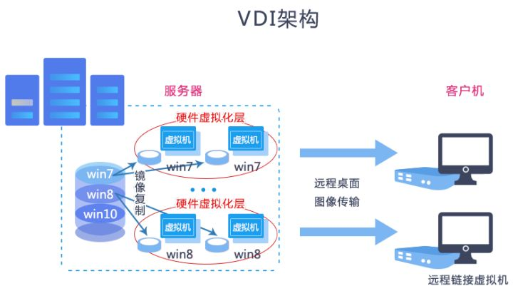
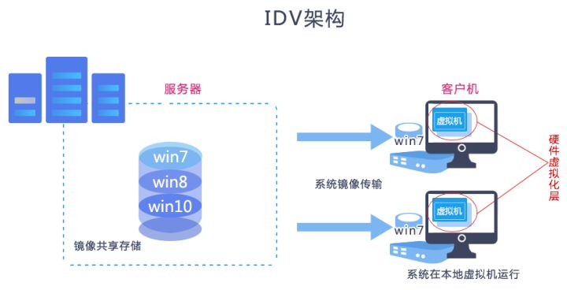

# 1. 概述

**桌面虚拟化**主要有两种架构：
- VDI（Virtual Desktop Infrastructure）即虚拟桌面基础架构。
- IDV（Intelligent Desktop Virtualization）即智能桌面虚拟化。

## 1.1 VDI

VDI让大规模的虚拟桌面得以高度集中化的管理，让每个人的电脑运行在自己看不到的地方，由于理念比较新，方案一提出得到了市场的广泛传播，但是由于该构架要求所有桌面虚拟机集中在服务端运行，受到硬件工艺和网络传输的限制，造成性能、成本、兼容性等诸多问题。

### 1.1.1 优势

- **移动性强**

不受地域限制，无论在哪里，桌面可以跟人走。另外，支持多种终端，譬如平板、手机、PC机、笔记本电脑等。

- **符合现代云计算架构设计**

通过一台服务器虚拟若干个虚拟桌面实现服务器最大利用率，通过多台服务器集群化实现桌面用户可扩展性。所有桌面数据全部存储在服务器上，服务器通常部署在数据中心。

- **集中管控**

一名管理员可以管控上千台云桌面。发布桌面等复杂工作完全由机器去完成，管理员只需要下达指令即可；另外管理员可以控制桌面用户的外设接口，设置白名单或黑名单，甚至在网络畅通情况下，远程登录用户桌面解决问题。

- **数据安全性高**

用户端只是桌面图像接受端，而所有数据都会保存在云端。VDI云计算基础架构有很多数据保障的措施，如副本技术，EC技术等，都能保障数据安全可追溯。

### 1.1.2 劣势

- **建设成本高**

需要依托强大的CPU和消耗大量内存，所以在服务器采购花费上较高。同时，用户还需要采购VDI终端，投资较大。

- **过渡依赖网络环境**

对网络的依赖主要体现在带宽和延时上，体验逊于局域网。另外断网后VDI桌面将无法使用。

- **技术复杂**

技术源于云平台相关技术。比如在相当复杂的openstack云平台上架构VDI，对管理者挑战极大。

- **用户体验较差，场景受限**

过度依赖网络加上集中式架构，在规模用户环境下，用户体验大受影响。目前3D虚拟化技术虽然能够解决VDI桌面端3D软件及游戏支持，但用户付出的成本大大高于PC机。

## 1.2 IDV

针对VDI的先天缺陷，Intel提出了IDV概念，采用集中存储、分布运算的构架，他将虚拟桌面的运行赶回了终端的本地电脑上运行，系统镜像统一存放到服务器端，配置并下发到终端机器硬盘上，终端通过虚拟机运行桌面，不再对网络过度依赖，无需大量的图像传输，支持系统离线运行，同样可以统一管理终端桌面系统，虽然相对VDI有个很大改善，但是要求本地硬件必须统一，必须支持VT等带外特性，另外由于没有脱离虚拟机概念，性能和兼容性还是没有办法和传统的PC机器相比。

### 1.2.1 优势

- **分布式虚拟桌面技术，桌面系统理论上可以无限扩张**

采取分布式计算，并集中和简化管理、部署功能。得益于流行的“边缘计算”思路，虚拟桌面充分利用终端的硬件资源，每个终端都是虚拟桌面节点，桌面系统理论上可以无限扩张。

- **支持离线**

采用终端虚拟化技术，数据存放终端，不受网络影响，断网亦可访问。

- **用户体验好**

IDV桌面体验与物理终端设备体验相当，接近本地体验效果。

- **成本可控**

主要成本来自于桌面终端成本，服务器端只是控制和管理，无需承载桌面，成本相对VDI架构大幅降低。

### 1.2.2 劣势

- **不支持移动办公**

对终端依赖性较大，用户通常与终端绑定，不能像VDI桌面一样在任意地点访问桌面。

- **数据安全性相对较低**

数据存放于终端，安全性相对脆弱。

- **维护相对不便**

IDV桌面对终端有依赖性，获取高性能就需要高的硬件配置，这对终端硬件质量和稳定性提出更高要求。一旦出现故障，管理人员需要介入处理恢复桌面和用户数据的流程。如果是终端跨因特网环境，终端维护则更加棘手。

## 1.3 架构对比

- |VDI | IDV
---|---|---
架构|集中存储、分布计算 | 集中存储、集中计算
集中管理|支持|支持
硬件辅助虚拟化层| 硬件虚拟化层在服务器 | 硬件虚拟化层在客户端
桌面类型| 虚拟机桌面| 虚拟机桌面
桌面运行位置 | 服务器虚拟机 | 本地虚拟机
存储空间及要求| 服务器端，一桌面一镜像，多份存储 |服务器+客户机多分存储
按需分配|支持|不支持
桌面性能|差，大量图像传输，过渡依赖网络| 好
客户机硬盘|必须有|必须有
交付速度| 慢，需要镜像复制 | 快
离线运行| 不支持| 可离线运行
