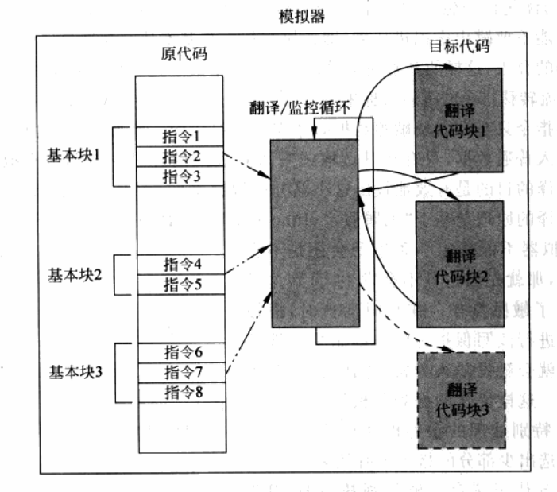

<!-- TOC -->

- [CPU虚拟化](#cpu虚拟化)
    - [1. 解释执行](#1-解释执行)
    - [2. 扫描与修复](#2-扫描与修复)
    - [3. 二进制代码翻译](#3-二进制代码翻译)
        - [3.1 基本概念](#31-基本概念)
        - [3.2 基于BT技术的CPU虚拟化](#32-基于bt技术的cpu虚拟化)
            - [3.2.1 小结](#321-小结)
        - [3.3 BT技术的难点](#33-bt技术的难点)
        - [3.4 BT技术的优化](#34-bt技术的优化)

<!-- /TOC -->

# CPU虚拟化

对于传统虚拟化漏洞而言，在硬件设计对此问题进行改进之前，一些模拟技术就已经被使用来弥补这个漏洞，提供平台虚拟化的能力。可以说，基于软件的CPU完全虚拟化，其本质就是软件模拟。

所有虚拟化的形式都可以用模拟来实现，模拟的强大之处在于，VMM可以将虚拟机的整个执行过程置于控制中，VMM执行每一条指令都有时机进行模拟，因而不会漏过需要模拟的敏感指令。

模拟技术不仅能够用于应用程序级模拟，而且可以用于系统级模拟。它既能够用于不同硬件体系结构间的模拟，更可以用于相同硬件体系结构的模拟，只不过在相同硬件体系结构下模拟，情况变得比不同硬件体系结构下的模拟简单一些，这使得产生一些改进技术以提高虚拟化的性能。

## 1. 解释执行

在模拟技术中，最简单最直接的模拟技术是解释执行，即取一条指令，模拟出这条指令执行的效果，再继续取下一条指令，周而复始。由于是一条一条取指令而不会漏过每一条指令，在某种程度上即每条指令都“陷入”了，所以解决了陷入在模拟的问题，进而避免了虚拟化漏洞。这种方法不仅适用于模拟与物理机相同体系结构的虚拟机，而且也适用于模拟与物理机不同体系结构的虚拟机。

虽然这种方法保证了所有指令执行受到VMM的监视控制，然而它对每条指令不区别对待，其最大的缺点就是性能太差。由于这里所说的虚拟化前提是模拟和物理机相同体系结构的虚拟机，那么至少有很多非敏感指令就不需要模拟，而可以直接在物理CPU上运行，这便诞生了一下两种改进技术。

## 2. 扫描与修复

由于解释执行有很大的性能损失，加上虚拟机中模拟的CPU和物理CPU的体系结构是相同的，这样大多数指令可以被映射到物理CPU上直接执行，因此，CPU虚拟化过程中可以采用更优化的模拟技术来弥补虚拟化漏洞。

扫描与修补技术通过这样的方式，让大多数指令直接在物理CPU上运行，而把操作系统代码中的敏感指令替换为跳转指令或会陷入到VMM中的指令，使其一旦运行到敏感指令处控制流会进入VMM中，由VMM代为模拟执行。

扫描与修复技术的流程如下：
1. VMM会在虚拟机开始执行每段代码之前对其进行扫描，解析每一条指令，查找到特权指令和敏感指令。
2. 补丁代码会在VMM中动态生成，通常每一个需要修补的指令会对应一块补丁代码。
3. 敏感指令被替换成一个外跳转，从虚拟机跳到VMM的空间里，在VMM中执行动态生成的补丁代码。
4. 当补丁代码执行完后，执行流在跳转回虚拟机中的下一条代码继续执行。

扫描与修复技术实现相对简单，在扫描与修复技术中，大多数客户机操作系统和用户代码以直接在物理CPU上运行，其性能损失也相对较小。当然，扫描与修复技术也有其缺点。
1. 由于特权指令和敏感指令都被模拟执行，各条指令的模拟执行时间可能会很短，但有可能会很长。
2. 由于每个补丁都引入了额外的跳转，这些跳转回降低代码的局部性。
3. 由于扫描与修复技术直接在虚拟机内存中进行代码修补，其须维护一份与补丁对应的原始代码的备份，以便在需要时将代码恢复原状。

## 3. 二进制代码翻译

为了更好地提高性能，更为复杂的代码缓冲区技术也被用到了模拟技术中。二进制代码翻译技术（BT技术）在VMM中开辟一块代码缓存，将代码翻译好放在其中。这样，客户机操作系统代码并不会直接被物理CPU执行，所有要被执行的代码都会在代码缓存中。相比较而言，BT技术最为复杂，其在性能上同扫描与修复技术各有长短。

### 3.1 基本概念

在编译理论中，基本块是一个很重要的概念，它表示只有一个入口和一个出口的代码块，即这块代码只能从头进入，从尾退出。即不会有外界跳转跳入代码块中间的某个地方，也不会有代码块中间间某个地方有外界跳转出该代码块。这里，基本块可以认为是静态基本块。

BT技术的动态翻译也是以基本块为单位的，我们称之为动态基本块。与编译器不同的是，编译器在静态能够得到源代码信息时不包含编译生成的二进制代码中的，因而在运行时是无法获得这种源代码信息的。

例如，源代码中跳转标签在基本块分析会被作为划分基本块的分界，因为标签所在位置是一个可能的调整入口。但是，在动态运行时，二进制代码中不包含这种信息的，所以，动态划分基本块时能够准确找到出口，但会遗漏一些入口。基于这个原因，动态基本块可能会比静态基本块要大一些。

BT技术将源代码以基本块为粒度翻译代码，模拟器动态地、按需要地读入二进制代码进行翻译，将翻译好的目标代码存放在模拟器开辟的内存空间中，这块空间被称为代码缓存（translation cache）。这与扫描与修复技术的代码缓存概念时类似的。
同样，由于代码缓存是在模拟器的内存中分配的，因此其容量是有限的，在代码缓存用满的时候，部分缓存就需要被释放出来，因此，一个好的管理策略是很重要的。

源代码中的指令与翻译后的代码用某种映射关系联系起来，例如，最常用的是哈希表，即由源代码的PC值通过哈希函数计算表得到其在代码缓冲区中的位置。如果一个PC没有找到对应的表项，表示这块代码还未被翻译，或者在释放缓存空间时已被清理。

最后，介绍一下什么是翻译。模拟器对于读入的二进制代码不作限制，它们可以是应用程序代码，也可以是操作系统内核代码。
读入的二进制代码可能包含所有的x86体系结构的指令，模拟器将其翻译输出为x86指令的一个安全的子集，即其中不包含特权指令和敏感指令，能够运行在用户态。

在原体系结构和目标体系结构相同的情况下，模拟器翻译方法大致可以分为两种：
1. 简单翻译：比较直接，但指令数量会大大膨胀；
2. 等值翻译：相对更为高效，但动态分析比等值翻译困难。

在同硬件体系结构的模拟中，很多指令时可以等值翻译的，即原代码和目标代码是一样的。理论上来讲，大多数指令时可以等值翻译的，除了以下几种特例。
1. PC相对寻址的指令。
2. 直接控制转换。
3. 间接控制转换。
4. 特权指令。

### 3.2 基于BT技术的CPU虚拟化

BT技术运用在CPU虚拟化中进行软件模拟。以QEMU为例来说明。首先需要声明的是，在QEMU中，它为每个虚拟CPU都维护了一个数据结构ENV，它保存的是当前虚拟CPU的运行环境，包括各种寄存器的参数和值。

QEMU翻译一个Linux代码基本块的过程：

1. 4条指令的基本块，是QEMU通过反汇编源代码，解码得到的x86指令。
```asm
0xc075a4f8: mov $x1, %eax
0xc075a4fd: cpuid
0xc075afff: and $0x2, %dh
0xc075a502: jne 0xc075a50d
```

2. QEMU逐条指令地套用翻译模板，将其变成中间形式。
```asm
0x0000: movl_T0_im 0x1
0x0001: movl_EAX_T0
0x0002: cpuid
0x0003: movl_T1_im 0x2
0x0004: movh_TO_EDX
0x0005: andl_T0_T1
0x0006: movh_EDX_T0
0x0007: update 1_cc
0x0008: set_cc_op 0x16
0x0009: jz_subb 0x0
0x000a: goto_tb0
0x000b: movl_eip_im 0xc075a50d
0x000c: movl_TO_im 0x837b8bc
0x000d: exit_tb
0x000e: goto_tb1
0x000f: movl_eip im 0xc075a504
0x0010: movl_T0_im 0x837b8bd
0x0011: exit_tb
0x0012: end
```

3. 对中间形式的伪指令进行一些优化以后，QEMU最终将其生成目标指令。
```asm
0x08cbef40: mov $0x1, %ebx
0x08cbef45: mov %ebx, 0x0(%ebp)
0x08cbef48: call 0x80f2428
0x08cbef4d: $0x, %esi
0x08cbef52: mov 0x8(%ebp), %eax
0x08cbef55: mov %eax, %ebx
0x08cbef57: shr $0x8, %ebx
0x08cbef5a: and %esi, %ebx
0x08cbef5c: mov %bl, 0x9(%ebp)
0x08cbef5f: mov $ebx,0x2c(%ebp)
0x08cbef62: movl $0x16, 0x30(%ebp)
0x08cbef69: cmpb $0x0, 0x2c(%ebp)
0x08cbef6d: jne 0x8cbef74
0x08cbef6f: jmp 0x8cbef86
0x08cbef74: jmp 0xa789cc7
0x08cbef79: movl $0xc075a50d, 0x20(%ebp)
0x08cbef80: mov $0x837b8bc, %ebx
0x08cbef85: ret
0x08cbef86: jmp 0xa789cc7
0x08cbef8b: movl $0xc075a504, 0x20(%ebp)
0x08cbef92: mov $0x837b8bd, %ebx
0x08cbef97: ret
```

其中，敏感指令CPUID翻译后在目标代码中生成了一个函数调用。这个函数是QEMU在用户空间的一个辅助函数`helper_cpuid`。它所做的事情就是根据虚拟CPU的配置，将返回信息填写好，模拟出CPUID指令的执行效果。
整个过程在用户态就能完成。

对于如`INT $0x80`这样的系统调用，是不能在一个QEMU的辅助函数中完成模拟的，它的翻译过程略显不同。
在虚拟机启动时，初始化IDT表的方法不会直接修改到硬件的IDT表，而是会修改ENV结构中虚拟的IDT数据结构。
这个数据结构被QEMU用于查找虚拟机操作系统的中断和异常处理函数的入口，以及其权限设置等。

```asm
0x0819b930: mov $0x40, %eax
0x0819b935: int $0x80
```

输入代码中的`INT $0x08`指令被翻译位两条指令。
1. 一条是将发生中断的EIP保存在ENV环境变量中
2. 调用`raise_interrupt`函数，并传入两个参数：
    - 参数0x80：指示的是当前中断的中断号。
    - 参数0x02：表示的是INT指令的长度。
```asm
0x0000: movl_T0_im 0x40
0x0001: movl_EAX_T0
0x0002: movl_eip_im 0x819b935
0x0003: raise_interrupt 0x80 0x02
0x0004: end
```

QEMU能够用这个值计算出下一条指令所在的EIP。在输出代码中，中间形式的伪代码被逐条翻译成x86指令，寄存器和虚拟地址也都在这步被分配和确定。
```asm
0x0913a210: mov $0x40, %ebx
0x0913a215: mov %ebx, 0x0(%ebp)
0x0913a218: movl $0x819b935, 0x20(%ebp)
0x0913a21f: push $0x2
0x0913a224: push $0x0
0x0913a226: push $0x1
0x0913a228: push $0x80
0x0913a22d: call 0x80f5cb0
0x0913a232: add $0x10, %esp
```

`raise_interrupt`函数所做的事情就使得QEMU从主运行循环跳出，并向虚拟机的操作系统传播中断。
QEMU首先将当前执行的EIP和寄存器等状态保存在ENV结构中，然后在ENV结构中找到系统启动时记录的IDT表的值，从中得到系统调用的中断描述符。通过一些保护性检查后，QEMU将当前EIP指向系统调用处理函数的入口，并装载虚拟机内核的代码/数据段，然后返回主循环继续执行。这样，执行就转入到虚拟机的内核，开始系统调用的处理。

与之相对的，在系统调用处理结束以后，中断返回指令会执行相反的操作，即载入用户的代码/数据段，恢复用户态的寄存器的值，返回到中断指令的下一条指令继续执行。

除了系统调用外，其他虚拟机主动地陷入也是类似处理的，例如x86的`INT 3`和`into`等。

对于异常（Fault）和外部中断的处理和系统调用比较类似。不同的是，QEMU从宿主机得到中断和异常的信号。
例如，缺页异常时先由宿主机收到并处理的，宿主机会通过发送信号将异常通知QEMU进程。QEMU进程的执行被打断，转而执行信号处理函数。信号处理函数会用类似方法将中断或异常向上传播给客户机操作系统。另外一个不同的是，在结束外部中断和异常的处理后，QEMU返回到用户态被中断的那条指令继续执行，而不是被中断指令的下一条指令。

#### 3.2.1 小结

BT技术在VMM中开辟一块代码缓存，将代码翻译好放在其中。原始的客户机操作系统代码并不会直接被物理CPU执行，它们以基本块的形式组织，模拟器先将执行的基本块翻译成目标代码块，在转入目标代码块执行，在翻译接下来要运行的原始基本块。



### 3.3 BT技术的难点

对于以下几种情况，BT技术在处理过程中遇到困难，需要特别处理。

1. 自修改代码(Self Modifying Code)：自修改代码值程序会修改自身代码段的内容。一旦发生自修改操作，模拟器需要将代码缓存中对应已翻译的代码清除掉，对新写的代码重新翻译。
2. 自参考代码(Self Referential Code)：值的是程序从自己代码段中读取内容。在这种情况下，模拟器需要让程序读取原代码段的内容而不是代码缓冲区的内容。
3. 精准异常(Precise Exceptions)：精准异常指在翻译代码执行中发生了中断或异常，这时需要将运行状态对应到源代码执行到异常点的状态，然后交给客户机操作系统去处理。精准异常问题对于BT技术来讲比较难解决，这主要是由于翻译的代码和源代码已经失去了逐条对应的关系。一个可能的解决方法就是在发生异常时，模拟器回滚到基本块的开头，然后用解释执行的方式逐条执行原代码。
4. 实时代码(Realtime Code)：对于实时性要求较高的代码，运行在模拟环境下会损失时间精确性。这个问题尚未得到很好的解决。

### 3.4 BT技术的优化

在BT技术发展的时候，也积累了许多优化技术，可以提高整体性能。这些优化技术有`基本块串联`、`自适应翻译`和`指令缓存布局优化`等。

BT技术的优化首先想到的就是减少模拟器环境和虚拟机环境的切换，一个方法就是使得运行尽可能不要跳出虚拟机环境，即让直行从一个基本块直接跳到下一个基本块，而不需要模拟器介入，这样的基本块串联起来以后就形成了超级快。
基本块的串联可以通过修改直接控制流转移指令的跳转目标来完成，例如固定目标地址的CALL和JMP指令等。


