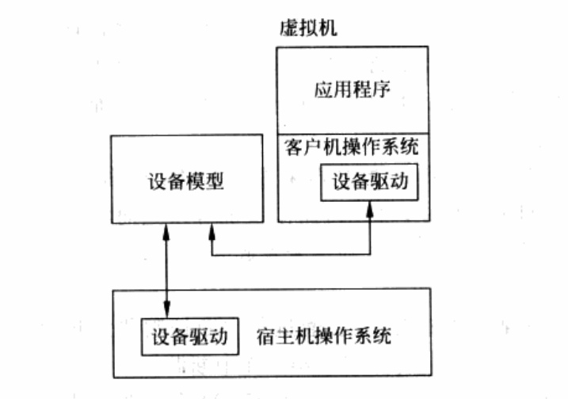
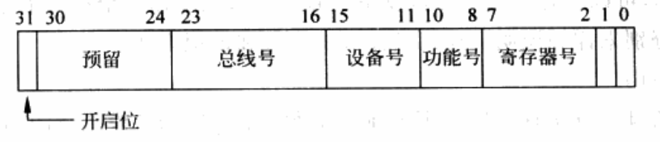
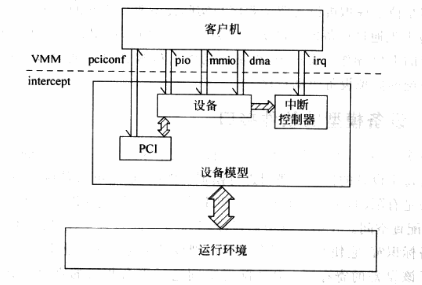
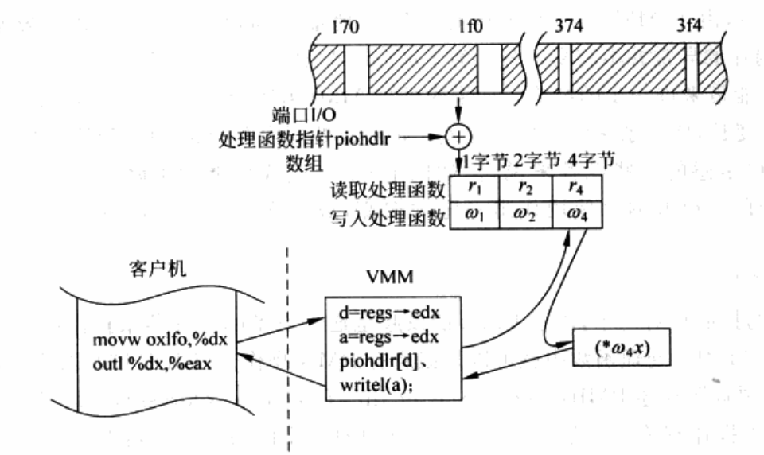
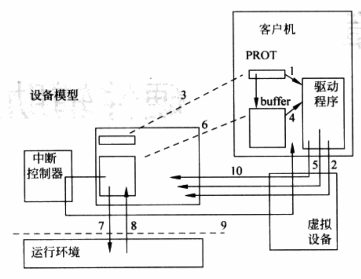

<!-- TOC -->

- [I/O 虚拟化](#io-虚拟化)
    - [1 设备模型](#1-设备模型)
    - [2 设备模型的软件接口](#2-设备模型的软件接口)
        - [2.1 PCI config space](#21-pci-config-space)
        - [2.2 Port I/O](#22-port-io)
        - [2.3 MMIO](#23-mmio)
        - [2.4 DMA](#24-dma)
        - [2.5 Interrupt](#25-interrupt)
        - [2.6 小结](#26-小结)
    - [3 软件接口拦截和模拟](#3-软件接口拦截和模拟)
        - [3.1 Port I/O](#31-port-io)
        - [3.2 MMIO](#32-mmio)
        - [3.3 DMA](#33-dma)
        - [3.4 PCI config space](#34-pci-config-space)
        - [3.5 Interrupt](#35-interrupt)
    - [4 功能实现](#4-功能实现)
        - [4.1 灵活](#41-灵活)
        - [4.2 I/O模型](#42-io模型)
    - [5 案例分析](#5-案例分析)

<!-- /TOC -->

# I/O 虚拟化

## 1 设备模型

在基于软件的完全虚拟化系统中，一般使用I/O模拟的方法来虚拟化I/O设备。

VMM中进行设备模拟，并处理所有设备请求和响应的逻辑模块，就是设备模型。

设备模型并不需要精确模拟目标设备。从操作系统的角度，设备可以分为软件可见部分和软件不可见部分：
- 软件可见部分：操作系统控制操作硬件的所有接口。
- 软件不可见部分：硬件内部逻辑以及与其他设备的连接。
设备模型在进行设备I/O模拟的时候，只需要正确模拟目标设备的软件接口就可以保证客户机操作系统观察到的虚拟设备与目标设备一致，而不必考虑真实硬件的硬件构造及硬件接口，也不需要了解所运行客户机操作系统的技术细节。

设备模型为了模拟目标设备软件接口，也需要同时实现目标设备的功能。这些功能也是基于软件实现的。
因此，设备模型所模拟的目标设备与宿主机的硬件不存在直接的关联和对应关系，而是建立在一定的运行环境之上。
- VMM拦截客户机的I/O操作，将这些操作传递给设备模型进行处理；
- 设备模型运行在一个特定的环境下，这可以是操作系统，可以是VMM本身，也可以是另一个客户机。

如下图所示，是宿主机模型中设备模型的实现。



在上图中，VMM的主要部分是一个宿主机操作系统的内核模块，设备模型是一个用户态进程。
当客户机发生I/O之后，VMM作为内核模块将其拦截后，会通过宿主机内核态->用户态接口传递给用户态的设备模型处理。
设备模型运行与宿主机操作系统之上，可以使用相应的系统调用以及所有运行库。
宿主机操作系统及其上运行库，就构成了设备模型的运行环境。

设备模型是位于虚拟机设备驱动与实际设备驱动之间的一个模块。

```
[virtual device driver] <--- [Device Model] ---> [physical device driver] ---> [physical device]
```

- 客户机设备驱动所发出的I/O请求，先通过设备模型模块转化成物理I/O设备的请求，在通过调用物理设备驱动来完成相应的I/O操作。
- 物理设备驱动将I/O操作结果，通过设备模型模块，返回给客户机操作系统的虚拟设备驱动程序。

## 2 设备模型的软件接口

由于设备多种多样，不同的设备其软件接口也差异巨大，一个完成的设备模型需要大量的代码分别对每个设备的接口和逻辑进行模拟。然而，不同设备的软硬件交换信息的方法是有限的，对于一个典型的PCI设备，它可能包含以下种类的接口。

### 2.1 PCI config space

PCI配置空间包含了设备的很多基本信息，最重要的包括：
- 设备标识符：它使OS可以发现并识别设备类型。
- 基地址寄存器：它使OS可以映射并寻址属于该设备的寄存器。

PCI配置空间通过平台相关的寄存器访问，可以是Port I/O，也可以是MMIO，一般由两个寄存器组成：
- 一个用于指定设备和偏移。
- 一个用于读取或写入数据。

PCI配置空间的寻址方式如下图所示：



另外，PCI设备的发现也是通过客户机操作系统遍历PCI总线（bus, device, function），检查返回值的有效性来进行的。

### 2.2 Port I/O

操作系统通过特定指令访问I/O空间，在x86平台上，这包括`in`、`out`、`ins`和`outs`。
这些Port I/O一般是设备相关的寄存器。

### 2.3 MMIO

某些特定的物理内存区域（如：`0xf000000 ~ 0xffffffff`）并不会映射到真正的RAM存储器，而可能是设备的MMIO，其中包含设备的寄存器。操作系统通过页表将相应的物理内存区域以特定的内存类型（`non-prefetchable`或`prefetchable`）映射到虚拟地址空间内，并通过类似访问内存的方式访问设备寄存器。

### 2.4 DMA

PCI设备并不使用ISA设备所用的DMA Controller来进行DMA操作，而是通过其自己的寄存器使操作系统可以控制DMA的传输。

例如，操作系统可以先向特定的硬件寄存器写入DMA的地址，然后像另一寄存器写入DMA命令来发起一个DMA。
这种方式可以使得DMA使用更大的物理地址空间。

### 2.5 Interrupt

当设备需要通知操作系统处理某些中断时，它会通过其中断控制器PIC发起中断。在CPU响应该中断时，一般会通过读写硬件设备的特定寄存器清除中断源。

### 2.6 小结

在虚拟机中，当客户机通过这些接口与虚拟设备进行数据交换时，VMM会截获这些访问，并将其重定向至设备模型，就可以进行设备模拟了，如下图所示。



## 3 软件接口拦截和模拟

通过VMM，可以将客户机对虚拟设备的软件接口的操作完全拦截下来，并交给设备模型处理。

### 3.1 Port I/O

首先来看Port I/O的实现。以IDE Controller为例，传统的PIO模式下的IDE Controller使用4个不同的Port I/O范围，分别是`0x1f0 ~ 0x1f7`、`0x3f4 ~ 0x3f7`、`0x170 ~ 0x177`以及`0x374 ~ 0x377`。其中，前面两组对第一条IDE电缆（Primary），后两组对应第二条IDE电缆（Secondary）。

所有IDE命令和数据的读写都会通过前面提到的`in`、`out`、`ins`和`outs`这4条指令由客户机发起。
对于这4条敏感指令，VMM可以通过动态翻译或者直接陷入的方式拦截并执行Port I/O的处理函数。

> 在初始化阶段，设备模型首先会将这些Port I/O在VMM中进行注册，客户机运行过程中当这些端口的访问发生时，VMM会根据其端口号和访问的数据宽度（1、2、4字节等）分发至相应的设备模型预先注册的Port I/O处理函数，相应的Port I/O处理函数可以由此用软件模拟所需逻辑。

下图描述了当客户机试图在主IDE设备的COMMAND寄存器的DATA寄存器上写入4个字节时，VMM以及设备模型的处理过程。



### 3.2 MMIO

需要较大寄存器空间的设备一般会使用MMIO，即内存映射的I/O，例如网络设备、显卡等。
MMIO与物理内存共用一个地址空间，例如MMIO可以放置在`3.75 ~ 4GB`的高地址上。
对于VMM、MMIO的处理方法与Port I/O是类似的，也是基于`拦截/分发/处理`这一过程。
但是，MMIO的模拟与Port I/O相比也有一些显著的不同。

1. 由于MMIO的访问不限于某些特定指令，因此不可能采用类似Port I/O的提前修补或翻译。为了使MMIO访问陷入，在初始化阶段客户机映射MMIO所属的物理地址范围时，VMM不会建立相应的影子页表项。而当运行时，客户机的MMIO访问都会造成缺页异常，VMM拦截这些异常后就可以将控制交由设备模型进行处理了。
2. 一个I/O Port上可以进行多字节的访问，例如，对于`0x01f0`的4字节地址与`0x1f1  ~ 0x1f7`完全无关，在MMIO中则并非如此。一个4字节的MMIO寄存器一般会占用内存地址空间的4个字节。因此，对MMIO的处理要对访问宽度、越界和非对齐访问小心地检查和处理。
3. 由于Port I/O的空间比较小，又不存在对齐问题，一般可以采用数组结构来存储各端口对应的处理函数，这会获得较高的性能。但是，在MMIO的情况下下，由于所占范围较大（可能上MB），使用数组结构会占用过大的内存，效率也很差。所以，一般MMIO分发是基于区域（Region）实现的，即设备模型向VMM指定其可以处理的MMIO区域（基地址和长度）及相应的处理函数。这样的方法减少了内存的使用，但却在一定程度上影响了性能。在MMIO陷入发生时，VMM要根据异常地址查找其对应的区域。在MMIO较少时，可以简单地使用链表作为数据结构；当需要处理的MMIO区域非常多时，可能要考虑引入更加复杂的查找算法。
4. 由于MMIO与系统内存在同一地址空间，而且都是由缺页异常陷入的，MMIO与内存的异常并不容易区分。为了区分一个缺页异常时MMIO还是系统内存可能会对系统性能带来进一步的影响。如果先处理MMIO，则会导致每一个普通的影子页表异常处理时间变长，使得系统整体性能变差；如果先处理内存异常，则MMIO的处理时间变长，这对I/O敏感的一些设备来说（网卡）都会造成性能的下降。为解决这一矛盾，需要对系统的I/O和内存使用作出一定的权衡，或引入更快的方法进行区分，在此不再详述。

### 3.3 DMA

DMA的拦截相对简单，由于DMA的发起是通过设备的寄存器来控制的，设备模型在Port I/O和MMIO处理函数中就可以拦截所有DMA操作。以IDE控制器为例，PCI配置空间中有一项资源描述BMIBA(Bus Master Interface Base Address)，指向了一块16个端口与DMA操作有关的寄存器块。客户机通过对其中的命令寄存器BMICX的第0位置1就可以发起DMA操作。

如前所述，设备模型并不需要了解具体设备上DMA的实现方法，而只需要将数据从客户机所属内存中读出或写入即可，这需要通过内存管理模块的帮助将客户机用于DMA传输的缓冲区映射到设备模型的地址空间内。与一般的多线程程序类似，在这一过程中，设备模型需要注意缓存和可能出现的更新顺序问题，以确保客户机在知道DMA结束的时候（例如通过中断），DMA内存中的数据时有效的。

### 3.4 PCI config space

客户机发现和初始化设备的时候会首先访问PCI配置空间，其中的基地址寄存器和命令寄存器使得客户机可以使用该设备的其他I/O资源。由于客户机所有设备使用相同的PCI配置空间寄存器来访问所有设备的配置空间，而配置空间的头部又没有统一的标准，设备模型通常可以使用统一的配置空间处理函数来处理设备的I/O资源分配和映射。

另外，客户机BIOS或操作系统可能会通过写入基地址寄存器的方法重新配置I/O资源的基地址，设备模型在拦截到这些操作后也要将对应资源映射做相应的修改。

然而，还是会有一些设备使用PCI配置空间可能与其他设备不同，从而需要特别处理。
例如，由于历史原因，在访问第一个IDE控制器（或者唯一的IDE控制器）时，部分客户机会忽略基地址寄存器的前四项，而是使用特定的Port I/O分别是`0x1f0`、`0x3f4`、`0x170`和`0x374`。但是，对于第二个IDE控制器（如果存在），客户机使用资源则会遁循其基地址控制器。因此，为了正确运行这些客户机，设备模型需要在基地址寄存器额外注册这4组端口。
再如，一部分设备会在配置空间中放置一些重要的设备相关寄存器（如与中断有关的寄存器等）。在处理这些设备的PCI配置空间时，就必须引入设备相关的逻辑。

### 3.5 Interrupt

中断的处理需要设备模型模拟的Interrupt Controller来处理。作为PCI设备，只需要控制其到Interrupt Controller的Interrupt Line即可，与物理设备的逻辑和处理方法类似。

## 4 功能实现

### 4.1 灵活

由于在功能实现时不必拘泥于目标设备的硬件结构和组成，实现虚拟设备的功能要灵活的多。

在前述的IDE存储系统的例子中，真实设备一般是由IDE控制器以及挂在其下的具体IDE硬件所组成：
- IDE控制器是一个PCI设备，有一系列软件可控的接口；
- 而硬盘本身则被控制器控制，没有独立的软件接口；

而在虚拟IDE时，只需将IDE控制器的软件接口模拟暴露给客户机使用，而并不一定需要遵从控制————硬件这一真实物理结构。
事实上，为了加大灵活性，虚拟IDE往往会搭建一个专门的块设备抽象层，它的实现可以是一块硬盘，或者一个分区，也可以是不同文件格式的单一文件。通过在块设备的实现上使用文件格式，可以引入一些真实硬件所没有或较难实现的高级特性，如加密、增加存储和备份等。

### 4.2 I/O模型

在实现虚拟设备的功能时，一般要访问物理上的真实硬件，这是通过运行环境（宿主机操作系统）的系统调用完成的。
在这个过程中，设备模型和运行环境会一起给虚拟设备的I/O带来额外的时间和CPU的开销，这些与设备模型本身所采用的I/O模型，VMM处理的及时性都有关。在针对I/O效率要求较高的设备模拟时，例如网络设备，如何减少这些额外开销就显得尤其重要。

与一般的I/O密集型程序类似，I/O模型是影响设备模型和整个VMM性能的一个重要部分。以POSIX运行环境为例介绍3种典型的I/O模型，它们被不同VMM广泛使用。
- Non-blocking I/O：将非阻塞查询置于主线程的主循环中，每次循环都对等待的I/O操作进行费阻塞的查询，当无数据时则继续循环，否则读取并处理数据。当需要等待的I/O操作角度时，一般会用非租塞的`select/poll/epoll`代替。
- Asynchronous I/O：使用POSIX aio的设备模型，当需要发起I/O时，设备模型在主线程中指定缓冲区并调用`aio_read`，然后继续循环，当数据结束时则自动调用信号处理函数完成通知过程。
- Alone I/O Thread：使用独立的I/O线程，这允许设备模型使用阻塞I/O，而将调度任务交给运行环境的调度器来完成。

这三种不同的I/O模型其优缺点与普通程序也是一致的。
- Non-blocking：实现较为简单，但是由于需要等待运行部分结束后才进行查询，在数据到达之后会引入额外的延时。
- Asynchronous：I/O在相应速度上略好，而且在主线程内减少了数据到达后重新调用`read`系统调用时间，不过aio的跨平台性略差，而且需要健壮的信号处理程序来避免可能出现的丢失信号的问题。
- Alone：独立的I/O线程则比较稳定，可以依靠良好的调度器获得较好的性能。处理不同的I/O时，还可以使用多个I/O线程，进一步提高性能。

## 5 案例分析

下面分析一个具体的例子：客户机的IDE DMA读操作。

为行文方便，假设虚拟设备的Port I/O为：
- 命令寄存器：`0x1f0 ~ 0x1f7`
- 控制寄存器：`0x3f4 ~ 0x3f7`
- DMA控制器：`0xc100 ~ 0xc10f`
- 设备模型：Asynchronous I/O

整个过程如下图所示。



1. 为了完成DMA操作，客户机驱动程序首先需要设置一个物理区域描述符表（Physical Region Descriptor Table, PRDT），将其物理地址写入寄存器BMIDTPX`(0xc104)`。
2. VMM拦截了这个端口I/O写入，并调用IDE设备模型中处理这个端口的相应函数。
3. 设备模型用VMM所提供的内存管理功能将PRDT映射到自己的地址空间。
4. 返回客户机后，驱动程序将用于存放读取数据的缓冲区的物理地址及长度写入PRDT。
5. 客户机驱动程序通过命令寄存器`(0x1f0 ~ 0x1f7)`指定需要读取的IDE扇区，并通过写入`0x1 ~ BMICX(0xc100)`发起读DMA操作。
6. 设备模型截获这个操作后，首先读取PRDT中的描述符，并将客户机缓冲区映射到自己的地址空间。然后通过扇区地址，计算出这些数据存在的位置，例如映像文件内的偏移。
7. 设备模型使用`aio_read`系统调用发起读取操作，将实际数据读入缓冲区，然后返回客户机运行。
8. 当异步I/O结束之后，运行环境通过信号通知设备模型。当设备模型的信号处理函数运行时，需要读取的数据已经被读入了缓冲区中。
9. 设备模型通过虚拟中断控制器向客户机注入中断。
10. 客户机响应中断，通过写寄存器BMISX`(0xc102)`清除中断标志。

至此，一次IDE的DMA读操作就结束了，在客户机缓冲区内出现的数据就可以被客户机继续使用。