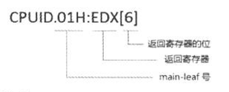
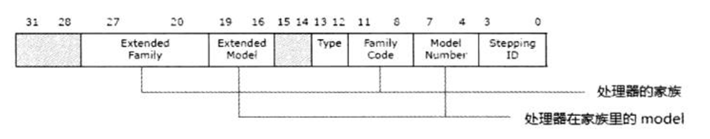
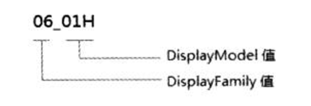
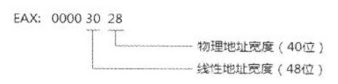
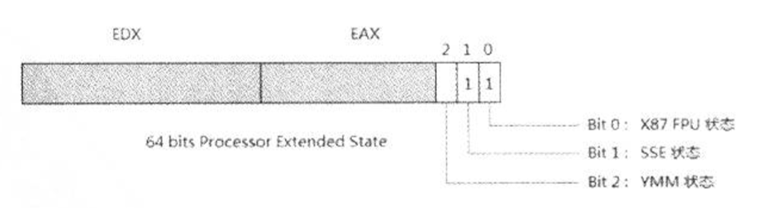
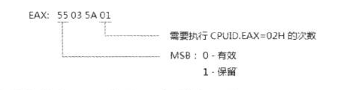
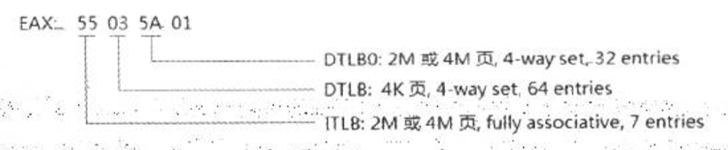

- 概述
- 1 测试是否支持CPUID指令
- 2 CPUID指令的术语及表达
    - 2.1 leaf（叶）
    - 2.2 sub-leaf（子叶）
    - 2.3 CPUID指令的描述形式
- 3 基本信息与扩展信息
    - 3.1 查询最大leaf（功能）号
    - 3.2 基本最大功能号
    - 3.3 扩展最大功能号
- 4 处理器的型号（family，model与stepping）
- 5 最大的物理地址和线性地址
    - 5.1 MAXPHYADDR值
- 6 处理器扩展状态信息
    - 6.1 Processor Extended State（处理器扩展状态）
- 7 处理器的特性
- 8 处理器的Cache与TLB信息
- 9 处理器的long mode
- 10 cpuid解析实例

# 概述

我们要了解处理器的型号、厂商、有什么具体的特性等这些关于处理器的参数应该怎么办？

x86/x64处理器上提供CPUID指令用来查看和识别身份。

# 1. 测试是否支持CPUID指令

eflags寄存器的bit21时ID（Processor Feature Identification）标志位，在286处理器中flags是16位的，在386处理器中eflags扩展为32位，bit21时reserved。
CPUID指令从Intel486处理器上开始加入，因此除非你在古老的机器上运行，否则没必要检测处理器是否支持CPUID指令。

# 2. CPUID指令的术语及表达

在Intel64手册里对CPUID指令广泛使用了如下一些表达形式和术语。

## 2.1 leaf（叶）

功能号使用leaf术语，例如：CPUID的01号功能，你可以称其为CPUID的01 leaf（叶）。

## 2.2 sub-leaf（子叶）

对于一些较复杂的信息查询，往往需要一个辅助的子号。EAX寄存器输入的是main leaf（主叶号），ECX寄存器提供的是sub-leaf（子叶号）。
```asm
    mov eax, 0Bh            ; main leaf
    mov ecx, 0              ; sub-leaf
    cpuid
```
如上所示，0B号功能就是main leaf，EXC提供的0号就是sub-leaf。

## 2.3 CPUID指令的描述形式

当软件需要判断某项功能处理器是否支持时，使用CPUID指令进行查询，在Intel手册中使用了下面的描述形式。



上面是判断处理器是否支持PAE（Physical Address Extensions）功能时的描述，当CPUID.01H:EDX[6]的值为1时，表示支持PAE功能。

# 3. 基本信息与扩展信息

从CPUID指令获得的信息有两大类：basic（基本）和extended（扩展），要获得信息必须要先提供相应的leaf（功能号），每一类信息都有最大的功能号限制。

某些功能号下面还有许多sub-leaf（子叶），也就是信息的子集。使用CPUID指令之前在eax寄存器提供要查询的某个信息相应的功能号。
```asm
    mov eax, 0          ; 功能号0（main leaf）
    cpuid               ; 查询0号信息
```
返回的相应信息放在eax、ebx、ecx以及edx寄存器中。这些信息是32位的，因此在64位模式下，rax、rbx、rcx、rdx寄存器的高32位被清0。

## 3.1 查询最大leaf（功能）号

CPUID指令被使用来查询处理器所支持的特性，因此CPUID所支持的leaf数量是与处理器相关的。很多时候，在使用某个leaf查询之前，必须判断处理器是否支持该leaf。

典型地，在使用0BH功能时，应先查询处理器是否支持0BH号功能。

## 3.2 基本最大功能号

使用CPUID的00H leaf来查询，最大的基本功能号返回在EAX寄存器里。

```asm
    mov eax, 0              ; 功能号0（main leaf）
    cpuid                   ; 查询0号信息
    cmp eax, 0bH            ; 判断是否支持0B leaf
    jb_no_support           ; 假如不支持
```

## 3.3 扩展最大功能号

同样，最大的扩展功能号也可以查询。
```asm
    mov eax, 80000000       ; 功能号80000000（main leaf）
    cpuid                   ; 查询最大支持功能号
    cmp eax, 80000001H      ; 判断是否支持80000001 leaf
    jb no_support           ; 假如不支持
```
输入80000000H功能号，从返回的EAX寄存器里可以得到最大的扩展功能号。

功能号0也是返回处理器厂商名，在Intel的机器上返回的是：
- ebx寄存器是："Genu"
- ecx寄存器是："ntel"
- edx寄存器是："inel"

组合起来是"GenuineIntel"，在AMD的机器上是"AuthenticAMD"。

> 如果在eax中输入的功能号超出了最大的功能号，那么将返回basic最大功能号的信息。

> 当输入的功能号 <= 最大功能号时，如果CPU并不支持该功能号，则所有寄存器返回0值，eax=ebx=ecx=edx=0。

# 4. 处理器的型号（family，model与stepping）

由CPUID.01H:EAX可返回处理器的家族、模型及步进信息。




EAX[11:8]得到family编码，EAX[27:20]得到扩展的family值。

EAX[7:4]得到处理器家族中的model，EAX[19:16]得到扩展的model值。

在这些处理器信息里，最重要的是family与model。由于x86处理器的庞大和混乱，在Intel文档的相关描述中，使用了family和model的配合来描述处理器的特性，例如下面这个描述。



DisplayFamily值的计算方法如下：
```c
    if (Family == 0FH) {
        DisplayFamily =  ExtendedFamily + Family;
    } else {
        DisplayFamily = Family;
    }
```
可见，只有在Pentium4以后的处理器才支持ExtendedFamily编号。

DisplayModel值的计算方法如下：
```c
    if (Family == 06H || Family == 0FH) {
        DisplayModel =  ExtendedModel << 4 + Model;
    } else {
        DisplayMode = Model;
    }
```

在Intel的机器上，06H家族和0FH家族是两大派系，0FH家族典型地指Pentium4处理器系列。06H家族很庞大，从早期的Pentium Pro、PentiumII到今天的i7/i5/i3都属于06H家族。在如此庞大的06H家族，要考它的Display Model来识别每一代架构的处理器。
05H家族则属于Pentium处理器。

# 5. 最大的物理地址和线性地址

在CPUID.80000008H叶里，我们可以获取处理器所支持的最大物理地址和线性地址的宽度。



上面的实验中80000008h功能号返回的eax值为0x00003028，低byte是物理地址宽度，值为28h就是40位，接着是线性地址的宽度。

## 5.1 MAXPHYADDR值

在Intel中广泛使用MAXPHYADDR这个术语来表示最大的物理地址。80000008H leaf返回的EAX[7:0]被称为MAXPHYADDR。

当处理器不支持80000008H leaf（功能）时，如果检测到CPUID.01H:EDX[6]=1（即：PAE=1）则支持最高36位物理地址。
如果此时PAE并不支持，那么MAXPHYADDR就是32位。

# 6. 处理器扩展状态信息

实际上0Dh功能号是获得处理器对Processor Extended State（处理器扩展状态）的支持度，这在AVX指令编程里非常重要。
在Sandy Bridge架构的处理器中，支持度只使用了3位。

## 6.1 Processor Extended State（处理器扩展状态）

0Dh功能号是一个功能集，在前面的例子中：
```asm
    mov eax, 0DH        ; 0Dh功能号
    mov ecx, 0          ; main leaf（主叶）功能
    cpuid               ; 得到0Dh的main leaf功能
```
这个main leaf功能就可以获得CPU目前对处理器状态信息的支持度，eax和edx寄存器返回processor extended status的enable/disable位图。



返回的edx和eax寄存器组成一个64位的processor extended state功能表，高32位在edx寄存器，低32位在eax寄存器。
在处理器的规划中，每1位对应一个扩展状态功能enable位。为1时支持该状态，为0时不支持。

这个Processor Extended State值将影响到XCR0（Extended Control Register）的值。当State值的某位为0时，那么XCR0的相应位为保留位（此位不能被XSETBV指令设置）。

目前的x86处理器中（包括Intel和AMD）仅使用了低3位（bit0 ~ bit2）。
- bit0：对应X87 FPU状态
- bit1：对应SSE状态
- bit2：对应YMM状态

# 7. 处理器的特性

EAX = 01H号功能将获得处理器的基本信息，它是CPUID的一个重要的功能号，eax寄存器返回处理器的Model、Family、Stepping等信息。
在ebx寄存器中：ebx[15:8]返回CLFLUSH line size，这个值乘8就可以得到Cache line的size，ebx[23:16]返回逻辑处理器最大可寻址的数目。

# 8. 处理器的Cache与TLB信息

CPUID.EAX = 02H用来获得关于CPU的Cache与TLB信息。
```asm
    mov eax, 02H        ; 02号功能
    cpuid
```

eax寄存器的最低字节（byte 0）是需要执行CPUID.EAX=02H的次数。



上面这个最低字节的值为01，表明只需要执行一次CPUID.EAX=02H就能获得完整的信息。

eax、ebx、ecx、edx寄存器中的每个字节指示一个信息（除EAX寄存器的byte 0外）。



如果是FF字节表示CPUID.EAX=02H不返回cache及TLB信息，需要执行CPUID.EAX=04H进行查询。

> cache size = line size * line partition * way * set

# 9. 处理器的long mode

Exended功能号80000001H是一个很重要的CPUID leaf，里面有最为重要的Long Mode标志位，用来查询处理器是否支持long mode，在AMD的机器上80000001H具有很多特性，而Intel的机器上许多为保留位。

最重要的位是：
- EDX[29]：long mode标志位
- EDX[11]：SYSCALL/SYSRET指令支持标志位
- EDX[26]：1G-page支持位

下面代码是典型测试处理器是否支持long mode的代码。
```asm
    mov eax, 80000000H
    cpuid
    cmp eax, 80000001H              ; 是否小于80000001H
    jb no_support
    mov eax, 80000001H
    cpuid
    bt edx, 29                      ; 测试是否支持long mode
    jnc no_support
```

# 10. cpuid解析实例

```bash
CPU 0:
   vendor_id = "GenuineIntel"
   version information (1/eax):
      processor type  = primary processor (0)
      family          = Intel Pentium Pro/II/III/Celeron/Core/Core 2/Atom, AMD Athlon/Duron, Cyrix M2, VIA C3 (6)
      model           = 0xc (12)
      stepping id     = 0x3 (3)
      extended family = 0x0 (0)
      extended model  = 0x3 (3)
      (simple synth)  = Intel Core i5-4000 / i7-4000 / Mobile Core i3-4000 / i5-4000 / i7-4000 / Mobile Core i3-4000 / Mobile Core i5-4000 / Mobile Core i7-4000 / Pentium G3000 / Celeron G1800 / Mobile Pentium 3500U / Mobile Celeron 2900U / Xeon E3-1200 v3 (Mobile M) (Haswell), 22nm
   miscellaneous (1/ebx):
      process local APIC physical ID = 0x0 (0)
      cpu count                      = 0x10 (16)
      CLFLUSH line size              = 0x8 (8)
      brand index                    = 0x0 (0)
   brand id = 0x00 (0): unknown
   feature information (1/edx):
      x87 FPU on chip                        = true
      virtual-8086 mode enhancement          = true
      debugging extensions                   = true
      page size extensions                   = true
      time stamp counter                     = true
      RDMSR and WRMSR support                = true
      physical address extensions            = true
      machine check exception                = true
      CMPXCHG8B inst.                        = true
      APIC on chip                           = true
      SYSENTER and SYSEXIT                   = true
      memory type range registers            = true
      PTE global bit                         = true
      machine check architecture             = true
      conditional move/compare instruction   = true
      page attribute table                   = true
      page size extension                    = true
      processor serial number                = false
      CLFLUSH instruction                    = true
      debug store                            = true
      thermal monitor and clock ctrl         = true
      MMX Technology                         = true
      FXSAVE/FXRSTOR                         = true
      SSE extensions                         = true
      SSE2 extensions                        = true
      self snoop                             = true
      hyper-threading / multi-core supported = true
      therm. monitor                         = true
      IA64                                   = false
      pending break event                    = true
   feature information (1/ecx):
      PNI/SSE3: Prescott New Instructions     = true
      PCLMULDQ instruction                    = true
      64-bit debug store                      = true
      MONITOR/MWAIT                           = true
      CPL-qualified debug store               = true
      VMX: virtual machine extensions         = true
      SMX: safer mode extensions              = false
      Enhanced Intel SpeedStep Technology     = true
      thermal monitor 2                       = true
      SSSE3 extensions                        = true
      context ID: adaptive or shared L1 data  = false
      FMA instruction                         = true
      CMPXCHG16B instruction                  = true
      xTPR disable                            = true
      perfmon and debug                       = true
      process context identifiers             = true
      direct cache access                     = false
      SSE4.1 extensions                       = true
      SSE4.2 extensions                       = true
      extended xAPIC support                  = false
      MOVBE instruction                       = true
      POPCNT instruction                      = true
      time stamp counter deadline             = true
      AES instruction                         = true
      XSAVE/XSTOR states                      = true
      OS-enabled XSAVE/XSTOR                  = true
      AVX: advanced vector extensions         = true
      F16C half-precision convert instruction = true
      RDRAND instruction                      = true
      hypervisor guest status                 = false
   cache and TLB information (2):
      0x63: data TLB: 1G pages, 4-way, 4 entries
      0x03: data TLB: 4K pages, 4-way, 64 entries
      0x76: instruction TLB: 2M/4M pages, fully, 8 entries
      0xff: cache data is in CPUID 4
      0xb5: instruction TLB: 4K, 8-way, 64 entries
      0xf0: 64 byte prefetching
      0xc1: L2 TLB: 4K/2M pages, 8-way, 1024 entries
   processor serial number: 0003-06C3-0000-0000-0000-0000
   deterministic cache parameters (4):
      --- cache 0 ---
      cache type                           = data cache (1)
      cache level                          = 0x1 (1)
      self-initializing cache level        = true
      fully associative cache              = false
      extra threads sharing this cache     = 0x1 (1)
      extra processor cores on this die    = 0x7 (7)
      system coherency line size           = 0x3f (63)
      physical line partitions             = 0x0 (0)
      ways of associativity                = 0x7 (7)
      ways of associativity                = 0x0 (0)
      WBINVD/INVD behavior on lower caches = false
      inclusive to lower caches            = false
      complex cache indexing               = false
      number of sets - 1 (s)               = 63
      --- cache 1 ---
      cache type                           = instruction cache (2)
      cache level                          = 0x1 (1)
      self-initializing cache level        = true
      fully associative cache              = false
      extra threads sharing this cache     = 0x1 (1)
      extra processor cores on this die    = 0x7 (7)
      system coherency line size           = 0x3f (63)
      physical line partitions             = 0x0 (0)
      ways of associativity                = 0x7 (7)
      ways of associativity                = 0x0 (0)
      WBINVD/INVD behavior on lower caches = false
      inclusive to lower caches            = false
      complex cache indexing               = false
      number of sets - 1 (s)               = 63
      --- cache 2 ---
      cache type                           = unified cache (3)
      cache level                          = 0x2 (2)
      self-initializing cache level        = true
      fully associative cache              = false
      extra threads sharing this cache     = 0x1 (1)
      extra processor cores on this die    = 0x7 (7)
      system coherency line size           = 0x3f (63)
      physical line partitions             = 0x0 (0)
      ways of associativity                = 0x7 (7)
      ways of associativity                = 0x0 (0)
      WBINVD/INVD behavior on lower caches = false
      inclusive to lower caches            = false
      complex cache indexing               = false
      number of sets - 1 (s)               = 511
      --- cache 3 ---
      cache type                           = unified cache (3)
      cache level                          = 0x3 (3)
      self-initializing cache level        = true
      fully associative cache              = false
      extra threads sharing this cache     = 0xf (15)
      extra processor cores on this die    = 0x7 (7)
      system coherency line size           = 0x3f (63)
      physical line partitions             = 0x0 (0)
      ways of associativity                = 0xb (11)
      ways of associativity                = 0x6 (6)
      WBINVD/INVD behavior on lower caches = false
      inclusive to lower caches            = true
      complex cache indexing               = true
      number of sets - 1 (s)               = 4095
   MONITOR/MWAIT (5):
      smallest monitor-line size (bytes)       = 0x40 (64)
      largest monitor-line size (bytes)        = 0x40 (64)
      enum of Monitor-MWAIT exts supported     = true
      supports intrs as break-event for MWAIT  = true
      number of C0 sub C-states using MWAIT    = 0x0 (0)
      number of C1 sub C-states using MWAIT    = 0x2 (2)
      number of C2 sub C-states using MWAIT    = 0x1 (1)
      number of C3 sub C-states using MWAIT    = 0x2 (2)
      number of C4 sub C-states using MWAIT    = 0x4 (4)
      number of C5 sub C-states using MWAIT    = 0x0 (0)
      number of C6 sub C-states using MWAIT    = 0x0 (0)
      number of C7 sub C-states using MWAIT    = 0x0 (0)
   Thermal and Power Management Features (6):
      digital thermometer                     = true
      Intel Turbo Boost Technology            = false
      ARAT always running APIC timer          = true
      PLN power limit notification            = true
      ECMD extended clock modulation duty     = true
      PTM package thermal management          = true
      HWP base registers                      = false
      HWP notification                        = false
      HWP activity window                     = false
      HWP energy performance preference       = false
      HWP package level request               = false
      HDC base registers                      = false
      digital thermometer thresholds          = 0x2 (2)
      ACNT/MCNT supported performance measure = true
      ACNT2 available                         = false
      performance-energy bias capability      = true
   extended feature flags (7):
      FSGSBASE instructions                    = true
      IA32_TSC_ADJUST MSR supported            = true
      SGX: Software Guard Extensions supported = false
      BMI instruction                          = true
      HLE hardware lock elision                = false
      AVX2: advanced vector extensions 2       = true
      FDP_EXCPTN_ONLY                          = false
      SMEP supervisor mode exec protection     = true
      BMI2 instructions                        = true
      enhanced REP MOVSB/STOSB                 = true
      INVPCID instruction                      = true
      RTM: restricted transactional memory     = false
      QM: quality of service monitoring        = false
      deprecated FPU CS/DS                     = true
      intel memory protection extensions       = false
      PQE: platform quality of service enforce = false
      AVX512F: AVX-512 foundation instructions = false
      AVX512DQ: double & quadword instructions = false
      RDSEED instruction                       = false
      ADX instructions                         = false
      SMAP: supervisor mode access prevention  = false
      AVX512IFMA: fused multiply add           = false
      CLFLUSHOPT instruction                   = false
      CLWB instruction                         = false
      Intel processor trace                    = false
      AVX512PF: prefetch instructions          = false
      AVX512ER: exponent & reciprocal instrs   = false
      AVX512CD: conflict detection instrs      = false
      SHA instructions                         = false
      AVX512BW: byte & word instructions       = false
      AVX512VL: vector length                  = false
      PREFETCHWT1                              = false
      AVX512VBMI: vector byte manipulation     = false
      UMIP: user-mode instruction prevention   = false
      PKU protection keys for user-mode        = false
      OSPKE CR4.PKE and RDPKRU/WRPKRU          = false
      BNDLDX/BNDSTX MAWAU value in 64-bit mode = 0x0 (0)
      RDPID: read processor D supported        = false
      SGX_LC: SGX launch config supported      = false
      AVX512_4VNNIW: neural network instrs     = false
      AVX512_4FMAPS: multiply acc single prec  = false
   Direct Cache Access Parameters (9):
      PLATFORM_DCA_CAP MSR bits = 0
   Architecture Performance Monitoring Features (0xa/eax):
      version ID                               = 0x3 (3)
      number of counters per logical processor = 0x4 (4)
      bit width of counter                     = 0x30 (48)
      length of EBX bit vector                 = 0x7 (7)
   Architecture Performance Monitoring Features (0xa/ebx):
      core cycle event not available           = false
      instruction retired event not available  = false
      reference cycles event not available     = false
      last-level cache ref event not available = false
      last-level cache miss event not avail    = false
      branch inst retired event not available  = false
      branch mispred retired event not avail   = false
   Architecture Performance Monitoring Features (0xa/edx):
      number of fixed counters    = 0x3 (3)
      bit width of fixed counters = 0x30 (48)
   x2APIC features / processor topology (0xb):
      --- level 0 (thread) ---
      bits to shift APIC ID to get next = 0x1 (1)
      logical processors at this level  = 0x2 (2)
      level number                      = 0x0 (0)
      level type                        = thread (1)
      extended APIC ID                  = 0
      --- level 1 (core) ---
      bits to shift APIC ID to get next = 0x4 (4)
      logical processors at this level  = 0x4 (4)
      level number                      = 0x1 (1)
      level type                        = core (2)
      extended APIC ID                  = 0
   XSAVE features (0xd/0):
      XCR0 lower 32 bits valid bit field mask = 0x00000007
      XCR0 upper 32 bits valid bit field mask = 0x00000000
         XCR0 supported: x87 state            = true
         XCR0 supported: SSE state            = true
         XCR0 supported: AVX state            = true
         XCR0 supported: MPX BNDREGS          = false
         XCR0 supported: MPX BNDCSR           = false
         XCR0 supported: AVX-512 opmask       = false
         XCR0 supported: AVX-512 ZMM_Hi256    = false
         XCR0 supported: AVX-512 Hi16_ZMM     = false
         IA32_XSS supported: PT state         = false
         XCR0 supported: PKRU state           = false
      bytes required by fields in XCR0        = 0x00000340 (832)
      bytes required by XSAVE/XRSTOR area     = 0x00000340 (832)
   XSAVE features (0xd/1):
      XSAVEOPT instruction                        = true
      XSAVEC instruction                          = false
      XGETBV instruction                          = false
      XSAVES/XRSTORS instructions                 = false
      SAVE area size in bytes                     = 0x00000000 (0)
      IA32_XSS lower 32 bits valid bit field mask = 0x00000000
      IA32_XSS upper 32 bits valid bit field mask = 0x00000000
   AVX/YMM features (0xd/2):
      AVX/YMM save state byte size             = 0x00000100 (256)
      AVX/YMM save state byte offset           = 0x00000240 (576)
      supported in IA32_XSS or XCR0            = XCR0 (user state)
      64-byte alignment in compacted XSAVE     = false
   extended feature flags (0x80000001/edx):
      SYSCALL and SYSRET instructions        = true
      execution disable                      = true
      1-GB large page support                = true
      RDTSCP                                 = true
      64-bit extensions technology available = true
   Intel feature flags (0x80000001/ecx):
      LAHF/SAHF supported in 64-bit mode     = true
      LZCNT advanced bit manipulation        = true
      3DNow! PREFETCH/PREFETCHW instructions = false
   brand = "Intel(R) Core(TM) i3-4160 CPU @ 3.60GHz"
   L1 TLB/cache information: 2M/4M pages & L1 TLB (0x80000005/eax):
      instruction # entries     = 0x0 (0)
      instruction associativity = 0x0 (0)
      data # entries            = 0x0 (0)
      data associativity        = 0x0 (0)
   L1 TLB/cache information: 4K pages & L1 TLB (0x80000005/ebx):
      instruction # entries     = 0x0 (0)
      instruction associativity = 0x0 (0)
      data # entries            = 0x0 (0)
      data associativity        = 0x0 (0)
   L1 data cache information (0x80000005/ecx):
      line size (bytes) = 0x0 (0)
      lines per tag     = 0x0 (0)
      associativity     = 0x0 (0)
      size (KB)         = 0x0 (0)
   L1 instruction cache information (0x80000005/edx):
      line size (bytes) = 0x0 (0)
      lines per tag     = 0x0 (0)
      associativity     = 0x0 (0)
      size (KB)         = 0x0 (0)
   L2 TLB/cache information: 2M/4M pages & L2 TLB (0x80000006/eax):
      instruction # entries     = 0x0 (0)
      instruction associativity = L2 off (0)
      data # entries            = 0x0 (0)
      data associativity        = L2 off (0)
   L2 TLB/cache information: 4K pages & L2 TLB (0x80000006/ebx):
      instruction # entries     = 0x0 (0)
      instruction associativity = L2 off (0)
      data # entries            = 0x0 (0)
      data associativity        = L2 off (0)
   L2 unified cache information (0x80000006/ecx):
      line size (bytes) = 0x40 (64)
      lines per tag     = 0x0 (0)
      associativity     = 8-way (6)
      size (KB)         = 0x100 (256)
   L3 cache information (0x80000006/edx):
      line size (bytes)     = 0x0 (0)
      lines per tag         = 0x0 (0)
      associativity         = L2 off (0)
      size (in 512KB units) = 0x0 (0)
   Advanced Power Management Features (0x80000007/edx):
      temperature sensing diode      = false
      frequency ID (FID) control     = false
      voltage ID (VID) control       = false
      thermal trip (TTP)             = false
      thermal monitor (TM)           = false
      software thermal control (STC) = false
      100 MHz multiplier control     = false
      hardware P-State control       = false
      TscInvariant                   = true
   Physical Address and Linear Address Size (0x80000008/eax):
      maximum physical address bits         = 0x27 (39)
      maximum linear (virtual) address bits = 0x30 (48)
      maximum guest physical address bits   = 0x0 (0)
   Logical CPU cores (0x80000008/ecx):
      number of CPU cores - 1 = 0x0 (0)
      ApicIdCoreIdSize        = 0x0 (0)
   (multi-processing synth): multi-core (c=2), hyper-threaded (t=2)
   (multi-processing method): Intel leaf 0xb
   (APIC widths synth): CORE_width=4 SMT_width=1
   (APIC synth): PKG_ID=0 CORE_ID=0 SMT_ID=0
   (synth) = Intel Core i3-4000 / i5-4000 / i7-4000 / Mobile Core i3-4000 / i5-4000 / i7-4000 (Haswell), 22nm

```
