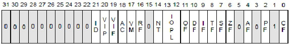
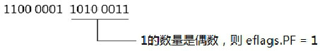
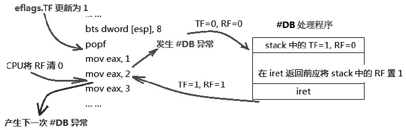
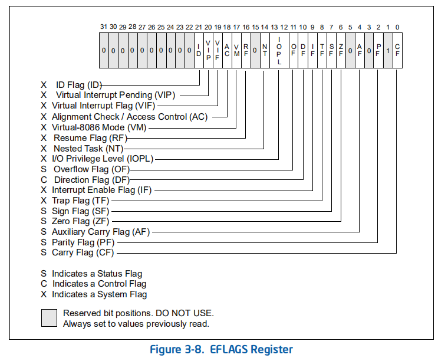

- 1 了解FLAGS
    - 1.1 Flags/Eflags/Rflags
    - 1.2 控制标志位
- 2 Eflags中的状态标志位
    - 2.1 PF标志位
    - 2.2 AF标志位
    - 2.3 signed数的运算
        - 2.3.1 溢出位和符号位的产生
        - 2.3.2 overflow的产生
        - 2.3.3 underflow的产生
    - 2.4 signed数的比较操作
        - 2.4.1 signed数的条件码
    - 2.5 unsigned数的运算
        - 2.5.1 进位标志的产生
        - 2.5.2 unsigned数的比较及条件码
- 3 IOPL标志位
    - 3.1 I/O Bitmap
- 4 TF标志与RF标志
- 5 NT标志
- 6 AC标志
- 7 VM标志
- 8 eflags寄存器的其他事项

# 1. 了解FLAGS

我们来好好地了解eflags寄存器，它看似简单，其实还真的不像想象中那样简单。

## 1.1 Flags/Eflags/Rflags

在x86/x64上，除非使用Pentium 4和Athlon 64之前的处理器，否则FLAGS都应该被扩展为64位，因为从AMD的Athlon64处理器和Intel后期的Pentium4处理器开始，都支持x86-64技术，后来慢慢将x86-64体系称为x64已对应与x86。

```asm
    pushf                   ; 压入16位的flags（低16位）
    pushfd                  ; 压入32位的eflags（低32位）
    pushfq                  ; 压入64位的rflags
```
因此在x64机器统称为rflags似乎更合适，可是在legacy mode里flags还是被称为eflags。在上面的使用中，PUSHF是压入低16位，PUSHFD是压入低32位，而PUSHFQ是压入全部的64位。

它们的Mnemonics形式不同，可是opcode是一样的，压入多少取决于operand size（操作数的大小），在16位的operand size下，压入16位，在32位的operand size下，压入32位，在64位的operand size下，压入的是64位。
与PUSHF/D/Q指令相对应的是POPF/D/Q指令，它们在助记符上有着同样的意义。



上面是32位下的eflags寄存器，在64位下rflags寄存器高32位为保留位。按Intel的分类，在eflags寄存器里可以分为：
- status flags（状态标志位）
- control falgs（控制标志位）
- system flags（系统标志位）

## 1.2 控制标志位

control falgs只有一个DF（Direction FLAGS）标志位（bit10），它使用在LODSx，STOSx，MOVSx，SCASx，OUTSx以及INTSx这类串指令，指示串指令的指针方向。

DS标志所表达的意思是（以movsb指令为例）在一个循环里：

```c
    if (eflags.DF == 0) {
        buffer[edi++] = source[esi++];      // 指针edi和esi都是递增
    } else if (eflags.DF == 1) {
        buffer[edi--] = source[esi--];      // 指针edi和esi都是递减
    }
```

- 当DF=0时，串指令中的edi和esi寄存器加1递增，在递增的情况下，源串和目标串指针应该指向起始点。
- 当DF=1时，串指令中的edi和esi寄存器减1递减，在递减的情况下，源串和目标串指针应该指向终止点。

# 2. Eflags中的状态标志位

status flags包括：OF（溢出标志）、SF（符号位标志），ZF（零标志）、AF（调整位标志），CF（进位标志），以及PF（奇偶位标志）。这些标志位反映了指令执行结果的状态值。

## 2.1 PF标志位

指令判断结果值的最低字节（byte 0），而设置相应的PF标志位，如下所示。



当最低字节（byte0）中位为1值的数量是偶数PF标志被置位，否则被清零。

## 2.2 AF标志位

当运算时bit 3发生向上进位或借位时，AF标志被置位。
AF标志位使用在BCD码的运算指令上，如下面使用AF标志位的例子。
```asm
    mov al, 8       ; al = 0000 1000B
    mov bl, 9       ; bl = 0000 1001B
    add al, bl      ; al = 0001 0001B， AF标志为1
    aaa             ; 使用AF标志进行调整，AX的结果是：00000001 00000111B
```
在上面的8+9式子里，bit3向bit4进1位，AF标志为1。
AAA指令根据AF标志进行调整后，AX的值编程0107H（BCD码形式）。

## 2.3 signed数的运算

status flags标志位中有一部分用于表达signed（符号）数运算结果的状态，一部分用于表达unsigned（无符号）数运算结果的状态。而ZF标志位可以使用在signed和unsigned数上。

signed数运算中使用的标志位有：OF（溢出）标志和SF（符号）标志。

### 2.3.1 溢出位和符号位的产生

对于signed（符号数）的溢出，有两种情况：
1. overflow（向上溢出）：当结果值超出signed数的最大值产生overflow。
2. underflow（向下溢出）：当结果值超出signed数的最小值产生underflow。

当结果产生overflow或underflow时会对OF标志位置位。

### 2.3.2 overflow的产生

我们看看下面2个正数相加的式子，为了计算方便，以4位的signed数为例。
- 式子1：7+6
- 式子2：3+4

```
            0 1 1 1 (+7)                      
        +   0 1 1 0 (+6)
    -------------------------
          1 1 1 0 1 (-3)
            -------  overflow
            
            0 0 1 1 (+3)                      
        +   0 1 0 0 (+4)
    -------------------------
            0 1 1 1 (+7)
            -------  No overflow
```
如上面所示：式子2的运算是正确的。而在式子1中的+7与+6相加里，结果值确实-3，显然这是错误的。
因为这个4位符号数的结果超出了正数最大值7，而产生overflow。
因此，在这个计算结果中eflags.OF=1（溢出标志被置位），eflags.SF=1（符号标志位被置位）。

> 结论：两个正数相加，结果为负数时，产生了overflow。

### 2.3.3 underflow的产生

同样以4位数为例，在看看2个负数相加的式子。
-  式子1：(-4) + (-8)
-  式子2：(-4) + (-1)

```
            1 1 0 0 (-4)                      
        +   1 0 0 0 (-8)
    -------------------------
          1 0 1 0 0 (+4)
            -------  underflow
            
            1 1 0 0 (-4)                      
        +   1 1 1 1 (-1)
    -------------------------
          1 0 0 1 1 (-5)
            ------------  No overflow
```

在式子1中：(-4) + (-8) = (+4)两个负数相加结果为正数，显然是错误的。4位数的负数最小值是-8，而-4加上-8的值应该为-12，它也超出了4位符号数的最小值，产生了underflow，这时eflags.OF=1，eflags.SF=0。

在式子2中：(-4) + (-1) = (-5)这个值是正确的，这时eflags.OF=0，eflags.SF=1。值得注意的是，在这两个式子中都产生了进位。因此这两个式子中，CF标志位也被置位。

> 两个负数相加，结果为正数，产生了underflow溢出。

那么，当正数和负数相加时，情况又如何呢？

```
            1 1 1 1 (-1)                      
        +   0 1 1 1 (+7)
    -------------------------
          1 0 1 1 0 (+6)
            
            
            1 1 0 0 (-4)                      
        +   0 0 1 0 (+2)
    -------------------------
          1 1 1 1 0 (-2)
```

上面的2个正数与负数相加的式子中，它们的值都是正确的，OF标志都为0（没有溢出）。
式子1中SF标志位为0，式子2中的SF标志位为1。

> 正数与负数相加，不会产生溢出。

OF标志和SF标志也将影响到条件指令的执行，在x86上有下面几类条件指令族：
- Jcc指令家族
- SETcc指令家族
- LOOPcc指令家族
- CMOVcc指令家族

这些指令助记符中cc代表一个条件助记符。

## 2.4 signed数的比较操作

上面的OF、SF、ZF标志都用于signed数的比较。在执行cmp指令比较时，是对两个数进行相减操作，将比较的结果反映在标志位上。

思考：-1 > -2？  4 > -6？ 这两个比较式子如何反映在标志位上？

计算(-1) - (-2)和(4) - (-6)的结果，从eflags标志位上获得比较结果，如下所示。

```
            1 1 1 1 (-1)                      
        -   1 1 1 0 (-2)
    -------------------------
            0 0 0 1 (1)
            
            SF=0
            OF=0
            CF=0
            ZF=0
            
            0 1 0 0 (+4)                      
        -   1 0 1 0 (-6)
    -------------------------
          1 1 0 1 0 (-2)
            ------- overflow
            
            SF=1
            OF=1
            CF=1
            ZF=0
```

- 在式子1中，-1减-2的结果是SF、OF、ZF标志位都是0。
- 在式子2中，+4减-6的结果产生了overflow，因此OF标志与SF标志都为1。

对于这两个比较式子，我们知道前面的数都大于后面的数，因此得到的结论如下。

> 当OF == SF时，比较结果是大于。

在看看-1 > 2 和 -3 > 6 这两个比较式子，我们知道前面的数都小于后面的数，那么标志位上是什么呢？

```
            1 1 1 1 (-1)                      
        -   1 1 1 0 (+2)
    -------------------------
            0 0 0 1 (-3)
            
            SF=1
            OF=0
            CF=0
            ZF=0
            
            1 1 0 1 (-3)                      
        -   0 1 1 0 (+6)
    -------------------------
            0 1 1 1 (+7)
            ------- underflow
            SF=0
            OF=1
            CF=0
            ZF=0
```
在式子2的计算中，由于负数减整数结果值为整数而产生了underflow，因此OF标志被置位。可以看出，这两个式子中，ZF为0，SF与OF标志位不相等。我们得到的结论是：

> 当OF != SF时，比较结果是小于。

### 2.4.1 signed数的条件码

基于SF标志、OF标志、ZF标志位，下面是用于signed数的条件码。

```
G（gerater）            ：OF == SF && ZF == 0
L（less）               ：OF != SF
GE（greater or euqal）  ：OF == SF
LE（less or equal）     ：OF != SF || ZF == 1
```

- 在GE（大于等于）的情况下只需要判断OF是否等于SF标志，无论ZF是否为零都满足条件。
- 在L（小于）的情况下只需要判断OF不等于SF标志就可以了，也不需要判断ZF标志。

## 2.5 unsigned数的运算

ZF标志和CF标志被用在与unsigned数相关的运算里，在unsigned数的相关比较中不会使用OF和SF这两个标志位。

> 在x86上，尽管对于数的运算，指令会同时依据unsigned和signed数的结果对OF、SF、CF以及ZF、AF和PF做出相应的设置。可是，在unsigned与signed数与条件相关的指令中会做出相应的区分。

### 2.5.1 进位标志的产生

- 在相加运算中，由于向前进位而使用CF标志置位。
- 在相减运算中，由于向前借位而使用CF标志置位。

```
            1 1 0 0 (-4)                      
        +   1 0 0 0 (-8)
    -------------------------
          1 0 1 0 0 (+4)


            1 1 0 0 (+4)                      
        -   1 0 1 0 (-6)
    -------------------------
            1 0 1 0 (-2)
```

- -4加-8产生了进位
- +4减-6产生了借位

这两个计算结果都会使CF标志置位。

### 2.5.2 unsigned数的比较及条件码

当unsigned数相减时，如果不够减则会产生借位（eflags.CF=1），表明是小于关系。
下面是用于unsigned数的条件吗。

```
A（Above）              ：CF == 0 && ZF == 0
B（below）              ：CF == 1
AE（Above or equal）    ：CF == 0
BE（below or equal）    ：CD == 1 || ZF == 1
```
这与signed数的情形类似，AE（高于等于）和B（低于）的比较中都无须判断ZF标志。

# 3. IOPL标志位

eflags有两个位来表示IOPL（I/O Privilege Level）标志位，指示访问I/O地址空间所需要的权限，这个值仅在CPL=0权限下可以修改。
IOPL标志还将影响到IF标志位，IF标志在具有IOPL所规定的权限内能被修改。

> 只有当CPL=0时，可以改变IOPL的值，当CPL <= IOPL时，可以改变IF标志位。

改变IOPL值可以使用popfd指令和iret指令，IF标志位还有专门的指令开/关中断：sti和cli指令。
当使用popfd指令进行修改时，没有足够的权限不能修改其值，但是并不产生异常。

## 3.1 I/O Bitmap

IOPL控制着程序的I/O地址空间访问权，只有在足够的权限下才能访问I/O地址，否则会产生#GP异常。
其实这话说的不太完整，还与I/O bitmap相关。

> 如果当前CPL > IOPL，在TSS段中的I/O Bitmap有最后的决定权！

是的！即使当前运行的权限低于IOPL所规定的权限，也可以在TSS的I/O Bitmap对某些port进行设置，达到可以访问I/O地址空间的目的。

当CPL > IOPL时，对port的I/O访问处理器将检查I/O Bitmap中相应的port位以决定这个I/O访问是否违规，当CPL <= IOPL时则无需检查I/O Bitmap。

I/O Bitmap中的每个bit对应于一个port，当这个bit被置位时（设为1），程序对port无访问权限。
当这个bit被清0时，port是可以访问的。

# 4. TF标志与RF标志

显然eflags.RF标志与eflags.TF标志是配合一起使用的，当TF标志被置位时，就代表开启了single-debug（单步调试）功能，处理器将进入single-debug状态。

**什么时候开始进入single-debug？**

答案是：当TF标志被置位，执行完下一条指令后，处理器进入#DB handler。这是应为single-debug属于Trap类型的#DB异常。看看下面的指令序列。
```asm
    ; enable single debug
    
    pushfd
    bts dword [esp], 8          ; eflags.TF=1
    popfd                       ; 更新eflags寄存器
    
    mov eax, 1                  ; test 1
    mov eax, 2                  ; test 2
    mov eax, 3                  ; test 3
    mov eax, 4                  ; test 4
    mov eax, 5                  ; test 5
```
**popfd指令执行完后，将更新TF标志为1，那么应该是在test 1之前还是之后呢？**

答案是test 1之后（test 2之前），是在TF被置位后的下一条指令执行完后产生#DB异常。

处理器在进入#DB异常处理器程序之前，会将TF标志清0以防止在中断处理程序内发生single-debug，这是显然易见的事情，RF标志也会被清0。在进入中断处理器程序前，NT和VM标志都会得到清0。

那么，在压入单步调试#DB处理程序stack内的eflags寄存器中TF是原来的值（即为1），RF标志被清0。



看看上图：当popf指令执行完毕后，TF被置1，第1条mov指令执行完毕，产生#DB异常，CPU进入#DB处理程序后清TF和RF标志，而在#DB处理程序里，在iret指令返回前，应该将stack中的RF标志置为1，以确保返回到被中断的指令时能够顺利执行。iret指令将pop回stack中原来的eflags值。

当地2条mov指令执行完毕后，CPU将清RF标志为0，处理器重新转入到#DB处理程序中执行。除非TF标志被清0，否则重复上一流程。

由于引发#DB异常的不止single-debug（单步调试）这一途径。#DB异常可以是Fault类型或者Trap类型，因此，在#DB异常处理程序中有责任去确保返回被中断的执行能够得到正常执行。通过设置stack中的eflags映像中的RF为1，让iret返回前更新eflags寄存器。

处理器会在每一条指令执行完毕后将RF标志清0，RF标志的值基本上恒为0。

# 5. NT标志

这个NT标志也牵连着其他复杂的信息，NT标志被使用于处理器提供的task switch（任务切换）场景中，它是Nested Task（嵌套任务）标志位。
- 当NT=1时，表示当前执行的任务被嵌套在另一个任务里（这是从任务的术语上来讲）。
- 当NT=0时，标志当前执行的任务没有被嵌套。

NT标志一般由处理器自动维护，但是可以在任何权限下被软件修改。

**什么时候NT标志被置为1？**

在使用call指令进行task switch以及发生Interrupt/Exception时的task switch，处理器从new task的TSS加载完eflags寄存器后，会将NT置1。

> 这个情景中的task switch是指：call调用一个TSS Selector或者Task-gate，以及Interrupt/Exception发生时，vector指向IDT中的Task-gate。

当然，使用jmp一个TSS Selector或Task-gate也会产生任务切换，iret指令也可以产生任务切换，但它们不再上述将NT置为1的情景中。

在上述的task switch情景中，处理器会同时将旧任务的TSS Selector写入新任务TSS段中的previous-link域中，以便可以切换回到旧任务。

**什么时候NT标志被清0？**

其中一个情景是：当使用iret指令从被嵌套的任务（new）返回到原来的（old）任务时，处理器从stack中pop出eflags寄存器后会清NT为0（实际上是，先将stack中eflags寄存器image中的NT位清0，然后pop的时，NT标志就为0）。

当执行iret指令时，处理器会检查当前的eflags.NT标志是否为1，为1时表示处于nested状态，执行完毕后NT被清为0。

> 这个情景中的返回是指：使用iret指令从Interrupt/Exception处理程序中返回时。注意：使用ret指令从一个过程的返回并不在其中。

当执行ret指令时，并不会清NT标志位（不改变stack中的eflags寄存器image中的NT标志位，pop的时候NT标志为0），它并不需要去检查NT标志位是否为1值。

另一个情景是：使用jmp进行task切换时，处理器从新任务的TSS加载eflags完后，会将NT标志清为0，表示JMP指令执行的并不是嵌套任务。

在软件中可以由程序员自己手工去修改NT标志的值，通过修改在stack中eflags寄存器image的NT标志位，然后使用popf指令进行更新。

在long mode下的64位模式下并不支持TSS的task switch机制，因此，在64位模式下NT标志位是无效的。

# 6. AC标志

eflags中的AC标志是指Alignment Check（地址中的对齐检查），只有当同时开启CR0.AM和eflags.AC标志位时处理器才支持这项功能。

我们从下面的表格来看，什么情况下才是有效的alignment粒度。


支持的数据尺寸 | Alignment Boundary（byte）
---|---
byte | 1
word | 2
doubleword | 4
quadword | 8
Bit string | 2 or 4 or 8
128-bit media | 16
64-bit media | 8
segment selector | 2
32-bit near pointer | 4
32-bit far pointer | 2
48-bit far pointer | 4
80-bit far pointer | 8
single precision float point | 4
double precision float point | 8
extended precision float point | 8
float point save areas | 2 or 4

当对上述的某一类数据类型的访问违反了它的粒度时，会产生#AC异常。
```asm
    mov ax, WORD [0x10003]          ; 跨WORD类型边界
    mov eax, DWORD [0x10005]        ; 跨DOWRD类型边界
    mov rax, QWORD [0x10007]        ; 跨QWORD类型边界
    mov esi, 0x10006                
    lodsd                           ; 跨bit string类型边界
```
上面几种情况下，都属于non-alignment行为。只有在权限级别3下的non-alignment行为才会产生#AC异常，在0、1、2级别下不会产生#AC异常。

# 7. VM标志

eflags中的VM标志指示着处理器进入和离开Virtual-8086模式。
- 当VM=1时，进入Virtual-8086模式
- 当VM=0时，离开Virtual-8086模式

VM标志不能被popfd指令修改，只有两种途径可以值eflags.VM标志位。

1. 执行一个task switch（任务切换）时，包括：使用call/jmp指令执行一个TSS Selector或Task-gate，在TSS段中的eflags寄存器image中VM被置1，处理器加载eflags时，VM为1，从而进入Virtual-8086模式；当执行iret指令时，stack中的eflags.NT=1标志进行任务切换，如果TSS段中的eflags.VM为1，页指示处理器进入Virtual-8086模式。
2. 当执行iret指令时，stack中的eflags映像的VM为1，也将指示处理器进入Virtual-8086模式。

只有执行iret指令，stack中的eflags映像的VM标志为0时，才会离开Virtual-8086模式，执行call/jmp进行任务切换（TSS段中的eflags.VM为0）这种情况并不能离开Virtual-8086模式。

在64位模式下，处理器不支持virtual-8086模式，VM标志位也被忽略。

# 8. eflags寄存器的其他事项

处理器初始化后，eflags的值为00000002H，bit1为1，其他位为0，bit1时保留位，其固定值为1。
某些标志位可以使用专门指令进行设置，对于CF标志，可以使用STC指令置位，CLC指令清位，CMC指令对CF标志进行取反。对于DF标志，可以使用STD指令置位，CLD指令清位。

STI指令可以对IF标志进行置位，CLI指令对IF标志进行清位。它需要足够的权限来修改IF标志位，这个足够的权限是：CPL <= IOPL。

可是这和popfd指令修改IF标志位不同，当不够权限时（CPL > IOPL），popfd指令修改IF标志不会产生#GP异常，而使用STI指令时会产生#GP异常。

**附录：EFLAGS寄存器**

