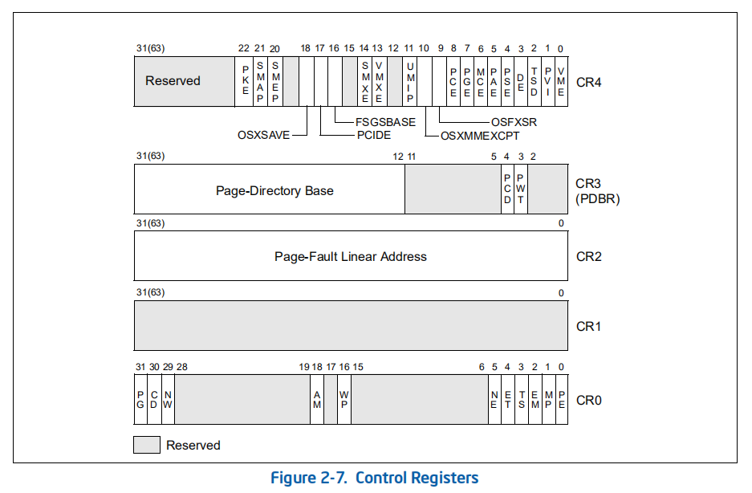
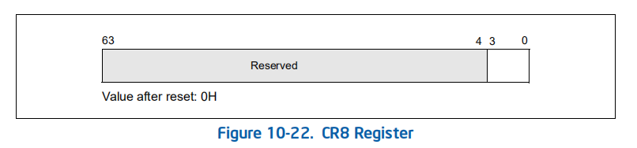
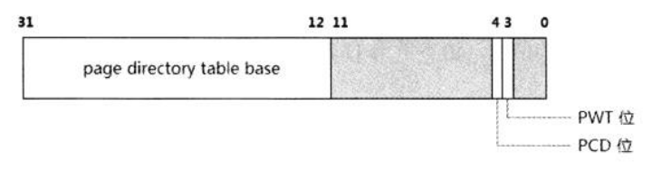
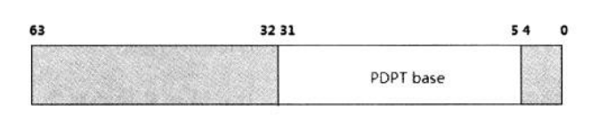
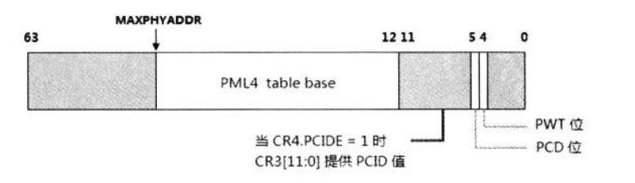
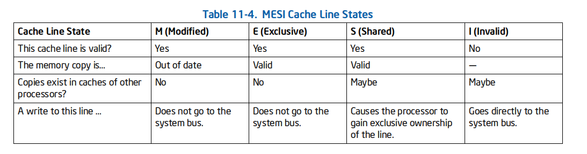
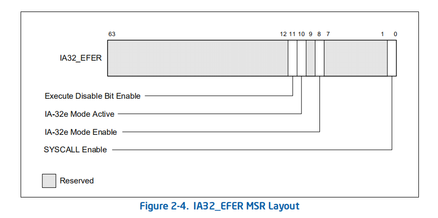

- 1 概述
- 2 CR8
    - 2.1 中断优先级别
- 3 CR3
- 4 CR0
    - 4.1 保护模式位PE
    - 4.2 x87 FPU单元的执行环境
    - 4.3 CR0.PG控制位
    - 4.4 CR0.CD与CR0.NW控制位
        - 4.4.1 如何维护cache与memory的一致性？
    - 4.5 CR0.WP控制位
    - 4.6 CR0.AM控制位
- 5 CR4
    - 5.1 CR4.TSD与CR4.PCE控制位
    - 5.2 CR4.DE与CR4.MCD控制位
    - 5.3 CR4.OSFXSR控制位
    - 5.4 CR4.VMXE与CR4.SMXE控制位
    - 5.5 CR4.PCIDE与CR4.SEMP控制位
    - 5.6 CR4.OSXSAVE控制位
    - 5.7 CR4中关于页的控制位
- 6 EFER扩展功能寄存器
    - 6.1 开启long-mode

# 1. 概述

在x64上Control Register（控制寄存器）被扩展为64位，有CR0 ~ CR15共16个寄存器，可是在整个体系的使用中，只使用了其中的CR0、CR2、CR3、CR4、CR8寄存器，其他都被保留的。

它们在64位模式下使用64位的宽度，在其他模式下依然是32位宽度，下面是这些寄存器的结构图。



- CR0与CR4组合起来对处理器提供了根本的控制，比如处理器的工作模式和一些模式中使用的特色功能。
- CR2和CR3被使用在保护模式的页管理机制中。CR2保存着访问内存时引发#PF异常的线性地址值（典型地如：当访问一个页时，它不再内存中（未映射）或者没有对它进行访问的权限而引发#PF异常）。CR3提供整个页转换结构表的基地址，这个基地址是物理地址。

# 2. CR8

CR8又被称为Task Priority Register（任务优先级寄存器），它在64位模式下才有效。它的结构如下所示。



CR8的低4位（bit3 ~ bit0）提供一个Priority Level值，这个值为0 ~ 15，将控制处理器可以响应的中断级别，这个中断属于maskable（可屏蔽的）硬件中断。如果这个值被设为0，则可能响应所有的中断，如果设为15则处理器不会响应所有的中断。

## 2.1 中断优先级别

在x86/x64体系里中断向量为0 ~ 255（1byte），因此使用了16个中断优先级（0 ~ 15），这个优先级的计算如下。
```asm
    Priority Level =  Vector / 16
```
软件不能使用0 ~ 15作为硬件中断vector值，否则会产生错误，它们是保留给系统使用的。所以实际优先级别只使用了1 ~ 15（对应于中断vector 16 ~ 255）。然而使用16 ~ 31向量号虽然不会产生错误，但不推荐使用（它们也是保留给系统使用）。

CR8在初始化时为0值，除了向量号从0到15时不可用外，可以响应所有的中断。如果设CR8值为1，将抑制16 ~ 31的中断向量。

又如当设CR8[3:0]为1000B时，priority level值为8，处理器对优先级低于等于8的中断进行阻塞，响应优先级大于8的中断。

CR8时local APIC的TPR（Task Priority Register）对外的编程接口，它们的值和作用是一样的。
对CR8进行更改会影响到local APIC的TPR，写入CR8[3:0]的值会同时写入TPR[7:4]中，TPR[7:4]的值就等于CR8[3:0]的值。

# 3. CR3

CR3被指向第1级的页转换表结构，它指向的页表结构因使用的分页模式不同而不同。
- 在使用non-PAE模式下的分页结构时，是指向Page-Directory Table的基地址。
- 在使用PAE模式下的分页结构时，是指向Page-Directory-Pointer Table的基地址。
- 在long mode下，是指向Page-Map Level-4 Table的基地址。

因此，在这些模式之下，CR3的内容也有不同。



上图是32bit paging中的CR3结构，CR3[31:12]提供PDT的物理基地址高20位，而PDT地址的低12位为0。
因此CR3提供的PDT是4K边界对齐的。
CR3[3]是PWT（Page-level WriteThrough）位，CR3[4]是PCD（Page-level Cache Disbale）位。


在PAE模式下，分页转换结构被扩展为64位模式，CR3结构如下所示。



在这个CR3结构里，CR3[4:0]是忽略的，并没有PWT和PCD标志位，CR3[31:5]提供32位PDPT的物理基地址的高27位，PDPT地址的低5位为0，因此这个PDPT是32字节对齐的。



上图是处理器在long mode下的CR3结构，如果处理器支持52位的物理地址，那么CR3[51:12]提供PML4表基地址的高40位。如果处理器支持40位物理地址，那么CR3[39:12]提供高28位。否则只支持36位物理地址，CR3[35:12]提供高24位。PML4表基地址的低12位是0，因此PML4表是4K边界对齐的。

> MAXPHYADDR的值从CPUID.EAX=8000008h leaf里查询，返回的EAX[7:4]就是MAXPHYADDR的值。

x64处理器体系中目前最高支持52位的物理地址，由处理器的实现决定。
在Intel处理器中支持CR4.PCIDE标志位。在支持PCID功能的Intel64机器中，只有当CR3[11:0]为0时，CR4.PCIDE才能被置位，否则会产生#GP异常。

> 当执行mov cr3,reg指令后，处理器内的TLB将被强制刷新。除非页面被设置为Global属性。

# 4. CR0

CR0里有许多重要的控制位，其中最重要的一个是PE控制位，它决定着处理器处于保护模式还是实模式。

## 4.1 保护模式位PE

处理器在初始化后，CR.PE=0则处于实模式状态。当置CR0.PE=1时，表示处理器处于保护模式状态下，处理器将按照保护模式下的行为进行运作。

> 为处理器提供保护模式的执行环境，这是系统软件的职责。处理器只负责按照保护模式的规则运行。

## 4.2 x87 FPU单元的执行环境

x87 FPU的执行环境涉及4个控制位：CR0.NE、CR0.EM、CR0.TS、CR0.MP控制位。

- CR0.NE（bit 5）：决定X87 FPU单元使用哪种处理模式即native（原生）模式还是DOS compatibility模式。
- CR0.EM（bit 2）：是x87 FPU执行单元模拟位，用软件形式来模拟x87 FPU指令的执行。
- CR0.TS（bit 3）：是TS（Task Switched）控制位，当处理器发生task switch时，会对eflags.NT标志进行置位，同时还会对CR0.TS进行置位，指示当前发生过任务切换。
- CR0.MP（bit 1）：是MP（Monitor Coprocessor）控制位，MP的设置为了监控wait/fwait指令的执行。

## 4.3 CR0.PG控制位

CR0.PG置1时将开启页式管理机制。开启页式管理前必须要打开保护模式，否则将产生#GP异常。
显然在打开页式管理机制之前，应该先构造好整个页转换结构表，一旦CR0.PG被置位，则表示马上使用分页机制。

在页式内存管理机制中，虚拟地址被映射到物理地址上，物理地址的寻址范围可以超过虚拟地址。典型地如：可以将一个32位宽的线性地址空间映射在36位宽的物理地址空间上。

## 4.4 CR0.CD与CR0.NW控制位

CR0.CD（Cache Disable）与CR0.NW（Not Write-Through）结合起来对处理器内部的cache进行控制。
- 当CD=1时，memeory不被cache。
- 当NW=1时，处理器不维护memeory的一致性。

通俗地讲：当CD=1时表示memeory的cache是Disable状态，对新的memory访问时，不会被加载到Cache中；
而NW=1时，表示Not Write-Through（不直写），回写memeory。

CR0.CD与CR0.NW是组合使用的，Intel明确列出它们组合产生的影响，当CD=0而NW=1时，这是错误的，会产生#GP异常（表明：memeory cache是开启的，但是却不维护memeory的一致性，显然不正确）；CD=0且NW=0时对cache的正常使用方法，表明：memeory cache开启页需要维护memeory的一致性。

### 4.4.1 如何维护cache与memory的一致性？

Intel处理器上使用MESI（Modified，Exclusive，Shared，Invalid）协议维护处理器cache之间以及memory的一致性。



当cache line的状态时M，E，S时cache是有效的。为I状态时，cache line失效将被写往memory上，当发生cache write hit（写cache）时，S状态改为M状态（共享cache line被标记为已经改写），这是对应的memory的数据是失效的。

当这个M状态的cache line变为I（Invalid）状态时，处理器会写往memory，保证memory数据保持同步有效。系统软件页可以使用INVD指令发起置cache line无效，强迫写往memory（data cache不回写，将丢失），使用WBINVD指令回写所有Modified状态的cache line并使这些cache line置为I状态。CFLUSH指令提供一个需要flush的地址，将包含这个地址的cache line回写到memory上。

对于S状态的cache line发生write hit时，同时也从S状态改为E（独占）状态，可以看到M状态，E状态以及S状态都不写memory，除非上述所说的发起写操作。

回到CD和NW控制位来，CD=0以及NW=0时，发生write miss时会引起cache line fill操作，这时如果cache line是S（共享）状态的，在cache line fill操作之前，会写往memory，保证memory数据的完整性。cache write hit时，如果是S状态的，会将shared line改为modified line，cache line会被更新。当发生read hit是正常读，read miss时引发replacement操作。

当CD=1以及NW=0时，cache line不会发生新的fill操作，但是会维护现有cache line的完整性。那么当发生write miss时，处理器不会进行cache line fill操作（因为CD=1），此时处理器会直接发起访问memory操作，同样如果是修改shared line会引发回写memory操作，write hit时会正常更新cache line；而read miss时也不会引发replacement操作。

当CD=1以及NW=1时，cache line不会发生新的fill操作，也不会维护memory的完整性。read hit得到正常访问，read miss不会replacement；wirte hit将更新现有的cache line，如果是E状态的，将E状态改为M状态，如果是S状态的维持S状态不变；write miss将直接发起访问memory。

## 4.5 CR0.WP控制位

CR0[16]是WP（Write Protect）控制位。
- 当WP=1时，即使拥有supervisor权限的程序也不能修改read-only页。
- 相反WP=0时，允许supervisor权限的程序修改read-only页。

对于页级的supervisor权限是指0、1、2级权限，User权限是指3级权限。

## 4.6 CR0.AM控制位

我们已经了解到：仅当CR0.AM=1并且eflags.AC=1时，可以使处理器开启地址边界对齐检查机制。

当AM或AC其中一个为0时，这个对齐检查机制是关闭的。当检查不通过时会产生#AC异常，而这个#AC异常仅在3级权限下才会发生。

# 5. CR4

接下来了解CR4，CR4提供了一些扩展的控制功能。

## 5.1 CR4.TSD与CR4.PCE控制位

- 当CR4.TSD=1时，RDTSC和RDTSCP指令只能在0级权限下执行。
- 反之CR4.TSD=0时，RDTSC和RDTSCP指令可以在任何权限下执行。

CPUID查询leaf中有两个与TSD（Time Stamp Disable）相关：
1. CPUID.EAX=01H中返回的EDX[4].TSC标志位用来检测是否支持CR4.TSD控制位。
2. CPUID.EAX=80000001H中返回的EDX[27].RDTSCP位用来测试是否支持RDTSCP指令。

CR4[8]是PCE（Performance-Monitoring Counter Enable）位。
- 当CR4.PCE=1时RDPMC指令可以在任何权限下执行。
- 当CR4.PCE=0时只能在0级权限下执行。

## 5.2 CR4.DE与CR4.MCD控制位

CR4[3]是DE（Debugging Extensions）位，用于dr4和dr5时被保留的。
- 当DE=1时，使用dr4和dr5会产生#UD异常。
- 当DE=0时，dr4和dr5被映射到dr6和dr7。

CR4[6]是MCE（Machine-Check Enable）位。
- 当MCE=1时，开启Machine-Check机制。
- 当MCE=0时，关闭Machine-Check机制。

> CR4.DE和CR4.MCE功能需要处理器支持，可以从CPUID.EAX=01H.EDX寄存器里获得，返回的EDX[2]是DE支持位，EDX[7]是MCE支持位。

## 5.3 CR4.OSFXSR控制位

CR4[9]是OSFXSR位，使用在OS初始化SSE系列指令的执行环境中，OS置CR4.OSFXSR为1时，表示已经为SSE执行环境做好准备。

- 当CR4.OSFXSR=1时，指示SSE系列指令时可用的，FXSAVE和FXRETOR指令可以保存XMM寄存器和MXCSR的状态。
- 当CR4,OSFXSR=0时，FXSAVE和FXRSTOR指令只能保存x87和MMX寄存器的状态，使用SSE系列指令会产生#UD异常。

> CR4.OSFXSR功能需要处理器支持，可以从CPUID.EAX=01H.EDX寄存器里获得，返回的EDX[24]是FXSR支持位。

## 5.4 CR4.VMXE与CR4.SMXE控制位

CR4[13].VMXE是VMX-Enable位，当CR4.VMXE=1时将开启VMX（Virtual Machine Extensions）功能，由VMXON指令进入VMX模式，VMXOFF指令退出VMX模式，最后CR4.VMXE清0关闭VMX功能，CR4.VMXE清0只能在VMX模式以外。

> CR4.VMXE需要处理器支持，可检查从CPUID.EAX=01H返回的ECX[5].VMX看是否的到支持。

CR4[14].SMXE是SMX-Enable位，置位表示开启SMX（Safer Mode Extensions）功能。可以使用GETSEC指令查询SMX功能。

> CR4.SMXE需要处理器支持，可检查从CPUID.EAX=01H返回的ECX[6].SMX看是否得到支持。

VMXE与SMXE控制位仅在Intel上使用，AMD机器上是保留位。

## 5.5 CR4.PCIDE与CR4.SEMP控制位

这两个位也只能在Intel上使用，CR4[17].PCIDE置位将开启Process-context identifiers功能，CR4[20].SEMP置位将开启Supervisor mode execution prevention功能。

> CR4.PCIDE需要处理器支持，可检查从CPUID.EAX=01H返回的ECX[17].PCID位看是否得到支持。

CR4.SMEP仅在Intel处理器上支持，它控制supervisor权限的程序仅能执行具有supervisor权限的代码页。
当页具有可执行权限时（页表项的XD=0），设CR4.SMEP=1则指示，在supervisor权限下只能执行U/S位为0（即：Supervisor权限）的页而不能执行user权限的代码。

> 具有可执行权限的页是指：EFER.NEX=0（表示Execution Disable技术不被支持）或者在支持NEX技术的情况下，页表项的XD位被清0（表示页可执行）。

CR4.SMEP位仅对supervisor权限的代码起作用，对user代码不起作用。

## 5.6 CR4.OSXSAVE控制位

如果处理器不支持XSAVE和AVX指令，那么置CR4.OSXSAVE位将产生#GP异常。
处理器支持XSAVE和AVX指令的情况下，当CR4.OSXSAVE=1，则表示OS已经为AVX指令的执行环境做好准备了，可以使用SAVE/XRSTOR指令以及XSETBV/XGETBV指令。置CR4.OSXSAVE为1时OS的职责，OS置位前会检查是否支持AVX和XSAVE指令。

## 5.7 CR4中关于页的控制位

最后是CR4与页管理有关的控制位，包括CR4.PSE、CR4.PAE、CR4.PGE位。
在CPUID.EAX=01H叶中有3个与它们有关的支持位。

当EDX的这些返回位被支持时，CR4里的那些相关位才是有效的。CR4.PSE=1时表示支持4M-page页面。

> CR4.PSE控制位使用在32位的页结构中（non-PAE模式），在PAE模式中CR4.PSE被忽略。

当CR4.PSE=1，并且在PDE的PS位为1时，这一级PDE所管理的页将使用4M page进行管理，当PS=0时，使用4K page。


当CR4.PAE=1时，开启扩展的物理地址，同时将使用64位的页表结构。CR4.PAE会忽略CR4.PSE标志，在目前的x86/x64平台上，可描述的最高物理地址是52位。因此在页转换结构表项里的物理地址将会是52位和MAXPHYADDR的值之间的选择，
当CR4.PAE=1并且PDE.PS=1时，将使用2M page页面。PDE.PS=0时，使用4K page页面映射。

当CR4.PGE=1时，物理page frame允许定义为global页。也就是在页转换结构表中最低一级的table entry里设置。
当G=1时将定义一个global页，这个global页在TLB中长期保留，使用mov cr3,reg指令更新CR3时，这个global页面不会被刷新。

# 6. EFER扩展功能寄存器

EFER是x64体系中新增的寄存器，为了支持long-mode而引入。



## 6.1 开启long-mode

EFER是MSR中的一员，它的地址是C0000080H，它是x64体系的基石。EFER.LME=1时，开启long mode，代码如下。
```asm
    mov ecx, IA32_EFER
    rdmsr
    bts eax, 8              ; EFER.LME=1
    wrmsr
```
可是并不代表long mode是生效的，当EFER.LMA=1时才表示处理器目前处于long mode之下。EFER.LMA标志位是由处理器维护的。

开启long mode后必须要开启paging内存管理机制。因此，当EFER.LME=1并且CR0.PG=1时，处理器置EFER.LMA为1，表示long mode处于激活状态。

EFER.NXE=1时表示可以使用Execution Disbale功能，给某些页定义为不可执行的页面。
EFER.SCE=1时可以使用syscall/sysret指令快速切换到Kernel组件。

> 在intel处理器上的sysenter/sysexit指令可以替代syscall/sysret指令的使用。