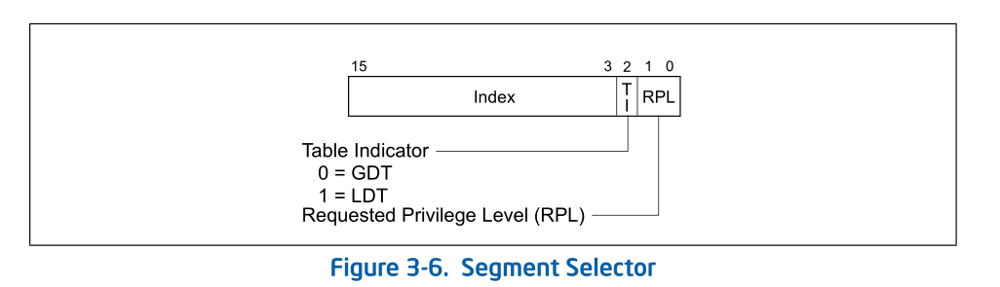

# 1 概述

```
logic address --> segmentation --> linear address --> paging  --> physical address
```

在代码中的logic address（逻辑地址）经过segmentation（段式管理）转化为linear address（线性地址）后，如果开启了paging（页式管理）机制，这些linear address是virtual address形式，在paging内存管理中，这些virtual address被分成内存page的形式映射到物理地址空间的物理页面上。

# 2 物理页面

处理器通过paging机制可以在32位和48位的虚拟地址上使用39位、46位甚至52位宽的物理地址，由paging机制提供的各级page-translation table（页转换表）实现。


## 2.1 物理地址空间

①39位：在Intel酷睿处理器，最大物理地址为39位，可寻址空间为512GB。

①46位：在Intel志强处理器，最大物理地址为46位，可寻址空间为65536GB = 64TB。

③52位：这是x64体系描述中的最高实现值，然而目前尚未有哪个处理器架构实现了52位的物理地址宽度。

## 2.2 处理器的最高物理地址

最高物理地址的专用语MAXPHYADDR在整个x86/x64体系中许多地方都需要用到，我们可以通过CPUID.80000008H leaf获得MAXPHYADDR值。

## 2.3 物理页面大小

在整个x86/x64体系里共有4种页面尽寸，如下所示。



# 3 页转换模式（Paging Mode）

按Intel的分类，页转换模式（paging mode）可分三类。

① 32-bit paging（32位页转换模式）：即non-PAE模式。

② PAE paging（Physical Address Extensions页转换模式）。

③ IA-32e paging（IA-32e页转换模式）：对应于AMD64的long-mode。


## 3.1 32位页转换模式

在32位页转换模式里，CR4.PAE=0关闭PAE，32位的线性地址可以映射到超过32位的物理地址上（由MAXPHYADDR所决定），处理器可以使用2种页转换表。

① 4K页面的page-translation table（页转换表）。

② 4M页面的page-translation table（页转换表）。

## 3.2 PAE页转换模式

当开启CR4.PAE=1时，处理器使用PAE页转换模式。在PAE模式下可以使用最高52位的物理地址，当前x86/x64体系中所描述的最高的物理地址就是52位。

在PAE页转换模式下，使用2种页面转换表结构。

① 4K页面的转换表结构。

② 2M页面的转换表结构。

## 3.3 IA-32e页转换模式

使用IA-32e paging模式需要处理器支持IA-32e模式（即long-mode），进入了IA-32e工作模式也就使用了IA-32e paging模式。

IA-32e paging必须开启CR0.PAE功能。因此，IA-32e paging模式是在PAE的基础上扩展而来，增加了一级页转换表结构。IA-32e paging使用4级页转换结构，包括下面的页面结构。

① 4K页面的转换表结构。

② 2M页面的转换表结构。

③ 1G页面的转换表结构。

在64位模式下，处理器将48位的virtual address转换为物理地址。在compatibility模式下，处理器将转换32位的virtual address。


# 4 paging机制下使用的资源

## 4.1 寄存器

下面的寄存器需要被使用。

① CR0、CR2、CR3和CR4。

② IA32_EFER。

CR0和CR4用来开启和控制paging机制及页转换表结构，CR2是保存发生#PF异常的线性地址，CR3是整个页转换表结构的基地址。

IA32_EFER开启IA-32e模式（long-mode）。

## 4.2 CPUID查询leaf

在paging机制里某些功能需要先查询处理器是否支持，在支持的情况下才可以enable功能。

## 4.3 寄存器的控制位

CR0和CR4有许多控制位被使用在paging机制上。

① CR0.PG：在CR0.PE=1的基础上，置CR0.PG=1开启paging机制。

② CR0.WP：对CR0.WP置位可以启用Write Protect功能，使Supervisor用户也无权对Read-only（只读）页进行修改。

③ CR0.CD与CR0.NW：将影响到各级页转换表结构里的PCD和PWT标志，包括CR3。

④ CR4.PSE：置CR4.PSE=1时，配合PDE.PS标志位在32位paging模式里使用4M页面。

⑤ CR4.PAE：置CR4.PAE=1时，开启PAE paging模式。CR4.PAE控制位将忽略CR4.PSE的作用。

⑥ CR4.PGE：置CR4.PGE=1时，配合PDE.G和PTE.G标志位启用Global page功能，当更新CR3时，TLB里Global page不被刷新。

⑦ CR4.SMEP：置CR4.SMEP=1时，启用SMEP功能，防止Supervisor用户执行用户代码。

⑧ CR4.PCIDE：置CR4.PCIDE=1时，启用process-context identifier功能。

⑨ IA32_EFER.LME：置IA32_EFER.LME=1时，开启long-mode，但需要开启paging机制后才被激活。

⑩ IA32_EFER.LMA：置CR4.PAE=1，且CR4.PG=1时，激活long-mode。

⑪ IA32_EFER.NXE：置IA32_EFER.NXE=1时，在PAE paging模式和IA-32e paging模式里启用Execution Disable功能。

## 4.4 页表转表资源

处理器paging机制里使用的各级页转换表，最终是为了查找线性地址映射到物理地址空间上相应的page frame，再由page frame基地址加上page offset值得出最终的物理地址。


在三种paging模式里，根据不同的页面尺寸使用不同的页转换表结构。

### 4.4.1 32位paging模式

线性地址是32位宽, 采用一级或两级页转换表, 每个表项大小是4字节宽即32位, CR3使用32位。

- 4K页面下：使用PDT（page directory table，页目录表）和PT（page table，页表）两级索引。

4KB页面线性地址构成: 10(PDT索引, 1024个项) + 10(PT索引, 1024个项) + 12(Page offset, 4KB页)

- 4M页面下：使用PDT（page directory table）一级索引。

4MB页面线性地址构成: 10(PDT索引, 1024个项) + 22(Page offset, 4MB页)

### 4.4.2 PAE paging模式

线性地址32位宽, 使用两级或三级页转换表, 每个表项8字节宽即64位, CR3还是32位, 但只使用了27位, 拼凑了32位PDPT物理地址。

在PAE paging模式里使用两级或三级页转换表。

- 4K页面下：使用PDPT（page directory pointer table，页目录指针表），PDT和PT。

4KB页面线性地址构成: 2(PDPT索引, 4个项) + 9(PDT索引, 512个项) + 9(PT索引, 512个项) + 12(Page offset, 4KB页)

- 2M页面下：使用PDPT和PDT。

2MB页面线性地址构成: 2(PDPT索引, 4个项) + 9(PDT索引, 512个项) + 21(Page offset, 2MB页)

### 4.4.3 IA-32e paging模式

线性地址48位宽, 使用两级到四级的页转换表, 每个表项都是8字节宽即64位, CR3是64位宽, 针对是否支持PCIDE功能, CR3使用不一样。

- 4K页面下：使用PML4T（page map level-4 table，四层映射表），PDPT，PDT和PT。

4KB页面线性地址构成: 9(PML4T索引, 512个项) + 9(PDPT索引, 512个项) + 9(PDT索引, 512个项) + 9(PT索引, 512个项) + 12(Page offset, 4KB页)

- 2M页面下：使用PML4T，PDPT和PDT。

2MB页面线性地址构成: 9(PML4T索引, 512个项) + 9(PDPT索引, 512个项) + 9(PDT索引, 512个项) + 21(Page offset, 2MB页)

- 1G页面下：使用PML4T和PDPT。

1GB页面线性地址构成: 9(PML4T索引, 512个项) + 9(PDPT索引, 512个项) + 30(Page offset, 1GB页)

每个table里的entry（表项）分别被称为PTE（Page Table Entry）、PDE（Page Directory Table Entry）、PDPE（Page Directory Pointer Table Entry）和PML4E（Page-Map Leve-4 Table Entry）。