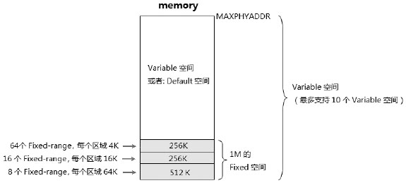
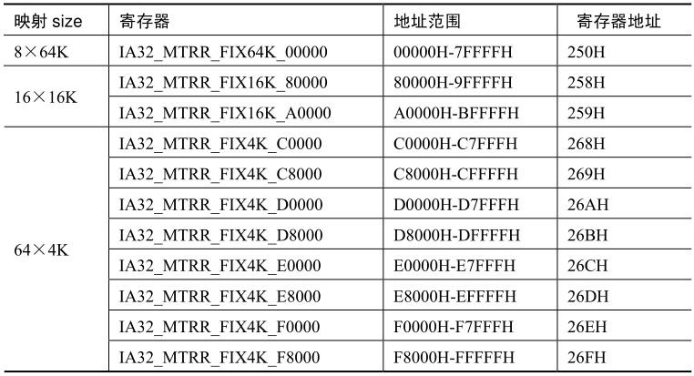
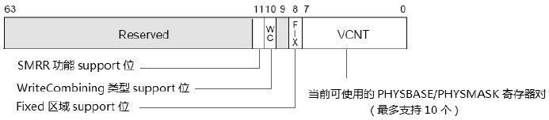
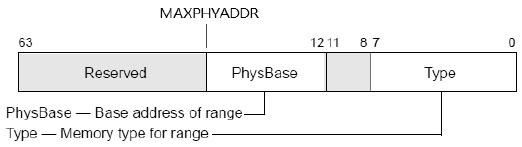
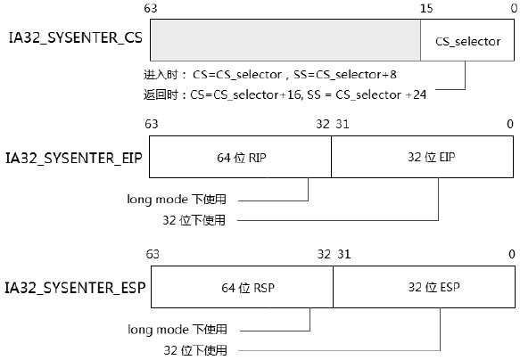

- 1 概述
    - 1.1 MSR由什么作用
- 2 MSR的使用
- 3 MTRR
    - 3.1 Fixed-range区域的映射
    - 3.2 MTRR的功能寄存器
    - 3.3 Variable range的定义
- 4 MSR中对特殊指令的支持
    - 4.1 支持sysenter/sysexit指令的MSR
    - 4.2 支持syscall/sysret指令的MSR
    - 4.3 支持swapgs指令的MSR
- 5 提供processor feature管理
- 6 其他未列出来MSR
- 7 关于MSR一些后续说明

# 1. 概述

MSR（Model-Specific Register）是让人头痛的一类寄存器，这类寄存器数量庞大，Intel和AMD的处理器的实现程度不相同，并且在Intel的不同架构上也可能不同。因此，MSR是与处理器model相关的。

## 1.1 MSR由什么作用

MSR提供对硬件和人际相关功能的一些控制。能提供对一些硬件和人际运行环境的设置，许多MSR应在BIOS运行期间设置。

下面是Intel列出的MSR的功能：
1. performance-monitoring counters（性能监视计数器）。
2. debug extensions（调式扩展支持）。
3. machine-check exception capability（机制检查的能力）。
4. MTRR（实现memory类型域范围定义的寄存器）。
5. thermal and power management（功耗与温度管理）。
6. instruction-specifi support（特殊指令的支持）。
7. processor feature/mode support（处理器特色和模型管理的支持）。

AMD部分的MSR与Intel是兼容的，但是少了许多特色功能。

# 2. MSR的使用

每个MSR都有它的地址值（或许称为编号更合适些）。
- MSR的读取使用rdmsr指令。
- MSR的写入使用wrmsr指令。
- 由ecx寄存器提供需要访问的MSR地址值。

```asm
    mov ecx, 176H           ; IA32_SYSENTER_EIP寄存器的地址
    rdmsr                   ; 读MSR内容到EDX:EAX寄存器
```
MSR是64位宽的，在上面的代码里读出来的IA32\_SYSENTER_\EIP寄存器值放到EDX:EAX寄存器中，高32位在EDX寄存器，低32位放在EAX寄存器。

在64位环境里rdx和rcx寄存器高32位都被清0。
```asm
    mov rcx, 176H
    mov rdx, KERNEL_SERVICE_ENTRY
    mov rax, rdx
    shr rax, 32             ; 拆分到EDX:EAX放入64位的值
    wrmsr
```
写入时EDX:EAX放入64位的值，像上面的代码一样在64位下，需要将64的值拆分到EDX和EAX寄存器中。

若提供MSR地址是保留或未实现的，则执行rdmsr和wrmsr指令会产生#GP异常。

```shell
[root@lab ~]# rdmsr 0x176
ffffffff81789d10
```

# 3. MTRR

先关注MSRR（Memory Type Range Register），MTRR的作用是将memory物理地址划分某些区域，并且可以为这些区域定义不同的memory类型，如下表所示。


Memory类型 | 编码值
---|---
Uncacheable（UC）| 00H
WriteCombining（WC）| 01H
WriteThrough（WT）| 04H
WriteProtected（WP）| 05H
WriteBack（WB）| 06H

这些值的作用是在MTRR里位range定义相关的memory类型。

可以划分为3中区域：
- fixed（固定的）
- variable（可变的）
- default（默认的）

当memory中不划分fixed或variable区域时，这时候memory就是default的区域：



如上所示，在整个物理memory中可以划分3中区域形式，MAXPHYADDR的值提供了最高的物理memory数量，它由CPUID.EAX = 80000008H.EAX[7:0]中获得，这个值最高是52位，一般要么是36要么是40位。

## 3.1 Fixed-range区域的映射

Fixed区域只能定义在memory中最低1M空间（从00000H到FFFFFH）里，由11个Fixed映射的MTRR来映射，如下表所示。



每个寄存器固定映射8个区域，那么共有88个fixed-range可以映射。以IA32\_MTRR\_FIX64\_00000寄存器为例看看是如何映射的，如下图所示。


64位的寄存器划分为8个区域，每个区域固定对应一个Fixed-range区域。
每个域8位宽，可以为这些fixed-range内存区域定义相关的memory类型。例如定义06H是WriteBack（WB）类型。

## 3.2 MTRR的功能寄存器

在使用MTRR前开启MTRR功能相应的Enable位，下面这个IA32\_MTRRCAP寄存器将指示处理器支持哪些MTRR功能，如下所示。



IA32\_MTRRCAP寄存器（地址是FEH）是只读寄存器，VCNT域（bit7到bit0）指示可以设置和使用的Variable-range寄存器数量。当前的Intel实现了最高10个variable-range区域。

每个处理器家族实现会不一样，在笔者机器上实现了10对PHYBASE/PHYMASK寄存器，表示可以完整支持10个variable-range。

bit8，bit10，bit11分别是Fixed-range，WC内存类型以及SMRR功能的支持位，当这些位是1的时候这些功能才获得支持。


- bit10：是fixed-range的enable位，置位时将开启fixed区域的定义（这需要IA32\_MTRRCAP寄存器的FIX位为1时才可使用）。
- bit11：是MTRR的enable位。需要CPUID.01:EDX[12]返回1时才支持，否则整个MTRR系列寄存器全都不可用。
- Type域（bit7 ~ bit0）：定义Default区域的memory类型。Intel推荐这个Type设置为00H（Uncacheable）类型。

## 3.3 Variable range的定义

**目前有多少个Variable-range？**

这个数量从前面介绍的IA32\_MTRRCAP寄存器的VCNT域获得，当VCNT的值设置为10（1010B）时，目前可使用在variable-range定义的寄存器有10对。

> 每个Variable-range区域对应着一对PHYSBASE/PHYSMASK寄存器。

这10对寄存器是：
1. IA32\_MTRR\_PHYSBASE0 到 IA32\_MTRR\_PHYSBASE9。
2. IA32\_MTRR\_PHYSMASK0 到 IA32\_MTRR\_PHYSMASK9。

每对PHYSBASE/PHYSMASK寄存器配合描述一个variable-range区域。



如上图所示：IA32\_MTRR\_PHYSBASE寄存器的bit7 ~ bit0是Type域，用来设置Variable-range的memory类型。

PhysBase域提供Variable-range的物理基地址，这个PhysBase是4K边界对齐的，低12位为0。因此Variable-range区域最低的地址是0（即：PhysBase=0），最高的地址要依据MAXPHYADDR的值，当MAXPHYADDR的值为40位时，那么就是物理基地址的39:12由PhysBase提供。


IA32\_MTRR\_PHYSMASK寄存器的PhysMask域（MAXPHYADDR-1:12）给IA32\_MTRR\_PHYSBASE寄存器的PhysBase域提供一个范围的mask值，这个值用来确定Varibale-range区域的范围。

> 这个PhysMask值必须满足的条件是：PhysBase & PhysMask = variable-range & PhyMask

用这种方式来决定variable-range的范围比较特别，是什么意思呢？例如区域是200000H到3FFFFFH（2M空间），那么这段区域内的所有值都必须满足：
```asm
    200000H & PhysMask = 3FFFFFH & PhysMask     ; 式子1：最大值 AND PhysMask
    200000H & PhysMask = 300000H & PhysMask     ; 式子2：其中值 AND PhysMask
```
PhysMask的值要满足式子1和式子2的等式，根据这个式子求出PhysMask值。

PhysMask值的计算方式是：
```
    1. 3FFFFFh - 200000h =  1FFFFFh        ; range的最大值减最小值
    2. FFFFFFFFFh - 1FFFFFh = FFFE00000h   ; MAXPHYADDR减它们的差
```
算出的结果值FFFE00000h就是在MAXPHYADDR为36位的情况下PhysMask值，这个值可以满足：
```
    1. 200000h & FFFFE00000h = 3FFFFFh & FFFE00000h
    2. 200000h & FFFFE00000h = 300000h & FFFE00000h
```
这两个式子都是成立的，说明这个PhysMask是正确的。那么，PHYSBASE和PHYSMASK寄存器可以设置为：
```asm
    IA32_MTRR_PHYSBASE : 000200006h     ; Type=06h（WB）
    IA32_MTRR_PHYSMASK : FFFE00800h     ; Vaild=1，有效的
```
IA32\_MTRR\_PHYSMASK寄存器的bit11位是Valid位，这个位需要置1，否则说明这个Variable-range是无效的。

当不对内存类型进行任何划分映射时，就是default的区域，memory type在IA32\_MTRR\_DEF\_TYPE寄存器里设置。

加入同一个区域被多个PHYSBASE/PHYSMASK寄存器映射，Intel手册明确说明，内存类型的优先次序是：UC、WT、Default。也就是说当它们的类型不一样的时候会按照从UC到WT的顺序，如果没有这两个类型，则按照Default类型。

# 4. MSR中对特殊指令的支持

现在在看看MSR提供了哪些特殊指令的支持服务，这类特殊指令有：
1. sysenter/sysexit指令
2. syscall/sysret指令
3. swapgs指令
4. monitor/mwait指令
5. 全部的virtual machine类指令

还有rep movs（串指令），以及debug extensions相关的指令也受到MSR的控制。
实际上可能会预案不止这些，最好参考MSR列表说明。

## 4.1 支持sysenter/sysexit指令的MSR

有3个MSR对它们提供支持：
```
1. IA32_SYSENTER_CS     ->  174H
2. IA32_SYSENTER_ESP    ->  175H
3. IA32_SYSENTER_EIP    ->  176H
```



sysenter/sysexit在实模式下是无效的。在intel的机器上sysenter/sysexit指令可以在long mode下使用。

在32位下，IA32\_SYSENTER\_EIP和IA32\_SYSENTER\_ESP的低32位放入0级权限的目标代码入口点和stack指针，在long mode下可以放入64位的值。然而返回时需要在EDX和ECX寄存器放入返回点的入口和stack指针。

> 注意IA32_SYSENTER_CS寄存器的使用方法，如上图所标注的，所有需要的Selector都从这个寄存器获得。

## 4.2 支持syscall/sysret指令的MSR

syscall和sysret是由AMD首先进入的，能使用在long mode环境下，可以在AMD的机器上代替sysenter/sysexit指令。
Intel不支持syscall/sysret在32位环境下使用。这里的描述以AMD为主。


注意在Intel的MSR里，没有IA32\_CSTAR寄存器（因为不支持在非64位环境下使用），如图所示，STAR[63:48]是sysret指令使用的CS和SS，STAR[47:32]是syscall指令使用的CS和SS值，低32位用在32位环境的入口点。在64位环境下应该使用LSTAR寄存器来装入口点，而在兼容模式下应该使用CSTAR寄存器来存放目标代码的入口点（64位的入口点）。


需要注意的是sysret指令所需要的Selector有些微妙之处（如上图所标示的），那是由于syscall/sysret可以在32位和64位环境下使用。当一个32位的代码运行在compatibility模式下调用了64位的系统服务代码，那么必须从64位的系统服务例程返回到32位的代码下，所以产生了这样的需求。

SFMASK寄存器被使用在堆rflags寄存器可以屏蔽某些标志位，当syscall进入目标代码后，SFMASK寄存器的bit被置位则相对应的rflags寄存器标志位被清0，例如，SFMASK[9]=1，则rflags的IF标志位（bit9）被清0，将关闭中断标志。

另一个设计的MSR是IA32\_EFER，syscall/sysret需要在IA32\_EFER中开启，软件可以再CPUID.EAX=80000001h leaf里返回的EDX[11]位查询syscall指令是否得到支持。

## 4.3 支持swapgs指令的MSR

swapgs指令设计两个相关的MSR：
```
1. IA32_KERNEL_GS_BASE寄存器
2. IA32_GS_BASE寄存器
```
IA32\_GS\_BASE寄存器用来设置GS寄存器的64位base值，在64位环境下，如果需要对GS寄存器设置64位的base地址，不能通过加载segment descriptor的形式（这里只能加载32位base值），需要通过设置IA32\_GS\_BASE寄存器来达到目的。

IA32\_KERNEL\_GS\_BASE寄存器实际上与IA32\_GS\_BASE寄存器有异曲同工之处，可是IA32\_KERNEL\_GS\_BASE寄存器是为swapgs指令所准备的。


swapgs指令的目的是交换GS.Base与IA32\_KERNEL\_GS\_BASE的值，如上图所示，这些值是64位的，因此swapgs只能在64位下使用，并且需要0级的权限。GS.base部分是隐藏的，只能被处理器内部使用。当通过IA32\_GS\_BASE寄存器预先设置好GS.Base值，在system service例程里就可以使用swapgs指令交换它们的base值。

> 实际上，对系统服务例程来说GS.base原来的值是什么并不重要，swapgs负责将IA32_KERNEL_GS_BASE值装入到GS.base中。

因为在完成系统服务例程后，必须使用swapgs指令在交换会原来的值。在服务历程里GS.base原来的值处于被忽略的状况。
```asm
system_service:
    swapgs                                  ; 将IA32_KERNEL_GS_BASE值装入GS.base中
    mov rbx, gs:[system_table + 8]          ; 获得系统数据结构中的数据
    ... ...
    
    swapgs                                  ; 将GS.base原来的值装回到GS.base中
    ret
```
在system服务例程入口里，可以像上面的示例一样使用swapgs指令。有意思的是，syscall指令在进入时并没有提供kernel级别的stack指针，可以通过这种方式来获得kernel的stack指针（将stack指针存放在系统数据结构的表格中）。

# 5. 提供processor feature管理

- IA32\_APIC\_BASE寄存器对local APIC的base进行配置。
- IA32\_FEATURE\_CONTROL寄存器和IA32\_SMM\_MONITOR\_CTL寄存器对Virtualization Technology方面进行一些配置，这个功能需要Virtual Machine Extension或Safe Mode Extensions功能得到支持。
- IA32\_MISC\_ENABLE寄存器：
    - bit11位是Brach Trace Storage功能的enable/disbale位
    - bit12位是PEBS的支持位
    - bit16位是Enhanced Intel SpeedStep指令的enable/disbale位
    - bit34位是XD功能的enable/disbale位
- IA32\_EFER是long mode的开启/关闭功能。
- 还有一些关于x2APIC功能的配置寄存器。

实际情况获取还有更多，需要仔细查看Intel的手册获取更全的信息。

# 6. 其他未列出来MSR

包括一些性能监视，温控功功耗监视，调试管理，机器检查以及虚拟机管理配置等。

# 7. 关于MSR一些后续说明

MSR是处理器相关的，当需要对这些寄存器进行设置时，最好查阅手册，看某个模型的处理器是否支持或者由不同的地方。Intel和AMD机器上的实现也有比较大的出入，AMD关于MSR的详尽信息应查阅BKDG（BIOS and Kernel Develop's Guide）文档。

某些MSR与CPUID指令查询的结果是互相影响的，BIOS会为我们进行一些初始化的配置，多数情况下，我们只需要保持默认值就能很好地工作了。
