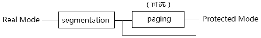

- 1 保护模式
    - 1.1 保护模式下保护什么
    - 1.2 根据什么来保护
    - 1.3 如何实施保护措施
- 2 x86/x64权限
    - 2.1 权限级别
    - 2.2 权限类型
- 3 保护模式下的环境
    - 3.1 段式管理所使用的资源
    - 3.2 paging分页机制所使用的资源
- 4 物理地址的产生
    - 4.1 物理地址空间的组成

# 1. 保护模式

protected mode（保护模式）在整个x86/x64体系是最为重要的处理器工作模式，在x64体系中的long mode也是构建在protected mode之上，实质上是扩展的保护模式。在保护模式里可以使用处理器提供的全部资源。

## 1.1 保护模式下保护什么

实质上就是保护处理器的某些资源不能被随意访问，包括处理器的硬件资源和系统的软件资源，典型地像CR0这些系统控制寄存器。一些系统级的数据结构，譬如：GDT、IDT需要被保护起来，以及OS kernel的执行代码和数据等。


## 1.2 根据什么来保护

x86/x64处理器定义了4个权限级别：从0级到3级，也被称为ring0到ring3。0级具有最高的权限，3级是最低权限。
拥有高权限的代码可以对低权限的数据进行访问，反之则不行。
被赋予0级权限访问的资源只有具有0级权限的代码才能访问，譬如一些特权指令。

## 1.3 如何实施保护措施

保护模式下实施了种种访问限制，对一些违例访问的行为处理器产生响应的异常进行提示和处理。
#PG异常时保护模式下最常见的异常。而对一些数据的访问需要经过某些途径才能获得。

而x86的segmentation（段式管理）和paging（分页管理）是实施保护措施的手段和途径，在segmentation机制和paging机制下实行了不同的内存管理模式和访问控制。对资源的访问需先经过segmentation阶段再到paging阶段（在开启paging机制的前提下）。
在x64体系下，long mode刻意地弱化了一些segmentation阶段的限制行为，将重点放在了paging阶段里。

# 2. x86/x64权限

## 2.1 权限级别

x86/x64体系使用了4个权限级别：0,1,2,3级，数字越低权限越大。
0级属于最高权限级别，3级是最低权限级别。

## 2.2 权限类型

在保护模式的权限检查中使用了3种权限类型。
- CPL（Current Privilege Level）：当前的权限级别，它指示当前运行的代码在哪个权限级别里，CPL的值存放在CS寄存器Selector域的RPL，CS.Selector.RPL与SS寄存器的Selector.RPL总是相等的，因此：SS.Selector.RPL也是CPL。
- DPL（Descriptor Privilege Level）：DPL存放在Descriptor（包括段描述符和门描述符）里的DPL域，它指示这些segment所需要的权限级别。门描述符的DPL值指示访问门的权限，并不代表由门所引用的Segment的权限。
- RPL（Requested Privilege Level）：RPL存放在**访问者所使用**Selector的bit0和bit1位，它指示着发起访问的访问者使用什么样的权限对目标进行访问。因此，访问者可以使用不同的权限对不同的目标进行访问。当Selector被加载到段寄存器时，CS.RPL和SS.RPL代表着当前的CPL值。

值得注意的是，数字越大权限越低，假如遇到以下的情况（在CPL与DPL的比较中）：
```
    CPL > DPL
```
表示当前运行的权限级别不够，不能对Segment或gate进行访问，只有在CPL <= DPL的情况下才能对segment或gate进行访问。

# 3. 保护模式下的环境

保护模式下实现了两种内存管理机制：segmentation（段式管理）和paging（分页管理），进入保护模式之前需要配置好保护模式的执行环境。



如上所示，从实模式进入保护模式，段式管理机制必须建立，分页机制是可选的，当分页机制关闭时，从段式内存管理中得到linear address（线性地址）就是物理地址。


在进入Long Mode时分页机制必须开启，当分页管理的环境配置完毕后，可以选择跳过保护模式直接进入Long Mode，
直接进入Long Mode后，一般会在临时的Long Mode里进行进一步的Long Mode配置初始化工作，如上图所示。

从上面可以看到，segmentation管理是必不可少的，尽管在64位环境中，segmentation管理会弱化，但是没有办法关闭segmentation机制。在Intel手册中，Long Mode术语被称为IA-32e模式。

## 3.1 段式管理所使用的资源

下面的硬件资源被用于段式管理环境的配置。
- CR0、CR4
- GDTR、LDTR
- IDTR
- TR
- ES、CS、SS、DS、FS、GS

下面的系统数据结构被用于段式管理中。
- GDT、LDT
- IDT
- TSS
- Segment Descriptor：System Segment Descriptor、Code/Data Segment Descriptor
- Selector

除了LDTR及LDT可选外，其他资源都是保证保护模式的良好运行环境中必备的。
在段式内存管理中，分段机制的内存管理职责是：**从逻辑地址（Logic address）转换位处理器的线性地址（Linear address）提供基础平台。**

## 3.2 paging分页机制所使用的资源

下面的硬件资源被用于paging管理环境中。
- CR0、CR2、CR3、CR4
- IA32\_EFER

下面的页转换表结构被用于paging管理环境中。
- PML4T（Page Map Level 4 Table）
- PDPT（Page Directory Pointer Table）
- PDT（Page Directory Table）
- PT（Page Table）

Page Table（页表）是最低一级的页转换表，最上层的页转换表取决于使用哪种转换模式。
分页机制的内存管理职责是：**从处理器的线性地址（即：virtual address）映射到物理地址空间提供基础平台。**

# 4. 物理地址的产生

物理地址空间（Phyiscal address space）的大小从36位到MAXPHYADDR值，这个值可以由CPUID.80000008H:EAX[7:0]来查询。
MAXPHYADDR值一般都会是36位，Intel64和AMD64实现了最高为52位的物理地址。

下面是物理地址形成的示意图，logic address经过段式转换后形成linear address，当关闭paging管理时，线性地址将映射到物理地址空间。否则linear address是virtual address（虚拟地址），需要经过页式转换形成物理地址。


## 4.1 物理地址空间的组成

关于物理地址空间，read/write的内存设备RAM（DRAM），read-only的内存设备ROM（EPROM），以及memory mapped I/O设备都可以映射到物理地址空间。

典型的ROM设备映射到物理地址空间的高端和低端位置，处理器第1条指令的指令存放在这个ROM设备里。
Video和IGD设备的buffer映射到A0000H到BFFFFH的物理地址空间上。
PCIe等设备映射到物理地址空间的E0000000H位置上。
I/O APIC设备映射到EFC00000H以上的位置，等等。

经过页式转换形成的物理地址，可以映射到DRAM或外部存储设备Disk上，可以实现更多的memory访问。
