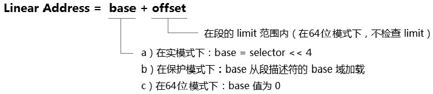
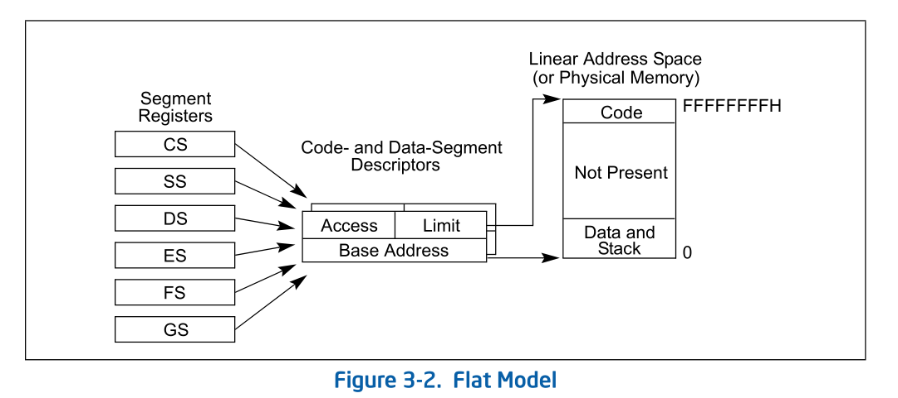

- 1 概述
    - 1.1 段式内存管理
        - 1.1.1 平坦模式
    - 1.2 段式的保护措施

# 1. 概述

无论是分段机制还是分页机制，它们都包含两方面管理。
1. 内存管理：负责为地址的转换提供基础设施，处理器在访问内存时根据这些设施进行转换。
2. 保护措施：访问行为的控制，保护数据避免随意访问。

在内存管理中，对访问的对象进行寻址，查找到需要访问的地址。访问的对象包括程序代码（Code）和数据（Data），在这个访问的过程中，处理器需要检查访问者是否有足够的权限，或者是否合法地进行访问。对于违规的访问处理器将会拒绝。

```asm
    mov eax, es:[00400000H]
```
上面这是一条很简单很常见的指令，实际上处理器在这条指令顺利执行之前，做了许多额外的工作。在32位保护模式下包括以下内容。
1. Selector的检查：假如ES.selector是一个null Selector，产生违例异常。
2. 进行段limit检查：假如ES.limit >= 00400000H+3，检查通过，否则违例异常。
3. 访问地址ES.base + 0x00400000。

这条指令使用ES寄存器段前缀对内存进行读访问，ES在加载的时候需要进行权限的检查。因此在成功加载ES寄存器后，ES要么引用一个**最低需要的Readable（可读的）段**，要么使用一个**Null Selector**。

在limit检查中需要区分Expand-up段和Expand-down段的情形。在Expand-up段中，limit是最大的偏移量，因此只有ES.limit >= 00400000H+3是合法的。在Expand-down段中，limit+1是最小偏移量，因此当ES.limit+1<=00400000H是合法的。

## 1.1 段式内存管理

保护模式下的段式管理和实模式下的段式管理原理是一致的，最大的不同是**段base地址**的形成。在段式内存管理中，线性地址的形成如下。



基地址（base）：
- 实模式：base = selector << 4
- 保护模式：base从segment descriptor里加载而来
- IA-32e模式：所有段的base都被处理为0，所有段的limit都是FFFFFFFFH

偏移（offset）可由多种寻址模式产生：
```asm
    mov eax, [ebx + ecx*4 + 0x0c]   ; base + index + displacement
```
上面指令中的offset由base + index * scale + displacement这种寻址产生，这是最为复杂的一种形式。

> 保护模式下的段式内存管理将围绕着这个段Base值的获取而构建出一套段式的管理环境。

在内存中可以定义许多段，可以为每个段定义不同的属性。
- 段的base地址
- 段的limit
- 段的attribute，包括访问权限和类型（如：Code/Data，LDT/TSS段）等。

这些段的属性由Segment Descriptor（段描述符）定义。在同一时刻内，最多只有6个段是可用的（active），这些段由Segment Selector Register段选择子寄存器（即：段寄存器）进行引用。

### 1.1.1 平坦模式

当所有段的base值为0，limit为FFFFFFFFH值时，被称为flat mode（平坦模式）内存管理模式。



## 1.2 段式的保护措施

在允许访问前，处理器会进行一系列的检查，在segmentation环节中包括以下检查。
- 段limit检查
- 段type检查
- 段privilege检查

在IA-32e模式下，处理器并不执行段的limit检查。在这些检查中，privilege检查是最复杂的一个环节，Data段、Stack段、Code段的访问检查细节都不一致。只有通过这些检查后才能允许访问。


