- 1 概述
    - 1.1 Accesssed访问标志
    - 1.2 Readable可读类型
    - 1.3 conforming与non-conforming代码段
    - 1.4 DPL属性
    - 1.5 S属性
    - 1.6 P属性
    - 1.7 D/B属性
    - 1.7.1 long mode下D/B属性
    - 1.8 L属性
    - 1.9 G属性
    - 1.10 long mode下Code段描述符
        - 1.10.1 64位OS兼容legacy应用程序原理
- 2 代码段寄存器的加载
    - 2.1 加载CS寄存器的常规检查
        - 2.1.1 Selector的检查
        - 2.1.2 Limit的检查
        - 2.1.3 Code Segment类型的检查
    - 2.2 用far pointer加载CS寄存器
        - 2.2.1 jmp/call到一个non-conforming代码段
        - 2.2.2 jmp/call到一个conforming代码段
    - 2.3 使用call gate加载CS寄存器
        - 2.3.1 offset域
        - 2.3.2 selector域
        - 2.3.3 cnt域
        - 2.3.4 Call-gate的DPL值
        - 2.3.5 gate selector和gate descriptor的常规检查
        - 2.3.6 使用call指令调用call-gate时的权限检查
        - 2.3.7 加载selector及code segment descriptor到CS寄存器
        - 2.3.8 权限的切换
        - 2.3.9 当使用jmp指令调用call-gate时
        - 2.3.10 stack的切换
        - 2.3.11 long-mode下的call-gate
    - 2.4 使用TSS Selector调用加载CS寄存器
        - 2.4.1 TSS descriptor
        - 2.4.2 TSS类型
        - 2.4.3 提供TSS Selector进行call/jmp调用
        - 2.4.4 TSS Selector及TSS描述符的常规检查
        - 2.4.5 权限检查
        - 2.4.6 对原TSS descriptor进行处理
        - 2.4.7 保存原处理器状态
        - 2.4.8 在新的TSS段写入原TSS Selector
        - 2.4.9 置EFLAGS.NT标志位
        - 2.4.10 CR0.TS标志位置位
        - 2.4.11 新task的TSS descriptor Busy被置位
        - 2.4.12 加载TR
        - 2.4.13 加载CS寄存器及其他寄存器
    - 2.5 使用iret指令进行任务切换
    - 2.6 使用Task-gate加载CS寄存器
        - 2.6.1 Selector域
        - 2.6.2 Task-Gate的类型
        - 2.6.3 selector和Task-Gate描述符的常规检查
        - 2.6.4 访问Task-Gate的权限检查
    - 2.7 在long-mode下TSS及任务切换
        - 2.7.1 long mode下的TSS段
        - 2.7.2 64位模式下的TSS描述符
        - 2.7.3 64位模式下的TR加载
    - 2.8 使用int指令加载CS寄存器
        - 2.8.1 IDTR中断描述符表寄存器
        - 2.8.2 Interrupt/Trap gate descriptor
        - 2.8.3 访问gate descriptor
        - 2.8.4 常规检查
        - 2.8.5 权限检查
        - 2.8.6 Interrupt/Trap-gate与Call-gate的异同
        - 2.8.7 long-mode下的Interrupt/Trap-gate描述符
    - 2.9 使用int3、int0以及bound指令加载CS寄存器
        - 2.9.1 #OF异常
        - 2.9.2 #BP异常
        - 2.9.3 #BR异常
    - 2.10 使用RETF指令加载CS与SS寄存器
        - 2.10.1 权限的处理
        - 2.10.2 Selector与使用的Descriptor的权限检查
        - 2.10.3 Selector及Descriptor的类型检查
        - 2.10.4 CS与SS寄存器的加载
        - 2.10.5 隐式的Null Selector加载
    - 2.11 在long-mode下使用RETF指令
        - 2.11.1 从64位模式返回到64位模式
        - 2.11.2 从64位模式返回到compatibility模式
        - 2.11.3 从compatibility模式返回到64位模式
        - 2.11.4 Jmp指令在64位操作数下的变通
        - 2.11.5 Jmp指令使用32位操作数
        - 2.11.6 使用retf指令来切换
    - 2.12 使用IRET指令加载CS和SS寄存器
        - 2.12.1 使用IRET指令返回
    - 2.13 在long-mode下使用IRETQ指令
        - 2.13.1 使用IRETQ指令从64位模式返回到64位模式
        - 2.13.2 使用IRETQ指令从64位模式返回到compatibility模式
        - 2.13.3 使用IRET指令从compatibility模式返回到64位模式
    - 2.14 使用SYSENTRY/SYSEXIT指令加载CS和SS寄存器
        - 2.14.1 使用SYSENTER指令进入0级权限代码
        - 2.14.2 使用SYSEXIT指令退回到3级权限代码
        - 2.14.3 非对称地使用sysenter/sysexit指令
        - 2.14.4 设置一个stub函数
        - 2.14.5 在3级权限里使用sysenter调用
    - 2.15 在IA-32e模式下使用SYSENTER/SYSEXIT指令
        - 2.15.1 设置IA-32e模式里的sysenter/sysexit使用环境
        - 2.15.2 使用SYSENTER指令进入0级64位代码
        - 2.15.3 从64位模式进入0级64位模式
        - 2.15.4 从compatibility模式进入0级64位模式
        - 2.15.5 使用SYSEXIT指令返回
        - 2.15.6 统一使用SYSEXIT指令返回到64位模式
    - 2.16 使用SYSCALL/SYSRET指令来加载CS与SS寄存器
        - 2.16.1 设置SYSCALL指令的使用环境
        - 2.16.2 位SYSCALL指令所准备的stub函数
        - 2.16.3 SYSCALL版本的系统服务例程
        - 2.16.4 非对称地使用syscall/sysret指令
- 3 总结
    - 3.1 系统调用
    - 3.2 加载CS寄存器的情形

# 1. 概述

Code Segment（代码段）描述符结构（64bit宽）如下。


对于Code段来说，它的类型取值范围是8 ~ F，对于4位的Type来说，还可以进行细化为：


Code/Data标志指示段描述符属于Code段还是Data段，1属于Code段（指示该段可执行并且不可写）。C标志位是比较重要的，C=1时为conforming类型，C=0时为non-conforming类型，0x8 ~ 0xB是non-conforming类型，0xC ~ 0xF是conforming类型。

32位的段base值被分为2个部分：
- base的低24位放在segment descriptor的bit39位到bit16位。
- base的高8位放在segment descriptor的bit63到bit56位上。

20位的段limit值也被分为2个部分：
- limit的低16位放在segment descriptor的bit15 ~ bit0位上
- limit的高4位妨碍segment descriptor的bit51 ~ bit48上

20位的limit值经过计算为32位后被加载到段寄存器上。

## 1.1 Accesssed访问标志

在type域里的A标志指示段是否被访问过，A=1表示已经被访问过（被加载到段寄存器中），A=0表示未访问。

当段描述符被加载到段寄存器时，只有当A标志为0时，处理器才会在GDT/LDT中的segment descriptor中的A标志进行置位，这种行为可以让系统管理软件（典型的是内存管理软件）知道那个段已经被访问过。

可是一旦置位，处理器从不会对A标志进行清位。系统软件在对descriptor进行重新设置的时候，可以对A标志位进行清位。在处理器再次加载descriptor的时对A标志位重新置位，在这种情况下，A标志往往配合P标志位使用。系统软件在对A标志和P标志位进行修改的时候应当使用LOCK指令前缀锁bus cycle。

> 当处理器加载descriptor到段寄存器时，处理器会对descriptor执行自动加lock的行为，处理器在访问这个descriptor期间，其他处理器不能修改这个descriptor。

这个加载descriptor期间，应当包括从对descriptor检查到最后的使用descriptor更新段寄存器内的Cache部分。

## 1.2 Readable可读类型

一个代码段不可能被写访问，但是可以被读访问，当代码段的类型标志R设为1时，表示该代码段可以被读，那么就可以像下面这样使用CS段进行读访问。
```asm
    mov eax, cs:[ebx]           ; 通过CS寄存器读代码段空间
```
或者可以将code segment descriptor加载到数据段寄存器进行读访问。
```asm
    mov ax, CODE_SEL            ; CODE_SEL是一个代码段描述符
    mov es, ax                  ; 将代码段描述符加载到ES寄存器
    mov eax, es:[ebx]
```
前提是有足够的权限加载（non-conforming类型）描述符，CPL<=DPL & RPL <= DPL。或者对于conforming类型的代码段描述符总是成功的。

## 1.3 conforming与non-conforming代码段

conforming类型的代码强迫使用低权限或相等权限（CPL>=DPL）来运行，non-conforming类型的代码限制用户使用低权限来运行（进入高权限代码需要通过gate描述符调用）。

> conforming段的另一个重要特性是：进入conforming段运行不改变当前运行的CPL（无论是直接调用还是gate调用）。


如上图所示，在同一段3级权限的用户代码里，分别调用conforming段和non-conforming段的代码，采用直接调用的方式。
```asm
    call selector:offset            ; 提供far pointer直接调用
```
- 从3级直接调用0级权限的conforming段代码获得通过，处理器检查CPL>=DPL（低权限或相等权限）
- 从3级直接调用0级权限的non-conforming段代码失败，处理器检查CPL!=DPL（权限不相等）

conforming段的代码将阻止使用高权限执行，假如调用者的权限是0级，而conforming段的权限为1级，那么这个调用将失败。因此当conforming段使用0级DPL时，就可以在任何权限里执行。因此当conforming段使用0级DPL时，就可以在任何权限里执行。进入conforming段不会引起权限和stack的切换。

non-conforming段的代码将阻止使用低权限执行，而强迫通过使用gate来执行高权限代码。

> 需要保护的代码和数据应该使用non-conforming段，而对于不重要、无须保护的代码可以使用conforming段。

## 1.4 DPL属性

在segment descriptor里DPL属性定义了一个段所需要的最低访问权限。如果DPL设为2级权限，那么0、1和2级权限可以访问，3级权限将被拒绝。

在处理器权限检查中，DPL是一个重点的被检查对象，使用CPL与DPL进行权限对比。许多情况还需要使用RPL与DPL进行额外的辅助对比。

## 1.5 S属性

S标志位指示descriptor属于SYstem还是Code/Data（非System），Code/Data段的S标志位为1值，当S=0时，descriptor属于System（例如，LDT/TSS描述符，Gate描述符）。

## 1.6 P属性

P标志位指示一个segment或gate是否存在内存中，P=1表示segment或gate已经放在内存中，P=0表示该segment或gate不存在内存中（需要的内存没准备好）。

当P=0时加载segment descriptor到segment寄存器，会产生#NP（Segment Non-Present），#NP异常是一个fault类型异常，表示在#NP handler里必须要修复这个错误。

> 在#NP handler里有责任去更正Segment Not-Present错误，当内存准备好时，在#NP handler里需要将在GDT里描述符的P置为1（返回家在这表示已经准备好了），在启用paging内存管理的系统里，接收#NP异常后，应该将物理内存提交到segment的virtual address上，成功后将P标志置为1值。

OS内存管理子系统维护segment和page（当启用paging机制时）的present状态，当page是non-present时产生的是#PF（Page-Fault）异常。

在某些情况下，系统软件需要主动去清P标志位，当系统软件需要对descriptor进行更新时。在更新descriptor前将P标志位清0，指示为不可用的。更新外部后，对P标志进行置位，指示为可用的。在这种情况下P标志往往与A标志配合使用。

## 1.7 D/B属性

D/B在不同的segment里有不同的意义，对于Code Segment来说，它指示Default operand size（默认的操作数大小），这个标志位称为D标志位，D=1指示Code Segment的默认操作数是32位，D=0时是16位。

### 1.7.1 long mode下D/B属性

在long mode下，Code Segment的D标志与L标志（L标志在legacy模式下是保留位）组合使用，如下图所示。

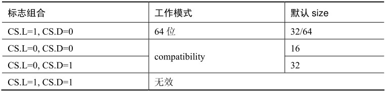

如上所述：L=0时处理器处于compatibility模式，在根据D标志选择相应的default Operand size（默认操作数）。当L=1时处理器处于64位模式，但是还需要D标志位配合（D需要为0）。

> x64体系规定L=1 & D=1时无效的组合。在实模式下，由于CS.D=0，因此实模式下默认的操作数是16位的。

无论默认操作数是16位还是32位，操作数的大小是可以改变的，通过使用operand size override（操作数大小的改写）操作。

```asm
    bits 16
    mov eax, 1          ; 16位默认操作数下，使用32位的寄存器
```
如上所示。在汇编语言代码层上，在16位的默认操作数下使用32位寄存器，那么编译器会为这条指令生成一个额外的operand size override prefix字节，它是66H，从而可以使用32位宽度的操作数。

当L=1 & D=0时，使用该Code Segment将进入64位模式，但默认操作数还是32位的（部分指令是64位的），那么要使用64位的操作数，需要使用REX.W进行扩展。
```asm
    bits 64
    mov rax, 1      ; 32默认操作数下，使用64位的寄存器
```
同样的情形下，编译器会为这条指令生成机器码中加入REX prefix，REX字节为48H（REX.W=1），这样操作数被扩展为64位宽。

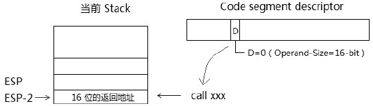

上图揭示了D标志重要的另一面：当D=0时，由于默认操作数是16位的，影响到call指令在调用时压入16位的返回地址（当前的ESP指针是32位），即使在SP为16位的前提下，如果D=1，call指令将加入32位的返回地址而不受SP指针的影响。

## 1.8 L属性

L标志仅用于long mode的Code Segment descriptor。L=1表示进入64位模式，L=0表示进入compatibility模式。
L标志需配合D标志使用。

## 1.9 G属性

G标志位指示Segment Limit的粒度。当G=1时，段界限的粒度位4KB，当G=0时段界限的粒度为1 byte。
G标志配合limit域来使用，20位的limit值配合G标志计算之后产生32位的limit值。

- G=0时：32位的段界限就是limit域的值。
- G=1时：32位的段界限 = limit x 4K + FFFH。

加入segment descriptor的20位limit域是FFFFF，那么最终32位的段界限是：
```
    FFFFFh x 1000h + FFFh = FFFFFFFFh
```
段的limit值的计算方式是统一的，但段内有效区域实际上比较复杂，分别Expand-up和Expand-down两种类型。

## 1.10 long mode下Code段描述符

在long mode（包括64位模式和compatibility模式）下，Code Segment Descriptor的L标志是一个切换开关，它将指示段描述符在64位模式和compatibility模式角度下进行切换解析，如下图所示。


当L=1时切换到64位模式，这时候Code segment descriptor使用64位模式定义（对描述符采用64位模式解析），当L=0时切换到compatibility模式，这时候Code Segment descriptor使用legacy定义，compatibility模式下和legacy下定义是完全一致的。

在64位模式下大部分域都是无效的，仅有少数几个属性标志有效，如下图所示。


- 灰色部分：是无效域，将被忽略
- 白色部分：C标志，DPL标志，P标志，L标志，D标志是有效的。
- 黑色部分：是固定域，必须设置为1的标志（S=1，以及Code/Data=1）。

> 在64位模式下，由于段的base和段的limit都无效被忽略，它强制所有段的base为0，limit为FFFFFFFFH，只有FS和GS寄存器可以使用非0值的段Base。

下面是一个典型的long mode下代码段描述符的定义：
```asm
    ; 定义一个64位代码段，DPL=0，P=1，S=1，Code/Data=1，L=1，D=0
    kernel_code64_desc      dq  0x0020980000000000  ; Attribute = 2098H
```
除了属性域外，其他的域都为0值，可见在64位模式下大大简化了Segment descriptor的定义。当L=1 & D=0时，目标代码是64位模式的。当L=1 & D=1时是无效的组合。L=0时，根据D标志判断目标代码是32位还是16位的默认操作数。

### 1.10.1 64位OS兼容legacy应用程序原理

在x64体系中，可以使用全新的64位操作系统，当OS开启long mode并激活long mode，这时候处理器进入long mode。
OS的kernel及其executive组件运行在64位模式，而应用程序可以是32位或64位，运行32位的应用程序将处理器转入到compatibility模式运行，运行64位应用程序则切换回64位模式。

处理器就是根据目标程序加载的Code Segment Descri中的L标志进行切换。因此可以使用一个32位程序的Code Segment Descriptor而无须任何修改或重新编译。在long mode下，程序代码可以在compatibility与64位模式下任意切换（前提是执行环境设置正确）。

# 2. 代码段寄存器的加载

目标代码要得到执行必须先将其code segment descriptor加载到Code Segment Register（代码段寄存器）即CS寄存器里。
不像数据段寄存器，CS寄存器不能使用mov或pop指令进行直接加载，必须通过控制权的转移形式隐式加载。
代码段寄存器的加载非常复杂，这是保护模式下最为复杂的一个环节，不但涉及**控制权的转移**，也涉及**权限检查**，以及**stack的切换**，某些情况下还涉及**任务的切换**。

## 2.1 加载CS寄存器的常规检查

在加载CS寄存器前处理器会进行一些检查，下面对Code Segment Selector和Code Segment Descriptor进行的常规检查（不包括对权限检查的描述）。

### 2.1.1 Selector的检查

处理器检查Selector是否为Null Selector，处理器不允许加载一个Null Selector到CS寄存器中。否则会产生#GP异常。

### 2.1.2 Limit的检查

处理器检查Selector是否超出GDT/LDT的limit界限，否则产生#GP异常。然而在64位模式下，处理器并不检查Selector是否超Limit值。

### 2.1.3 Code Segment类型的检查

能被**加载**到CS寄存器的Code Segment Descriptor类型必须如下：
1. S=1，属于非system描述符
2. Code/Data标志为1，指示属于一个Code段，表示它是Execute（可执行）的段。
3. P=1，表示段在内存中

即使在64位模式下，在加载CS时，处理器也必须进行上面的检查。上面这些检查中并不包括对权限的检查。

## 2.2 用far pointer加载CS寄存器

直接跳转形式是提供一个far pointer（selector:offset形式）使用jmp/call指令进行跳转/调用，**并不通过call-gate描述符**，因此CPL不会改变。

### 2.2.1 jmp/call到一个non-conforming代码段

当jmp/call到一个non-conforming代码段时，non-conforming类型的代码段会阻止不同权限的代码进行加载。
```asm
    call 0x28:0x00001000        ; 0x28是一个non-conforming代码段选择子
    jmp  0x28:0x00001000
```
在这个情形里，jmp/call指令能够成功加载CS寄存器所需要的权限（必须是同级调用）。
```
    CPL == DPL && RPL <= DPL
```
这里使用的selector是0x28，那么它使用的RPL是0。如果当前的CPL=3，而DPL为0，则会失败，产生#GP异常。

### 2.2.2 jmp/call到一个conforming代码段

当jmp/call到一个conforming代码段时，conforming类型的代码会阻止高权限代码进行加载。
```asm
    call 0x30:0x00001000        ; 0x30是一个conforming代码段选择子
```
jmp/call指令能够加载CS寄存器所需要的权限如下（必须是同级或低权限代码调用）。
```
    CPL >= DPL, RPL被忽略
```
在64位模式下，不允许使用直接far pointer指针（立即数操作数），需要使用间接的far pointer指针，这个indirect（间接）的far pointer必须保存在内存中。
```asm
    call QWORD far [FAR_POINTER] ; 使用简介的64位far pointer
```
在提供的内存操作数里，该内存地址依次存放64位的offset值和16位的selector值。在上面的常规检查和权限检查通过后，处理器将加载Selector和目标Code段描述符到CS寄存器里，CPL无须更新（即CS.RPL不会被更新）。

## 2.3 使用call gate加载CS寄存器

直接调用方式是加载一个相同权限的段描述符到CS寄存器，那么需要进行权限改变时，必须使用call-gate描述符。
使用call gate可以加载更高权限的Code段描述符。


Call gate描述符是system descriptor的一种，它的S标志位为0，在legacy模式下（非long mode）是8字节64位宽。
Call gate描述符可以放在GDT/LDT，但不能放在IDT。

### 2.3.1 offset域

32位的目标代码offset值被分成两部分，低16位在描述符的低16位，高16位在描述符的bit63到bit48位，由selector得到对应的目标code segment descriptor。offset值加上这个code segment descriptor的base域就是目标代码的入口点。

### 2.3.2 selector域

它是目标代码段的selector，由它获得code segment descriptor，这个code segment descriptor的DPL值是处理器用来进行权限检查的条件之一。目标代码的基地址由这个code segment descriptor的base域提供。

### 2.3.3 cnt域

这个值共5位，指示参数的个数，作为caller（调用者）向callee（被调用者）传递参数。调用者在自己的栈压入参数，处理器根据cnt域的参数个数将调用和的stack中的参数复制到被调用者的stack中，被调用者可以在自己的stack中访问参数。

### 2.3.4 Call-gate的DPL值

每个门描述符由它自己的DPL值，在使用call-gate进行调用时，gate描述符的DPL结合目标code segment descriptor的DPL进行权限检查。

### 2.3.5 gate selector和gate descriptor的常规检查

处理器会检查如下内容：
1. call/jmp指令使用的selector是否为Null selector，是否超出GDT/LDT的limit。
2. selector所引用的descriptor是否为call-gate描述符。
3. gate描述符的S标志是否为0，指示它属于system描述符。
4. gate描述符的P标志是否为1，表示它在内存中。
5. gate描述符里所引用的code segment selector以及目标code segment descriptor做常规检查。

### 2.3.6 使用call指令调用call-gate时的权限检查

在使用call指令加载到CS寄存器之前会进行权限的检查，处理器会对两个DPL进行检查：call-gate的DPL和Code Segment的DPL，目标Code段能加载CS寄存器的合法权限如下。
1. CPL <= Call-gate的DPL，并且RPL <= Call-gate的DPL。
2. CPL >= Code Segment的DPL（由低权限进入高权限，或者相等权限）。

在1里揭示了当前运行的代码必须有**权限去访问Call-gate描述符**（CPL和RPL须小于等于Call-gate描述符的DPL值）。

在2里揭示了目标代码必须**由低权限或者相同权限的代码**去调用。

> 如果目标代码段时conforming类型，进入高权限代码后，CPL是不会改变的。

### 2.3.7 加载selector及code segment descriptor到CS寄存器

通过检查后，目标代码段的selector及Code segment descriptor会加载到CS寄存器，并转到目标代码执行。

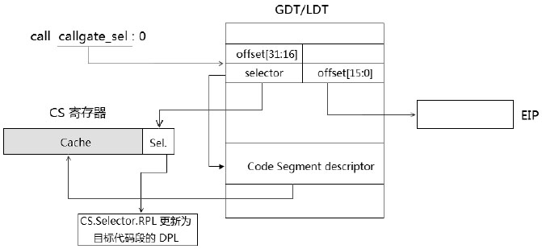

如图所示，我们可以使用类似下面的指令进行调用：
```asm
    call callgate_sel:0         ; callgate_sel是一个调用门描述符选择子
```
那么在call-gate描述符里的selector域（也就是目标代码段的selector）将被加载到CS寄存器的Selector域里，CS寄存器内部的cache会被加载位目标code segment descriptor。

CS.Selector.RPL会更新位Code Segment Descriptor的DPL值，也就是CPL会得到更新（code Segment的selector.RPL会忽略）。

当目标代码段时conforming类型时，selector和code segment descriptor会被加载到CS寄存器，但CS.selector.RPL不会被更新（CS.RPL保持原值）。

### 2.3.8 权限的切换

当目标代码是高权限代码时，将会发生权限的切换，CPL会更新位目标code segment的DPL值。以上面的call指令为例，如果调用者的权限是3级，目标代码的权限是0级，CS寄存器的Selector.RPL会被更新为0级。

在long mode下，call指令调用call-gate而引发权限切换，如果调用者在compatibility模式下，处理器将切换到64位模式里执行。

### 2.3.9 当使用jmp指令调用call-gate时

jmp指令与call指令会遭遇不同的情况，当使用jmp指令对call-gate进行跳转时，处理器必须确保在相同的权限级别下跳转。
```asm
    jmp callgate_sel:0          ; callgate_sel 是一个门描述符选择子
```
如果在不同的权限级别下，有两种可能，依赖于目标代码的类型。

- **跳转失败**

当目标代码段时non-conforming类型时，处理器的检查是：
```
    a) CPL <= Call-gate.DPL && RPL <= Call-gate.DPL
    b) CPL == Code Segment.DPL
```
b) 揭示了使用jmp指令跳转到non-conforming代码段时**不会发生权限的切换**（权限必须相等）。

- **跳转成功**

当目标代码段时conforming类型时，处理器的检查和call指令一致。
conforming代码段允许低权限访问者跳转到高权限里，但权限不会发生切换。

> 使用jmp指令无论如何也不会发生权限切换，CS.selector.RPL会维持原值。

### 2.3.10 stack的切换

当发生权限的切换（意味着将切换到高权限里），同时处理器也会自动进行stack的切换，stack的权限和CPL权限是必须一致的。处理器将在当前TSS段里读取相应权限级别的SS与ESP，并加载SS与ESP寄存器里。

在long-mode下执行call指令调用call-gate而引发stack切换时（无论是在64位模式还是compatibility模式）：仅读取TSS的RSP值，并且处理器加载一个Null Selector到SS寄存器里。最后处理器会转入64位模式里执行。

### 2.3.11 long-mode下的call-gate

在long mode（包括64位模式和compatibility模式）下，call-gate被扩展位16字个字节128位结构。


如上图所示，目标代码的offset值扩展为64位，在call-gate的高8字节bit44到bit40共5bit必须设置为0，代表一个无效的descriptor类型。

在long mode下段描述符（Code/Data）仍然是8字节宽度。由于Call-gate存放在GDT/LDT中，占据了2个Segment descri的空间（16字节）。

为了对call-gate descriptor和Code/Data segment descriptor加以区分，防止call-gate的高8字节作为Code/Data Segment descriptor进行引用，必须将高8字节的S标志和Type域置为0。

Call-gate的Type依然是0Ch值，long mode下这个类型是64位Call-gate类型。

- **64位Call-gate的offset值**

这个offset值必须是一个canonical形式的地址值，否则会产生#GP异常。

- **64位Call-gate的Selector**

这个Selector所引用的code segment descriptor必须是**64位代码段**（L=1 & D=0）。因此我们可以看到开启了long mode的OS，它的核心代码运行在64位模式下（0级权限的代码为64位）。

- **64位Call-gate的调用** 

在64位模式下不允许在指令中直接提供far pointer指针形式，需要使用内存操作数。
```asm
    call QWORD far [CALLGATE_POINTER]       ; 使用简介的64位far pointer形式
```
除了要通过和legacy模式相同的权限检查外，还需要经过额外的检查：
1. Call-gate的高8位的S与Type是否为0（5个0）值，否则产生#GP异常。
2. offset是否属于canonical地址形式，否则产生#GP异常。
3. 目标Code Segment descriptor的L标志和D标志组合是否属于64位模式代码，否则产生#GP异常。

如同legacy模式一样，Code segment的Selector和Descriptor会加载到CS寄存器的Selector和Cache里，64位的offset值会加载到RIP寄存器中。

- **在compatibility模式下对64位Call-gate的调用**

compatibility模式运行在32位或16位代码，通过far pointer调用64位call-gate进入64位模式。
```asm
    call callgate_sel:0         ; callgate_sel是一个64位的call-gate选择子
```
如果在legacy模式下一样，在compatibility模式下可以使用直接的far pointer形式调用call-gate，这将导致处理器从compatibility模式切换到64位模式。处理器对调用的检查与在64位模式下是完全一致的（64位Call-gate本身没有改变）。

注意在64位的操作数size下：
- 在AMD64体系的far pointer是16:32结构（48位宽）
- 在Intel64体系的far pointer是16:64结构（80位宽）

## 2.4 使用TSS Selector调用加载CS寄存器

使用TSS Selector进行调用时call/jmp指令加载CS寄存器的第三种方法。使用TSS Selector和Task-Gate进行任务切换的机制异常复杂，机器的耗时非常多。

### 2.4.1 TSS descriptor

TSS描述符属于系统描述符（它的S标志位为0值），并且只能存放在GDT中，不能放在LDT和IDT。下面是32位TSS结构。


在legacy模式里的TSS描述符是8字节64位宽。在long mode和compatibility模式里TSS描述符页是8字节，和legacy模式行为一致。

### 2.4.2 TSS类型

在Type类型域里：
- 1001B是32位TSS
- 1011B是Busy 32位TSS
- 0001B是16位TSS
- 0011B是Busy 16位TSS

### 2.4.3 提供TSS Selector进行call/jmp调用

可以提供直接的far pointer或间接的far pointer给call/jmp指令进行任务切换。
```asm
    call tss_sel:0              ; tss_sel是一个32位TSS选择子
```
同样，处理器会经过一系列的检查，包括常规的Selector和TSS descriptor检查以及权限检查。

### 2.4.4 TSS Selector及TSS描述符的常规检查

处理器对所有的TSS Selector和TSS Descriptor进行如下常规检查。
1. Selector是否为Null Selector，是的话产生#GP异常。
2. Selector.TI是否为1，是的话表示使用LDT，产生#GP异常。
3. Selector的引用是否超出GDT的limit，是的话产生#GP异常。
4. TSS Descriptor的S标志为0，表示属于system描述符，否则产生#GP异常。
5. TSS Descriptor的P标志为1，表示在内存中，否则产生#GP异常。
6. TSS Descriptor是否属于**available 32-bit TSS**（即类型值为1001B），如果是属于Busy状态或其他的描述符类型，则产生#GP异常。
7. TSS Descriptor里的limit值是否大于等于67H，否则产生#GP异常。

从上面可以看到，处理器对TSS Selector及TSSDescriptor的检查是很多的。

### 2.4.5 权限检查

使用TSS Selector进行调用需要如下权限（使用call指令与使用jmp指令相同）。
```
    1. TSS.selector.RPL <= TSS.Descriptor.DPL
    2. CPL <= TSS.Descriptor.DPL
```
如上所示，调用者必须具有去访问TSS descriptor，但是在调用时处理器并不检查TSS段内的各个权限。
只有在切换阶段加载TSS段内的各个段（CS、SS及所有段）时才会它们进行详细检查。

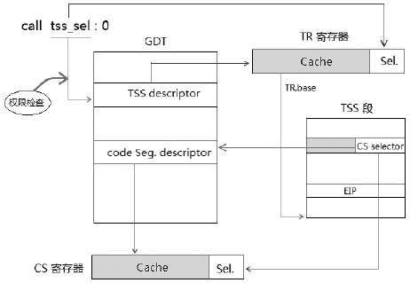

上图是一个简单的加载CS寄存器的示意图，当所有检查都通过时，处理器进行复杂的任务切换工作。
最后会在TSS段里加载所有段寄存器，包括CS与SS寄存器。

### 2.4.6 对原TSS descriptor进行处理

对于使用jmp指令和call指令，处理器会有不同的处理。
1. jmp指令会请当前TR所使用的TSS descriptor的Busy位，当前所使用的TSS descriptor置为available状态。
2. call指令会保持当前TR所使用的TSS descriptor的Busy状态，不作处理。

> 当前TR内的TSS descriptor是在系统初始化时加载的，加载到TR后处理器会将TSS descript置为busy状态。进入保护模式后必须要加载一个TSS descriptor到TR，这是一个完整的执行环境中比不可少的，否则将不能发生权限的切换。

下图是处理器在进行任务切换时的工作示意图，图中的原TSS描述符是指上面所说的当前TR所引用的TSS描述符。


### 2.4.7 保存原处理器状态

如上图所示，接下来处理器将在当前TSS段（未加载TR之前为当前的TSS段）里保存切换前的处理器状态（对于新的task来说是原来task状态）。

### 2.4.8 在新的TSS段写入原TSS Selector

如果是call指令进行调用的，将会在新的TSS段里的Link域（Previous task link）写入原TSS Selector值。而对于jmp指令来说，处理器不会写入TSS selector。

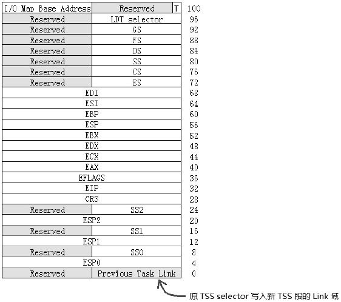

上图是在legacy模式（非long mode）下的32位TSS segment结构，旧task的处理器状态保存在原TSS段里，而新Task的初始化状态从新的TSS段里进行加载。
在任务切换到新Task时处理器的最后任务是加载新task的初始状态，使用call指令调用会将原TSS Selector写入新任务的TSS段的link域，以便由新任务里切换回原任务。

处理器会检查TSS descriptor的limit域，看看TSS段是否大于等于67H（十进制数的103），TSS段的最小界限时67H，如上图所示：从0到103之间的区域是必须的。

```asm
    ; 设置新TSS区域
    mov esi, tss_sel
    call get_tss_base
    mov DOWRD [eax + 32], tss_task_handler          ; 设置EIP值为tss_task_handler
    mov DWORD [eax + 36], 0                         ; EFLAGS=0
    mov DWORD [eax + 56], KERNEL_ESP                ; ESP
    mov DWORD [eax + 76], KERNEL_CS                 ; CS
    mov DWORD [eax + 80], KERNEL_SS                 ; SS
    mov DOWRD [eax + 84], KERNEL_DS                 ; DS         
```
上面这段代码对新的TSS段进行一些设置，几个必须的要素包括：EIP与ESP、CS、SS、DS以及CR3的值，其他为0值。在未开启paging情况下，CR3可以忽略，CR0和CR4都使用现有的。

### 2.4.9 置EFLAGS.NT标志位

使用call指令进行调用时，处理器会对Eflags.NT标志位进行置位，指示新task进入Nested（嵌套）状态。
而对于jmp指令则相反，jmp指令对EFLAGS.NT标志位进行清位。

### 2.4.10 CR0.TS标志位置位

无论是call指令还是jmp指令，CR0的TS标志位都会被置位，指示进行了任务切换。TS标志位不会被处理器清位，需使用clts指令进行清位。

### 2.4.11 新task的TSS descriptor Busy被置位

在加载TR及各个段寄存器之前的最后一个工作时将新任务的TSS descriptor的Busy位进行置位，指示当前（新的任务）TSS descriptor是不可用的。

### 2.4.12 加载TR

上面的工作完成后，处理器将加载TSS descriptor进入TR，下面是TR的结构。

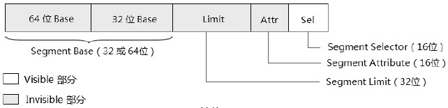

没错，TR具有与段寄存器完全相同的结构，包括：TR的Cache部分（base域、limit域、Attr域）和Selector部分，同样Cache部分的内容由TSS descriptor加载而来，Selector由TSS Selector加载而来。所不同的是TSS descriptor只能放在GDT里。

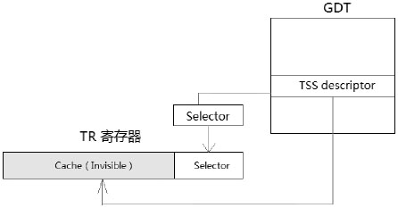

> 实际上，需要加载descriptor的寄存器都具有相同的结构，包括：段寄存器，TR和LDTR。

处理器从指令操作数far pointer的Selector部分得到Selector加载到TR的Selector域，同时GDT中的TSS Descriptor也会加载到TR的Cache部分。

### 2.4.13 加载CS寄存器及其他寄存器

任务切换里最后一系列的关键工作时加载TSS段里的寄存器和其他通用寄存器组。
处理器使用TSS段里的segment selector加载段寄存器，还要通过一系列最后的检查。

由于新task里所有的段寄存器要重新加载，新任务的执行权限要重新设置（执行高权限还是低权限），TSS段里各个段寄存器的加载权限要通过如下检查。
1. CS的selector.RPL，SS的selector.RPL以及目标code segment descriptor，Stack segment descriptor的DPL，四者必须相等。假设目标代码为3级代码，那么
```asm
    mov esi, tss_sel
    call get_tss_base
    mov DWORD [eax + 32], tss_task_handler          ; 设置EIP为tss_task_handler
    mov DWORD [eax + 36], 0                         ; eflags=0
    mov DWORD [eax + 56], USER_ESP                  ; esp
    mov WORD [eax + 76], USER_CS | 3                ; CS的selector.RPL必须为3
    mov WORD [eax + 80], USER_SS | 3                ; SS的selector.RPL必须为3
    mov WORD [eax + 84], USER_SD                    ; ds
```
在上面的CS和SS的selector设置里，RPL必须为3级（和DPL匹配），否则将产生#TS异常。

2. CS和SS的selector必须是有效的，不是Null selector，对于ES、DS、FS、GS寄存器的selector在切换时可以为Null selector，可是在使用前必须使用有效的selector显式地加载段寄存器。

3. ES、DS、FS、GS寄存器segment descriptor的PDL不能低于CS寄存器segment descriptor的DPL值（即：权限不能高于Code Segment Descriptor的DPL）。

4. 在加载CS和SS段寄存器时，这些段必须是present的，也就是说，segment descriptor的P标志位必须是1值。

在这一步里，处理器使用TSS段里的CS selector进行加载CS寄存器，以及使用其他段selector来加载剩余的段寄存器（见上面的加载TR和CS寄存器示意图）。成功加载这些寄存器和EIP值后，处理器完成切换工作，将执行新的Task。

## 2.5 使用iret指令进行任务切换

在一个任务里iret指令如何切换回原来的任务。当使用TSS selector或者Task-gate进行任务切换时，由iret指令引起的任务切换有两个方面：
1. 从嵌套内的任务返回原来的任务。
2. 用iret指令主动发起任务切换。

- 在1里从一个由call指令使用TSS selector或Task-gate selector而切换的任务里返回原任务。
- 在2里则是构建一个伪造的嵌套任务环境，由iret主动发起任务切换。

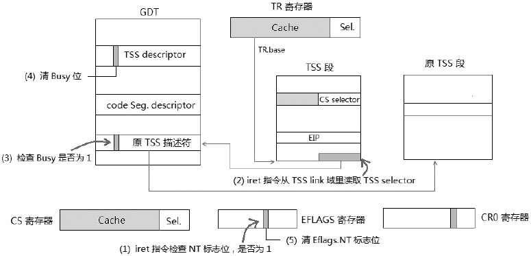

上图是iret指令在恢复TSS段里的image前处理器的工作：
1. iret指令检查当前的EFLAGS寄存器，如果NT标志置位，则发起Task切换，否则执行中断返回。
2. 处理器从当前的TSS段的Previous Task Link域里读取TSS selector，这个TSS selector是在call指令调用发起任务切换时写入的。处理器会对这个TSS selector是否有效进行检查，包括：是否为null selector、TSS selector的TI是否为0、是否超出GDT的limit。
3. 从TSS selector读取TSS描述符，并对TSS描述符进行一些检查，包括：是否为Busy状态、Descriptor的类型是否正确。
4. 处理器对原TSS描述符的Busy进行清位，置为available状态。
5. 处理器清EFLAGS.NT标志位。

接下来，处理器将加载TR和原TSS段的寄存器image，恢复被中断任务的处理器状态。

> 值得注意的是：执行iret指令从TSS Link域读取TSS selector值，处理器并不会进行权限检查（不会检查TSS selector的RPL和TSS描述符的DPL）。

从这个角度来看，TSS任务切换具有一定的危险性，iret指令可以从3级权限里发起任务切换到0级权限而无须进行权限的检查。前提是，软件必须构建一个伪造的任务嵌套环境（包括完整的TSS段内存和GDT的TSS描述符），然后将EFLAGS.NT标志置位，满足iret指令进行任务切换的要求。


如同在call指令调用发起任务切换，在这个加载过程中进行完全相同的检查，详见前面所述。由于iret指令的特殊性，在程序中可以伪造一个任务嵌套环境。然后执行iret指令主动发起任务切换。

从OS安全角度来说，OS唯一能做的是，必须防止软件由能力去构造伪造的TSS任务切换环境。也就是恶意的TSS描述符不能被建立。也就等于必须保护GDT不被破坏（不过，从另一方面来说，GDT一旦被破坏，什么都变得脆弱了，什么防止手段都是空谈）。

在x64体系就变得安全得多，利用TSS进行任务切换的制剂已经被废除，包括Task-gate机制。

## 2.6 使用Task-gate加载CS寄存器

这是使用call/jmp指令加载CS寄存器最后一种方法，Task的结构如下。

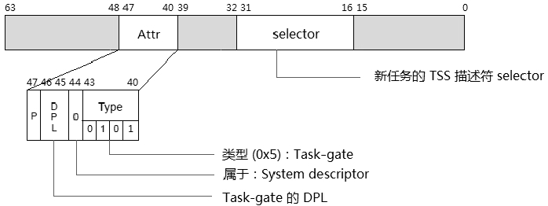

上图是legacy模式下的Task-gate描述符，在Long-mode（包括64位和compatibility模式）下并不存在Task-Gate描述符。
比起其他描述符，Task-Gate描述符简单很多，仅有两部分是有效的：selector和attribute域。

### 2.6.1 Selector域

这是新任务的TSS Selector，其作用和TSS描述符的selector是一样的。

### 2.6.2 Task-Gate的类型

Task-Gate描述符的类型是0101B，属于系统级的描述符。


一个Task-Gate描述符可以放在GDT、LDT以及IDT里，如上所示，在call指令中提供一个Task-Gate选择子，根据TI在GDT和LDT之间进行选择，在从Task-Gate描述符里获得TSS selector后，其他的工作都使用TSS selector进行调用一致。

### 2.6.3 selector和Task-Gate描述符的常规检查

处理器会对所有的Task-Gate selector及Task-Gate描述符根描述Call-gate调用中类似的常规检查。

### 2.6.4 访问Task-Gate的权限检查

在使用Task-Gate的调用中所需要的权限是：
```
    1. Task-Gate Selector.RPL <= Task-Gate.Descriptor.DPL
    2. CPL <= Task-Gate.Descriptor.DPL
```
处理器只对访问Task-Gate描述符进行权限检查，并不对TSS描述符的访问进行检查。在Task-Gate描述符里的Selector域的RPL以及TSS描述符的DPL会被忽略。

```asm
    ; 设置Task-Gate描述符
    mov esi, taskgate_sel               ; Task-Gate Selector
    mov eax, tss_sel << 16
    mov edx, 0xe500                     ; DPL=3, type=Task-Gate
    call write_gdt_descriptor
```
这几行代码是对Task-Gate描述符进行设置，需要将Task-Gate描述符的DPL设为3，以便在用户代码里访问。
然后在用户代码里进行调用。

## 2.7 在long-mode下TSS及任务切换

在long-mode下并不支持TSS任务切换机制（包括使用TSS Selector和Task-Gate调用），因此Task-Gate在long mode下是不存在的。而TSS段起了很大的变化，下面就来看long mode下的TSS段结构。

### 2.7.1 long mode下的TSS段

long mode下的TSS段结构如下。


在这个long mode下的TSS段，只保留了3个权限级别的RSP指针，增加了7个IST（Interrupt Stack Table）指针，所有的域都是64位宽。

由于在long mode下不支持处理器提供的任务切换机制，因而Previous Task Link域已经不再存在，所有处理器的状态域也都被移去。

> 处理器提供的任务切换机制确实比较繁琐耗时，现代的OS都不使用这种机制切换任务，long-mode去除它也在情理之中。

TSS段的主要作用是为Stack的切换提供各级权限的Stack指针。当发生Stack切换时，处理器从TSS段里获得相应权限级别的RSP指针，加载到RSP寄存器中。

### 2.7.2 64位模式下的TSS描述符

compatibility模式的TSS描述符与legacy是一致的，在64位模式下，TSS描述符被扩展为16字节128位宽，如下图所示。


64位TSS描述符的高8字节的S和Type域固定位00000B（5个0值）。这和64位Call-Gate描述符是相同的原理，注意它的Type域是1001B值，这个32位TSS描述符的值是一样的，在long-mode下这个值被解释为64位TSS描述符。

### 2.7.3 64位模式下的TR加载

在long-mode下TR不能使用隐式的加载（不能使用任务切换机制），因此必须使用显示的加载。
```asm
    mov ax, tss_sel             ; TSS Selector
    ltr                         ; load TR
```
这个tss_sel不能为Null Selector，选择子的TI必须为0（指示在GDT内）。
ltr指令只能在0级权限内执行，这个tss_sel.RPL被忽略不起作用。

处理器同样会对TSS Selector和TSS Descriptor进行上面所述的常规检查。

## 2.8 使用int指令加载CS寄存器

在程序中使用int指令主动发起调用中断服务例程，处理器根据Vector号在IDT中获得Interrupt Descriptor（中断描述符）。中断描述符可以是Interrupt-gate（中断门）、Trap-gate（陷阱门）以及Task-Gate（任务门）。在long mode下Task-gate已经被取消。

### 2.8.1 IDTR中断描述符表寄存器

IDTR用来保存IDT的base地址和IDT limit值，下面是IDTR的结构。


IDTR与前面所述的GDTR结构完全一致的，内部只有2个组成部分：limit域和base域。在long mode下base为64位，limit固定为16位，因此IDT最大的limit是0xFFFF，base可以在linear address空间的任何位置。


上图是IDTR、IDT、GDT以及中断向量之间的关系。IDTR.base提供IDT的基地址，IDTR.limit提供IDT表界限。
vector则是在IDT里访问gate descriptor，在IDT里的gate描述符提供目标代码段的Selector，这个Selector最终被加载到CS寄存器里，Code Segment Descriptor也被加载到CS寄存器的Cache部分。

### 2.8.2 Interrupt/Trap gate descriptor

在legacy模式下，每个gate descriptor是8字节64位宽，gate描述符属于系统的描述符，Task-gate描述符在前面已经介绍过了，下面看看Interrupt-gate与Trap-gate描述符的结构。


Interrupt-gate与Trap-gate描述符的结构是完全一致的，只是类型不同。Interrupt-gate的类型值是1110B（32位Interrupt-gate）、0110B（16位Interrupt-gate）。Trap-gate的类型是1111B（32位Trap-gate）、0111B（16位Trap-gate）。

### 2.8.3 访问gate descriptor

在legacy模式下，IDT里的Interrupt/Trap-gate和Task-gate描述符都是8字节的，因此使用中断指令调用时，vector乘上8再加上IDTR.base值就得到IDT内的描述符位置。
```asm
    int 0x40        ; 描述符位置在IDTR.base + 0x40 * 8
```

### 2.8.4 常规检查

在加载CS寄存器前处理器会检查一下内容。
1. 中断向量号访问是否超出IDT的limit。
2. IDT内的描述符是否属于这三种gate描述符类型之一。
3. 对gate描述符内的Code Segment Selector及目标Code Segment Descriptor做常规检查。

### 2.8.5 权限检查

在中断调用中，由于不使用Selector，因此没有RPL权限的检查，这里所需要的权限如下：
```
    1. CPL <= Gate.Descriptor.DPL
    2. CPL >= target Code Segment.Descriptor.DPL（由低权限进入高权限或者相等权限）
```
在使用Call-gate进行调用的时候，我们知道CPL>=目标Code Segment描述符的DPL，对于Interrupt-gate和Trap-gate有同样的限制。

如果需要让中断服务例程能在3级权限里调用，那么Interrupt/Trap-gate或者Task-Gate描述符的DPL应设为3级。

例如，int 0x40 指令能在用户代码里调用，那么对应IDT内0x40号的中断描述符的DPL应为3。

### 2.8.6 Interrupt/Trap-gate与Call-gate的异同

Interrupt-gate和Trap-gate具有很多与Call-gate相同的地方：
1. 它们的权限检查除了Interrupt/Trap-gate没有检查RPL之外，其他都相同。
2. 执行目标代码的机制是相同的，都是经由gate访问目标Code Segment。

不同之处如下：
1. Call-gate可以放在GDT/LDT里，不能放在IDT中。Interrupt/Trap-gate只能放在IDT里。
2. Interrupt/Trap-gate通过int指令、int3指令、into指令、bound指令以及发生中断和异常访问。而Call-gate通过call指令和jmp指令访问。

### 2.8.7 long-mode下的Interrupt/Trap-gate描述符

在long-mode下Interrupt/Trap-gate描述符是16字节的，如下所示。


在long-mode（包括64位模式和compatibility模式）下不存在Task-gate描述符，在IDT里只有Interrupt/Trap-gate描述符，它们都是16字节128位宽。

- **gate的类型**

在long-mode下只有64位的Interrupt-gate描述符，类型值是1110B，以及64位的Trap-gate描述符，类型值是111B，不存在32位和16位。

- **IST指针域**

Interrupt/Trap-gate描述符新增了一个IST域，共3位宽，在低8字节的bit34到bit32里，定义了一个Interrupt Stack Table指针，这个值对应于64位TSS中的IST1到IST7域（前面所提到的64位TSS）。

加入Interrupt/Trap-gate描述符里的IST值是001B到111B之间（即：1到7），那么发生中断或异常切换到中断处理程序时，它从64位TSS段里取出对应的IST指针值（它为Interrupt处理器程序提供一个指定的RSP指针）。

当Interrupt/Trap-gate描述符里的IST值是0值时，不使用IST机制，将从64位TSS段里相应的RSP0、RSP1以及RSP2域获取RSP指针（即：使用原来的方法）。

## 2.9 使用int3、int0以及bound指令加载CS寄存器

int3指令也是主动发起调用Interrupt handler的方式之一，而into指令和bound指令时根据触发条件，当满足条件时才引起异常handler的调用。

### 2.9.1 #OF异常

INTO指令的有效性取决于EFLAGS寄存器的OF标志（溢出标志），OF置位时，执行INTO指令产生#OF（Overflow）异常，否则INTO指令不起作用。INTO指令在64位模式里是无效的。

### 2.9.2 #BP异常

执行INT3指令将产生#BP（BreakPoint）异常，debugger（调试器）通常用来对被调试目标下断点，INT3指令的opcode码是0xCC，与两个字节的int 3指令（opcode码为CD 03）有细微的差距（除了介入virtual 8086模式外，其他一致）。

### 2.9.3 #BR异常

BOUND指令检查出的index值在指定的访问内是否有越界行为，如果越界就产生#BR异常，BOUND指令在64位模式里是无效的。

## 2.10 使用RETF指令加载CS与SS寄存器

从正常途径来说RETF（远调用返回）指令时与FAR Call（远调用）指令配套的，可是RETF指令也常常单独使用。
```asm
    ; 进入ring3代码
    push DWORD user_data32_sel | 0x3
    push DWORD USER_ESP
    push DOWRD user_code32_sel | 0x3
    push DWORD user_entry
    retf
```
上面的代码被使用在**从0级切换到3级**的场合下，实际上这数据伪造Call-gate服务例程的返回环境，retf指令在执行时，处理器会进行一系列的工作。

### 2.10.1 权限的处理

处理器会检查stack内的CS Selector值，看是否需要进行权限与stack的切换。


如上图所示，当前的CPL与栈内的CS Selector.RPL对比有三种情形：
1. 当CPL = CS.selector.RPL时，retf指令将返回同级权限的代码，权限不变，无须发生stack的切换。这意味着，处理器不会pop出栈内的ESP和SS值。


在返回同级代码这种情形下，意味着你**不需要**加入SS与ESP，否则这将造成栈的不平衡。

2. 当CPL < CS.selector.RPL时，表明目标代码是低权限级别（允许切换到低权限代码），接下来将发生权限改变和进行Stack的切换。

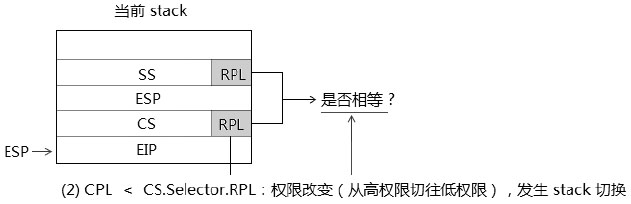

处理器会比较栈内的CS.selector.RPL和SS.selector.RPL是否相等，如果不相等会产生#GP异常，当所有检查都通过后，处理器会依次POP出EIP、CS、ESP和SS值，转入执行新代码。

3. 当CPL > CS.selector.RPL时，意味着目标代码是高权限代码，将产生#GP异常，不能使用retf指令切换到高权限上。


只能通过gate形式进入一级使用TSS发起任务切换到高权限代码。

### 2.10.2 Selector与使用的Descriptor的权限检查

1. SS Selector的RPL必须与所使用的Data段描述符的DPL相等。
2. 如果返回的目标代码是conforming类型的，那么需要CS Selector的RPL >= Code段描述符的DPL。
3. 如果返回的目标代码是non-conforming类型的，需要CS Selector的RPL == Code段描述符的DPL。

### 2.10.3 Selector及Descriptor的类型检查

处理器还会对Selector及Descriptor做些类型的检查工作。
1. CS selector与SS selector是否为Null selecter，是的话将产生#GP异常。
2. CS selector与SS selector是否超出GDT/LDT的limit。
3. 对CS与SS的段描述符进行检查：P标志是否为1，S标志是否为1（Code/Data段）。
4. 对CS所使用的段描述符来说，描述符类型是否为Code段描述符。
5. 对SS段使用的段描述符来说，描述符类型是否为Data段，是否属于Writable（可写）。

### 2.10.4 CS与SS寄存器的加载

当权限检查和上面这些检查都通过后，处理器会使用selector来加载CS与SS寄存器。

### 2.10.5 隐式的Null Selector加载

在前面提到当使用retf指令或iret指令返回到低权限代码时，处理器会为ES、DS、FS、GS寄存器隐式加载Null selector，进入低权限代码后应该重新加载这些段寄存器。

## 2.11 在long-mode下使用RETF指令

在long-mode（IA-32e）下的返回机制和legacy模式下是一致的，由于long-mode（IA-32e）下有两个子模式：64位模式和compatibility模式，因而增加了一些隐晦的地方。

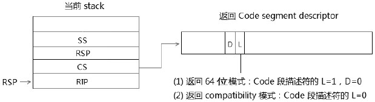

当前代码运行在64位模式，处理器会检查在stack中的CS selector，根据这个selector所引用的Code Segment Descriptor指示出返回到64位模式还是compatibility模式。当返回的目标代码段描述符的L=0时，将返回到compatibility模式，当L=1时D标志位必须为0，指示返回到64位模式。

### 2.11.1 从64位模式返回到64位模式

这是最为常见的情形，除了legacy模式下的检查外，处理器会额外检查如下内容。
1. 栈中的RIP与RSP值是否属于canonical地址形式，不是的话产生#GP异常。
2. SS selector是否属于03H（即：3级权限下的Null selector），如果为3则产生#GP异常。如果切换到相应的0级、1级、2级，那么0、1、2将允许Null selector。


retf指令的默认操作数是32位的，因此返回到64位代码，retf指令需要在前面额外手工加上REX前缀0x48字节（REX.W=1），否则只能pop出32位的值。

```asm
    ; 切换到用户代码
    push USER_SS | 3
    push USER_RSP           ; RSP值在32位内
    push USER_CS | 3        ; 3级权限
    push user_entry
    db 0x48                 ; REX prefix
    retf
```
上面这个代码切换到64位的3级用户代码里，进入3级代码后，ES、ES、FS、GS都会被隐式地装入Null selector，但是在64位模式下，这些Null selector并不需要去理会，处理器不检查Null selector的使用。

上面代码中的RSP在32位值范围内可直接使用push指令压栈。如果使用64位的RSP值，必须通过使用寄存器来压栈。
```asm
    ; 切换到用户代码
    push USER_SS | 3
    mov rax, USER_RSP           ; 使用64位的RSP值
    push rax                    ; 通过rax寄存器压入64位的RSP值
    push USER_CS | 3            ; 3级权限
    mov rax, user_entry         ; 使用64位的入口地址
    push rax                    ; 压入64位的入口地址
    db 0x48                     ; REX prefix
    retf
```
这是由于push指令并不支持64位的立即数操作数，只能通过寄存器来进行压栈操作。同理，当入口地址是64位地址，页必须通过寄存器来压栈，切记！

### 2.11.2 从64位模式返回到compatibility模式

如果返回到compatibility模式，处理器的检查机制将和legacy模式下完全一致，在返回compatibility模式里需要注意目标地址问题。

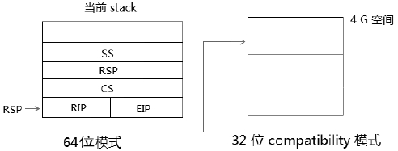

1. 需要为目标代码准备32位或16位的Code segment descriptor，即描述符的L=0，D标志位取决于返回时32位还是16位：D=1时是32位，D=0时是16位。
2. 目标代码必须为4G范围内，需要为目标代码准备32位的EIP和ESP值（stack内的64位里低32位是有效的目标代码进入点），如果在返回前加入的是64位的目标地址值，那么返回后将由于使用截取低32位值而造成错误的指令边界。

### 2.11.3 从compatibility模式返回到64位模式

从32位的compatibility模式返回到64位模式，同样会遇到目标地址的问题。如果需要返回到4G以上的空间执行，那么需要一些中间跳转过程。


在32位的compatibility模式下，由于栈内的EIP值是32位，执行retf指令后只能返回到4G内的代码，因此可以设置一条jmp指令大于4G的地址，然后跳到高于4G的地址空间。
```asm
    entry64_stub:
        mov rax, entry64            ; 64位入口
        jmp rax                     ; 跳转到高于4G的空间
```
返回到64位模式，处理器同样会做额外的检查。

1. 栈中的RIP与RSP值是否属于canonical地址形式，不是的话产生#GP异常。但是对于compatibility模式下来说，栈中的32位ESP与EIP值必定属于canonical地址形式。实际上无须进行检查。
2. SS selector是否属于03H，即3级权限下的Null selector，如果为3则产生#GP异常。如果切换到相应的0级、1级、2级，那么0、1、2将是允许Null Selector。

同样，如果高权限返回到低权限里会为ES、DS、FS、GS寄存器隐式加载一个Null Selector。

> 从64位切换到compatibility模式，或者从compatibility切换到64位模式，在**权限不变**的前提下可以使用jmp指令。然而在**64位操作数**下，由于AMD64的机器上far pointer是48位（16:32），而Intel64机器上是80位（16:64），因而为了通用性，jmp指令同一使用**32位操作数**或者使用**retf指令切换**（或iretq指令）是一个不错的做法。

### 2.11.4 Jmp指令在64位操作数下的变通

如果坚持使用64位的操作数来执行jmp指令，那么可以有下面的逻辑处理手法。
```c
    if (processor == INTEL64) 
        rax = intel64_compatibility_pointer
    if (processor == AMD64)
        rax = amd64_compatibility_pointer
        
    jmp QWORD far [rax]             ; 固定使用64位操作数

intel64_compatibility_pointer:
    dq compatibility_kernel_entry   ; 64bit offset on Intel64
    dw code32_sel
    
amd64_compatibility_pointer:
    dd compatibility_kernel_entry   ; 32bit offset on AMD64
    dw code32_sel
```
上面是使用jmp指令进行切换时的一个逻辑做法：先判断是intel还是amd的处理器。由于64位操作数下intel与amd使用不同长度的far pointer，因而应该为两个平台准备相应长度的far pointer。

### 2.11.5 Jmp指令使用32位操作数

在32位操作数下，far pointer都是48位宽（16:32形式）。在切入compatibility模式的情形里，由于compatibility模式使用32位的入口地址。因此，实际上统一使用32位的操作数是最好的解决办法。
```asm
    jmp DWORD far [rax]             ; 强制使用32位操作数
compat_pointer:
    dd compatibility_kernel_entry
    dw code32_sel                   ; 32位的入口地址
```
jmp指令同一使用32位操作数，无论在intel还是amd平台上都能用。

### 2.11.6 使用retf指令来切换

另一个通用做法是，使用retf指令来切换到同级的compatibility模式。
```asm
    ; 从64位切换到同级compatibility模式代码
    push code32_sel                 ; 同级
    push compatibility_kernel_entry ; 32位EIP值
    db 48h                          ; REX prefix（使用64位操作数）
    retf                            ; far return指令
```
上面的代码在栈上压入了compatibility代码的far pointer，这些32位的值会被符号扩展到64位压入栈中。
使用retf指令来切换，在无论intel还是amd的机器上都是正确的。

## 2.12 使用IRET指令加载CS和SS寄存器

在任务嵌套环境使用iret指令进行任务切换，iret指令使用TSS Selector从TSS段中加载CS和SS寄存器。

在这节我们使用iret指令进行正常的中断返回调用。使用iret指令返回实际上属于伪造一个中断handler返回环境。


使用IRET指令与使用RETF指令的情形几乎一致，除了在中断调用发生时，处理器额外压入EFLAGS寄存器外。对于一些异常的发生，处理器还将加入Error Code，那么在中断handler里需要主动POP出这个Error Code，否则返回将失败。

对于权限的检查，以及Selector与Descriptor的检查，和使用RETF指令时一样的。当进入中断handler不发生权限更改时，处理器只依次压入EFLAGS寄存器、CS Selector、EIP值或者Error Code（某些异常）。


前面我们已经知道，当EFLAGS.NT标志置位时，IRET指令会使用TSS段内Previous Task Link域提供的TSS Selector进行任务切换。我们可以清NT标志，而使用IRET中断返回机制。

### 2.12.1 使用IRET指令返回

在前面使用retf指令从0级代码返回到3级权限的例子里，也可以改用iret指令来代替。区别是多压入一个EFLAGS寄存器。
```asm
    ; 进入ring3代码
    push DWORD user_data32_sel | 03
    push DWORD USER_ESP
    pushf                                   ; 压入EFLAGS值
    push DWORD user_code32_sel | 03
    push DWORD user_entry
    iret                                    ; 使用iret指令切换到3级代码
```
上面这段代码将retf使用的场合改为使用iret指令，增加了一条EFLAGS寄存器的压入指令，实际效果是完全一致的。

## 2.13 在long-mode下使用IRETQ指令

在64位模式下的压栈行为与legacy模式及compatibility模式有较大区别：当发生中断/异常时，无论是否发生权限改变，处理器都压入SS与RSP值。


同样iretq指令页无条件第POP出SS与RSP值。在long-mode里中断处理程序的栈指针是64位宽的，在compatibility模式下发生中断/异常，处理器会切入到64位模式下的中断处理程序。在64位模式下中断处理程序使用IRETQ指令返回（64位的操作数）。

> 可是，我们依然可以在32位的compatibility模式的代码里使用iret指令返回到64位模式。

注意这里的区别：
1. 在中断handler里需使用64位操作数的IRETQ指令（因为中断handler是执行在64位模式下）。
2. 在用户的compatibility模式代码中需使用IRET指令（32位的操作数）。

下面几个情形与RETF指令的使用是一致的。

### 2.13.1 使用IRETQ指令从64位模式返回到64位模式

下面是从0级权限返回到3级权限下，在这里的结构与legacy下是完全一致的。
```asm
    push USER_SS | 3
    push USER_RSP
    pushfq
    push USER_CS | 3
    push user_entry
    iretq                       ; 使用64位操作数，返回到3级权限
```
区别只是使用了64位宽度。这里IRETQ指令时IRET指令的64位别名，只是在机器码前面加上了REX前缀。

### 2.13.2 使用IRETQ指令从64位模式返回到compatibility模式

同样，当使用iretq指令从64位返回到compatibility模式时，需要提供4G内的入口地址。
```asm
    ; 使用iret切换到compatibility mode（进入3级）
    push user_data32_sel | 3
    push USER_RSP
    pushfq
    push user_code32_sel | 3                ; 用户compatibility模块入口
    push compatibility_user_entry           
    iretq                                   ; 使用64位操作数
```
栈中入口地址的**低32位**必须是有效的4G内地址值。返回到compatibility模式与返回到64位模式的区别只是使用了32位的compatibility模式代码段（Code段描述符的L标志为0，D标志为1）。这与RETF指令使用的情形时一样的。

> 在64位模式下，无论是否发生权限切换，必须**无条件压入SS与RSP值！**

### 2.13.3 使用IRET指令从compatibility模式返回到64位模式

在这里需要使用32位的IRET指令（因为当执行再32位的compatibility模式下），提供4G范围内的返回地址值（因为栈中的值是32位）。
```asm
    ; 使用iret指令从3级compatibility模式切换到3级64位模式
    pushf                   ; 压入eflags值
    push USER_CS | 3        ; 在4G范围内
    push user_entry
    iret                    ; 使用32位操作数，返回到64位模式。
```

## 2.14 使用SYSENTRY/SYSEXIT指令加载CS和SS寄存器

sysenter与sysexit指令时处理器提供快速切入0级代码及快速返回3级代码的一对指令。


上图是sysenter/sysexit指令使用的三个MSR。

> 在intel64中，SYSENTER/SYSEXIT指令可以使用在long-mode里，在AMD64中只能使用在legacy模式。

IA32\_SYSENTER\_CS寄存器将会提供4个selector值。
1. 进入时目标代码的CS selector，它等于IA32\_SYSENTER\_CS[15:0] +  0。
2. 进入时目标代码的SS selector，它等于IA32\_SYSENTER\_CS[15:0] +  8。
3. 返回时目标代码的CS selector，它等于IA32\_SYSENTER\_CS[15:0] + 16。
4. 返回时目标代码的SS selector，它等于IA32\_SYSENTER\_CS[15:0] + 24。

### 2.14.1 使用SYSENTER指令进入0级权限代码

sysenter指令可以执行与任何权限中，但是不要试图在**非3级（CPL！=3）**权限下使用SYSENTER指令，因为sysexit指令会**强制返回到3级权限**里（当然：不使用sysexit指令返回时可以这么做！），这里会操作严重错误。

在执行sysenter指令时，处理器会强制对CS和SS寄存器的进行一些处理。
1. CS寄存器被设置为：CS.Selector.RPL=0, CS.Base=0, CS.Limit=FFFFFFFFH。CS的Attribute域则被设为：G=D=P=S=1，DPL=0，CS.Attribute.Type被设为1011B（Excute/Readable，Accessed）类型。
2. SS寄存器被设置为：SS.Selector.RPL=0, SS.Base=0, SS.Limit=FFFFFFFFH。SS的Attribute域也被设为：G=D=P=S=1，DPL=0，SS.Attribute.Type被设为0011B（Writable、Expand-up，Accessed）类型。

> 处理器并不去GDT里读Segment Descriptor，而是直接对CS和SS寄存器进行强制设置。

比较有意思的是，在IA32\_SYSENTER\_CS寄存器里只要不是Null selector，其他的值都可以。
```asm
    mov eax, 0x10 | 3               ; selector为0x13
    mov eax, IA32_SYSENTER_CS
    wrmsr                           ; 设置IA32_SYSENTER_CS
```
即使CS selector被设为0x13值，这个selector的RPL为3，并且它是Data段描述符的selector也没问题。这是因为处理器根本不去GDT/LDT中读取描述符。

> 胡乱给IA32_SYSENTER_CS设一个值，要小心处理。在以后的代码执行流里如果出现了stack切换时，一个混乱的值会引发#GP异常的产生。

在正常的情况下不要对IA32\_SYSENTER\_CS随便设一个值，以防后续处理出现问题。

```asm
    ; set_sysenter()：设置系统的sysenter/sysexit使用环境

__set_sysenter:
    xor edx, edx
    mov eax, KERNEL_CS
    mov ecx, IA32_SYSENTER_CS
    wrmsr                           ; 设置IA32_SYSENTER_CS
    
    mov eax, KERNEL_RSP0
    mov ecx, IA32_SYSENTER_ESP
    wrmsr                           ; 设置IA32_SYSENTER_ESP
    
    mov eax, __sys_service  
    mov ecx, IA32_SYSENTER_EIP      
    wrmsr                           ; 设置IA32_SYSENTER_EIP
    
    ret
```

### 2.14.2 使用SYSEXIT指令退回到3级权限代码

sysexit只能执行再0级权限的代码里，处理器同样对CS和SS进行强制的设置。
1. CS寄存器被设置为：CS.Selector.RPL=3，CS.Base=0，CS.Limit=FFFFFFFFH。CS的Attribute域被设为：G=D=P=S=1，DPL=3，CS.Attribute.Type被设为1011B（Excute/Readable，Accessed）类型。
2. SS寄存器被设置为：SS.Selector.RPL=3，SS.Base=0，SS.Limit=FFFFFFFFH。SS的Attribute域被设为：G=D=P=S=1，DPL=3，SS.Attribute.Type被设为0011B（Writable，Expandup，Accessed）类型。

所不同的是，sysexit指令将CS和SS寄存器的权限设为3级。而sysenter指令设为0级。

sysexit指令会使用ECX寄存器与EDX寄存器。
1. 3级代码的ESP值放在ECS寄存器里
2. 3级代码的EIP值放在EDX寄存器里

因此，在使用sysenter指令进入前，需要为返回代码对ECX和EDX寄存器进行预先的设置。
```asm
; sys_service()：使用sysenter/sysexit版本的系统服务例程
; input：eax系统服务例程号
__sys_service:
    push ecx                                    ; 保存返回esp值
    push edx                                    ; 保存返回eip值
    mov eax, [system_service_table + eax * 4]
    call eax                                    ; 调用系统服务例程
    pop edx
    pop ecx
    sysexit
```
如上面的代码，在0级的系统服务例程里应该先保存这两个值（需要使用到ECX和EDX寄存器），在返回前恢复这两个值。

### 2.14.3 非对称地使用sysenter/sysexit指令

值得注意的是：有些OS的系统服务例程的调用使用了sysenter指令进入，而在某些情况下并没有使用sysexit指令返回。这种非对称的使用为系统服务例程调用机制提供了某些灵活性。

### 2.14.4 设置一个stub函数

多数情况下并不在代码里直接使用sysenter指令，而是将sysenter指令封装起来，设置一个stub函数作为中转站。
```asm
; sys_service_enter()：快速切入service的stub函数
__sys_service_enter:
    mov ecx, esp                ; 返回代码的ESP值
    mov edx, return_address     ; 返回代码的EIP值
    sysenter                    ; 进入0级service
return_address:
    ret
```
EDX寄存器设置为sysenter指令的下一条指令，这是为了正常返回到指令流里。
```asm
    mov esi, msg
    mov eax, SYS_PUTS           ; 系统功能号
    call sys_service_enter      ; sysenter指令stub函数
```
在用户代码里就可以像上面一样调用这个stub函数，sysenter指令被包装起来，看起来和平常的函数没区别。

有两个系统服务接口函数，一个是sys\_service()函数，使用了sysenter/sysexit指令来调用/返回。
另一个是system\_service()函数，它使用int 0x40指令来调用。两个系统服务接口实现相同的功能。

上面的调用也可以使用以下的方式。
```asm
    mov esi, msg
    mov eax, SYS_PUTS           ; 系统功能号
    int 0x40                    ; 使用中断调用进入系统服务例程
```

现在的OS都支持使用快速的切入系统服务例程方式。而中断调用虽然是一种旧方式并且较慢的系统服务例程调用方式，但是可以在任意权限下执行，这是使用sysenter/sysexit指令快速调用方式做不到的（除了使用非对称的sysenter/sysexit指令外，下面的描述符排除了非对称使用sysenter/sysexit指令的情形），原因如下。

### 2.14.5 在3级权限里使用sysenter调用

由于sysexit返回到3级权限里，因此在非3级权限里使用sysenter会遇到很大问题。假如在0级代码里使用sysenter进入服务例程，而sysexit返回时会强行变成3级权限。因此，必须保证从3级代码里使用sysenter进入系统服务例程。

## 2.15 在IA-32e模式下使用SYSENTER/SYSEXIT指令

在AMD64机器上sysenter/sysexit不能使用在long mode下，所以这里使用了IA-32e术语（Intel64的术语）。
在IA-32e模式下，CS和SS Selector获取起了些变化。


sysenter指令进入时，CS和SS Selector的获取方法不变，在sysexit返回时，根据返回的模式而决定如何获取。
如果返回到compatibility模式则和legacy模式下是一致的。
而在返回64位模式时，CS Selector是IA32\_SYSENTER\_CS + 32，而SS Selector是IA32\_SYSENTER\_CS + 40。
实际上就等于扩展了64位环境所使用的Selector值。

在配置sysenter/sysexit使用环境时，GDT/LDT中Code Segment Descriptor与Data Segment Descriptor应组织如下。


实际上是64位模式返回的Code Segment和Data Segment描述符排列在compatibility模式的后面。

IA32\_SYSENTER\_ESP和IA32\_SYSENTER_EIP寄存器的地址值是64位宽，处理器会检查是否属于canonical地址形式。

### 2.15.1 设置IA-32e模式里的sysenter/sysexit使用环境

这个设置几乎与legacy模式下是一致的，可是需要注意以下几点。
1. 由于IA-32e模式的sysexit指令为了返回64位模式而相应增加了2个Selector，因此在GDT/LDT里的Code Segment Descriptor与Data Segment Descriptor的位置要相应作出调整（或另外增加2个描述符），以适应sysexit指令的使用。
2. 进入0级目标代码的地址需要时64位的canonical地址，目标代码必须为64位模式。

```asm
    ; set_sysenter()：long-mode模式的sysenter/sysexit使用环境
__set_sysenter:
    xor edx, edx
    
    mov eax, KERNEL_CS
    mov ecx, IA32_SYSENTER_CS
    wrmsr                           ; 设置IA32_SYSENTER_CS
    
    mov rdx, KERNEL_RSP
    shr rdx, 32
    mov rax, KERNEL_RSP
    mov ecx, IA32_SYSENTER_ESP
    wrmsr                           ; 设置IA32_SYSENTER_ESP
    
    mov rdx, __sys_service
    shr rdx, 32
    mov rax, __sys_service
    mov ecx, IA32_SYSENTER_EIP
    wrmsr                           ; 设置IA32_SYSENTER_EIP
    
    ret
```

在设置sysenter/sysexit的执行环境时，需要为sysexit指令的返回作出考虑。在这里统一使用sysexit指令返回到64位模式的设置。与32位的设置环境几乎一致的，指示RSP与RIP是64位值。

### 2.15.2 使用SYSENTER指令进入0级64位代码

同样，处理器会对CS和SS寄存器作出强制的设置。
1. 对CS寄存器：CS.Selector.RPL=0，CS.Base=0，CS.Limit=FFFFFFFFH，而Attribute域中，DPL=0，G=P=S=1，L=1并且D=0，Type被设为：1011B值（Execute/Readable, Accessed）类型。
2. 对SS寄存器：SS.Selector.RPL=0，CS.Base=0，CS.Limit=FFFFFFFFH，而Attribute域中，DPL=0，G=P=S=1，L=1并且D=0，Type被设为：0011B值（Writable, Expand-up, Accessed）类型。

与legacy模式唯一的不同是CS寄存器设置为L=1并且D=0，指示目标代码将是64位模式的代码。可是与legacy模式下使用相比，在IA-32e模式下使用增加了几个情形。
1. 从64位模式进入64位模式
2. 从compatibility模式进入64位模式
3. 从64位模式返回64位模式
4. 从64位模式返回到compatibility模式

sysenter指令必定进入64位模式，而返回则不一样了。实际上，这与前面所述的使用Call-gate、retf指令以及iret指令，在long-mode下遇到的切换情形时一样的。

### 2.15.3 从64位模式进入0级64位模式

这是在一个64位模式代码里使用sysenter指令进入0级64位模式，我们设置了一个stub函数以供在3级64位模式下使用：
```asm
    ; sys_service_enter()：系统服务例程接口stub函数
    ; input：rax系统服务例程号

__sys_service_enter:
    mov rcx, rsp
    mov rdx, return_64_address
    sysenter
return_64_address:
    ret
```
除了地址值扩充为64位外，其他和legacy模式下的stub是一致的。这个stub只能为64位代码服务。

### 2.15.4 从compatibility模式进入0级64位模式

为了能在compatibility下使用，我们还需为compatibility模式编写另一个stub函数。
```asm
    bit 32
__compat_sys_service_enter:
    mov ecx, esp
    mov edx, return_compatibility_address
    ssyenter

return_compatibility_pointer:
    dq compatibility_sys_service_enter_done
    dw user_code32_sel | 3
return_compatibility_address:    
    bits 64
    jmp QWORD far [return_compatibility_pointer]    ; 从64位切换回compatibility模式
compatibility_sys_service_enter_done:
    bits 32
    ret
```
由于是从32位的compatibility模式代码里使用，因此，需要编译为32位，在函数开头使用bits 32指示字。然而值的注意的是，在这里系统服务例程将同一使用sysexit指令返回到64位模式。因此，在这个compatibility模式使用的stub函数里，需要重新从64位模式切换到compatibility模式（在返回前）。

### 2.15.5 使用SYSEXIT指令返回

在IA-32e模式下，sysexit指令返回情形发生了很大的变化。

> sysexit指令如何确定是返回64位模式还是compatibility模式？

是根据sysexit指令的操作数大小，与retf指令一样，在64位模式下sysexit指令的默认操作数不是64位的。所不同的是，retf与iretq指令根据Stack内的CS Selector所引用的Code Segment Descriptor来确定返回到那种模式。而sysexit指令只能根据sysexit的操作数大小。
```asm
    db 0x48             ; REX prefix字节
    sysexit             ; 返回到64位模式
    
    sysexit             ; 返回到compatibility模式
```
处理器会强制设置CS和SS寄存器。
1. 对于SS寄存器：SS.Selector.RPL=3，SS.Base=0，SS.Limit=FFFFFFFFH。而Attribute域中，DPL=3，G=D=P=S=1，Type被设为0011B值（Writable，Expand-up，Accessed）类型。
2. 当返回64位模式（使用64位的操作数）时，CS寄存器为CS.Selector.RPL=3，SS.Base=0，SS.Limit=FFFFFFFFH。而Attribute域中，DPL=3，G=D=P=S=1，L=1并且D=0，类型为1011B（Execute/Readable，Accessed）。
3. 当返回compatibility（使用32位的操作数）时，CS寄存器的L=0并且D=1，返回到32位代码。

在IA-32e模式下的sysexit使用，在系统里需要进行设计上的考虑。
1. 考虑一：可以为64位模式和compatibility模式的调用分别设置两个环境，那么sysexit将可以根据情形返回到64位模式或compatibility模式。
2. 考虑二：统一使用64位环境，那么sysexit指令同一返回到64位模式下。

### 2.15.6 统一使用SYSEXIT指令返回到64位模式

统一让sysenter指令返回到64位模式毕竟符合IA-32e的设计原则，也是占绝对优势的。
```asm
    bits 64

; sys_service()：系统服务例程
__sys_service:
    push rbp
    push rcx
    push rdx
    push rbx
    mov rbp, rsp
    mov rbx, rax
    
    jmp QWORD far [lib32_service_enter_compatiblity_pointer]        ; 从64位切换到compatibility模式
    
    ; 定义far pointer
lib32_service_enter_compatibility_pointer:
    dq  lib32_service_enter_compatibility
    dw  code32_sel

lib32_service_enter_64_pointer:
    dd lib32_service_enter_done
    dw KERNEL_CS

lib32_service_enter_compatibility:
    bits 32
    
    mov ax, data32_sel
    mov dx, ax
    mov ds, ax
    mov ss, ax
    mov es, ax
    
; 造成不可冲入，去掉：mov esp, LIB32_ESP指令
lib32_enter:
    lea eax, [LIB32_SEG + ebx * 4 + ebx]                            ; rbx * 5 + LIB32_SEG 得到lib32库函数地址
    call eax                                                        ; 执行32位例程
    jmp DWORD far [lib32_service_enter_64_pointer]                  ; 切换回64位模式
    bits 64

lib32_service_enter_done:
    mov rsp, rbp
    pop rbx
    pop rdx
    pop rcx
    pop rbp
    sysexit64                                                       ; 统一返回到64位模式，sysexit64是宏定义
```
这个是IA-32e版本下的sys_service系统服务例程（对应于前面的legacy版本的系统服务例程），这个例程统一使用sysexit指令返回到64位模式。
当从compatibility模式里进入时，前面介绍的compatibility模式快速切换系统服务例程stub函数compatibility\_sys\_service\_enter()会从sysexit返回到64位模式后切换回compatibility模式。

这个sys\_service()例程，体现了三个特色。
1. 从64位切换到compatibility模式，调用lib32.asm库里的函数（目的是避免重复编写一些库函数）。为了调用32位的lib32.asm库函数，需要切换到compatibility模式里执行。
2. 当执行完lib32.asm的库函数后，切换回64位模式。
3. 统一返回到64位模式。

值得注意的是，需要为何种模式编译何种代码：64位或32位，要在适当的位置提示编译器。

> 这个函数只能在intel64机上上运行，除了使用了80位的far pointer形式外，最重要的是，在AMD64机器上的long-mode下并不支持sysenter和sysexit指令。在AMD64机器上应该使用syscall与sysret指令代替。

## 2.16 使用SYSCALL/SYSRET指令来加载CS与SS寄存器

syscall/sysret指令是由AMD引入的，Intel对它提供了有限的支持，在AMD64中syscall/sysret可以完全代替sysenter/sysexit指令，在Intel64中syscall/sysret指令只能使用在64位模式下，也不支持在compatibility模式里使用。

syscall/sysret指令实现了与sysenter/sysexit几乎完全相同的功能，只有些细微的区别，下图来自AMD64手册。


与sysenter/sysexit指令相比，多了一个SFMASK寄存器，在Intel64中去掉了CSTAR寄存器，只有IA32\_STAR、IA32\_LSTAR及IA32\_SFMASK寄存器。

SFMASK寄存器的作用是，进入0级代码后用来屏蔽RFLAGS寄存器的某些标志位。当SFMASK寄存器的bit被置位，则RFLAGS寄存器相应的标志位将被清0。

### 2.16.1 设置SYSCALL指令的使用环境

syscall与sysret指令使用STAR寄存器进行设置，在Intel中称为IA32\_STAR寄存器，结构如下所示。


STAR寄存器的低32位对于Intel64机器来说是无效的，在调用时，syscall指令从STAR[47:32]获得CS Selector，从STAR[47:32]+8获得SS Selector。
- 在返回64位模式时，sysret指令从STAR[63:48]+16得到CS Selector，从STAR[63:47]+8得到SS Selector。
- 返回到compatibility模式时，sysret指令从STAR[63:48]得到CS Selector，从STAR[63:48]+8得到SS Selector。

> 在AMD64上可以返回到compatibility模式，在Intel64上返回compatibility模式时无效的。

下面这段代码对syscall/sysret使用环境进行了设置（这里主要是基于Intel64机器）。
```asm
    ; set_syscall()： long-mode 模式的syscall/sysret使用环境
__set_syscall:
    ; enable syscall 指令
    mov ecx, IA32_EFER
    rdmsr
    bts eax, 0                                      ; SYSCALL enable bit
    wrmsr
    
    mov edx, KERNEL_CS | (sysret_cs_sel << 16)
    xor eax, eax
    mov ecx, IA32_STAR
    wrmsr                                           ; 设置IA32_STAR
    
    mov rdx, __sys_service_routine
    shr rdx, 32
    mov rax, __sys_service_routine
    mov ecx, IA32_LSTAR
    wrmsr                                           ; 设置IA32_LSTAR
    
    xor eax, eax
    xor edx, edx
    mov ecx, IA32_FMASK
    wrmsr
    
    ; 设置KERNEL_GS_BASE寄存器
    mov rdx, kernel_data_base
    mov rax, rdx
    shr rdx, 32
    mov ecx, IA32_KERNEL_GS_BASE
    wrmsr
    ret
```
这个set_syscall()函数主要做三个工作：
1. 开启SYSCALL/SYSRET指令的enable位，在IA32\_EFER的bit0是syscall指令的enable控制位。只有开启了这个功能，才可以使用syscall指令，否则会产生#UD异常。
2. 分别对IA32\_STAR、IA32\_LSTAR以及IA32\_FMASK进行设置。
3. 对IA32\_KERNEL\_GS\_BASE寄存器进行设置，这个寄存器用来保存OS的kernel数据，其中包括系统服务例程所使用的RSP值。（详情查看swapgs指令）。

### 2.16.2 位SYSCALL指令所准备的stub函数

同样，我们最好为syscall指令准备一份stub函数，用来封装syscall指令的调用。
```asm
    ; sys_service_call()：系统服务例程接口stub函数，syscall版本
    ; input：rax系统服务例程号

__sys_service_call:
    push rbp
    push rcx
    mov rbp, rsp                            ; 保存调用者的RSP值
    mov rcx, return_64_address_syscall      ; 返回地址
    syscall

return_64_address_syscall:
    mov rsp, rbp
    pop rcx
    pop rbp
    ret
```
syscall指令无须为系统服务例程准备RSP指令，可是我们需要相办法在sysret返回时找回原来的RSP指针值，因此使用rbp保存原来rsp是最好的办法，在sysret指令返回后用rbp恢复原rsp值。

### 2.16.3 SYSCALL版本的系统服务例程

syscall版本与sysenter版本的结构是一样的，指示在syscall版本里需要增加对RSP指针的获取。
```asm
    ; sys_service_routine()：系统服务例程，syscall/sysret版本

__sys_service_routine:
    swapgs                                                      ; 获取kernel数据
    mov rsp, [gs:0]                                             ; 得到kernel RSP值
    push rbp
    push r11
    push rcx
    push rbx
    mov rbp, rsp
    mov rbx, rax
    
    jmp QWORD far [lib32_serivce_call_compatibility_pointer]    ; 从64位切换到compatibility模式
    
    ; 定义far pointer
lib32_service_call_compatibility_pointer:
    dq lib32_service_call_compatibility
    dw code32_sel

lib32_service_call_64_pointer:
    dd lib32_service_call_done
    dw KERNEL_CS

lib32_service_call_compatibility:
    bits 32
    
    mov ax, data32_sel
    mov dx, ax
    mov ss, ax
    mov es, ax
    
lib32_call:
    lea eax, [LIB32_SEG + ebs * 4 + ebx]                        ; rbx*5+LIB32_SEG得到lib32库函数地址
    call eax                                                    ; 执行32位例程
    jmp DWORD far [lib32_service_call_64_pointer]               ; 切换回64位模式
    
    bits 64
lib32_service_call_done:
    mov rsp, rbp
    pop rbx
    pop rcx
    pop r11
    pop rbp
    swapgs                                                      ; 恢复GS.base
    sysret64                                                    ; 返回到64位模式
```
在这个系统例程里使用了swapgs指令来读取kernel的数据结构，[GS:0]里存放着RSP指针（Intel语法是GS:[0]），通过这种途径来得到0级的RSP指针。

### 2.16.4 非对称地使用syscall/sysret指令

同样，有些OS在实现切入系统服务例程时，使用syscall指令进入。而在某些情况下不使用sysret指令返回，造成非对称使用syscall/sysret指令对。这在系统服务例程调用机制上提供了灵活性。

# 3. 总结

## 3.1 系统调用

使用Call-Gate或者Int 0x80方式来实现系统调用虽然速度上有劣势，可是最大的优势是可以在任何权限里使用（如0级权限）而不会出现问题，
sysexit与sysret强制返回到3级权限代码，在0级里调用会产生问题，除非你特别设计在stub函数里返回时切换回0级权限或非对称使用syscall/sysret指令。

## 3.2 加载CS寄存器的情形

到此为止，我们在上面讨论了对CS寄存器进行加载的11种情况（有些包括对SS寄存器的加载），总结一下：
1. 使用jmp/call直接提供far pointer进行调用
2. 使用Call-Gate进行调用
3. 提供一个TSS Selector进行任务切换
4. 使用Task-Gate进行任务切换
5. 使用IRET指令进行任务切换
6. 使用INT指令发起中断调用
7. 使用INT0、INT3、BOUND指令引起异常调用。
8. 使用RETF指令进行权限的切换
9. 使用IRET指令进行权限的切换
10. 使用SYSENTER/SYSEXIT指令切入0级代码
11. 使用SYSCALL/SYSRET指令快速切入0级代码