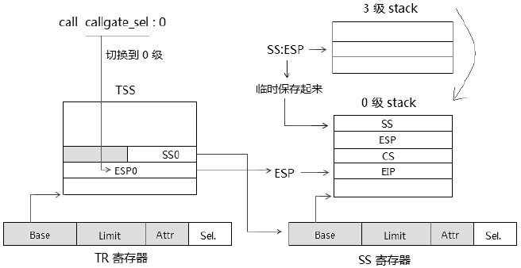
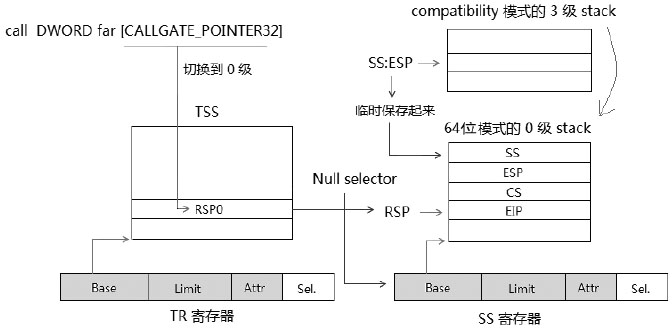

- 1 Stack栈结构及Stack的切换
    - 1.1 Legacy模式下的Stack
    - 1.2 Expand-up类型的Stack段（或Data段）
        - 1.2.1 段Limit值计算
        - 1.2.2 Expand-up段的有效范围
    - 1.3 Expand-down类型的Stack段（或Data段）
        - 1.3.1 段Limit值的计算
        - 1.3.2 Expand-down段的有效范围
    - 1.4 在64位模式下的Stack
    - 1.5 Data Segment Descriptor
        - 1.5.1 D/B与G标志位
    - 1.6 long-mode下Data Segment Descriptor
        - 1.6.1 W标志位
        - 1.6.2 DPL标志位
        - 1.6.3 Base域
        - 1.6.4 FS段和GS段的基地址
- 2 Stack的使用
    - 2.1 显示使用SS段
    - 2.2 SS寄存器显示加载
    - 2.3 使用LSS指令加载
    - 2.4 Selector检查
    - 2.5 权限检查
    - 2.6 Limit检查
    - 2.7 Data段描述符类型检查
    - 2.8 TR的显示加载
        - 2.8.1 置Busy标志位
    - 2.9 Call-Gate调用下的Stack切换
        - 2.9.1 TSS段里的栈指针
    - 2.10 在long-mode下使用Call-Gate调用的Stack切换
        - 2.10.1 long-mode下的TSS段里的栈指针
        - 2.10.2 加载Null Selector到SS寄存器
    - 2.11 使用RETF指令返回时的Stack切换
    - 2.12 long-mode下使用RETF指令返回时的Stack切换
        - 2.12.1 返回到compatibility模式时
        - 2.12.2 返回到64位模式时
        - 2.12.3 从伪造的Call-Gate服务例程RETF返回时
    - 2.13 调用中断或中断/异常发生时的Stack切换
    - 2.14 long-mode下的中断Stack切换
        - 2.14.1 IST（Interrupt Stack Table）
        - 2.14.2 从compatibility模式进入64位模式
        - 2.14.3 从64位模式进入64位模式
    - 2.15 使用IRET指令返回时的Stack切换
        - 2.15.1 long-mode下IRETQ返回Stack切换
        - 2.15.2 返回到compatibility模式时
        - 2.15.3 从伪造的中断handler环境中返回

# 1. Stack栈结构及Stack的切换

在加载CS寄存器时，若发生权限的改变，那么也会发生Stack的切换。

## 1.1 Legacy模式下的Stack

在legacy模式下Stack指针的大小受SS所引用的Data Segment Descriptor的B标志位影响。


- 当B=1时，栈指针为32位的ESP值能寻址4G的地址空间。
- 当B=0时，栈指针是15位的SP值能寻址64K的地址空间。

> 需要注意的是，在栈中压入多少个字节并不是由栈指针大小决定，而是由操作数大小决定。

在默认操作数大小和栈指针大小不一致的时候，更容易让人产生困扰：当CS.D=1（指示默认操作数为32位），而SS.B=0时（栈指针为16位），比如下面的情形：
```asm
    mov esp, 0x7fffc000                 ; 目的是栈指针ESP设为0x7fffc000值
    push rax                            ; eax压入栈中
```
在这种情况下，SP的值为0xc000，处理器会在0xbffc（SP-4后）压入32位的eax寄存器值。
栈指针是16位的。在ESP中只有低16位是有效的栈指针值，然而操作数是32位的，压入的是32位的值。

## 1.2 Expand-up类型的Stack段（或Data段）

当SS或其他数据段寄存器内的属性标志E=0时，它属于Expand-up段。对于一个Expand-up类型的Stack或Data段来说，它的**段内有效区域**并不依赖于B标志位。


上图所示SS使用的Data段是Expand-up类型段。
1. 最大offset值是limit值。
2. 最小offset值是0值。

### 1.2.1 段Limit值计算

在32位段寄存器内的limit值计算依赖于段描述符的G标志和limit值，而段描述符内的limit值是20位，最终32位段limit计算如下。
1. 当G=1时，32位的段limit值=段描述符limit x 1000h + FFFFh，假设段描述符的limit为FFFFFh，那么最终的段界限时：FFFFFh x 1000h + FFFFh = FFFFFFFFh。假设段描述符limit为0，那么最终的段界限时：FFFh。
2. 当G=0时，32位的段limit值就是段描述符的limit值。假设段描述符的limit为FFFFFh，那么最终的段界限就是FFFFFh。这就是实模式下的64K段界限。假设段描述符的limit为0，那么最终的段界限值就是0。

### 1.2.2 Expand-up段的有效范围

访问Expand-up段内的地址，有效的段地址范围是0到段寄存器的limit值，以SS段为例，Expand-up类型的段描述符加载到SS寄存器后，访问SS段，那么有效的地址范围就是0到SS.Limit值。

> 段内访问都是基于段Base值。如果SS.Base=10000h，那么：

```asm
    mov eax, ss:[0]          ; 访问地址10000h
    mov eax, ss:[0ffffffffh] ; 访问地址10000h + 0ffffffffh = 0000ffffh
```
如果SS.limit=FFFFFFFFh，上面这两个段内地址的访问都是有效的。实际上对段内的访问有效区域无须考虑base值。

## 1.3 Expand-down类型的Stack段（或Data段）

绝大多数情况下，OS系统都是使用Expand-up类型的Data Segment，包括Stack也是使用Expand-up类型的，如果使用Expand-down类型的stack呢？


上图是当SS所使用的Data segment为Expand-Down类型时（页适用于其他的数据段，如DS段）的内存结构示意图。它的有效区域依赖于B和G两个标志位。

当一个Data segment descriptor被加载到SS寄存器后，SS属性域里的E标志指示它属于Expand-up还是Expand-down类型。当E=1时，它是Expand-down类型的。这时其内存有效区域与Expand-up类型相比有很大的变化。对于一个Expand-down类型的段来说，最大offset（偏移量）值是固定的；对于一个Expand-up类型的段来说，最小offset（偏移量）是固定的。

当它是一个Expand-down类型的数据段时（以SS段为例）
1. B标志决定段的最大offset值。当B=1时，最大offset值为FFFFFFFFh（4G界限），当B=0时，最大的offset值为FFFFh（64K界限）。
2. 段的最小offset值是Limit+1。

> 段的有效访问区域是最小offset值到最大offset之间（基于段的base值）。

### 1.3.1 段Limit值的计算

当在一个segment descriptor被加载到段寄存器时（包括Code和Data段寄存器），段描述符的limit会被加载段寄存器的Limit域（影藏的Cache部分），段寄存器内的Limit是32位宽，它由段描述符中20位的Limit域计算而来（依赖于描述符的G标志位）。
1. 当G=1时，32位的limit = 描述符内的limit x 1000h + FFFh。假设描述符内的limit值是FFFFFh，那么段的最终limit是：FFFFFh x 1000h + FFFh=FFFFFFFFh（4G界限）。
2. 当G=0时，32位的limit = 描述符内的limit x 1 = limit（也就是等于描述符内的limit值），假设描述符内的limit值是F0000h，那么段的最终limit就是F0000h值。

可以看出段的limit值的计算是统一的，无论是Expand-up段还是Expand-down段，所不同的是它们的最大offset值和最小offset值。

### 1.3.2 Expand-down段的有效范围

回到前面的Expand-Down类型的SS段，它基于段base的有效区间如下。
1. B=1时，SS.limit+1 到 FFFFFFFFh
2. B=0时，SS.limit+1 到 FFFFFh


在E=1，G=1，B=1的情况下，看看下面的几个例子。

- **例1：假设段描述符内的limit=F0000h，那么这个Expand-Down的：**
1. 段的最小offset值是minimum\_offset = limit + 1 = F0000h x 1000h + FFFh + 1 = F0001000h
2. 段的最大offset值是maximum\_offset = FFFFFFFFh

因此，段的有效访问时minimum\_offset 到 maximum\_offset之间，即F0001000h到FFFFFFFFh之间是合法的段内地址区域。
在下面的段内访问中：
1. F000FFFh：出错，超出最小访问值，产生#GP异常。
2. 0F00FFFh：出错，超出最小访问值，产生#GP异常。
3. F0001000h：正确
4. FFFFFFFFh：正确

- **例2：若段描述符内的limit=0值，那么这个Expand-down段的：**
1. minimum\_offset = limit + 1 =  FFFh + 1 = 1000h
2. maximum\_offset = FFFFFFFFh

因此，在段内的有效访问时从1000h到FFFFFFFFh之间的区域，在下面的地址访问中：
1. FFFh：出错，超出最小的访问值，产生#GP异常。
2. 1000h：正确
3. FFFFFFFFh：正确

- **例3：假设在B=0的前提下，G=1，E=1，limit=0值，那么：**
1. minimum\_offset = limit + 1 = FFFh + 1 = 1000h
2. maximum\_offset =  FFFFh

因此它的段内有效区域是1000h到FFFFh之间，在下面的段内地址访问中：
1. FFFh：出错，超出最小范围值，产生#GP异常。
2. 10000h：出错，超出最大范围值，产生#GP异常。
3. 1000h：正确。
4. FFFFh：正确。

有一种情况需要注意：跨边界产生的访问。以例3为例：
```asm
    mov al, [FFFFh]         ; 正确，刚好在最大段界限范围内
    mov ax, [FFFFh]         ; 错误，读WORD边界，超出了段界限范围
```
大多数OS几乎都使用更简单的Expand-up类型，在一些情况下处理器会强制使用Expand-up段（例如在前面所述的sysenter与syscall指令调用中的SS段）。并且在64位模式下，Expand-down段是无效的。

## 1.4 在64位模式下的Stack

在64位模式下，栈结构起了很大的变化。
1. 栈指针固定了64位的RSP值，不受任何影响。
2. Stack段只能使Expand-up类型，Expand-down类型是无效的。
3. 在中断handler被调用时，RSP被调整为16字节边界对齐。


如上图所示，假设中断发生前的RSP是13FF7H，处理器在中断handler调用时，在push数据之前将栈指针RSP从13FF7H调整到13FF0H（16字节边界上）然后在执行push操作，加入SS、RSP、RFLAGS、CS以及RIP值。

这个调整的操作是 RSP & FFFFFFFF_FFFFFFF0H，结果是16字节边界对齐。对于一般的push和call调用，处理器并不进行对齐调整。

## 1.5 Data Segment Descriptor

Data段描述符与Code段描述符具有通用性，结构基本是完全一致的，指示描述符类型不同，如下图所示。


图中描述符的各个域与Code段的意义一致，在类型域里，三个类型标志位对数据段的类型进行定义，下面是Data数据段的类型组合。


只读类型的Data段不能作为Stack段，如果加载一个只读的Data段描述符到SS寄存器，会产生#GP异常。
其中可写的代码具有Read/Write的权限，已访问的代码已经被加载到段寄存器中。

### 1.5.1 D/B与G标志位

D/B标志位适用于Stack段时，被作为B标志位，如前面的Stack结构中所述。
当使用与其他的数据段时，D/B标志位也同样被用于Expand-down类型的段才有意义，它与G标志结合起来对Expand-down段的limit值进行定义，如前面对Expand-down类型的段所述。

## 1.6 long-mode下Data Segment Descriptor

在compatibility模式下，Data Segment Descriptor的结构与legacy模式一致的，在64位模式下起了很大的变化，Data Segment Descriptor的绝大部分域都是无效的。


在64位模式下的Data段描述符S标志必须设为1，Code/Data标志位必须置为0，否则在加载时会产生#GP异常。

### 1.6.1 W标志位

这个标志位对于DS、ES、FS、GS寄存器来说并无影响，被忽略。当被加载到SS寄存器时，处理器会检查W标志位是否为1（可写的），否则会产生#GP异常。可是在64位模式下的非3级权限下可以加载Null Selector到SS寄存器里，这时所有的段描述符属性都被忽略。

### 1.6.2 DPL标志位

这是Data段的DPL值，在加载Data段描述符到段寄存器的时候处理器会检查该值。
1. 在64位模式下，对于一个正常的Selector来说，处理器在加载时也会对Data Segment描述符的DPL进行必要的检查。
2. 在64位模式下，当加载一个Null Selector到Data段寄存器时，处理器不但会忽略DPL值，还会忽略所有的Data段描述符属性。

基于在加载时需要检查，将DPL归纳为有效的域，这始终都是有益处的。

### 1.6.3 Base域

在64位模式下，对于ES、SS、DS段来说Base是无效，被忽略的。然而对于FS和GS段是有效的，可是从Data Segment Descriptor里只能加载到FS和GS段的低32位。

### 1.6.4 FS段和GS段的基地址

FS段和GS段完整的64位Base地址需要对应的MSR里设置：
- FS的基地址寄存器是IA32\_FS\_BASE，地址在C0000100H。
- GS的基地址寄存器是IA32\_GS\_BASE，地址在C0000101H。

> 这些值必须在0级权限下使用wrmsr指令进行设置。

# 2. Stack的使用

下面两种数据的访问时影式（默认）使用与SS段的。
1. 使用sp/esp/rsp寄存器的内存访问形式。如：mov eax, [esp]
2. 使用bp/ebp/rbp寄存器的内存访问形式。如：mov eax, [ebp]

- ebp是栈的frame base pointer
- esp是栈的top pointer

使用它们将默认引用SS段。

下面的指令将隐式使用于SS段，且不能更改。
1. 栈操作指令：push指令，pop指令，enter指令及leave指令。还包括它们的衍生形式，如：pushf/popf，push es/pop es等。
2. 控制转移指令：call指令，ret指令，int指令，iret指令。还包括它们的衍生形式，如：int3/int0，retf指令等。

## 2.1 显示使用SS段

可以使用Segment prefix显式引用SS段。
```asm
    mov eax, ss:[eax]               ; SS prefix
```
上面这条指令中，[eax]内存访问默认是使用DS段的，可以使用SS段前缀进行显示地使用与SS段。

## 2.2 SS寄存器显示加载

可以使用mov指令、less指令和pop ss指令显示地加载SS寄存器，pop ss在64位模式下是无效的。
```asm
    mov ax, USER_SS
    mov ss, ax              ; load into SS
```
使用mov指令加载SS寄存器，如果发生中断/异常，处理器将保证mov ss, ax指令的下一条指令得到执行，完毕后才响应中断和异常。
```asm
    mov ss, ax              ; 临时抑制中断/异常的发生
    mov esp, xxx            ; 下一条指令执行完毕后，才可以响应
```
处理器假设在mov ss, ax指令后面是一条更新sp/esp/rsp寄存器的指令，确保Stack结构能够得到建立。

## 2.3 使用LSS指令加载

在这种情形下，使用LSS指令加载时更有效率的方式，提供一个far pointer。
```asm
    lss esp, [STACK_POINTER]            ; far pointer
    
    ; far pointer定义
    STACK_POINTER   
    dd 0x7fff                           ; ESP值
    dw 0x20                             ; SS值
```
在64位模式下，LESS指令依然可用，在Intel64中，far pointer可以是80位（16:64），在AMD64中far pointer最长只能使48位（16:32）。
```asm
    lss rsp, [STACK_POINTER64]          ; far pointer
    
    ; far pointer定义（intel64）
    STACK_POINTER   
    dq 0x7fff                           ; 64bit RSP值
    dw 0x20                             ; SS值
```

## 2.4 Selector检查

处理器会检查Selector是否为Null Selector，在legacy模式和compatibility模式下不允许加载Null Selector到SS寄存器，否则会产生#GP异常。

在64位模式下，在非3级权限（0、1、2级权限）里可以加载Null Selector到SS寄存器里。

## 2.5 权限检查

SS寄存器的加载需要严格的权限限制，合法的权限如下：
```
    1. RPL == Data Segment.DPL
    2. CPL == Data Segment.DPL
```
每个Stack段对应一个权限级别，RPL、CPL、DPL三者必须是相等的，否则会产生#GP异常。

## 2.6 Limit检查

所使用的Selector必须在GDT/LDT的limit内，否则产生#GP异常。

## 2.7 Data段描述符类型检查

在64位模式和legacy模式下都要经过下面的Data段描述符类型检查，能加载到SS寄存器的描述符类型必须在下列项中：
1. S标志位为1值，表示为非system描述符。
2. Code/Data标志位为0值，指示为Data段（1值为Code段）。
3. W标志位为1值，指示为Writable（可写的）段。
4. P=1，标志存在内存中。

当在64位模式的非3级权限下加载Null Selector到SS寄存器，可以不受上面的类型限制。当上面的所有权限都通过后，如下图所示。


处理器将SS Selector加载到SS寄存器里Selector域中，同时从GDT/LDT中得到Data Segment Descriptor加载到SS寄存器的Cache部分。

## 2.8 TR的显示加载

在Stack的切换环节中，TSS段是很重要的数据结构，没有TSS段完成不了Stack的切换，因此，在系统初始化阶段必须加载TR，完成对TSS段环境的设置。在TSS任务切换机制里，处理器会隐式地加载TR。

```asm
    mov ax, TSS_SEL             ; TSS selector
    ltr ax
```
在这里，我们使用ltr指令显示地加载TR，处理器会对TSS Selector和TSS描述符进行常规检查。通过检查后，处理器将TSS Selector加载到TR.Selector域，TSS描述符会加载到TR的Cache部分。

### 2.8.1 置Busy标志位

在TSS描述符加载到TR后，处理器会将GDT的TSS描述符Busy标志位置位，指示这个TSS描述符不可用。

## 2.9 Call-Gate调用下的Stack切换

当使用gate（包括call-gate，Interrupt-gate及Trap-gate）从低权限进入高权限时，处理器从TSS段里取出相应权限级别的ESP值，装入ESP寄存器，然后进行压栈操作。



在上图里使用一个call-gate从3级权限切换到0级权限里，处理器从当前的TSS段里（由TR的Base域获取了TSS段的位置），读取属于0级权限的SS和ESP（在TSS段里的SS0和ESP0域），分别加载到SS寄存器和ESP寄存器里，SS和ESP的原值被临时保存起来。

现在处理器加载新的SS和ESP值后，已经切换到0级的stack里，在当前的Stack（0级的Stack）里依次加入调用者的SS、ESP、CS、EIP值，然后转去0级代码。

### 2.9.1 TSS段里的栈指针

在TSS段里存放了3个级别的栈指针SS和ESP值，如下所示。


在TSS段里存放有0级、1级和2级的SS和ESP，不存在3级的SS和ESP栈指针值。

> 3级的栈指针（SS:ESP）存放在哪里？

3级的栈指针（SS和ESP）放在两个地方：
1. 要么存放在当前的SS寄存器和ESP寄存器里
2. 要么在切换到高权限的stack时被压入在高权限的stack里

当从高权限的代码返回到低权限时，3级的栈指针（SS和ESP）从栈里pop出恢复到SS寄存器和ESP寄存器里，这时3级的栈指针是指向当前active（活动）的栈。

在将SS Selector加载到SS寄存器之前，处理器会进行检查，这个检查和以前所述的CS和SS寄存器隐式加载的情形一样。

## 2.10 在long-mode下使用Call-Gate调用的Stack切换

在long-mode使用call-gate进行调用从而进入到64位模式的call-gate服务例程。权限的切换将处理器进入更高权限的64位模式，这时候使用64位的stack结构，这一点，体现在从compatibility模式里使用call-gate进入更高权限代码时，处理器将切换到64位模式。

### 2.10.1 long-mode下的TSS段里的栈指针

在long-mode下，TSS段并不保存SS Selector值，3个级别的栈指针扩展位64位。


在long-mode下进行stack切换时并不需要SS Selector值，因此在long-mode的TSS段里并不存在SS Selector。

### 2.10.2 加载Null Selector到SS寄存器

在long-mode下，切换到高权限代码里，处理器将自动加载一个Null Selector到SS寄存器里，这是在64位的TSS段里没有SS Selector的原因。

这是在long-mode下与legacy模式下的Stack切换最大的不同之处。
1. compatibility模式调用Call-Gate进入64位模式的Stack切换

在long-mode的compatibility子模式里，使用下面的代码：
```asm
    call DWORD far [CALLGATE_POINTER32]         ; 使用32位的call-gate指针
```
使用32位call-gate指针（16:32形式），从3级的compatibility模式进入到0级的64位模式Call-gate服务例程。
当前的stack从compatibility切换到64位模式，如下图所示。



处理器从64位的TSS段里得到RSP0值，加载到RSP寄存器里，处理器还会将Null Selector加载到SS寄存器里。如果切换到0级，这个Null Selector值将会是0；如果切换到1级，这个Null Selector将会是01H；切换到2级，这个Null Selector将会是02H。

2. 64位模式调用Call-Gate的Stack切换

在64位模式下，使用下面的指令：
```asm
    call QDWORD far [CALLGATE_POINTER]           ; 使用64位模式的call-gate指针
```
这里使用的是64位的call-gate指针（16:64形式）切换到0级代码，Stack的切换情形与在compatibility模式下是一致的。


上面是简化的示意图，与compatibility模式下调用不同的是从3级的64位Stack切换到0级的64位Stack，其他处理时一致的。

## 2.11 使用RETF指令返回时的Stack切换

使用call-gate进行调用时从低权限切往高权限（排除同级调用的情形），而使用retf指令返回时从高权限的Call-gate服务例程切往低权限的用户代码（排除同级返回的情形）。因此，同样是发生了权限切换和进行Stack切换。


如果retf指令返回时检查到是切往低权限（假设从0级返回到3级时），将从0级的Stack里依次POP出EIP、CS、ESP和SS值，这个SS Selector将会被加载到SS寄存器里，ESP值会加载到ESP寄存器里，那么现在的SS:ESP指针就指向当前的3级的Stack。

## 2.12 long-mode下使用RETF指令返回时的Stack切换

在long-mode下，Call-gate服务例程执行再64位模式环境中，与使用call-gate进行调用时情形相对应，从Call-gate服务例程里使用RETF指令返回时也有：
1. 返回到compatibility模式时的Stack切换
2. 返回到64位模式下的Stack切换


### 2.12.1 返回到compatibility模式时

在上图的 a）中，返回的目标代码段描述符L=0时，将返回到compatibility模式，目标的Stack是compatibility下的3级stack（假设从0级返回到3级的情况下），POP出来的SS和ESP值（栈内的RSP映像低32位）加载到SS寄存器和ESP寄存器里，当前的Stack已经切换到compatibility模式下。

### 2.12.2 返回到64位模式时

在上图的 b）中，返回的目标代码段描述符L=1并且D=0时，将返回到64位模式，表示目标的Stack也是属于64位的，在栈里POP出来的SS和RSP值将加载到SS和RSP寄存器里，当前的Stack已经切换回3级的Stack（假设从0级返回到3级的情况下）。

在返回到64位模式里，如果从0级权限返回到1级或者2级权限（非3级权限），在栈中的SS值允许为Null Selector，否则是不允许的。

### 2.12.3 从伪造的Call-Gate服务例程RETF返回时

在前面的加载CS寄存器的情形中，以权限的切换为目的时，可以伪造一个Call-gate服务例程返回环境（在前述的使用RETF指令加载CS寄存器的情形），这时可以从0级compatibility模式返回到3级的64位模式里，也可以从compatibility模式返回到compatibility模式里。

## 2.13 调用中断或中断/异常发生时的Stack切换

当中断handler被调用（主动或被动），权限发生改变时，同样会进行Stack的切换。
在legacy模式下，与使用Call-gate调用时的Stack切换的不同之处是：处理器会额外压入EFLAGS值，有些异常发生时还会加入Error Code值。


与Call-gate调用时的Stack切换一样，处理器从TSS段里得到相应的0级的SS和ESP值（假设从3级切换到0级的情况下），分别加载到SS和ESP寄存器里。

那么SS:ESP就切换到0级的Stack，处理器依次压入SS、ESP、EFLAGS、CS以及EIP值。有时还会压入Error Code值。

## 2.14 long-mode下的中断Stack切换

在long-mode下的中断栈由很大的变化。
1. 可以使用额外的Stack指针（中断handler专用的Stack指针）
2. 在执行中断handler前，处理器会将RSP调整到16字节边界对齐，然后压入SS、RSP、RFLAGS、CS及RIP值。
3. 处理器无条件压入SS和RSP值，即使不改变权限的情况下。


上图是前面已经介绍过的long-mode下的Interrupt/Trap-gate描述符，在long-mode下除了offset被扩展为64位外，还新增了一个3位的IST域，它是在64位TSS中的IST指针的索引值，范围值从1到7，每一个值对应一个IST（Interrupt Stack Table）指针。

### 2.14.1 IST（Interrupt Stack Table）

在64位TSS里有7个IST指针值，提供可以给中断handler额外使用的Stack区域，如下图所示。


Interrupt/Trap-gate描述符里的IST值用来得到TSS段里对应的IST值，从而使用这些IST指针指定的Stack区域。

加入中断vector号为0x40的中断描述符，它的IST域为1值，那么处理器将在TSS的IST1里得到RSP值，加载到RSP寄存器里，如下图所示。


在TSS段里的RSP0值（0级的栈指针）将被忽略不用。可是如果在中断描述符里的IST被清0，那么处理器仍然从RSP0里获取RSP值加载到RSP寄存器里（上图中的虚线）。

同样一个Null Selector将被加载到SS寄存器里，处理器就完成了中断栈的切换，在经过调用到16字节边界对齐后，依次压入SS、RSP、EFLAGS、CS以及RIP值。

### 2.14.2 从compatibility模式进入64位模式

如上图所示，处理器从TSS段的RSP0或IST域（依赖于Interrupt/Trap-Gate描述符的IST域）里得到0级（假设从3级切换到0级）64位的Stack指针加载到RSP寄存器中，Null Selector被加载到SS寄存器后，那么Stack将从compatibility模式（假设为32位）的Stack切换到64位的Stack。
RSP调整到16字节边界后加入SS、RSP、EFLAGS、CS以及RIP值。

### 2.14.3 从64位模式进入64位模式

除了处理器将64位的Stack切换到同样是64位的Stack外，其余操作与从compatibility模式进入64位模式是完全一致的。

## 2.15 使用IRET指令返回时的Stack切换

原理与使用RETF指令返回时是完全一致的，如下图所示。


IRET指令返回时，处理器从0级的stack里POP出SS和ESP值加载到SS和ESP寄存器后，现在当前活动的Stack就是3级的Stack（假设从0级返回到3级时）

### 2.15.1 long-mode下IRETQ返回Stack切换

在long-mode下中断handler（中断处理器程序）是运行在64位模式下，从中断handler使用IRETQ指令返回时是从64位模式中返回，这时处理器无条件POP出SS和RSP值（无论是否发生权限的改变），与调用中断handler时无条件压入SS和RSP值相对应。


如同RETF指令一样，处理器从栈中的CS引用Code Segment Descriptor判断返回到64位模式还是compatibility模式。

### 2.15.2 返回到compatibility模式时

POP出的RSP值低32位加载到ESP寄存器，SS值加载到SS寄存器，从而切换回原来的compatibility模式的Stack。

### 2.15.3 从伪造的中断handler环境中返回

以权限的切换为目的时，可以伪造一个中断handler环境从0级的compatibility模式代码返回到同样是compatibility模式的代码里或者64位模式的3级权限代码。在**非64位模式下**使用IRET指令，处理器将依赖于权限的改变而POP出SS和ESP值。


