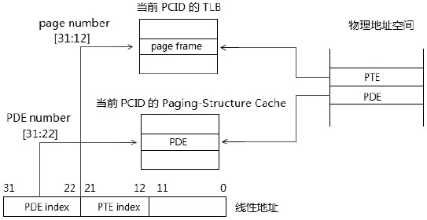
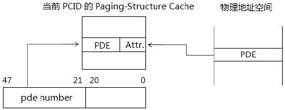
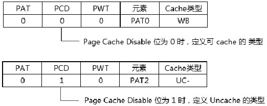
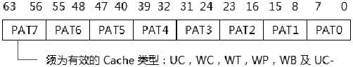

- 1 概述
    - 1.1 IA-32e paging模式下的Paging-Structure Cache
        - 1.1.1 PML4E cache
        - 1.1.2 PDPTE cache
        - 1.1.3 PDE cache
    - 1.2 PAE Paging模式下的Paging-Structure Cache
        - 1.2.1 PAE paging模式的PDE cache
    - 1.3 32位paging模式下的Paging-Structure Cache
- 2 Paging-Structre Cache的使用
    - 2.1 使用TLB entry
        - 2.1.1 使用PDE-cache entry
        - 2.1.2 当查找不到对应的PDE-cache entry时
    - 2.2 使用PDPTE-cache entry
    - 2.3 使用PML4E-cache entry
- 3 Page的内存cache类型
    - 3.1 检测是否支持PAT功能
    - 3.2 PAT（Page Attribute Table）
        - 3.2.1 默认的PAT
        - 3.2.2 PCD（Page Cache Disable）标志位
        - 3.2.3 PWT（Page Write Through）标志位
    - 3.3 PAT MSR
    - 3.4 各级table entry的PCD及PWT标志
- 4 页的保护措施
    - 4.1 访问权限位U/S的检查
        - 4.1.1 U/S权限位的判定
    - 4.2 读写权限位R/W的检查
        - 4.2.1 R/W权限位的判定
    - 4.3 执行权限位XD的检查
        - 4.3.1 XD权限位的判定
    - 4.4 缺页保护P标志位的检查
        - 4.4.1 P标志位的判定
    - 4.5 保留位的检查

# 1. 概述

在Intel64中可以实现另一种Cache计数，处理器可以选择支持或不支持这种Cache。

Paging-structure Cache是与LTB互补的：
- TLB是cache线性地址对应的page frame
- Paging-structure cache是cache页转换表中除page frame外的其他table entry



上面这个图揭示了处理器在32位paging模式下进行TLB entry和Paging-Structure Cache entry建立的示意，在32位paging模式下，当前PCID值为000H（PCID功能只能用于IA-32e模式下）。

在Paging-Structure Cache里可以建立3种table entry的cache entry。
1. PML4E cache entry：只使用于IA-32e paging模式下。
2. PDPTE cache entry：只使用于IA-32e paging模式下，PAE paging模式的PDPTE是在PDPTE寄存器里cache。
3. PDE cache entry：可以使用在32位paging、PAE paging和IA-32e paging模式下。

Paging-Structure Cache只对Paging-Structure进行Cache，因此如上图所示，在32位paging模式下如果PDE是指向最终的4M page frame，那么不存在对PDE的cache，而是在TLB entry里对PDE进行cache。

## 1.1 IA-32e paging模式下的Paging-Structure Cache

在IA-32e paging模式下，处理器会对PML4E、PDPTE即PDE进行cache，依赖于page size。
1. 当使用4K页映射时，将对PML4E，PDPTE即PDE进行cache。
2. 当使用2M页映射时，将对PML4E和PDPTE进行cache（此时PDE指向page frame）。
3. 当使用1G页映射时，将对PML4E进cache（此时PDPTE指向page frame）。

下面这个图对PML4E、PDPTE和PDE cache进行了概括。


按照图中的理解，似乎在Paging-Structure Cache中分别存在PML4E-cache、PDPTE-cache和PDE-cache结构，Intel64手册中并没有明确表明。

### 1.1.1 PML4E cache

如下图所示，处理器对线性地址的[47:39]作为pml4e number（Intel手册上没有pml4e number术语）在当前PCID下的Paging-Structure Cache对应的entry里建立PML4E cache entry。


PML4E cache entry包括下一级PDPT的物理基地址和相关的属性，这个属性包括：
1. R/W标志
2. U/S标志
3. XD标志
4. PCD和PWT标志

这些标志位直接来自于内存中的PML4E结构里，同TLB的情形一致，首次成功访问的PML4E能在Paging-Structure Cache里建立PML4E-cache entry，PML4E的P标志和A标志必定为1。访问失败（访问权限、读写权限和执行权限不能通过，保留位检查失败，以及P=0）是不会建立PML4E-cache entry的。

### 1.1.2 PDPTE cache

处理器使用线性地址[47:30]作为pdpte number（Intel手册中无此术语），在对应的当前PCID下的paging-structure Cache entry里建立PDPTE-cache entry，如下图所示。


PDPTE-cache entry里提供PDT的物理基地址，它的属性包括：
1. R/W标志，它的最终取值是PDPTE的R/W与PML4E的R/W进行与操作。
2. U/S标志，它的最终取值是PDPTE的U/S与PML4E的U/S进行与操作。
3. XD标志，它的最终取值是PDPTE的XD与PML4E的XD进行或操作。
4. PCD和PWT标志，来自于内存中的PDPTE结构。

我们可以看出，这同样出于“从严”的策略。同样，处理器对首次成功访问的PDPTE建立PDPTE-cache entry。
当使用1G页面时，PDPTE指向page frame，此时PDPTE不会被cache。

### 1.1.3 PDE cache

处理器使用线性地址[47:21]作为pde number（Intel手册中无此术语），在对应的当前PCID下的Paging-Structure Cache entry里建立PDE-cache entry，如下图所示。



PDE-cache entry提供PT的物理基地址，它的属性包括：
1. R/W标志，它的最终取值是PDE的R/W与PML4E及PDPTE的R/W进行与操作。
2. U/S标志，它的最终取值是PDE的U/S与PML4E及PDPTE的U/S进行与操作。
3. XD标志，它的最终取值是PDE的XD与PML4E及PDPTE的XD进行或操作。
4. PCD和PWT标志，来自于内存中的PDE结构。

处理器对首次成功访问PDE建立PDE-cache entry，当使用2M页时，PDE指向page frame，它将不会被cache。

> 思考一下，每个PML4E-cache entry将维护512G的地址空间，每一个PDPTE-cache entry将维护1G的地址空间，每个PDE将维护2M的地址空间。

PML4E-cache entry更新的频率很低，PDPTE-cache entry也不会经常更新。

## 1.2 PAE Paging模式下的Paging-Structure Cache

PAE paging模式里的4个PDPTE被加载到PDPTE寄存器里。导致PAE paging模式里只有PDE-cache。

### 1.2.1 PAE paging模式的PDE cache

处理器使用32位线性地址中的[31:21]作为pde number（Intel手册中无此术语），在PCID=000H的Paging-Structure Cache里建立相应的PDE-cache entry，如下图所示。


当PDE指向最终的page frame时，PDE-cache entry也不会被建立，实际上就没有Paging-Structure Cache了。因此，在PAE paging模式只有在使用4K页面下处理器才会建立PDE-cache entry。

PDE-cache entry提供了PT的物理基地址，PDE-cache entry的属性来自内存中PDE结构，属性包括：
1. R/W标志
2. U/S标志
3. XD标志
4. PCD和PWT标志

由于PAE paging模式的PDPTE不存在R/W、U/S及XD标志。因此这些属性来自PDE结构。

## 1.3 32位paging模式下的Paging-Structure Cache

32位paging模式下只有PDE-cache entry要被建立，如果PDE指向page frame，PDE-cache entry也不会被建立。因此，在32位paging模式下只有使用4K页面才会建立PDE-cache entry。


处理器使用32位线性地址的[31:22]作为pde number在对应的PCID=000H下的Paging-Structure Cache里建立PDE-cache entry。

PDE-cache entry提供PT的物理地址，PDE-cache entry的属性来自内存中PDE结构，属性包括：
1. R/W标志。
2. U/S标志。
3. PCD和PWT标志。

在32位paging模式下不支持Execution Disable功能，因此不存在XD标志。

# 2. Paging-Structre Cache的使用

处理器根据不同的page size建立不同的TLB entry和Paging-Structure Cache entry，在线性地址转换为物理地址的过程中，处理器会进行以下的转换。

处理器在访问内存时寻找目标page frame有严格的先后查找次序：
1. 在TLB里查找page frame的信息，找到就直接访问内存。
2. 当在TLB miss时，在Paging-Structure Cache里逐级从PDE-entry、PDPTE-entry及PML4E-entry里查找。
3. 在Paging-Structure Cache里页找不到时，就只好老老实实在内存里walk下去。

Paging-Structure Cache的作用和目的是：尽量减少在内存中的查找步骤，能省多少就省多少。

## 2.1 使用TLB entry

处理器使用不同宽度的线性地址page number在当前PCID（不支持时，PCID=000H）或global PCID下查找对应的TLB entry。

当找到对应的TLB entry时，处理器使用TLB entry中的page frame地址加上线性地址的page offset得到最终的物理地址。

当处理器查找不到对应的TLB entry时，使用Paging-Structure Cache entry进行转换，情形如下。

### 2.1.1 使用PDE-cache entry

当处理器没有查找到TLB entry时，使用线性地址的PDE Number在当前PCID（不支持时为000H）来查找对应的PDE-cache entry。

如前所述，PDE number在IA-32e paging模式下是线性地址的[47:21]位，在PAE paging模式下是线性地址的[31:21]位，在32位paging模式下是线性地址的[31:22]位。

当找到对应的PDE-cache entry时，处理器使用PDE-cache entry里的物理地址在物理地址空间定位PT，在使用线性地址的PTE index在PT里获得PTE表项，得到最终的page frame。

PTE index在32位paging模式下是线性地址的[21:12]位，在IA-32e paging和PAE paging模式下是线性地址的[20:12]位。

> 注意：需要使用到PDE-cache entry时，必定是使用4K页面来映射。

当找到PDE-cache entry时，此时是使用4K页面映射，而使用2M、4M和1G页面的映射方式并不存在PDE-cache entry。

### 2.1.2 当查找不到对应的PDE-cache entry时

在32位paging模式和PAE模式下，在查找不到对应的TLB entry和PDE-cache entry的情况下，处理器使用原始的方式，在内存中的各个table里进行walk，直到查找到最终的page frame。
1. 在PAE paging模式下，线性地址的[31:30]对应一个PDPT寄存器，在PDPTE寄存器里得到PDT，线性地址的[29:21]对应一个PDE项，PDE.PS=1时指向2M page frame，否则得到PT。线性地址的[20:12]对应一个PTE，得到最终的4K page frame。
2. 在32位paging模式下，线性地址的[31:22]对应一个PDE，PDE.PS=1时指向4M page frame，否则得到PT，线性地址的[21:12]对应一个PTE，得到最终的4K page frame。

在正确得到page frame后，处理器会进行TLB entry和PDE-cache entry的建立。

## 2.2 使用PDPTE-cache entry

在IA-32e paging模式下，在查找不到对应的TLB entry和PDE-cache entry时，处理器继续使用线性地址的[47:30]作为pdpte number在当前PCID下查找PDPTE-cache entry。

当找到对应的PDPTE-cache entry时，处理器使用PDPTE-cache entry里的物理地址在物理地址空间里定位PDT，再walk下去直到得到最终的page frame。

## 2.3 使用PML4E-cache entry

在IA-32e paging模式下，在查找不到对应的TLB entry、PDE-cache entry以及PDPTE-cache entry时，处理器继续使用线性地址的[47:39]作为pml4e number在当前PCID下查找PML4E-cache entry。

当找到对应的PML4E-cache entry时，处理器使用PML4E-cache entry里的物理地址在物理地址空间里定位PDPT，在walk下去直到得到最终page frame。

> 思考一下，Paging-Structure Cache的引进，是为了尽量减少在内存中walk的步骤，从而提供页转换的效率。

在Intel64上Paging-Structure Cache依赖于处理器的实现，在软件层上无需关注处理器是否实现。

# 3. Page的内存cache类型

在x86/x64里可以为一个物理地址区域定义一个内存的cache类型，每个cache类型对应一个值。在intel处理器上这个cache类型可以为一下类型。

值 | cache类型
---|---
00H | Uncacheable（UC）
01H | WriteCombining（WC）
02H | 保留
03H | 保留
04H | WriteThrough（WT）
05H | WriteProtected（WP）
06H | WriteBack（WB）
07H | Uncache（UC-）
08-FFH | 保留

定义一个物理地址区域的cache类型，可以使用以下两种方法。
1. 使用MTRR来定义
2. 使用page的PAT、PCD与PWT标志来定义

使用MTRR可以对Fixed-range和Variable-rangge进行定义。

## 3.1 检测是否支持PAT功能

使用CPUID.01H:EDX[16].PAT位来检测处理器是否支持PAT功能，在不支持PAT功能的处理器上将使用默认的cache类型。

在支持PAT功能后，可以在指定最终page frame的table entry（即PTE或PDE.PS=1时的PDE，或者PDPTE.PS=1时的PDPTE）的PAT位置位，开启Page Attribute Table定义。

## 3.2 PAT（Page Attribute Table）

PAT由8个元素构成，分别为PAT0到PAT7，如下表所示。

PAT | PCD | PWT | 元素
---|---|---|---
0 | 0 | 0 | PAT0
0 | 0 | 1 | PAT1
0 | 1 | 0 | PAT2
0 | 1 | 1 | PAT3
1 | 0 | 0 | PAT4
1 | 0 | 1 | PAT5
1 | 1 | 0 | PAT6
1 | 1 | 1 | PAT7

上表中的PAT、PCD和PWT对应于page的PAT、PCD和PWT标志位，由这三个标志位组合为0到7的数值，对应一个PAT元素。
 
### 3.2.1 默认的PAT

处理器在上电或reset后，PAT内的元素使用默认的内存cache类型。

元素 | Cache类型
---|---
PAT0 | WB
PAT1 | WT
PAT2 | UC-
PAT3 | UC
PAT4 | WB
PAT5 | WT
PAT6 | UC-
PAT7 | UC

- 不支持PAT功能时，使用PCD和PWT标志组合成2位的值0 ~ 3，对应于PAT的PAT0到PAT3元素。
- 当支持PAT功能时，可以使用WRMSR指令修改默认PAT中的cache类型。

### 3.2.2 PCD（Page Cache Disable）标志位

PCD标志位指示page是否被cache，如下图所示。



在默认的PAT里，PCD=0时，定义可被cache的类型。PCD=1时，定义uncache（不可cache）类型，此时根据PWT标志确定属于US-（弱）还是UC（强）。

### 3.2.3 PWT（Page Write Through）标志位

PWT标志位指示page是WriteThrough还是WriteBack的cache类型，如下图所示。


## 3.3 PAT MSR

在MSR中提供一个64位的IA32\_PAT寄存器用来定义PAT，如下图所示。



IA32\_PAT寄存器的每个字节对应一个PAT元素，所定义的Cache类型必须是有效的cache类型（保留的必须为0值）。
如前面所述，在处理器power-up或reset时，这个IA32\_PAT里的元素可以使用默认的cache类型。

IA32\_PAT寄存器的地址是277H，软件可以在0级权限下使用WRMSR指令对IA32\_PAT寄存器进行重新设置。

## 3.4 各级table entry的PCD及PWT标志

PAT标志只适用于page frame上，而PCD和PWT标志可以使用在所有的table entry结构和CR3里。因此有下面的关系。
1. CR3里的PCD和PWT标志控制PML4T的cache类型（IA-32e paging模式下），以及PDT的cache类型（32位paging模式下）。
2. 在PAE paging模式下，PDPTE在PDPTE寄存器里保存，因此无须对PDPT进行cache。
3. 在IA-32e paging模式下，PML4E的PCD和PWT控制PDPT的cache类型。
4. 在IA-32e paging模式下，PDPTE的PCD和PWT控制PDT的cache类型。如果是1G页面映射的，PDPTE的PAT、PCD、PWT将控制1G page frame的cache类型。
5. 在PAE paging模式下，4个PDPTE寄存器分别控制PDT的cache类型。
6. PDT的PCD和PWT标志控制PT的cache类型。如果是2M或4M页面映射的，PAT、PCD、PWT将控制page frame的cache类型。
7. 最后，PTE的PAT、PCD、PWT标志将控制4K page frame的cache类型。

值得注意的是它们三者的排列组合必须严格按照上面的PAT所示、PAT，PCD再到PWT标志。

# 4. 页的保护措施

在paging里，处理器会对访问各级table entry及最终的page frame进行以下的检查。 
- 访问权限位U/S的检查
- 读/写权限位R/W的检查
- 执行权限位XD的检查
- 缺页保护位P的检查
- 保留位的检查

## 4.1 访问权限位U/S的检查

各级table entry的U/S标志组合起来最终决定了page frame的访问权限。
- U/S=0时，属于Supervisor访问权限
- U/S=1时，属于User访问权限

对于一个page frame进行读/写访问时，U/S=0时，只能在CPL=0、1或2级权限下访问。U/S=1时CPL可以在任何权限级别下进行访问。

对于一个page frame进行执行访问时，U/S=0时，只能在CPL=0、1或2级权限下执行。U/S=1时依赖于SMEP功能是否开启，当CR4.SMEP=1时，只能在CPL=3级权限下执行。CR4.SMEP=0时（或不支持SMEP时），CPL可以在任何权限级别下执行。

### 4.1.1 U/S权限位的判定

一个page frame的最终U/S由各级table entry的U/S进行组合，page frame的访问权限。

- 在IA-32e paging模式下的4K页面映射
```
Page_frame.U/S = PML4E.U/S & PDPTE.U/S & PDE.U/S & PTE.U/S
```
由PML4E、PDPTE、PDE，以及PTE的U/S进行AND操作，得出最终4K page frame的U/S标志位值。

- 在IA-32e paging模式下的2M页面映射
```
Page\_frame.U/S = PML4E.U/S & PDPTE.U/S & PDE.U/S
```
由PML4E、PDPTE，以及PDE的U/S进行AND操作，得出最终2M page frame的U/S值。

- 在IA-32e paging模式下的1G页面映射
```
Page_frame.U/S = PML4E.U/S & PDPTE.U/S
```
由PML4E和PDPTE的U/S标志进行AND操作，得出最终的1G page frame的U/S值。

- 在PAE paging和32位paging模式下的4K页面映射
```
Page_frame.U/S = PDE.U/S & PTE.U/S
```
由PDE和PTE的U/S标志进行AND操作，PAE模式下PDPTE不存在U/S标志位。

- 在PAE paging模式和32位paging下的2M和4M页面映
```
Page_frame.U/S = PDE.U/S
```
2M和4M页面page frame的U/S来自于PDE里的U/S值。

## 4.2 读写权限位R/W的检查

各级table entry的R/W标志位组合起来决定了最终page frame的读/写权限。
- R/W=0时，page frame是Read-Only（只读的）
- R/W=1时，page frame是Read/Write（可读写的）

在任何权限下可以对读/写的页进行写操作。当R/W=0时，在CPL=3级权限下，不能对page frame进行写操作。在CPL=0、1或2级权限下，依赖于是否开启CR0.WP（Write Protection）功能。当CR0.WP=1时，Supervisor权限也不能对Read-Only页进行写操作。当CR0.WP=0时，Supervisor可以对Read-Only页进行写操作。

### 4.2.1 R/W权限位的判定

R/W标志位与U/S标志位所遭遇的情形一致。上面所描述的U/S权限位的判定方式适合于R/W标志位。

## 4.3 执行权限位XD的检查

在PAE paging模式和IA-32e paging模式下，可以使用XD标志位来限制对page frame的执行。在32位paging模式下page frame总是被允许执行的。
- XD=1时，page frame不能被执行
- XD=0时，page frame允许执行

IA32\_EFER.NXE控制Execution Disable功能的开启，IA32_EFER.NXE=1时，XD标志位有效。否则为保留位，必须为0值。

当IA32\_EFER.NXE=1并且XD=1时的page frame不能执行，否则page frame被允许执行。page frame的执行检查，还依赖于前面所述的CR4.SMEP控制位。

在XD=0的前提下，CR4.SMEP=1时，在CPL=0、1或2级权限下不能执行User权限的page frame，当CR4.SMEP=0时，允许Supervisor对User的page frame执行。

### 4.3.1 XD权限位的判定

同样，page frame的XD值由各级table entry的XD标志组合起来决定。

- 在IA-32e paging模式下的4K页面映射
```
Page_frame.XD = PML4E.XD | PDPTE.XD | PDE.XD | PTE.XD
```
由PML4E、PDPTE、PDE，以及PTE的XD进行OR操作，得出最终4K page frame的XD标志位值。

- 在IA-32e paging模式下的2M页面映射
```
Page_frame.XD = PML4E.XD | PDPTE.XD | PDE.XD 
```
由PML4E、PDPTE，以及PDE的XD进行OR操作，得出最终2M page frame的XD值。

- 在IA-32e paging模式下的1G页面映射
```
Page_frame.XD = PML4E.XD | PDPTE.XD 
```
由PML4E和PDPTE的XD标志进行OR操作，得出最终的1G page frame的XD值。

- 在PAE paging模式下的4K页面映射
```
Page_frame.XD = PDE.XD | PTE.XD 
```
由PDE和PTE的XD标志进行OR操作。

- 在PAE paging模式的2M页面映射
```
Page_frame.XD = PDE.XD 
```
2M page frame的XD来自于PDE里的XD值。

由上面的page frame XD值来看，只要有任何一级table entry的XD为1时，所对应的page frame就是不可执行的。

## 4.4 缺页保护P标志位的检查

同样，各级table entry的P标志位组合起来决定了最终page是否被提交到物理地址空间中。
- P=0时，不存在内存中
- P=1时，已在内存中

处理器对访问P=0的page frame会产生#PF异常。

### 4.4.1 P标志位的判定

在线性地址的访问中，仅当在转换物理地址过程中所有table entry的P=1时，页的转换才是成功的。
这与U/S标志及R/W标志位所遭遇的情形是一致的，也就是所有table entry的P标志位进行与操作。

## 4.5 保留位的检查

当各级table entry的保留位不为0时，table entry是无效的，会产生#PF异常。

关注下列table entry中的保留位。
1. 32位paging模式下的4M页面的PDE结构保留位
2. PAE paging模式下的2M页面的PDE结构保留位
3. PAE paging模式下的4K页面的PDE结构保留位
4. PAE paging模式下的PTE结构保留位
5. IA-32e paging模式下PML4E结构保留位
6. IA-32e paging模式下1G页面PDPTE结构保留位
7. IA-32e paging模式下4K/2M页面PDPTE结构保留位
8. IA-32e paging模式下2M页面PDE结构保留位
9. IA-32e paging模式下4K页面PDE结构保留位
10. IA-32e paging模式下的PTE结构保留位。

在这些保留位检查中，许多table entry的保留位依赖于MAXPHYADDR值。
- 当MAXPHYADDR为36时，table entry的[51：36]为保留位
- 当MAXPHYADDR为40时，table entry的[51：40]为保留位
- 当MAXPHYADDR为52时，table entry的[51：12]为有效位

当IA32_EFER.NXE=1时，bit63是XD标志位，否则为保留位，须为0值。

下面的保留位检查将产生#GP异常。
- PAE paging模式下的PDPTE结构保留位
- CR3结构中的保留位