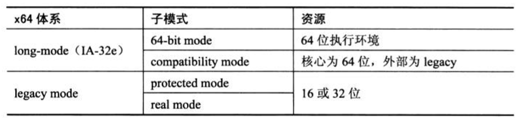

- 1 概述
    - 1.1 x64体系
    - 1.2 long-mode与IA-32e模式
    - 1.3 legacy模式
    - 1.4 64位模式与compatibility模式
- 2 x64体系的设计原则
    - 2.1 兼容性
    - 2.2 在64位系统上执行legacy代码
    - 2.3 编译器的职责

# 1. 概述

## 1.1 x64体系

x86-64系统是由AMD提出和实现的，在原x86的32位基础上扩展为64位技术。
现在x86-64常被称为x64，以区别于原来的x86体系。
AMD64架构被AMD用来标榜它的x64架构，Intel虽然接纳和使用了x64，但现在称自己的x64实现为intel64架构，以区别与AMD64。

上表显示了x64体系中的两大模式：long-mode（IA-32e）与legacy模式，下面还可以区分两个子模式。
当然并没有将virtual 8086模式与SMM模式归纳进去。

## 1.2 long-mode与IA-32e模式

在x64体系中最重要的就是引入了long-mode，long-mode的开启使得处理器可以进入64位的执行环境。
在Intel64中，long-mode被称为IA-32e模式，它们是指同一事物。
虽然是同一事物，实现上还是有细微的区别，但并不影响整体架构的兼容。

## 1.3 legacy模式

相对long-mode来说，在x86上原有的实模式和保护模式被统称为legacy模式。
实际上被称为legacy x86 mode或许更能说明问题，本质上long-mode也是属于protected mode（保护模式）的扩展。

## 1.4 64位模式与compatibility模式

在long-mode下有两个子模式：64位模式和compatibility模式。
在64位模式里处理器处于64位的执行环境。
compatibility模式比较特别，这也是x64成功之处。
从OS的角度看，核心使用64位执行环境，外部对于应用程序接口使用legacy模式。
怎么理解这个现象呢？

在compatibility模式下部分系统数据结构还是64位环境。
GDTR与IDTR的值不变，GDTR.base与IDTR.base仍使用64位值。
GDT与IDT中的gate描述符仍是64位结构。
运行在compatibility模式的代码当发生异常或者使用中断调用，代码必须切换到64位模式运行。

在compatibility模式下，有效的线性地址属于legacy模式下的32位。
处理器仍使用64位的paging结构（IA-32e paging）进行页转换。

# 2. x64体系的设计原则

由于是在x64上扩展为64位技术，在x64的设计上的两个原则是：
- 照顾兼容性
- 在long-mode里能够平滑无缝地兼容执行legacy模式的代码

它们是x64体系最为成功的地方。

## 2.1 兼容性

在支持x64结构的处理器上，软件可以选择使用legacy模式（即原来的x86模式），也可以开启long-mode进入64位的环境。

## 2.2 在64位系统上执行legacy代码

进入了64位模式和compatibility模式，使得在一个全新设计的64位OS系统里可以平滑地执行原有的32位代码或16位代码。

如上所示，在legacy模式下code segment descriptor的bit 21是保留位，当开启long-mode后，处理器对bit 21的解释为L标志位。

在x64体系里利用这个bit 21来切换64位模式和compatibility模式：
- 当L=1时进入64位模式。
- 当L=0时进入compatibility模式。

在一个64位的OS系统设计里，系统的核心执行模块时运行于64位模式的，64位的用户软件执行再64位模式，
而legacy用户软件执行再compatibility模式。

对于64位的代码来说，它的code描述符的bit 21为1；对于legacy模式的代码来说，它的code描述符的bit 21为保留位（L=0）。
因此，在OS系统加载目标软件执行时处理器自动进行切换，将进入64位模式执行64位代码还是进入compatibility模式执行legacy代码。

## 2.3 编译器的职责

在64位的系统上，通常编译器还是可以为源代码选择编译为32位还是64位，从而分别为它们链接到32位或64位的库。

