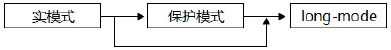
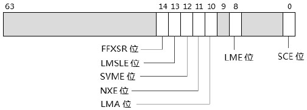
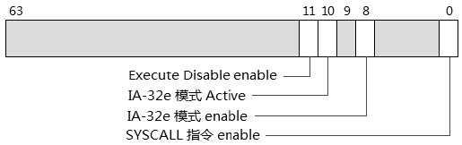
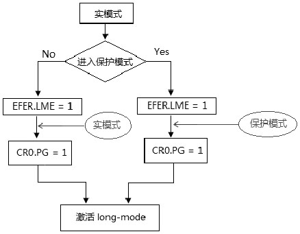

- 1 概述
    - 1.1 检测处理器是否支持long-mode
    - 1.2 EFER寄存器
        - 1.2.1 SCE（System-Call Extension）位
        - 1.2.2 LME（Long Mode Enable）位
        - 1.2.3 LMA（Long Mode Active）位
        - 1.2.4 NXE（No-Exectue Enable）位
        - 1.2.5 SVME（Secure Virtual Machine Enable）位
        - 1.2.6 LMSLE（Long Mode Segment Limit Enable）位
        - 1.2.7 FFXSR（Fast FXSAVE/FXRESTOR）位
- 2 进入long-mode的必要条件
    - 2.1 long-mode的enable与active
    - 2.2 进入long-mode的制约条件
- 3 实验：从实模式直接转入到long-mode

# 1. 概述

在支持AMD64或Intel64架构的处理器上，可以选择不同的进入long-mode途径，如下所示。



从实模式中先切换到保护模式，在切换到long-mode。也可以直接从实模式切换到long-mode。
无论怎样进入long-mode都应该重新设置long-mode的执行环境。

## 1.1 检测处理器是否支持long-mode

能进入long-mode的首要条件是处理器必须支持long-mode，要检测到是否支持long-mode，我们使用下面的示例代码。

```asm
; support_long_mode():检测是否支持long-mode
; ouput: 1 support, 0 no support

support_long_mode:
    mov eax, 80000000H
    cpuid
    cmp eax, 80000001H      ; 检测是否支持80000001H leaf
    setnb al
    jb suport_long_mode
    mov eax, 80000001H
    cpuid
    bt edx, 29              ; long mode support bit
    setc cal
    
support_long_mode_done:
    movzx eax, al
    ret 
```
在这个检测中，我们必须先检测处理器是否支持CPUID的扩展leaf（使用80000000H leaf来检测所支持的最大扩展leaf号），
在支持80000001H leaf的情况下检测80000001H leaf的bit29（long-mode的support位）是否为1值。

## 1.2 EFER寄存器

为了支持long-mode，AMD引入了EFER（Extended Feature Enable Register）寄存器，EFER寄存器是MSR寄存器（地址在C0000080H），如下所示。



AMD的EFER寄存器不仅是为了支持long-mode模式而引进，还负责开启AMD SVM（Secure Virtual Machine）技术。

### 1.2.1 SCE（System-Call Extension）位

设置这个位将开启Syscall/Sysret指令，这对指令时AMD用来在long-mode里替换Sysenter/Sysexit指令的，它们作用是一样的。

### 1.2.2 LME（Long Mode Enable）位

对这个位置位将开启long-mode，但long-mode的active（激活）还需要依赖于paging的开启。

### 1.2.3 LMA（Long Mode Active）位

这是位是只读位，它由处理器自动维护。当LME=1时，对CR0.PG进行置位，将使处理器对LMA置位，表明处理器处于long-mode下。

### 1.2.4 NXE（No-Exectue Enable）位

置位时，允许软件设置page table entry的NX（bit 63）标志，否则各table entry的bit63为保留位。

### 1.2.5 SVME（Secure Virtual Machine Enable）位

置位将开启AMD的SVM技术。

### 1.2.6 LMSLE（Long Mode Segment Limit Enable）位

由于在long-mode的64位模式下，处理器不会对各个segment的limit进行检查。
在AMD64下，允许置LMSLE位，开启在非0级权限下对data segment（DS、ES、FS、SS段）进行段界限检查，然而这个段界限检查不包括CS和GS段，以及CPL=0的情况。
这个标志位在Intel64中不存在。

### 1.2.7 FFXSR（Fast FXSAVE/FXRESTOR）位

在AMD64下，对这个位置位允许在64位模式的CPL=0权限下执行FXSAVE和FXRSTOR指令无须保存XMM0到XMM15寄存器的状态值。

在Intel64架构下，EFER寄存器被称为IA32\_EFER寄存器，然而与AMD64的EFER寄存器有些区别，如下所示。



我们看到，IA32\_EFER寄存器并没有LMSLE位，表明Intel处理器在64位模式下没有开启段界限检查的功能，同时也没有快速的FXSAVE/FXRSTOR功能。

# 2. 进入long-mode的必要条件

前面提过，long-mode实际上是扩展的保护模式。因此，开启long-mode必须要开启保护模式。进入long-mode必须要：
1. CR0.PE=1，开启保护模式。
2. CR4.PAE=1，开启PAE（Physical Address Extension）模式。
3. CR0.PG=1，开启paging机制。

Long-mode必须开启PAE模式的分页机制（形成long-mode下的分页模式）。
在Intel64中，被称为IA-32e paging模式。

## 2.1 long-mode的enable与active

当EFER.LME=1（或IA32\_EFER.LME=1）时，处理器开启long-mode，然而在EFER.LMA=0（或IA32\_EFER.LMA=0）时，这个long-mode是不可用的，必须开启paging机制后，long-mode才被激活（可用）。



如上所示，从实模式里直接进入long-mode，在long-mode开启但未active（激活时），即在开启分页机制（CR0.PG=1）前，处理器还是处于实模式状态。同样，在从保护模式进入long-mode，未激活时（开启分页机制前），处理器还是处于保护模式状态。
直到CR0.PG=1后，long-mode被激活，处理器真正处于long-mode下。

```c
    if (IA32_EFER.LMA == 1) {
        // 处于long-mode下
    } else {
        // 非long-mode下
    }
```

如上所示，在一个判断是否处于long-mode的逻辑里，只能通过EFER.LMA标志进行判断，从EFER.LME标志判断就显得不够严谨。

## 2.2 进入long-mode的制约条件

由于long-mode存在enable与active的情况，这就产生了进入long-mode的一些制约条件：
1. long-mode被激活，必须开启paging机制（CR0.PG=1）。
2. 在开启paging机制前，必须先开启PAE模式（CR4.PAE=1）。
3. 在开启paging机制前，必须先开启（或者同时开启）保护模式（CR0.PE=1）。
4. 在开启paging机制（long-mode激活）前，必须先开启long-mode的enable（IA32\_EFER.LME=1）。

因此，最后一步必须是对CR0.PG置位（或者同时对CR0.PE置位），而开启PAE模式必须在开启分页机制之前进行，下面是典型的流程。

```c
    if (CR0.PG == 1) {
        CR0.PG = 0;         // 先关闭paging模式
    }
    
    init_page();            // 初始化long-mode的页表结构
    CR3 = PML4T_BASE;       // 加载CR3寄存器
    
    CR4.PAE = 1;            // 开启PAE模式
    EFER.LME = 1;           // long-mode的enable位
    
    if (CR0.PE == 0) {
        CR0.PE = 1;         // 开启保护模式
    }
    
    CR0.PG = 1;             // 开启paging模式，激活long-mode
```

当然，实际上会比上面的流程复杂的多，从保护模式进入long-mode的情况下，如果已经启用paging机制，那么必须先关闭paging机制，这是由于上面所说的制约条件（在CR0.PG=1前，必须先开启EFER.LME=1）。否则将会产生#GP异常。

# 3. 实验：从实模式直接转入到long-mode

```asm
    cli                         ; 关闭中断
    NMI_DISABLE                 ; 关闭NMI
    
    ; 测试是否支持long-mode
    call support_long_mode
    test eax, eax
    jz no_support
    
    ; 加载GDTR
    db 66h                      ; 使用32位的operand size
    lgdt [GDT_POINTER]
    
    ; 开启PAE
    mov eax, cr4
    bts eax, 5                  ; CR4.PAE = 1
    mov cr4, eax
    
    ; 初始化long-mode页表结构
    call init_page
    
    ; 加载CR3寄存器
    mov eax, 5000H              ; PML4T表基地址放在0x5000位置上
    mov cr3, eax
    
    ; 开启long-mode
    mov ecx, IA32_EFER
    rdmsr
    bts eax, 8                  ; IA32_EFER.LME = 1
    wrmsr
    
    ; 使用实模式下的中断打印信息
    mov si, msg0
    call puts
    
    ; 加载long-mode的IDT表
    db 66h
    lidt[IDT_POINTER]
    
    ; 开启PE和paging（激活long-mode）
    mov eax, cr0
    bts eax, 0                  ; CR0.PE = 1
    bts eax, 31                 ; CR0.PG = 1
    mov cr0, eax                ; IA32_EFER.LMA = 1
    
    jmp 28h:entery64            ; 转入64位代码

no_support:
    mov si, msg1
    call puts
    jmp $
    
    ; 以下是64位模式代码
    bits 64

entry64:
    mov ax, 30h                 ; 设置data segment
    mov ds, ax
    mov es, ax
    mov ss, ax
    mov esp, 7FF0j
    mov esi, msg2
    call puts64
    jmp $
```

上面代码是运行在模式下，切换到long-mode。这里的典型流程如下：
1. 加测处理器是否支持long-mode。
2. 加载GDT和IDT。
3. 开启PAE模式
4. 初始化long-mode的页转换表结构。
5. 加载CR3寄存器。
6. 开启long-mode。
7. 同时开启保护模式和paging机制，激活long-mode。

在这个实验里，我们并没有进入保护模式，而是直接从实模式进入long-mode。
然而这个long-mode执行环境并不是最终的，当进入long-mode后，我们应该在long-mode进行最终的执行环境设置。