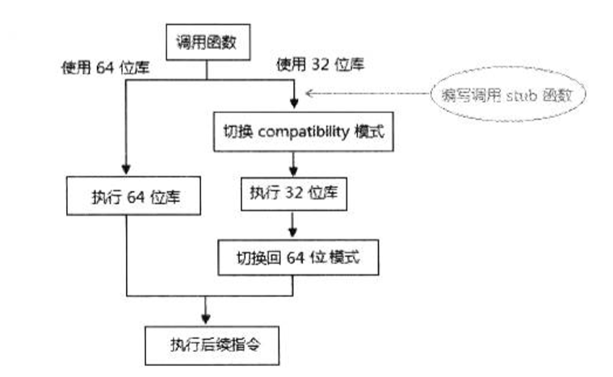
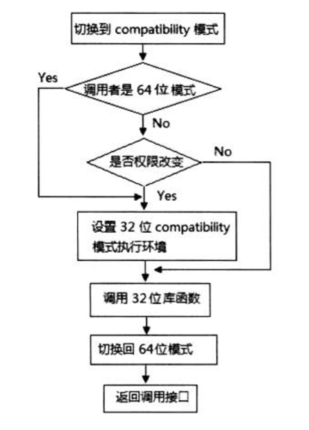

- 概述
- 1 64位模式切换到compatibility模式
    - 1.1 照顾通用性
- 2 compatibility模式切换到64位模式
- 3 利用compatibility模式执行legacy的库函数
    - 3.1 提供调用的接口
    - 3.2 实现调用stub函数
    - 3.3 定义调用宏

# 概述

在long-mode里，处于某些考虑，可能需要从64位模式切换到compatibility模式进行相关处理。
除了兼容legacy模式代码外，切换到compatibility模式有时是很有用途的。

# 1. 64位模式切换到compatibility模式

在前面已提及，要退出long-mode必须先切换到compatibility模式。要切换到compatibility模式，我们需要提供一个far pointer来加载compatibility模式的Code Segment描述符。这个far pointer必须以间接形式给出，在64位模式下不允许使用直接far pointer（即JMP 16:32直接在指令里给出far pointer）。

```asm
    jmp far [compatibility_pointer]
compatibility_pointer:
    dq compatibility_entry              ; compatibility代码入口点
    dw compatibility_selector           ; compatibility模式的CS selector
```
上面代码使用远程的jmp指令提供compatibility模式的far pointer切换到compatibility模式，这是一个典型的示例。

## 1.1 照顾通用性

在nasm编译器里，会将jmp far [compatibility_pointer]这条指令编译为64位的操作数。
实际上nasm是不合理的，因为远程的jmp指令默认操作数是32位！
如果需要明确使用64位操作数，应该需要如下这样。

```asm
    jmp QWORD far [compatibility_pointer]       ; 提供显示的QWORD指示字
```
在Intel64平台上支持80位（16:64）的far pointer形式。因此，这个compatibility_entry值是64位的。

然而，在AMD64平台的64位模式里最大只能支持48位（16:32）的far pointer形式，因此，在AMD64平台上这个compatibility_entry值须设置为32位的。

为了照顾通用性，我们应该明确地使用32位的操作数，上面的示例代码将修改为
```asm
    jmp DWORD far [compatibility_pointer]       ; 强制使用32位的操作数

compatibility_pointer:
    dd compatibility_entry                      ; 32位的入口地址值
    dw compatibility_selector                   ; compatibility模式的CS selector
```
将jmp指令的操作数强制定为32位，那么在Intel64和AMD64平台都能够使用。

# 2. compatibility模式切换到64位模式

相比之下，从compatibility模式切换64位模式则会简单些，在compatibility模式下，我们可以使用direct far jmp（直接远程跳转）指令形式，代码如下。

```asm
    jmp DWORD far 0x28:entry64                  ; 提供直接的far pointer指针
```
这个直接far pointer在64位模式是不支持的，而我们则正好利用compatibility模式下支持的特性，提供目标64位代码的far pointer。
值而的注意的是，这个entry64时32位值，会被零扩展后加载到RIP指针里。

# 3. 利用compatibility模式执行legacy的库函数

如果当需要实现某个功能时，原来32位代码库已经实现了。那么在64位模式下，我们有两个选择：
1. 编写相应的64位版本。
2. 在允许的情况下，重新利用32位的库。



假如选择调用32位的库，那么我们需要切换到compatibility模式执行，执行完32位库后，切换回64位模式。
在这个调用函数的模式切换过程中，最好的办法是实现一个stub函数。

## 3.1 提供调用的接口

我们需要保证任何权限下，典型地如0级kernel代码和3级user代码都能够使用这个机制来调用32位库。
我们可以实现一个调用接口提供给任何权限下使用。

```asm
    mov esi, msg                    ; puts()函数参数
    mov eax, LIB32_PUTS             ; 32位库的函数号，调用puts()函数
    call lib32_service              ; 调用接口函数
```
这段代码在64位模式的0级权限或者3级权限下都能够运行。
这个lib32\_service()函数就是系统提供的调用接口函数，它的内部是调用stub函数。
```asm
    ; lib32_service()：对外接口
    ; input：rax库函数编号
    ; desc：通过call-gate调用实际工作的lib32_service()

lib32_service:
    jmp lib32_service_next

CALL_GATE_POINTER:
    dq 0
    dw call_gate_sel                    ; call-gate的selector

lib32_service_next:
    call DWORD far [CALL_GATE_POINTER]  ; 从64位模式里调用call-gate
    ret
```
接口函数lib32_service()为64为代码而实现。这个函数的核心是使用Call-gate切换到0级的64位stub函数。
使用了call-gate，所以无论在0级还是3级下最终都会来到0级的64位代码。

## 3.2 实现调用stub函数

stub函数是运行在0级的64位模式下的，它将负责：
1. 从64位模式切换到compatibility模式。
2. 调用32位库的具体函数。
3. 从32位库返回后，切换回64位模式。

```asm
__lib32_service()：在64位的代码下使用32位的库函数
input：rax:库函数编号， rsi...相应的函数参数
desc：
1. rax是32位的函数号，类似于系统服务例程的功能号
2. 代码会先切换到compatibility模式调用32位的函数
3. 32位例程执行外部，切换回64位模式
4. 从64位模式中返回调用者
5. lib32_service()函数使用call-gate进行调用

__lib32_service:
    push rbp
    mov rbp, rsp
    push rbx
    push rsi
    push rdi
    
    mov rbx, rax                        ; 功能号
    mov rsi, [rbp + 16]                 ; 读CS Selector
    call read_segment_descriptor
    shr rax, 32
    pop rdi                             ; 恢复函数参数
    pop rsi
    jmp QWORD far [lib32_service_compatibility_pointer] ; 切换到compatibility模式
    
    ; 定义far pointer（为切换到compatibility模式而准备）
    lib32_service_compatibility_pointer:
        dq lib32_service_compatibility
        dw code32_sel
        
    ; 下面为切换回64位模式而定义（32位的入口地址）
    lib32_service_64_pointer:
        dd lib32_service_done
        dw KERNEL_CS
    
lib32_service_compatibility:
    bits 32                         ; 使用32位编译
    
    bt eax, 21                      ; 测试CS.L
    jc reload_sreg                  ; 调用者是64位代码
    shr eax, 13
    and eax, 0x03                   ; 取RPL
    cmp eax, 0
    je call_lib32                   ; 权限不变

reload_sreg:
    ; 重新设置32位compatibility模式环境
    mov ax, data32_sel
    mov ds, ax
    mov es, ax
    mov ss, ax
    mov esp, LIB32_ESP

call_lib32:
    ; 计数目标函数的位置：ebx * 5 + LIB32_SEG得到lib32库函数地址
    lea eax, [LIB32_SEG + ebx * 4 + ebx]
    call eax                                    ; 执行32位例程
    jmp DOWRD far [lib32_serivce_64_pointer]    ; 切换回64位模式
    
    bits 64                                     ; 使用64位编译

lib32_service_done:
    lea rsp, [rbp - 8]
    pop rbx
    pop rbp
    db 0x48
    retf                                         ; 返回到接口函数
```
\_\_lib32\_service()是call-gate的服务例程，经lib32\_service()接口函数调用进入。它将接纳从64位模式的0级或3级调用，以及从compatibility模式里调用。

值得注意的是，它只能在Intel64平台上执行，因为使用了80位（16:64）的far pointer形式，当然我们可以将它改为32位操作数做到通用。

它的工作流程如下所示。



如果是从compatibility模式下的0级权限进行调用，那么就不需要设置目标代码运行的32位compatibility模式环境，否则必须设置compatibility模式的环境。

## 3.3 定义调用宏

为了做得更好，我们可以定义一宏函数，用来包装32库函数的调用，下面是典型的定义。

```asm
    ; 定义32位库puts()函数的调用宏

%macro LIB32_PUTS_CALL 0
    mov eax, LIB32_PUTS             ; 32位库函数号
    call lib32_service              ; 接口函数
%endmacro
```

那么，在我们的64位或者compatibility模式代码里，可以使用下面的方式进行调用。
```asm
    mov esi, msg                    ; puts()函数的参数
    LIB32_PUTS_CALL                 ; 调用32位库函数puts()
```
当然还可以定义得更像宏一样，如下：
```asm
%macro LIB32_PUTS_CALL 1
    mov esi, %1                     ; puts()的参数
    mov eax, LIB32_PUTS             ; 32位库函数号
    call lib32_service              ; 接口函数
%endmacro
```
那么，我们就这样调用（宏的使用）：
```asm
    LIB32_PUTS_CALL msg             ; 调用32位库函数puts()
```
通过这种机制，就重复利用了legacy的32位库代码。上面的代码看起来和在32位保护模式下调用puts()没多大区别。