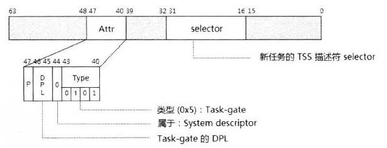

- 1 IDTR寄存器
    - 1.1 加载IDTR寄存器
- 2 IVT（Interrupt Vector Table）
    - 2.1 IVT表的重定位
- 3 IDT（Interrupt Descriptor Tbale）
    - 3.1 IDT base
    - 3.2 IDT limit
    - 3.3 为什么要减1
- 4 gate描述符
    - 4.1 legacy保护模式下的Interrupt-gate与Trap-gate描述符
    - 4.2 IA-32e模式下的Interrupt-gate与Trap-gate描述符
    - 4.3 Task-gate描述符

# 1. IDTR寄存器

IDTR寄存器的结构如下所示。


IDTR寄存器的作用如下：
1. 提供IDT（中断描述符表）或者IVT（中断向量表）的**线性基地址**。
2. 提供IDT或IVT的段limit。

- 在实模式下，IDTR.base是IVT的地址。
- 在保护模式下，IDTR.base是IDT的地址。

> 处理器在power-up或reset后IDTR.base的值为0，因此在实模式下IVT初始化在0地址上。

## 1.1 加载IDTR寄存器

软件在CPL=0权限下使用LIDT指令来加载LDTR寄存器。
```asm
    dd 66h                           ; 在实模式下使用32位operand size
    lidt [IDT_POINTER]               ; 加载IDTR寄存器
    
    ...
    
    ; 定义IDT pointer
IDT_POINTER:
    IDT_LIMIT dw IDT_END - IDT - 1   ; IDT limit
    IDT_BASE  dd IDT
```
LIDT指令的操作数是memeory操作数，低16位存放IDT的limit值，在32位的operand-size下高32位存放IDT的32位base线性地址。
当使用64位operand-size时，高64位存放64位的线性地址。

> 当使用16位的operand-size时，32位的base地址只有低24位是有效的。

# 2. IVT（Interrupt Vector Table）

在实模式下，中断的调用使用IVT（中断向量表），这是有别于保护模式的IDT（Interrupt Descriptor Table）的。


在IVT里，每一个entry都是far pointer形式（16:16），直接提供目标中断服务例程的segment和offset值（低16位为offset，高16位为segment）。

典型地，IDTR.base为0，因此IVT定位在地址0的位置上，占据了0 ~ 3FFh共1K的区域。这个IDTR.base是可以修改的，使用LIDT指令进行重新定位。

## 2.1 IVT表的重定位

像DOS这类实模式操作系统使用初始化的IDTR值，它的base为0，limit为FFFFh。
```asm
    sidt [old_IVT]                  ; 保存原来的IVT pointer
    mov cx, [old_IVT]
    mov [new_IVT], cx               ; 读取原IVT的limit值
    mov dowrd [new_IVT + 2], 0x1000 ; 新的IVT地址
    mov si, [old_IVT + 2]
    mov di, [new_IVT + 2]
    rep movsb                       ; 复制原IVT entry到新的IVT上
    
    lidt [new_IVT]                  ; IVT的重定位
```
上面这段代码演示了在实模式下将IVT从0重新定位在0x1000位置上。由于原IVT的内容已经被复制到新的IVT中，因此新的IVT能被正确地使用。

# 3. IDT（Interrupt Descriptor Tbale）

在保护模式（包括long-mode）下，对中断/异常处理程序的调用通过IDT（中断描述符表）进行，IDTR寄存器的base提供IDT的**线性地址**。

与IVT很大区别，IVT表项直接提供代码的far pointer，而IDT表项则是提供gate描述符，在根据gate描述符得到目标代码入口点。


在legacy保护模式下，IDT里的每个entry是8字节宽的gate描述符，在IA-32e（long-mode）模式下每个entry是16字节宽的gate描述符。
当执行中断指令int 0x80时：
1. legacy保护模式下，从IDTR.base + 0x80 * 8处读取gate描述符。
2. IA-32e模式下，从IDTR.base + 0x80 * 16处读取gate描述符。

## 3.1 IDT base

IDT可以定位在32位线性地址空间中任何位置，在IA-32e模式（long-mode）下可以定位在64位线性地址空间中任何位置。

在IA-32e模式下，这个base地址必须是canonical地址形式，因为实际上64位的线性地址只能用低48位，高16位为符号扩展。

## 3.2 IDT limit

这个limit值于其他的段limit具有相同的特性。当需要IDT内刚好只能容纳32个gate描述符时，也就是支持0 ~ 31号的vector（共32个）：
1. legacy保护模式下，limit可以设为limit = 32 x 8 -1 
2. IA-32e模式下，limit可以设为limit = 32 x 16 -1

## 3.3 为什么要减1

以保护模式的vector 0为例，这个vector有效的偏移是0 ~ 7（8个字节），实际上由于偏移是0开始到N-1为止的范围内，有效数量是N。
例如：4K的范围是从0 ~ 1024。因此，减1是任何段limit值最低的需求。

然而，limit = 32 x 8 - 1 是最为正确的limit设置值，这个值刚好满足legacy保护模式下的的IDT设置，当超过这个值时，意味着可以容纳超过32个gate描述符。

# 4. gate描述符

在legacy保护模式下，IDT可以存放下面的Gate Descriptor。
1. Interrupt-gate descriptor（中断门描述符）
2. Trap-gate descriptor（陷阱门描述符）
3. Task-gate descriptor（任务门描述符）

在IA-32e模式（long-mode）下不存在Task-gate descriptor，因此只能存放：
1. Interrupt-gate descriptor
2. Trap-gate descriptor

- 在legacy保护模式下，每个gate描述符是8字节宽
- 在IA-32e模式下，每个gate描述符被扩展到16字节宽

## 4.1 legacy保护模式下的Interrupt-gate与Trap-gate描述符

Interrupt-gate和Trap-gate描述符的格式是完全一致的，所不同的是描述符类型。


在描述符的Type域中：
1. 1110B为32位的Interrupt-gate描述符。
2. 1111B为32位的Trap-gate描述符。

## 4.2 IA-32e模式下的Interrupt-gate与Trap-gate描述符

在IA-32e模式下（包括64位和compatibility模式），Interrupt-gate与Trap-gate描述符的结构如下所示。


除了被扩展为16字节外，在IA-32e模式（包括compatibility模式）下的Interrupt-gate和Trap-gate描述符增加了一个3位宽的IST（Interrupt Stack Table）指针域，用来提供额外的Stack Pointer。

## 4.3 Task-gate描述符

Task-gate用来找到目标TSS描述符的位置，在通过TSS描述符来定位TSS块，使用TSS块里的数据进行任务切换。



Task-gate描述符仅用于legacy模式。


