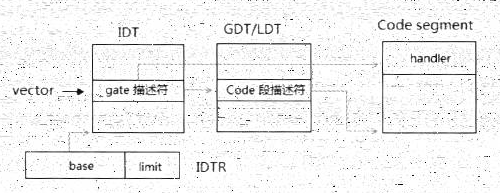
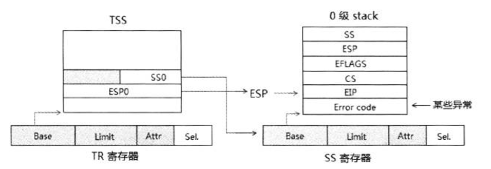

- 概述
- 1 处理器对gate描述符和code描述符的检查
    - 1.1 检查IDT limit
    - 1.2 gate描述符的检查
    - 1.3 目标代码段Selector的检查
    - 1.4 目标代码段描述符的检查
- 2 权限的检查
- 3 权限处理的三种情况
    - 3.1 第一种情形：同级调用
    - 3.2 第二种情形：权限及Stack的切换
        - 3.2.1 读取Stack指针
        - 3.2.2 SS Selector及Descriptor的检查
        - 3.2.3 对ESP值的检查
        - 3.2.4 检查EIP值
        - 3.2.5 加载SS和ESP寄存器
        - 3.2.6 加载CS和EIP寄存器
        - 3.2.6 权限的改变
        - 3.2.7 保存处理器状态
    - 3.3 第三种情形：conforming代码段
    - 3.4 Eflags标志位的处理器
    - 3.5 执行中断/异常处理器程序
- 4 中断/异常调用中的任务切换

# 概述

当中断或异常发生时，处理器最终的目的将是调用相应的中断/异常处理程序进行处理，看看下面的中断/异常服务例程调用流程（保护模式下）。



下面我们看看在保护模式和IA-32额模式下，处理器需要经过什么步骤达到执行处理程序。

# 1. 处理器对gate描述符和code描述符的检查

在成功加载CS和EIP寄存器之前，处理器会对gate描述符和code描述符、vector以及Selector进行检查。

## 1.1 检查IDT limit

在读取gate描述符的时候，处理器将检查vector是否超出IDT的limit。

```c
    if (IA32_EFER.LMA == 1)             // 是否处于long-mode
        descriptor_size = 16;           // 16个字节
    else
        descriptor_szie = 8;            // 8个字节
        
    if (IDTR.limit >= vector * descriptor_size + (descriptor_size - 1))
        //pass
    else
        //failed：raise #GP Exception
```
如果处理器当前处于IA-32e模式（long-mode），那么gate描述符的大小是16字节，否则在保护模式下是8个字节。

IDTR.limit的值必须大于等于：
- 在legacy模式下：vector * 8 + 7
- 在IA-32e模式下：vector * 16 + 15

加上7（legacy保护模式下）或加15（IA-32e模式下）是为了确保一个完整的gate描述符不超过limit值，这样才被通过。
否则失败将产生#GP异常。而这个#GP异常也必然会导致#DF（Double Fault）异常的发生，最后结果机器将RESET。

## 1.2 gate描述符的检查

处理器会对gate描述符进行一系列的合规检查，代码如下所示、

```c
    if (IA32_EFER.LMA == 1) {     // IA-32e模式下 
        if (gate_descriptor.type == interrupt_gate_64 
            || gate_descriptor.type == trap_gate_64) {  // 64位的中断或陷阱门
            
            // pass
        } else {
            // failed：raise #GP Exception
        }
    } else {
        if (gate_descriptor.type == INTERRUPT_GATE 
            || gate_descriptor.type == TRAP_GATE
            || gate_descriptor.type == TASK_GATE) {
            
            // pass
        } else {
            // failed：raise #GP Exception
        }
    }
    
    if (gate_descriptor.S == 1) {
        // failed：raise #GP Exception
    }
    
    if (gate_descriptor.P == 0) {
        // failed：raise #NP Exception
    }
```

处理器检查下面几个方面：
1. 在legacy保护模式下，描述符的类型是否为Interrupt-gate、Trap-gate或者Task-gate。
2. 在IA-32e模式下，描述符的类型是否为64位的Interrupt-gate或Trap-gate。
3. 描述符的S标志位需为0，它是System Descriptor，否则产生#GP异常。
4. 描述符的P标志位需为1，它是Present的，否则产生#NP异常。

实际情况可能会更复杂，在legacy保护模式下：
- Interrupt-gate和Trap-gate分别为32位和16位；
- IA-32e模式下，Interrupt-gate和Trap-gate是固定为64位的。

## 1.3 目标代码段Selector的检查

处理器将从gate描述符里读取Selector，处理器会对这个Selector进行检查。

```c
    // 读取gate描述符的Selector
    selector = gate_descriptor.selector;            
    
    // 检查是否属于NULL Selector
    if (selector == 0  || selector == 1 || selector == 2 || selector == 3)
        // failed：raise #NP Exception
        
    //  检查Selector是否超越Limit
    if (selector.TI == 0)
        limit = GDTR.limit      
    else 
        limit = LDTR.limit
        
    if (IA32_EFER.LMA == 0) {  // legacy模式下
        if (limit >= (selector & 0xFFF8 + 7) {
            // pass
        } else {
            // failed：raise #GP Exception
        }
    }
```

我们看到，处理器将检查两个方面：
1. 是否为Null Selector
2. Selector是否超出descriptor table的Limit

当Selector值为0、1、2、3时，这个Selector属于Null Selector，处理器将产生#GP异常。

Selector的TI标志决定Code Segment Descriptor在GDT还是LDT内，这个描述符表的Limit必须大于等于：
- Selector & 0xFFFF8 + 7 等价于 (Selector >> 3) * 8 + 7

值得注意的是。无论是在legacy模式还是在IA-32e模式下，Code Segment Descriptor依然是8字节宽。
而在64位模式下不会检测CS Selector是否超出Limit。

## 1.4 目标代码段描述符的检查

在上面的检查通过后，处理器使用Selector在GDT/LDT里读取目标的代码段描述符，处理器将对目标代码段描述符进行检查，如下所示。

```c

    if (code_descriptor.C_D == 0            // 属于Data段
       || code_descriptor.S == 0) {         // 属于System段
           
        // failed: raise #GP Execption
    }
    
    if (code_descriptor.P == 0) {            // not present
        // failed: raise #NP Execption
    }
    
    if (IA32_EFER.LMA == 1) {
        if (code_descriptor.L == 1 && code_descriptor.D == 0) {
            // pass：L=1，D=0
        } else {
            // failed：not 64bit code，raise #GP Execption
        }
    }
```

我们看到处理器检查：
1. 目标描述符类型是否为Code Segment Descriptor，否则将产生#GP异常。
2. 描述符的S标志是否为1，否则产生#GP异常。
3. 描述符的P标志是否为1，否则产生#NP异常。
4. 在IA-32e模式下目标代码必须是64位代码，Code Segment Descriptor的L标志位为1并且D标志位为0（指示中断/异常处理器程序运行在64位模式）。

我们看到，由于在IA-32e模式下，中断/异常处理器程序是运行在64位模式下，因此目标代码段描述符的L=1并且D=0。

然而在legacy保护模式下，目标代码可以是32位或16位的代码，具体取决于D标志位。

# 2. 权限的检查

处理器同样会进行相关的权限检查，如下所示。

```c
    if (IA32_EFER.LMA == 1) {       // in IA-32e mode
        if ((opcode == 0xCE) && (CS.L == 1)) {
            // failed：在64位模式下不支持INTO指令，产生#UD异常
        }
    }
    
    if (opcode == 0xCD || opcode == 0xCC || opcode == 0xCE) {
        
        // 属于INT，INT3，INTO指令，则需要进行权限检查
        if ((CPL <= gate_descriptor.DPL) && (CPL >= code_descriptor.DPL)) {
            // pass
        } else {
            // failed：raise #GP Execption
        }
    }
```

然而处理器只会对使用下面的指令来调用中断/异常处理器程序时进行权限检查：
1. INT指令：提供一个vector，由int指令（opcode为0xCD）主动发起调用中断处理器程序。
2. INT3指令：这是断点异常指令（opcode为0xCC），由这条指令调用#BP异常处理程序。
3. INTO指令：这是溢出异常调用指令（opcode为0xCE），由这条指令调用#OF异常处理程序。

上面由软件调用的中断/异常，处理器才会进行权限检查，让软件对重要的代码及数据进行受限制的访问。

在下面的中断/异常处理程序调用情形里，处理器不会进行权限检查：
1. 处理器接到到硬件中断请求（例如：由INTR和NMI pin接收的中断或者APIC产生的中断）而调用中断处理程序时。
2. 软件发生异常而调用相应的异常处理程序。
```asm
    mov eax, [eax]      ; 产生#PF异常，忽略权限检查
    int 14              ; 直接14号#PF处理程序，处理器将进行权限检查
```
如上面代码所示，同样是对#PF异常处理程序调用，使用INT指令直接调用，处理器将会进行权限检查。

> 另一个不同之处是：使用int指令调用异常处理程序，处理器不会压入error code。

这个权限检查中，所需要的权限必须如下：
1. CPL <= gate描述符的DPL
2. CPL >= 目标code段描述符的DPL

这里揭示了中断/异常处理程序运行在高权限级别里，不同于Call-gate的调用，中断调用不使用Selector，因此没有RPL需要检查。

# 3. 权限处理的三种情况

在调用中断/异常的处理器程序时，会遇到3种权限情形需要处理。

```c
    if (code_descriptor.C == 0) { // non-conforming代码段
        if (CPL == code_descriptor.DPL) {
        
            // 同级调用：代码段，权限和Stack都不改变
            
        } else if (CPL > code_descriptor.DPL) {
            
            // 代码段，权限和Stack都会切换
            
        } else {
            
            // Failed：Raise #GP Execption
            
        }
        
    } else { // conforming代码段
        // 同级调用：切换到目标代码段，权限和Stack不改变
    }
```
如上面代码所示，这三种情形如下：
1. 目标代码段是non-conforming类型，当CPL的值等于目标Code段的DPL值时，这是同级调用，代码段、权限和Stack都不改变。
2. 目标代码段是non-conforming类型，当CPL的值大于目标Code段的DPL值时，将切换到高权限代码，Stack也会发生切换。
3. 目标代码段是conforming类型，会发生代码段的切换，可是权限和Stack不会改变。

第1种和第3种情形虽然权限和Stack都不改变，但它们是有区别的，conforming类型的段会发生代码的切换（即CS会被刷新，加载目标段描述符）。

## 3.1 第一种情形：同级调用

当CPL等于Code Segment Descriptor的DPL时，指示当前运行代码和中断/异常处理程序运行在相同的权限级别中。因此处理器无须进行stack的切换。

处理器会依次在当前的Stack里压入下面的状态：
1. eflags寄存器的值：对于INT指令调用来说，是INT指令执行前的值。对于异常来说取决于其类型属于fault还是trap。
2. CS寄存器的值。
3. EIP寄存器的值：对于INT指令调用来说，是INT指令的下一条指令地址。对于异常来说取决于其类型属于fault还是trap。
4. 发生异常时，某些异常需要加入error code。

可是实际上，远比我们想象的要复杂的多，如下面的代码所示。

```c
    if (CPL == code_descriptor.DPL) {
        
        switch (gate_descriptor.type) {
            case Interrupt_gate_16:
            case Trap_gate_16:
                push(flags);
                push(cs);
                push(ip);
                push(error_code);
                break;
            
            case Interrupt_gate_32:
            case Trap_gate_32:
                push(eflags);
                push(cs);
                push(eip);
                push(error_code);
                break;
                
            case Interrupt_gate_64:
            case Trap_gate_64:
                rsp = rsp & 0xFFFFFFFF_FFFFFFFF0;   // 调整到16字节对齐
                push(ss);
                push(rsp);
                push(rflags);
                push(cs);
                push(rip);
                push(error_code);
                break;
        }
    }
```

由于在legacy模式下，Interrupt-gate和Trap-gate可以是32位或者16位，因而造成了这些复杂的情形。
1. 使用16位的Interrupt/Trap-gate时，压入的是16位的值。
2. 使用32位的Interrupt/Trap-gate时，加入的是32位的值。

在IA-32e模式下进入64位的中断服务例程，情况变的统一起来，只存在64位的Interrupt/Trap-gate，处理器将：
1. 固定加入SS和RSP，无论是否权限发生改变。
2. 在压栈前，RSP会被调整到16字节的边界上。

## 3.2 第二种情形：权限及Stack的切换

当CPL大于Code Segment Descriptor的DPL时，意味着目标处理程序的运行权限高于当前代码的权限，这是就会发生权限及Stack的切换。情况变的更加复杂。

### 3.2.1 读取Stack指针

处理器根据目标Code段描述符的DPL值，在当前TSS段里读取对应权限级别的stack指针。
1. 在legacy模式下，包括SS和ESP值。
2. 在IA-32e模式下读取RSP值。

同样，实际情况页比我们想象的要复杂得多，如下面代码所示。

```c
    if (CPL > code_descriptor.DPL) {
        
        if (IA32_EFER.LMA == 0) {           // in legacy mode
        
            swtich (TR.attribute.type) {
                case TSS_16:
                    stack_pointer = TR.base + code_descriptor.DPL * 4 + 2;
                    if (stack_pointer + 3 > TR.limit) {
                        // faild：raise #TS Execption
                    }
                    new_ss = stack_pointer + 2;     // 读取16位的SS临时保存
                    new_sp = stack_pointer + 0;     // 读取16位的SP临时保存
                
                case TSS_32:
                    stack_pointer = TR.base + code_descriptor.PDL * 8 + 4;
                    if (stack_pointer + 5 > TR.limit) {
                        // faild：raise #TS Execption
                    }
                    new_ss = stack_pointer + 4;     // 读取16位的SS临时保存
                    new_esp =  stack_pointer;       // 读取32位的ESP临时保存
                    break;
            }
        
        } else if (IA32_EFER.LMA == 1) {    // in IA-32e mode
            if (gate_descriptor.IST != 0) {  // 使用gate描述符的IST指针
                // 找到TSS的IST域
                stack_pointer = TR.base + gate_descriptor.IST * 8 + 36;
            } else {
                stack_pointer = TR.base + gate_descriptor.DPL * 8 + 4;
            }
            
            if (stack_pointer + 7 > TR.limit) {
                // faild：raise #TS Execption
            }
            new_rsp = stack_pointer;        // 读取64位的RSP值
            new_ss = code_descriptor.DPL;   // 新的SS被加载到为Null Selector
        }
    }
```

这个复杂的情况同样是由于在legacy模式下TSS分为16位和32位，而在IA-32e模式下中断/异常调用使用64位的TSS段。

> 值得注意的是：在compatibility模式下TSS和legacy模式一致，可是在中断/异常调用情况下使用64位的TSS。

我们看到，由于TSS的不同寻找stack pointer的地址也不同：
1. 在16位的TSS段下：
```c
    stack_pointer =  TR.base + code_descriptor.DPL * 4 + 2;
```
每个stack pointer是4字节宽，包括：16位的SP和16位的SS值，由当前的TSS段基地址加上2（跳过2个字节的task link域）而来。

2. 在32位的TSS段下：
```c
    stack_pointer =  TR.base + code_descriptor.DPL * 8 + 4;
```
每个stack pointer是8字节宽，包括：32位的ESP和32位的SS值（高16位为0），由当前的TSS段基地址加上4（跳过4个字节的task link域）而来。

3. 在IA-32e模式下，就很大不同了：
- 如果使用gate描述符的IST域，就从IST域里获得stack pointer：每个IST域是8字节宽，加上当前的TSS段基地址，然后跳过36个字节（RSP及保留域）。
- 否则从RSP域里获得stack pointer：每个RSP域是8字节，加上当前的TSS段基地址，然后跳过4个字节的task link域。

在IA-32e模式下，如果发生权限改变，目标代码段的DPL不为3，处理器将为SS加载一个Null Selector。
```c
    new_ss = code_descriptor.DPL;    // 加载Null Selector
```
这个Null Selector是目标代码的DPL值，即：0、1或者2（不能为3）。

当读取到TSS段里的SS和SP/ESP/RSP值后，将临时保存起来，用于处理器的检查（当加载到SS和SP/ESP/RSP寄存器时，原SS和SP/ESP/RSP也将临时保存起来，用于压入stack中）。

我们看到处理器会对TSS的limit进行检查：
1. 在16位TSS段下，每个stack pointer是4个字节，因此stack pointer需加上3来检查一个完整的stack pointer边界，通过和TR.limit进行比较（当前TSS的limit）。
2. 在32位TSS段下，每个stack pointer是8个字节，可是SS域的高16时保留的，处理器会读取6个字节。因此，stack pointer需要加上5检查一个完整的stack pointer边界（16位的SS和32位的ESP值）。
3. 在64位模式下，每个stack pointer是8个字节，因此需要加上7来检查一个完整的stack pointer边界。

> 在IA-32e模式（包括64位和compatibility模式）下，在调用64位的Interrupt/Exception处理程序中，因此都是64位的TSS段。可是TSS在compatibility模式下和legacy模式一样，可以为16位和32位。</br>与TSS相关而引发的异常，处理器将产生#TS（invalid TSS）异常，如：当处理器检查到stack pointer超出TSS段的limit时，会产生#TS异常。

### 3.2.2 SS Selector及Descriptor的检查

在将TSS段的SS和SP/ESP值加载到SS寄存器和SP/ESP寄存器前，处理器也将进行一系列非常复杂的检查，如下所示。

```c
    if (IA32_EFER.LMA == 0) {       // legacy模式
        
        if (new_ss == 0 || new_ss == 1 || new_ss == 2 || new_ss ==3) {
            // failed：raise #TS Exception
        }
        
        // 检查SS Selector
        limit = new_ss.TI == 0 ? GDTR.limit : LDTR.limit;
        if ((new_ss & 0xFFF8 + 7) > limit) {
            // failed：raise #TS Exception
        }
        
        // 检查SS.RPL是否匹配
        if (new_ss.RPL != code_descriptor.DPL) {
            // failed：raise #TS Exception
        }
        
        // 读取Data段描述符
        base = new_ss.TI == 0 ? GDT.base : LDT.base;
        descriptor = base + new_ss & 0xFFF8;
        
        // 检查Descriptor
        if (descriptor.S == 0) {
            // failed：raise #TS Exception，属于system descriptor
        }
        
        if (descriptor.C_D == 1) {
            // failed：raise #TS Exception，属于read-only
        }
        
        if (descriptor.DPL != code_descriptor.DPL) {
            // failed：raise #TS Exception，权限不匹配
        }
        
        if (descriptor.P == 0) {
            // failed：raise #TS Exception，not present
        }
    }
```
在legacy模式下，处理器对SS Selector的检查包括：
1. SS Selector是否为Null Selector，如果是则产生#TS异常。
2. SS Selector是否超出GDT或LDT的limit，如果是则产生#TS异常。
3. SS Selector的RPL值是否等于目标Code段的DPL值，不等于则产生#TS异常。

处理器通过SS Selector检查后，将使用这个SS Selector在GDT或LDT里读取Stack的Data Segment Descriptor。

并且，开始对这个descriptor进行一系列的检查，descriptor的类型需要符合下列条件：
1. descriptor的S标志位必须为1，指示它是non-system类型的段。
2. descriptor的C/D标志位必须为0，指示它是一个data类型的段。
3. descriptor的W标志位必须为1，指示它是一个Writable（可写的）类型的段。

如果违反上面的3种条件，处理器会产生#TS异常。

处理器也会对这个用于Stack的Data Segment Descriptor的权限进行检查：
- descriptor的DPL必须等于目标Code Segment Descriptor的DPL值，否则产生#TS异常。Stack的Data Segment Descriptor还必须符合。
- descriptor的P标志位必须为1，指示它是present。否则产生#SS异常。

在上面的检查中我们看到，除了Stack Segment Descriptor的P=0时将产生#SS异常外，所有其他由TSS段内的SS Selector引发的异常都为#TS异常。

然而，在IA-32e模式下，处理器并不会检查SS，因为SS不需要从TSS段中读取，相反，从上一步可以看到，处理器会为SS加载Null Selector，并且也不会从GDT/LDT中读取descriptor。

### 3.2.3 对ESP值的检查

在上面我们看到了对SS Selector及Stack Segment Descriptor的检查，处理器也会对TSS段内的ESP值进行检查，代码如下所示。

```c
    switch (gate_descriptor.type) {
        
        case interrupt_gate_16:
        case trap_gate_16:
            if (new_esp + 6 * 2 > new_ss.limit) {
                // failed：超过limit，raise #SS Exception
            }
            break;
        
        case interrupt_gate_32:
        case trap_gate_32:
            if (new_esp + 6 * 4 > new_ss.limit) {
                // failed：超过limit，raise #SS Exception
            }
            
        case interrupt_gate_64:
        case tarp_gate_64:
            // 检查canonical地址形式
            if (new_rsp & 0xFFF000_00000000 == 0xFFFF0000_00000000) {
                // pass：属于canonical地址
            } else if (new_rsp & 0xFFFF0000_00000000 == 0) {
                // pass：属于canonical地址
            } else {
                // failed：不属于canonical地址，raise #SS Exception
            }
            break;
    }
```
在legacy模式下，处理器会检查：
1. 如果使用16位的Interrupt/Trap-gate描述符，则检查stack是否能容纳下将要压入stack中的12个字节，它们是SS、SP、Flags、CS、IP以及Error Code这6个值，每个值2个字节宽，共12个字节。
2. 如果使用32位的Interrupt/Trap-gate描述符，则检查stack是否能容纳下将要压入stack中的24个字节，它们是SS、ESP、Eflags、CS、EIP以及Error Code这6个值，每个值4个字节宽，共24个字节。

在IA-32e模式下，处理器并不检查Stack的limit，但是处理器需要检查RSP的值是否属于canonical地址形式（高16位是符号扩展）。
1. 当高16位为0xFFFF时，即全1，属于canonical地址。
2. 当高16位为0x0000时，即全0，属于canonical地址。

否则RSP值不属于canonical地址，处理器将产生#SS异常。

### 3.2.4 检查EIP值

处理器还会对gate描述符内的目标代码offset值进行检查。

```c
    offset = gate_descriptor.offset;    // 目标代码地址
    
    if (IA32_EFER.LMA == 1) {
        // 检查canonical地址形式
        if (offset & 0xFFFF0000_00000000 == 0xFFFF0000_00000000) {
            // pass：属于canonical地址
        } else if (offset & 0xFFFF0000_00000000 == 0) {
            // pass：属于canonical地址
        } else {
            // failed：不属于canonical地址，raise #SS Exception
        }
    } else {
        if (offset > code_descriptor.limit) {
            // failed：raise #GP Exception
        }
    }
```
- 在IA-32e模式下，处理器检查64位的offset值是否属于canonical地址形式，不是的话产生#GP异常。
- 在legacy模式下，处理器检查offset是否超出目标代码段的limit值。

### 3.2.5 加载SS和ESP寄存器

上面的所有检查都通过后，处理器会加载TSS段的SS和SP/ESP/RSP值到寄存器中，如下列代码所示。

```c
    if (IA32_EFER.LMA == 1) {       // in IA32-e mode
        old_ss = ss;                // 临时保存原SS值
        old_rsp = rsp;              // 临时保存原RSP值
        ss = new_ss;                // 这个new_ss属于Null Selector
        rsp = new_rsp;              // 加载RSP寄存器
        rsp &= 0xFFFFFFFF_FFFFFFF0; // RSP调整16字节边界上
    } else {
        old_ss = ss;                // 临时保存原SS值
        old_esp = esp;              // 临时保存原ESP值
        ss = new_ss;                // 加载SS寄存器
        esp = new_esp;              // 加载ESP寄存器
    }
```
处理器将临时的SS和ESP值加载到SS和ESP寄存器里。在加载之前，处理器会先临时保存原有的SS和ESP值。在加载SS寄存器的同时，也意味着处理器将加载Data Segment Descriptor到SS寄存器里，更新SS寄存器的cache信息。

- 在legacy模式下：ESP寄存器的宽度由stack segment descriptor的B标志位决定，当B=1时使用32位的ESP寄存器，当B=0时使用16位的SP寄存器值。
- 在IA-32e模式下：SS寄存器被加载为Null Selector，并且压栈保存原数据之前rsp会被调整到16字节边界上。

### 3.2.6 加载CS和EIP寄存器

处理器接着加载CS和EIP寄存器。

```c
    if (IA32_EFER.LMA == 1) {
        old_cs = cs;                        // 临时保存cs
        old_rip = rip;                      // 临时保存rip
        cs = gate_descriptor.selector;      // 加载新cs
        rip = gate_descriptor.offset;       // 加载新rip
    } else {
        old_cs = cs;                        // 临时保存cs
        old_eip = eip;                      // 临时保存eip
        cs = gate_descriptor.selector;      // 加载新cs
        eip = gate_descriptor.offset;       // 加载新eip
    }
```
同时在加载CS和EIP之前，处理器会先临时保存原来的CS和EIP值。然后处理器将gate描述符的selector和offset的值分别加载到CS和EIP寄存器中，这里依赖于gate描述符的类型。
1. 当gate描述符属于16位的Interrupt/Trap-gate时，将读取16位的offset值。
2. 当gate描述符属于32位的Interrupt/Trap-gate时，将读取32位的offset值。
3. 在IA-32e模式下，读取64位的offset值。

最终使用的Instruction Pointer宽度由Code段描述符的D标志和L标志（使用在IA-32e模式）来决定：
- 当D=1时：使用32位的EIP寄存器
- 当D=0时：使用16位的IP寄存器

处理器加载CS寄存器的同时，也意味着将加载Code Segment Descriptor到CS寄存器里，更新CS寄存器的cache信息。

### 3.2.6 权限的改变

在加载CS寄存器的同时，处理器会更新CPL值，如下所示。
```c
    CS.RPL = code_descriptor.DPL;       // 更新CS.RPL域，切换到高级别
    CPL = CS.RPL;                       // CPL = CS.RPL值
```
CS寄存器的RPL值被更新为目标Code Segment descriptor的DPL值，那么将切换到高权限级别上。而当前的CPL就是CS.RPL值或者SS.RPL值。

在SS Selector的检查过程中，SS.RPL的值必须是等于目标Code Segment Descriptor的DPL的。

### 3.2.7 保存处理器状态

在上一节的工作完成后，意味着权限和stack已经完成切换，处理器将在新的stack里依次压入原来的状态。



代码如下所示。

```c
    switch (gate_descriptor.type) {
        case Interrupt_gate_16:
        case Trap_gate_16:
            push(old_ss);
            push(old_sp);
            push(flags);
            push(old_cs);
            push(old_ip);
            push(error_code);
            break;
        
        case Interrupt_gate_32:
        case Trap_gate_32:
            push(old_ss);
            push(old_esp);
            push(eflags);
            push(old_cs);
            push(old_eip);
            push(error_code);
            break;
        
        case Interrupt_gate_64:
        case Trap_gate_64:
            push(old_ss);
            push(old_rsp);
            push(rflags);
            push(old_cs);
            push(old_rip);
            push(error_code);
            break;
    }
```
依次加入的状态包括：原来的SS、ESP、Eflags、CS、EIP以及必要时压入error code值。这些状态值的宽度取决于gate描述符的类型：
1. 当为16位的Interrupt/Trap-gate时，压入16位的状态值。
2. 当为32位的Interrupt/Trap-gate时，压入32位的状态值。
3. 在IA-32e模式下，使用64位的Interrupt/Trap-gate，将压入64位的状态值。

## 3.3 第三种情形：conforming代码段

当目标代码段属于conforming类型时，处理器加载CS寄存器，代码如下所示。

```c
    if (code_descriptor.C == 1) {   // conforming代码段
        ... ...
        
        cs = gate_descriptor.selector;  // 加载CS寄存器
        cs.RPL = CPL;                   // CS.RPL更新为当前的CPL值
        ... ...
    }
```

CS.RPL值被更新为当前的CPL，切换到目标代码后，权限并不会切换（级保持原CPL值）。

假如Selector的值为0x78（Selector.RPL=0），当前CPL=3（处于用户代码级权限），那么切换到目标代码后，CS的值将变为0x7b，CS.RPL=3（保持当前的CPL为3级）。

由于SS和ESP值不会被改变，因此在进行压栈处理时将使用原stack pointer，处理的方法与同级调用情形时一致的。

## 3.4 Eflags标志位的处理器

在执行Interrupt和Exception的处理程序之前，处理器做最后的一步工作，就是请Eflags寄存器的某些标志位。
```c
    if (gate_descriptor.type == interrupt_gate_16
        || gate_descriptor.type == interrupt_gate_32
        || gate_descriptor.type == interrupt_gate_64) {
    
        eflags.IF = 0;        
    }
    
    eflags.TF = 0;
    eflags.VM = 0;
    eflags.RF = 0;
    eflags.NT = 0;
```
当gate描述符属于Interrupt-gate时，处理器将清IF标志位，关闭可屏蔽中断的相应。对于Trap-gate类型，处理器将保持IF标志位不变。

同时，TF、VM、RF以及NT标志位都被清0。

## 3.5 执行中断/异常处理器程序

来到这里，处理器已经加载完SS、ESP、CS和EIP寄存器，并且在stack上保存原状态。处理器将从CS:EIP位置上开始执行中断/异常的处理程序。

# 4. 中断/异常调用中的任务切换

在IA-32e模式下，IDT内部支持Task-gate描述符，而在legacy模式下，gate描述符可以是16位Task-gate或32位Task-gate描述符。

在中断/异常处理器程序的调用中，如果gate描述符是Task-gate，处理器将产生任务切换。
```c
    if (IA32_EFER.LMA == 1 ) {        // in IA-32e mode
        if (gate_descriptor.type == TASK_GATE) {
            // failed：不支持Task-gate，raise #GP Exception
        }
    } else {
        if (gate_descriptor.type == TASK_GATE) {
            // 将产生任务切换
        }
    }
```
- 在IA-32e模式下，处理器检测到gate描述符是Task-gate则产生#GP异常。
- 在legacy模式下，将使用这个Task-gate进行任务切换。

